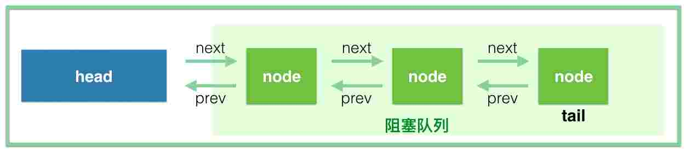
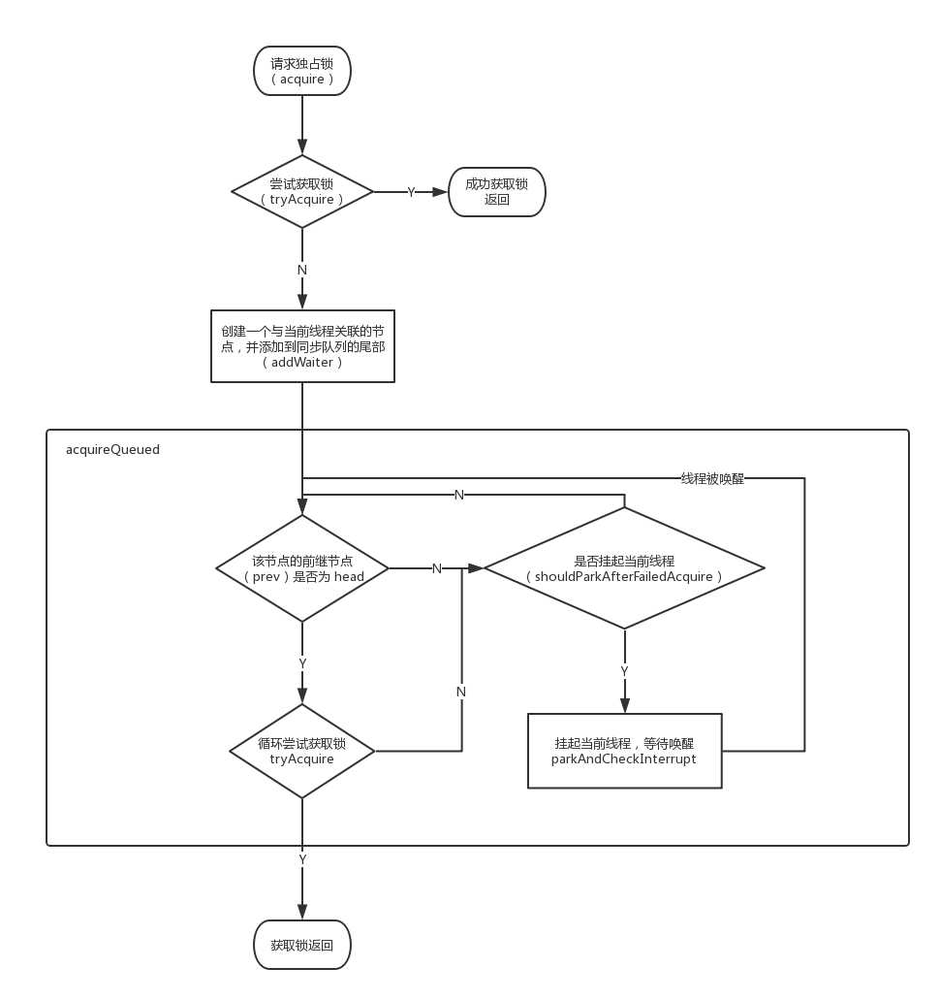
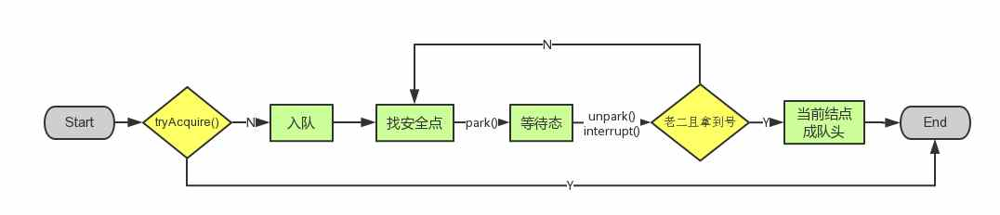
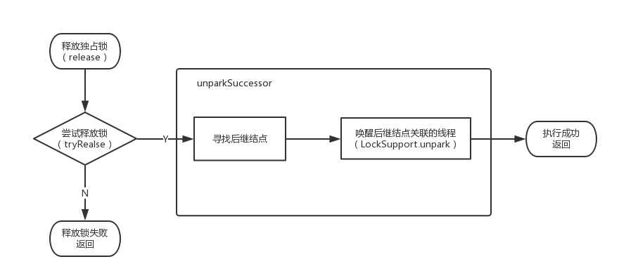
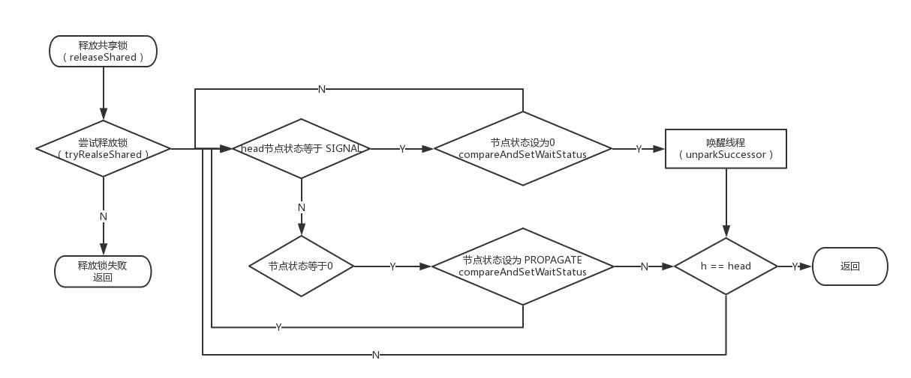
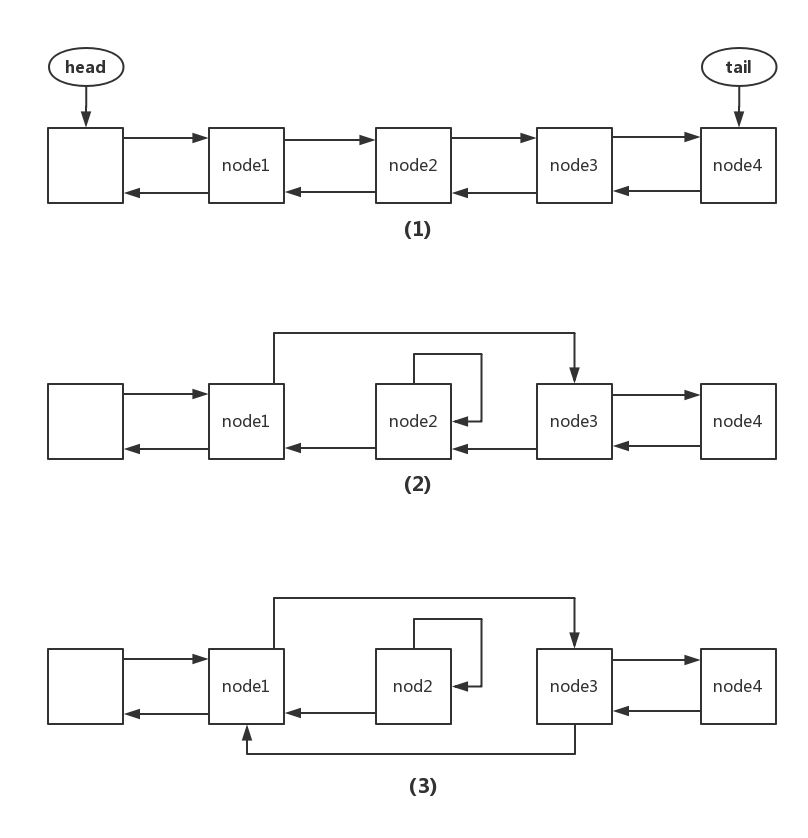

# AQS 源码解读

> `AbstractQueuedSynchronizer `抽象的队列式的同步器，AQS定义了一套多线程访问共享资源的同步器框架，许多同步类实现都依赖于它。
> 如常用的`ReentrantLock`、`Semaphore`、`CountDownLatch`、`FutureTask` ...。

[参照](https://www.cnblogs.com/waterystone/p/4920797.html#4302396)

## AQS结构

```java
// 头结点，可以看做 当前持有锁的线程 可能是最好理解的
private transient volatile Node head;

// 阻塞的尾节点，每个新的节点进来，都插入到最后，也就形成了一个链表
private transient volatile Node tail;

// 这个是最重要的，代表当前锁的状态，0代表没有被占用，大于 0 代表有线程持有当前锁
// 这个值可以大于 1，是因为锁可以重入，每次重入都加上 1
private volatile int state;

// 代表当前持有独占锁的线程，举个最重要的使用例子，因为锁可以重入
// reentrantLock.lock()可以嵌套调用多次，所以每次用这个来判断当前线程是否已经拥有了锁
// if (currentThread == getExclusiveOwnerThread()) {state++}
private transient Thread exclusiveOwnerThread; //继承自AbstractOwnableSynchronizer
```



AQS的等待队列，它维护了一个 `volatile int state`（代表共享资源）和一个FIFO线程等待队列（即CLH队列）（多线程争用资源被阻塞时会进入此队列）。这里 `volatile` 是核心关键词。

> CLH锁即Craig, Landin, and Hagersten (CLH)，CLH锁也是一种基于链表的可扩展、高性能、公平的自旋锁，线程只需要在本地自旋，查询前驱节点的状态，如果前驱节点释放了锁，就结束自旋。

`state`的访问方式有三种：

- `getState()`
- `setState()`
- `compareAndSetState()`

### Node 实例

等待队列中每个线程被包装成一个 Node 实例，数据结构是链表。

```java
static final class Node {
    // 标识节点当前在共享模式下
    static final Node SHARED = new Node();
    // 标识节点当前在独占模式下
    static final Node EXCLUSIVE = null;

    // ======== 下面的几个int常量是给waitStatus用的 ===========
    /** waitStatus value to indicate thread has cancelled */
    // 代码此线程取消了争抢这个锁
    static final int CANCELLED =  1;
    /** waitStatus value to indicate successor's thread needs unparking */
    // 官方的描述是，其表示当前node的后继节点对应的线程需要被唤醒
    static final int SIGNAL    = -1;
    /** waitStatus value to indicate thread is waiting on condition */
    // 本文不分析condition，所以略过吧，下一篇文章会介绍这个
    static final int CONDITION = -2;
    /** waitStatus value to indicate the next acquireShared should unconditionally propagate */
    // 同样的不分析，略过吧
    static final int PROPAGATE = -3;
    // =====================================================

    // 取值为上面的1、-1、-2、-3，或者0(以后会讲到)
    // 这么理解，暂时只需要知道如果这个值 大于0 代表此线程取消了等待，
    //    ps: 半天抢不到锁，不抢了，ReentrantLock是可以指定timeouot的。。。
    volatile int waitStatus;
    // 前驱节点的引用
    volatile Node prev;
    // 后继节点的引用
    volatile Node next;
    // 这个就是线程本尊
    volatile Thread thread;
  
    // 节点当前在共享模式下返回true
    final boolean isShared() {
        return nextWaiter == SHARED;
    }

    /**
     * Returns previous node, or throws NullPointerException if null.
     * Use when predecessor cannot be null.  The null check could
     * be elided, but is present to help the VM.
     *
     * @return the predecessor of this node
     */
    final Node predecessor() throws NullPointerException {
        Node p = prev;
        if (p == null)
            throw new NullPointerException();
        else
            return p;
    }

    Node() {    // Used to establish initial head or SHARED marker
    }

    Node(Thread thread, Node mode) {     // Used by addWaiter
        this.nextWaiter = mode;
        this.thread = thread;
    }

    Node(Thread thread, int waitStatus) { // Used by Condition
        this.waitStatus = waitStatus;
        this.thread = thread;
    }
}
```


### 结点状态 `waitStatus`

- `CANCELLED(1)`：表示当前结点已取消调度。当timeout或被中断（响应中断的情况下），会触发变更为此状态，进入该状态后的结点将不会再变化。
- `SIGNAL(-1)`：表示后继结点在等待当前结点唤醒。后继结点入队时，会将前继结点的状态更新为SIGNAL。
- `CONDITION(-2)`：表示结点等待在`Condition`上，当其他线程调用了`Condition`的`signal()`方法后，`CONDITION`状态的结点将**从等待队列转移到同步队列中**，等待获取同步锁。
- `PROPAGATE(-3)`：共享模式下，前继结点不仅会唤醒其后继结点，同时也可能会唤醒后继的后继结点。
- `0`：新结点入队时的默认状态。

> 注意，**负值表示结点处于有效等待状态，而正值表示结点已被取消。所以源码中很多地方用>0、<0来判断结点的状态是否正常**。

### AQS定义两种资源共享方式

- `Exclusive`（独占，只有一个线程能执行，如`ReentrantLock`）
- `Share`（共享，多个线程可同时执行，如`Semaphore/CountDownLatch`）

不同的自定义同步器争用共享资源的方式也不同。**自定义同步器在实现时只需要实现共享资源 `state` 的获取与释放方式即可**，至于具体线程等待队列的维护（如获取资源失败入队/唤醒出队等），AQS已经在顶层实现好了。

### 自定义同步器实现时主要实现以下几种方法：

- `isHeldExclusively()`：该线程是否正在独占资源。只有用到`condition`才需要去实现它。
- `tryAcquire(int)`：独占方式。尝试**获取**资源，成功则返回true，失败则返回false。
- `tryRelease(int)`：独占方式。尝试**释放**资源，成功则返回true，失败则返回false。
- `tryAcquireShared(int)`：共享方式。尝试**获取**资源。负数表示失败；0表示成功，但没有剩余可用资源；正数表示成功，且有剩余资源。
- `tryReleaseShared(int)`：共享方式。尝试**释放**资源，如果释放后允许唤醒后续等待结点返回true，否则返回false。

以`ReentrantLock为`例，`state`初始化为0，表示未锁定状态。A 线程`lock()`时，会调用`tryAcquire()`独占该锁并将`state + 1`。此后，其他线程再`tryAcquire()`时就会失败，直到A线程`unlock()`到`state=0`（即释放锁）为止，其它线程才有机会获取该锁。当然，释放锁之前，A线程自己是可以重复获取此锁的（state会累加），这就是可重入的概念。但要注意，获取多少次就要释放多么次，这样才能保证state是能回到零态的。

再以`CountDownLatch`以例，任务分为N个子线程去执行，state也初始化为N（注意N要与线程个数一致）。这N个子线程是并行执行的，每个子线程执行完后`countDown()`一次，`state`会CAS减1。等到所有子线程都执行完后(即state=0)，会`unpark()`主调用线程，然后主调用线程就会从`await()`函数返回，继续后余动作。

一般来说，自定义同步器要么是独占方法，要么是共享方式，他们也只需实现`tryAcquire-tryRelease`、`tryAcquireShared-tryReleaseShared`中的一种即可。但AQS也支持自定义同步器同时实现独占和共享两种方式，如`ReentrantReadWriteLock`。

## 独占锁



### 获取锁

#### `acquire(int)`

独占模式下线程获取共享资源的顶层入口。如果获取到资源，线程直接返回，否则进入等待队列，直到获取到资源为止，且整个过程忽略中断的影响。这也正是`lock()`的语义，当然不仅仅只限于`lock()`。获取到资源后，线程就可以去执行其临界区代码了。

下面是`acquire()`的源码：

```java
public final void acquire(int arg) {
    // 尝试获取锁
    if (!tryAcquire(arg) && 
        // tryAcquire(arg)没有成功，这个时候需要把当前线程挂起，放到阻塞队列中。
        acquireQueued(addWaiter(Node.EXCLUSIVE), arg))
       // 线程自我中断
       selfInterrupt();
}
```

函数流程如下：

1. `tryAcquire()`尝试直接去获取资源，如果成功则直接返回（这里体现了非公平锁，每个线程获取锁时会尝试直接抢占加塞一次，而CLH队列中可能还有别的线程在等待）；
2. `addWaiter()`将该线程加入等待队列的尾部，并标记为独占模式；
3. `acquireQueued()`使线程阻塞在等待队列中获取资源，一直获取到资源后才返回。如果在整个等待过程中被中断过，则返回true，否则返回false。
4. 如果线程在等待过程中被中断过，它是不响应的。只是获取资源后才再进行自我中断`selfInterrupt()`，将中断补上。

#### `tryAcquire(int)`

试去获取独占资源。如果获取成功，则直接返回true，否则直接返回false。这也正是`tryLock()`的语义，还是那句话，当然不仅仅只限于`tryLock()`。

如下是`tryAcquire()`的源码：

```java
protected boolean tryAcquire(int arg) {
    throw new UnsupportedOperationException();
}
```

AQS这里只定义了一个接口，***具体资源的获取交由自定义同步器去实现了（通过state的get/set/CAS）***！！！至于能不能重入，能不能加塞，那就看具体的自定义同步器怎么去设计了！！！当然，自定义同步器在进行资源访问时要考虑线程安全的影响。

这里之所以没有定义成`abstract`，是因为独占模式下只用实现`tryAcquire-tryRelease`，而共享模式下只用实现`tryAcquireShared-tryReleaseShared`。如果都定义成`abstract`，那么每个模式也要去实现另一模式下的接口。说到底，Doug Lea还是站在咱们开发者的角度，尽量减少不必要的工作量。

#### `addWaiter(Node)`

将当前线程加入到等待队列的队尾，并返回当前线程所在的结点。

```java
private Node addWaiter(Node node) {
    // 以给定模式构造结点。node有两种：EXCLUSIVE（独占）和SHARED（共享）
    Node node = new Node(Thread.currentThread(), node);
    
    // 尝试快速方式直接放到队尾。
    Node pred = tail;
    if (pred != null) {
        node.prev = pred;
        if (compareAndSetTail(pred, node)) {
            pred.next = node;
            return node;
        }
    }
    // 上一步失败则通过 enq 入队。
    enq(node);
    return node;
}

// 将node加入队尾
private Node enq(final Node node) {
    // CAS"自旋"，直到成功加入队尾
    for (;;) {
        Node t = tail;
        if (t == null) { // 队列为空，创建一个空的标志结点作为head结点，并将tail也指向它。
            if (compareAndSetHead(new Node()))
                tail = head;
        } else {//正常流程，放入队尾
            node.prev = t;
            if (compareAndSetTail(t, node)) {
                t.next = node;
                return t;
            }
        }
    }
}
```


#### `acquireQueued(Node, int)`

通过`tryAcquire()`和`addWaiter()`，该线程获取资源失败，已经被放入等待队列尾部了。此时线程**进入等待状态休息，直到其他线程彻底释放资源后唤醒自己，自己再拿到资源，执行逻辑。**

1. 结点进入队尾后，检查状态，找到安全休息点；
2. 调用`park()`进入 waiting 状态，等待`unpark()`或`interrupt()`唤醒自己；
3. 被唤醒后，看自己是不是有资格能拿到号。如果拿到，head指向当前结点，并返回从入队到拿到号的整个过程中是否被中断过；如果没拿到，继续流程1。

```java
final boolean acquireQueued(final Node node, int arg) {
    // 标记是否成功拿到资源
    boolean failed = true;
    try {
        // 标记等待过程中是否被中断过
        boolean interrupted = false;
        // “自旋”！
        for (;;) {
            // 拿到前驱
            final Node p = node.predecessor();
            // 如果前驱是head，即该结点已成老二，那么便有资格去尝试获取资源（可能是老大释放完资源唤醒自己的，当然也可能被interrupt了）。
            if (p == head && tryAcquire(arg)) {
                // 拿到资源后，将head指向该结点。所以head所指的标杆结点，就是当前获取到资源的那个结点或null。
                setHead(node);
                // setHead中node.prev已置为null，此处再将head.next置为null，就是为了方便GC回收以前的head结点。也就意味着之前拿完资源的结点出队了！
                p.next = null;
                // 成功获取资源
                failed = false; 
                // 返回等待过程中是否被中断过
                return interrupted;
            }
            // 如果自己可以休息了，就通过park()进入waiting状态，直到被unpark()。
            // 如果不可中断的情况下被中断了，那么会从park()中醒过来，发现拿不到资源，从而继续进入park()等待。
            if (shouldParkAfterFailedAcquire(p, node) && parkAndCheckInterrupt())
                // 如果等待过程中被中断过，哪怕只有那么一次，就将interrupted标记为true
                interrupted = true;
        }
    } finally {
        // 如果等待过程中没有成功获取资源（如timeout，或者可中断的情况下被中断了），那么取消结点在队列中的等待。
        if (failed) 
            cancelAcquire(node);
    }
}

// 检查状态，看看自己是否真的可以进入waiting状态
private static boolean shouldParkAfterFailedAcquire(Node pred, Node node) {
    int ws = pred.waitStatus;// 拿到前驱的状态
    if (ws == Node.SIGNAL)
        // 如果已经告诉前驱拿完号后通知自己一下，那就可以安心休息了
        return true;
    if (ws > 0) {
        // 如果前驱放弃了，那就一直往前找，直到找到最近一个正常等待的状态，并排在它的后边。
        // 注意：那些放弃的结点，由于被自己“加塞”到它们前边，它们相当于形成一个无引用链，稍后就会被GC回收！
        do {
            node.prev = pred = pred.prev;
        } while (pred.waitStatus > 0);
        pred.next = node;
    } else {
         // 如果前驱正常，那就把前驱的状态设置成SIGNAL，告诉它拿完号后通知自己一下。有可能失败，人家说不定刚刚释放完呢！
        compareAndSetWaitStatus(pred, ws, Node.SIGNAL);
    }
    return false;
}

// 如果线程找好安全休息点后，那就可以安心去休息了。此方法就是让线程去休息，真正进入等待状态。
private final boolean parkAndCheckInterrupt() {
    // park()会让当前线程进入waiting状态。在此状态下，有两种途径可以唤醒该线程：1）被unpark()；2）被interrupt()
    LockSupport.park(this);
    // 如果被唤醒，查看自己是不是被中断的。
    return Thread.interrupted(); // Thread.interrupted()会清除当前线程的中断标记位。 
}
```

#### 总结



### 释放锁



#### `release(int)`

独占模式下线程释放共享资源的顶层入口。它会释放指定量的资源，如果彻底释放了（即state=0）,它会唤醒等待队列里的其他线程来获取资源。这也正是`unlock()`的语义，当然不仅仅只限于`unlock()`。

下面是release()的源码：

```java
public final boolean release(int arg) {
    if (tryRelease(arg)) {
        Node h = head;// 找到头结点
        if (h != null && h.waitStatus != 0)
            unparkSuccessor(h);// 唤醒等待队列里的下一个线程
        return true;
    }
    return false;
}
```

> **它是根据`tryRelease()`的返回值来判断该线程是否已经完成释放掉资源了！所以自定义同步器在设计`tryRelease()`的时候要明确这一点！！**

#### `tryRelease(int)`

```java
// 需要独占模式的自定义同步器去实现
protected boolean tryRelease(int arg) {
    throw new UnsupportedOperationException();
}
```

> 如果已经彻底释放资源(state=0)，要返回true，否则返回false。

#### `unparkSuccessor(Node)`

此方法用于唤醒等待队列中下一个线程。**用`unpark()`唤醒等待队列中最前边的那个未放弃线程**

```java
private void unparkSuccessor(Node node) {
    // 这里，node一般为当前线程所在的结点。
    int ws = node.waitStatus;
    // 置零当前线程所在的结点状态，允许失败。
    if (ws < 0)
        compareAndSetWaitStatus(node, ws, 0);
    // 找到下一个需要唤醒的结点s
    Node s = node.next;
    if (s == null || s.waitStatus > 0) {// 如果为空或已取消
        s = null;
        for (Node t = tail; t != null && t != node; t = t.prev) // 从后向前找。
            if (t.waitStatus <= 0)// 从这里可以看出，<=0的结点，都是还有效的结点。
                s = t;
    }
    if (s != null)
        LockSupport.unpark(s.thread);// 唤醒
}
```

此时，再和`acquireQueued()`联系起来，s被唤醒后，进入`if (p == head && tryAcquire(arg))`的判断（即使p!=head也没关系，它会再进入`shouldParkAfterFailedAcquire()`寻找一个安全点。这里既然s已经是等待队列中最前边的那个未放弃线程了，那么通过`shouldParkAfterFailedAcquire()`的调整，s也必然会跑到head的next结点，下一次自旋`p==head`就成立啦），然后s把自己设置成head标杆结点，表示自己已经获取到资源了，`acquire()`也返回了！

#### 小结

`release()`是独占模式下线程释放共享资源的顶层入口。它会释放指定量的资源，如果彻底释放了（即state=0）,它会唤醒等待队列里的其他线程来获取资源。

问题：如果获取锁的线程在release时异常了，没有`unpark`队列中的其他结点，这时队列中的其他结点会怎么办？是不是没法再被唤醒了？

答案：**YES**

```java
@Test
public void testReleaseException() {
    for (int i = 0; i < 2; i++) {
        new MyThread(i).start();
        Uninterruptibles.sleepUninterruptibly(3, TimeUnit.SECONDS);// 确保线程0先启动
    }
    Uninterruptibles.sleepUninterruptibly(1, TimeUnit.DAYS);
}

class MyThread extends Thread {
    private int index;

    public MyThread(int index) {
        this.index = index;
    }

    @Override
    public void run() {
        Thread.currentThread().setName("adu-" + index);

        logger.info("{}:before locke", index);
        lock.lock();
        try {
            logger.info("{}:locking", index);
            if (index == 0) {
                Uninterruptibles.sleepUninterruptibly(3, TimeUnit.SECONDS); // 线程0 sleep 3秒
            }else{
                Uninterruptibles.sleepUninterruptibly(300, TimeUnit.SECONDS); // 线程1 sleep 300秒
            }
        } finally {
            // 通过debug，让线程0在unlock()->release()->unparkSuccessor(Node node)时，强制让node=null，
            // 从而让"int ws = node.waitStatus;"抛出NPE，无法执行后续的unpark操作。
            lock.unlock(); 
            logger.info("{}:after locke", index);
        }
    }
}
```

NPE（`NullPointerException`）后等了很久，线程1都没有得到执行，一直在死等！！

现在我们再回头想想，获取锁的线程在什么情形下会release抛出异常呢？？
1）线程突然死掉了？可以通过`thread.stop`来停止线程的执行，但该函数的执行条件要严苛的多，而且函数注明是非线程安全的，已经标明`Deprecated`；
2）线程被`interupt`了？线程在运行态是不响应中断的，所以也不会抛出异常；
3）release代码有bug，抛出异常了？目前来看，Doug Lea的release方法还是比较健壮的，没有看出能引发异常的情形。除非自己写的`tryRelease()`有bug，那就没啥说的，自己写的bug只能自己含着泪去承受了。

## 共享锁



### 获取共享锁

#### `acquireShared`

此方法是共享模式下线程获取共享资源的顶层入口。它会获取指定量的资源，获取成功则直接返回，获取失败则进入等待队列，直到获取到资源为止，整个过程忽略中断。下面是`acquireShared()`的源码：

```java
public final void acquireShared(int arg) {
    if (tryAcquireShared(arg) < 0)
        doAcquireShared(arg);
}
```

这里`tryAcquireShared()`依然需要自定义同步器去实现。但是AQS已经把其返回值的语义定义好了：负值代表获取失败；0代表获取成功，但没有剩余资源；正数表示获取成功，还有剩余资源，其他线程还可以去获取。

所以这里`acquireShared()`的流程就是：

1. `tryAcquireShared()`尝试获取资源，成功则直接返回；
2. 失败则通过`doAcquireShared()`进入等待队列，直到获取到资源为止才返回。

#### `doAcquireShared`

此方法用于将当前线程加入等待队列尾部休息，直到其他线程释放资源唤醒自己，自己成功拿到相应量的资源后才返回。

```java
private void doAcquireShared(int arg) {
    final Node node = addWaiter(Node.SHARED); // 加入队列尾部
    boolean failed = true; // 是否成功标志
    try {
        boolean interrupted = false; // 等待过程中是否被中断过的标志
        for (;;) {
            final Node p = node.predecessor();// 前驱
            if (p == head) { // 如果到head的下一个，因为head是拿到资源的线程，此时node被唤醒，很可能是head用完资源来唤醒自己的
                int r = tryAcquireShared(arg);// 尝试获取资源
                if (r >= 0) { // 成功
                    setHeadAndPropagate(node, r); // 将head指向自己，还有剩余资源可以再唤醒之后的线程
                    p.next = null; // help GC
                    if (interrupted) // 如果等待过程中被打断过，此时将中断补上。
                        selfInterrupt();
                    failed = false;
                    return;
                }
            }
            
            // 判断状态，寻找安全点，进入waiting状态，等着被unpark()或interrupt()
            if (shouldParkAfterFailedAcquire(p, node) && parkAndCheckInterrupt())
                interrupted = true;
        }
    } finally {
        if (failed)
            cancelAcquire(node);
    }
}
```

有木有觉得跟`acquireQueued()`很相似？对，其实流程并没有太大区别。只不过这里将补中断的`selfInterrupt()`放到`doAcquireShared()`里了，而独占模式是放到`acquireQueued()`之外。

跟独占模式比，还有一点需要注意的是，这里只有线程是`head.next`时（“老二”），才会去尝试获取资源，有剩余的话还会唤醒之后的队友。那么问题就来了，假如老大用完后释放了5个资源，而老二需要6个，老三需要1个，老四需要2个。老大先唤醒老二，老二一看资源不够，他是把资源让给老三呢，还是不让？答案是否定的！老二会继续`park()`等待其他线程释放资源，也更不会去唤醒老三和老四了。独占模式，同一时刻只有一个线程去执行，这样做未尝不可；但共享模式下，多个线程是可以同时执行的，现在因为老二的资源需求量大，而把后面量小的老三和老四也都卡住了。当然，这并不是问题，只是AQS保证严格按照入队顺序唤醒罢了（保证公平，但降低了并发）。

#### `setHeadAndPropagate(Node, int)`

```java
private void setHeadAndPropagate(Node node, int propagate) {
    Node h = head; 
    setHead(node);// head指向自己
    // 如果还有剩余量，继续唤醒下一个邻居线程
    if (propagate > 0 || h == null || h.waitStatus < 0) {
        Node s = node.next;
        if (s == null || s.isShared())
            doReleaseShared();
    }
}
```

此方法在`setHead()`的基础上多了一步，就是自己苏醒的同时，如果条件符合（比如还有剩余资源），还会去唤醒后继结点，毕竟是共享模式！

#### 小结
梳理一下它的流程：
1. `tryAcquireShared()`尝试获取资源，成功则直接返回；
2. 失败则通过`doAcquireShared()`进入等待队列`park()`，直到被`unpark()/interrupt()`并成功获取到资源才返回。整个等待过程也是忽略中断的。

### 共享锁释放

#### `releaseShared()`

此方法是共享模式下线程释放共享资源的顶层入口。它会释放指定量的资源，如果成功释放且允许唤醒等待线程，它会唤醒等待队列里的其他线程来获取资源。

下面是`releaseShared()`的源码：

```java
public final boolean releaseShared(int arg) {
    if (tryReleaseShared(arg)) { // 尝试释放资源
        doReleaseShared(); // 唤醒后继结点
        return true;
    }
    return false;
}
```

此方法的流程也比较简单，一句话：**释放掉资源后**，唤醒后继。跟独占模式下的`release()`相似，但有一点稍微需要注意：独占模式下的`tryRelease()`在完全释放掉资源（state=0）后，才会返回true去唤醒其他线程，这主要是基于独占下可重入的考量；而共享模式下的`releaseShared()`则没有这种要求，共享模式实质就是控制一定量的线程并发执行，那么拥有资源的线程在释放掉部分资源时就可以唤醒后继等待结点。例如，资源总量是13，A（5）和B（7）分别获取到资源并发运行，C（4）来时只剩1个资源就需要等待。A在运行过程中释放掉2个资源量，然后`tryReleaseShared(2)`返回true唤醒C，C一看只有3个仍不够继续等待；随后B又释放2个，`tryReleaseShared(2)`返回true唤醒C，C一看有5个够自己用了，然后C就可以跟A和B一起运行。而`ReentrantReadWriteLock`读锁的`tryReleaseShared()`只有在完全释放掉资源（`state=0`）才返回true，所以自定义同步器可以根据需要决定`tryReleaseShared()`的返回值。

####  `doReleaseShared()`

此方法主要用于唤醒后继

```java
private void doReleaseShared() {
    for (;;) {
        Node h = head;
        if (h != null && h != tail) {
            int ws = h.waitStatus;
            if (ws == Node.SIGNAL) {
                if (!compareAndSetWaitStatus(h, Node.SIGNAL, 0))
                    continue;
                unparkSuccessor(h);//唤醒后继
            }
            else if (ws == 0 &&
                     !compareAndSetWaitStatus(h, 0, Node.PROPAGATE))
                continue;
        }
        if (h == head)// head发生变化
            break;
    }
}
```

#### 小结

本节我们详解了独占和共享两种模式下获取-释放资源(`acquire-release`、`acquireShared-releaseShared`)的源码，相信大家都有一定认识了。值得注意的是，`acquire()`和`acquireShared()`两种方法下，线程在等待队列中都是忽略中断的。AQS也支持响应中断的，`acquireInterruptibly()/acquireSharedInterruptibly()`即是，相应的源码跟`acquire()`和`acquireShared()`差不多，这里就不再详解了。

## 中断

在获取锁时还可以设置响应中断，独占锁和共享锁的处理逻辑类似，这里我们以独占锁为例。使用 acquireInterruptibly 方法，在获取独占锁时可以响应中断，下面是具体的实现：

```java
public final void acquireInterruptibly(int arg) throws InterruptedException {
    if (Thread.interrupted())
        throw new InterruptedException();
    if (!tryAcquire(arg))
        doAcquireInterruptibly(arg);
}

private void doAcquireInterruptibly(int arg) throws InterruptedException {
    final Node node = addWaiter(Node.EXCLUSIVE);
    boolean failed = true;
    try {
        for (;;) {
            final Node p = node.predecessor();
            if (p == head && tryAcquire(arg)) {
                setHead(node);
                p.next = null; // help GC
                failed = false;
                return;
            }
            if (shouldParkAfterFailedAcquire(p, node) && parkAndCheckInterrupt()) {
                // 这里会抛出异常
                throw new InterruptedException();
            }
        }
    } finally {
        if (failed)
            cancelAcquire(node);
    }
}
```

从上面的代码中我们可以看出，acquireInterruptibly 和 acquire 的逻辑类似，只是在下面的代码处有所不同：当线程因为中断而退出阻塞状态时，会直接抛出 InterruptedException 异常。

```java
if (shouldParkAfterFailedAcquire(p, node) && parkAndCheckInterrupt()) {
    // 这里会抛出异常
    throw new InterruptedException();
}
```

我们知道，不管是抛出异常还是方法返回，程序都会执行 finally 代码，而 failed 肯定为 true，所以抛出异常之后会执行 cancelAcquire 方法，cancelAcquire 方法主要将节点从同步队列中移除。下面是具体的实现：

```java
private void cancelAcquire(Node node) {
    // Ignore if node doesn't exist
    if (node == null)
        return;

    node.thread = null;

    // 跳过前面的已经取消的节点
    Node pred = node.prev;
    while (pred.waitStatus > 0)
        node.prev = pred = pred.prev;

    // 保存下 pred 的后继结点，以便 CAS 操作使用
    // 因为可能存在已经取消的节点，所以 pred.next 不一等于 node
    Node predNext = pred.next;

    // Can use unconditional write instead of CAS here.
    // After this atomic step, other Nodes can skip past us.
    // Before, we are free of interference from other threads.
    // 将节点状态设为 CANCELED
    node.waitStatus = Node.CANCELLED;

    // If we are the tail, remove ourselves.
    if (node == tail && compareAndSetTail(node, pred)) {
        compareAndSetNext(pred, predNext, null);
    } else {
        // If successor needs signal, try to set pred's next-link
        // so it will get one. Otherwise wake it up to propagate.
        int ws;
        if (pred != head &&
            ((ws = pred.waitStatus) == Node.SIGNAL ||
                (ws <= 0 && compareAndSetWaitStatus(pred, ws, Node.SIGNAL))) &&
            pred.thread != null) {
            Node next = node.next;
            if (next != null && next.waitStatus <= 0)
                compareAndSetNext(pred, predNext, next);
        } else {
            unparkSuccessor(node);
        }

        node.next = node; // help GC
    }
}
```

从上面的代码可以看出，节点的删除分为三种情况：

- 删除节点为尾节点，直接将该节点的第一个有效前置节点置为尾节点
- 删除节点的前置节点为头节点，则对该节点执行 unparkSuccessor 操作
- 删除节点为中间节点，结果如下图所示。下图中（1）表示同步队列的初始状态，假设删除 node2， node1 是正常节点（非 CANCELED），（2）就是删除 node2 后同步队列的状态，此时 node1 节点的后继已经变为 node3，也就是说当 node1 变为 head 之后，会直接唤醒 node3。当另外的一个节点中断之后再次执行 cancelAcquire，在执行下面的代码时，会使同步队列的状态由（2）变为（3），此时 node2 已经没有外界指针了，可以被回收了。如果一直没有另外一个节点中断，也就是同步队列一直处于（2）状态，那么需要等 node3 被回收之后，node2 才可以被回收。

```java
Node pred = node.prev;
while (pred.waitStatus > 0)
    node.prev = pred = pred.prev;
```



## 超时

超时是在中断的基础上加了一层时间的判断，这里我们还是以独占锁为例。 tryAcquireNanos 支持获取锁的超时处理，下面是具体实现：

```java
public final boolean tryAcquireNanos(int arg, long nanosTimeout) throws InterruptedException {
    if (Thread.interrupted())
        throw new InterruptedException();
    return tryAcquire(arg) || doAcquireNanos(arg, nanosTimeout);
}
```

当获取锁失败之后，会执行 doAcquireNanos 方法，下面是具体实现：

```java
private boolean doAcquireNanos(int arg, long nanosTimeout) throws InterruptedException {
    if (nanosTimeout <= 0 L)
        return false;

    // 线程最晚结束时间
    final long deadline = System.nanoTime() + nanosTimeout;
    final Node node = addWaiter(Node.EXCLUSIVE);
    boolean failed = true;
    try {
        for (;;) {
            final Node p = node.predecessor();
            if (p == head && tryAcquire(arg)) {
                setHead(node);
                p.next = null; // help GC
                failed = false;
                return true;
            }
            // 判断是否超时，如果超时就返回
            nanosTimeout = deadline - System.nanoTime();
            if (nanosTimeout <= 0 L)
                return false;

            // 这里如果设定了一个阈值，如果超时的时间比阈值小，就认为
            // 当前线程没必要阻塞，再执行几次 for 循环估计就超时了
            if (shouldParkAfterFailedAcquire(p, node) && nanosTimeout > spinForTimeoutThreshold)
                LockSupport.parkNanos(this, nanosTimeout);

            if (Thread.interrupted())
                throw new InterruptedException();
        }
    } finally {
        if (failed)
            cancelAcquire(node);
    }
}
```

当线程超时返回时，还是会执行 cancelAcquire 方法，cancelAcquire 的逻辑已经在前面说过了，这里不再赘述。


## 简单应用

通过前边几个章节的学习，相信大家已经基本理解AQS的原理了。

不同的自定义同步器争用共享资源的方式也不同。**自定义同步器在实现时只需要实现共享资源state的获取与释放方式即可**，至于具体线程等待队列的维护（如获取资源失败入队/唤醒出队等），AQS已经在顶层实现好了。自定义同步器实现时主要实现以下几种方法：

- `isHeldExclusively()`：该线程是否正在独占资源。只有用到condition才需要去实现它。

- `tryAcquire(int)`：独占方式。尝试获取资源，成功则返回true，失败则返回false。

- `tryRelease(int)`：独占方式。尝试释放资源，成功则返回true，失败则返回false。

- `tryAcquireShared(int)`：共享方式。尝试获取资源。负数表示失败；0表示成功，但没有剩余可用资源；正数表示成功，且有剩余资源。

- `tryReleaseShared(int)`：共享方式。尝试释放资源，如果释放后允许唤醒后续等待结点返回true，否则返回false。

### Mutex（互斥锁）

Mutex是一个不可重入的互斥锁实现。锁资源（AQS里的state）只有两种状态：0表示未锁定，1表示锁定。下边是Mutex的核心源码：

```java
class Mutex implements Lock, java.io.Serializable {
    // 自定义同步器
    private static class Sync extends AbstractQueuedSynchronizer {
        // 判断是否锁定状态
        protected boolean isHeldExclusively() {
            return getState() == 1;
        }
        // 尝试获取资源，立即返回。成功则返回true，否则false。
        public boolean tryAcquire(int acquires) {
            assert acquires == 1; // 这里限定只能为1个量
            if (compareAndSetState(0, 1)) { // state为0才设置为1，不可重入！
                setExclusiveOwnerThread(Thread.currentThread()); // 设置为当前线程独占资源
                return true;
            }
            return false;
        }
        // 尝试释放资源，立即返回。成功则为true，否则false。
        protected boolean tryRelease(int releases) {
            assert releases == 1; // 限定为1个量
            if (getState() == 0) // 既然来释放，那肯定就是已占有状态了。只是为了保险，多层判断！
                throw new IllegalMonitorStateException();
            setExclusiveOwnerThread(null);
            setState(0); // 释放资源，放弃占有状态
            return true;
        }
    }

    // 真正同步类的实现都依赖继承于AQS的自定义同步器！
    private final Sync sync = new Sync();

    // lock<-->acquire。两者语义一样：获取资源，即便等待，直到成功才返回。
    public void lock() {
        sync.acquire(1);
    }

    // tryLock<-->tryAcquire。两者语义一样：尝试获取资源，要求立即返回。成功则为true，失败则为false。
    public boolean tryLock() {
        return sync.tryAcquire(1);
    }

    // unlock<-->release。两者语文一样：释放资源。
    public void unlock() {
        sync.release(1);
    }

    // 锁是否占有状态
    public boolean isLocked() {
        return sync.isHeldExclusively();
    }
}
```


同步类在实现时一般都将自定义同步器（`sync`）定义为内部类，供自己使用；而同步类自己（`Mutex`）则实现某个接口，对外服务。当然，接口的实现要直接依赖sync，它们在语义上也存在某种对应关系！！而sync只用实现资源state的获取-释放方式`tryAcquire-tryRelelase`，至于线程的排队、等待、唤醒等，上层的AQS都已经实现好了，我们不用关心。

### 自定义 compareAndSwapInt 实现

```java
import sun.misc.Unsafe;

import java.lang.reflect.Field;

/**
 * Created by Jikai Zhang on 2017/4/8.
 */
public class CASIntTest {
    private volatile int count = 0;

    private static final Unsafe unsafe = getUnsafe();
    private static final long offset;

    // 获得 count 属性在 CASIntTest 中的偏移量（内存地址偏移）
    static {
        try {
            offset = unsafe.objectFieldOffset(CASIntTest.class.getDeclaredField("count"));
        } catch (NoSuchFieldException e) {
            throw new Error(e);
        }
    }
    
    // Unsafe类包含一个私有的、名为theUnsafe的实例，我们可以通过Java反射窃取该变量。通过反射的方式获得 Unsafe 类
    public static Unsafe getUnsafe() {
        Unsafe unsafe = null;
        try {
            Field theUnsafe = Unsafe.class.getDeclaredField("theUnsafe");
            theUnsafe.setAccessible(true);
            unsafe = (Unsafe) theUnsafe.get(null);
        } catch (NoSuchFieldException | IllegalAccessException e) {
            e.printStackTrace();
        }
        return unsafe;
    }

    // 自增方法
    public void increment() {
        int previous = count;
        unsafe.compareAndSwapInt(this, offset, previous, previous + 1);
    }

    public static void main(String[] args) {
        CASIntTest casIntTest = new CASIntTest();
        casIntTest.increment();
        System.out.println(casIntTest.count);
    }
}
```

在 compareAndSwapInt 函数中，我们并没有传入 count 变量，那么函数是如何修改的 count 变量值？其实我们往 compareAndSwapInt 函数中传入了 count 变量在堆内存中的地址，函数直接修改了 count 变量所在内存区域。count 属性在堆内存中的地址是由 CASIntTest 实例的起始内存地址和 count 属性相对于起始内存的偏移量决定的。其中对象属性在对象中的偏移量通过 `objectFieldOffset` 函数获得，函数原型如下所示。该函数接受一个 Filed 类型的参数，返回该 Filed 属性在对象中的偏移量。

