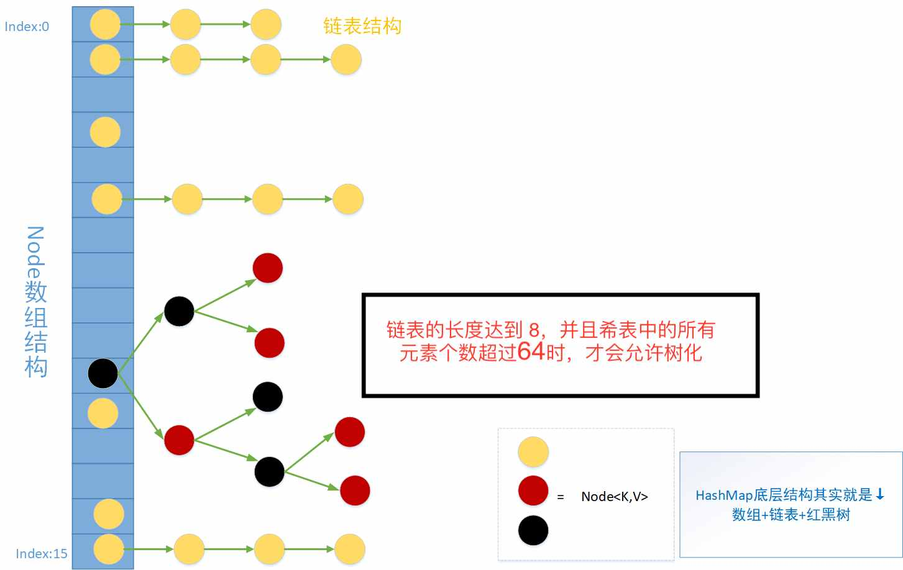

# HashMap 源码分析

## 基础准备

### 数组
特点：访问速度快，插入速度慢。

### 链表
特点：插入速度快，访问速度慢。

### 散列表
特点：查询和插入都比较快，整合了数组与链表的优点

### Hash 算法
核心理论：Hash也称散列、哈希，对应的英文都是Hash。基本原理就是把***任意长度***的输入，通过Hash算法变成***固定长度***的输出。
这个映射的规则就是对应的***Hash算法***，而原始数据映射后的***二进制串***就是哈希值。

Hash的特点：
1. 从hash值不可以***反向推导***出原始的数据
2. 输入数据的***微小变化***会得到完全不同的hash值，相同的数据会得到相同的值
3. 哈希算法的***执行效率要高效***，长的文本也能快速地计算出哈希值
4. hash算法的***冲突概率要小***

由于hash的原理是将***输入空间***的值映射成***hash空间***内，而hash值的空间远小于输入的空间。
根据***抽屉原理***，一定会存在不同的输入被映射成相同输出的情况。

抽屉原理：桌上有十个苹果，要把这十个苹果放到九个抽屉里，无论怎样放，我们会发现至少会有一个抽屉里面放不少于两个苹果。这一现象就是我们所说的“抽屉原理”。

## HashMap 知识准备
1. HashMap -- 继承 --> AbstractMap  -- 实现 --> Map接口


2. HashMap 中的 Node 数据结构
```java
/**
 * Basic hash bin node, used for most entries.  (See below for
 * TreeNode subclass, and in LinkedHashMap for its Entry subclass.
 */
static class Node<K,V> implements Map.Entry<K,V> {
  final int hash; // 经过 Hash 算法后计算出来的值
  final K key; // 插入的 key 值
  V value; // 插入的 value 值
  Node<K,V> next; // 下一个 Node 节点值

  Node(int hash, K key, V value, Node<K,V> next) {
    this.hash = hash;
    this.key = key;
    this.value = value;
    this.next = next;
  }

  public final K getKey()        { return key; }
  public final V getValue()      { return value; }
  public final String toString() { return key + "=" + value; }
  // Key 的 hash 值与 value 的 hash 值 取异或值
  public final int hashCode() {
    return Objects.hashCode(key) ^ Objects.hashCode(value);
  }

  public final V setValue(V newValue) {
    V oldValue = value;
    value = newValue;
    return oldValue;
  }
  // 地址相同 或 key 与 value 都相同（Object.equals方法） 则 equals 返回 true
  public final boolean equals(Object o) {
    if (o == this)
      return true;
    if (o instanceof Map.Entry) {
      Map.Entry<?,?> e = (Map.Entry<?,?>)o;
      if (Objects.equals(key, e.getKey()) &&
          Objects.equals(value, e.getValue()))
        return true;
    }
    return false;
  }
}
```
3. Map 中的 Entry

```java
/**
 * 表示一个映射项（键 - 值对）。 该Map.entrySet方法返回该类的集合视图映射。 
 * 获得对映射项的参照的唯一方法是从该集合中视点的迭代器中获取。
 */
interface Entry<K,V> {
    /**
     * 获取 Key
     */
    K getKey();

    /**
     * 获取 Value
     */
    V getValue();

    /**
     * 设值
     */
    V setValue(V value);

    /**
     * Compares the specified object with this entry for equality.
     */
    boolean equals(Object o);

    /**
     * Returns the hash code value for this map entry.  The hash code
     * of a map entry <tt>e</tt> is defined to be: <pre>
     *     (e.getKey()==null   ? 0 : e.getKey().hashCode()) ^
     *     (e.getValue()==null ? 0 : e.getValue().hashCode())
     * </pre>
     */
    int hashCode();

    /**
     * Returns a comparator that compares {@link Map.Entry} in natural order on key.
     */
    public static <K extends Comparable<? super K>, V> Comparator<Map.Entry<K,V>> comparingByKey() {
        return (Comparator<Map.Entry<K, V>> & Serializable)
                (c1, c2) -> c1.getKey().compareTo(c2.getKey());
    }

    /**
     * Returns a comparator that compares {@link Map.Entry} in natural order on value.
     */
    public static <K, V extends Comparable<? super V>> Comparator<Map.Entry<K,V>> comparingByValue() {
        return (Comparator<Map.Entry<K, V>> & Serializable)
                (c1, c2) -> c1.getValue().compareTo(c2.getValue());
    }

    /**
     * Returns a comparator that compares {@link Map.Entry} by key using the given
     * {@link Comparator}.
     */
    public static <K, V> Comparator<Map.Entry<K, V>> comparingByKey(Comparator<? super K> cmp) {
        Objects.requireNonNull(cmp);
        return (Comparator<Map.Entry<K, V>> & Serializable)
                (c1, c2) -> cmp.compare(c1.getKey(), c2.getKey());
    }

    /**
     * Returns a comparator that compares {@link Map.Entry} by value using the given
     * {@link Comparator}.
     */
    public static <K, V> Comparator<Map.Entry<K, V>> comparingByValue(Comparator<? super V> cmp) {
        Objects.requireNonNull(cmp);
        return (Comparator<Map.Entry<K, V>> & Serializable)
                (c1, c2) -> cmp.compare(c1.getValue(), c2.getValue());
    }
}
```

4. 默认值

```java
/**
 * 默认的初始化容量大小（16），必须是2的指数。
 */
static final int DEFAULT_INITIAL_CAPACITY = 1 << 4; // aka 16

/**
 * 最大容量大小（10亿多）
 */
static final int MAXIMUM_CAPACITY = 1 << 30; // 1073741824

/**
 * 负载因子
 */
static final float DEFAULT_LOAD_FACTOR = 0.75f;

/**
 * 树化阈值
 */
static final int TREEIFY_THRESHOLD = 8;

/**
 * 树化的另一个参数，当哈希表中的所有元素个数超过64时，才会允许树化
 */
static final int MIN_TREEIFY_CAPACITY = 64;

/**
 * 树降级称为链表的阈值
 */
static final int UNTREEIFY_THRESHOLD = 6;
```

5. 属性

```java
/**
 * 哈希表，在第一次使用的时候初始化，并且分配的大小是2的指数个。
 */
transient HashMap.Node<K,V>[] table;

/**
 * Holds cached entrySet(). Note that AbstractMap fields are used for keySet() and values().
 */
transient Set<Map.Entry<K,V>> entrySet;

/**
 * 当前哈希表中元素个数
 */
transient int size;

/**
 * 当前哈希表结构修改次数
 */
transient int modCount;

/**
 * 扩容阈值( = capacity * load factor)，当你的哈希表中的元素超过阈值时，触发扩容。
 */
int threshold;

/**
 * 负载因子
 */
final float loadFactor;
```
> 将不需要序列化的属性前添加关键字transient，序列化对象的时候，这个属性就不会被序列化。
6. 哈希表结构图




## 源码分析

### 构造函数分析

1. 两个参数构造器

```java
/**
 * 用指定的初始容量和负载因子构造一个空的
 *
 * @param  initialCapacity the initial capacity
 * @param  loadFactor      the load factor
 * @throws IllegalArgumentException if the initial capacity is negative
 *         or the load factor is nonpositive
 */
public HashMap(int initialCapacity, float loadFactor) {
    // 其实就是做了一些校验
    // capacity 必须是大于等于 0 ，最大值也就是 MAXIMUM_CAPACITY
    if (initialCapacity < 0)
        throw new IllegalArgumentException("Illegal initial capacity: " + initialCapacity);
    if (initialCapacity > MAXIMUM_CAPACITY)
        initialCapacity = MAXIMUM_CAPACITY;

    // loadFactor 必须大于 0 的小数
    if (loadFactor <= 0 || Float.isNaN(loadFactor))
        throw new IllegalArgumentException("Illegal load factor: " + loadFactor);
  
    this.loadFactor = loadFactor;
  	// 返回一个大于等于当前值 cap 的一个最小2次幂数
    this.threshold = tableSizeFor(initialCapacity);
}
```

```java
/**
 * 返回一个大于等于当前值 cap 的一个最小2次幂数
 *
 * cap = 10
 * n = 10 - 1 => 9
 * 0b1001 | 0b0100 => 0b1101
 * 0b1101 | 0b0011 => 0b1111
 * 0b1111 | 0b0000 => 0b1111
 *
 * 0b1111 => 15
 *
 * return 15 + 1;
 * 
 * 若 int n = cap - 1; 变成 int n = cap; 可能造成容量扩大一倍。
 * cap = 16
 * n = 16;
 * 0b10000 | 0b01000 =>0b11000
 * 0b11000 | 0b00110 =>0b11110
 * 0b11110 | 0b00001 =>0b11111
 * =>0b11111 => 31
 * return 31 + 1;
 *
 * 0001 1101 1100 => 0001 1111 1111 + 1 => 0010 0000 0000 一定是2的次方数
 *
 */
static final int tableSizeFor(int cap) {
    int n = cap - 1;
    n |= n >>> 1;
    n |= n >>> 2;
    n |= n >>> 4;
    n |= n >>> 8;
    n |= n >>> 16;
    return (n < 0) ? 1 : (n >= MAXIMUM_CAPACITY) ? MAXIMUM_CAPACITY : n + 1;
}
```

2. 一个初始化容量参数
```java
/**
 * 给定容量，新建一个空的 HashMap（默认负载因子是0.75）（套用两参数构造器）
 * 
 * @param  initialCapacity the initial capacity.
 * @throws IllegalArgumentException if the initial capacity is negative.
 */
public HashMap(int initialCapacity) {
    this(initialCapacity, DEFAULT_LOAD_FACTOR);
}

```

3. 空参数
```java
/**
 * 新建一个空的 HashMap（初始化容量是16，负载因子是0.75）
 */
public HashMap() {
    this.loadFactor = DEFAULT_LOAD_FACTOR; // all other fields defaulted
}
```

4. Map集合构造器
```java
/**
 * 新建一个与 m 具有相同映射关系且容量足够的新的 HahsMap （默认负载因子是0.75）
 *
 * @param   m the map whose mappings are to be placed in this map
 * @throws  NullPointerException if the specified map is null
 */
public HashMap(Map<? extends K, ? extends V> m) {
    this.loadFactor = DEFAULT_LOAD_FACTOR;
    putMapEntries(m, false);
}


```


### put 方法分析
```java
/**
 * 在 map 中将 key 与 value 进行关联映射，如果 key 已经存在则替换旧值，并返回旧值，若旧值不存在则返回 null。
 */
public V put(K key, V value) {
    return putVal(hash(key), key, value, false, true);
}
```
#### hash 方法

```java
/**
 * 作用：让key的hash值的高16位也参与路由运算
 * 异或：相同则返回0，不同返回1
 *
 * h = 0b 0010 0101 1010 1100 0011 1111 0010 1110
 * 0b 0010 0101 1010 1100 0011 1111 0010 1110
 * ^
 * 0b 0000 0000 0000 0000 0010 0101 1010 1100
 * => 0010 0101 1010 1100 0001 1010 1000 0010
 */
static final int hash(Object key) {
    int h;
    return (key == null) ? 0 : (h = key.hashCode()) ^ (h >>> 16);
}
```

#### **put 核心方法**

```java
/**
 * 实现 Map.put 和相关的方法
 * @param onlyIfAbsent 为 true 不改变现有的 value
 * @param evict 为 false 散列表为创建模式.
 * @return 返回旧值，若旧值不存在则返回 null
 */
final V putVal(int hash, K key, V value, boolean onlyIfAbsent, boolean evict) {
    // tab：引用当前hashMap的散列表
    // p：表示当前散列表的元素
    // n：表示散列表数组的长度
    // i：表示路由寻址 结果
    Node<K,V>[] tab; Node<K,V> p; int n, i;

    // 延迟初始化逻辑，第一次调用 putVal 时会初始化 hashMap 对象中的最耗费内存的散列表
    if ((tab = table) == null || (n = tab.length) == 0)
        n = (tab = resize()).length;

    // 最简单的一种情况：寻址找到的桶位 刚好是 null，这个时候，直接将当前 k-v=>node 扔进去就可以了
    if ((p = tab[i = (n - 1) & hash]) == null)
        tab[i] = newNode(hash, key, value, null);
	  // p 不为空，当前要插入的 key-value 的 key 的 hash 值存在冲突
  	// 则当前的 p 是个链表（一个或多个元素）或者是红黑树
    else {
        // e：不为null的话，找到了一个与当前要插入的 key-value 一致的key的元素
        // k：表示临时的一个key
        Node<K,V> e; K k;

        // 表示桶位中的该元素与你当前插入的元素的key完全一致，后续需要进行替换操作
        if (p.hash == hash && ((k = p.key) == key || (key != null && key.equals(k))))
            e = p;
				// 红黑树
        else if (p instanceof TreeNode)
            e = ((TreeNode<K,V>)p).putTreeVal(this, tab, hash, key, value);
        else {
            // 链表的情况，而且链表的头元素与我们要插入的key不一致。
            for (int binCount = 0; ; ++binCount) {
                // 条件成立的话，说明迭代到最后一个元素了，也没找到一个与你要插入的key一致的node
                // 说明需要加入到当前链表的末尾
                if ((e = p.next) == null) {
                    p.next = newNode(hash, key, value, null);
                    // 条件成立的话，说明当前链表的长度，达到树化标准了，需要进行树化
                    if (binCount >= TREEIFY_THRESHOLD - 1) // -1 for 1st
                        // 树化操作
                        treeifyBin(tab, hash);
                    break;
                }
                // 条件成立的话，说明找到了相同key的node元素，需要进行替换操作
                if (e.hash == hash &&
                        ((k = e.key) == key || (key != null && key.equals(k))))
                    break;
                p = e;
            }
        }

        // e不等于null，条件成立说明，找到了一个与你插入元素key完全一致的数据，需要进行替换
        if (e != null) { // existing mapping for key
            V oldValue = e.value;
            if (!onlyIfAbsent || oldValue == null)
                e.value = value;
            afterNodeAccess(e);
            return oldValue;
        }
    }

    // modCount：表示散列表结构被修改的次数，替换Node元素的value不计数
    ++modCount;
    // 插入新元素，size自增，如果自增后的值大于扩容阈值，则触发扩容。
    if (++size > threshold)
        resize();
    afterNodeInsertion(evict);
    return null;
}
```
> 寻址方法：`(n - 1) & hash`

### **resize 扩容方法分析**

```java
/**
 * Initializes or doubles table size.  If null, allocates in
 * accord with initial capacity target held in field threshold.
 * Otherwise, because we are using power-of-two expansion, the
 * elements from each bin must either stay at same index, or move
 * with a power of two offset in the new table.
 *
 * 为什么需要扩容？
 * 为了解决哈希冲突导致的链化影响查询效率的问题，扩容会缓解该问题。
 *
 * @return the table
 */
final Node<K,V>[] resize() {
    // oldTab：引用扩容前的哈希表
    Node<K,V>[] oldTab = table;
    // oldCap：表示扩容之前table数组的长度
    int oldCap = (oldTab == null) ? 0 : oldTab.length;
    // oldThr：表示扩容之前的扩容阈值，触发本次扩容的阈值
    int oldThr = threshold;
    // newCap：扩容之后table数组的大小
    // newThr：扩容之后，下次再次触发扩容的条件
    int newCap, newThr = 0;

    // 条件如果成立说明 hashMap中的散列表已经初始化过了，这是一次正常扩容
    if (oldCap > 0) {
        // 扩容之前的table数组大小已经达到最大阈值后，则不扩容，且设置扩容条件为 int 最大值。
        if (oldCap >= MAXIMUM_CAPACITY) {
            threshold = Integer.MAX_VALUE;
            return oldTab;
        }
        // oldCap左移一位实现数值翻倍，并且赋值给newCap， 
      	// newCap 小于数组最大值限制 且 扩容之前的阈值 >= 16
        // 这种情况下，则 下一次扩容的阈值 等于当前阈值翻倍
        else if ((newCap = oldCap << 1) < MAXIMUM_CAPACITY &&
                oldCap >= DEFAULT_INITIAL_CAPACITY)
            newThr = oldThr << 1; // double threshold
    }
    // oldCap == 0,说明hashMap中的散列表是null
    // 1.new HashMap(initCap, loadFactor);
    // 2.new HashMap(initCap);
    // 3.new HashMap(map); 并且这个map有数据
    else if (oldThr > 0) // initial capacity was placed in threshold
        newCap = oldThr;

    // oldCap == 0，oldThr == 0
    // new HashMap();
    else {               // zero initial threshold signifies using defaults
        newCap = DEFAULT_INITIAL_CAPACITY;//16
        newThr = (int)(DEFAULT_LOAD_FACTOR * 
                       DEFAULT_INITIAL_CAPACITY);//0.75*16=12
    }

    // newThr为零时，通过 newCap 和 loadFactor 计算出一个 newThr
    if (newThr == 0) {
        float ft = (float)newCap * loadFactor;
        newThr = (newCap < MAXIMUM_CAPACITY && ft < (float)MAXIMUM_CAPACITY ?
                (int)ft : Integer.MAX_VALUE);
    }

    threshold = newThr;

    // 创建出一个更长 更大的数组
    @SuppressWarnings({"rawtypes","unchecked"})
    Node<K,V>[] newTab = (Node<K,V>[])new Node[newCap];
    table = newTab;

    // 说明，hashMap 本次扩容之前，table 不为null
    if (oldTab != null) {

        for (int j = 0; j < oldCap; ++j) {
            // 当前node节点
            Node<K,V> e;
            // 说明当前桶位中有数据，但是数据具体是 单个数据，还是链表 还是 红黑树 并不知道
            if ((e = oldTab[j]) != null) {
                // 方便JVM GC时回收内存
                oldTab[j] = null;

                // 第一种情况：当前桶位只有一个元素，从未发生过碰撞，
              	// 这情况 直接计算出当前元素应存放在 新数组中的位置，然后扔进去就可以了
                if (e.next == null)
                    newTab[e.hash & (newCap - 1)] = e;

                    // 第二种情况：当前节点已经树化
                else if (e instanceof TreeNode)
                    ((TreeNode<K,V>)e).split(this, newTab, j, oldCap);
                else { // preserve order
                    // 第三种情况：桶位已经形成链表

                    // 低位链表：存放在扩容之后的数组的下标位置，与当前数组的下标位置一致。
                    Node<K,V> loHead = null, loTail = null;
                    // 高位链表：存放在扩容之后的数组的下表位置为 当前数组下标位置 + 扩容之前数组的长度
                    Node<K,V> hiHead = null, hiTail = null;

                    Node<K,V> next;
                    do {
                        next = e.next;
                        // hash-> .... 1 1111
                        // hash-> .... 0 1111
                        // 0b 10000
                        if ((e.hash & oldCap) == 0) {
                            if (loTail == null)
                                loHead = e;
                            else
                                loTail.next = e;
                            loTail = e;
                        } else {
                            if (hiTail == null)
                                hiHead = e;
                            else
                                hiTail.next = e;
                            hiTail = e;
                        }

                    } while ((e = next) != null);

                    if (loTail != null) {
                        loTail.next = null;
                        newTab[j] = loHead;
                    }

                    if (hiTail != null) {
                        hiTail.next = null;
                        newTab[j + oldCap] = hiHead;
                    }
                }
            }
        }
    }
    return newTab;
}
```

### get 方法分析

```java
/**
 * Returns the value to which the specified key is mapped,
 * or {@code null} if this map contains no mapping for the key.
 *
 * <p>More formally, if this map contains a mapping from a key
 * {@code k} to a value {@code v} such that {@code (key==null ? k==null :
 * key.equals(k))}, then this method returns {@code v}; otherwise
 * it returns {@code null}.  (There can be at most one such mapping.)
 *
 * <p>A return value of {@code null} does not <i>necessarily</i>
 * indicate that the map contains no mapping for the key; it's also
 * possible that the map explicitly maps the key to {@code null}.
 * The {@link #containsKey containsKey} operation may be used to
 * distinguish these two cases.
 *
 * @see #put(Object, Object)
 */
public V get(Object key) {
    Node<K,V> e;
    return (e = getNode(hash(key), key)) == null ? null : e.value;
}

/**
 * Implements Map.get and related methods.
 *
 * @param hash hash for key
 * @param key the key
 * @return the node, or null if none
 */
final Node<K,V> getNode(int hash, Object key) {
    // tab：引用当前hashMap的散列表
    // first：桶位中的头元素
    // e：临时node元素
    // n：table数组长度
    Node<K,V>[] tab; Node<K,V> first, e; int n; K k;

    if ((tab = table) != null && (n = tab.length) > 0 &&
        (first = tab[(n - 1) & hash]) != null) {
        // 第一种情况：定位出来的桶位元素 即为咱们要get的数据
        if (first.hash == hash && // always check first node
            ((k = first.key) == key || (key != null && key.equals(k))))
            return first;

        // 说明当前桶位不止一个元素，可能 是链表 也可能是 红黑树
        if ((e = first.next) != null) {
            //第二种情况：桶位升级成了 红黑树
            if (first instanceof TreeNode)//下一期说
                return ((TreeNode<K,V>)first).getTreeNode(hash, key);
            //第三种情况：桶位形成链表
            do {
                if (e.hash == hash &&
                    ((k = e.key) == key || (key != null && key.equals(k))))
                    return e;
            } while ((e = e.next) != null);
        }
    }
    return null;
}
```

### remove 方法分析

```java
/**
 * Removes the mapping for the specified key from this map if present.
 *
 * @param  key key whose mapping is to be removed from the map
 * @return the previous value associated with <tt>key</tt>, or
 *         <tt>null</tt> if there was no mapping for <tt>key</tt>.
 *         (A <tt>null</tt> return can also indicate that the map
 *         previously associated <tt>null</tt> with <tt>key</tt>.)
 */
public V remove(Object key) {
    Node<K,V> e;
    return (e = removeNode(hash(key), key, null, false, true)) == null ? 
        null : e.value;
}

/**
 * Implements Map.remove and related methods.
 *
 * @param hash hash for key
 * @param key the key
 * @param value the value to match if matchValue, else ignored
 * @param matchValue if true only remove if value is equal
 * @param movable if false do not move other nodes while removing
 * @return the node, or null if none
 */
final Node<K,V> removeNode(int hash, Object key, Object value,
                           boolean matchValue, boolean movable) {
    // tab：引用当前hashMap中的散列表
    // p：当前node元素
    // n：表示散列表数组长度
    // index：表示寻址结果
    Node<K,V>[] tab; Node<K,V> p; int n, index;

    if ((tab = table) != null && (n = tab.length) > 0 &&
        (p = tab[index = (n - 1) & hash]) != null) {
        // 说明路由的桶位是有数据的，需要进行查找操作，并且删除

        // node：查找到的结果
        // e：当前Node的下一个元素
        Node<K,V> node = null, e; K k; V v;

        // 第一种情况：当前桶位中的元素 即为 你要删除的元素
        if (p.hash == hash &&
            ((k = p.key) == key || (key != null && key.equals(k))))
            node = p;

        else if ((e = p.next) != null) {
            // 说明，当前桶位 要么是 链表 要么 是红黑树

            if (p instanceof TreeNode)//判断当前桶位是否升级为 红黑树了
                // 第二种情况，红黑树查找操作
                node = ((TreeNode<K,V>)p).getTreeNode(hash, key);
            else {
                // 第三种情况，链表的情况
                do {
                  if (e.hash == hash &&
                      ((k = e.key) == key ||
                       (key != null && key.equals(k)))) {
                    node = e;
                    break;
                  }
                  p = e;
                } while ((e = e.next) != null);
            }
        }
        //判断node不为空的话，说明按照key查找到需要删除的数据了
        if (node != null && (!matchValue || (v = node.value) == value ||
                             (value != null && value.equals(v)))) {
            //第一种情况：node是树节点，说明需要进行树节点移除操作
            if (node instanceof TreeNode)
                ((TreeNode<K,V>)node).removeTreeNode(this, tab, movable);
            //第二种情况：桶位元素即为查找结果，则将该元素的下一个元素放至桶位中
            else if (node == p)
                tab[index] = node.next;
            else
                //第三种情况：将当前元素p的下一个元素 设置成 要删除元素的 下一个元素。
                p.next = node.next;
            ++modCount;
            --size;
            afterNodeRemoval(node);
            return node;
        }
    }
    return null;
}
```


### replace 方法分析

```java
@Override
public boolean replace(K key, V oldValue, V newValue) {
  Node<K,V> e; V v;
  if ((e = getNode(hash(key), key)) != null &&
      ((v = e.value) == oldValue || (v != null && v.equals(oldValue)))) {
    e.value = newValue;
    afterNodeAccess(e);
    return true;
  }
  return false;
}

@Override
public V replace(K key, V value) {
  Node<K,V> e;
  if ((e = getNode(hash(key), key)) != null) {
    V oldValue = e.value;
    e.value = value;
    afterNodeAccess(e);
    return oldValue;
  }
  return null;
}
```

