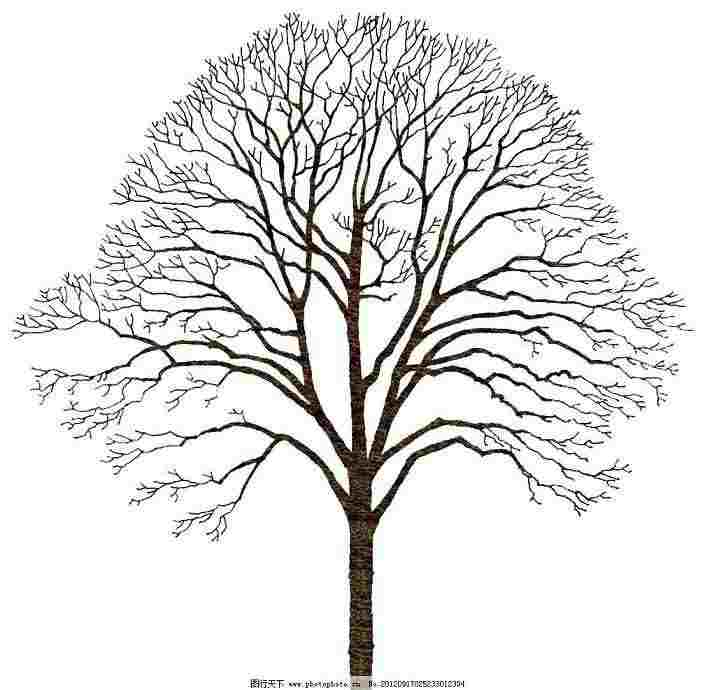
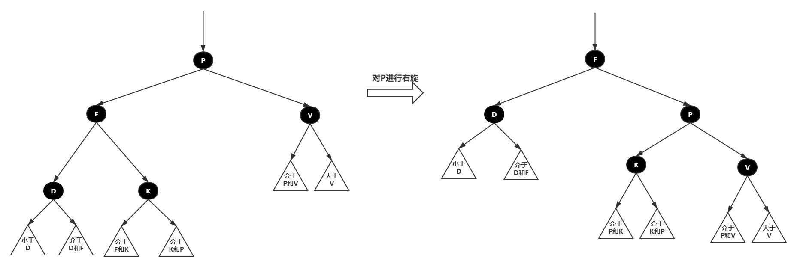
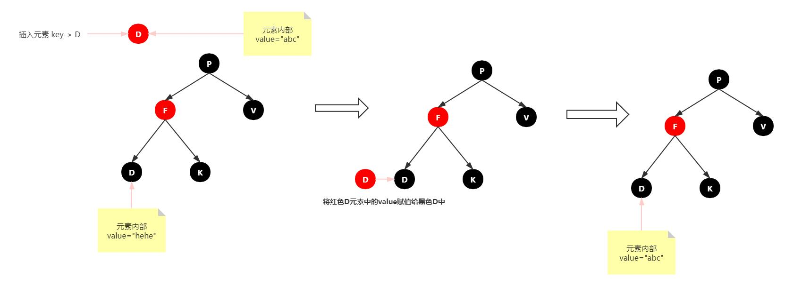

# 红黑树

## 树结构入门

### 什么是树

**树**（tree）是一种抽象数据类型（ADT），用来模拟具有树状结构性质的数据集合。它是由n（n>0）个有限**节点**通过连接它们的**边**组成一个具有层次关系的集合。

| 抽象的树                | 实际的树                                                  |
| ----------------------- | --------------------------------------------------------- |
|  |  |

把它叫做“树”是因为它看起来像一棵倒挂的树，也就是说它是根朝上，而叶朝下的。

树有很多种，向上面的一个节点有多余两个的子节点的树，称为多路树，而每个节点最多只能有两个子节点的一种形式称为二叉树。

①、节点：上图的圆圈，比如A,B,C等都是表示节点。节点一般代表一些实体，在java面向对象编程中，节点一般代表对象。

②、边：连接节点的线称为边，边表示节点的关联关系。一般从一个节点到另一个节点的**唯一方法**就是沿着一条顺着有边的道路前进。在Java当中通常表示引用。


### 树结构常用术语


　　①、**路径**：顺着节点的边从一个节点走到另一个节点，所经过的节点的顺序排列就称为“路径”。

　　②、**根**：树顶端的节点称为根。一棵树只有一个根，如果要把一个节点和边的集合称为树，那么从根到其他任何一个节点都必须有且只有一条路径。A是根节点。

　　③、**父节点**：若一个节点含有子节点，则这个节点称为其子节点的父节点

　　④、**子节点**：一个节点含有的子树的节点称为该节点的子节点；F、G是C节点的子节点。

　　⑤、**兄弟节点**：具有相同父节点的节点互称为兄弟节点；F、G节点互为兄弟节点。

　　⑥、**叶节点**：没有子节点的节点称为叶节点，也叫叶子节点，比如上图的H、E、F、G都是叶子节点。

　　⑦、**子树**：每个节点都可以作为子树的根，它和它所有的子节点、子节点的子节点等都包含在子树中。

　　⑧、**节点的层次**：从根开始定义，根为第一层，根的子节点为第二层，以此类推。

　　⑨、**深度**：对于任意节点n,n的深度为从根到n的唯一路径长，根的深度为0；（从上往下看）

　　⑩、**高度**：对于任意节点n,n的高度为从n到一片树叶的最长路径长，所有树叶的高度为0；（从下往上看）

### 二叉搜索树

#### **二叉树**

> 树的每个节点最多只能有两个子节点。

| 多路树                  | 树结构术语              |
| ----------------------- | :---------------------- |
|  |  |

上图的第一幅图B节点有DEF三个子节点，就不是二叉树，称为多路树。而第二幅图每个节点最多只有两个节点，是二叉树，并且二叉树的子节点称为“左子节点”和“右子节点”

####  **二叉搜索树**

如果我们给二叉树加一个额外的条件，就可以得到一种被称作二叉搜索树(binary search tree)的特殊二叉树。

**二叉搜索树要求**：

1. 若它的左子树不空，则左子树上所有结点的值均小于它的根结点的值； 

2. 若它的右子树不空，则右子树上所有结点的值均大于它的根结点的值； 

3. 它的左、右子树也分别为二叉排序树。


**二叉搜索树-查找节点：**

查找某个节点，我们必须从根节点开始查找。

　　1. 查找值比当前节点值大，则搜索右子树；
　　1. 查找值等于当前节点值，停止搜索（终止条件）；
　　1. 查找值小于当前节点值，则搜索左子树；

**二叉搜索树-插入节点：**

要插入节点，必须先找到插入的位置。与查找操作相似，由于二叉搜索树的特殊性，待插入的节点也需要从根节点开始进行比较，小于根节点则与根节点左子树比较，反之则与右子树比较，直到左子树为空或右子树为空，则插入到相应为空的位置。

**二叉搜索树-遍历节点：**

遍历树是根据一种特定的顺序访问树的每一个节点。比较常用的有前序遍历，中序遍历和后序遍历。而二叉搜索树最常用的是中序遍历。

1. **中序遍历**： 左子树——>根节点——>右子树
2. **前序遍历**： 根节点——>左子树——>右子树
3. **后序遍历**： 左子树——>右子树——>根节点


**二叉搜索树-查找最大值和最小值**

要找最小值，先找根的左节点，然后一直找这个左节点的左节点，直到找到没有左节点的节点，那么这个节点就是最小值。同理要找最大值，一直找根节点的右节点，直到没有右节点，则就是最大值。


**二叉搜索树-删除节点：**

删除节点是二叉搜索树中最复杂的操作，删除的节点有三种情况，前两种比较简单，但是第三种却很复杂。
1. 该节点是叶节点（没有子节点）

2. 该节点有一个子节点

3. 该节点有两个子节点


- **删除没有子节点的节点**

要删除叶节点，只需要改变该节点的父节点引用该节点的值，即将其引用改为 null 即可。


- **删除有一个子节点的节点**

删除有一个子节点的节点，我们只需要将其父节点原本指向该节点的引用，改为指向该节点的子节点即可。


- **删除有两个子节点的节点**


当删除的节点存在两个子节点，那么删除之后，两个子节点的位置我们就没办法处理了。

既然处理不了，我们就想到一种办法，用另一个节点来代替被删除的节点，那么用哪一个节点来代替呢？

我们知道二叉搜索树中的节点是按照关键字来进行排列的，某个节点的关键字次高节点是它的中序遍历**后继节点**。用后继节点来代替删除的节点，显然该二叉搜索树还是有序的。


**那么如何找到删除节点的中序后继节点呢？**

其实我们稍微分析，这实际上就是要找比删除节点关键值大的节点集合中最小的一个节点，只有这样代替删除节点后才能满足二叉搜索树的特性。

> 后继节点也就是：比删除节点大的最小节点。

- **删除有必要吗？**

通过上面的删除分类讨论，我们发现删除其实是挺复杂的，那么其实我们可以不用真正的删除该节点，只需要在Node类中增加一个标识字段isDelete，当该字段为true时，表示该节点已经删除，反之则没有删除。这样删除节点就不会改变树的结构了。

影响就是查询时需要判断一下节点是否已被删除。

**二叉搜索树-时间复杂度分析：**
1. 回顾经典-二分查找算法
[1,2,3,4,5,6,7,8,9.....100]
暴力算法：运气好时 性能不错，运气不好时 性能暴跌..
二分查找算法：数据源必须是有序数组，性能非常不错，每次迭代查询可以排除掉一半的结果。
2. 二分查找算法最大的缺陷是什么？
强制依赖**有序数组**，性能才能不错。
3. 数组有什么缺陷？
没有办法快速插入，也没有办法扩容
4. 那怎么才能拥有二分查找的高性能又能拥有链表一样的灵活性？
**二叉搜索树**！！
5. 二分查找算法时间复杂度推算过程

| 第几次查询 | 剩余待查询元素数量 |
| ---------- | ------------------ |
| 1          | N/2                |
| 2          | N/(2^2)            |
| 3          | N/(2^3)            |
| K          | N/(2^K)            |


从上表可以看出**N/(2^K)**肯定是大于等于1，也就是**N/(2^K)>=1**，我们计算时间复杂度是按照**最坏的情况**进行计算，

也就是是查到剩余最后一个数才查到我们想要的数据，也就是

N/(2^K)=1   =>   2^K = N   => **K = log2 (N)    =>  二分查找算法时间复杂度：O(log2(N))  => O(logN)**

**普通二叉搜索树致命缺陷：**


这颗二叉树查询效率咋样呢？
O(N)
怎么解决 二叉搜索树 退化成线性链表的问题？
如果插入元素时，树可以自动调整两边平衡，会保持不错的查找性能。
#### AVL树简介
AVL树有什么特点？
1. 具有二叉查找树的全部特性。
2. 每个节点的左子树和右子树的**高度差至多等于1**。

| **符合规范**            | 错误                    |
| ----------------------- | ----------------------- |
|  |  |

平衡树基于这种特点就可以保证不会出现大量节点偏向于一边的情况了！（插入或者删除时，会发生左旋、右旋操作，使这棵树再次左右保持一定的平衡）

如何构建AVL树？

**为什么有了平衡树还需要红黑树？**

虽然平衡树解决了二叉查找树退化为近似链表的缺点，能够把查找时间控制在 O(logn)，不过却**不是最佳**的，因为平衡树要求每个节点的左子树和右子树的高度差至多等于1，这个要求实在是太严了，导致每次进行插入/删除节点的时候，几乎都会破坏平衡树的第二个规则，进而我们都需要通过左旋和右旋来进行调整，使之再次成为一颗符合要求的平衡树。

显然，**如果在那种插入、删除很频繁的场景中，平衡树需要频繁着进行调整，这会使平衡树的性能大打折扣，**为了解决这个问题，于是有了红黑树！！！

## 红黑树原理讲解

### **红黑树的性质**

| **红黑树的性质**                                             | 说明 |
| :----------------------------------------------------------: | :--- |
| 性质1              | 每个节点要么是**黑色**，要么是**红色**。 |
| 性质2                                    | 根节点是**黑色**。 |
| 性质3                   | 每个叶子节点（**NIL**）是**黑色**。 |
| 性质4 | 每个**红色**节点的两个子节点一定都是**黑色**。 不能有两个红色节点相连。 |
| 性质5 | 任意一节点到每个叶子节点的路径都包含**数量相同**的**黑结点**。俗称：**黑高**！ |
| 性质5.1 | 如果一个节点存在黑子节点，那么该结点肯定有两个子节点 |


红黑树并不是一个完美平衡二叉查找树，从图上可以看到，根结点P的左子树显然比右子树高，但左子树和右子树的黑结点的层数是相等的，也即任意一个结点到到每个叶子结点的路径都包含数量相同的黑结点(性质5)。

所以我们叫红黑树这种平衡为**黑色完美平衡**。

红黑树能自平衡，它靠的是什么？

三种操作：左旋、右旋和变色。

1. 变色：结点的颜色由红变黑或由黑变红。
2. 左旋：以某个结点作为支点(旋转结点)，其右子结点变为旋转结点的父结点，右子结点的左子结点变为旋转结点的右子结点，左子结点保持不变。
3. 右旋：以某个结点作为支点(旋转结点)，其左子结点变为旋转结点的父结点，左子结点的右子结点变为旋转结点的左子结点，右子结点保持不变

**左旋图示**


**右旋图示**



**红黑树查找：**


### **红黑树插入**

[红黑树动画演示地址](https://rbtree.phpisfuture.com/)

插入操作包括两部分工作：

1. 查找插入的位置

2. 插入后自平衡

>  **注意：**插入节点，必须为**<font color='red'>红色</font>**，理由很简单，红色在父节点（如果存在）为黑色节点时，红黑树的黑色平衡没被破坏，不需要做自平衡操作。但如果插入结点是**黑色**，那么插入位置所在的子树黑色结点总是多1，必须做自平衡。

在开始每个情景的讲解前，我们还是先来约定下:


#### **红黑树插入节点情景分析**

##### **情景1：红黑树为空树**

最简单的一种情景，直接把插入结点作为根结点就行

> 注意：根据红黑树性质2：根节点是**黑色**。还需要把插入结点设为黑色。

##### **情景2：插入结点的Key已存在**

更新当前节点的值，为插入节点的值



##### **情景3：插入结点的父结点为黑结点**

由于插入的结点是红色的，当插入结点的黑色时，并不会影响红黑树的平衡，直接插入即可，无需做自平衡。


##### **情景4：插入节点的父节点为红色**

再次回想下红黑树的**性质2：根结点是黑色**。如果插入节点的父结点为**<font color='red'>红结点</font>**，那么该父结点不可能为根结点，所以插入结点总是存在祖父结点。


###### 插入情景4.1：叔叔结点存在并且为红结点

依据红黑树**性质4可知，红色节点不能相连 --> 祖父结点肯定为黑结点。**那么此时该插入子树的红黑层数的情况是：黑红红。显然最简单的处理方式是把其改为：红黑红

处理：

1. 将P和U节点改为黑色

2. 将PP改为红色

3. 将PP设置为当前节点，进行后续处理


可以看到，我们把PP结点设为红色了，如果PP的父结点是黑色，那么无需再做任何处理；但如果PP的父结点是红色，则违反红黑树性质了。所以需要将PP设置为当前节点，继续做插入操作自平衡处理，直到平衡为止。

###### 插入情景4.2：插入结点的父亲结点是祖父结点的左子结点，并且叔叔结点不存在或为黑结点

> 注意：**单纯从插入前来看，叔叔节点非红即空（NIL节点）**，否则的话破坏了红黑树性质5，此路径会比其它路径多一个黑色节点。


**插入情景4.2.1：新插入节点，为其父节点的左子节点（LL红色情况）**


处理：

1. 变颜色：将P设置为黑色，将PP设置为红色

2. 对PP节点进行**右旋**


**插入情景4.2.2：新插入节点，为其父节点的右子节点（LR红色情况）**


处理：

1.对P进行左旋

2.将P设置为当前节点，得到LL红色情况

3.按照LL红色情况处理（1.变颜色 2.右旋PP）


###### 插入情景4.3：插入结点的父亲结点是祖父结点的右子结点，并且叔叔结点不存在或为黑结点

该情景对应情景4.2，只是方向反转，直接看图。


**插入情景4.3.1：新插入节点，为其父节点的右子节点（RR红色情况）**


处理：

1. 变颜色：将P设置为黑色，将PP设置为红色

2. 对PP节点进行**左旋**


**插入情景4.3.2：新插入节点，为其父节点的左子节点（RL红色情况）**


处理：

1. 对P进行右旋

2. 将P设置为当前节点，得到RR红色情况

3. 按照RR红色情况处理（1.变颜色 2.左旋PP）


#### 红黑树插入案例分析


### 源码分析

```java
// 重点！！！说在前面，有同学反映 红黑树 测试 2,4,6,8,10,12,14...就不平衡了... 
// 这里说下原因：因为这是课程源码，考虑的并没那么多 我比对节点大小时 直接使用的是    node.key.compareTo(parent.key); 
// 明眼的同学都能看出来，这个其实是按照字符串比对的！ 所以，大家尽量使用 a,b,c,d,e,f,g,h,i...这种风格去测试...
// 或者自己改改这块的逻辑，可以去参考HashMap的实现去改。


package com.study.struct;

/**
 * 树操作
 */
public class TreeOperation {
    /*
    树的结构示例：
              1
            /   \
          2       3
         / \     / \
        4   5   6   7
     */
    // 用于获得树的层数
    public static int getTreeDepth(RBTree.RBNode root) {
        return root == null ? 0 : (1 + Math.max(getTreeDepth(root.getLeft()), 
                                                getTreeDepth(root.getRight())));
    }


    private static void writeArray(RBTree.RBNode currNode, int rowIndex, int columnIndex, String[][] res, int treeDepth) {
        // 保证输入的树不为空
        if (currNode == null) return;
        // 先将当前节点保存到二维数组中
        res[rowIndex][columnIndex] = String.valueOf(currNode.getKey());
        // res[rowIndex][columnIndex] = String.valueOf(currNode.getKey() + "-" + (currNode.isColor() ? "R" : "B"));

        // 计算当前位于树的第几层
        int currLevel = ((rowIndex + 1) / 2);
        // 若到了最后一层，则返回
        if (currLevel == treeDepth) return;
        // 计算当前行到下一行，每个元素之间的间隔（下一行的列索引与当前元素的列索引之间的间隔）
        int gap = treeDepth - currLevel - 1;

        // 对左儿子进行判断，若有左儿子，则记录相应的"/"与左儿子的值
        if (currNode.getLeft() != null) {
            res[rowIndex + 1][columnIndex - gap] = "/";
            writeArray(currNode.getLeft(), rowIndex + 2, columnIndex - gap * 2, res, treeDepth);
        }

        // 对右儿子进行判断，若有右儿子，则记录相应的"\"与右儿子的值
        if (currNode.getRight() != null) {
            res[rowIndex + 1][columnIndex + gap] = "\\";
            writeArray(currNode.getRight(), rowIndex + 2, columnIndex + gap * 2, res, treeDepth);
        }
    }


    public static void show(RBTree.RBNode root) {
        if (root == null) System.out.println("EMPTY!");
        // 得到树的深度
        int treeDepth = getTreeDepth(root);

        // 最后一行的宽度为2的（n - 1）次方乘3，再加1
        // 作为整个二维数组的宽度
        int arrayHeight = treeDepth * 2 - 1;
        int arrayWidth = (2 << (treeDepth - 2)) * 3 + 1;
        // 用一个字符串数组来存储每个位置应显示的元素
        String[][] res = new String[arrayHeight][arrayWidth];
        // 对数组进行初始化，默认为一个空格
        for (int i = 0; i < arrayHeight; i ++) {
            for (int j = 0; j < arrayWidth; j ++) {
                res[i][j] = " ";
            }
        }

        // 从根节点开始，递归处理整个树
        // res[0][(arrayWidth + 1)/ 2] = (char)(root.val + '0');
        writeArray(root, 0, arrayWidth/ 2, res, treeDepth);

        // 此时，已经将所有需要显示的元素储存到了二维数组中，将其拼接并打印即可
        for (String[] line: res) {
            StringBuilder sb = new StringBuilder();
            for (int i = 0; i < line.length; i ++) {
                sb.append(line[i]);
                if (line[i].length() > 1 && i <= line.length - 1) {
                    i += line[i].length() > 4 ? 2: line[i].length() - 1;
                }
            }
            System.out.println(sb.toString());
        }
    }
}


package com.study.struct;

/**
 * 红黑树
 *
 * ①创建RBTree，定义颜色
 * ②创建RBNode
 * ③辅助方法定义：parentOf(node)，isRed(node)，setRed(node)，setBlack(node)，inOrderPrint(RBNode tree)
 * ④左旋方法定义：leftRotate(node)
 * ⑤右旋方法定义：rightRotate(node)
 * ⑥公开插入接口方法定义：insert(K key, V value);
 * ⑦内部插入接口方法定义：insert(RBNode node);
 * ⑧修正插入导致红黑树失衡的方法定义：insertFIxUp(RBNode node);
 * ⑨测试红黑树正确性
 */
public class RBTree <K extends Comparable<K>, V> {
    //定义颜色常量
    private static final boolean RED = true;
    private static final boolean BLACK = false;

    //红黑树的树根
    private RBNode root;

    public RBNode getRoot() {
        return root;
    }

    /**
     * 公开的插入接口
     * @param key 键
     * @param value 值
     */
    public void insert(K key, V value) {
       RBNode node = new RBNode();
       node.setKey(key);
       node.setValue(value);
       node.setColor(RED);
       insert(node);
    }

    /**
     * 内部插入接口定义
     */
    private void insert(RBNode node) {
        //1.找到插入的位置
        RBNode parent = null;
        RBNode x = this.root;
        while(x != null) {
            parent = x;
						
            // 按照字符串的大小进行比较的（数字字符串比较结果可能会不符合期望）
            //a > b 则返回 1，否则返回 -1 ，相等返回0
            int cmp = node.key.compareTo(parent.key); 

            if(cmp < 0) {
                x = x.left;
            } else if(cmp == 0) {
                parent.setValue(node.value);
                return;
            } else {
                x = x.right;
            }
        }

        node.parent = parent;

        if(parent != null) {
            if(node.key.compareTo(parent.key) < 0) {
                parent.left = node;
            } else {
                parent.right = node;
            }
        } else {
            this.root = node;
        }

        //插入之后需要进行修复红黑树，让红黑树再次平衡。
        insertFixUp(node);
    }


    /**
     * 插入后修复红黑树平衡的方法
     *     |---情景1：红黑树为空树
     *     |---情景2：插入节点的key已经存在
     *     |---情景3：插入节点的父节点为黑色
     *
     *     情景4 需要咱们去处理
     *     |---情景4：插入节点的父节点为红色
     *          |---情景4.1：叔叔节点存在，并且为红色（父-叔 双红）
     *          |---情景4.2：叔叔节点不存在，或者为黑色，父节点为爷爷节点的左子树
     *               |---情景4.2.1：插入节点为其父节点的左子节点（LL情况）
     *               |---情景4.2.2：插入节点为其父节点的右子节点（LR情况）
     *          |---情景4.3：叔叔节点不存在，或者为黑色，父节点为爷爷节点的右子树
     *               |---情景4.3.1：插入节点为其父节点的右子节点（RR情况）
     *               |---情景4.3.2：插入节点为其父节点的左子节点（RL情况）
     */
    private void insertFixUp(RBNode node) {
        RBNode parent = parentOf(node);
        RBNode gparent = parentOf(parent);
        //存在父节点且父节点为红色
        if(parent != null && isRed(parent)) {
            //父节点是红色的，那么一定存在爷爷节点

            //父节点为爷爷节点的左子树
            if(parent == gparent.left) {
                RBNode uncle = gparent.right;
                //4.1：叔叔节点存在，并且为红色（父-叔 双红）
                //将父和叔染色为黑色，再将爷爷染红，并将爷爷设置为当前节点，进入下一次循环判断
                if(uncle != null && isRed(uncle)) {
                    setBlack(parent);
                    setBlack(uncle);
                    setRed(gparent);
                    insertFixUp(gparent);
                    return;
                }

                //叔叔节点不存在，或者为黑色，父节点为爷爷节点的左子树
                if(uncle == null || isBlack(uncle)) {
                    //插入节点为其父节点的右子节点（LR情况）=>
                    //左旋（父节点），当前节点设置为父节点，进入下一次循环
                    if(node == parent.right) {
                        leftRotate(parent);
                        insertFixUp(parent);
                        return;
                    }

                    //插入节点为其父节点的左子节点（LL情况）=>
                    //变色（父节点变黑，爷爷节点变红），右旋爷爷节点
                    if(node == parent.left) {
                        setBlack(parent);
                        setRed(gparent);
                        rightRotate(gparent);
                    }
                }

            } else {//父节点为爷爷节点的右子树
                RBNode uncle = gparent.left;
                //4.1：叔叔节点存在，并且为红色（父-叔 双红）
                //将父和叔染色为黑色，再将爷爷染红，并将爷爷设置为当前节点，进入下一次循环判断
                if(uncle != null && isRed(uncle)) {
                    setBlack(parent);
                    setBlack(uncle);
                    setRed(gparent);
                    insertFixUp(gparent);
                    return;
                }

                //叔叔节点不存在，或者为黑色，父节点为爷爷节点的右子树
                if(uncle == null || isBlack(uncle)) {
                    //插入节点为其父节点的左子节点（RL情况）
                    //右旋（父节点）得到RR情况，当前节点设置为父节点，进入下一次循环
                    if(node == parent.left) {
                        rightRotate(parent);
                        insertFixUp(parent);
                        return;
                    }

                    //插入节点为其父节点的右子节点（RR情况）=>
                    //变色（父节点变黑，爷爷节点变红），右旋爷爷节点
                    if(node == parent.right) {
                        setBlack(parent);
                        setRed(gparent);
                        leftRotate(gparent);
                    }
                }

            }
        }

        setBlack(this.root);
    }


    /**
     * 左旋方法
     * 左旋示意图：左旋x节点
     *    p                   p
     *    |                   |
     *    x                   y
     *   / \         ---->   / \
     *  lx  y               x   ry
     *     / \             / \
     *    ly  ry          lx  ly
     *
     * 左旋做了几件事？
     * 1.将y的左子节点赋值给x的右边，并且把x设置为y的左子节点的父节点
     * 2.将x的父节点（非空时）指向y，更新y的父节点为x的父节点
     * 3.将y的左子节点指向x，更新x的父节点为y
     */
    private void leftRotate(RBNode x) {
        RBNode y = x.right;
        //将y的左子节点赋值给x的右边
        x.right = y.left;
        //并且把x设置为y的左子节点的父节点
        if(y.left != null) {
            y.left.parent = x;
        }

        //将x的父节点（非空时）指向y
        if(x.parent != null) {
            //如果x是parent左子树，则把y安放到parent的左边
            if(x.parent.left == x) {
                x.parent.left = y;
            } else {//否则把y安放到parent的右边
                x.parent.right = y;
            }
            //更新y的父节点为x的父节点
            y.parent = x.parent;
        } else {
            this.root = y;
            this.root.parent = null;
        }

        y.left = x;
        x.parent = y;
    }


    /**
     * 右旋方法
     * 右旋示意图：右旋y节点
     *
     *    p                       p
     *    |                       |
     *    y                       x
     *   / \          ---->      / \
     *  x   ry                  lx  y
     * / \                         / \
     *lx  ly                      ly  ry
     *
     * 右旋都做了几件事？
     * 1.将x的右子节点 赋值 给了 y 的左子节点，并且更新x的右子节点的父节点为 y
     * 2.将y的父节点（不为空时）指向x，更新x的父节点为y的父节点
     * 3.将x的右子节点指向y，更新y的父节点为x
     */
    private void rightRotate(RBNode y) {
        //1.将x的右子节点赋值给y的左子节点，并将y赋值给x右子节点的父节点（x右子节点非空时）
        RBNode x = y.left;
        y.left = x.right;
        if(x.right != null) {
            x.right.parent = y;
        }

        //2.将y的父节点p（非空时）赋值给x的父节点，同时更新p的子节点为x（左或右）
        x.parent = y.parent;

        if(y.parent != null) {
            if(y.parent.left == y) {
                y.parent.left = x;
            } else {
                y.parent.right = x;
            }
        } else {
            this.root = x;
            this.root.parent = null;
        }

        //3.将x的右子节点赋值为y，将y的父节点设置为x
        x.right = y;
        y.parent = x;
    }


    /**
     * 获取当前节点的父节点
     */
    private RBNode parentOf(RBNode node) {
        if(node != null) {
            return node.parent;
        }
        return null;
    }

    /**
     * node节点是否为红色
     * @return boolean true 表示是红色  false 表示不是红色
     */
    private boolean isRed(RBNode node) {
        if(node != null) {
            return node.isColor() == RED;
        }
        return false;
    }

    /**
     * 设置节点为红色
     */
    private void setRed(RBNode node) {
        if(node != null) {
            node.setColor(RED);
        }
    }

    /**
     * 设置节点为黑色
     */
    private void setBlack(RBNode node) {
        if(node != null) {
            node.setColor(BLACK);
        }
    }

    /**
     * 中序打印，可以将二叉查找树有顺序的打印出来
     */
    public void inOrderPrint() {
        if(this.root != null) {
            inOrderPrint(this.root);
        }
    }

    private void inOrderPrint(RBNode node) {
        if(node != null) {
            inOrderPrint(node.left);
            System.out.println("key -> " + node.key + ", value -> " + node.value);
            inOrderPrint(node.right);
        }
    }


    /**
     * node节点是否为黑色
     * @return boolean true 表示是黑色  false 表示不是黑色
     */
    private boolean isBlack(RBNode node) {
        if(node != null) {
            return node.isColor() == BLACK;
        }
        return false;
    }


    /**
     * 红黑树Node
     */
    static class RBNode<K extends Comparable<K>, V> {
        //颜色
        private boolean color;
        //左子节点
        private RBNode left;
        //右子节点
        private RBNode right;
        //父节点
        private RBNode parent;
        //key
        private K key;
        //value
        private V value;

        public RBNode(boolean color, RBNode left, RBNode right, RBNode parent, K key, V value) {
            this.color = color;
            this.left = left;
            this.right = right;
            this.parent = parent;
            this.key = key;
            this.value = value;
        }

        public RBNode() {
        }

        public boolean isColor() {
            return color;
        }

        public void setColor(boolean color) {
            this.color = color;
        }

        public RBNode getLeft() {
            return left;
        }

        public void setLeft(RBNode left) {
            this.left = left;
        }

        public RBNode getRight() {
            return right;
        }

        public void setRight(RBNode right) {
            this.right = right;
        }

        public RBNode getParent() {
            return parent;
        }

        public void setParent(RBNode parent) {
            this.parent = parent;
        }

        public K getKey() {
            return key;
        }

        public void setKey(K key) {
            this.key = key;
        }

        public V getValue() {
            return value;
        }

        public void setValue(V value) {
            this.value = value;
        }
    }


    /*****************************************************************************
     * Print Method
     *****************************************************************************/


    public void padding ( String ch, int n ) {
        int i;
        for ( i = 0; i < n; i++ )
            System.out.printf(ch);

    }

    void print_node (RBNode root, int level ) {
        if ( root == null ) {
            padding ( "\t", level );
            System.out.println( "NIL" );

        } else {
            print_node ( root.right, level + 1 );
            padding ( "\t", level );
            if(root.color == BLACK) {
                System.out.printf(root.key + "(" + (root.isColor() ? "红" : "黑") +")" + "\n");
            } else
                System.out.printf(root.key  + "(" + (root.isColor() ? "红" : "黑") +")" + "\n");
            print_node ( root.left, level + 1 );
        }
    }

    void print_tree() {
        print_node(this.root,0);
        System.out.printf("-------------------------------------------\n");
    }
}


package com.study.struct;

import java.util.Scanner;

/**
 * 红黑树测试
 */
public class TestRBTree {
    public static void main(String[] args) {
        RBTree<String, Object> rbt = new RBTree();
        //测试输入：ijkgefhdabc
        while(true) {
            Scanner sc = new Scanner(System.in);
            System.out.println("请输入key:");
            String key = sc.next();

            rbt.insert(key, null);
            TreeOperation.show(rbt.getRoot());
        }
    }
}
```

