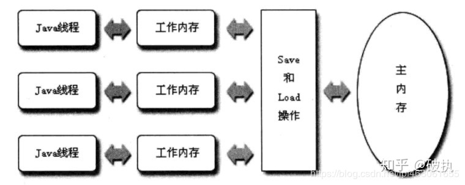
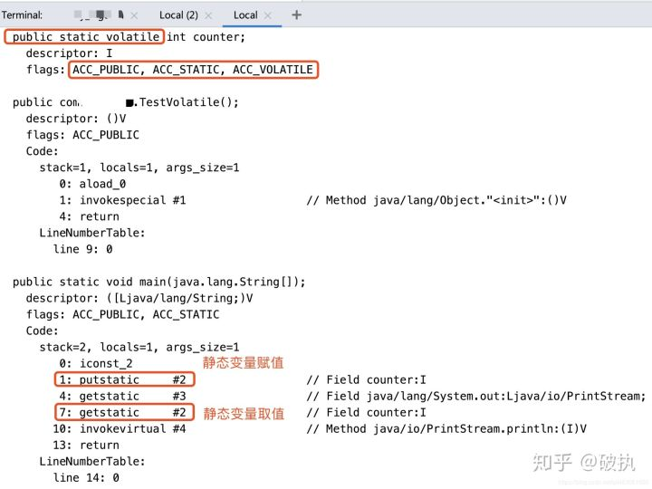
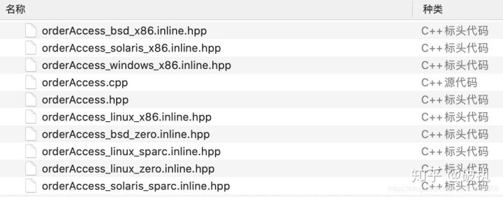
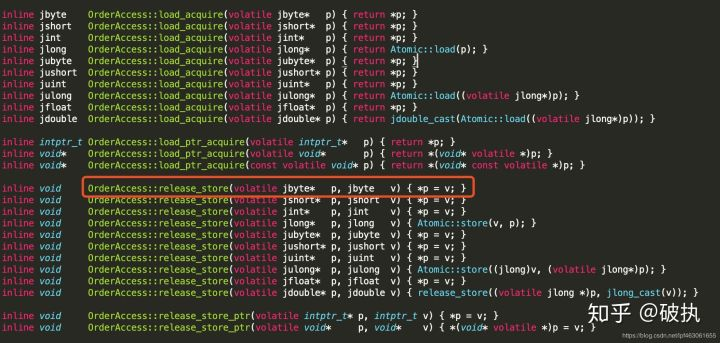
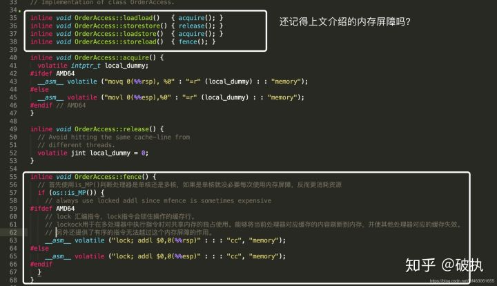
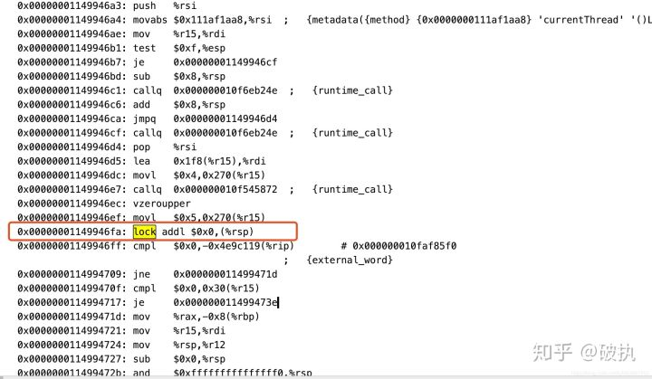

# volatile

`volatile`关键字是Java虚拟机提供的最轻量级的同步机制。在多线程编程中`volatile`和`synchronized`都起着举足轻重的作用。

[参照](https://zhuanlan.zhihu.com/p/133851347)

[CPU参照](https://zhuanlan.zhihu.com/p/133851347)

## 一、volatile的作用

1. 并发编程中有3大重要特性：

    - 原子性：一个操作或者多个操作，要么全部执行成功，要么全部执行失败。满足原子性的操作，中途不可被中断。

    - 可见性：多个线程共同访问共享变量时，某个线程修改了此变量，其他线程能立即看到修改后的值。

    - 有序性：程序执行的顺序按照代码的先后顺序执行。（由于JMM模型中允许编译器和处理器为了效率，进行指令重排序的优化。指令重排序在单线程内表现为串行语义，在多线程中会表现为无序。那么多线程并发编程中，就要考虑如何在多线程环境下可以允许部分指令重排，又要保证有序性）

2. **`synchronized`** 关键字同时保证**原子性、可见性、有序性**。
    - `synchronized`是同步锁，同步块内的代码相当于同一时刻单线程执行，故不存在原子性和指令重排序的问题
    - `synchronized`关键字的语义JMM有两个规定，保证其实现内存可见性：
        - 线程解锁前，必须把共享变量的最新值刷新到主内存中；
        - 线程加锁前，将清空工作内存中共享变量的值，从主内存中冲洗取值。

3. **`volatile`**关键字作用的是保证**可见性**和**有序性**，并不保证原子性。

### 1.1、volatile变量的可见性

Java虚拟机规范中定义了一种Java内存 模型（`Java Memory Model`，即JMM）来屏蔽掉各种硬件和操作系统的内存访问差异，以实现让Java程序在各种平台下都能达到一致的并发效果。

Java内存模型的主要目标就是**定义程序中各个变量的访问规则，即在虚拟机中将变量存储到内存和从内存中取出变量这样的细节**。

JMM中规定：

1. 所有的变量都存储在主内存（Main Memory）中，这里所说的变量指的是实例变量和类变量，不包含局部变量，因为局部变量是线程私有的，因此不存在竞争问题。
2. 每条线程都有自己的工作内存（Work Memory），线程的工作内存中保存了该线程所使用的变量的从主内存中拷贝的副本。
3. **线程对于变量的读、写都必须在工作内存中进行，而不能直接读、写主内存中的变量**。
4. 本线程的工作内存的变量也无法被其他线程直接访问，必须通过主内存完成。

整体内存模型如下图所示：





对于普通共享变量，线程A将变量修改后，体现在此线程的工作内存。在尚未同步到主内存时，若线程B使用此变量，从主内存中获取到的是修改前的值，便发生了共享变量值的不一致，也就是出现了**线程的可见性问题**。

`volatile`可见性定义：

- 当对`volatile`变量执行写操作后，JMM会把工作内存中的最新变量值强制刷新到主内存
- 写操作会导致其他线程中的缓存无效，这样，其他线程使用缓存时，发现本地工作内存中此变量无效，便从主内存中获取，这样获取到的变量便是最新的值，实现了线程的可见性。

### 1.2、volatile变量的禁止指令重排序

`volatile`是通过编译器在生成字节码时，在指令序列中添加“**内存屏障**”来禁止指令重排序的。

硬件层面的“**内存屏障**”：

- **sfence**：即写屏障(Store Barrier)，在写指令之后插入写屏障，能让写入缓存的最新数据写回到主内存，以保证写入的数据立刻对其他线程可见
- **lfence**：即读屏障(Load Barrier)，在读指令前插入读屏障，可以让高速缓存中的数据失效，重新从主内存加载数据，以保证读取的是最新的数据。
- **mfence**：即全能屏障(modify/mix Barrier )，兼具sfence和lfence的功能
- **lock 前缀**：lock不是内存屏障，而是一种锁。执行时会锁住内存子系统来确保执行顺序，甚至跨多个CPU。

JMM层面的“**内存屏障**”：

- **LoadLoad屏障**： 对于这样的语句Load1; LoadLoad; Load2，在Load2及后续读取操作要读取的数据被访问前，保证Load1要读取的数据被读取完毕。
- **StoreStore屏障**：对于这样的语句Store1; StoreStore; Store2，在Store2及后续写入操作执行前，保证Store1的写入操作对其它处理器可见。
- **LoadStore屏障**：对于这样的语句Load1; LoadStore; Store2，在Store2及后续写入操作被刷出前，保证Load1要读取的数据被读取完毕。
- **StoreLoad屏障**： 对于这样的语句Store1; StoreLoad; Load2，在Load2及后续所有读取操作执行前，保证Store1的写入对所有处理器可见。

JVM的实现会在`volatile`读写前后均加上内存屏障，在一定程度上保证有序性。如下所示：

> LoadLoadBarrier
> volatile 读操作
> LoadStoreBarrier
>
> StoreStoreBarrier
> volatile 写操作
> StoreLoadBarrier

## 二、volatile的的底层实现

从**Java代码、字节码、Jdk源码、汇编层面、硬件层面**去揭开`volatile`的面纱。

### 2.1、 Java代码层面

上一段最简单的代码，`volatile`用来修饰Java变量

```java
public class TestVolatile {

    public static volatile int counter = 1;

    public static void main(String[] args){
        counter = 2;
        System.out.println(counter);
    }
}
```

### 2.2、字节码层面

通过`javac TestVolatile.java`将类编译为class文件，再通过`javap -v TestVolatile.class`命令反编译查看字节码文件。

打印内容过长，截图其中的一部分：



可以看到，修饰`counter`字段的public、static、volatile关键字，在字节码层面分别是以下访问标志： **`ACC_PUBLIC, ACC_STATIC, ACC_VOLATILE`**

`volatile`在字节码层面，就是使用访问标志：**`ACC_VOLATILE`**来表示，供后续操作此变量时判断访问标志是否为`ACC_VOLATILE`，来决定是否遵循`volatile`的语义处理。

### 2.3、JVM源码层面

上小节图中main方法编译后的字节码，有`putstatic`和`getstatic`指令（如果是非静态变量，则对应`putfield`和`getfield`指令）来操作`counter`字段。那么对于被`volatile`变量修饰的字段，是如何实现`volatile`语义的，从下面的源码看起。

1. `openjdk8根路径/hotspot/src/share/vm/interpreter`路径下的`bytecodeInterpreter.cpp`文件中，处理`putstatic`和`putfield`指令的代码：

```cpp
CASE(_putfield):
CASE(_putstatic):
    {
          // .... 省略若干行 
          // ....

          // Now store the result 现在要开始存储结果了
          // ConstantPoolCacheEntry* cache;     -- cache是常量池缓存实例
          // cache->is_volatile()               -- 判断是否有volatile访问标志修饰
          int field_offset = cache->f2_as_index();
          if (cache->is_volatile()) { // ****重点判断逻辑**** 
            // volatile变量的赋值逻辑
            if (tos_type == itos) {
              obj->release_int_field_put(field_offset, STACK_INT(-1));
            } else if (tos_type == atos) {// 对象类型赋值
              VERIFY_OOP(STACK_OBJECT(-1));
              obj->release_obj_field_put(field_offset, STACK_OBJECT(-1));
              OrderAccess::release_store(&BYTE_MAP_BASE[(uintptr_t)obj >> CardTableModRefBS::card_shift], 0);
            } else if (tos_type == btos) {// byte类型赋值
              obj->release_byte_field_put(field_offset, STACK_INT(-1));
            } else if (tos_type == ltos) {// long类型赋值
              obj->release_long_field_put(field_offset, STACK_LONG(-1));
            } else if (tos_type == ctos) {// char类型赋值
              obj->release_char_field_put(field_offset, STACK_INT(-1));
            } else if (tos_type == stos) {// short类型赋值
              obj->release_short_field_put(field_offset, STACK_INT(-1));
            } else if (tos_type == ftos) {// float类型赋值
              obj->release_float_field_put(field_offset, STACK_FLOAT(-1));
            } else {// double类型赋值
              obj->release_double_field_put(field_offset, STACK_DOUBLE(-1));
            }
            // *** 写完值后的storeload屏障 ***
            OrderAccess::storeload();
          } else {
            // 非volatile变量的赋值逻辑
            if (tos_type == itos) {
              obj->int_field_put(field_offset, STACK_INT(-1));
            } else if (tos_type == atos) {
              VERIFY_OOP(STACK_OBJECT(-1));
              obj->obj_field_put(field_offset, STACK_OBJECT(-1));
              OrderAccess::release_store(&BYTE_MAP_BASE[(uintptr_t)obj >> CardTableModRefBS::card_shift], 0);
            } else if (tos_type == btos) {
              obj->byte_field_put(field_offset, STACK_INT(-1));
            } else if (tos_type == ltos) {
              obj->long_field_put(field_offset, STACK_LONG(-1));
            } else if (tos_type == ctos) {
              obj->char_field_put(field_offset, STACK_INT(-1));
            } else if (tos_type == stos) {
              obj->short_field_put(field_offset, STACK_INT(-1));
            } else if (tos_type == ftos) {
              obj->float_field_put(field_offset, STACK_FLOAT(-1));
            } else {
              obj->double_field_put(field_offset, STACK_DOUBLE(-1));
            }
          }
          UPDATE_PC_AND_TOS_AND_CONTINUE(3, count);
  }
```

2. 重点判断逻辑`cache->is_volatile()`方法，调用的是`openjdk8根路径/hotspot/src/share/vm/utilities`路径下的`accessFlags.hpp`文件中的方法，**用来判断访问标记是否为volatile修饰**。

```cpp
// Java access flags
bool is_public      () const         { return (_flags & JVM_ACC_PUBLIC      ) != 0; }
bool is_private     () const         { return (_flags & JVM_ACC_PRIVATE     ) != 0; }
bool is_protected   () const         { return (_flags & JVM_ACC_PROTECTED   ) != 0; }
bool is_static      () const         { return (_flags & JVM_ACC_STATIC      ) != 0; }
bool is_final       () const         { return (_flags & JVM_ACC_FINAL       ) != 0; }
bool is_synchronized() const         { return (_flags & JVM_ACC_SYNCHRONIZED) != 0; }
bool is_super       () const         { return (_flags & JVM_ACC_SUPER       ) != 0; }
// 是否volatile修饰
bool is_volatile    () const         { return (_flags & JVM_ACC_VOLATILE    ) != 0; }
bool is_transient   () const         { return (_flags & JVM_ACC_TRANSIENT   ) != 0; }
bool is_native      () const         { return (_flags & JVM_ACC_NATIVE      ) != 0; }
bool is_interface   () const         { return (_flags & JVM_ACC_INTERFACE   ) != 0; }
bool is_abstract    () const         { return (_flags & JVM_ACC_ABSTRACT    ) != 0; }
bool is_strict      () const         { return (_flags & JVM_ACC_STRICT      ) != 0; }
```

3. 下面一系列的`if...else...`对`tos_type`字段的判断处理，是针对java基本类型和引用类型的赋值处理。如：

```cpp
obj->release_byte_field_put(field_offset, STACK_INT(-1));
```

对byte类型的赋值处理，调用的是`openjdk8根路径/hotspot/src/share/vm/oops`路径下的`oop.inline.hpp`文件中的方法：

```cpp
// load操作调用的方法
inline jbyte oopDesc::byte_field_acquire(int offset) const                  
{ return OrderAccess::load_acquire(byte_field_addr(offset));     }
// store操作调用的方法
inline void oopDesc::release_byte_field_put(int offset, jbyte contents)     
{ OrderAccess::release_store(byte_field_addr(offset), contents); }
```

赋值的操作又被包装了一层，又调用的**OrderAccess::release_store**方法。

4. OrderAccess是定义在`openjdk8根路径/hotspot/src/share/vm/runtime`路径下的`orderAccess.hpp`头文件下的方法，具体的实现是根据不同的操作系统和不同的cpu架构，有不同的实现。

**强烈建议大家读一遍`orderAccess.hpp`文件中30-240行的注释！！！**你就会发现本文1.2章所介绍内容的来源，也是网上各种雷同文章的来源。




`orderAccess_linux_x86.inline.hpp`是linux系统下x86架构的实现：





可以从上面看到，到c++的实现层面，又使用c++中的`volatile`关键字，用来修饰变量，通常用于建立语言级别的memory barrier。在《C++ Programming Language》一书中对volatile修饰词的解释：

> A volatile specifier is a hint to a compiler that an object may change its value in ways not specified by the language so that aggressive optimizations must be avoided.

含义就是：

- `volatile`修饰的类型变量表示可以被某些编译器未知的因素更改（如：操作系统，硬件或者其他线程等）
- 使用 `volatile` 变量时，避免激进的优化。即：系统总是重新从内存读取数据，即使它前面的指令刚从内存中读取被缓存，防止出现未知更改和主内存中不一致

5. 步骤3中对变量赋完值后，程序又回到了2.3.1小章中第一段代码中一系列的if...else...对`tos_type`字段的判断处理之后。有一行关键的代码：**OrderAccess::storeload();** 即：只要`volatile`变量赋值完成后，都会走这段代码逻辑。

它依然是声明在`orderAccess.hpp`头文件中，在不同操作系统或cpu架构下有不同的实现。`orderAccess_linux_x86.inline.hpp`是linux系统下x86架构的实现：





代码`lock; addl $0,0(%%rsp)` 其中的addl $0,0(%%rsp) 是把寄存器的值加0，相当于一个空操作（之所以用它，不用空操作专用指令nop，是因为lock前缀不允许配合nop指令使用）

**lock前缀，会保证某个处理器对共享内存（一般是缓存行cacheline，这里记住缓存行概念，后续重点介绍）的独占使用。它将本处理器缓存写入内存，该写入操作会引起其他处理器或内核对应的缓存失效。通过独占内存、使其他处理器缓存失效，达到了“指令重排序无法越过内存屏障”的作用**

### 2.4、汇编层面

运行2.1章的代码时，加上JVM的参数：`-XX:+UnlockDiagnosticVMOptions -XX:+PrintAssembly`，就可以看到它的汇编输出。（如果运行报错，参见上篇文章：[synchronized底层原理（从Java对象头说到即时编译优化）](https://link.zhihu.com/?target=https%3A//blog.csdn.net/lpf463061655/article/details/105149322),拉到文章最底部有解决方案）

打印的汇编代码较长，仅截取其中的关键部分：





又看到了`lock addl $0x0,(%rsp)`指令，熟悉的配方熟悉的味道，和上面2.3章中的**步骤5**一摸一样，其实这里就是步骤5中代码的体现。

### 2.5、硬件层面

为什么会有上述如此复杂问题？为什么会有并发编程？为什么会产生可见性、有序性、原子性的线程或内存问题？

归根结底，还是计算机硬件高速发展的原因。CPU架构的发展，多核CPU的产生以及CPU缓存的适配是导致并发问题产生的原因之一。

CPU缓存相关内容也是一大块内容，消化完上述的干货内容，**请看下一篇对CPU缓存相关的干货文章。**
