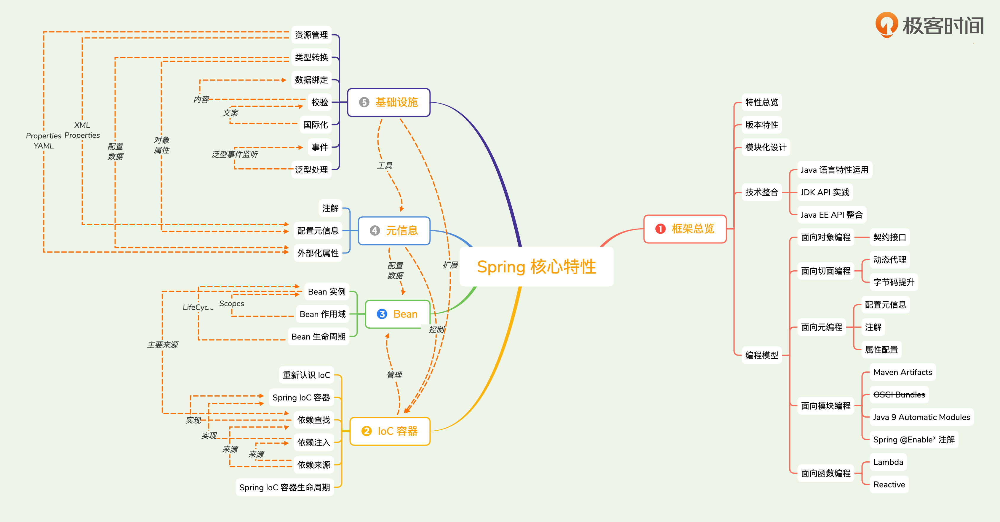
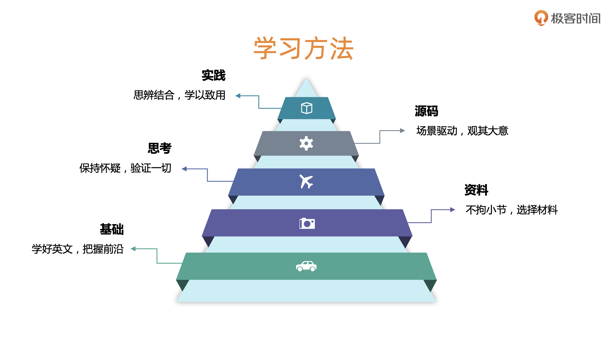
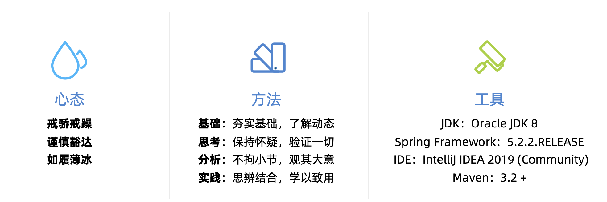

# Spring 核心编程思想-小马哥

[官方文档](https://docs.spring.io/spring/docs/current/spring-framework-reference/)

[TOC]

## 第一章：Spring Framework总览 (12讲)

### 01 课程介绍
1. Spring 的 Java 语言特性，如：反射、动态代理、枚举、泛型、注解、ARM和 Lambda语法等
2. Spring 设计思想和模式的实现，如：OOP、IoC、DDD、TDD、GoF23等
3. Java API 的分装与简化，如：JDBC、事务Transaction、Servlet、JPA、JMX、Bean Validation
4. JSR 规范的适配与实现
5. 第三方框架的整合，如：MyBatis、Hibernate等

### 02 内容综述

1. Spring 核心特性

2. Spring 核心价值

3. 学习方法（小马哥推荐）

### 03 课前准备：学习三件套（工具、代码与大脑）

### 04 特性总览：核心特性、数据存储、Web技术、框架整合与测试

#### 核心特性

- IoC 容器(IoC Container)
- Spring 事件(Events)
- 资源管理(Resources)
- 国际化(i18n)
- 校验(Validation)
- 数据绑定(Data Binding)
- 类型装换(Type Conversion)
- Spring 表达式(Spring Express Language)
- 面向切面编程(AOP)

####  数据存储

- JDBC
- 事务抽象(Transactions)
- DAO 支持(DAO Support)
- O/R映射(O/R Mapping)
- XML 编列(XML Marshalling)

#### Web技术

- Web Servlet 技术栈
    - Spring MVC
    - WebSocket
    - SockJS（忽略）
- Web Reactive 技术栈
    - Spring WebFlux
    - WebClient
    - WebSocket

#### 框架整合

- 远程调用(Remoting)
- Java 消息服务(JMS)
- Java 连接架构( JCA)
- Java 管理扩展(JMX)
- Java 邮件客户端(Email)
- 本地任务(Tasks)
- 本地调度(Scheduling)
- 缓存抽象(Caching)
- Spring 测试(Testing)

#### 测试

- 模拟对象(Mock Objects)
- TestContext 框架(TestContext Framework)
- Spring MVC 测试(Spring MVC Test)
- Web 测试客户端(WebTestClient)

### 05 Spring版本特性：Spring各个版本引入了哪些新特性？
### 06 Spring模块化设计：Spring功能特性如何在不同模块中组织？
### 07 Java语言特性运用：各种Java语法特性是怎样被Spring各种版本巧妙运用的？
### 08 JDK API实践：Spring怎样取舍Java I/O、集合、反射、动态代理等API的使用？
### 09 Java EE API整合：为什么Spring要与“笨重”的Java EE共舞？
### 10 Spring编程模型：Spring实现了哪些编程模型？
### 11 Spring核心价值：我们能从Spring Framework中学到哪些经验和教训呢？
### 12 面试题精选

## 第二章：重新认识IoC (9讲)
### 13  IoC发展简介：你可能对IoC有些误会？
### 14  IoC主要实现策略：面试官总问IoC和DI的区别，他真的理解吗？
### 15  IoC容器的职责：IoC除了依赖注入，还涵盖哪些职责呢？
### 16  除了Spring，还有其它的IOC容器实现吗？
### 17  传统IoC容器实现：JavaBeans也是IoC容器吗？
### 18  轻量级IoC容器：如何界定IoC容器的“轻重”？
### 19  依赖查找 VS. 依赖注入：为什么Spring总会强调后者，而选择性忽视前者？
### 20  构造器注入 VS. Setter 注入：为什么Spring官方文档的解读会与作者的初心出现偏差？
### 21  面试题精选

## 第三章：Spring IoC容器概述 (9讲)
### 22  Spring IoC依赖查找：依赖注入还不够吗？依赖查找存在的价值几何？
### 23  Spring IoC依赖注入：Spring提供了哪些依赖注入模式和类型呢？
### 24  Spring IoC依赖来源：依赖注入和查找的对象来自于哪里？
### 25  Spring IoC配置元信息：Spring IoC有哪些配置元信息？它们的进化过程是怎样的？
### 26  Spring IoC容器：BeanFactory和ApplicationContext谁才是Spring IoC容器？
### 27  Spring应用上下文：ApplicationContext除了IoC容器角色，还提供哪些特性？
### 28  使用Spring IoC容器：选BeanFactory还是ApplicationContext？
### 29  Spring IoC容器生命周期：IoC容器启停过程中发生了什么？
### 30  面试题精选

## 第四章：Spring Bean基础 (11讲)
### 31 定义Bean：什么是BeanDefinition？
### 32 BeanDefinition元信息：除了Bean名称和类名，还有哪些Bean元信息值得关注？
### 33 命名Spring Bean：id和name属性命名Bean，哪个更好？
### 34 Spring Bean的别名：为什么命名Bean还需要别名？
### 35 注册Spring Bean：如何将BeanDefinition注册到IoC容器？
### 36 实例化Spring Bean：Bean实例化的姿势有多少种？
### 37 初始化Spring Bean：Bean初始化有哪些方式？
### 38 延迟初始化Spring Bean：延迟初始化的Bean会影响依赖注入吗？
### 39 销毁Spring Bean： 销毁Bean的基本操作有哪些？
### 40 回收Spring Bean：Spring IoC容器管理的Bean能够被垃圾回收吗？
### 41 面试题精选

## 第五章：Spring IoC依赖查找（Dependency Lookup） (9讲)
### 42  依赖查找的今世前生：Spring IoC容器从Java标准中学到了什么？
### 43  单一类型依赖查找：如何查找已知名称或类型的Bean对象？
### 44  集合类型依赖查找：如何查找已知类型多个Bean集合？
### 45  层次性依赖查找：依赖查找也有双亲委派？
### 46  延迟依赖查找：非延迟初始化Bean也能实现延迟查找？
### 47  安全依赖查找
### 48  内建可查找的依赖：哪些Spring IoC容器内建依赖可供查找？
### 49  依赖查找中的经典异常：Bean找不到？Bean不是唯一的？Bean创建失败？
### 50  面试题精选

## 第六章：Spring IoC依赖注入（Dependency Injection） (20讲)
### 51  依赖注入的模式和类型：Spring提供了哪些依赖注入的模式和类型？
### 52  自动绑定（Autowiring）：为什么Spring会引入Autowiring？
### 53  自动绑定（Autowiring）模式：各种自动绑定模式的使用场景是什么？
### 54  自动绑定（Autowiring）限制和不足：如何理解和挖掘官方文档中深层次的含义？
### 55  Setter方法依赖注入：Setter注入的原理是什么？
### 56  构造器依赖注入：官方为什么推荐使用构造器注入？
### 57  字段注入：为什么Spring官方文档没有单独列举这种注入方式？
### 58  方法注入：方法注入是@Autowired专利吗？
### 59  接口回调注入：回调注入的使用场景和限制有哪些？
### 60  依赖注入类型选择：各种依赖注入有什么样的使用场景？
### 61  基础类型注入：String和Java原生类型也能注入Bean的属性，它们算依赖注入吗？
### 62  集合类型注入：注入Collection和Map类型的依赖区别？还支持哪些集合类型？
### 63  限定注入：如何限定Bean名称注入？如何实现Bean逻辑分组注入？
### 64  延迟依赖注入：如何实现延迟执行依赖注入？与延迟依赖查找是类似的吗？
### 65  依赖处理过程：依赖处理时会发生什么？其中与依赖查找的差异在哪？
### 66  @Autowired注入：@Autowired注入的规则和原理有哪些？
### 67  JSR-330 @Inject注入：@Inject与@Autowired的注入原理有怎样的联系？
### 68  Java通用注解注入原理：Spring是如何实现@Resource和@EJB等注解注入的？
### 69  自定义依赖注入注解：如何最简化实现自定义依赖注入注解？
### 70  面试题精选
## 第七章：Spring IoC依赖来源（Dependency Sources） (8讲)
### 71 依赖查找的来源：除容器内建和自定义Spring Bean之外，还有其他来源提供依赖查找吗？
### 72 依赖注入的来源：难道依赖注入的来源与依赖查找的不同吗？
### 73 Spring容器管理和游离对象：为什么会有管理对象和游离对象？
### 74 Spring Bean Definition作为依赖来源：Spring Bean的来源
### 75 单例对象作为依赖来源：单体对象与普通Spring Bean存在哪些差异？
### 76 非Spring容器管理对象作为依赖来源：如何理解ResolvableDependency？
### 77 外部化配置作为依赖来源：@Value是如何将外部化配置注入Spring Bean的？
### 78 面试题精选
## 第八章：Spring Bean作用域（Scopes） (9讲)
### 79 Spring Bean作用域：为什么Spring Bean需要多种作用域？
### 80 "singleton" Bean作用域：单例Bean在当前Spring应用真是唯一的吗？
### 81 "prototype" Bean作用域：原型Bean在哪些场景下会创建新的实例？
### 82 "request" Bean作用域：request Bean会在每次HTTP请求创建新的实例吗？
### 83 "session" Bean作用域：session Bean在Spring MVC场景下存在哪些局限性？
### 84 "application" Bean作用域：application Bean是否真的有必要？
### 85 自定义Bean作用域：设计Bean作用域应该注意哪些原则？
### 86 课外资料：Spring Cloud RefreshScope是如何控制Bean的动态刷新？
### 87 面试题精选
## 第九章：Spring Bean生命周期（Bean Lifecycle） (18讲)
### 88 Spring Bean 元信息配置阶段：BeanDefinition配置与扩展
### 89 Spring Bean 元信息解析阶段：BeanDefinition的解析
### 90 Spring Bean 注册阶段：BeanDefinition与单体Bean注册
### 91 Spring BeanDefinition合并阶段：BeanDefinition合并过程是怎样出现的？
### 92 Spring Bean Class加载阶段：Bean ClassLoader能够被替换吗?
### 93 Spring Bean实例化前阶段：Bean的实例化能否被绕开？
### 94 Spring Bean实例化阶段：Bean实例是通过Java反射创建吗？
### 95 Spring Bean实例化后阶段：Bean实例化后是否一定被是使用吗？
### 96 Spring Bean属性赋值前阶段：配置后的PropertyValues还有机会修改吗？
### 97 Aware接口回调阶段：众多Aware接口回调的顺序是安排的？
### 98 Spring Bean初始化前阶段：BeanPostProcessor
### 99 Spring Bean初始化阶段：@PostConstruct、InitializingBean以及自定义方法
### 100 Spring Bean初始化后阶段：BeanPostProcessor
### 101 Spring Bean初始化完成阶段：SmartInitializingSingleton
### 102 Spring Bean销毁前阶段：DestructionAwareBeanPostProcessor用在怎样的场景?
### 103 Spring Bean销毁阶段：@PreDestroy、DisposableBean以及自定义方法
### 104 Spring Bean垃圾收集（GC）：何时需要GC Spring Bean？
### 105 面试题精选
## 第十章：Spring配置元信息（Configuration Metadata） (17讲)
### 106  Spring配置元信息：Spring存在哪些配置元信息？它们分别用在什么场景？
### 107  Spring Bean配置元信息：BeanDefinition
### 108  Spring Bean属性元信息：PropertyValues
### 109  Spring容器配置元信息
### 110  基于XML资源装载Spring Bean配置元信息
### 111  基于Properties资源装载Spring Bean配置元信息：为什么Spring官方不推荐？
### 112  基于Java注解装载Spring Bean配置元信息
### 113  Spring Bean配置元信息底层实现之XML资源
### 114  Spring Bean配置元信息底层实现之Properties资源
### 115  Spring Bean配置元信息底层实现之Java注解
### 116  基于XML资源装载Spring IoC容器配置元信息
### 117  基于Java注解装载Spring IoC容器配置元信息
### 118  基于Extensible XML authoring 扩展Spring XML元素
### 119  Extensible XML authoring扩展原理
### 120  基于Properties资源装载外部化配置
### 121  基于YAML资源装载外部化配置
### 122  面试题
## 第十一章：Spring资源管理（Resources） (11讲)
### 123 引入动机：为什么Spring不使用Java标准资源管理，而选择重新发明轮子？
### 124 Java标准资源管理：Java URL资源管理存在哪些潜规则？
### 125 Spring资源接口：Resource接口有哪些语义？它是否“借鉴”了SUN的实现呢？
### 126 Spring内建Resource实现：Spring框架提供了多少种内建的Resource实现呢？
### 127 Spring Resource接口扩展：Resource能否支持写入以及字符集编码？
### 128 Spring资源加载器：为什么说Spring应用上下文也是一种Spring资源加载器？
### 129 Spring通配路径资源加载器：如何理解路径通配Ant模式？
### 130 Spring通配路径模式扩展：如何扩展路径匹配的规则？
### 131 依赖注入Spring Resource：如何在XML和Java注解场景注入Resource对象？
### 132 依赖注入ResourceLoader：除了ResourceLoaderAware回调注入，还有哪些注入方法？
### 133 面试题精选
## 第十二章：Spring国际化（i18n） (9讲)
### 134 Spring国际化使用场景
### 135 Spring国际化接口：MessageSource不是技术的创造者，只是技术的搬运工？
### 136 层次性MessageSource：双亲委派不是ClassLoader的专利吗？
### 137 Java国际化标准实现：ResourceBundle潜规则多？
### 138 Java文本格式化：MessageFormat脱离Spring场景，能力更强大？
### 139 MessageSource开箱即用实现：ResourceBundle +MessageFormat组合拳？
### 140 MessageSource内建依赖：到底“我”是谁？
### 141 课外资料：SpringBoot为什么要新建MessageSource Bean？
### 142 面试题精选
## 第十三章：Spring校验（Validation） (7讲)
### 143 Spring校验使用场景：为什么Validator并不只是Bean的校验？
### 144 Validator接口设计：画虎不成反类犬？
### 145 Errors接口设计：复杂得没有办法理解？
### 146 Errors文案来源：Spring国际化充当临时工？
### 147 自定义Validator：为什么说Validator容易实现，却难以维护？
### 148 Validator的救赎：如果没有Bean Validation，Validator将会在哪里吗？
### 149 面试题精选
## 第十四章：Spring数据绑定（Data Binding） (9讲)
### 150 Spring数据绑定使用场景：为什么官方文档描述一笔带过？
### 151 Spring数据绑定组件：DataBinder
### 152 DataBinder绑定元数据：PropertyValues不是Spring Bean属性元信息吗？
### 153 DataBinder绑定控制参数：ignoreUnknownFields和ignoreInvalidFields有什么作用？
### 154 Spring底层JavaBeans替换实现：BeanWrapper源于JavaBeans而高于JavaBeans？
### 155 BeanWrapper的使用场景：Spring数据绑定只是副业？
### 156 课外资料：标准JavaBeans是如何操作属性的
### 157 DataBinder数据校验：又见Validator
### 158 面试题精选
## 第十五章：Spring类型转换（Type Conversion） (15讲)
### 159 Spring类型转换的实现：Spring提供了哪几种类型转换的实现？
### 160 使用场景：Spring类型转换各自的使用场景以及发展脉络是怎样的？
### 161 基于JavaBeans接口的类型转换：Spring是如何扩展PropertyEditor接口实现类型转换的？
### 162 Spring内建PropertyEditor扩展：哪些常见类型被Spring内建PropertyEditor实现？
### 163 自定义PropertyEditor扩展：不尝试怎么知道它好不好用？
### 164 SpringPropertyEditor的设计缺陷：为什么基于PropertyEditor扩展并不适合作为类型转换？
### 165 Spring 3通用类型转换接口：为什么Converter接口设计比PropertyEditor更合理？
### 166 Spring内建类型转换器：Spring的内建类型转换器到底有多丰富？
### 167 Converter接口的局限性：哪种类型转换场景Converter无法满足？有什么应对之策？
### 168 GenericConverter接口：为什么GenericConverter比Converter更通用？
### 169 优化GenericConverter接口：为什么GenericConverter需要补充条件判断？
### 170 扩展Spring类型转换器：为什么最终注册的都是ConditionalGenericConverter？
### 171 统一类型转换服务：ConversionService足够通用吗？
### 172 ConversionService作为依赖-能够同时作为依赖查找和依赖注入的来源吗？
### 173 面试题精选
## 第十六章：Spring泛型处理（Generic Resolution） (8讲)
### 174 Java泛型基础：泛型参数信息在擦写后还会存在吗？
### 175 Java 5类型接口-Type：Java类型到底是Type还是Class？
### 176 Spring泛型类型辅助类：GenericTypeResolver
### 177 Spring泛型集合类型辅助类：GenericCollectionTypeResolver
### 178 Spring方法参数封装-MethodParameter：不仅仅是方法参数
### 179 Spring 4.2泛型优化实现-ResolvableType
### 180 ResolvableType的局限性：形式比人强？
### 181 面试题精选
## 第十七章：Spring事件（Events） (20讲)
### 182 Java事件/监听器编程模型：为什么Java中没有提供标准实现？
### 183 面向接口的事件/监听器设计模式：单事件监听和多事件监听怎么选？
### 184 面向注解的事件/监听器设计模式：便利也会带来伤害？
### 185 Spring标准事件-ApplicationEvent：为什么不用EventObject？
### 186 基于接口的Spring事件监听器：ApplicationListener为什么选择单事件监听模式？
### 187 基于注解的Spring事件监听器：@EventListener有哪些潜在规则？
### 188 注册Spring ApplicationListener：直接注册和间接注册有哪些差异？
### 189 Spring事件发布器：Spring 4.2给ApplicationEventPublisher带来哪些变化？
### 190 Spring 层次性上下文事件传播：这是一个Feature还是一个Bug？
### 191 Spring内建事件（Built-in Events）：为什么ContextStartedEvent和 ContextStoppedEvent是鸡肋事件？ 
### 192 Spring 4.2 Payload事件：为什么说PayloadApplicationEvent并非一个良好的设计？
### 193 自定义Spring事件：自定义事件业务用得上吗？
### 194 依赖注入ApplicationEventPublisher：事件推送还会引起Bug？
### 195 依赖查找ApplicationEventPublisher：ApplicationEventPublisher从何而来？
### 196 ApplicationEventPublisher底层实现：ApplicationEventMulticaster也是Java Observable的延伸？
### 197 同步和异步Spring事件广播：Spring对J.U.C Executor接口的理解不够？
### 198 Spring 4.1事件异常处理：ErrorHandler使用有怎样的限制？
### 199 Spring事件/监听器实现原理：面向接口和注解的事件/监听器实现有区别吗？
### 200 课外资料：Spring Boot和Spring Cloud事件也是Spring事件？
### 201 面试题精选
## 第十八章：Spring注解（Annotations） (12讲)
### 202 Spring注解驱动编程发展历程
### 203 Spring核心注解场景分类
### 204 Spring注解编程模型
### 205 Spring元注解（Meta-Annotations）
### 206 Spring模式注解（Stereotype Annotations）
### 207 Spring组合注解（Composed Annotations）
### 208 Spring注解属性别名（Attribute Aliases）
### 209 Spring注解属性覆盖（Attribute Overrides）
### 210 Spring @Enable模块驱动
### 211 Spring条件注解
### 212 课外资料：Spring Boot和Spring Cloud是怎样在Spring注解内核上扩展的?
### 213 面试题精选
## 第十九章：Spring Environment抽象（Environment Abstraction） (16讲)
### 214 理解Spring Environment抽象
### 215 Spring Environment接口使用场景
### 216 Environment占位符处理
### 217 理解条件配置Spring Profiles
### 218 Spring 4重构@Profile
### 219 依赖注入Environment
### 220 依赖查找Environment
### 221 依赖注入@Value
### 222 Spring类型转换在Environment中的运用
### 223 Spring类型转换在@Value中的运用
### 224 Spring配置属性源PropertySource
### 225 Spring內建的配置属性源
### 226 基于注解扩展Spring配置属性源
### 227 基于API扩展Spring外部化配置属性源
### 228 课外资料：Spring 4.1测试配置属性源-@TestPropertySource
### 229 面试题精选
## 第二十章：Spring应用上下文生命周期（Container Lifecycle） (21讲)
### 230 Spring应用上下文启动准备阶段
### 231 BeanFactory创建阶段
### 232 BeanFactory准备阶段
### 233 BeanFactory后置处理阶段
### 234 BeanFactory注册BeanpostProcessor阶段
### 235 初始化内建Bean：MessageSource
### 236 初始化内建Bean：Spring事件广播器
### 237 Spring应用上下文刷新阶段
### 238 Spring事件监听器注册阶段
### 239 BeanFactory初始化完成阶段
### 240 Spring应用上下刷新完成阶段
### 241 Spring应用上下文启动阶段
### 242 Spring应用上下文停止阶段
### 243 Spring应用上下文关闭阶段
### 244 面试题精选
### 245 结束语
## 加餐
### 加餐1：为什么说ObjectFactory提供的是延迟依赖查找?
### 加餐2 依赖查找（注入）的Bean会被缓存吗？
### 加餐3 @Bean的处理流程是怎样的？
### 加餐4 BeanFactory如何处理循环依赖的？
### 加餐5 MyBatics与Spring Framewo