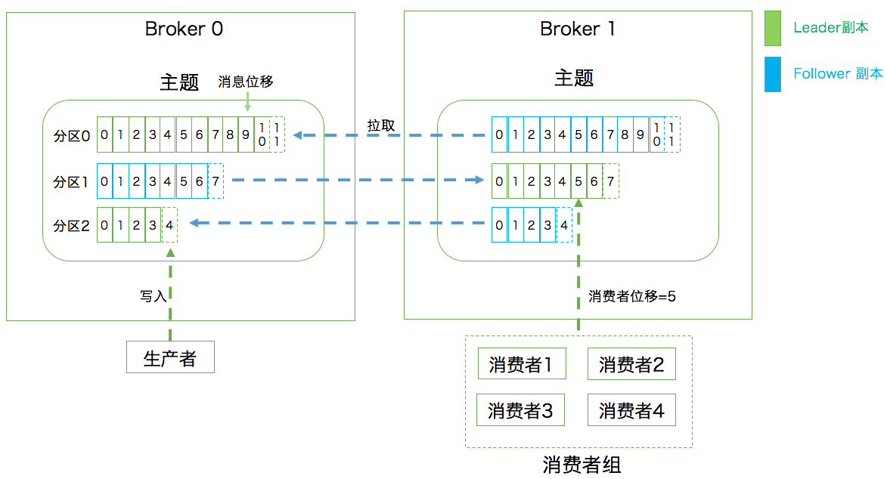
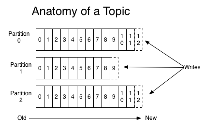
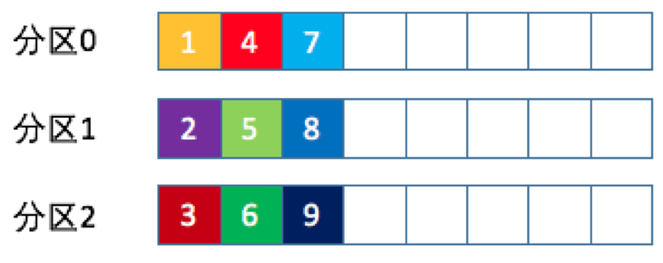
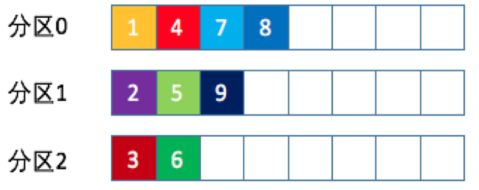
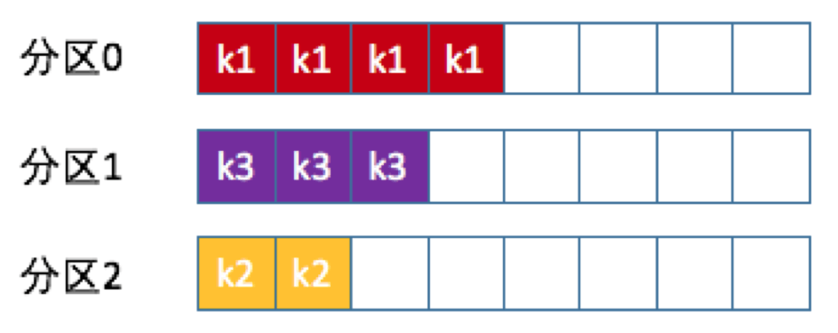
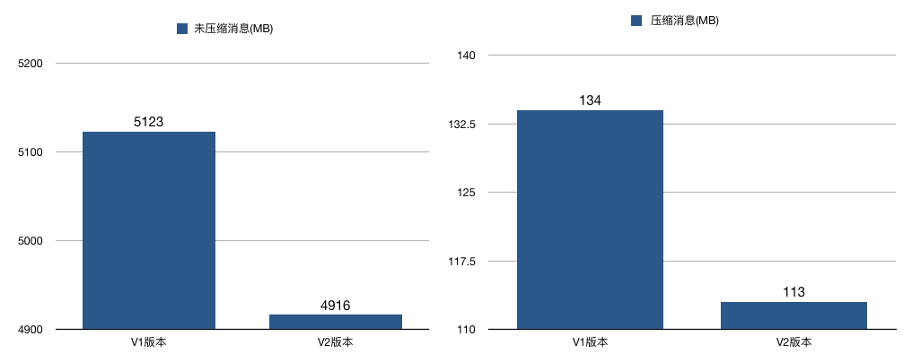
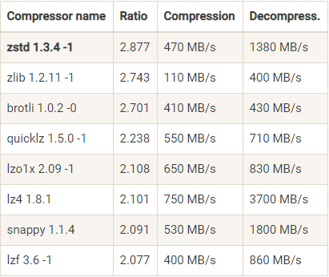
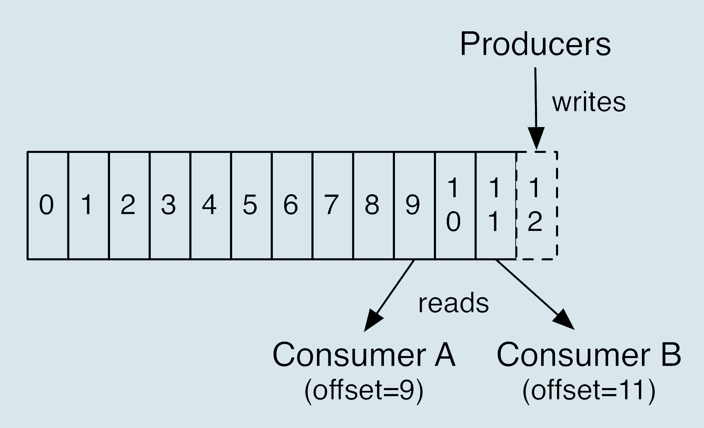
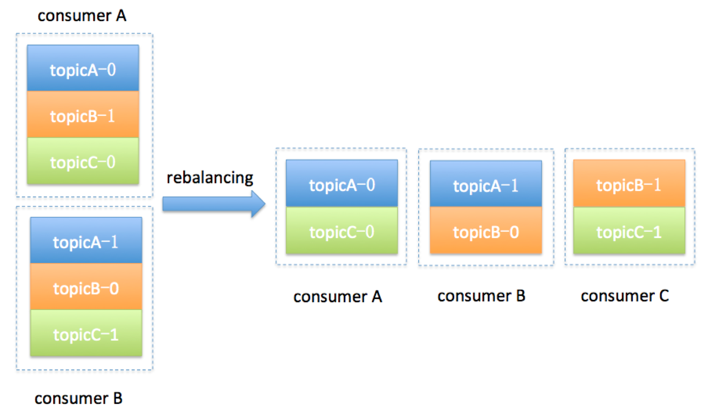
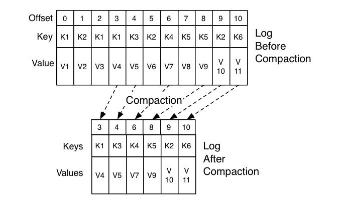

# Kafka核心技术与实战

学习方法与目标：把Kafka官网通读几遍然后再实现一个实时日志收集系统（比如把服务器日志实时放入Kafka）。

## 01 | Kafka 介绍

命名来自 Franz Kafka 这个作家，由 Linkedin 团队开发

### Kafka 是什么呢？

一句话概括一下：Apache Kafka 是一款开源的消息引擎系统。

> 消息引擎系统是一组规范。企业利用这组规范在不同系统之间**传递语义准确的消息**，实现松耦合的异步式数据传递。

Kafka 传输消息的格式是纯二进制的字节序列

### Kafka 传输协议

- 点对点模型：也叫消息队列模型。如果拿上面那个“民间版”的定义来说，那么系统 A 发送的消息只能被系统 B 接收，其他任何系统都不能读取 A 发送的消息。日常生活的例子比如电话客服就属于这种模型：同一个客户呼入电话只能被一位客服人员处理，第二个客服人员不能为该客户服务。

- 发布 / 订阅模型：与上面不同的是，它有一个主题（Topic）的概念，你可以理解成逻辑语义相近的消息容器。该模型也有发送方和接收方，只不过提法不同。发送方也称为发布者（Publisher），接收方称为订阅者（Subscriber）。和点对点模型不同的是，这个模型可能存在多个发布者向相同的主题发送消息，而订阅者也可能存在多个，它们都能接收到相同主题的消息。生活中的报纸订阅就是一种典型的发布 / 订阅模型。

Kafka 同时支持这两种消息引擎模型

### Kafka 作用：**削峰填谷、解耦**

## 02 | Kafka术语

在 Kafka 中，发布订阅的对象是**主题**（Topic），你可以为每个业务、每个应用甚至是每类数据都创建专属的主题。向主题发布消息的客户端应用程序称为**生产者**（Producer），生产者程序通常持续不断地向一个或多个主题发送消息，而订阅这些主题消息的客户端应用程序就被称为**消费者**（Consumer）。和生产者类似，消费者也能够同时订阅多个主题的消息。我们把生产者和消费者统称为**客户端**（Clients）。你可以同时运行多个生产者和消费者实例，这些实例会不断地向 Kafka 集群中的多个主题生产和消费消息。

有客户端自然也就有**服务器端**。Kafka 的服务器端由被称为 **Broker** 的服务进程构成，即一个 Kafka 集群由多个 Broker 组成，<u>*Broker 负责接收和处理客户端发送过来的请求，以及对消息进行持久化*</u>。虽然多个 Broker 进程能够运行在同一台机器上，但更常见的做法是将不同的 Broker 分散运行在不同的机器上，这样如果集群中某一台机器宕机，即使在它上面运行的所有 Broker 进程都挂掉了，其他机器上的 Broker 也依然能够对外提供服务。这其实就是 Kafka 提供高可用的手段之一。

实现高可用的另一个手段就是**备份机制**（Replication）。备份的思想很简单，就是把相同的数据拷贝到多台机器上，而这些相同的数据拷贝在 Kafka 中被称为**副本**（Replica）。Kafka 定义了两类副本：**领导者副本**（Leader Replica）和**追随者副本**（Follower Replica）。前者对外提供服务，这里的对外指的是与客户端程序进行交互；而后者只是被动地追随领导者副本而已，不能与外界进行交互。

- 领导者副本的工作机制也很简单：**生产者总是向领导者副本写消息；而消费者总是从领导者副本读消息。**
- 追随者副本，它只做一件事：**向领导者副本发送请求，请求领导者把最新生产的消息发给它，这样它能保持与领导者的同步。**

副本机制可以保证数据的持久化或消息不丢失，但没有解决伸缩性的问题。**伸缩性**即所谓的 Scalability。什么是伸缩性呢？我们拿副本来说，虽然现在有了领导者副本和追随者副本，但倘若领导者副本积累了太多的数据以至于单台 Broker 机器都无法容纳了，此时应该怎么办呢？一个很自然的想法就是，能否把数据分割成多份保存在不同的 Broker 上。这种机制就是所谓的**分区**（Partitioning）。

Kafka 中的分区机制指的是将每个主题划分成多个**分区**（Partition），每个分区是一组有序的消息日志。生产者生产的每条消息只会被发送到一个分区中，也就是说如果向一个双分区的主题发送一条消息，这条消息要么在分区 0 中，要么在分区 1 中。如你所见，Kafka 的分区编号是从 0 开始的，如果 Topic 有 100 个分区，那么它们的分区号就是从 0 到 99。

Kafka 副本是在分区这个层级定义的。每个分区下可以配置若干个副本，其中只能有 1 个领导者副本和 N-1 个追随者副本。生产者向分区写入消息，每条消息在分区中的位置信息由一个叫**位移**（Offset）的数据来表征。分区位移总是从 0 开始，假设一个生产者向一个空分区写入了 10 条消息，那么这 10 条消息的位移依次是 0、1、2、…、9。

### Kafka 的三层消息架构

- 第一层是主题层，每个主题可以配置 M 个分区，而每个分区又可以配置 N 个副本。
- 第二层是分区层，每个分区的 N 个副本中只能有一个充当领导者角色，对外提供服务；其他 N-1 个副本是追随者副本，只是提供数据冗余之用。
- 第三层是消息层，分区中包含若干条消息，每条消息的位移从 0 开始，依次递增。
- 最后，客户端程序只能与分区的领导者副本进行交互。

### Kafka Broker 是如何持久化数据的

总的来说，Kafka 使用消息日志（Log）来保存数据，一个日志就是磁盘上一个只能追加写（Append-only）消息的物理文件。因为只能追加写入，故避免了缓慢的随机 I/O 操作，改为性能较好的顺序 I/O 写操作，这也是实现 Kafka 高吞吐量特性的一个重要手段。若不停地向一个日志写入消息，最终也会耗尽所有的磁盘空间，因此 Kafka 必然要定期地删除消息以回收磁盘。怎么删除呢？简单来说就是通过日志段（Log Segment）机制。在 Kafka 底层，一个日志又进一步细分成多个日志段，消息被追加写到当前最新的日志段中，当写满了一个日志段后，Kafka 会自动切分出一个新的日志段，并将老的日志段封存起来。Kafka 在后台还有定时任务会定期地检查老的日志段是否能够被删除，从而实现回收磁盘空间的目的。

点对点模型（Peer to Peer，P2P）指的是同一条消息只能被下游的一个消费者消费，其他消费者则不能染指。在 Kafka 中实现这种 P2P 模型的方法就是引入了消费者组（Consumer Group）。所谓的消费者组，指的是多个消费者实例共同组成一个组来消费一组主题。这组主题中的每个分区都只会被组内的一个消费者实例消费，其他消费者实例不能消费它。为什么要引入消费者组呢？主要是为了提升消费者端的吞吐量。多个消费者实例同时消费，加速整个消费端的吞吐量（TPS）。

消费者组里面的所有消费者实例不仅“瓜分”订阅主题的数据，而且更酷的是它们还能彼此协助。假设组内某个实例挂掉了，Kafka 能够自动检测到，然后把这个 Failed 实例之前负责的分区转移给其他活着的消费者。这个过程就是 Kafka 中大名鼎鼎的“重平衡”（Rebalance）。

每个消费者在消费消息的过程中必然需要有个字段记录它当前消费到了分区的哪个位置上，这个字段就是消费者位移（Consumer Offset）。上面的“位移”表征的是分区内的消息位置，它是不变的，即一旦消息被成功写入到一个分区上，它的位移值就是固定的了。而消费者位移则不同，它可能是随时变化的，毕竟它是消费者消费进度的指示器嘛。

小结

- 消息：Record。Kafka 是消息引擎嘛，这里的消息就是指 Kafka 处理的主要对象。
- 主题：Topic。主题是承载消息的逻辑容器，在实际使用中多用来区分具体的业务。
- 分区：Partition。一个有序不变的消息序列。每个主题下可以有多个分区。
- 消息位移：Offset。表示分区中每条消息的位置信息，是一个单调递增且不变的值。
- 副本：Replica。Kafka 中同一条消息能够被拷贝到多个地方以提供数据冗余，这些地方就是所谓的副本。副本还分为领导者副本和追随者副本，各自有不同的角色划分。副本是在分区层级下的，即每个分区可配置多个副本实现高可用。
- 生产者：Producer。向主题发布新消息的应用程序。
- 消费者：Consumer。从主题订阅新消息的应用程序。
- 消费者位移：Consumer Offset。表征消费者消费进度，每个消费者都有自己的消费者位移。
- 消费者组：Consumer Group。多个消费者实例共同组成的一个组，同时消费多个分区以实现高吞吐。
- 重平衡：Rebalance。消费者组内某个消费者实例挂掉后，其他消费者实例自动重新分配订阅主题分区的过程。
- Rebalance 是 Kafka 消费者端实现高可用的重要手段。



## 03 | Kafka 只是消息引擎系统吗？

Apache Kafka 是消息引擎系统，也是一个分布式流处理平台（Distributed Streaming Platform）。

Kafka 特性：

- 提供一套 API 实现生产者和消费者；
- 降低网络传输和磁盘存储开销；
- 实现高伸缩性架构。

Kafka 作为流处理平台的优点：

- 更容易实现端到端的正确性（Correctness）
- 自己对于流式计算的定位，Kafka Streams 是一个用于搭建实时流处理的客户端库而非是一个完整的功能系统

> 主流流处理平台：Apache Storm、Apache Spark Streaming、Apache Flink

## 04 | 选择哪种Kafka？

### Apache Kafka

也称社区版 Kafka。优势在于迭代速度快，社区响应度高，使用它可以让你有更高的把控度；

缺陷在于仅提供基础核心组件，缺失一些高级的特性。（如监控框架 需借助第三方工具 Kafka manage）

### Confluent Kafka

Confluent 公司提供的 Kafka。优势在于集成了很多高级特性且由 Kafka 原班人马打造，质量上有保证；

缺陷在于相关文档资料不全，普及率较低，没有太多可供参考的范例。

### Cloudera/Hortonworks Kafka

大数据云公司提供的 Kafka，内嵌 Apache Kafka。优势在于操作简单，节省运维成本；

缺陷在于把控度低，演进速度较慢。

## 05 | Kafka的版本号

### 版本号说明


去官网上下载 kafka 例如：

**2.6.0**

- Released Aug 3, 2020
- [Release Notes](https://www.apache.org/dist/kafka/2.6.0/RELEASE_NOTES.html)
- Source download: [kafka-2.6.0-src.tgz](https://www.apache.org/dyn/closer.cgi?path=/kafka/2.6.0/kafka-2.6.0-src.tgz) ([asc](https://www.apache.org/dist/kafka/2.6.0/kafka-2.6.0-src.tgz.asc), [sha512](https://www.apache.org/dist/kafka/2.6.0/kafka-2.6.0-src.tgz.sha512))
- Binary downloads:
    - Scala 2.12  - [kafka_2.12-2.6.0.tgz](https://www.apache.org/dyn/closer.cgi?path=/kafka/2.6.0/kafka_2.12-2.6.0.tgz) ([asc](https://www.apache.org/dist/kafka/2.6.0/kafka_2.12-2.6.0.tgz.asc), [sha512](https://www.apache.org/dist/kafka/2.6.0/kafka_2.12-2.6.0.tgz.sha512))
    - Scala 2.13  - [kafka_2.13-2.6.0.tgz](https://www.apache.org/dyn/closer.cgi?path=/kafka/2.6.0/kafka_2.13-2.6.0.tgz) ([asc](https://www.apache.org/dist/kafka/2.6.0/kafka_2.13-2.6.0.tgz.asc), [sha512](https://www.apache.org/dist/kafka/2.6.0/kafka_2.13-2.6.0.tgz.sha512))

2.12 是编译 Kafka 源代码的 Scala 编译器版本

2.6.0 真正的 Kafka 版本号

### Kafka 版本演进

> 大版本 + 小版本 + patch

Kafka 目前总共演进了 7 个大版本，分别是 0.7、0.8、0.9、0.10、0.11、1.0 和 2.0。

- 0.7 版本：只提供了最基础的消息队列功能

- 0.8 版本：正式引入了**副本机制**，至此 Kafka 成为了一个真正意义上完备的分布式高可靠消息队列解决方案。引入新的 Producer API，但是 Bug 多。

- 0.9 版本：增加了基础的**安全认证 / 权限功能**，同时使用 Java 重写了新版本消费者 API，另外还引入了 Kafka Connect 组件用于实现高性能的数据抽取。Producer API 在这个版本中算比较稳定了。但是 Consumer API， Bug 超多。

- 0.10 版本：引入了 **Kafka Streams**。（0.10.2.2 版本 Consumer API 算是比较稳定了）

- 0.11 版本：引入了两个重量级的功能变更：一个是提供**幂等性 Producer API** 以及**事务（Transaction） API**；另一个是对 Kafka 消息格式做了重构。（这个版本中各个大功能组件都变得非常稳定了）

- 1.0 版本：主要还是 Kafka Streams 的各种改进。

- 2.0 版本：主要还是 Kafka Streams 的各种改进。

> 建议：不论用哪个版本，都请尽量保持服务器端版本和客户端版本一致，否则你将损失很多 Kafka 为你提供的性能优化收益。

## 06 | Kafka线上集群部署方案怎么做？

真正的线上环境需要仔细地考量各种因素，结合自身的业务需求而制定。下面分别从操作系统、磁盘、磁盘容量和带宽等方面来讨论一下。

### 操作系统

Kafka 由 Scala 语言和 Java 语言编写而成，编译之后的源代码就是普通的“.class”文件。本来部署到哪个操作系统应该都是一样的，但是不同操作系统的差异还是给 Kafka 集群带来了相当大的影响。

目前常见的操作系统有 3 种：Linux、Windows 和 macOS。应该说部署在 Linux 上的生产环境是最多的。

主要是在下面这三个方面上，Linux 的表现更胜一筹。

- I/O 模型的使用：Kafka 客户端底层使用了 Java 的 selector，selector 在 Linux 上的实现机制是 epoll，而在 Windows 平台上的实现机制是 select，所以在 linux 上能够获得**更高效的 I/O 性能**。

- 数据网络传输效率：在 Linux 部署 Kafka 能够享受到**零拷贝技术**所带来的快速数据传输特性。

- 社区支持度：Windows 平台上部署 Kafka 只适合于个人测试或用于功能验证，社区目前对 Windows 平台上发现的 Kafka Bug 不做任何承诺。

> 零拷贝避免了将数据从磁盘复制到缓冲区，再将缓冲区的内容发送到socket的性能损耗。这中间有四次数据拷贝，磁盘->页缓存->用户空间->socket缓存->网络

####  I/O 模型

什么是 I/O 模型呢？你可以近似地认为 I/O 模型就是操作系统执行 I/O 指令的方法。

主流的 I/O 模型通常有 5 种类型：**阻塞式 I/O、非阻塞式 I/O、I/O 多路复用、信号驱动 I/O 和异步 I/O。后一种模型会比前一种模型要高级**

每种 I/O 模型都有各自典型的使用场景：

- Java 中 Socket 对象的阻塞模式和非阻塞模式就对应于前两种模型；

- 而 Linux 中的系统调用 select 函数就属于 I/O 多路复用模型；

- 大名鼎鼎的 epoll 系统调用则介于第三种和第四种模型之间；

- 至于第五种模型，其实很少有 Linux 系统支持，反而是 Windows 系统提供了一个叫 IOCP 线程模型属于这一种。

### 磁盘

Kafka 使用磁盘的方式多是顺序读写操作，一定程度上规避了机械磁盘最大的劣势，即随机读写操作慢。从这一点上来说，使用 SSD 似乎并没有太大的性能优势，而它因易损坏而造成的可靠性差等缺陷，又由 Kafka 在软件层面提供机制来保证，故使**用普通机械磁盘是很划算**的。

磁盘选择另一个经常讨论的话题就是到底是否应该使用磁盘阵列（RAID）。

使用 RAID 的两个主要优势在于：

- 提供冗余的磁盘存储空间
- 提供负载均衡

以上两个优势对于任何一个分布式系统都很有吸引力。不过就 Kafka 而言，一方面 Kafka 自己实现了冗余机制来提供高可靠性；另一方面通过分区的概念，Kafka 也能在软件层面自行实现负载均衡。因此在线上环境使用 RAID 似乎变得不是那么重要了。

综合以上的考量建议是：

- 追求性价比的公司可以不搭建 RAID，使用普通磁盘组成存储空间即可。
- 使用机械磁盘完全能够胜任 Kafka 线上环境。

#### 磁盘容量

举一个简单的例子来说明。

每天需要向 Kafka 集群发送 1 亿条消息，每条消息保存两份以防止数据丢失，另外消息默认保存两周时间。现在假设消息的平均大小是 1KB。

每天 1 亿条 1KB 大小的消息，保存两份且留存两周的时间，那么总的空间大小就等于 1 亿 * 1KB * 2 / 1000 / 1000 = 200GB。一般情况下 Kafka 集群除了消息数据还有其他类型的数据，比如索引数据等，故我们再为这些数据预留出 10% 的磁盘空间，因此总的存储容量就是 220GB。既然要保存两周，那么整体容量即为 220GB * 14，大约 3TB 左右。Kafka 支持数据的压缩，假设压缩比是 0.75，那么最后你需要规划的存储空间就是 0.75 * 3 = 2.25TB。

总之在规划磁盘容量时你需要考虑下面这几个元素：

- 新增消息数

- 消息留存时间

- 平均消息大小

- 备份数

- 是否启用压缩

### 带宽

对于 Kafka 这种通过网络大量进行数据传输的框架而言，**带宽特别容易成为瓶颈**。对于千兆网络，建议每台机器 700 Mbps 来计算，避免大流量下的对包。

## 07|08 最最最重要的集群参数配置

### Broker 端参数

> 这里所说的 Broker 端参数也被称为静态参数（Static Configs）。所谓静态参数，是指你必须在 Kafka 的配置文件 server.properties 中进行设置的参数，不管你是新增、修改还是删除。同时，你必须重启 Broker 进程才能令它们生效。
>
> Kafka 提供了专门的 kafka-configs 命令来修改主题级别参数。

#### 针对存储信息的重要参数

- log.dirs：这是非常重要的参数，指定了 Broker 需要使用的若干个文件目录路径。**这个参数是没有默认值的**。

- log.dir：注意这是 dir，结尾没有 s，说明它只能表示单个路径，它是补充上一个参数用的。

> log.dirs 设置方式，比如/home/kafka1,/home/kafka2,/home/kafka3

如果有条件的话你最好保证这些目录挂载到不同的物理磁盘上。这样做有两个好处：

- 提升读写性能：比起单块磁盘，多块物理磁盘同时读写数据有更高的吞吐量。

- 能够实现故障转移：即 Failover。这是 Kafka 1.1 版本新引入的强大功能。在以前，只要 Kafka Broker 使用的任何一块磁盘挂掉了，整个 Broker 进程都会关闭。但是自 1.1 开始，这种情况被修正了，坏掉的磁盘上的数据会自动地转移到其他正常的磁盘上，而且 Broker 还能正常工作。这个改进正是我们舍弃 RAID 方案的基础：没有这种 Failover 的话，我们只能依靠 RAID 来提供保障。

#### ZooKeeper 相关的设置

> ZooKeeper 是一个分布式协调框架，负责协调管理并保存 Kafka 集群的所有元数据信息，比如集群都有哪些 Broker 在运行、创建了哪些 Topic，每个 Topic 都有多少分区以及这些分区的 Leader 副本都在哪些机器上等信息。

- zookeeper.connect：Broker 与 Zookeeper 连接参数。格式如：zk1:2181,zk2:2181,zk3:2181。2181 是 ZooKeeper 的默认端口。

如果你有两套 Kafka 集群，假设分别叫它们 kafka1 和 kafka2，那么两套集群的 `zookeeper.connect` 参数可以这样指定：`zk1:2181,zk2:2181,zk3:2181/kafka1`和`zk1:2181,zk2:2181,zk3:2181/kafka2`。

#### 与 Broker 连接相关参数

- listeners：学名叫监听器，其实就是告诉外部连接者要通过什么协议访问指定主机名和端口开放的 Kafka 服务。

- advertised.listeners：和 listeners 相比多了个 advertised。Advertised 的含义表示宣称的、公布的，就是说这组监听器是 Broker 用于对外发布的。主要是为外网访问用的。

- ~~host.name/port：列出这两个参数就是想说你把它们忘掉吧，压根不要为它们指定值，毕竟都是过期的参数了。~~

> 监听器，它是若干个逗号分隔的三元组，每个三元组的格式为<协议名称，**主机名**，端口号>。

这里的协议名称可能是标准的名字，比如 PLAINTEXT 表示明文传输、SSL 表示使用 SSL 或 TLS 加密传输等；也可能是你自己定义的协议名字，比如CONTROLLER: //localhost:9092。

一旦你自己定义了协议名称，你必须还要指定 `listener.security.protocol.map` 参数告诉这个协议底层使用了哪种安全协议，比如指定`listener.security.protocol.map=CONTROLLER:PLAINTEXT` 表示CONTROLLER这个自定义协议底层使用明文不加密传输数据。

#### Topic 管理的相关参数

- auto.create.topics.enable：是否允许自动创建 Topic。最好设置成 false。

- unclean.leader.election.enable：是否允许 Unclean Leader 选举。最好设置成 false，坚决不能让那些落后太多的副本竞选 Leader。

- auto.leader.rebalance.enable：是否允许定期进行 Leader 选举。最好设置成 false。

> Leader 竞选：只有保存数据比较多的那些副本才有资格竞选 Leader，那些落后进度太多的副本没资格做这件事。

#### 数据留存方面

- log.retention.{hours|minutes|ms}：这是个“三兄弟”，都是控制一条消息数据被保存多长时间。从优先级上来说 ms 设置最高、minutes 次之、hours 最低。通常情况下还是设置 hours 级别的多一些。

- log.retention.bytes：这是指定 Broker 为消息保存的总磁盘容量大小。这个值默认是 -1，不限制。

> 这个参数真正发挥作用的场景其实是在云上构建多租户的 Kafka 集群：设想你要做一个云上的 Kafka 服务，每个租户只能使用 100GB 的磁盘空间，为了避免有个“恶意”租户使用过多的磁盘空间

- message.max.bytes：控制 Broker 能够接收的最大消息大小。默认的 1000012 太少了，不到 1M

### Topic 级别参数

> Topic 级别参数会覆盖全局 Broker 参数的值

#### 保存消息方面

- `retention.ms`：规定了该 Topic 消息被保存的时长。默认是 7 天，即该 Topic 只保存最近 7 天的消息。一旦设置了这个值，它会覆盖掉 Broker 端的全局参数值。

- `retention.bytes`：规定了要为该 Topic 预留多大的磁盘空间。和全局参数作用相似，这个值通常在多租户的 Kafka 集群中会有用武之地。当前默认值是 -1，表示可以无限使用磁盘空间。

#### 能处理的消息大小

- `max.message.bytes`：它决定了 Kafka Broker 能够正常接收该 Topic 的最大消息大小。

#### Topic 级别参数的设置两种方式：

- 创建 Topic 时进行设置

使用 `kafka-topics.sh` 创建主题

```bash
bin/kafka-topics.sh --bootstrap-server localhost:9092 --create --topic transaction --partitions 1 --replication-factor 1 --config retention.ms=15552000000 --config max.message.bytes=5242880
```
注意结尾处的--config设置

使用 `kafka-configs.sh` 修改主题参数？
```bash
bin/kafka-configs.sh --zookeeper localhost:2181 --entity-type topics --entity-name transaction --alter --add-config max.message.bytes=10485760
```

- 修改 Topic 时设置

### JVM 参数

> JVM 版本至少是 Java 8，另外 Kafka 自 2.0.0 版本开始，已经正式摒弃对 Java 7 的支持了。

#### 堆大小

建议：将你的 JVM 堆大小设置成 6GB 。

这是目前业界比较公认的一个合理值。很多人就是使用默认的 Heap Size 来跑 Kafka，说实话默认的 1GB 有点小，毕竟 Kafka Broker 在与客户端进行交互时会在 JVM 堆上创建大量的 ByteBuffer 实例，Heap Size 不能太小。无脑将堆大小设置成超过6GB时，一次Full GC一次要花多长时间，所以不可取。

#### 垃圾回收器

如果你依然在使用 Java 7，那么可以根据以下法则选择合适的垃圾回收器：

- 如果 Broker 所在机器的 CPU 资源非常充裕，建议使用 CMS 收集器。启用方法是指定-XX:+UseCurrentMarkSweepGC。
- 否则，使用吞吐量收集器。开启方法是指定-XX:+UseParallelGC。

如果是 Java 8 了，制定垃圾回收器为 G1 就好。

如果已经是 Java 9 了，那么就用默认的 G1 收集器就好。

##### 如何为 Kafka 进行设置呢？

在启动 Kafka Broker 之前，先设置下面这两个环境变量即可：

- KAFKA_HEAP_OPTS：指定堆大小。
- KAFKA_JVM_PERFORMANCE_OPTS：指定 GC 参数。

如：

```bash
$> export KAFKA_HEAP_OPTS=--Xms6g  --Xmx6g
$> export KAFKA_JVM_PERFORMANCE_OPTS= -server -XX:+UseG1GC -XX:MaxGCPauseMillis=20 -XX:InitiatingHeapOccupancyPercent=35 -XX:+ExplicitGCInvokesConcurrent -Djava.awt.headless=true
$> bin/kafka-server-start.sh config/server.properties
```

**OOM的问题**首先看下到底是那OOM的问题可以这样排查：

1. 到底是哪部分内存。大部分是堆溢出
2. 如果是heap溢出，主要看stacktrace，看看到底是哪段代码导致的
3. 再看导致的原因，到底是内存泄露还是内存溢出。这两者是有区别的。前者是程序写的有问题，后者是程序确实需要这么多内存，那么只能增加heap size


### 操作系统参数

- **文件描述符限制**：ulimit -n，参数太小会出现“Too many open files”的错误。
- 文件系统类型：文件系统指的是如 ext3、ext4 或 XFS 这样的日志型文件系统。XFS 的性能要强于 ext4，ZFS 的性能要强于 XFS。
- Swappiness：设置成一个接近 0 但不为 0 的值，比如 1。为什么呢？因为一旦设置成 0，*当物理内存耗尽时，操作系统会触发 OOM killer 这个组件*，它会随机挑选一个进程然后 kill 掉，即根本不给用户任何的预警。但如果设置成一个比较小的值，当开始使用 swap 空间时，你至少能够观测到 Broker 性能开始出现急剧下降，从而给你进一步调优和诊断问题的时间。
- 提交时间：适当地增加提交间隔来降低物理磁盘的写操作。当然你可能会有这样的疑问：如果在页缓存中的数据在写入到磁盘前机器宕机了，那岂不是数据就丢失了。的确，这种情况数据确实就丢失了，但鉴于 Kafka 在软件层面已经提供了多副本的冗余机制，因此这里稍微拉大提交间隔去换取性能还是一个合理的做法。

## 09 | 生产者消息分区机制原理剖析

### 为什么分区？

Kafka 有主题（Topic）的概念，它是承载真实数据的逻辑容器，而在主题之下还分为若干个分区，也就是说 Kafka 的消息组织方式实际上是三级结构：主题 - 分区 - 消息。**主题下的每条消息只会保存在某一个分区中**，而不会在多个分区中被保存多份。



其实分区的作用就是**提供负载均衡的能力**，或者说对数据进行分区的主要原因，就是为了实现系统的**高伸缩性**（Scalability）。

利用分区也可以实现其他一些业务级别的需求，比如**实现业务级别的消息顺序的问题**。

不同的分区能够被放置到不同节点的机器上，而*数据的读写操作也都是针对分区这个粒度而进行*的，这样每个节点的机器都能独立地执行各自分区的读写请求处理。并且，我们还可以通过添加新的节点机器来增加整体系统的吞吐量。

### 都有哪些分区策略？

#### Kafka 生产者的分区策略

***分区是实现负载均衡以及高吞吐量的关键***

**所谓分区策略是决定生产者将消息发送到哪个分区的算法。**Kafka 为我们提供了默认的分区策略（*如果指定了 Key，则按Key-ordering 策略；如果没有指定 Key，则使用轮询策略。*），同时它也支持你自定义分区策略。

如何自定义分区策略？

- 需要显式地配置生产者端的参数 `partitioner.class`。
- 实现 `org.apache.kafka.clients.producer.Partitioner` 接口。实现接口的两个方法：`partition()` 和 `close()`，通常你只需要实现最重要的 `partition()` 方法。我们来看看这个方法的方法签名：

```java
// 这里的 topic、key、keyBytes、value 和 valueBytes 都属于消息数据
// cluster则是集群信息（比如当前 Kafka 集群共有多少主题、多少 Broker 等）。
int partition(String topic, Object key, byte[] keyBytes, Object value, byte[] valueBytes, Cluster cluster);
```

#### 常见的分区策略

##### 轮询策略

也称 Round-robin 策略，即顺序分配。

比如一个主题下有 3 个分区，那么第一条消息被发送到分区 0，第二条被发送到分区 1，第三条被发送到分区 2，以此类推。当



轮询策略是 Kafka Java 生产者 API 默认提供的分区策略。如果你未指定partitioner.class参数，那么你的生产者程序会按照轮询的方式在主题的所有分区间均匀地“码放”消息。

**轮询策略有非常优秀的负载均衡表现**，它总是能保证消息最大限度地被平均分配到所有分区上，故默认情况下它是最合理的分区策略，也是我们最常用的分区策略之一。

##### 随机策略

也称 Randomness 策略。所谓随机就是我们随意地将消息放置到任意一个分区上，如下面这张图所示。



如果要实现随机策略版的 `partition()` 方法，很简单，只需要两行代码即可：

```java
// 先计算出该主题总的分区数
List<PartitionInfo> partitions = cluster.partitionsForTopic(topic);
// 然后随机地返回一个小于它的正整数
return ThreadLocalRandom.current().nextInt(partitions.size());
```

##### Key-ordering 策略（按消息键保序策略）

Kafka 允许为每条消息定义消息键，简称为 Key。

这个 Key 的作用非常大，它可以是一个有着明确业务含义的字符串，比如客户代码、部门编号或是业务 ID 等；也可以用来表征消息元数据。特别是在 Kafka 不支持时间戳的年代，在一些场景中，工程师们都是直接将消息创建时间封装进 Key 里面的。

一旦消息被定义了 Key，那么你就可以保证同一个 Key 的所有消息都进入到相同的分区里面，由于**每个分区下的消息处理都是有顺序的**，故这个策略被称为按消息键保序策略，如下图所示。



实现这个策略的 partition 方法同样简单，只需要下面两行代码即可：

```java
// 先计算出该主题总的分区数
List partitions = cluster.partitionsForTopic(topic);
// 根据 Key 的 hash 值取模
return Math.abs(key.hashCode()) % partitions.size();
```

##### 其他分区策略

- 基于地理位置的分区策略：当然这种策略一般只针对那些大规模的 Kafka 集群，特别是跨城市、跨国家甚至是跨大洲的集群。

```java
// 先计算出该主题总的分区数
List<PartitionInfo> partitions = cluster.partitionsForTopic(topic);
// 过滤出某一方的机器集群中的一个
return partitions.stream().filter(p -> isSouth(p.leader().host())).map(PartitionInfo::partition).findAny().get();
```

## 10 | 生产者压缩算法面面观

压缩（compression），它秉承了用时间去换空间的经典 trade-off 思想，具体来说就是用 CPU 时间去换磁盘空间或网络 I/O 传输量，希望以较小的 CPU 开销带来更少的磁盘占用或更少的网络 I/O 传输。

### 怎么压缩？

目前 Kafka 共有两大类消息格式，社区分别称之为 V1 版本和 V2 版本。*V2 版本是 Kafka 0.11.0.0 中正式引入的*。

Kafka 的消息层次都分为两层：**消息集合**（message set）以及**消息**（message）。

一个消息集合中包含若干条日志项（record item），而日志项才是真正封装消息的地方。Kafka 底层的消息日志由一系列消息集合日志项组成。Kafka 通常不会直接操作具体的一条条消息，它总是在消息集合这个层面上进行写入操作。

#### V2 版本都比 V1 版本对比

V2 版本主要是针对 V1 版本的一些弊端做了修正，其中一个，就是把消息的公共部分抽取出来放到外层消息集合里面，这样就不用每条消息都保存这些信息了。还有一个就是保存压缩消息的方法发生了变化，**V2 版本的做法是对整个消息集合进行压缩**，而不是把多条消息进行压缩然后保存到外层消息的消息体字段中。



### 何时压缩？

在 Kafka 中，压缩可能发生在两个地方：**生产者端**和 **Broker 端**。

#### 生产者端

生产者程序中配置 `compression.type` 参数即表示启用指定类型的压缩算法。比如下面这段程序代码展示了如何构建一个开启 GZIP 的 Producer 对象：

```java
 Properties props = new Properties();
 props.put("bootstrap.servers", "localhost:9092");
 props.put("acks", "all");
 props.put("key.serializer", "org.apache.kafka.common.serialization.StringSerializer");
 props.put("value.serializer", "org.apache.kafka.common.serialization.StringSerializer");
 // 开启GZIP压缩
 props.put("compression.type", "gzip");
 
 Producer<String, String> producer = new KafkaProducer<>(props);
```

#### Broker 端

大部分情况下 Broker 从 Producer 端接收到消息后仅仅是原封不动地保存而不会对其进行任何修改，但这里的“大部分情况”也是要满足一定条件的。有两种例外情况就可能让 Broker 重新压缩消息。

- Broker 端指定了和 Producer 端不同的压缩算法。

Producer 使用的是 GZIP 压缩，Broker 使用的是 Snappy 压缩，当Broker 接收到 GZIP 压缩消息后，只能解压缩然后使用 Snappy 重新压缩一遍。Broker 端也有一个参数叫 compression.type。这个参数的默认值是 producer，这表示 Broker 端会“尊重”Producer 端使用的压缩算法。可一旦你在 Broker 端设置了不同的 compression.type 值，就一定要小心了，因为可能会发生预料之外的压缩 / 解压缩操作，通常表现为 *Broker 端 CPU 使用率飙升*。

- Broker 端发生了消息格式转换。

所谓的消息格式转换主要是为了兼容老版本的消费者程序。就是之前说过的 V1、V2 版本，Broker 端会对新版本消息执行向老版本格式的转换。这个过程中会涉及消息的解压缩和重新压缩。一般情况下这种消息格式转换对性能是有很大影响的，除了这里的压缩之外，它还让 Kafka 丧失了引以为豪的 Zero Copy 特性。

### 何时解压缩？

通常来说解压缩发生在**消费者**程序中，Kafka 会将启用了哪种压缩算法封装进消息集合中，这样当 Consumer 读取到消息集合时，它自然就知道了这些消息使用的是哪种压缩算法

如果用一句话总结一下压缩和解压缩，那么我希望你记住这句话：***Producer 端压缩、Broker 端保持、Consumer 端解压缩。***

除了在 Consumer 端解压缩，Broker 端也会进行解压缩。注意了，这和前面提到消息格式转换时发生的解压缩是不同的场景。*每个压缩过的消息集合在 Broker 端写入时都要发生解压缩操作，目的就是为了对消息执行各种验证。*我们必须承认这种解压缩对 Broker 端性能是有一定影响的，特别是对 CPU 的使用率而言。

### 各种压缩算法对比

压缩算法的优劣，有两个重要的指标：

- 一个指标是压缩比，原先占 100 份空间的东西经压缩之后变成了占 20 份空间，那么压缩比就是 5，显然压缩比越高越好；
- 另一个指标就是压缩 / 解压缩吞吐量，比如每秒能压缩或解压缩多少 MB 的数据。同样地，吞吐量也是越高越好。

在 Kafka 2.1.0 版本之前，Kafka 支持 3 种压缩算法：**GZIP**、**Snappy** 和 **LZ4**。从 2.1.0 开始，Kafka 正式支持 **Zstandard** 算法（简写为 zstd）。它是 Facebook 开源的一个压缩算法，能够提供超高的压缩比（compression ratio）。

下面这张表是 Facebook Zstandard 官网提供的一份压缩算法 benchmark 比较结果：



Kafka 中各种压缩算法性能测试结果，即在**吞吐量方面：LZ4 > Snappy > zstd 和 GZIP**；而在**压缩比方面，zstd > LZ4 > GZIP > Snappy**。

## 11 | 无消息丢失配置怎么实现？

### 消息不丢失

Kafka 到底在什么情况下才能保证消息不丢失呢？***Kafka 只对“已提交”的消息（committed message）做有限度的持久化保证。***

- 已提交的消息

什么是已提交的消息？**当 Kafka 的若干个 Broker 成功地接收到一条消息并写入到日志文件后，它们会告诉生产者程序这条消息已成功提交。**此时，这条消息在 Kafka 看来就正式变为“已提交”消息了。

为什么是若干个 Broker 呢？这取决于你对“已提交”的定义。你可以选择只要有一个 Broker 成功保存该消息就算是已提交，也可以是令所有 Broker 都成功保存该消息才算是已提交。不论哪种情况，Kafka 只对已提交的消息做持久化保证这件事情是不变的。

- 有限度的持久化保证

Kafka 不可能保证在任何情况下都做到不丢失消息。

### “消息丢失”案例

- 生产者程序丢失数据

目前 Kafka Producer 是异步发送消息的，也就是说如果你调用的是 **producer.send(msg)** 这个 API，那么它通常会立即返回，但此时你不能认为消息发送已成功完成。

这种发送方式有个有趣的名字，叫“fire and forget”，翻译一下就是“发射后不管”。这个术语原本属于导弹制导领域，后来被借鉴到计算机领域中，它的意思是，执行完一个操作后不去管它的结果是否成功。

如果用这个方式，可能会有哪些因素导致消息没有发送成功呢？其实原因有很多，例如网络抖动，导致消息压根就没有发送到 Broker 端；或者消息本身不合格导致 Broker 拒绝接收（比如消息太大了，超过了 Broker 的承受能力）等。

*解决此问题的方法*：Producer 永远要使用带有回调通知的发送 API，也就是说不要使用 producer.send(msg)，而要使用 **producer.send(msg, callback)**。

- 消费者程序丢失数据

Consumer 程序有个“位移”的概念，表示的是这个 Consumer 当前消费到的 Topic 分区的位置。下面这张图来自于官网，它清晰地展示了 Consumer 端的位移数据。这里的“位移”类似于我们看书时使用的书签，它会标记我们当前阅读了多少页。



正确使用书签有两个步骤：第一步是读书，第二步是更新书签页。如果这两步的顺序颠倒了，就可能出现这样的场景：当前的书签页是第 90 页，我先将书签放到第 100 页上，之后开始读书。当阅读到第 95 页时，我临时有事中止了阅读。那么问题来了，当我下次直接跳到书签页阅读时，我就丢失了第 96～99 页的内容，即这些消息就丢失了。

同理，Kafka 中 Consumer 端的消息丢失就是这么一回事。要对抗这种消息丢失，办法很简单：**维持先消费消息（阅读），再更新位移（书签）的顺序即可**。

这种处理方式可能带来的问题是消息的重复处理。


还有一种情况： Consumer 程序从 Kafka 获取到消息后开启了多个线程异步处理消息，而 Consumer 程序自动地向前更新位移。假如其中某个线程运行失败了，它负责的消息没有被成功处理，但位移已经被更新了，因此这条消息对于 Consumer 而言实际上是丢失了。

这里的关键在于 Consumer 自动提交位移。这个问题的解决方案也很简单：**如果是多线程异步处理消费消息，Consumer 程序不要开启自动提交位移，而是要应用程序手动提交位移。**

### Kafka 无消息丢失的配置

1. 不要使用 producer.send(msg)，而要使用 producer.send(msg, callback)。记住，一定要使用带有回调通知的 send 方法。
2. 设置 acks = all。acks 是 Producer 的一个参数，代表了你对“已提交”消息的定义。如果设置成 all，则表明所有副本 Broker 都要接收到消息，该消息才算是“已提交”。这是最高等级的“已提交”定义。
3. 设置 retries 为一个较大的值。这里的 retries 同样是 Producer 的参数，对应前面提到的 Producer 自动重试。当出现网络的瞬时抖动时，消息发送可能会失败，此时配置了 retries > 0 的 Producer 能够自动重试消息发送，避免消息丢失。
4. 设置 unclean.leader.election.enable = false。这是 Broker 端的参数，它控制的是哪些 Broker 有资格竞选分区的 Leader。如果一个 Broker 落后原先的 Leader 太多，那么它一旦成为新的 Leader，必然会造成消息的丢失。故一般都要将该参数设置成 false，即不允许这种情况的发生。
5. 设置 replication.factor >= 3。这也是 Broker 端的参数。其实这里想表述的是，最好将消息多保存几份，毕竟目前防止消息丢失的主要机制就是冗余。
6. 设置 min.insync.replicas > 1。这依然是 Broker 端参数，控制的是消息至少要被写入到多少个副本才算是“已提交”。设置成大于 1 可以提升消息持久性。在实际环境中千万不要使用默认值 1。
7. 确保 replication.factor > min.insync.replicas。如果两者相等，那么只要有一个副本挂机，整个分区就无法正常工作了。我们不仅要改善消息的持久性，防止数据丢失，还要在不降低可用性的基础上完成。推荐设置成 replication.factor = min.insync.replicas + 1。
8. 确保消息消费完成再提交。Consumer 端有个参数 enable.auto.commit，最好把它设置成 false，并采用手动提交位移的方式。就像前面说的，这对于单 Consumer 多线程处理的场景而言是至关重要的。

## 12 | 客户端都有哪些不常见但是很高级的功能？

### Kafka 拦截器

**Kafka 拦截器分为生产者拦截器和消费者拦截器。**

生产者拦截器允许你在发送消息前以及消息提交成功后植入你的拦截器逻辑；而消费者拦截器支持在消费消息前以及提交位移后编写特定逻辑。值得一提的是，这两种拦截器都支持链的方式，即你可以将一组拦截器串连成一个大的拦截器，Kafka 会按照添加顺序依次执行拦截器逻辑。

当前 Kafka 拦截器的设置方法是通过参数配置完成的。生产者和消费者两端有一个相同的参数，名字叫 `interceptor.classes`，它指定的是一组类的列表（要指定拦截器类的全限定名），每个类就是特定逻辑的拦截器实现类。

示例：

```java
Properties props = new Properties();
List<String> interceptors = new ArrayList<>();
interceptors.add("com.yourcompany.kafkaproject.interceptors.AddTimestampInterceptor"); // 拦截器1
interceptors.add("com.yourcompany.kafkaproject.interceptors.UpdateCounterInterceptor"); // 拦截器2
props.put(ProducerConfig.INTERCEPTOR_CLASSES_CONFIG, interceptors);
// ……
```

所有 `Producer` 端拦截器实现类都要继承 `org.apache.kafka.clients.producer.ProducerInterceptor` 接口

接口里面有两个核心的方法。

- `onSend`：该方法会在消息发送之前被调用。如果你想在发送之前对消息做一些操作，这个方法是你唯一的机会。
- `onAcknowledgement`：该方法会在消息成功提交或发送失败之后被调用。`onAcknowledgement` 的调用要早于 `callback` 的调用。值得注意的是，**这个方法和  onSend不是在同一个线程中被调用的**，因此如果你在这两个方法中调用了某个共享可变对象，一定要保证线程安全哦。还有一点很重要，这个方法处在 Producer 发送的主路径中，所以最好别放一些太重的逻辑进去，否则你会发现你的 Producer TPS 直线下降。

所有 `Consumer` 端拦截器实现类都要继承 `org.apache.kafka.clients.consumer.ConsumerInterceptor` 接口

接口里面有两个核心的方法。

- `onConsume`：该方法在消息返回给 `Consumer` 程序之前调用。也就是说在开始正式处理消息之前，拦截器会先拦一道，搞一些事情，之后再返回给你。
- `onCommit`：`Consumer` 在提交位移之后调用该方法。通常你可以在该方法中做一些记账类的动作，比如打日志等。

### 典型使用场景

Kafka 拦截器可以应用于包括**客户端监控**、**端到端系统性能检测**、**消息审计**等多种功能在内的场景。

#### 端到端系统性能检测和消息审计案例

今天 Kafka 默认提供的监控指标都是针对单个客户端或 Broker 的，你很难从具体的消息维度去追踪集群间消息的流转路径。同时，如何监控一条消息从生产到最后消费的端到端延时也是很多 Kafka 用户迫切需要解决的问题。

现在，通过实现拦截器的逻辑以及可插拔的机制，我们能够快速地观测、验证以及监控集群间的客户端性能指标，特别是能够从具体的消息层面上去收集这些数据。这就是 Kafka 拦截器的一个非常典型的使用场景。

再来看看消息审计（message audit）的场景。设想你的公司把 Kafka 作为一个私有云消息引擎平台向全公司提供服务，这必然要涉及多租户以及消息审计的功能。作为私有云的 PaaS 提供方，你肯定要能够随时查看每条消息是哪个业务方在什么时间发布的，之后又被哪些业务方在什么时刻消费。一个可行的做法就是你编写一个拦截器类，实现相应的消息审计逻辑，然后强行规定所有接入你的 Kafka 服务的客户端程序必须设置该拦截器。

需求：某个业务只有一个 Producer 和一个 Consumer，计算该业务消息从被生产出来到最后被消费的平均总延时数是多少？

生产者拦截器

```java

public class AvgLatencyProducerInterceptor implements ProducerInterceptor<String, String> {

    private Jedis jedis; // 省略Jedis初始化

    @Override
    public ProducerRecord<String, String> onSend(ProducerRecord<String, String> record) {
        jedis.incr("totalSentMessage");// 发送消息前更新总的已发送消息数
        return record;
    }

    @Override
    public void onAcknowledgement(RecordMetadata metadata, Exception exception) {
    }

    @Override
    public void close() {
    }

    @Override
    public void configure(Map<java.lang.String, ?> configs) {
    }
}
```

消费者拦截器

```java
public class AvgLatencyConsumerInterceptor implements ConsumerInterceptor<String, String> {

    private Jedis jedis; //省略Jedis初始化

    @Override
    public ConsumerRecords<String, String> onConsume(ConsumerRecords<String, String> records) {
        long lantency = 0L;
        for (ConsumerRecord<String, String> record : records) {
            // 计算总延时，用当前的时钟时间减去封装在消息中的创建时间
            lantency += (System.currentTimeMillis() - record.timestamp());
        }
        jedis.incrBy("totalLatency", lantency);// 更新总延时数到 Redis 中
        long totalLatency = Long.parseLong(jedis.get("totalLatency"));
        long totalSentMsgs = Long.parseLong(jedis.get("totalSentMessage"));
        jedis.set("avgLatency", String.valueOf(totalLatency / totalSentMsgs));
        return records;
    }

    @Override
    public void onCommit(Map<TopicPartition, OffsetAndMetadata> offsets) {
    }

    @Override
    public void close() {
    }

    @Override
    public void configure(Map<String, ?> configs) {
    }
}
```

## 13 | Java生产者是如何管理TCP连接的？

### 为何采用 TCP？

**Apache Kafka 的所有通信都是基于 TCP 的**，而不是基于 HTTP 或其他协议。无论是生产者、消费者，还是 Broker 之间的通信都是如此。

原因在于*可以利用到 TCP 本身提供的一些高级功能*，比如多路复用请求以及同时轮询多个连接的能力。还有，目前已知的 HTTP 库在很多编程语言中都略显简陋。

#### Kafka 生产者程序概览

Kafka 的 Java 生产者 API 主要的对象就是 KafkaProducer。通常我们开发一个生产者的步骤有 4 步。

1. 构造生产者对象所需的参数对象。
2. 利用第 1 步的参数对象，创建 KafkaProducer 对象实例。
3. 使用 KafkaProducer 的 send 方法发送消息。
4. 调用 KafkaProducer 的 close 方法关闭生产者并释放各种系统资源。

```java
// 构造生产者对象所需的参数对象
Properties props = new Properties ();
props.put(“参数1”, “参数1的值”)；
props.put(“参数2”, “参数2的值”)；
// 创建 KafkaProducer 对象实例，关闭生产者并释放各种系统资源
try (Producer<String, String> producer = new KafkaProducer<>(props)) {
    // 使用 KafkaProducer 的 send 方法发送消息
    producer.send(new ProducerRecord<String, String>(……), callback);
}
```

### 何时创建 TCP 连接？

创建 TCP 连接

1. **在创建 KafkaProducer 实例时**，生产者应用会在后台创建并启动一个名为 Sender 的线程，该 Sender 线程开始运行时首先会创建与 Broker（`bootstrap.servers` 参数指定的所有 Broker） 的连接。

> Producer 一旦连接到集群中的任一台 Broker，就能拿到整个集群的 Broker 信息，通常指定 3～4 台就足以了

2.  还可能是在更新元数据后，或是在消息发送时。

Producer 更新集群元数据信息的两个场景。

1. 当 Producer 尝试给一个不存在的主题发送消息时，Broker 会告诉 Producer 说这个主题不存在。此时 Producer 会发送 METADATA 请求给 Kafka 集群，去尝试获取最新的元数据信息。
2. Producer 通过 `metadata.max.age.ms` 参数定期地去更新元数据信息。该参数的默认值是 300000，即 5 分钟，也就是说不管集群那边是否有变化，Producer 每 5 分钟都会强制刷新一次元数据以保证它是最及时的数据。

> 从哪个 Broker 定期地去更新元数据信息？向它认为当前负载最少的节点发送请求，所谓负载最少就是指未完成请求数最少的 broker。

### 何时关闭 TCP 连接？

Producer 端关闭 TCP 连接的方式有两种：一种是用户主动关闭；一种是 Kafka 自动关闭。

#### 用户主动关闭

这里的主动关闭实际上是广义的主动关闭，甚至包括用户调用 kill -9 主动“杀掉”Producer 应用。当然最推荐的方式还是调用 producer.close() 方法来关闭。

#### Kafka 自动关闭

这与 Producer 端参数 `connections.max.idle.ms` 的值有关。默认情况下该参数值是 9 分钟，即如果在 9 分钟内没有任何请求，那么 Kafka 会主动帮你把该 TCP 连接关闭。用户可以在 Producer 端设置 `connections.max.idle.ms=-1` 禁掉这种机制。一旦被设置成 -1，TCP 连接将成为永久长连接。当然这只是软件层面的“长连接”机制，由于 Kafka 创建的这些 Socket 连接都开启了 `keepalive`，因此 keepalive 探活机制还是会遵守的。

关闭该 TCP 连接是在 Broker 端被关闭的，但其实这个 TCP 连接的发起方是客户端，因此在 TCP 看来，这属于被动关闭的场景，即 passive close。被动关闭的后果就是会产生大量的 CLOSE_WAIT 连接，因此 Producer 端或 Client 端没有机会显式地观测到此连接已被中断。

## 14 | 幂等生产者和事务生产者是一回事吗？

Kafka 消息交付可靠性保障以及精确处理一次语义的实现。所谓的消息交付可靠性保障，是指 Kafka 对 Producer 和 Consumer 要处理的消息提供什么样的承诺。常见的承诺有以下三种：

1. 最多一次（at most once）：消息可能会丢失，但绝不会被重复发送。
2. 至少一次（at least once）：消息不会丢失，但有可能被重复发送。
3. 精确一次（exactly once）：消息不会丢失，也不会被重复发送。

> 目前，**Kafka 默认提供的交付可靠性保障是第二种，即至少一次。**

Kafka 是怎么做到精确一次的呢？简单来说，这是通过两种机制：**幂等性（Idempotence）**和**事务（Transaction）**。

### 什么是幂等性（Idempotence）

> “幂等”这个词原是数学领域中的概念，指的是某些操作或函数能够被执行多次，但每次得到的结果都是不变的。

在计算机领域中，幂等性的含义

- 在命令式编程语言（比如 C）中，若一个子程序是幂等的，那它必然不能修改系统状态。这样不管运行这个子程序多少次，与该子程序关联的那部分系统状态保持不变。
- 在函数式编程语言（比如 Scala 或 Haskell）中，很多纯函数（pure function）天然就是幂等的，它们不执行任何的 side effect。

幂等性有很多好处，其**最大的优势在于我们可以安全地重试任何幂等性操作，反正它们也不会破坏我们的系统状态**。

### 幂等性 Producer

在 Kafka 中，Producer 默认不是幂等性的，但我们可以创建幂等性 Producer。它其实是 **0.11.0.0 版本引入的新功能**。指定 Producer 幂等性的方法很简单，仅需要设置一个参数即可，即 `props.put(“enable.idempotence”, ture)`，或 `props.put(ProducerConfig.ENABLE_IDEMPOTENCE_CONFIG， true)`。`enable.idempotence` 被设置成 true 后，Producer 自动升级成幂等性 Producer，其他所有的代码逻辑都不需要改变。Kafka 自动帮你做消息的重复去重。底层具体的原理很简单，就是经典的用空间去换时间的优化思路，即在 Broker 端多保存一些字段。当 Producer 发送了具有相同字段值的消息后，Broker 能够自动知晓这些消息已经重复了，于是可以在后台默默地把它们“丢弃”掉。

#### 幂等性 Producer 的作用范围

1. 它只能保证单分区上的幂等性，即一个幂等性 Producer 能够保证某个主题的一个分区上不出现重复消息，它无法实现多个分区的幂等性。
2. 它只能实现单会话上的幂等性，不能实现跨会话的幂等性。这里的会话，你可以理解为 Producer 进程的一次运行。当你重启了 Producer 进程之后，这种幂等性保证就丧失了。

> 想实现多分区以及多会话上的消息无重复，应该怎么做呢？答案就是事务（transaction）或者依赖事务型 Producer。

### 事务

Kafka 的事务概念类似于我们熟知的数据库提供的事务。

> 在数据库领域，事务提供的安全性保障是经典的 ACID，即原子性（Atomicity）、一致性 (Consistency)、隔离性 (Isolation) 和持久性 (Durability)。

**Kafka 自 0.11 版本开始也提供了对事务的支持**，目前主要是在 read committed 隔离级别上做事情。它能保证多条消息原子性地写入到目标分区，同时也能保证 Consumer 只能看到事务成功提交的消息。

#### **事务型 Producer**

事务型 Producer 能够保证将消息原子性地写入到多个分区中。这批消息要么全部写入成功，要么全部失败。另外，事务型 Producer 也不惧进程的重启。Producer 重启回来后，Kafka 依然保证它们发送消息的精确一次处理。

设置事务型 Producer 的方法也很简单，满足两个要求即可：

1. 和幂等性 Producer 一样，开启 enable.idempotence = true。
2. 设置 Producer 端参数 transactional. id。最好为其设置一个有意义的名字。

此外，你还需要在 Producer 代码中做一些调整，如这段代码所示：

```java
// 初始化事务
producer.initTransactions();
try {
    // 开启事务
    producer.beginTransaction();
    // 发送消息
    producer.send(record1);
    producer.send(record2);
    // 提交事务
    producer.commitTransaction();
} catch (KafkaException e) {
    // 事务终止
    producer.abortTransaction();
}
```

这段代码能够保证 Record1 和 Record2 被当作一个事务统一提交到 Kafka，要么它们全部提交成功，要么全部写入失败。

实际上即使写入失败，Kafka 也会把它们写入到底层的日志中，也就是说 Consumer 还是会看到这些消息。因此在 Consumer 端，读取事务型 Producer 发送的消息也是需要一些变更的。

修改起来也很简单，设置 isolation.level 参数的值即可。当前这个参数有两个取值：

1. read_uncommitted：这是**默认值**，表明 Consumer 能够 *读取到 Kafka 写入的任何消息*，不论事务型 Producer 提交事务还是终止事务，其写入的消息都可以读取。
2. read_committed：表明 Consumer 会*读取事务型 Producer 成功提交事务写入的消息* 和 *非事务型 Producer 写入的所有消息*

## 15 | 消费者组到底是什么？

### 传统的消息引擎模型

1. 点对点模型（也称为消息队列）
2. 发布 / 订阅模型

传统的消息队列模型的特性在于消息一旦被消费，就会从队列中被删除，而且只能被下游的一个 Consumer 消费，伸缩性（scalability）很差。发布 / 订阅模型倒是允许消息被多个 Consumer 消费，但它的问题也是伸缩性不高，因为每个订阅者都必须要订阅主题的所有分区。这种全量订阅的方式既不灵活，也会影响消息的真实投递效果。

### 消费者组

> 即 Consumer Group。

何谓 Consumer Group 呢？**Consumer Group 是 Kafka 提供的可扩展且具有容错性的消费者机制。**

一个组内可以有多个消费者或消费者实例（Consumer Instance），它们共享一个公共的 ID，这个 ID 被称为 **Group ID**。*组内的所有消费者协调在一起来消费订阅主题（Subscribed Topics）的所有分区（Partition）*。当然，***每个分区只能由同一个消费者组内的一个 Consumer 实例来消费。***

**Consumer Group 三个特性**：

1. Consumer Group 下可以有一个或多个 Consumer 实例。这里的实例可以是一个单独的进程，也可以是同一进程下的线程。在实际场景中，使用进程更为常见一些。
2. Group ID 是一个字符串，在一个 Kafka 集群中，它标识唯一的一个 Consumer Group。
3. Consumer Group 下所有实例订阅的主题的单个分区，只能分配给组内的某个 Consumer 实例消费。这个分区当然也可以被其他的 Group 消费。

**Consumer Group 同时实现了消息队列模型和发布/订阅模型**。它允许消息被多个 Consumer 消费，且不须要订阅主题的所有分区，是伸缩性高的一种消息机制。

在实际使用场景中，一个 Group 下该有多少个 Consumer 实例呢？理想情况下，**Consumer 实例的数量应该等于该 Group 订阅主题的分区总数。**

假设一个 Consumer Group 订阅了 3 个主题，分别是 A、B、C，它们的分区数依次是 1、2、3，那么通常情况下，为该 Group 设置 6 个 Consumer 实例是比较理想的情形，因为它能最大限度地实现高伸缩性。设置多余的实例只会浪费资源，而没有任何好处。

### 位移（Offset）

> 消费者在消费的过程中需要记录自己消费了多少数据，即消费位置信息。

对于 Consumer Group 而言，消费位置是一组 KV 对，Key 是分区，V 对应 Consumer 消费该分区的最新位移。

老版本的 Consumer Group 把位移保存在 ZooKeeper 中，但ZooKeeper 这类元框架其实并不适合进行频繁的写更新，而 Consumer Group 的位移更新却是一个非常频繁的操作。这种大吞吐量的写操作会极大地拖慢 ZooKeeper 集群的性能

新版本的 Consumer Group 中，Kafka 社区重新设计了 Consumer Group 的位移管理方式，采用了将位移保存在 Kafka Broker 端的内部主题的方法。这个内部主题就是让人既爱又恨的 __consumer_offsets。

### Consumer Group 端的重平衡

> Rebalance 本质上是一种协议，规定了一个 Consumer Group 下的所有 Consumer 如何达成一致，来分配订阅 Topic 的每个分区。

比如某个 Group 下有 20 个 Consumer 实例，它订阅了一个具有 100 个分区的 Topic。正常情况下，Kafka 平均会为每个 Consumer 分配 5 个分区。这个分配的过程就叫 Rebalance。

Rebalance 的触发条件

1. 组成员数发生变更。比如有新的 Consumer 实例加入组或者离开组，抑或是有 Consumer 实例崩溃被“踢出”组。
2. 订阅主题数发生变更。Consumer Group 可以使用正则表达式的方式订阅主题，比如 consumer.subscribe(Pattern.compile(“t.*c”)) 就表明该 Group 订阅所有以字母 t 开头、字母 c 结尾的主题。在 Consumer Group 的运行过程中，你新创建了一个满足这样条件的主题，那么该 Group 就会发生 Rebalance。
3. 订阅主题的分区数发生变更。Kafka 当前只能允许增加一个主题的分区数。当分区数增加时，就会触发订阅该主题的所有 Group 开启 Rebalance。

Rebalance 发生时，Group 下所有的 Consumer 实例都会协调在一起共同参与。当前 Kafka 默认提供了 3 种分配策略，每种策略都有一定的优势和劣势，社区会不断地完善这些策略，保证提供最公平的分配策略，即每个 Consumer 实例都能够得到较为平均的分区数。

#### Rebalance 的示例

假设目前某个 Consumer Group 下有两个 Consumer，比如 A 和 B，当第三个成员 C 加入时，Kafka 会触发 Rebalance，并根据默认的分配策略重新为 A、B 和 C 分配分区，如下图所示：



显然，Rebalance 之后的分配依然是公平的，即每个 Consumer 实例都获得了 2 个分区的消费权。

#### Rebalance 弊端

1. 在 Rebalance 过程中，所有 Consumer 实例都会停止消费，等待 Rebalance 完成。如果你了解 JVM 的垃圾回收机制，你一定听过万物静止的收集方式，即著名的 stop the world，简称 STW。在 STW 期间，所有应用线程都会停止工作，表现为整个应用程序僵在那边一动不动。Rebalance 过程也和这个类似。
2. 目前 Rebalance 的设计是所有 Consumer 实例共同参与，全部重新分配所有分区。其实更高效的做法是尽量减少分配方案的变动。例如实例 A 之前负责消费分区 1、2、3，那么 Rebalance 之后，如果可能的话，最好还是让实例 A 继续消费分区 1、2、3，而不是被重新分配其他的分区。这样的话，实例 A 连接这些分区所在 Broker 的 TCP 连接就可以继续用，不用重新创建连接其他 Broker 的 Socket 资源。
3. Rebalance 实在是太慢了。曾经，有个国外用户的 Group 内有几百个 Consumer 实例，成功 Rebalance 一次要几个小时！这完全是不能忍受的。最悲剧的是，目前社区对此无能为力，至少现在还没有特别好的解决方案。

## 16 | 揭开神秘的“位移主题”面纱

> 位移主题：即 Offsets Topic（`__consumer_offsets`）。
>
> 强调一下，位移主题和你创建的其他主题一样，位移主题就是普通的 Kafka 主题。一般情况下不要向位移主题写消息。

### 背景及原因

老版本 Consumer 的位移管理是依托于 Apache ZooKeeper 的，它会自动或手动地将位移数据提交到 ZooKeeper 中保存。当 Consumer 重启后，它能自动从 ZooKeeper 中读取位移数据，从而在上次消费截止的地方继续消费。

*这种设计使得 Kafka Broker 不需要保存位移数据，减少了 Broker 端需要持有的状态空间，因而有利于实现高伸缩性*。但是，ZooKeeper 其实并不适用于这种高频的写操作，因此，Kafka 社区自 0.8.2.x 版本开始，就在酝酿修改这种设计，并最终在新版本 Consumer 中正式推出了全新的位移管理机制，自然也包括这个新的位移主题。

新版本 Consumer 的位移管理机制其实也很简单，就是将 Consumer 的位移数据作为一条条普通的 Kafka 消息，提交到 `__consumer_offsets` 中。可以这么说，`__consumer_offsets` 的主要作用是保存 Kafka 消费者的位移信息。它要求这个提交过程不仅要实现高持久性，还要支持高频的写操作。

### 消息格式

位移主题的消息格式：

1. **<Group ID，主题名，分区号>**。
2. 用于保存 Consumer Group 信息的消息。它是用来注册 Consumer Group 的。
3. 用于删除 Group 过期位移甚至是删除 Group 的消息。它有个专属的名字：tombstone 消息，即墓碑消息，也称 delete mark。

何时会写入这类消息呢？一旦某个 Consumer Group 下的所有 Consumer 实例都停止了，而且它们的位移数据都已被删除时，Kafka 会向位移主题的对应分区写入 tombstone 消息，表明要彻底删除这个 Group 的信息。

### 创建位移主题

#### Kafka 会自动创建位移主题

通常来说，**当 Kafka 集群中的第一个 Consumer 程序启动时，Kafka 会自动创建位移主题，该主题的分区数是 50，副本数是 3**。

Broker 端参数 `offsets.topic.num.partitions` 控制了分区数，它的**默认值是 50**，因此 Kafka 会自动创建一个 50 分区的位移主题。如果你曾经惊讶于 Kafka 日志路径下冒出很多 `__consumer_offsets-xxx` 这样的目录，这就是 Kafka 自动帮你创建的位移主题。

Broker 端另一个参数 `offsets.topic.replication.factor` 控制副本数或备份因子，它的**默认值是 3**。

#### 手动创建位移主题

具体方法就是，在 Kafka 集群尚未启动任何 Consumer 之前，使用 Kafka API 创建它。

手动创建的好处在于，你可以创建满足你实际场景需要的位移主题。比如很多人说 50 个分区对我来讲太多了，我不想要这么多分区，那么你可以自己创建它，不用理会 offsets.topic.num.partitions 的值。

> 建议：让 Kafka 自动创建比较好。目前 Kafka 源码中有一些地方硬编码了 50 分区数，因此如果你自行创建了一个不同于默认分区数的位移主题，可能会碰到各种各种奇怪的问题。社区已经修复了，但依然在审核中。


### Consumer 提交位移

Kafka Consumer 提交位移的方式有两种：

1. **自动提交位移**
Consumer 端有个参数叫 enable.auto.commit，如果值是 true，则 Consumer 在后台默默地为你定期提交位移，提交间隔由一个专属的参数 `auto.commit.interval.ms` 来控制。自动提交位移有一个显著的优点，就是省事，你不用操心位移提交的事情，就能保证消息消费不会丢失。但这一点同时也是缺点。因为它太省事了，以至于丧失了很大的灵活性和可控性，你完全没法把控 Consumer 端的位移管理。事实上，很多与 Kafka 集成的大数据框架都是禁用自动提交位移的，如 Spark、Flink 等。
2. **手动提交位移**
  即设置 enable.auto.commit = false。一旦设置了 false，作为 Consumer 应用开发的你就要承担起位移提交的责任。Kafka Consumer API 为你提供了位移提交的方法，如 `consumer.commitSync` 等。当调用这些方法时，Kafka 会向位移主题写入相应的消息。


自动提交位移还可能存在一个问题：只要 Consumer 一直启动着，它就会无限期地向位移主题写入消息。

假设 Consumer 当前消费到了某个主题的最新一条消息，位移是 100，之后该主题没有任何新消息产生，故 Consumer 无消息可消费了，所以位移永远保持在 100。由于是自动提交位移，位移主题中会不停地写入位移 =100 的消息。显然 Kafka 只需要保留这类消息中的最新一条就可以了，之前的消息都是可以删除的。这就要求 Kafka 必须要有针对位移主题消息特点的消息删除策略，否则这种消息会越来越多，最终撑爆整个磁盘。

Kafka 使用 **Compact 策略**来删除位移主题中的过期消息，避免该主题无限期膨胀。

那么应该如何定义 Compact 策略中的过期呢？

对于同一个 Key 的两条消息 M1 和 M2，如果 M1 的发送时间早于 M2，那么 M1 就是过期消息。Compact 的过程就是扫描日志的所有消息，剔除那些过期的消息，然后把剩下的消息整理在一起。

Compact 过程：



图中位移为 0、2 和 3 的消息的 Key 都是 K1。Compact 之后，分区只需要保存位移为 3 的消息，因为它是最新发送的。

**Kafka 提供了专门的后台线程定期地巡检待 Compact 的主题，看看是否存在满足条件的可删除数据。这个后台线程叫 Log Cleaner。**


问题：同一个group下的 consumer 启动之后是怎么去 offset topic 拿到该 group 上次消费 topic 每个 partition 的最新 offset 呢？

它会去寻找其 Coordinator Leader 副本对应的 broker 去拿。根据 group.id 找到对应 Coordinator 的分区数。

## 17 | 消费者组重平衡能避免吗？

### 协调者 Coordinator

Rebalance 就是让一个 Consumer Group 下所有的 Consumer 实例就如何消费订阅主题的所有分区达成共识的过程。在 Rebalance 过程中，所有 Consumer 实例共同参与，在 *协调者* 组件的帮助下，完成订阅主题分区的分配。但是，在整个过程中，所有实例都不能消费任何消息，因此它对 Consumer 的 TPS 影响很大。

所谓**协调者**，在 Kafka 中对应的术语是 **Coordinator**，它专门为 Consumer Group 服务，**负责为 Group 执行 Rebalance 以及提供位移管理和组成员管理等。**

具体来讲，Consumer 端应用程序在提交位移时，其实是向 Coordinator 所在的 Broker 提交位移。同样地，当 Consumer 应用启动时，也是向 Coordinator 所在的 Broker 发送各种请求，然后由 Coordinator 负责执行消费者组的注册、成员管理记录等元数据管理操作。

**所有 Broker 都有各自的 Coordinator 组件。**Consumer Group 通过 Kafka 内部位移主题 __consumer_offsets 确定为它服务的 Coordinator 在哪台 Broker 上。

### 确定 Coordinator 所在的 Broker

Consumer Group 确定 Coordinator 所在的 Broker 的算法有 2 个步骤。

1. 确定由位移主题的哪个分区来保存该 Group 数据：partitionId=Math.abs(groupId.hashCode() % offsetsTopicPartitionCount)。
2. 找出该分区 Leader 副本所在的 Broker，该 Broker 即为对应的 Coordinator。

首先，Kafka 会计算该 Group 的 group.id 参数的哈希值。比如你有个 Group 的 group.id 设置成了“test-group”，那么它的 hashCode 值就应该是 627841412。其次，Kafka 会计算 __consumer_offsets 的分区数，通常是 50 个分区，之后将刚才那个哈希值对分区数进行取模加求绝对值计算，即 abs(627841412 % 50) = 12。此时，我们就知道了位移主题的分区 12 负责保存这个 Group 的数据。有了分区号，算法的第 2 步就变得很简单了，我们只需要找出位移主题分区 12 的 Leader 副本在哪个 Broker 上就可以了。这个 Broker，就是我们要找的 Coordinator。知晓这个算法的最大意义在于，它能够帮助我们解决**定位问题**。

### Rebalance 的弊端

1. **Rebalance 影响 Consumer 端 TPS。**这个之前也反复提到了，这里就不再具体讲了。总之就是，在 Rebalance 期间，Consumer 会停下手头的事情，什么也干不了。
2. **Rebalance 很慢。**如果你的 Group 下成员很多，就一定会有这样的痛点。还记得我曾经举过的那个国外用户的例子吧？他的 Group 下有几百个 Consumer 实例，Rebalance 一次要几个小时。在那种场景下，Consumer Group 的 Rebalance 已经完全失控了。
3. **Rebalance 效率不高。**当前 Kafka 的设计机制决定了每次 Rebalance 时，Group 下的所有成员都要参与进来，而且通常不会考虑局部性原理，但局部性原理对提升系统性能是特别重要的。

在真实的业务场景中，很多 Rebalance 都是计划外的或者说是不必要的。

### 如何避免 Rebalance

#### Rebalance 发生的时机

要避免 Rebalance，还是要从 Rebalance 发生的时机入手。我们在前面说过，Rebalance 发生的时机有三个：

1. 组成员数量发生变化
2. 订阅主题数量发生变化
3. 订阅主题的分区数发生变化

后面两个通常都是运维的主动操作，所以它们引发的 Rebalance 大都是不可避免的。

该如何避免因为组成员数量变化而引发的 Rebalance？

Consumer 实例增加的情况很好理解，当我们启动一个配置有相同 group.id 值的 Consumer 程序时，实际上就向这个 Group 添加了一个新的 Consumer 实例。此时，Coordinator 会接纳这个新实例，将其加入到组中，并重新分配分区。通常来说，增加 Consumer 实例的操作都是计划内的，可能是出于增加 TPS 或提高伸缩性的需要。总之，它不属于我们要规避的那类“不必要 Rebalance”。

我们更在意的是 Group 下实例数减少这件事。如果你就是要停掉某些 Consumer 实例，那自不必说，**关键是在某些情况下，Consumer 实例会被 Coordinator 错误地认为“已停止”从而被“踢出”Group**。如果是这个原因导致的 Rebalance，我们就不能不管了。

#### Consumer 心跳请求

Coordinator 会在什么情况下认为某个 Consumer 实例已挂从而要退组呢？

当 Consumer Group 完成 Rebalance 之后，每个 Consumer 实例都会定期地向 Coordinator 发送**心跳请求**，表明它还存活着。如果某个 Consumer 实例不能及时地发送这些心跳请求，Coordinator 就会认为该 Consumer 已经“死”了，从而将其从 Group 中移除，然后开启新一轮 Rebalance。

##### Consumer 端控制心跳的参数

1. `session.timeout.ms`，就是被用来发送心跳请求的。该参数的默认值是 10 秒，即如果 Coordinator 在 10 秒之内没有收到 Group 下某 Consumer 实例的心跳，它就会认为这个 Consumer 实例已经挂了。

2. `heartbeat.interval.ms`，用来控制发送心跳请求频率的参数。*这个值设置得越小，Consumer 实例发送心跳请求的频率就越高。*频繁地发送心跳请求会额外消耗带宽资源，但好处是能够更加快速地知晓当前是否开启 Rebalance，因为，目前 Coordinator 通知各个 Consumer 实例开启 Rebalance 的方法，就是将 REBALANCE_NEEDED 标志封装进心跳请求的响应体中。

3. `max.poll.interval.ms` ，用来控制 Consumer 实际消费能力对 Rebalance 的影响。它限定了 Consumer 端应用程序两次调用 poll 方法的最大时间间隔。它的默认值是 5 分钟，表示你的 Consumer 程序如果在 5 分钟之内无法消费完 poll 方法返回的消息，那么 Consumer 会主动发起“离开组”的请求，Coordinator 也会开启新一轮 Rebalance。

4. Consumer 端的 GC 状况

#### 非必要的 Rebalance

1. 非必要 Rebalance 是因为未能及时发送心跳，导致 Consumer 被“踢出”Group 而引发的。因此，你需要仔细地设置 session.timeout.ms 和 heartbeat.interval.ms 的值。我在这里给出一些推荐数值，你可以“无脑”地应用在你的生产环境中。

    - 设置 session.timeout.ms = 6s。
    - 设置 heartbeat.interval.ms = 2s。
    
    要保证 Consumer 实例在被判定为“dead”之前，能够发送至少 3 轮的心跳请求，即 session.timeout.ms >= 3 * heartbeat.interval.ms。

    将 session.timeout.ms 设置成 6s 主要是为了让 Coordinator 能够更快地定位已经挂掉的 Consumer。毕竟，我们还是希望能尽快揪出那些“尸位素餐”的 Consumer，早日把它们踢出 Group。

2. 第二类非必要 Rebalance 是 Consumer 消费时间过长导致的。


## 18 | Kafka中位移提交那些事儿

### Consumer 的消费位移

Consumer 端有个位移的概念，**消费位移，它记录了 Consumer 要消费的 *下一条* 消息的位移**。它和消息在分区中的位移不是一回事儿，虽然它们的英文都是 Offset。

假设一个分区中有 10 条消息，位移分别是 0 到 9。某个 Consumer 应用已消费了 5 条消息，这就说明该 Consumer 消费了位移为 0 到 4 的 5 条消息，此时 Consumer 的位移是 5，指向了下一条消息的位移。

**Consumer 需要向 Kafka 汇报自己的位移数据，这个汇报过程被称为提交位移（Committing Offsets）**。因为 Consumer 能够同时消费多个分区的数据，所以位移的提交实际上是在分区粒度上进行的，即 **Consumer 需要为分配给它的每个分区提交各自的位移数据**。

提交位移主要是为了表征 Consumer 的消费进度，这样当 Consumer 发生故障重启之后，就能够从 Kafka 中读取之前提交的位移值，然后从相应的位移处继续消费，从而避免整个消费过程重来一遍。**位移提交的语义保障是由你来负责的，Kafka 只会“无脑”地接受你提交的位移。**

KafkaConsumer API，提供了多种提交位移的方法。

- 从用户的角度来说，位移提交分为**自动提交和手动提交**；

- 从 Consumer 端的角度来说，位移提交分为**同步提交和异步提交**。

#### 自动提交和手动提交

##### 自动提交位移

所谓自动提交，就是指 Kafka Consumer 在后台默默地为你提交位移，作为用户的你完全不必操心这些事；而手动提交，则是指你要自己提交位移，Kafka Consumer 压根不管。

Consumer 端有个参数 `enable.auto.commit`，用于开启自动提交位移。默认值就是 true。如果启用了自动提交，`auto.commit.interval.ms`，自动提交位移间隔，就启用了。它的默认值是 5 秒，表明 Kafka 每 5 秒会为你自动提交一次位移。

自动提交位移的方法示例

```java
// 配置
Properties props = new Properties();
props.put("bootstrap.servers", "localhost:9092");
props.put("group.id", "test");
props.put("enable.auto.commit", "true"); // 开启自动提交位移
props.put("auto.commit.interval.ms", "2000"); // 时间间隔是 2 秒
props.put("key.deserializer", "org.apache.kafka.common.serialization.StringDeserializer");
props.put("value.deserializer", "org.apache.kafka.common.serialization.StringDeserializer");
KafkaConsumer<String, String> consumer = new KafkaConsumer<>(props);
consumer.subscribe(Arrays.asList("foo", "bar"));
while (true) {
  ConsumerRecords<String, String> records = consumer.poll(100);
  for (ConsumerRecord<String, String> record : records)
    System.out.printf("offset = %d, key = %s, value = %s%n", record.offset(), record.key(), record.value());
}
```

开启手动提交位移的方法就是设置 `enable.auto.commit` 为 false。但是，仅仅设置它为 false 还不够，因为你只是告诉 Kafka Consumer 不要自动提交位移而已，你还需要调用相应的 API 手动提交位移。

##### 手动提交位移

###### 同步提交

`KafkaConsumer#commitSync()` 该方法会提交 KafkaConsumer#poll() 返回的最新位移。

```java
while (true) {
  ConsumerRecords<String, String> records = consumer.poll(Duration.ofSeconds(1));
  process(records); // 处理消息
  try {
    consumer.commitSync();
  } catch (CommitFailedException e) {
    handle(e); // 处理提交失败异常
  }
}
```

可见，调用 consumer.commitSync() 方法的时机，是在你处理完了 poll() 方法返回的所有消息之后。如果你莽撞地过早提交了位移，就可能会出现消费数据丢失的情况。

那么你可能会问，自动提交位移就不会出现消费数据丢失的情况了吗？

一旦设置了 `enable.auto.commit` 为 true，Kafka 会保证在开始调用 poll 方法时，提交上次 poll 返回的所有消息。从顺序上来说，poll 方法的逻辑是先提交上一批消息的位移，再处理下一批消息，因此它能保证不出现消费丢失的情况。但自动提交位移的一个问题在于，它*可能会出现重复消费*。

在默认情况下，Consumer 每 5 秒自动提交一次位移。现在，我们假设提交位移之后的 3 秒发生了 Rebalance 操作。在 Rebalance 之后，所有 Consumer 从上一次提交的位移处继续消费，但该位移已经是 3 秒前的位移数据了，故在 Rebalance 发生前 3 秒消费的所有数据都要重新再消费一次。虽然你能够通过减少 `auto.commit.interval.ms` 的值来提高提交频率，但这么做只能缩小重复消费的时间窗口，不可能完全消除它。这是自动提交机制的一个缺陷。

它好处就在于更加灵活，你完全能够把控位移提交的时机和频率。但是，它也有一个缺陷，就是在调用 commitSync() 时，Consumer 程序会处于阻塞状态，直到远端的 Broker 返回提交结果，这个状态才会结束。

###### 异步提交

鉴于这个问题，Kafka 社区为手动提交位移提供了另一个 API 方法：KafkaConsumer#commitAsync()。由于它是异步的，在调用 commitAsync() 之后，它会立即返回，不会阻塞，因此不会影响 Consumer 应用的 TPS。Kafka 提供了回调函数（callback），供你实现提交之后的逻辑，比如记录日志或处理异常等。

```java
while (true) {
  ConsumerRecords<String, String> records = consumer.poll(Duration.ofSeconds(1));
  process(records); // 处理消息
  consumer.commitAsync((offsets, exception) -> {
    if (exception != null)
      handle(exception);
  });
}
```

commitAsync 是否能够替代 commitSync 呢？答案是不能。commitAsync 的问题在于，出现问题时它不会自动重试。因为它是异步操作，倘若提交失败后自动重试，那么它重试时提交的位移值可能早已经“过期”或不是最新值了。因此，异步提交的重试其实没有意义，所以 commitAsync 是不会重试的。

如果是手动提交，我们需要将 commitSync 和 commitAsync 组合使用才能到达最理想的效果，原因有两个：

- 可以利用 commitSync 的自动重试来规避那些瞬时错误，比如网络的瞬时抖动，Broker 端 GC 等。因为这些问题都是短暂的，自动重试通常都会成功，因此，我们不想自己重试，而是希望 Kafka Consumer 帮我们做这件事。
- 不希望程序总处于阻塞状态，影响 TPS。

如何将两个 API 方法结合使用进行手动提交示例

```java
try {
  while(true) {
    ConsumerRecords<String, String> records = consumer.poll(Duration.ofSeconds(1));
    process(records); // 处理消息
    commitAysnc(); // 使用异步提交规避阻塞
  }
} catch(Exception e) {
  handle(e); // 处理异常
} finally {
  try {
    consumer.commitSync(); // 最后一次提交使用同步阻塞式提交
  } finally {
    consumer.close();
  }
}
```

这段代码同时使用了 commitSync() 和 commitAsync()。对于常规性、阶段性的手动提交，我们调用 commitAsync() 避免程序阻塞，而在 Consumer 要关闭前，我们调用 commitSync() 方法执行同步阻塞式的位移提交，以确保 Consumer 关闭前能够保存正确的位移数据。将两者结合后，我们既实现了异步无阻塞式的位移管理，也确保了 Consumer 位移的正确性，所以，如果你需要自行编写代码开发一套 Kafka Consumer 应用，那么我推荐你使用上面的代码范例来实现手动的位移提交。

###### 更加细粒度化地提交位移

Kafka Consumer API 为手动提交提供了这样的方法：commitSync(Map) 和 commitAsync(Map)。它们的参数是一个 Map 对象，键就是 TopicPartition，即消费的分区，而值是一个 OffsetAndMetadata 对象，保存的主要是位移数据。

假如现在有 5000 条消息，你可能希望每处理完 100 条消息就提交一次位移，这样能够避免大批量的消息重新消费。

```java
private Map<TopicPartition, OffsetAndMetadata> offsets = new HashMap<>();
int count = 0;
// ……
while (true) {
  ConsumerRecords<String, String> records = consumer.poll(Duration.ofSeconds(1));
  for (ConsumerRecord<String, String> record: records) {
    process(record);  // 处理消息
    offsets.put(new TopicPartition(record.topic(), record.partition()), 
                new OffsetAndMetadata(record.offset() + 1)；
    if（count % 100 == 0）{
      consumer.commitAsync(offsets, null); // 回调处理逻辑是null
    }
    count++;
  }
}
```

程序先是创建了一个 Map 对象，用于保存 Consumer 消费处理过程中要提交的分区位移，之后开始逐条处理消息，并构造要提交的位移值。这里构造 OffsetAndMetadata 对象，就是要提交下一条消息的位移。这里设置了一个计数器，每累计 100 条消息就统一提交一次位移。与调用无参的 commitAsync 不同，这里调用了带 Map 对象参数的 commitAsync 进行细粒度的位移提交。这样，这段代码就能够实现每处理 100 条消息就提交一次位移，不用再受 poll 方法返回的消息总数的限制了。


