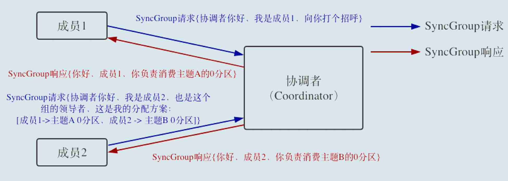
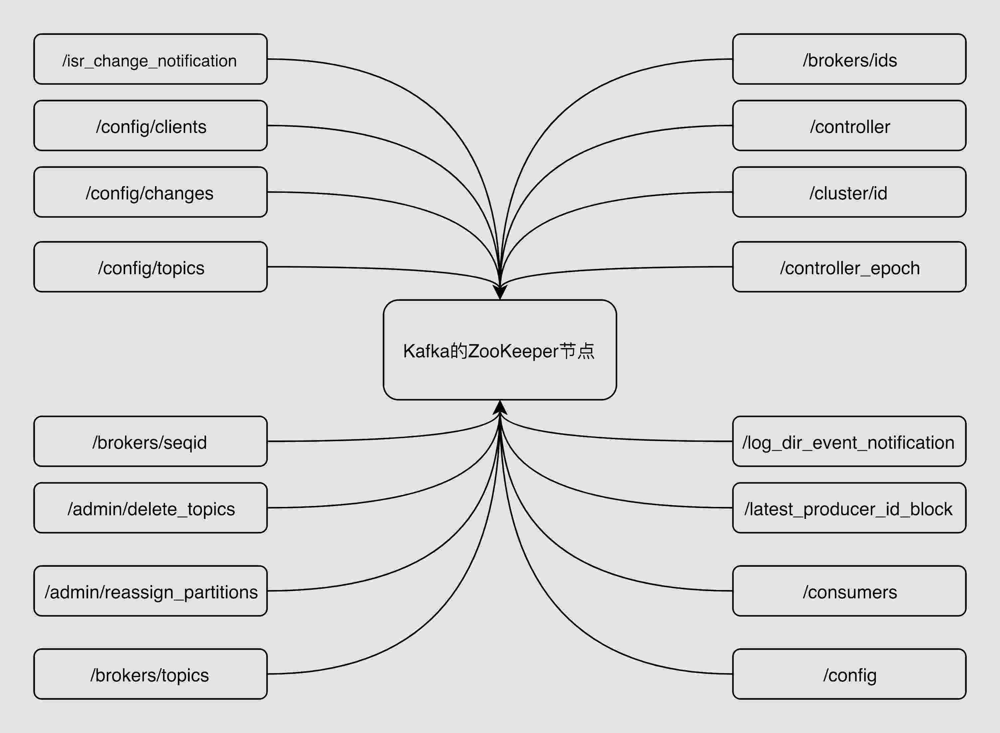
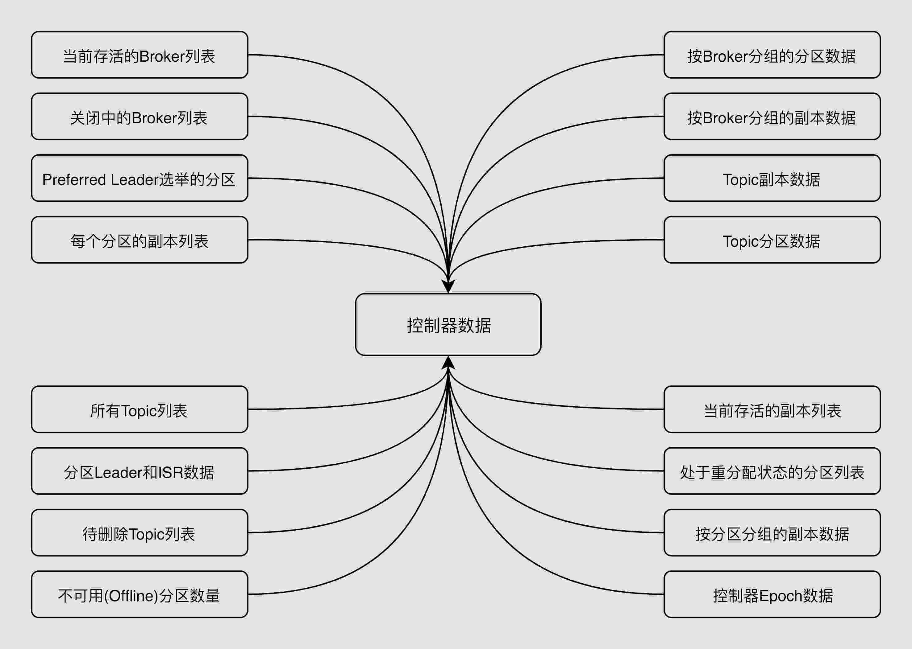
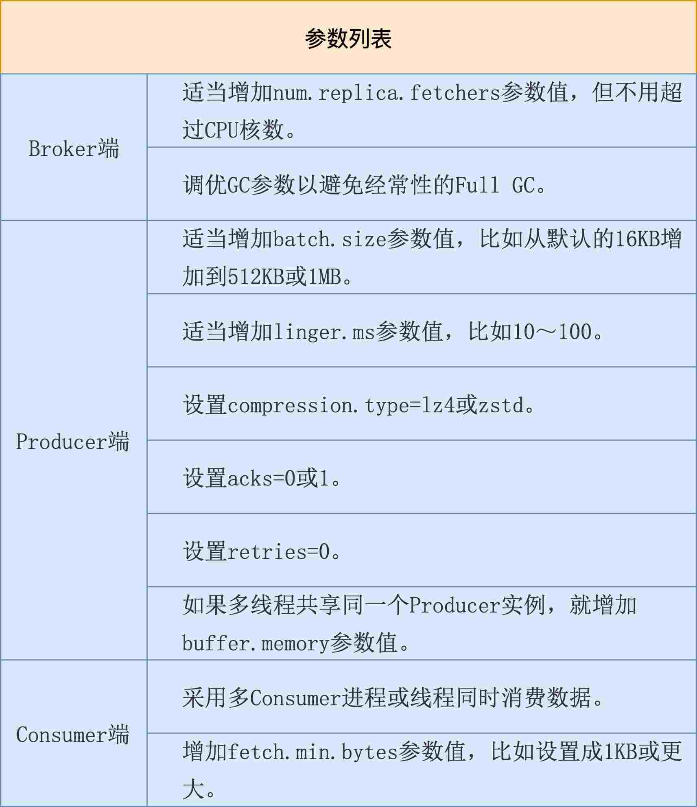
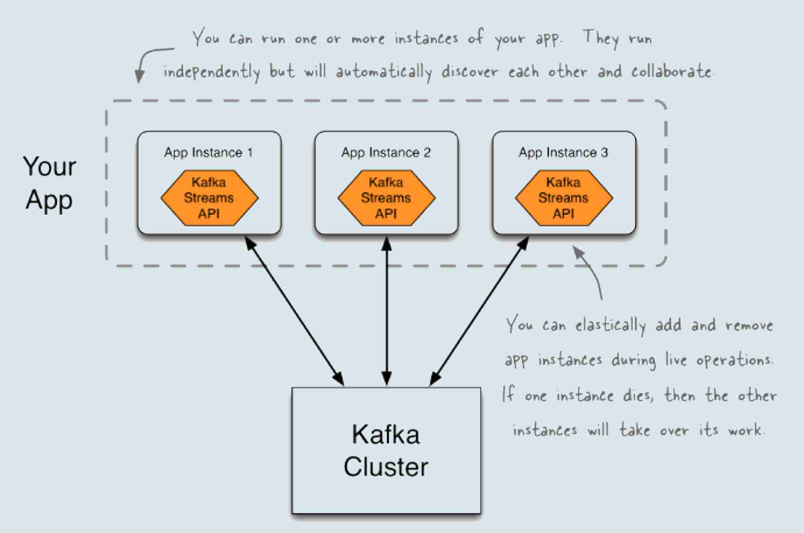
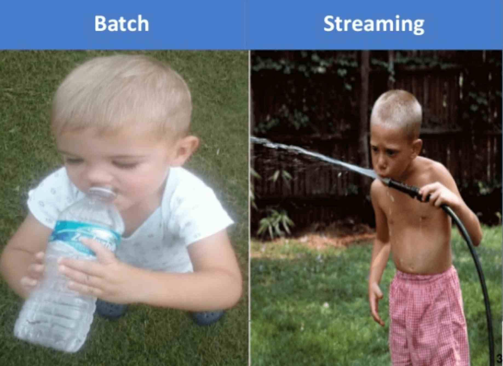
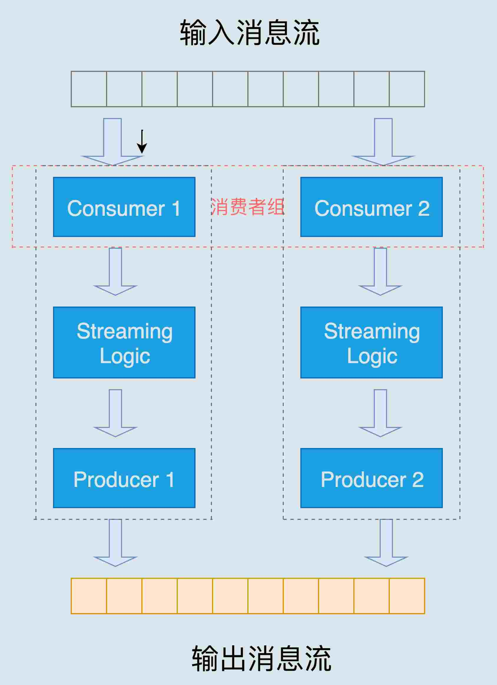
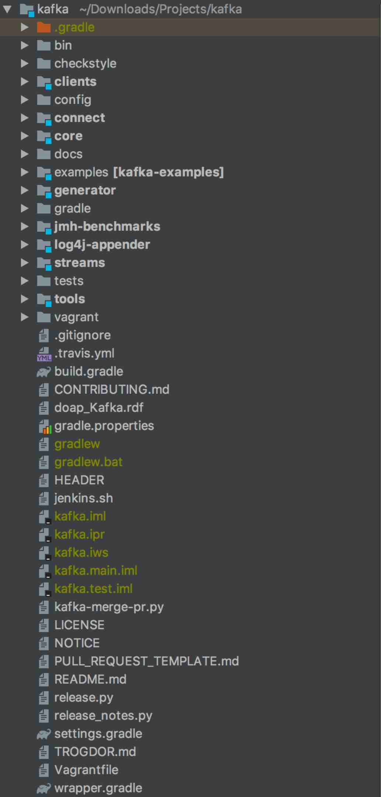

# Kafka核心技术与实战

学习方法与目标：把[Kafka官网](https://kafka.apache.org/)通读几遍然后再实现一个实时日志收集系统（比如把服务器日志实时放入Kafka）。

- 01-05 | Kafka入门 
- 06-08 | Kafka的基本使用
- 09-22 | 客户端实践及原理剖析
- 23-27 | 深入Kafka内核
- 28-39 | 管理与监控
- 40-42 | 高级Kafka应用之流处理
- 其他

## 01 | Kafka 介绍

命名来自 Franz Kafka 这个作家，由 Linkedin 团队开发

### Kafka 是什么呢？

一句话概括一下：Apache Kafka 是一款开源的消息引擎系统。

> 消息引擎系统是一组规范。企业利用这组规范在不同系统之间**传递语义准确的消息**，实现松耦合的异步式数据传递。

Kafka 传输消息的格式是纯二进制的字节序列

### Kafka 传输协议

- 点对点模型：也叫消息队列模型。如果拿上面那个“民间版”的定义来说，那么系统 A 发送的消息只能被系统 B 接收，其他任何系统都不能读取 A 发送的消息。日常生活的例子比如电话客服就属于这种模型：同一个客户呼入电话只能被一位客服人员处理，第二个客服人员不能为该客户服务。

- 发布 / 订阅模型：与上面不同的是，它有一个主题（Topic）的概念，你可以理解成逻辑语义相近的消息容器。该模型也有发送方和接收方，只不过提法不同。发送方也称为发布者（Publisher），接收方称为订阅者（Subscriber）。和点对点模型不同的是，这个模型可能存在多个发布者向相同的主题发送消息，而订阅者也可能存在多个，它们都能接收到相同主题的消息。生活中的报纸订阅就是一种典型的发布 / 订阅模型。

Kafka 同时支持这两种消息引擎模型

### Kafka 作用：**削峰填谷、解耦**

## 02 | Kafka术语

在 Kafka 中，发布订阅的对象是**主题**（Topic），你可以为每个业务、每个应用甚至是每类数据都创建专属的主题。向主题发布消息的客户端应用程序称为**生产者**（Producer），生产者程序通常持续不断地向一个或多个主题发送消息，而订阅这些主题消息的客户端应用程序就被称为**消费者**（Consumer）。和生产者类似，消费者也能够同时订阅多个主题的消息。我们把生产者和消费者统称为**客户端**（Clients）。你可以同时运行多个生产者和消费者实例，这些实例会不断地向 Kafka 集群中的多个主题生产和消费消息。

有客户端自然也就有**服务器端**。Kafka 的服务器端由被称为 **Broker** 的服务进程构成，即一个 Kafka 集群由多个 Broker 组成，<u>*Broker 负责接收和处理客户端发送过来的请求，以及对消息进行持久化*</u>。虽然多个 Broker 进程能够运行在同一台机器上，但更常见的做法是将不同的 Broker 分散运行在不同的机器上，这样如果集群中某一台机器宕机，即使在它上面运行的所有 Broker 进程都挂掉了，其他机器上的 Broker 也依然能够对外提供服务。这其实就是 Kafka 提供高可用的手段之一。

实现高可用的另一个手段就是**备份机制**（Replication）。备份的思想很简单，就是把相同的数据拷贝到多台机器上，而这些相同的数据拷贝在 Kafka 中被称为**副本**（Replica）。Kafka 定义了两类副本：**领导者副本**（Leader Replica）和**追随者副本**（Follower Replica）。前者对外提供服务，这里的对外指的是与客户端程序进行交互；而后者只是被动地追随领导者副本而已，不能与外界进行交互。

- 领导者副本的工作机制也很简单：**生产者总是向领导者副本写消息；而消费者总是从领导者副本读消息。**
- 追随者副本，它只做一件事：**向领导者副本发送请求，请求领导者把最新生产的消息发给它，这样它能保持与领导者的同步。**

副本机制可以保证数据的持久化或消息不丢失，但没有解决伸缩性的问题。**伸缩性**即所谓的 Scalability。什么是伸缩性呢？我们拿副本来说，虽然现在有了领导者副本和追随者副本，但倘若领导者副本积累了太多的数据以至于单台 Broker 机器都无法容纳了，此时应该怎么办呢？一个很自然的想法就是，能否把数据分割成多份保存在不同的 Broker 上。这种机制就是所谓的**分区**（Partitioning）。

Kafka 中的分区机制指的是将每个主题划分成多个**分区**（Partition），每个分区是一组有序的消息日志。生产者生产的每条消息只会被发送到一个分区中，也就是说如果向一个双分区的主题发送一条消息，这条消息要么在分区 0 中，要么在分区 1 中。如你所见，Kafka 的分区编号是从 0 开始的，如果 Topic 有 100 个分区，那么它们的分区号就是从 0 到 99。

Kafka 副本是在分区这个层级定义的。每个分区下可以配置若干个副本，其中只能有 1 个领导者副本和 N-1 个追随者副本。生产者向分区写入消息，每条消息在分区中的位置信息由一个叫**位移**（Offset）的数据来表征。分区位移总是从 0 开始，假设一个生产者向一个空分区写入了 10 条消息，那么这 10 条消息的位移依次是 0、1、2、…、9。

### Kafka 的三层消息架构

- 第一层是主题层，每个主题可以配置 M 个分区，而每个分区又可以配置 N 个副本。
- 第二层是分区层，每个分区的 N 个副本中只能有一个充当领导者角色，对外提供服务；其他 N-1 个副本是追随者副本，只是提供数据冗余之用。
- 第三层是消息层，分区中包含若干条消息，每条消息的位移从 0 开始，依次递增。
- 最后，客户端程序只能与分区的领导者副本进行交互。

### Kafka Broker 是如何持久化数据的

总的来说，Kafka 使用消息日志（Log）来保存数据，一个日志就是磁盘上一个只能追加写（Append-only）消息的物理文件。因为只能追加写入，故避免了缓慢的随机 I/O 操作，改为性能较好的顺序 I/O 写操作，这也是实现 Kafka 高吞吐量特性的一个重要手段。若不停地向一个日志写入消息，最终也会耗尽所有的磁盘空间，因此 Kafka 必然要定期地删除消息以回收磁盘。怎么删除呢？简单来说就是通过日志段（Log Segment）机制。在 Kafka 底层，一个日志又进一步细分成多个日志段，消息被追加写到当前最新的日志段中，当写满了一个日志段后，Kafka 会自动切分出一个新的日志段，并将老的日志段封存起来。Kafka 在后台还有定时任务会定期地检查老的日志段是否能够被删除，从而实现回收磁盘空间的目的。

点对点模型（Peer to Peer，P2P）指的是同一条消息只能被下游的一个消费者消费，其他消费者则不能染指。在 Kafka 中实现这种 P2P 模型的方法就是引入了消费者组（Consumer Group）。所谓的消费者组，指的是多个消费者实例共同组成一个组来消费一组主题。这组主题中的每个分区都只会被组内的一个消费者实例消费，其他消费者实例不能消费它。为什么要引入消费者组呢？主要是为了提升消费者端的吞吐量。多个消费者实例同时消费，加速整个消费端的吞吐量（TPS）。

消费者组里面的所有消费者实例不仅“瓜分”订阅主题的数据，而且更酷的是它们还能彼此协助。假设组内某个实例挂掉了，Kafka 能够自动检测到，然后把这个 Failed 实例之前负责的分区转移给其他活着的消费者。这个过程就是 Kafka 中大名鼎鼎的“重平衡”（Rebalance）。

每个消费者在消费消息的过程中必然需要有个字段记录它当前消费到了分区的哪个位置上，这个字段就是消费者位移（Consumer Offset）。上面的“位移”表征的是分区内的消息位置，它是不变的，即一旦消息被成功写入到一个分区上，它的位移值就是固定的了。而消费者位移则不同，它可能是随时变化的，毕竟它是消费者消费进度的指示器嘛。

小结

- 消息：Record。Kafka 是消息引擎嘛，这里的消息就是指 Kafka 处理的主要对象。
- 主题：Topic。主题是承载消息的逻辑容器，在实际使用中多用来区分具体的业务。
- 分区：Partition。一个有序不变的消息序列。每个主题下可以有多个分区。
- 消息位移：Offset。表示分区中每条消息的位置信息，是一个单调递增且不变的值。
- 副本：Replica。Kafka 中同一条消息能够被拷贝到多个地方以提供数据冗余，这些地方就是所谓的副本。副本还分为领导者副本和追随者副本，各自有不同的角色划分。副本是在分区层级下的，即每个分区可配置多个副本实现高可用。
- 生产者：Producer。向主题发布新消息的应用程序。
- 消费者：Consumer。从主题订阅新消息的应用程序。
- 消费者位移：Consumer Offset。表征消费者消费进度，每个消费者都有自己的消费者位移。
- 消费者组：Consumer Group。多个消费者实例共同组成的一个组，同时消费多个分区以实现高吞吐。
- 重平衡：Rebalance。消费者组内某个消费者实例挂掉后，其他消费者实例自动重新分配订阅主题分区的过程。
- Rebalance 是 Kafka 消费者端实现高可用的重要手段。


## 03 | Kafka 只是消息引擎系统吗？

Apache Kafka 是消息引擎系统，也是一个分布式流处理平台（Distributed Streaming Platform）。

Kafka 特性：

- 提供一套 API 实现生产者和消费者；
- 降低网络传输和磁盘存储开销；
- 实现高伸缩性架构。

Kafka 作为流处理平台的优点：

- 更容易实现端到端的正确性（Correctness）
- 自己对于流式计算的定位，Kafka Streams 是一个用于搭建实时流处理的客户端库而非是一个完整的功能系统

> 主流流处理平台：Apache Storm、Apache Spark Streaming、Apache Flink

## 04 | 选择哪种Kafka？

### Apache Kafka

也称社区版 Kafka。优势在于迭代速度快，社区响应度高，使用它可以让你有更高的把控度；

缺陷在于仅提供基础核心组件，缺失一些高级的特性。（如监控框架 需借助第三方工具 Kafka manage）

### Confluent Kafka

Confluent 公司提供的 Kafka。优势在于集成了很多高级特性且由 Kafka 原班人马打造，质量上有保证；

缺陷在于相关文档资料不全，普及率较低，没有太多可供参考的范例。

### Cloudera/Hortonworks Kafka

大数据云公司提供的 Kafka，内嵌 Apache Kafka。优势在于操作简单，节省运维成本；

缺陷在于把控度低，演进速度较慢。

## 05 | Kafka的版本号

### 版本号说明


去官网上下载 kafka 例如：

**2.6.0**

- Released Aug 3, 2020
- [Release Notes](https://www.apache.org/dist/kafka/2.6.0/RELEASE_NOTES.html)
- Source download: [kafka-2.6.0-src.tgz](https://www.apache.org/dyn/closer.cgi?path=/kafka/2.6.0/kafka-2.6.0-src.tgz) ([asc](https://www.apache.org/dist/kafka/2.6.0/kafka-2.6.0-src.tgz.asc), [sha512](https://www.apache.org/dist/kafka/2.6.0/kafka-2.6.0-src.tgz.sha512))
- Binary downloads:
    - Scala 2.12  - [kafka_2.12-2.6.0.tgz](https://www.apache.org/dyn/closer.cgi?path=/kafka/2.6.0/kafka_2.12-2.6.0.tgz) ([asc](https://www.apache.org/dist/kafka/2.6.0/kafka_2.12-2.6.0.tgz.asc), [sha512](https://www.apache.org/dist/kafka/2.6.0/kafka_2.12-2.6.0.tgz.sha512))
    - Scala 2.13  - [kafka_2.13-2.6.0.tgz](https://www.apache.org/dyn/closer.cgi?path=/kafka/2.6.0/kafka_2.13-2.6.0.tgz) ([asc](https://www.apache.org/dist/kafka/2.6.0/kafka_2.13-2.6.0.tgz.asc), [sha512](https://www.apache.org/dist/kafka/2.6.0/kafka_2.13-2.6.0.tgz.sha512))

2.12 是编译 Kafka 源代码的 Scala 编译器版本

2.6.0 真正的 Kafka 版本号

### Kafka 版本演进

> 大版本 + 小版本 + patch

Kafka 目前总共演进了 7 个大版本，分别是 0.7、0.8、0.9、0.10、0.11、1.0 和 2.0。

- 0.7 版本：只提供了最基础的消息队列功能

- 0.8 版本：正式引入了**副本机制**，至此 Kafka 成为了一个真正意义上完备的分布式高可靠消息队列解决方案。引入新的 Producer API，但是 Bug 多。

- 0.9 版本：增加了基础的**安全认证 / 权限功能**，同时使用 Java 重写了新版本消费者 API，另外还引入了 Kafka Connect 组件用于实现高性能的数据抽取。Producer API 在这个版本中算比较稳定了。但是 Consumer API， Bug 超多。

- 0.10 版本：引入了 **Kafka Streams**。（0.10.2.2 版本 Consumer API 算是比较稳定了）

- 0.11 版本：引入了两个重量级的功能变更：一个是提供**幂等性 Producer API** 以及**事务（Transaction） API**；另一个是对 Kafka 消息格式做了重构。（这个版本中各个大功能组件都变得非常稳定了）

- 1.0 版本：主要还是 Kafka Streams 的各种改进。

- 2.0 版本：主要还是 Kafka Streams 的各种改进。

> 建议：不论用哪个版本，都请尽量保持服务器端版本和客户端版本一致，否则你将损失很多 Kafka 为你提供的性能优化收益。

## 06 | Kafka线上集群部署方案怎么做？

真正的线上环境需要仔细地考量各种因素，结合自身的业务需求而制定。下面分别从操作系统、磁盘、磁盘容量和带宽等方面来讨论一下。

### 操作系统

Kafka 由 Scala 语言和 Java 语言编写而成，编译之后的源代码就是普通的“.class”文件。本来部署到哪个操作系统应该都是一样的，但是不同操作系统的差异还是给 Kafka 集群带来了相当大的影响。

目前常见的操作系统有 3 种：Linux、Windows 和 macOS。应该说部署在 Linux 上的生产环境是最多的。

主要是在下面这三个方面上，Linux 的表现更胜一筹。

- I/O 模型的使用：Kafka 客户端底层使用了 Java 的 selector，selector 在 Linux 上的实现机制是 epoll，而在 Windows 平台上的实现机制是 select，所以在 linux 上能够获得**更高效的 I/O 性能**。

- 数据网络传输效率：在 Linux 部署 Kafka 能够享受到**零拷贝技术**所带来的快速数据传输特性。

- 社区支持度：Windows 平台上部署 Kafka 只适合于个人测试或用于功能验证，社区目前对 Windows 平台上发现的 Kafka Bug 不做任何承诺。

> 零拷贝避免了将数据从磁盘复制到缓冲区，再将缓冲区的内容发送到socket的性能损耗。这中间有四次数据拷贝，磁盘->页缓存->用户空间->socket缓存->网络

####  I/O 模型

什么是 I/O 模型呢？你可以近似地认为 I/O 模型就是操作系统执行 I/O 指令的方法。

主流的 I/O 模型通常有 5 种类型：**阻塞式 I/O、非阻塞式 I/O、I/O 多路复用、信号驱动 I/O 和异步 I/O。后一种模型会比前一种模型要高级**

每种 I/O 模型都有各自典型的使用场景：

- Java 中 Socket 对象的阻塞模式和非阻塞模式就对应于前两种模型；

- 而 Linux 中的系统调用 select 函数就属于 I/O 多路复用模型；

- 大名鼎鼎的 epoll 系统调用则介于第三种和第四种模型之间；

- 至于第五种模型，其实很少有 Linux 系统支持，反而是 Windows 系统提供了一个叫 IOCP 线程模型属于这一种。

### 磁盘

Kafka 使用磁盘的方式多是顺序读写操作，一定程度上规避了机械磁盘最大的劣势，即随机读写操作慢。从这一点上来说，使用 SSD 似乎并没有太大的性能优势，而它因易损坏而造成的可靠性差等缺陷，又由 Kafka 在软件层面提供机制来保证，故使**用普通机械磁盘是很划算**的。

磁盘选择另一个经常讨论的话题就是到底是否应该使用磁盘阵列（RAID）。

使用 RAID 的两个主要优势在于：

- 提供冗余的磁盘存储空间
- 提供负载均衡

以上两个优势对于任何一个分布式系统都很有吸引力。不过就 Kafka 而言，一方面 Kafka 自己实现了冗余机制来提供高可靠性；另一方面通过分区的概念，Kafka 也能在软件层面自行实现负载均衡。因此在线上环境使用 RAID 似乎变得不是那么重要了。

综合以上的考量建议是：

- 追求性价比的公司可以不搭建 RAID，使用普通磁盘组成存储空间即可。
- 使用机械磁盘完全能够胜任 Kafka 线上环境。

#### 磁盘容量

举一个简单的例子来说明。

每天需要向 Kafka 集群发送 1 亿条消息，每条消息保存两份以防止数据丢失，另外消息默认保存两周时间。现在假设消息的平均大小是 1KB。

每天 1 亿条 1KB 大小的消息，保存两份且留存两周的时间，那么总的空间大小就等于 1 亿 * 1KB * 2 / 1000 / 1000 = 200GB。一般情况下 Kafka 集群除了消息数据还有其他类型的数据，比如索引数据等，故我们再为这些数据预留出 10% 的磁盘空间，因此总的存储容量就是 220GB。既然要保存两周，那么整体容量即为 220GB * 14，大约 3TB 左右。Kafka 支持数据的压缩，假设压缩比是 0.75，那么最后你需要规划的存储空间就是 0.75 * 3 = 2.25TB。

总之在规划磁盘容量时你需要考虑下面这几个元素：

- 新增消息数

- 消息留存时间

- 平均消息大小

- 备份数

- 是否启用压缩

### 带宽

对于 Kafka 这种通过网络大量进行数据传输的框架而言，**带宽特别容易成为瓶颈**。对于千兆网络，建议每台机器 700 Mbps 来计算，避免大流量下的对包。

## 07|08 最最最重要的集群参数配置

### Broker 端参数

> 这里所说的 Broker 端参数也被称为静态参数（Static Configs）。所谓静态参数，是指你必须在 Kafka 的配置文件 server.properties 中进行设置的参数，不管你是新增、修改还是删除。同时，你必须重启 Broker 进程才能令它们生效。
>
> Kafka 提供了专门的 kafka-configs 命令来修改主题级别参数。

#### 针对存储信息的重要参数

- log.dirs：这是非常重要的参数，指定了 Broker 需要使用的若干个文件目录路径。**这个参数是没有默认值的**。

- log.dir：注意这是 dir，结尾没有 s，说明它只能表示单个路径，它是补充上一个参数用的。

> log.dirs 设置方式，比如/home/kafka1,/home/kafka2,/home/kafka3

如果有条件的话你最好保证这些目录挂载到不同的物理磁盘上。这样做有两个好处：

- 提升读写性能：比起单块磁盘，多块物理磁盘同时读写数据有更高的吞吐量。

- 能够实现故障转移：即 Failover。这是 Kafka 1.1 版本新引入的强大功能。在以前，只要 Kafka Broker 使用的任何一块磁盘挂掉了，整个 Broker 进程都会关闭。但是自 1.1 开始，这种情况被修正了，坏掉的磁盘上的数据会自动地转移到其他正常的磁盘上，而且 Broker 还能正常工作。这个改进正是我们舍弃 RAID 方案的基础：没有这种 Failover 的话，我们只能依靠 RAID 来提供保障。

#### ZooKeeper 相关的设置

> ZooKeeper 是一个分布式协调框架，负责协调管理并保存 Kafka 集群的所有元数据信息，比如集群都有哪些 Broker 在运行、创建了哪些 Topic，每个 Topic 都有多少分区以及这些分区的 Leader 副本都在哪些机器上等信息。

- zookeeper.connect：Broker 与 Zookeeper 连接参数。格式如：zk1:2181,zk2:2181,zk3:2181。2181 是 ZooKeeper 的默认端口。

如果你有两套 Kafka 集群，假设分别叫它们 kafka1 和 kafka2，那么两套集群的 `zookeeper.connect` 参数可以这样指定：`zk1:2181,zk2:2181,zk3:2181/kafka1`和`zk1:2181,zk2:2181,zk3:2181/kafka2`。

#### 与 Broker 连接相关参数

- listeners：学名叫监听器，其实就是告诉外部连接者要通过什么协议访问指定主机名和端口开放的 Kafka 服务。

- advertised.listeners：和 listeners 相比多了个 advertised。Advertised 的含义表示宣称的、公布的，就是说这组监听器是 Broker 用于对外发布的。主要是为外网访问用的。

- ~~host.name/port：列出这两个参数就是想说你把它们忘掉吧，压根不要为它们指定值，毕竟都是过期的参数了。~~

> 监听器，它是若干个逗号分隔的三元组，每个三元组的格式为<协议名称，**主机名**，端口号>。

这里的协议名称可能是标准的名字，比如 PLAINTEXT 表示明文传输、SSL 表示使用 SSL 或 TLS 加密传输等；也可能是你自己定义的协议名字，比如CONTROLLER: //localhost:9092。

一旦你自己定义了协议名称，你必须还要指定 `listener.security.protocol.map` 参数告诉这个协议底层使用了哪种安全协议，比如指定`listener.security.protocol.map=CONTROLLER:PLAINTEXT` 表示CONTROLLER这个自定义协议底层使用明文不加密传输数据。

#### Topic 管理的相关参数

- auto.create.topics.enable：是否允许自动创建 Topic。最好设置成 false。

- unclean.leader.election.enable：是否允许 Unclean Leader 选举。最好设置成 false，坚决不能让那些落后太多的副本竞选 Leader。

- auto.leader.rebalance.enable：是否允许定期进行 Leader 选举。最好设置成 false。

> Leader 竞选：只有保存数据比较多的那些副本才有资格竞选 Leader，那些落后进度太多的副本没资格做这件事。

#### 数据留存方面

- log.retention.{hours|minutes|ms}：这是个“三兄弟”，都是控制一条消息数据被保存多长时间。从优先级上来说 ms 设置最高、minutes 次之、hours 最低。通常情况下还是设置 hours 级别的多一些。

- log.retention.bytes：这是指定 Broker 为消息保存的总磁盘容量大小。这个值默认是 -1，不限制。

> 这个参数真正发挥作用的场景其实是在云上构建多租户的 Kafka 集群：设想你要做一个云上的 Kafka 服务，每个租户只能使用 100GB 的磁盘空间，为了避免有个“恶意”租户使用过多的磁盘空间

- message.max.bytes：控制 Broker 能够接收的最大消息大小。默认的 1000012 太少了，不到 1M

### Topic 级别参数

> Topic 级别参数会覆盖全局 Broker 参数的值

#### 保存消息方面

- `retention.ms`：规定了该 Topic 消息被保存的时长。默认是 7 天，即该 Topic 只保存最近 7 天的消息。一旦设置了这个值，它会覆盖掉 Broker 端的全局参数值。

- `retention.bytes`：规定了要为该 Topic 预留多大的磁盘空间。和全局参数作用相似，这个值通常在多租户的 Kafka 集群中会有用武之地。当前默认值是 -1，表示可以无限使用磁盘空间。

#### 能处理的消息大小

- `max.message.bytes`：它决定了 Kafka Broker 能够正常接收该 Topic 的最大消息大小。

#### Topic 级别参数的设置两种方式：

- 创建 Topic 时进行设置

使用 `kafka-topics.sh` 创建主题

```bash
bin/kafka-topics.sh --bootstrap-server localhost:9092 --create --topic transaction --partitions 1 --replication-factor 1 --config retention.ms=15552000000 --config max.message.bytes=5242880
```
注意结尾处的--config设置

使用 `kafka-configs.sh` 修改主题参数？
```bash
bin/kafka-configs.sh --zookeeper localhost:2181 --entity-type topics --entity-name transaction --alter --add-config max.message.bytes=10485760
```

- 修改 Topic 时设置

### JVM 参数

> JVM 版本至少是 Java 8，另外 Kafka 自 2.0.0 版本开始，已经正式摒弃对 Java 7 的支持了。

#### 堆大小

建议：将你的 JVM 堆大小设置成 6GB 。

这是目前业界比较公认的一个合理值。很多人就是使用默认的 Heap Size 来跑 Kafka，说实话默认的 1GB 有点小，毕竟 Kafka Broker 在与客户端进行交互时会在 JVM 堆上创建大量的 ByteBuffer 实例，Heap Size 不能太小。无脑将堆大小设置成超过6GB时，一次Full GC一次要花多长时间，所以不可取。

#### 垃圾回收器

如果你依然在使用 Java 7，那么可以根据以下法则选择合适的垃圾回收器：

- 如果 Broker 所在机器的 CPU 资源非常充裕，建议使用 CMS 收集器。启用方法是指定-XX:+UseCurrentMarkSweepGC。
- 否则，使用吞吐量收集器。开启方法是指定-XX:+UseParallelGC。

如果是 Java 8 了，制定垃圾回收器为 G1 就好。

如果已经是 Java 9 了，那么就用默认的 G1 收集器就好。

##### 如何为 Kafka 进行设置呢？

在启动 Kafka Broker 之前，先设置下面这两个环境变量即可：

- KAFKA_HEAP_OPTS：指定堆大小。
- KAFKA_JVM_PERFORMANCE_OPTS：指定 GC 参数。

如：

```bash
$> export KAFKA_HEAP_OPTS=--Xms6g  --Xmx6g
$> export KAFKA_JVM_PERFORMANCE_OPTS= -server -XX:+UseG1GC -XX:MaxGCPauseMillis=20 -XX:InitiatingHeapOccupancyPercent=35 -XX:+ExplicitGCInvokesConcurrent -Djava.awt.headless=true
$> bin/kafka-server-start.sh config/server.properties
```

**OOM的问题**首先看下到底是那OOM的问题可以这样排查：

1. 到底是哪部分内存。大部分是堆溢出
2. 如果是heap溢出，主要看stacktrace，看看到底是哪段代码导致的
3. 再看导致的原因，到底是内存泄露还是内存溢出。这两者是有区别的。前者是程序写的有问题，后者是程序确实需要这么多内存，那么只能增加heap size


### 操作系统参数

- **文件描述符限制**：ulimit -n，参数太小会出现“Too many open files”的错误。
- 文件系统类型：文件系统指的是如 ext3、ext4 或 XFS 这样的日志型文件系统。XFS 的性能要强于 ext4，ZFS 的性能要强于 XFS。
- Swappiness：设置成一个接近 0 但不为 0 的值，比如 1。为什么呢？因为一旦设置成 0，*当物理内存耗尽时，操作系统会触发 OOM killer 这个组件*，它会随机挑选一个进程然后 kill 掉，即根本不给用户任何的预警。但如果设置成一个比较小的值，当开始使用 swap 空间时，你至少能够观测到 Broker 性能开始出现急剧下降，从而给你进一步调优和诊断问题的时间。
- 提交时间：适当地增加提交间隔来降低物理磁盘的写操作。当然你可能会有这样的疑问：如果在页缓存中的数据在写入到磁盘前机器宕机了，那岂不是数据就丢失了。的确，这种情况数据确实就丢失了，但鉴于 Kafka 在软件层面已经提供了多副本的冗余机制，因此这里稍微拉大提交间隔去换取性能还是一个合理的做法。

## 09 | 生产者消息分区机制原理剖析

### 为什么分区？

Kafka 有主题（Topic）的概念，它是承载真实数据的逻辑容器，而在主题之下还分为若干个分区，也就是说 Kafka 的消息组织方式实际上是三级结构：主题 - 分区 - 消息。**主题下的每条消息只会保存在某一个分区中**，而不会在多个分区中被保存多份。


其实分区的作用就是**提供负载均衡的能力**，或者说对数据进行分区的主要原因，就是为了实现系统的**高伸缩性**（Scalability）。

利用分区也可以实现其他一些业务级别的需求，比如**实现业务级别的消息顺序的问题**。

不同的分区能够被放置到不同节点的机器上，而*数据的读写操作也都是针对分区这个粒度而进行*的，这样每个节点的机器都能独立地执行各自分区的读写请求处理。并且，我们还可以通过添加新的节点机器来增加整体系统的吞吐量。

### 都有哪些分区策略？

#### Kafka 生产者的分区策略

***分区是实现负载均衡以及高吞吐量的关键***

**所谓分区策略是决定生产者将消息发送到哪个分区的算法。**Kafka 为我们提供了默认的分区策略（*如果指定了 Key，则按Key-ordering 策略；如果没有指定 Key，则使用轮询策略。*），同时它也支持你自定义分区策略。

如何自定义分区策略？

- 需要显式地配置生产者端的参数 `partitioner.class`。
- 实现 `org.apache.kafka.clients.producer.Partitioner` 接口。实现接口的两个方法：`partition()` 和 `close()`，通常你只需要实现最重要的 `partition()` 方法。我们来看看这个方法的方法签名：

```java
// 这里的 topic、key、keyBytes、value 和 valueBytes 都属于消息数据
// cluster则是集群信息（比如当前 Kafka 集群共有多少主题、多少 Broker 等）。
int partition(String topic, Object key, byte[] keyBytes, Object value, byte[] valueBytes, Cluster cluster);
```

#### 常见的分区策略

##### 轮询策略

也称 Round-robin 策略，即顺序分配。

比如一个主题下有 3 个分区，那么第一条消息被发送到分区 0，第二条被发送到分区 1，第三条被发送到分区 2，以此类推。当


轮询策略是 Kafka Java 生产者 API 默认提供的分区策略。如果你未指定partitioner.class参数，那么你的生产者程序会按照轮询的方式在主题的所有分区间均匀地“码放”消息。

**轮询策略有非常优秀的负载均衡表现**，它总是能保证消息最大限度地被平均分配到所有分区上，故默认情况下它是最合理的分区策略，也是我们最常用的分区策略之一。

##### 随机策略

也称 Randomness 策略。所谓随机就是我们随意地将消息放置到任意一个分区上，如下面这张图所示。


如果要实现随机策略版的 `partition()` 方法，很简单，只需要两行代码即可：

```java
// 先计算出该主题总的分区数
List<PartitionInfo> partitions = cluster.partitionsForTopic(topic);
// 然后随机地返回一个小于它的正整数
return ThreadLocalRandom.current().nextInt(partitions.size());
```

##### Key-ordering 策略（按消息键保序策略）

Kafka 允许为每条消息定义消息键，简称为 Key。

这个 Key 的作用非常大，它可以是一个有着明确业务含义的字符串，比如客户代码、部门编号或是业务 ID 等；也可以用来表征消息元数据。特别是在 Kafka 不支持时间戳的年代，在一些场景中，工程师们都是直接将消息创建时间封装进 Key 里面的。

一旦消息被定义了 Key，那么你就可以保证同一个 Key 的所有消息都进入到相同的分区里面，由于**每个分区下的消息处理都是有顺序的**，故这个策略被称为按消息键保序策略，如下图所示。


实现这个策略的 partition 方法同样简单，只需要下面两行代码即可：

```java
// 先计算出该主题总的分区数
List partitions = cluster.partitionsForTopic(topic);
// 根据 Key 的 hash 值取模
return Math.abs(key.hashCode()) % partitions.size();
```

##### 其他分区策略

- 基于地理位置的分区策略：当然这种策略一般只针对那些大规模的 Kafka 集群，特别是跨城市、跨国家甚至是跨大洲的集群。

```java
// 先计算出该主题总的分区数
List<PartitionInfo> partitions = cluster.partitionsForTopic(topic);
// 过滤出某一方的机器集群中的一个
return partitions.stream().filter(p -> isSouth(p.leader().host())).map(PartitionInfo::partition).findAny().get();
```

## 10 | 生产者压缩算法面面观

压缩（compression），它秉承了用时间去换空间的经典 trade-off 思想，具体来说就是用 CPU 时间去换磁盘空间或网络 I/O 传输量，希望以较小的 CPU 开销带来更少的磁盘占用或更少的网络 I/O 传输。

### 怎么压缩？

目前 Kafka 共有两大类消息格式，社区分别称之为 V1 版本和 V2 版本。*V2 版本是 Kafka 0.11.0.0 中正式引入的*。

Kafka 的消息层次都分为两层：**消息集合**（message set）以及**消息**（message）。

一个消息集合中包含若干条日志项（record item），而日志项才是真正封装消息的地方。Kafka 底层的消息日志由一系列消息集合日志项组成。Kafka 通常不会直接操作具体的一条条消息，它总是在消息集合这个层面上进行写入操作。

#### V2 版本都比 V1 版本对比

V2 版本主要是针对 V1 版本的一些弊端做了修正，其中一个，就是把消息的公共部分抽取出来放到外层消息集合里面，这样就不用每条消息都保存这些信息了。还有一个就是保存压缩消息的方法发生了变化，**V2 版本的做法是对整个消息集合进行压缩**，而不是把多条消息进行压缩然后保存到外层消息的消息体字段中。


### 何时压缩？

在 Kafka 中，压缩可能发生在两个地方：**生产者端**和 **Broker 端**。

#### 生产者端

生产者程序中配置 `compression.type` 参数即表示启用指定类型的压缩算法。比如下面这段程序代码展示了如何构建一个开启 GZIP 的 Producer 对象：

```java
 Properties props = new Properties();
 props.put("bootstrap.servers", "localhost:9092");
 props.put("acks", "all");
 props.put("key.serializer", "org.apache.kafka.common.serialization.StringSerializer");
 props.put("value.serializer", "org.apache.kafka.common.serialization.StringSerializer");
 // 开启GZIP压缩
 props.put("compression.type", "gzip");
 
 Producer<String, String> producer = new KafkaProducer<>(props);
```

#### Broker 端

大部分情况下 Broker 从 Producer 端接收到消息后仅仅是原封不动地保存而不会对其进行任何修改，但这里的“大部分情况”也是要满足一定条件的。有两种例外情况就可能让 Broker 重新压缩消息。

- Broker 端指定了和 Producer 端不同的压缩算法。

Producer 使用的是 GZIP 压缩，Broker 使用的是 Snappy 压缩，当Broker 接收到 GZIP 压缩消息后，只能解压缩然后使用 Snappy 重新压缩一遍。Broker 端也有一个参数叫 compression.type。这个参数的默认值是 producer，这表示 Broker 端会“尊重”Producer 端使用的压缩算法。可一旦你在 Broker 端设置了不同的 compression.type 值，就一定要小心了，因为可能会发生预料之外的压缩 / 解压缩操作，通常表现为 *Broker 端 CPU 使用率飙升*。

- Broker 端发生了消息格式转换。

所谓的消息格式转换主要是为了兼容老版本的消费者程序。就是之前说过的 V1、V2 版本，Broker 端会对新版本消息执行向老版本格式的转换。这个过程中会涉及消息的解压缩和重新压缩。一般情况下这种消息格式转换对性能是有很大影响的，除了这里的压缩之外，它还让 Kafka 丧失了引以为豪的 Zero Copy 特性。

### 何时解压缩？

通常来说解压缩发生在**消费者**程序中，Kafka 会将启用了哪种压缩算法封装进消息集合中，这样当 Consumer 读取到消息集合时，它自然就知道了这些消息使用的是哪种压缩算法

如果用一句话总结一下压缩和解压缩，那么我希望你记住这句话：***Producer 端压缩、Broker 端保持、Consumer 端解压缩。***

除了在 Consumer 端解压缩，Broker 端也会进行解压缩。注意了，这和前面提到消息格式转换时发生的解压缩是不同的场景。*每个压缩过的消息集合在 Broker 端写入时都要发生解压缩操作，目的就是为了对消息执行各种验证。*我们必须承认这种解压缩对 Broker 端性能是有一定影响的，特别是对 CPU 的使用率而言。

### 各种压缩算法对比

压缩算法的优劣，有两个重要的指标：

- 一个指标是压缩比，原先占 100 份空间的东西经压缩之后变成了占 20 份空间，那么压缩比就是 5，显然压缩比越高越好；
- 另一个指标就是压缩 / 解压缩吞吐量，比如每秒能压缩或解压缩多少 MB 的数据。同样地，吞吐量也是越高越好。

在 Kafka 2.1.0 版本之前，Kafka 支持 3 种压缩算法：**GZIP**、**Snappy** 和 **LZ4**。从 2.1.0 开始，Kafka 正式支持 **Zstandard** 算法（简写为 zstd）。它是 Facebook 开源的一个压缩算法，能够提供超高的压缩比（compression ratio）。

下面这张表是 Facebook Zstandard 官网提供的一份压缩算法 benchmark 比较结果：


Kafka 中各种压缩算法性能测试结果，即在**吞吐量方面：LZ4 > Snappy > zstd 和 GZIP**；而在**压缩比方面，zstd > LZ4 > GZIP > Snappy**。

## 11 | 无消息丢失配置怎么实现？

### 消息不丢失

Kafka 到底在什么情况下才能保证消息不丢失呢？***Kafka 只对“已提交”的消息（committed message）做有限度的持久化保证。***

- 已提交的消息

什么是已提交的消息？**当 Kafka 的若干个 Broker 成功地接收到一条消息并写入到日志文件后，它们会告诉生产者程序这条消息已成功提交。**此时，这条消息在 Kafka 看来就正式变为“已提交”消息了。

为什么是若干个 Broker 呢？这取决于你对“已提交”的定义。你可以选择只要有一个 Broker 成功保存该消息就算是已提交，也可以是令所有 Broker 都成功保存该消息才算是已提交。不论哪种情况，Kafka 只对已提交的消息做持久化保证这件事情是不变的。

- 有限度的持久化保证

Kafka 不可能保证在任何情况下都做到不丢失消息。

### “消息丢失”案例

- 生产者程序丢失数据

目前 Kafka Producer 是异步发送消息的，也就是说如果你调用的是 **producer.send(msg)** 这个 API，那么它通常会立即返回，但此时你不能认为消息发送已成功完成。

这种发送方式有个有趣的名字，叫“fire and forget”，翻译一下就是“发射后不管”。这个术语原本属于导弹制导领域，后来被借鉴到计算机领域中，它的意思是，执行完一个操作后不去管它的结果是否成功。

如果用这个方式，可能会有哪些因素导致消息没有发送成功呢？其实原因有很多，例如网络抖动，导致消息压根就没有发送到 Broker 端；或者消息本身不合格导致 Broker 拒绝接收（比如消息太大了，超过了 Broker 的承受能力）等。

*解决此问题的方法*：Producer 永远要使用带有回调通知的发送 API，也就是说不要使用 producer.send(msg)，而要使用 **producer.send(msg, callback)**。

- 消费者程序丢失数据

Consumer 程序有个“位移”的概念，表示的是这个 Consumer 当前消费到的 Topic 分区的位置。下面这张图来自于官网，它清晰地展示了 Consumer 端的位移数据。这里的“位移”类似于我们看书时使用的书签，它会标记我们当前阅读了多少页。


正确使用书签有两个步骤：第一步是读书，第二步是更新书签页。如果这两步的顺序颠倒了，就可能出现这样的场景：当前的书签页是第 90 页，我先将书签放到第 100 页上，之后开始读书。当阅读到第 95 页时，我临时有事中止了阅读。那么问题来了，当我下次直接跳到书签页阅读时，我就丢失了第 96～99 页的内容，即这些消息就丢失了。

同理，Kafka 中 Consumer 端的消息丢失就是这么一回事。要对抗这种消息丢失，办法很简单：**维持先消费消息（阅读），再更新位移（书签）的顺序即可**。

这种处理方式可能带来的问题是消息的重复处理。


还有一种情况： Consumer 程序从 Kafka 获取到消息后开启了多个线程异步处理消息，而 Consumer 程序自动地向前更新位移。假如其中某个线程运行失败了，它负责的消息没有被成功处理，但位移已经被更新了，因此这条消息对于 Consumer 而言实际上是丢失了。

这里的关键在于 Consumer 自动提交位移。这个问题的解决方案也很简单：**如果是多线程异步处理消费消息，Consumer 程序不要开启自动提交位移，而是要应用程序手动提交位移。**

### Kafka 无消息丢失的配置

1. 不要使用 producer.send(msg)，而要使用 producer.send(msg, callback)。记住，一定要使用带有回调通知的 send 方法。
2. 设置 acks = all。acks 是 Producer 的一个参数，代表了你对“已提交”消息的定义。如果设置成 all，则表明所有副本 Broker 都要接收到消息，该消息才算是“已提交”。这是最高等级的“已提交”定义。
3. 设置 retries 为一个较大的值。这里的 retries 同样是 Producer 的参数，对应前面提到的 Producer 自动重试。当出现网络的瞬时抖动时，消息发送可能会失败，此时配置了 retries > 0 的 Producer 能够自动重试消息发送，避免消息丢失。
4. 设置 unclean.leader.election.enable = false。这是 Broker 端的参数，它控制的是哪些 Broker 有资格竞选分区的 Leader。如果一个 Broker 落后原先的 Leader 太多，那么它一旦成为新的 Leader，必然会造成消息的丢失。故一般都要将该参数设置成 false，即不允许这种情况的发生。
5. 设置 replication.factor >= 3。这也是 Broker 端的参数。其实这里想表述的是，最好将消息多保存几份，毕竟目前防止消息丢失的主要机制就是冗余。
6. 设置 min.insync.replicas > 1。这依然是 Broker 端参数，控制的是消息至少要被写入到多少个副本才算是“已提交”。设置成大于 1 可以提升消息持久性。在实际环境中千万不要使用默认值 1。
7. 确保 replication.factor > min.insync.replicas。如果两者相等，那么只要有一个副本挂机，整个分区就无法正常工作了。我们不仅要改善消息的持久性，防止数据丢失，还要在不降低可用性的基础上完成。推荐设置成 replication.factor = min.insync.replicas + 1。
8. 确保消息消费完成再提交。Consumer 端有个参数 enable.auto.commit，最好把它设置成 false，并采用手动提交位移的方式。就像前面说的，这对于单 Consumer 多线程处理的场景而言是至关重要的。

## 12 | 客户端都有哪些不常见但是很高级的功能？

### Kafka 拦截器

**Kafka 拦截器分为生产者拦截器和消费者拦截器。**

生产者拦截器允许你在发送消息前以及消息提交成功后植入你的拦截器逻辑；而消费者拦截器支持在消费消息前以及提交位移后编写特定逻辑。值得一提的是，这两种拦截器都支持链的方式，即你可以将一组拦截器串连成一个大的拦截器，Kafka 会按照添加顺序依次执行拦截器逻辑。

当前 Kafka 拦截器的设置方法是通过参数配置完成的。生产者和消费者两端有一个相同的参数，名字叫 `interceptor.classes`，它指定的是一组类的列表（要指定拦截器类的全限定名），每个类就是特定逻辑的拦截器实现类。

示例：

```java
Properties props = new Properties();
List<String> interceptors = new ArrayList<>();
interceptors.add("com.yourcompany.kafkaproject.interceptors.AddTimestampInterceptor"); // 拦截器1
interceptors.add("com.yourcompany.kafkaproject.interceptors.UpdateCounterInterceptor"); // 拦截器2
props.put(ProducerConfig.INTERCEPTOR_CLASSES_CONFIG, interceptors);
// ……
```

所有 `Producer` 端拦截器实现类都要继承 `org.apache.kafka.clients.producer.ProducerInterceptor` 接口

接口里面有两个核心的方法。

- `onSend`：该方法会在消息发送之前被调用。如果你想在发送之前对消息做一些操作，这个方法是你唯一的机会。
- `onAcknowledgement`：该方法会在消息成功提交或发送失败之后被调用。`onAcknowledgement` 的调用要早于 `callback` 的调用。值得注意的是，**这个方法和  onSend不是在同一个线程中被调用的**，因此如果你在这两个方法中调用了某个共享可变对象，一定要保证线程安全哦。还有一点很重要，这个方法处在 Producer 发送的主路径中，所以最好别放一些太重的逻辑进去，否则你会发现你的 Producer TPS 直线下降。

所有 `Consumer` 端拦截器实现类都要继承 `org.apache.kafka.clients.consumer.ConsumerInterceptor` 接口

接口里面有两个核心的方法。

- `onConsume`：该方法在消息返回给 `Consumer` 程序之前调用。也就是说在开始正式处理消息之前，拦截器会先拦一道，搞一些事情，之后再返回给你。
- `onCommit`：`Consumer` 在提交位移之后调用该方法。通常你可以在该方法中做一些记账类的动作，比如打日志等。

### 典型使用场景

Kafka 拦截器可以应用于包括**客户端监控**、**端到端系统性能检测**、**消息审计**等多种功能在内的场景。

#### 端到端系统性能检测和消息审计案例

今天 Kafka 默认提供的监控指标都是针对单个客户端或 Broker 的，你很难从具体的消息维度去追踪集群间消息的流转路径。同时，如何监控一条消息从生产到最后消费的端到端延时也是很多 Kafka 用户迫切需要解决的问题。

现在，通过实现拦截器的逻辑以及可插拔的机制，我们能够快速地观测、验证以及监控集群间的客户端性能指标，特别是能够从具体的消息层面上去收集这些数据。这就是 Kafka 拦截器的一个非常典型的使用场景。

再来看看消息审计（message audit）的场景。设想你的公司把 Kafka 作为一个私有云消息引擎平台向全公司提供服务，这必然要涉及多租户以及消息审计的功能。作为私有云的 PaaS 提供方，你肯定要能够随时查看每条消息是哪个业务方在什么时间发布的，之后又被哪些业务方在什么时刻消费。一个可行的做法就是你编写一个拦截器类，实现相应的消息审计逻辑，然后强行规定所有接入你的 Kafka 服务的客户端程序必须设置该拦截器。

需求：某个业务只有一个 Producer 和一个 Consumer，计算该业务消息从被生产出来到最后被消费的平均总延时数是多少？

生产者拦截器

```java

public class AvgLatencyProducerInterceptor implements ProducerInterceptor<String, String> {

    private Jedis jedis; // 省略Jedis初始化

    @Override
    public ProducerRecord<String, String> onSend(ProducerRecord<String, String> record) {
        jedis.incr("totalSentMessage");// 发送消息前更新总的已发送消息数
        return record;
    }

    @Override
    public void onAcknowledgement(RecordMetadata metadata, Exception exception) {
    }

    @Override
    public void close() {
    }

    @Override
    public void configure(Map<java.lang.String, ?> configs) {
    }
}
```

消费者拦截器

```java
public class AvgLatencyConsumerInterceptor implements ConsumerInterceptor<String, String> {

    private Jedis jedis; //省略Jedis初始化

    @Override
    public ConsumerRecords<String, String> onConsume(ConsumerRecords<String, String> records) {
        long lantency = 0L;
        for (ConsumerRecord<String, String> record : records) {
            // 计算总延时，用当前的时钟时间减去封装在消息中的创建时间
            lantency += (System.currentTimeMillis() - record.timestamp());
        }
        jedis.incrBy("totalLatency", lantency);// 更新总延时数到 Redis 中
        long totalLatency = Long.parseLong(jedis.get("totalLatency"));
        long totalSentMsgs = Long.parseLong(jedis.get("totalSentMessage"));
        jedis.set("avgLatency", String.valueOf(totalLatency / totalSentMsgs));
        return records;
    }

    @Override
    public void onCommit(Map<TopicPartition, OffsetAndMetadata> offsets) {
    }

    @Override
    public void close() {
    }

    @Override
    public void configure(Map<String, ?> configs) {
    }
}
```

## 13 | Java生产者是如何管理TCP连接的？

### 为何采用 TCP？

**Apache Kafka 的所有通信都是基于 TCP 的**，而不是基于 HTTP 或其他协议。无论是生产者、消费者，还是 Broker 之间的通信都是如此。

原因在于*可以利用到 TCP 本身提供的一些高级功能*，比如多路复用请求以及同时轮询多个连接的能力。还有，目前已知的 HTTP 库在很多编程语言中都略显简陋。

#### Kafka 生产者程序概览

Kafka 的 Java 生产者 API 主要的对象就是 KafkaProducer。通常我们开发一个生产者的步骤有 4 步。

1. 构造生产者对象所需的参数对象。
2. 利用第 1 步的参数对象，创建 KafkaProducer 对象实例。
3. 使用 KafkaProducer 的 send 方法发送消息。
4. 调用 KafkaProducer 的 close 方法关闭生产者并释放各种系统资源。

```java
// 构造生产者对象所需的参数对象
Properties props = new Properties ();
props.put(“参数1”, “参数1的值”)；
props.put(“参数2”, “参数2的值”)；
// 创建 KafkaProducer 对象实例，关闭生产者并释放各种系统资源
try (Producer<String, String> producer = new KafkaProducer<>(props)) {
    // 使用 KafkaProducer 的 send 方法发送消息
    producer.send(new ProducerRecord<String, String>(……), callback);
}
```

### 何时创建 TCP 连接？

创建 TCP 连接

1. **在创建 KafkaProducer 实例时**，生产者应用会在后台创建并启动一个名为 Sender 的线程，该 Sender 线程开始运行时首先会创建与 Broker（`bootstrap.servers` 参数指定的所有 Broker） 的连接。

> Producer 一旦连接到集群中的任一台 Broker，就能拿到整个集群的 Broker 信息，通常指定 3～4 台就足以了

2.  还可能是在更新元数据后，或是在消息发送时。

Producer 更新集群元数据信息的两个场景。

1. 当 Producer 尝试给一个不存在的主题发送消息时，Broker 会告诉 Producer 说这个主题不存在。此时 Producer 会发送 METADATA 请求给 Kafka 集群，去尝试获取最新的元数据信息。
2. Producer 通过 `metadata.max.age.ms` 参数定期地去更新元数据信息。该参数的默认值是 300000，即 5 分钟，也就是说不管集群那边是否有变化，Producer 每 5 分钟都会强制刷新一次元数据以保证它是最及时的数据。

> 从哪个 Broker 定期地去更新元数据信息？向它认为当前负载最少的节点发送请求，所谓负载最少就是指未完成请求数最少的 broker。

### 何时关闭 TCP 连接？

Producer 端关闭 TCP 连接的方式有两种：一种是用户主动关闭；一种是 Kafka 自动关闭。

#### 用户主动关闭

这里的主动关闭实际上是广义的主动关闭，甚至包括用户调用 kill -9 主动“杀掉”Producer 应用。当然最推荐的方式还是调用 producer.close() 方法来关闭。

#### Kafka 自动关闭

这与 Producer 端参数 `connections.max.idle.ms` 的值有关。默认情况下该参数值是 9 分钟，即如果在 9 分钟内没有任何请求，那么 Kafka 会主动帮你把该 TCP 连接关闭。用户可以在 Producer 端设置 `connections.max.idle.ms=-1` 禁掉这种机制。一旦被设置成 -1，TCP 连接将成为永久长连接。当然这只是软件层面的“长连接”机制，由于 Kafka 创建的这些 Socket 连接都开启了 `keepalive`，因此 keepalive 探活机制还是会遵守的。

关闭该 TCP 连接是在 Broker 端被关闭的，但其实这个 TCP 连接的发起方是客户端，因此在 TCP 看来，这属于被动关闭的场景，即 passive close。被动关闭的后果就是会产生大量的 CLOSE_WAIT 连接，因此 Producer 端或 Client 端没有机会显式地观测到此连接已被中断。

## 14 | 幂等生产者和事务生产者是一回事吗？

Kafka 消息交付可靠性保障以及精确处理一次语义的实现。所谓的消息交付可靠性保障，是指 Kafka 对 Producer 和 Consumer 要处理的消息提供什么样的承诺。常见的承诺有以下三种：

1. 最多一次（at most once）：消息可能会丢失，但绝不会被重复发送。
2. 至少一次（at least once）：消息不会丢失，但有可能被重复发送。
3. 精确一次（exactly once）：消息不会丢失，也不会被重复发送。

> 目前，**Kafka 默认提供的交付可靠性保障是第二种，即至少一次。**

Kafka 是怎么做到精确一次的呢？简单来说，这是通过两种机制：**幂等性（Idempotence）**和**事务（Transaction）**。

### 什么是幂等性（Idempotence）

> “幂等”这个词原是数学领域中的概念，指的是某些操作或函数能够被执行多次，但每次得到的结果都是不变的。

在计算机领域中，幂等性的含义

- 在命令式编程语言（比如 C）中，若一个子程序是幂等的，那它必然不能修改系统状态。这样不管运行这个子程序多少次，与该子程序关联的那部分系统状态保持不变。
- 在函数式编程语言（比如 Scala 或 Haskell）中，很多纯函数（pure function）天然就是幂等的，它们不执行任何的 side effect。

幂等性有很多好处，其**最大的优势在于我们可以安全地重试任何幂等性操作，反正它们也不会破坏我们的系统状态**。

### 幂等性 Producer

在 Kafka 中，Producer 默认不是幂等性的，但我们可以创建幂等性 Producer。它其实是 **0.11.0.0 版本引入的新功能**。指定 Producer 幂等性的方法很简单，仅需要设置一个参数即可，即 `props.put(“enable.idempotence”, ture)`，或 `props.put(ProducerConfig.ENABLE_IDEMPOTENCE_CONFIG， true)`。`enable.idempotence` 被设置成 true 后，Producer 自动升级成幂等性 Producer，其他所有的代码逻辑都不需要改变。Kafka 自动帮你做消息的重复去重。底层具体的原理很简单，就是经典的用空间去换时间的优化思路，即在 Broker 端多保存一些字段。当 Producer 发送了具有相同字段值的消息后，Broker 能够自动知晓这些消息已经重复了，于是可以在后台默默地把它们“丢弃”掉。

#### 幂等性 Producer 的作用范围

1. 它只能保证单分区上的幂等性，即一个幂等性 Producer 能够保证某个主题的一个分区上不出现重复消息，它无法实现多个分区的幂等性。
2. 它只能实现单会话上的幂等性，不能实现跨会话的幂等性。这里的会话，你可以理解为 Producer 进程的一次运行。当你重启了 Producer 进程之后，这种幂等性保证就丧失了。

> 想实现多分区以及多会话上的消息无重复，应该怎么做呢？答案就是事务（transaction）或者依赖事务型 Producer。

### 事务

Kafka 的事务概念类似于我们熟知的数据库提供的事务。

> 在数据库领域，事务提供的安全性保障是经典的 ACID，即原子性（Atomicity）、一致性 (Consistency)、隔离性 (Isolation) 和持久性 (Durability)。

**Kafka 自 0.11 版本开始也提供了对事务的支持**，目前主要是在 read committed 隔离级别上做事情。它能保证多条消息原子性地写入到目标分区，同时也能保证 Consumer 只能看到事务成功提交的消息。

#### **事务型 Producer**

事务型 Producer 能够保证将消息原子性地写入到多个分区中。这批消息要么全部写入成功，要么全部失败。另外，事务型 Producer 也不惧进程的重启。Producer 重启回来后，Kafka 依然保证它们发送消息的精确一次处理。

设置事务型 Producer 的方法也很简单，满足两个要求即可：

1. 和幂等性 Producer 一样，开启 enable.idempotence = true。
2. 设置 Producer 端参数 transactional. id。最好为其设置一个有意义的名字。

此外，你还需要在 Producer 代码中做一些调整，如这段代码所示：

```java
// 初始化事务
producer.initTransactions();
try {
    // 开启事务
    producer.beginTransaction();
    // 发送消息
    producer.send(record1);
    producer.send(record2);
    // 提交事务
    producer.commitTransaction();
} catch (KafkaException e) {
    // 事务终止
    producer.abortTransaction();
}
```

这段代码能够保证 Record1 和 Record2 被当作一个事务统一提交到 Kafka，要么它们全部提交成功，要么全部写入失败。

实际上即使写入失败，Kafka 也会把它们写入到底层的日志中，也就是说 Consumer 还是会看到这些消息。因此在 Consumer 端，读取事务型 Producer 发送的消息也是需要一些变更的。

修改起来也很简单，设置 isolation.level 参数的值即可。当前这个参数有两个取值：

1. read_uncommitted：这是**默认值**，表明 Consumer 能够 *读取到 Kafka 写入的任何消息*，不论事务型 Producer 提交事务还是终止事务，其写入的消息都可以读取。
2. read_committed：表明 Consumer 会*读取事务型 Producer 成功提交事务写入的消息* 和 *非事务型 Producer 写入的所有消息*

## 15 | 消费者组到底是什么？

### 传统的消息引擎模型

1. 点对点模型（也称为消息队列）
2. 发布 / 订阅模型

传统的消息队列模型的特性在于消息一旦被消费，就会从队列中被删除，而且只能被下游的一个 Consumer 消费，伸缩性（scalability）很差。发布 / 订阅模型倒是允许消息被多个 Consumer 消费，但它的问题也是伸缩性不高，因为每个订阅者都必须要订阅主题的所有分区。这种全量订阅的方式既不灵活，也会影响消息的真实投递效果。

### 消费者组

> 即 Consumer Group。

何谓 Consumer Group 呢？**Consumer Group 是 Kafka 提供的可扩展且具有容错性的消费者机制。**

一个组内可以有多个消费者或消费者实例（Consumer Instance），它们共享一个公共的 ID，这个 ID 被称为 **Group ID**。*组内的所有消费者协调在一起来消费订阅主题（Subscribed Topics）的所有分区（Partition）*。当然，***每个分区只能由同一个消费者组内的一个 Consumer 实例来消费。***

**Consumer Group 三个特性**：

1. Consumer Group 下可以有一个或多个 Consumer 实例。这里的实例可以是一个单独的进程，也可以是同一进程下的线程。在实际场景中，使用进程更为常见一些。
2. Group ID 是一个字符串，在一个 Kafka 集群中，它标识唯一的一个 Consumer Group。
3. Consumer Group 下所有实例订阅的主题的单个分区，只能分配给组内的某个 Consumer 实例消费。这个分区当然也可以被其他的 Group 消费。

**Consumer Group 同时实现了消息队列模型和发布/订阅模型**。它允许消息被多个 Consumer 消费，且不须要订阅主题的所有分区，是伸缩性高的一种消息机制。

在实际使用场景中，一个 Group 下该有多少个 Consumer 实例呢？理想情况下，**Consumer 实例的数量应该等于该 Group 订阅主题的分区总数。**

假设一个 Consumer Group 订阅了 3 个主题，分别是 A、B、C，它们的分区数依次是 1、2、3，那么通常情况下，为该 Group 设置 6 个 Consumer 实例是比较理想的情形，因为它能最大限度地实现高伸缩性。设置多余的实例只会浪费资源，而没有任何好处。

### 位移（Offset）

> 消费者在消费的过程中需要记录自己消费了多少数据，即消费位置信息。

对于 Consumer Group 而言，消费位置是一组 KV 对，Key 是分区，V 对应 Consumer 消费该分区的最新位移。

老版本的 Consumer Group 把位移保存在 ZooKeeper 中，但ZooKeeper 这类元框架其实并不适合进行频繁的写更新，而 Consumer Group 的位移更新却是一个非常频繁的操作。这种大吞吐量的写操作会极大地拖慢 ZooKeeper 集群的性能

新版本的 Consumer Group 中，Kafka 社区重新设计了 Consumer Group 的位移管理方式，采用了将位移保存在 Kafka Broker 端的内部主题的方法。这个内部主题就是让人既爱又恨的 __consumer_offsets。

### Consumer Group 端的重平衡

> Rebalance 本质上是一种协议，规定了一个 Consumer Group 下的所有 Consumer 如何达成一致，来分配订阅 Topic 的每个分区。

比如某个 Group 下有 20 个 Consumer 实例，它订阅了一个具有 100 个分区的 Topic。正常情况下，Kafka 平均会为每个 Consumer 分配 5 个分区。这个分配的过程就叫 Rebalance。

Rebalance 的触发条件

1. 组成员数发生变更。比如有新的 Consumer 实例加入组或者离开组，抑或是有 Consumer 实例崩溃被“踢出”组。
2. 订阅主题数发生变更。Consumer Group 可以使用正则表达式的方式订阅主题，比如 consumer.subscribe(Pattern.compile(“t.*c”)) 就表明该 Group 订阅所有以字母 t 开头、字母 c 结尾的主题。在 Consumer Group 的运行过程中，你新创建了一个满足这样条件的主题，那么该 Group 就会发生 Rebalance。
3. 订阅主题的分区数发生变更。Kafka 当前只能允许增加一个主题的分区数。当分区数增加时，就会触发订阅该主题的所有 Group 开启 Rebalance。

Rebalance 发生时，Group 下所有的 Consumer 实例都会协调在一起共同参与。当前 Kafka 默认提供了 3 种分配策略，每种策略都有一定的优势和劣势，社区会不断地完善这些策略，保证提供最公平的分配策略，即每个 Consumer 实例都能够得到较为平均的分区数。

#### Rebalance 的示例

假设目前某个 Consumer Group 下有两个 Consumer，比如 A 和 B，当第三个成员 C 加入时，Kafka 会触发 Rebalance，并根据默认的分配策略重新为 A、B 和 C 分配分区，如下图所示：


显然，Rebalance 之后的分配依然是公平的，即每个 Consumer 实例都获得了 2 个分区的消费权。

#### Rebalance 弊端

1. 在 Rebalance 过程中，所有 Consumer 实例都会停止消费，等待 Rebalance 完成。如果你了解 JVM 的垃圾回收机制，你一定听过万物静止的收集方式，即著名的 stop the world，简称 STW。在 STW 期间，所有应用线程都会停止工作，表现为整个应用程序僵在那边一动不动。Rebalance 过程也和这个类似。
2. 目前 Rebalance 的设计是所有 Consumer 实例共同参与，全部重新分配所有分区。其实更高效的做法是尽量减少分配方案的变动。例如实例 A 之前负责消费分区 1、2、3，那么 Rebalance 之后，如果可能的话，最好还是让实例 A 继续消费分区 1、2、3，而不是被重新分配其他的分区。这样的话，实例 A 连接这些分区所在 Broker 的 TCP 连接就可以继续用，不用重新创建连接其他 Broker 的 Socket 资源。
3. Rebalance 实在是太慢了。曾经，有个国外用户的 Group 内有几百个 Consumer 实例，成功 Rebalance 一次要几个小时！这完全是不能忍受的。最悲剧的是，目前社区对此无能为力，至少现在还没有特别好的解决方案。

## 16 | 揭开神秘的“位移主题”面纱

> 位移主题：即 Offsets Topic（`__consumer_offsets`）。
>
> 强调一下，位移主题和你创建的其他主题一样，位移主题就是普通的 Kafka 主题。一般情况下不要向位移主题写消息。

### 背景及原因

老版本 Consumer 的位移管理是依托于 Apache ZooKeeper 的，它会自动或手动地将位移数据提交到 ZooKeeper 中保存。当 Consumer 重启后，它能自动从 ZooKeeper 中读取位移数据，从而在上次消费截止的地方继续消费。

*这种设计使得 Kafka Broker 不需要保存位移数据，减少了 Broker 端需要持有的状态空间，因而有利于实现高伸缩性*。但是，ZooKeeper 其实并不适用于这种高频的写操作，因此，Kafka 社区自 0.8.2.x 版本开始，就在酝酿修改这种设计，并最终在新版本 Consumer 中正式推出了全新的位移管理机制，自然也包括这个新的位移主题。

新版本 Consumer 的位移管理机制其实也很简单，就是将 Consumer 的位移数据作为一条条普通的 Kafka 消息，提交到 `__consumer_offsets` 中。可以这么说，`__consumer_offsets` 的主要作用是保存 Kafka 消费者的位移信息。它要求这个提交过程不仅要实现高持久性，还要支持高频的写操作。

### 消息格式

位移主题的消息格式：

1. **<Group ID，主题名，分区号>**。
2. 用于保存 Consumer Group 信息的消息。它是用来注册 Consumer Group 的。
3. 用于删除 Group 过期位移甚至是删除 Group 的消息。它有个专属的名字：tombstone 消息，即墓碑消息，也称 delete mark。

何时会写入这类消息呢？一旦某个 Consumer Group 下的所有 Consumer 实例都停止了，而且它们的位移数据都已被删除时，Kafka 会向位移主题的对应分区写入 tombstone 消息，表明要彻底删除这个 Group 的信息。

### 创建位移主题

#### Kafka 会自动创建位移主题

通常来说，**当 Kafka 集群中的第一个 Consumer 程序启动时，Kafka 会自动创建位移主题，该主题的分区数是 50，副本数是 3**。

Broker 端参数 `offsets.topic.num.partitions` 控制了分区数，它的**默认值是 50**，因此 Kafka 会自动创建一个 50 分区的位移主题。如果你曾经惊讶于 Kafka 日志路径下冒出很多 `__consumer_offsets-xxx` 这样的目录，这就是 Kafka 自动帮你创建的位移主题。

Broker 端另一个参数 `offsets.topic.replication.factor` 控制副本数或备份因子，它的**默认值是 3**。

#### 手动创建位移主题

具体方法就是，在 Kafka 集群尚未启动任何 Consumer 之前，使用 Kafka API 创建它。

手动创建的好处在于，你可以创建满足你实际场景需要的位移主题。比如很多人说 50 个分区对我来讲太多了，我不想要这么多分区，那么你可以自己创建它，不用理会 offsets.topic.num.partitions 的值。

> 建议：让 Kafka 自动创建比较好。目前 Kafka 源码中有一些地方硬编码了 50 分区数，因此如果你自行创建了一个不同于默认分区数的位移主题，可能会碰到各种各种奇怪的问题。社区已经修复了，但依然在审核中。


### Consumer 提交位移

Kafka Consumer 提交位移的方式有两种：

1. **自动提交位移**
Consumer 端有个参数叫 enable.auto.commit，如果值是 true，则 Consumer 在后台默默地为你定期提交位移，提交间隔由一个专属的参数 `auto.commit.interval.ms` 来控制。自动提交位移有一个显著的优点，就是省事，你不用操心位移提交的事情，就能保证消息消费不会丢失。但这一点同时也是缺点。因为它太省事了，以至于丧失了很大的灵活性和可控性，你完全没法把控 Consumer 端的位移管理。事实上，很多与 Kafka 集成的大数据框架都是禁用自动提交位移的，如 Spark、Flink 等。
2. **手动提交位移**
  即设置 enable.auto.commit = false。一旦设置了 false，作为 Consumer 应用开发的你就要承担起位移提交的责任。Kafka Consumer API 为你提供了位移提交的方法，如 `consumer.commitSync` 等。当调用这些方法时，Kafka 会向位移主题写入相应的消息。


自动提交位移还可能存在一个问题：只要 Consumer 一直启动着，它就会无限期地向位移主题写入消息。

假设 Consumer 当前消费到了某个主题的最新一条消息，位移是 100，之后该主题没有任何新消息产生，故 Consumer 无消息可消费了，所以位移永远保持在 100。由于是自动提交位移，位移主题中会不停地写入位移 =100 的消息。显然 Kafka 只需要保留这类消息中的最新一条就可以了，之前的消息都是可以删除的。这就要求 Kafka 必须要有针对位移主题消息特点的消息删除策略，否则这种消息会越来越多，最终撑爆整个磁盘。

Kafka 使用 **Compact 策略**来删除位移主题中的过期消息，避免该主题无限期膨胀。

那么应该如何定义 Compact 策略中的过期呢？

对于同一个 Key 的两条消息 M1 和 M2，如果 M1 的发送时间早于 M2，那么 M1 就是过期消息。Compact 的过程就是扫描日志的所有消息，剔除那些过期的消息，然后把剩下的消息整理在一起。

Compact 过程：


图中位移为 0、2 和 3 的消息的 Key 都是 K1。Compact 之后，分区只需要保存位移为 3 的消息，因为它是最新发送的。

**Kafka 提供了专门的后台线程定期地巡检待 Compact 的主题，看看是否存在满足条件的可删除数据。这个后台线程叫 Log Cleaner。**


问题：同一个group下的 consumer 启动之后是怎么去 offset topic 拿到该 group 上次消费 topic 每个 partition 的最新 offset 呢？

它会去寻找其 Coordinator Leader 副本对应的 broker 去拿。根据 group.id 找到对应 Coordinator 的分区数。

## 17 | 消费者组重平衡能避免吗？

### 协调者 Coordinator

Rebalance 就是让一个 Consumer Group 下所有的 Consumer 实例就如何消费订阅主题的所有分区达成共识的过程。在 Rebalance 过程中，所有 Consumer 实例共同参与，在 *协调者* 组件的帮助下，完成订阅主题分区的分配。但是，在整个过程中，所有实例都不能消费任何消息，因此它对 Consumer 的 TPS 影响很大。

所谓**协调者**，在 Kafka 中对应的术语是 **Coordinator**，它专门为 Consumer Group 服务，**负责为 Group 执行 Rebalance 以及提供位移管理和组成员管理等。**

具体来讲，Consumer 端应用程序在提交位移时，其实是向 Coordinator 所在的 Broker 提交位移。同样地，当 Consumer 应用启动时，也是向 Coordinator 所在的 Broker 发送各种请求，然后由 Coordinator 负责执行消费者组的注册、成员管理记录等元数据管理操作。

**所有 Broker 都有各自的 Coordinator 组件。**Consumer Group 通过 Kafka 内部位移主题 __consumer_offsets 确定为它服务的 Coordinator 在哪台 Broker 上。

### 确定 Coordinator 所在的 Broker

Consumer Group 确定 Coordinator 所在的 Broker 的算法有 2 个步骤。

1. 确定由位移主题的哪个分区来保存该 Group 数据：partitionId=Math.abs(groupId.hashCode() % offsetsTopicPartitionCount)。
2. 找出该分区 Leader 副本所在的 Broker，该 Broker 即为对应的 Coordinator。

首先，Kafka 会计算该 Group 的 group.id 参数的哈希值。比如你有个 Group 的 group.id 设置成了“test-group”，那么它的 hashCode 值就应该是 627841412。其次，Kafka 会计算 __consumer_offsets 的分区数，通常是 50 个分区，之后将刚才那个哈希值对分区数进行取模加求绝对值计算，即 abs(627841412 % 50) = 12。此时，我们就知道了位移主题的分区 12 负责保存这个 Group 的数据。有了分区号，算法的第 2 步就变得很简单了，我们只需要找出位移主题分区 12 的 Leader 副本在哪个 Broker 上就可以了。这个 Broker，就是我们要找的 Coordinator。知晓这个算法的最大意义在于，它能够帮助我们解决**定位问题**。

### Rebalance 的弊端

1. **Rebalance 影响 Consumer 端 TPS。**这个之前也反复提到了，这里就不再具体讲了。总之就是，在 Rebalance 期间，Consumer 会停下手头的事情，什么也干不了。
2. **Rebalance 很慢。**如果你的 Group 下成员很多，就一定会有这样的痛点。还记得我曾经举过的那个国外用户的例子吧？他的 Group 下有几百个 Consumer 实例，Rebalance 一次要几个小时。在那种场景下，Consumer Group 的 Rebalance 已经完全失控了。
3. **Rebalance 效率不高。**当前 Kafka 的设计机制决定了每次 Rebalance 时，Group 下的所有成员都要参与进来，而且通常不会考虑局部性原理，但局部性原理对提升系统性能是特别重要的。

在真实的业务场景中，很多 Rebalance 都是计划外的或者说是不必要的。

### 如何避免 Rebalance

#### Rebalance 发生的时机

要避免 Rebalance，还是要从 Rebalance 发生的时机入手。我们在前面说过，Rebalance 发生的时机有三个：

1. 组成员数量发生变化
2. 订阅主题数量发生变化
3. 订阅主题的分区数发生变化

后面两个通常都是运维的主动操作，所以它们引发的 Rebalance 大都是不可避免的。

该如何避免因为组成员数量变化而引发的 Rebalance？

Consumer 实例增加的情况很好理解，当我们启动一个配置有相同 group.id 值的 Consumer 程序时，实际上就向这个 Group 添加了一个新的 Consumer 实例。此时，Coordinator 会接纳这个新实例，将其加入到组中，并重新分配分区。通常来说，增加 Consumer 实例的操作都是计划内的，可能是出于增加 TPS 或提高伸缩性的需要。总之，它不属于我们要规避的那类“不必要 Rebalance”。

我们更在意的是 Group 下实例数减少这件事。如果你就是要停掉某些 Consumer 实例，那自不必说，**关键是在某些情况下，Consumer 实例会被 Coordinator 错误地认为“已停止”从而被“踢出”Group**。如果是这个原因导致的 Rebalance，我们就不能不管了。

#### Consumer 心跳请求

Coordinator 会在什么情况下认为某个 Consumer 实例已挂从而要退组呢？

当 Consumer Group 完成 Rebalance 之后，每个 Consumer 实例都会定期地向 Coordinator 发送**心跳请求**，表明它还存活着。如果某个 Consumer 实例不能及时地发送这些心跳请求，Coordinator 就会认为该 Consumer 已经“死”了，从而将其从 Group 中移除，然后开启新一轮 Rebalance。

##### Consumer 端控制心跳的参数

1. `session.timeout.ms`，就是被用来发送心跳请求的。该参数的默认值是 10 秒，即如果 Coordinator 在 10 秒之内没有收到 Group 下某 Consumer 实例的心跳，它就会认为这个 Consumer 实例已经挂了。

2. `heartbeat.interval.ms`，用来控制发送心跳请求频率的参数。*这个值设置得越小，Consumer 实例发送心跳请求的频率就越高。*频繁地发送心跳请求会额外消耗带宽资源，但好处是能够更加快速地知晓当前是否开启 Rebalance，因为，目前 Coordinator 通知各个 Consumer 实例开启 Rebalance 的方法，就是将 REBALANCE_NEEDED 标志封装进心跳请求的响应体中。

3. `max.poll.interval.ms` ，用来控制 Consumer 实际消费能力对 Rebalance 的影响。它限定了 Consumer 端应用程序两次调用 poll 方法的最大时间间隔。它的默认值是 5 分钟，表示你的 Consumer 程序如果在 5 分钟之内无法消费完 poll 方法返回的消息，那么 Consumer 会主动发起“离开组”的请求，Coordinator 也会开启新一轮 Rebalance。

4. Consumer 端的 GC 状况

#### 非必要的 Rebalance

1. 非必要 Rebalance 是因为未能及时发送心跳，导致 Consumer 被“踢出”Group 而引发的。因此，你需要仔细地设置 session.timeout.ms 和 heartbeat.interval.ms 的值。我在这里给出一些推荐数值，你可以“无脑”地应用在你的生产环境中。

    - 设置 session.timeout.ms = 6s。
    - 设置 heartbeat.interval.ms = 2s。
    
    要保证 Consumer 实例在被判定为“dead”之前，能够发送至少 3 轮的心跳请求，即 session.timeout.ms >= 3 * heartbeat.interval.ms。

    将 session.timeout.ms 设置成 6s 主要是为了让 Coordinator 能够更快地定位已经挂掉的 Consumer。毕竟，我们还是希望能尽快揪出那些“尸位素餐”的 Consumer，早日把它们踢出 Group。

2. 第二类非必要 Rebalance 是 Consumer 消费时间过长导致的。


## 18 | Kafka中位移提交那些事儿

### Consumer 的消费位移

Consumer 端有个位移的概念，**消费位移，它记录了 Consumer 要消费的 *下一条* 消息的位移**。它和消息在分区中的位移不是一回事儿，虽然它们的英文都是 Offset。

假设一个分区中有 10 条消息，位移分别是 0 到 9。某个 Consumer 应用已消费了 5 条消息，这就说明该 Consumer 消费了位移为 0 到 4 的 5 条消息，此时 Consumer 的位移是 5，指向了下一条消息的位移。

**Consumer 需要向 Kafka 汇报自己的位移数据，这个汇报过程被称为提交位移（Committing Offsets）**。因为 Consumer 能够同时消费多个分区的数据，所以位移的提交实际上是在分区粒度上进行的，即 **Consumer 需要为分配给它的每个分区提交各自的位移数据**。

提交位移主要是为了表征 Consumer 的消费进度，这样当 Consumer 发生故障重启之后，就能够从 Kafka 中读取之前提交的位移值，然后从相应的位移处继续消费，从而避免整个消费过程重来一遍。**位移提交的语义保障是由你来负责的，Kafka 只会“无脑”地接受你提交的位移。**

KafkaConsumer API，提供了多种提交位移的方法。

- 从用户的角度来说，位移提交分为**自动提交和手动提交**；

- 从 Consumer 端的角度来说，位移提交分为**同步提交和异步提交**。

#### 自动提交和手动提交

##### 自动提交位移

所谓自动提交，就是指 Kafka Consumer 在后台默默地为你提交位移，作为用户的你完全不必操心这些事；而手动提交，则是指你要自己提交位移，Kafka Consumer 压根不管。

Consumer 端有个参数 `enable.auto.commit`，用于开启自动提交位移。默认值就是 true。如果启用了自动提交，`auto.commit.interval.ms`，自动提交位移间隔，就启用了。它的默认值是 5 秒，表明 Kafka 每 5 秒会为你自动提交一次位移。

自动提交位移的方法示例

```java
// 配置
Properties props = new Properties();
props.put("bootstrap.servers", "localhost:9092");
props.put("group.id", "test");
props.put("enable.auto.commit", "true"); // 开启自动提交位移
props.put("auto.commit.interval.ms", "2000"); // 时间间隔是 2 秒
props.put("key.deserializer", "org.apache.kafka.common.serialization.StringDeserializer");
props.put("value.deserializer", "org.apache.kafka.common.serialization.StringDeserializer");
KafkaConsumer<String, String> consumer = new KafkaConsumer<>(props);
consumer.subscribe(Arrays.asList("foo", "bar"));
while (true) {
  ConsumerRecords<String, String> records = consumer.poll(100);
  for (ConsumerRecord<String, String> record : records)
    System.out.printf("offset = %d, key = %s, value = %s%n", record.offset(), record.key(), record.value());
}
```

开启手动提交位移的方法就是设置 `enable.auto.commit` 为 false。但是，仅仅设置它为 false 还不够，因为你只是告诉 Kafka Consumer 不要自动提交位移而已，你还需要调用相应的 API 手动提交位移。

##### 手动提交位移

###### 同步提交

`KafkaConsumer#commitSync()` 该方法会提交 KafkaConsumer#poll() 返回的最新位移。

```java
while (true) {
  ConsumerRecords<String, String> records = consumer.poll(Duration.ofSeconds(1));
  process(records); // 处理消息
  try {
    consumer.commitSync();
  } catch (CommitFailedException e) {
    handle(e); // 处理提交失败异常
  }
}
```

可见，调用 consumer.commitSync() 方法的时机，是在你处理完了 poll() 方法返回的所有消息之后。如果你莽撞地过早提交了位移，就可能会出现消费数据丢失的情况。

那么你可能会问，自动提交位移就不会出现消费数据丢失的情况了吗？

一旦设置了 `enable.auto.commit` 为 true，Kafka 会保证在开始调用 poll 方法时，提交上次 poll 返回的所有消息。从顺序上来说，poll 方法的逻辑是先提交上一批消息的位移，再处理下一批消息，因此它能保证不出现消费丢失的情况。但自动提交位移的一个问题在于，它*可能会出现重复消费*。

在默认情况下，Consumer 每 5 秒自动提交一次位移。现在，我们假设提交位移之后的 3 秒发生了 Rebalance 操作。在 Rebalance 之后，所有 Consumer 从上一次提交的位移处继续消费，但该位移已经是 3 秒前的位移数据了，故在 Rebalance 发生前 3 秒消费的所有数据都要重新再消费一次。虽然你能够通过减少 `auto.commit.interval.ms` 的值来提高提交频率，但这么做只能缩小重复消费的时间窗口，不可能完全消除它。这是自动提交机制的一个缺陷。

它好处就在于更加灵活，你完全能够把控位移提交的时机和频率。但是，它也有一个缺陷，就是在调用 commitSync() 时，Consumer 程序会处于阻塞状态，直到远端的 Broker 返回提交结果，这个状态才会结束。

###### 异步提交

鉴于这个问题，Kafka 社区为手动提交位移提供了另一个 API 方法：KafkaConsumer#commitAsync()。由于它是异步的，在调用 commitAsync() 之后，它会立即返回，不会阻塞，因此不会影响 Consumer 应用的 TPS。Kafka 提供了回调函数（callback），供你实现提交之后的逻辑，比如记录日志或处理异常等。

```java
while (true) {
  ConsumerRecords<String, String> records = consumer.poll(Duration.ofSeconds(1));
  process(records); // 处理消息
  consumer.commitAsync((offsets, exception) -> {
    if (exception != null)
      handle(exception);
  });
}
```

commitAsync 是否能够替代 commitSync 呢？答案是不能。commitAsync 的问题在于，出现问题时它不会自动重试。因为它是异步操作，倘若提交失败后自动重试，那么它重试时提交的位移值可能早已经“过期”或不是最新值了。因此，异步提交的重试其实没有意义，所以 commitAsync 是不会重试的。

如果是手动提交，我们需要将 commitSync 和 commitAsync 组合使用才能到达最理想的效果，原因有两个：

- 可以利用 commitSync 的自动重试来规避那些瞬时错误，比如网络的瞬时抖动，Broker 端 GC 等。因为这些问题都是短暂的，自动重试通常都会成功，因此，我们不想自己重试，而是希望 Kafka Consumer 帮我们做这件事。
- 不希望程序总处于阻塞状态，影响 TPS。

如何将两个 API 方法结合使用进行手动提交示例

```java
try {
  while(true) {
    ConsumerRecords<String, String> records = consumer.poll(Duration.ofSeconds(1));
    process(records); // 处理消息
    commitAysnc(); // 使用异步提交规避阻塞
  }
} catch(Exception e) {
  handle(e); // 处理异常
} finally {
  try {
    consumer.commitSync(); // 最后一次提交使用同步阻塞式提交
  } finally {
    consumer.close();
  }
}
```

这段代码同时使用了 commitSync() 和 commitAsync()。对于常规性、阶段性的手动提交，我们调用 commitAsync() 避免程序阻塞，而在 Consumer 要关闭前，我们调用 commitSync() 方法执行同步阻塞式的位移提交，以确保 Consumer 关闭前能够保存正确的位移数据。将两者结合后，我们既实现了异步无阻塞式的位移管理，也确保了 Consumer 位移的正确性，所以，如果你需要自行编写代码开发一套 Kafka Consumer 应用，那么我推荐你使用上面的代码范例来实现手动的位移提交。

###### 更加细粒度化地提交位移

Kafka Consumer API 为手动提交提供了这样的方法：commitSync(Map) 和 commitAsync(Map)。它们的参数是一个 Map 对象，键就是 TopicPartition，即消费的分区，而值是一个 OffsetAndMetadata 对象，保存的主要是位移数据。

假如现在有 5000 条消息，你可能希望每处理完 100 条消息就提交一次位移，这样能够避免大批量的消息重新消费。

```java
private Map<TopicPartition, OffsetAndMetadata> offsets = new HashMap<>();
int count = 0;
// ……
while (true) {
  ConsumerRecords<String, String> records = consumer.poll(Duration.ofSeconds(1));
  for (ConsumerRecord<String, String> record: records) {
    process(record);  // 处理消息
    offsets.put(new TopicPartition(record.topic(), record.partition()), 
                new OffsetAndMetadata(record.offset() + 1)；
    if（count % 100 == 0）{
      consumer.commitAsync(offsets, null); // 回调处理逻辑是null
    }
    count++;
  }
}
```

程序先是创建了一个 Map 对象，用于保存 Consumer 消费处理过程中要提交的分区位移，之后开始逐条处理消息，并构造要提交的位移值。这里构造 OffsetAndMetadata 对象，就是要提交下一条消息的位移。这里设置了一个计数器，每累计 100 条消息就统一提交一次位移。与调用无参的 commitAsync 不同，这里调用了带 Map 对象参数的 commitAsync 进行细粒度的位移提交。这样，这段代码就能够实现每处理 100 条消息就提交一次位移，不用再受 poll 方法返回的消息总数的限制了。

## 19 | CommitFailedException异常怎么处理？

> 所谓 CommitFailedException，顾名思义就是 Consumer 客户端在提交位移时出现了不可恢复的严重错误或异常。

### 社区对该异常的最新解释

```
Commit cannot be completed since the group has already rebalanced and assigned the partitions to another member. This means that the time between subsequent calls to poll() was longer than the configured max.poll.interval.ms, which typically implies that the poll loop is spending too much time message processing. You can address this either by increasing max.poll.interval.ms or by reducing the maximum size of batches returned in poll() with max.poll.records.
```

这段话前半部分的意思是，本次提交位移失败了，原因是消费者组已经开启了 Rebalance 过程，并且将要提交位移的分区分配给了另一个消费者实例。出现这个情况的原因是，你的消费者实例连续两次调用 poll 方法的时间间隔超过了期望的 `max.poll.interval.ms` 参数值。这通常表明，你的消费者实例花费了太长的时间进行消息处理，耽误了调用 poll 方法。

在后半部分，社区给出了两个相应的解决办法（即橙色字部分）：

1. 增加期望的时间间隔 `max.poll.interval.ms` 参数值。
2. 减少 poll 方法一次性返回的消息数量，即减少 `max.poll.records` 参数值。

**CommitFailedException 异常通常发生在手动提交位移时**，即用户显式调用 KafkaConsumer.commitSync() 方法时。

<!--自动commit失败由Kafka内部消化处理-->

### 遭遇该异常

#### 场景一

当消息处理的总时间超过预设的 max.poll.interval.ms 参数值时，Kafka Consumer 端会抛出 CommitFailedException 异常。

这是该异常最“正宗”的登场方式。你只需要写一个 Consumer 程序，使用 `KafkaConsumer.subscribe` 方法随意订阅一个主题，之后设置 Consumer 端参数 `max.poll.interval.ms=5` 秒，最后在循环调用 `KafkaConsumer.poll` 方法之间，插入 `Thread.sleep(6000)` 和手动提交位移，就可以成功复现这个异常了。

```java
Properties props = new Properties();
// …
props.put("max.poll.interval.ms", 5000);
consumer.subscribe(Arrays.asList("test-topic"));

while (true) {
    ConsumerRecords<String, String> records = consumer.poll(Duration.ofSeconds(1));
    // 使用Thread.sleep模拟真实的消息处理逻辑
    Thread.sleep(6000L);
    consumer.commitSync();
}
```

如果要防止这种场景下抛出异常，你需要简化你的消息处理逻辑。具体来说有 4 种方法。

1. **缩短单条消息处理的时间**。比如，之前下游系统消费一条消息的时间是 100 毫秒，优化之后成功地下降到 50 毫秒，那么此时 Consumer 端的 TPS 就提升了一倍。
2. **增加 Consumer 端允许下游系统消费一批消息的最大时长**。这取决于 Consumer 端参数 `max.poll.interval.ms` 的值。在最新版的 Kafka 中，该参数的默认值是 5 分钟。如果你的消费逻辑不能简化，那么提高该参数值是一个不错的办法。值得一提的是，Kafka 0.10.1.0 之前的版本是没有这个参数的，因此如果你依然在使用 0.10.1.0 之前的客户端 API，那么你需要增加 session.timeout.ms 参数的值。不幸的是，`session.timeout.ms` 参数还有其他的含义，因此增加该参数的值可能会有其他方面的“不良影响”，这也是社区在 0.10.1.0 版本引入 `max.poll.interval.ms` 参数，将这部分含义从 `session.timeout.ms` 中剥离出来的原因之一。
3. **减少下游系统一次性消费的消息总数**。这取决于 Consumer 端参数 `max.poll.records` 的值。当前该参数的默认值是 500 条，表明调用一次 `KafkaConsumer.poll` 方法，最多返回 500 条消息。可以说，该参数规定了单次 poll 方法能够返回的消息总数的上限。如果前两种方法对你都不适用的话，降低此参数值是避免 `CommitFailedException` 异常最简单的手段。
4. **下游系统使用多线程来加速消费**。这应该算是“最高级”同时也是最难实现的解决办法了。具体的思路就是，让下游系统手动创建多个消费线程处理 poll 方法返回的一批消息。之前你使用 Kafka Consumer 消费数据更多是单线程的，所以当消费速度无法匹及 Kafka Consumer 消息返回的速度时，它就会抛出 CommitFailedException 异常。如果是多线程，你就可以灵活地控制线程数量，随时调整消费承载能力，再配以目前多核的硬件条件，该方法可谓是防止 CommitFailedException 最高档的解决之道。事实上，很多主流的大数据流处理框架使用的都是这个方法，比如 Apache Flink 在集成 Kafka 时，就是创建了多个 KafkaConsumerThread 线程，自行处理多线程间的数据消费。不过，凡事有利就有弊，这个方法实现起来并不容易，特别是在多个线程间如何处理位移提交这个问题上，更是极容易出错。

综合以上这 4 个处理方法，推荐首先尝试采用方法 1 来预防此异常的发生。优化下游系统的消费逻辑是百利而无一害的法子。

首先，你需要弄清楚你的下游系统消费每条消息的平均延时是多少。比如你的消费逻辑是从 Kafka 获取到消息后写入到下游的 MongoDB 中，假设访问 MongoDB 的平均延时不超过 2 秒，那么你可以认为消息处理需要花费 2 秒的时间。如果按照 `max.poll.records` 等于 500 来计算，一批消息的总消费时长大约是 1000 秒，因此你的 Consumer 端的 `max.poll.interval.ms` 参数值就不能低于 1000 秒。如果你使用默认配置，那默认值 5 分钟显然是不够的，你将有很大概率遭遇 CommitFailedException 异常。将 `max.poll.interval.ms` 增加到 1000 秒以上的做法就属于上面的第 2 种方法。

除了调整 `max.poll.interval.ms` 之外，你还可以选择调整 `max.poll.records` 值，减少每次 poll 方法返回的消息数。还拿刚才的例子来说，你可以设置 max.poll.records 值为 150，甚至更少，这样每批消息的总消费时长不会超过 300 秒（150*2=300），即 `max.poll.interval.ms` 的默认值 5 分钟。这种减少 `max.poll.records` 值的做法就属于上面提到的方法 3。

#### 场景二

> Standalone Consumer 的独立消费者。它没有消费者组的概念，每个消费者实例都是独立工作的，彼此之间毫无联系。但独立消费者的位移提交机制和消费者组是一样的，因此独立消费者的位移提交也必须遵守之前说的那些规定，比如独立消费者也要指定 group.id 参数才能提交位移。

如果你的应用中同时出现了设置相同 group.id 值的消费者组程序和独立消费者程序，那么当独立消费者程序手动提交位移时，Kafka 就会立即抛出 CommitFailedException 异常，因为 Kafka 无法识别这个具有相同 group.id 的消费者实例，于是就向它返回一个错误，表明它不是消费者组内合法的成员。

## 20 | 多线程开发消费者实例

### Kafka Java Consumer 设计原理

谈到 Java Consumer API，最重要的当属它的入口类 KafkaConsumer 了。我们说 KafkaConsumer 是单线程的设计，严格来说这是不准确的。因为，从 **Kafka 0.10.1.0 版本**开始，KafkaConsumer 就变为了双线程的设计，即**用户主线程和心跳线程**。

**所谓用户主线程，就是你启动 Consumer 应用程序 main 方法的那个线程，而新引入的心跳线程（Heartbeat Thread）只负责定期给对应的 Broker 机器发送心跳请求，以标识消费者应用的存活性（liveness）。**引入这个心跳线程还有一个目的，那就是期望它能将心跳频率与主线程调用 KafkaConsumer.poll 方法的频率分开，从而解耦真实的消息处理逻辑与消费者组成员存活性管理。

不过，虽然有心跳线程，但实际的消息获取逻辑依然是在用户主线程中完成的。因此，在消费消息的这个层面上，我们依然可以安全地认为 KafkaConsumer 是单线程的设计。

老版本（Scala Consumer 的 API） Consumer 是多线程的架构，每个 Consumer 实例在内部为所有订阅的主题分区创建对应的消息获取线程，也称 Fetcher 线程。老版本 Consumer 同时也是阻塞式的（blocking），Consumer 实例启动后，内部会创建很多阻塞式的消息获取迭代器。但在很多场景下，Consumer 端是有非阻塞需求的，比如在流处理应用中执行过滤（filter）、连接（join）、分组（group by）等操作时就不能是阻塞式的。基于这个原因，社区为新版本 Consumer 设计了单线程 + 轮询的机制。这种设计能够较好地实现非阻塞式的消息获取。

除此之外，单线程的设计能够简化 Consumer 端的设计。Consumer 获取到消息后，处理消息的逻辑是否采用多线程，完全由你决定。这样，你就拥有了把消息处理的多线程管理策略从 Consumer 端代码中剥离的权利。

### 多线程方案

首先要明确的是，KafkaConsumer 类不是线程安全的 (thread-safe)。所有的网络 I/O 处理都是发生在用户主线程中，因此在使用过程中必须要确保线程安全。简单来说，就是不能在多个线程中共享同一个 KafkaConsumer 实例，否则程序会抛出 ConcurrentModificationException 异常。

<!--当然这也不是绝对的。KafkaConsumer 中有个方法是例外的，wakeup()，你可以在其他线程中安全地调用 KafkaConsumer.wakeup() 来唤醒 Consumer。-->

1. **消费者程序启动多个线程，每个线程维护专属的 KafkaConsumer 实例，负责完整的消息获取、消息处理流程**。如下图所示：
2. **消费者程序使用单或多线程获取消息，同时创建多个消费线程执行消息处理逻辑。**获取消息的线程可以是一个，也可以是多个，每个线程维护专属的 KafkaConsumer 实例，处理消息则交由 *特定的线程* 池来做，从而实现消息获取与消息处理的真正解耦。架构如下图所示：

比如一个完整的消费者应用程序要做的事情是 1、2、3、4、5，那么方案 1 的思路是粗粒度化的工作划分，也就是说方案 1 会创建多个线程，每个线程完整地执行 1、2、3、4、5，以实现并行处理的目标，它不会进一步分割具体的子任务；而方案 2 则更细粒度化，它会将 1、2 分割出来，用单线程（也可以是多线程）来做，对于 3、4、5，则用另外的多个线程来做。

两种方案的优缺点


#### 方案 1

优势

1. 实现起来简单，因为它比较符合目前我们使用 Consumer API 的习惯。我们在写代码的时候，使用多个线程并在每个线程中创建专属的 KafkaConsumer 实例就可以了。
2. 多个线程之间彼此没有任何交互，省去了很多保障线程安全方面的开销。
3. 由于每个线程使用专属的 KafkaConsumer 实例来执行消息获取和消息处理逻辑，因此，Kafka 主题中的每个分区都能保证只被一个线程处理，这样就很容易实现分区内的消息消费顺序。这对在乎事件先后顺序的应用场景来说，是非常重要的优势。

不足

1. 每个线程都维护自己的 KafkaConsumer 实例，必然会占用更多的系统资源，比如内存、TCP 连接等。
2. 这个方案能使用的线程数受限于 Consumer 订阅主题的总分区数。我们知道，在一个消费者组中，每个订阅分区都只能被组内的一个消费者实例所消费。假设一个消费者组订阅了 100 个分区，那么方案 1 最多只能扩展到 100 个线程，多余的线程无法分配到任何分区，只会白白消耗系统资源。当然了，这种扩展性方面的局限可以被多机架构所缓解。除了在一台机器上启用 100 个线程消费数据，我们也可以选择在 100 台机器上分别创建 1 个线程，效果是一样的。因此，如果你的机器资源很丰富，这个劣势就不足为虑了。
3. 每个线程完整地执行消息获取和消息处理逻辑。一旦消息处理逻辑很重，造成消息处理速度慢，就很容易出现不必要的 Rebalance，从而引发整个消费者组的消费停滞。这个劣势你一定要注意。

#### 方案 2

优势

1. 高伸缩性，就是说我们可以独立地调节消息获取的线程数，以及消息处理的线程数，而不必考虑两者之间是否相互影响。如果你的消费获取速度慢，那么增加消费获取的线程数即可；如果是消息的处理速度慢，那么增加 Worker 线程池线程数即可。

不足

1. 它的实现难度要比方案 1 大得多，毕竟它有两组线程，你需要分别管理它们。
2. 因为该方案将消息获取和消息处理分开了，也就是说获取某条消息的线程不是处理该消息的线程，因此无法保证分区内的消费顺序。举个例子，比如在某个分区中，消息 1 在消息 2 之前被保存，那么 Consumer 获取消息的顺序必然是消息 1 在前，消息 2 在后，但是，后面的 Worker 线程却有可能先处理消息 2，再处理消息 1，这就破坏了消息在分区中的顺序。还是那句话，如果你在意 Kafka 中消息的先后顺序，方案 2 的这个劣势是致命的。
3. 方案 2 引入了多组线程，使得整个消息消费链路被拉长，最终导致正确位移提交会变得异常困难，结果就是可能会出现消息的重复消费。如果你在意这一点，那么我不推荐你使用方案 2。

### 实现代码示例

```java
// 方案 1 核心代码示例
public class KafkaConsumerRunner implements Runnable {
  private final AtomicBoolean closed = new AtomicBoolean(false);
  private final KafkaConsumer consumer;

  public void run() {
    try {
      consumer.subscribe(Arrays.asList("topic"));
      while (!closed.get()) {
        ConsumerRecords records = consumer.poll(Duration.ofMillis(10000));
        //  执行消息处理逻辑
      }
    } catch (WakeupException e) {
      // Ignore exception if closing
      if (!closed.get()) throw e;
    } finally {
      consumer.close();
    }
  }

  // Shutdown hook which can be called from a separate thread
  public void shutdown() {
    closed.set(true);
    consumer.wakeup();
  }
}
```

这段代码创建了一个 Runnable 类，表示执行消费获取和消费处理的逻辑。每个 KafkaConsumerRunner 类都会创建一个专属的 KafkaConsumer 实例。在实际应用中，你可以创建多个 KafkaConsumerRunner 实例，并依次执行启动它们。


```java
// 方案 2 核心代码示例
private final KafkaConsumer<String, String> consumer;
private ExecutorService executors;
// ...

private int workerNum = ...;
executors = new ThreadPoolExecutor(
  workerNum, workerNum, 0L, TimeUnit.MILLISECONDS,
  new ArrayBlockingQueue<>(1000), 
  new ThreadPoolExecutor.CallerRunsPolicy());

// ...
while (true)  {
  ConsumerRecords<String, String> records = consumer.poll(Duration.ofSeconds(1));
  for (final ConsumerRecord record : records) {
    executors.submit(new Worker(record));
  }
}
```

这段代码最重要的地方是最后一行：当 Consumer 的 poll 方法返回消息后，由专门的线程池来负责处理具体的消息。调用 poll 方法的主线程不负责消息处理逻辑，这样就实现了方案 2 的多线程架构。

## 21 | Java 消费者是如何管理TCP连接的?

Kafka 的网络传输是基于 TCP 协议的

### 何时创建 TCP 连接？

消费者端主要的程序入口是 KafkaConsumer 类。**和生产者不同的是，构建 KafkaConsumer 实例时是不会创建任何 TCP 连接的**，也就是说，当你执行完 new KafkaConsumer(properties) 语句后，你会发现，没有 Socket 连接被创建出来。**KafkaConsumer 的 TCP 连接是在调用 KafkaConsumer.poll 方法时被创建的。**

再细粒度地说，在 poll 方法内部有 3 个时机可以创建 TCP 连接。

1. 发起 FindCoordinator 请求时。
消费者端有个组件叫协调者（Coordinator），它驻留在 Broker 端的内存中，负责消费者组的组成员管理和各个消费者的位移提交管理。当消费者程序首次启动调用 poll 方法时，它需要向 **Kafka 集群中当前负载最小（待发送请求最少）的那台 Broker** 发送一个名为 FindCoordinator 的请求，希望 Kafka 集群告诉它哪个 Broker 是管理它的协调者。
2. 连接协调者时。
Broker 处理完上一步发送的 FindCoordinator 请求之后，会返还对应的响应结果（Response），显式地告诉消费者哪个 Broker 是真正的协调者，因此在这一步，消费者知晓了真正的协调者后，会创建连向该 Broker 的 Socket 连接。只有成功连入协调者，协调者才能开启正常的组协调操作，比如加入组、等待组分配方案、心跳请求处理、位移获取、位移提交等。
3. 消费数据时。
消费者会为每个要消费的分区创建与该分区领导者副本所在 Broker 连接的 TCP。举个例子，假设消费者要消费 5 个分区的数据，这 5 个分区各自的领导者副本分布在 4 台 Broker 上，那么该消费者在消费时会创建与这 4 台 Broker 的 Socket 连接。

### 创建多少个 TCP 连接？

消费者程序会创建 3 类 TCP 连接：

1. 确定协调者和获取集群元数据。
2. 连接协调者，令其执行组成员管理操作。
3. 执行实际的消息获取。

> 当第三类 TCP 连接成功创建后，消费者程序就会废弃第一类 TCP 连接

### 何时关闭 TCP 连接？

消费者关闭 Socket 也分为**主动关闭**和 **Kafka 自动关闭**。

- 主动关闭是指你显式地调用消费者 API 的方法去关闭消费者，具体方式就是手动调用 KafkaConsumer.close() 方法，或者是执行 Kill 命令，不论是 Kill -2 还是 Kill -9；

- Kafka 自动关闭是由消费者端参数 connection.max.idle.ms 控制的，该参数现在的默认值是 9 分钟，即如果某个 Socket 连接上连续 9 分钟都没有任何请求“过境”的话，那么消费者会强行“杀掉”这个 Socket 连接。

### 可能的问题

第一类 TCP 连接仅仅是为了首次获取元数据而创建的，后面就会被废弃掉。最根本的原因是，消费者在启动时还不知道 Kafka 集群的信息，只能使用一个“假”的 ID 去注册，即使消费者获取了真实的 Broker ID，它依旧无法区分这个“假”ID 对应的是哪台 Broker，因此也就无法重用这个 Socket 连接，只能再重新创建一个新的连接。

为什么会出现这种情况呢？主要是因为目前 Kafka 仅仅使用 ID 这一个维度的数据来表征 Socket 连接信息。这点信息明显不足以确定连接的是哪台 Broker，也许在未来，社区应该考虑使用 < 主机名、端口、ID> 三元组的方式来定位 Socket 资源，这样或许能够让消费者程序少创建一些 TCP 连接。

反正 Kafka 有定时关闭机制，这算多大点事呢？其实，在实际场景中，我见过很多将 connection.max.idle.ms 设置成 -1，即禁用定时关闭的案例，如果是这样的话，这些 TCP 连接将不会被定期清除，只会成为永久的“僵尸”连接。

## 22 | 消费者组消费进度监控都怎么实现？

> 所谓滞后程度（消费者 Lag 或 Consumer Lag），就是指消费者当前落后于生产者的程度。**在实际业务场景中必须时刻关注消费者的消费进度。**

### 监控方法

1. 使用 Kafka 自带的命令行工具 kafka-consumer-groups 脚本。
2. 使用 Kafka Java Consumer API 编程。
3. 使用 Kafka 自带的 JMX 监控指标。

#### Kafka 自带命令

使用 Kafka 自带的命令行工具 bin/kafka-consumer-groups.sh(bat)。**kafka-consumer-groups 脚本是 Kafka 为我们提供的最直接的监控消费者消费进度的工具。**

使用 kafka-consumer-groups 脚本很简单。该脚本位于 Kafka 安装目录的 bin 子目录下，我们可以通过下面的命令来查看某个给定消费者的 Lag 值：

```bash
$ bin/kafka-consumer-groups.sh --bootstrap-server <Kafka broker连接信息> --describe --group <group名称>
```

Kafka 连接信息就是 < 主机名：端口 > 对，而 group 名称就是你的消费者程序中设置的 group.id 值。

例如：


首先，它会按照消费者组订阅主题的分区进行展示，每个分区一行数据；其次，除了主题、分区等信息外，它会汇报每个分区当前最新生产的消息的位移值（即 LOG-END-OFFSET 列值）、该消费者组当前最新消费消息的位移值（即 CURRENT-OFFSET 值）、LAG 值（前两者的差值）、消费者实例 ID、消费者连接 Broker 的主机名以及消费者的 CLIENT-ID 信息。

在这些数据中，最关心的当属 LAG 列的值了，图中每个分区的 LAG 值大约都是 60 多万，这表明，在我的这个测试中，消费者组远远落后于生产者的进度。理想情况下，我们希望该列所有值都是 0，因为这才表明我的消费者完全没有任何滞后。

<!--lag < 0，可能出现丢数据情况-->

有的时候，运行这个脚本可能会出现下面这种情况，如下图所示：


很容易发现它和前面那张图输出的区别，即 CONSUMER-ID、HOST 和 CLIENT-ID 列没有值！如果碰到这种情况，你不用惊慌，这是因为我们运行 kafka-consumer-groups 脚本时没有启动消费者程序。


还可能出现的一种情况是该命令压根不返回任何结果。此时，你也不用惊慌，这是因为你使用的 Kafka 版本比较老，kafka-consumer-groups 脚本还不支持查询非 active 消费者组。一旦碰到这个问题，你可以选择升级你的 Kafka 版本，也可以采用接下来说的其他方法来查询。

#### Kafka Java Consumer API

社区提供的 Java Consumer API 分别提供了查询当前分区最新消息位移和消费者组最新消费消息位移两组方法，我们使用它们就能计算出对应的 Lag。

下面这段代码（Kafka 2.0.0 及以上的版本）展示了如何利用 Consumer 端 API 监控给定消费者组的 Lag 值：

```java
public static Map<TopicPartition, Long> lagOf(String groupID, String bootstrapServers) 
  throws TimeoutException {
  Properties props = new Properties();
  props.put(CommonClientConfigs.BOOTSTRAP_SERVERS_CONFIG, bootstrapServers);
  try (AdminClient client = AdminClient.create(props)) {
    // 1. 获取给定消费者组的最新消费消息的位移
    ListConsumerGroupOffsetsResult result = client.listConsumerGroupOffsets(groupID);
    try {
      Map<TopicPartition, OffsetAndMetadata> consumedOffsets =
        result.partitionsToOffsetAndMetadata().get(10, TimeUnit.SECONDS);
      props.put(ConsumerConfig.ENABLE_AUTO_COMMIT_CONFIG, false); // 禁止自动提交位移
      props.put(ConsumerConfig.GROUP_ID_CONFIG, groupID);
      props.put(ConsumerConfig.KEY_DESERIALIZER_CLASS_CONFIG, StringDeserializer.class.getName());
      props.put(ConsumerConfig.VALUE_DESERIALIZER_CLASS_CONFIG, StringDeserializer.class.getName());
      try (final KafkaConsumer<String, String> consumer = new KafkaConsumer<>(props)) {
        // 2. 获取订阅分区的最新消息位移
        Map<TopicPartition, Long> endOffsets = consumer.endOffsets(consumedOffsets.keySet());
        // 3. 执行相应的减法操作，获取 Lag 值并封装进一个 Map 对象
        return endOffsets.entrySet().stream()
          .collect(Collectors.toMap(entry -> entry.getKey(), 
                  entry -> entry.getValue() - consumedOffsets.get(entry.getKey()).offset()));
      }
    } catch (InterruptedException e) {
      Thread.currentThread().interrupt();
      // 处理中断异常
      // ...
      return Collections.emptyMap();
    } catch (ExecutionException e) {
      // 处理ExecutionException
      // ...
      return Collections.emptyMap();
    } catch (TimeoutException e) {
      throw new TimeoutException("Timed out when getting lag for consumer group " + groupID);
    }
  }
}
```

#### Kafka JMX 监控指标

**集成性最好**

Kafka 消费者提供了一个名为 `kafka.consumer:type=consumer-fetch-manager-metrics,client-id=“{client-id}”`的 JMX 指标，里面有很多属性。其中 `records-lag-max` 和 `records-lead-min`，它们分别表示此消费者在测试窗口时间内曾经达到的最大的 Lag 值和最小的 Lead 值。这里的 **Lead 值是指消费者最新消费消息的位移与分区当前第一条消息位移的差值。lead越小意味着 consumer 消费的消息越来越接近被删除的边缘**。很显然，**Lag 和 Lead 是一体的两个方面：Lag 越大的话，Lead 就越小，反之也是同理。**

其实社区引入 Lead 的原因是，只看 Lag 的话，我们也许不能及时意识到可能出现的严重问题。

试想一下，监控到 Lag 越来越大，可能只会给你一个感受，那就是消费者程序变得越来越慢了，至少是追不上生产者程序了，除此之外，你可能什么都不会做。毕竟，有时候这也是能够接受的。但反过来，一旦你监测到 Lead 越来越小，甚至是快接近于 0 了，你就一定要小心了，这可能预示着消费者端要丢消息了。

Kafka 的消息是有留存时间设置的，默认是 1 周，也就是说 Kafka 默认删除 1 周前的数据。倘若你的消费者程序足够慢，慢到它要消费的数据快被 Kafka 删除了，这时你就必须立即处理，否则一定会出现消息被删除，从而导致消费者程序重新调整位移值的情形。

这可能产生两个后果：

1. 消费者从头消费一遍数据
2. 消费者从最新的消息位移处开始消费，之前没来得及消费的消息全部被跳过了，从而造成丢消息的假象。

这两种情形都是不可忍受的，因此必须有一个 JMX 指标，清晰地表征这种情形，这就是引入 Lead 指标的原因。


使用 JConsole 工具监控此（**consumer 端的**） JMX 指标图如下：


从这张图片中，我们可以看到，client-id 为 consumer-1 的消费者在给定的测量周期内最大的 Lag 值为 714202，最小的 Lead 值是 83，这说明此消费者有很大的消费滞后性。

**Kafka 消费者还在分区级别提供了额外的 JMX 指标，用于单独监控分区级别的 Lag 和 Lead 值。**JMX 名称为：`kafka.consumer:type=consumer-fetch-manager-metrics,partition=“{partition}”,topic=“{topic}”,client-id=“{client-id}”`。


分区级别的 JMX 指标中多了 records-lag-avg 和 records-lead-avg 两个属性，可以计算平均的 Lag 值和 Lead 值。

## 23 | Kafka副本机制详解

> 所谓的副本机制（Replication），也可以称之为**备份机制**，通常是指分布式系统在多台网络互联的机器上保存有相同的数据拷贝。

副本机制好处：

1. 提供数据冗余。即使系统部分组件失效，系统依然能够继续运转，因而增加了整体可用性以及数据持久性。
2. 提供高伸缩性。支持横向扩展，能够通过增加机器的方式来提升读性能，进而提高读操作吞吐量。
3. 改善数据局部性。允许将数据放入与用户地理位置相近的地方，从而降低系统延时。

但是有些遗憾的是，对于 Apache Kafka 而言，**只提供数据冗余实现高可用性和高持久性**，也就是第一个副本机制的好处

### 副本定义

副本的概念实际上是在分区层级下定义的，每个分区配置有若干个副本。**所谓副本（Replica），本质就是一个只能追加写消息的提交日志。**根据 Kafka 副本机制的定义，同一个分区下的所有副本保存有相同的消息序列，这些副本分散保存在不同的 Broker 上，从而能够对抗部分 Broker 宕机带来的数据不可用。

### 副本角色

当生产者发送消息到某个主题后，消息是如何同步到对应的所有副本中的呢？针对这个问题，最常见的解决方案就是**采用基于领导者（Leader-based）的副本机制**。

基于领导者的副本机制的工作原理如下图所示：


说明：

1. 在 Kafka 中，副本分成两类：领导者副本（Leader Replica）和追随者副本（Follower Replica）。每个分区在创建时都要选举一个副本，称为领导者副本，其余的副本自动称为追随者副本。
2. Kafka 的副本机制比其他分布式系统要更严格一些。在 Kafka 中，**追随者副本是不对外提供服务的**。也是说，任何一个追随者副本都不能响应消费者和生产者的读写请求，所有的请求都必须由领导者副本来处理。追随者副本不处理客户端请求，**它唯一的任务就是从领导者副本 *异步* 拉取消息，并写入到自己的提交日志中**，从而实现与领导者副本的同步。
3. 当领导者副本挂掉了，或者说领导者副本所在的 Broker 宕机时，Kafka 依托于 ZooKeeper 提供的监控功能能够实时感知到，并立即开启新一轮的领导者选举，从追随者副本中选一个作为新的领导者。老 Leader 副本重启回来后，只能作为追随者副本加入到集群中。

**Kafka 设计这样副本机制有两个方面的好处**：

1. 方便实现“Read-your-writes”，所谓 Read-your-writes，顾名思义就是，当你使用生产者 API 向 Kafka 成功写入消息后，马上使用消费者 API 去读取刚才生产的消息。
2. 方便实现单调读（Monotonic Reads），就是对于一个消费者用户而言，在多次消费消息时，它不会看到某条消息一会儿存在一会儿不存在。

### In-sync Replicas（ISR）

ISR 中的副本都是与 Leader 同步的副本，相反，不在 ISR 中的追随者副本就被认为是与 Leader 不同步的。

Leader 副本天然就在 ISR 中。也就是说，**ISR 不只是追随者副本集合，它必然包括 Leader 副本。甚至在某些情况下，ISR 只有 Leader 这一个副本。**

能够进入到 ISR 的追随者副本要满足一定的条件。

先来一起看看下面这张图：


图中有 3 个副本：1 个领导者副本和 2 个追随者副本。Leader 副本当前写入了 10 条消息，Follower1 副本同步了其中的 6 条消息，而 Follower2 副本只同步了其中的 3 条消息。现在，请你思考一下，对于这 2 个追随者副本，你觉得哪个追随者副本与 Leader 不同步？

答案是，要根据具体情况来定。换成英文，就是那句著名的“It depends”。这个标准就是 Broker 端参数 `replica.lag.time.max.ms` 参数值，含义是 **Follower 副本能够落后 Leader 副本的最长时间间隔**，当前默认值是 10 秒。

<!--follower从leader拿到消息后会更新一个名为_lastCaughtUpTimeMs的字段。每当要检查follower是否out of ISR时就会用当前时间减去这个字段值去和replica.lag.time.max.ms 比较-->

Follower 副本唯一的工作就是不断地从 Leader 副本拉取消息，然后写入到自己的提交日志中。如果这个同步过程的速度持续慢于 Leader 副本的消息写入速度，那么在 `replica.lag.time.max.ms` 时间后，此 Follower 副本就会被认为是与 Leader 副本不同步的，因此不能再放入 ISR 中。此时，Kafka 会自动收缩 ISR 集合，将该副本“踢出”ISR。值得注意的是，倘若该副本后面慢慢地追上了 Leader 的进度，那么它是能够重新被加回 ISR 的。这也表明，**ISR 是一个动态调整的集合，而非静态不变的**。

### Unclean 领导者选举

即：Unclean Leader Election

**Kafka 把所有不在 ISR 中的存活副本都称为非同步副本。**通常来说，非同步副本落后 Leader 太多，因此，如果选择这些副本作为新 Leader，就可能出现数据的丢失。毕竟，这些副本中保存的消息远远落后于老 Leader 中的消息。在 Kafka 中，选举这种副本的过程称为 Unclean 领导者选举。**Broker 端参数 `unclean.leader.election.enable` 控制是否允许 Unclean 领导者选举**。建议你不要开启它。

开启 Unclean 领导者选举可能会造成数据丢失，但好处是，它使得分区 Leader 副本一直存在，不至于停止对外提供服务，因此提升了高可用性。反之，禁止 Unclean 领导者选举的好处在于维护了数据的一致性，避免了消息丢失，但牺牲了高可用性。

一个分布式系统通常只能同时满足一致性（Consistency）、可用性（Availability）、分区容错性（Partition tolerance）中的两个。显然，在这个问题上，Kafka 赋予你选择 C 或 A 的权利。


<!--概念补充，LEO和HW：一个分区有3个副本，一个leader，2个follower。producer向leader写了10条消息，follower1从leader处拷贝了5条消息，follower2从leader处拷贝了3条消息，那么leader副本的LEO就是10，HW=3；follower1副本的LEO是5。-->


## 24 | 请求是怎么被处理的？

**Apache Kafka 在 tcp 基础上自己定义了一组请求协议，用于实现各种各样的交互操作。**比如常见的 PRODUCE 请求是用于生产消息的，FETCH 请求是用于消费消息的，METADATA 请求是用于请求 Kafka 集群元数据信息的。

截止到目前最新的 2.3 版本，Kafka 共定义了多达 45 种请求格式。**所有的请求都是通过 TCP 网络以 Socket 的方式进行通讯的**。

### Kafka Broker 端处理请求的全流程

如何处理请求？通常做法

1. **顺序处理请求**，这个方法实现简单，但是有个致命的缺陷，那就是**吞吐量太差**。由于只能顺序处理每个请求，因此，每个请求都必须等待前一个请求处理完毕才能得到处理。这种方式**只适用于请求发送非常不频繁的系统**。
  
  ```java
  // 伪代码
  while (true) {
    Request request = accept(connection);
    handle(request);
  }
  ```
2. **每个请求使用单独线程处理**，系统会为每个入站请求都创建单独的线程来处理。这个方法的好处是，它是完全异步的，每个请求的处理都不会阻塞下一个请求。但缺陷也同样明显。为每个请求都**创建线程**的做法**开销极大**，在某些场景下甚至会压垮整个服务。还是那句话，这个方法**只适用于请求发送频率很低的业务场景**。
  ```java
// 伪代码
  while (true) {
    Request = request = accept(connection);
    Thread thread = new Thread(() -> {handle(request);});
    thread.start();
  }
  ```

#### 数据类请求

**Kafka 使用的是 Reactor 模式处理请求**，简单来说，**Reactor 模式是事件驱动架构的一种实现方式，特别适合应用于处理多个客户端并发向服务器端发送请求的场景。**

Doug Lea 的 Reactor 模式的架构如下图所示：


从这张图中，我们可以发现，多个客户端会发送请求给到 Reactor。**Reactor 有个请求分发线程 Dispatcher**，也就是图中的 Acceptor，它会将不同的请求下发到多个工作线程中处理。在这个架构中，**Acceptor 线程只是用于请求分发**，不涉及具体的逻辑处理，非常得轻量级，因此有很高的吞吐量表现。而这些**工作线程可以根据实际业务处理需要任意增减，从而动态调节系统负载能力**。

Kafka Reactor 架构如下图所示：


Kafka 的 Broker 端有个 **SocketServer 组件**，类似于 Reactor 模式中的 Dispatcher，它也有对应的 Acceptor 线程和一个工作线程池，只不过在 Kafka 中，这个工作线程池有个专属的名字，叫**网络线程池**。Kafka 提供了 Broker 端参数 `num.network.threads`，用于调整该网络线程池的线程数。其默认值是 3，表示每台 Broker 启动时会创建 3 个网络线程，专门处理客户端发送的请求。

**Acceptor 线程采用轮询的方式将入站请求公平地发到所有网络线程中**，因此，在实际使用过程中，这些线程通常都有相同的几率被分配到待处理请求。这种轮询策略编写简单，同时也避免了请求处理的倾斜，有利于实现较为公平的请求处理调度。

当网络线程接收到请求后，它是怎么处理的呢？实际上，Kafka 在这个环节又做了一层异步线程池的处理，我们一起来看一看下面这张图。


**当网络线程拿到请求后，它不是自己处理，而是将请求放入到一个共享请求队列中**。**Broker 端还有个 IO 线程池，负责从该队列中取出请求，执行真正的处理**。如果是 PRODUCE 生产请求，则将消息写入到底层的磁盘日志中；如果是 FETCH 请求，则从磁盘或页缓存中读取消息。

**IO 线程池处中的线程才是执行请求逻辑的线程**。Broker 端参数 `num.io.threads` 控制了这个线程池中的线程数。目前该参数默认值是 8，表示每台 Broker 启动后自动创建 8 个 IO 线程处理请求。你可以根据实际硬件条件设置此线程池的个数。

**当 IO 线程处理完请求后，会将生成的响应发送到网络线程池的响应队列中，然后由对应的网络线程负责将 Response 返还给客户端。**

**请求队列是所有网络线程共享的，而响应队列则是每个网络线程专属的。**

图中有一个叫 Purgatory 的组件，这是 Kafka 中著名的“炼狱”组件。它是用来**缓存延时请求**（Delayed Request）的。**所谓延时请求，就是那些一时未满足条件不能立刻处理的请求。**比如设置了 acks=all 的 PRODUCE 请求，一旦设置了 acks=all，那么该请求就必须等待 ISR 中所有副本都接收了消息后才能返回，此时处理该请求的 IO 线程就必须等待其他 Broker 的写入结果。当请求不能立刻处理时，它就会暂存在 Purgatory 中。稍后一旦满足了完成条件，IO 线程会继续处理该请求，并将 Response 放入对应网络线程的响应队列中。

#### 控制类请求

在 Kafka 内部，除了客户端发送的 PRODUCE 请求和 FETCH 请求之外，还有很多执行其他操作的请求类型，比如负责更新 Leader 副本、Follower 副本以及 ISR 集合的 LeaderAndIsr 请求，负责勒令副本下线的 StopReplica 请求等。与 PRODUCE 和 FETCH 请求相比，这些请求有个明显的不同：它们不是数据类的请求，而是控制类的请求。也就是说，它们并不是操作消息数据的，而是用来执行特定的 Kafka 内部动作的。

Kafka 社区把 PRODUCE 和 FETCH 这类请求称为数据类请求，把 LeaderAndIsr、StopReplica 这类请求称为控制类请求。**控制类请求可以直接令数据类请求失效！**

Kafka 社区完全拷贝了数据类请求模式，实现了两类请求的分离。也就是说，Kafka Broker 启动后，会在后台分别创建网络线程池和 IO 线程池，它们分别处理数据类请求和控制类请求。

## 25 | 消费者组重平衡全流程解析

消费者组的重平衡，它的作用是让组内所有的消费者实例就消费哪些主题分区达成一致。重平衡需要借助 Kafka Broker 端的 Coordinator 组件，在 Coordinator 的帮助下完成整个消费者组的分区重分配。

<!--以下基于 Kafka 2.3 版本的源代码讲解-->

### 触发与通知

重平衡的 3 个触发条件：

1. 组成员数量发生变化。
2. 订阅主题数量发生变化。
3. 订阅主题的分区数发生变化。

重平衡过程是如何通知到其他消费者实例的？答案就是，**靠消费者端的心跳线程（Heartbeat Thread）**。

Kafka Java 消费者需要定期地发送心跳请求（Heartbeat Request）到 Broker 端的协调者，以表明它还存活着。在 Kafka 0.10.1.0 版本之前，发送心跳请求是在消费者主线程完成的，也就是你写代码调用 KafkaConsumer.poll 方法的那个线程。这样做有诸多弊病，最大的问题在于，消息处理逻辑也是在这个线程中完成的。因此，一旦消息处理消耗了过长的时间，心跳请求将无法及时发到协调者那里，导致协调者“错误地”认为该消费者已“死”。

自 0.10.1.0 版本开始，社区引入了一个单独的心跳线程来专门执行心跳请求发送，避免了这个问题。

**重平衡的通知机制正是通过心跳线程来完成的**。当协调者决定开启新一轮重平衡后，它会将 `REBALANCE_IN_PROGRESS` 封装进心跳请求的响应中，发还给消费者实例。当消费者实例发现心跳响应中包含了 `REBALANCE_IN_PROGRESS` ，就能立马知道重平衡又开始了，这就是**重平衡的通知机制**。

**`heartbeat.interval.ms` 的真实用途是控制重平衡通知的频率。**如果你想要消费者实例更迅速地得到通知，那么就可以给这个参数设置一个非常小的值，这样消费者就能更快地感知到重平衡已经开启了。

### 消费者组状态机

Kafka 设计了一套消费者组状态机（State Machine），来帮助协调者完成整个重平衡流程。它能够帮助你搞懂消费者组的设计原理，比如消费者组的过期位移（Expired Offsets）删除等。

#### Kafka 为消费者组定义了 5 种状态

它们分别是：**Empty、Dead、PreparingRebalance、CompletingRebalance 和 Stable**。


#### 状态机的各个状态流转


**一个消费者组最开始是 Empty 状态，当重平衡过程开启后，它会被置于 PreparingRebalance 状态等待成员加入，之后变更到 CompletingRebalance 状态等待分配方案，最后流转到 Stable 状态完成重平衡。**

**当有新成员加入或已有成员退出时，消费者组的状态从 Stable 直接跳到 PreparingRebalance 状态，此时，所有现存成员就必须重新申请加入组。当所有成员都退出组后，消费者组状态变更为 Empty。Kafka 定期自动删除过期位移的条件就是，组要处于 Empty 状态。**

在 Kafka 的日志中一定经常看到下面这个输出：

```java
Removed ✘✘✘ expired offsets in ✘✘✘ milliseconds.
```

这就是 Kafka 在尝试定期删除过期位移。现在你知道了，只有 Empty 状态下的组，才会执行过期位移删除的操作。

### 消费者端重平衡流程

重平衡的完整流程需要消费者端和协调者组件共同参与才能完成。

#### 消费者的视角

在消费者端，重平衡分为两个步骤：分别是加入组和等待领导者消费者（Leader Consumer）分配方案。这两个步骤分别对应两类特定的请求：**JoinGroup 请求和 SyncGroup 请求**。

当组内成员加入组时，它会向协调者发送 JoinGroup 请求。在该请求中，每个成员都要将自己订阅的主题上报，这样协调者就能收集到所有成员的订阅信息。一旦收集了全部成员的 JoinGroup 请求后，协调者会从这些成员中选择一个担任这个消费者组的领导者。

**通常情况下，第一个发送 JoinGroup 请求的成员自动成为领导者**。你一定要注意区分这里的领导者和之前我们介绍的领导者副本，它们不是一个概念。这里的领导者是具体的消费者实例，它既不是副本，也不是协调者。**领导者消费者的任务是收集所有成员的订阅信息，然后根据这些信息，制定具体的分区消费分配方案。**

选出领导者之后，协调者会把消费者组订阅信息封装进 JoinGroup 请求的响应体中，然后发给领导者，由领导者统一做出分配方案后，进入到下一步：发送 SyncGroup 请求。

在这一步中，领导者向协调者发送 SyncGroup 请求，将刚刚做出的分配方案发给协调者。值得注意的是，其他成员也会向协调者发送 SyncGroup 请求，只不过请求体中并没有实际的内容。这一步的主要目的是让协调者接收分配方案，然后统一以 SyncGroup 响应的方式分发给所有成员，这样组内所有成员就都知道自己该消费哪些分区了。

##### JoinGroup 请求的处理过程：


就像前面说的，JoinGroup 请求的主要作用是将组成员订阅信息发送给领导者消费者，待领导者制定好分配方案后，重平衡流程进入到 SyncGroup 请求阶段。

##### SyncGroup 请求的处理流程：



SyncGroup 请求的主要目的，就是让协调者把领导者制定的分配方案下发给各个组内成员。当所有成员都成功接收到分配方案后，消费者组进入到 Stable 状态，即开始正常的消费工作。

#### 协调者的视角

##### Broker 端重平衡场景剖析

要剖析协调者端处理重平衡的全流程，我们必须要分几个场景来讨论。这几个场景分别是新成员加入组、组成员主动离组、组成员崩溃离组、组成员提交位移。

###### 新成员入组

新成员入组是指组处于 Stable 状态后，有新成员加入。如果是全新启动一个消费者组，Kafka 是有一些自己的小优化的，流程上会有些许的不同。我们这里讨论的是，组稳定了之后有新成员加入的情形。

当协调者收到新的 JoinGroup 请求后，它会通过心跳请求响应的方式通知组内现有的所有成员，强制它们开启新一轮的重平衡。具体的过程和之前的客户端重平衡流程是一样的。


###### 组成员主动离组

何谓主动离组？就是指消费者实例所在线程或进程调用 close() 方法主动通知协调者它要退出。这个场景就涉及到了第三类请求：LeaveGroup 请求。


###### 组成员崩溃离组

崩溃离组是指消费者实例出现严重故障，突然宕机导致的离组。它和主动离组是有区别的，因为后者是主动发起的离组，协调者能马上感知并处理。但崩溃离组是被动的，协调者通常需要等待一段时间才能感知到，这段时间一般是由消费者端参数 session.timeout.ms 控制的。也就是说，Kafka 一般不会超过 session.timeout.ms 就能感知到这个崩溃。当然，后面处理崩溃离组的流程与之前是一样的，我们来看看下面这张图。


###### 重平衡时协调者对组内成员提交位移的处理

正常情况下，每个组内成员都会定期汇报位移给协调者。当重平衡开启时，协调者会给予成员一段缓冲时间，要求每个成员必须在这段时间内快速地上报自己的位移信息，然后再开启正常的 JoinGroup/SyncGroup 请求发送。


## 26 | 你一定不能错过的Kafka控制器

**控制器组件（Controller），是 Apache Kafka 的核心组件。它的主要作用是在 Apache ZooKeeper 的帮助下管理和协调整个 Kafka 集群**。集群中任意一台 Broker 都能充当控制器的角色，但是，在运行过程中，只能有一个 Broker 成为控制器，行使其管理和协调的职责。有个名为 activeController 的 JMX 指标，可以帮助我们实时监控控制器的存活状态。

**控制器是重度依赖 ZooKeeper 的**，因此，我们有必要花一些时间学习下 ZooKeeper 是做什么的

**Apache ZooKeeper 是一个提供高可靠性的分布式协调服务框架。**它使用的数据模型类似于文件系统的树形结构，根目录也是以“/”开始。该结构上的每个节点被称为 znode，用来保存一些元数据协调信息。

如果以 znode 持久性来划分，**znode 可分为持久性 znode 和临时 znode**。持久性 znode 不会因为 ZooKeeper 集群重启而消失，而临时 znode 则与创建该 znode 的 ZooKeeper 会话绑定，一旦会话结束，该节点会被自动删除。

ZooKeeper 赋予客户端监控 znode 变更的能力，即所谓的 Watch 通知功能。一旦 znode 节点被创建、删除，子节点数量发生变化，抑或是 znode 所存的数据本身变更，ZooKeeper 会通过节点变更监听器 (ChangeHandler) 的方式显式通知客户端。

依托于这些功能，**ZooKeeper 常被用来实现集群成员管理、分布式锁、领导者选举等功能**。Kafka 控制器大量使用 Watch 功能实现对集群的协调管理。

Kafka 在 ZooKeeper 中创建的 znode 分布



### 控制器是如何被选出来的

Broker 在启动时，会尝试去 ZooKeeper 中创建 /controller 节点。Kafka 当前选举控制器的规则是：**第一个成功创建 /controller 节点的 Broker 会被指定为控制器**。

### 控制器是做什么的

1. **主题管理（创建、删除、增加分区）**，就是指控制器帮助我们完成对 Kafka 主题的创建、删除以及分区增加的操作。换句话说，当我们执行 kafka-topics 脚本时，大部分的后台工作都是控制器来完成的。

2. **分区重分配**，kafka-reassign-partitions 脚本（关于这个脚本，后面我也会介绍）提供的对已有主题分区进行细粒度的分配功能。

3. **Preferred 领导者选举**，Preferred 领导者选举主要是 Kafka 为了避免部分 Broker 负载过重而提供的一种换 Leader 的方案。

4. **集群成员管理（新增 Broker、Broker 主动关闭、Broker 宕机）**，自动检测新增 Broker、Broker 主动关闭及被动宕机。这种自动检测是依赖于前面提到的 Watch 功能和 ZooKeeper 临时节点组合实现的。

  比如，控制器组件会利用 Watch 机制检查 ZooKeeper 的 /brokers/ids 节点下的子节点数量变更。目前，当有新 Broker 启动后，它会在 /brokers 下创建专属的 znode 节点。一旦创建完毕，ZooKeeper 会通过 Watch 机制将消息通知推送给控制器，这样，控制器就能自动地感知到这个变化，进而开启后续的新增 Broker 作业。
  
5. **数据服务**，向其他 Broker 提供数据服务。控制器上保存了最全的集群元数据信息，其他所有 Broker 会定期接收控制器发来的元数据更新请求，从而更新其内存中的缓存数据。

### 控制器保存了什么数据



几乎把我们能想到的所有 Kafka 集群的数据都囊括进来了。图里面比较重要的数据有：

- 所有主题信息。包括具体的分区信息，比如领导者副本是谁，ISR 集合中有哪些副本等。
- 所有 Broker 信息。包括当前都有哪些运行中的 Broker，哪些正在关闭中的 Broker 等。
- 所有涉及运维任务的分区。包括当前正在进行 Preferred 领导者选举以及分区重分配的分区列表。

值得注意的是，这些数据其实在 ZooKeeper 中也保存了一份。每当控制器初始化时，它都会从 ZooKeeper 上读取对应的元数据并填充到自己的缓存中。有了这些数据，控制器就能对外提供数据服务了。这里的对外主要是指对其他 Broker 而言，控制器通过向这些 Broker 发送请求的方式将这些数据同步到其他 Broker 上。

### 控制器故障转移（Failover）

在 Kafka 集群运行过程中，只能有一台 Broker 充当控制器的角色，那么这就存在**单点失效（Single Point of Failure）**的风险。Kafka 是如何应对单点失效的呢？答案就是，为控制器提供**故障转移**功能，也就是说所谓的 Failover。

**故障转移指的是，当运行中的控制器突然宕机或意外终止时，Kafka 能够快速地感知到，并立即启用备用控制器来代替之前失败的控制器**。这个过程就被称为 Failover，该过程是自动完成的，无需你手动干预。

控制器故障转移的过程：


最开始时，Broker 0 是控制器。当 Broker 0 宕机后，ZooKeeper 通过 Watch 机制感知到并删除了 /controller 临时节点。之后，所有存活的 Broker 开始竞选新的控制器身份。Broker 3 最终赢得了选举，成功地在 ZooKeeper 上重建了 /controller 节点。之后，Broker 3 会从 ZooKeeper 中读取集群元数据信息，并初始化到自己的缓存中。**重新选出的controller会增加epoch的值，避免旧的controller复活导致出现两个控制器**。

### 控制器内部设计原理

在 **Kafka 0.11 版本之前**，控制器的设计是相当繁琐的，代码更是有些混乱，这就导致社区中很多控制器方面的 Bug 都无法修复。控制器是多线程的设计，会在内部创建很多个线程。

比如，控制器需要为每个 Broker 都创建一个对应的 Socket 连接，然后再创建一个专属的线程，用于向这些 Broker 发送特定请求。如果集群中的 Broker 数量很多，那么控制器端需要创建的线程就会很多。另外，控制器连接 ZooKeeper 的会话，也会创建单独的线程来处理 Watch 机制的通知回调。除了以上这些线程，控制器还会为主题删除创建额外的 I/O 线程。

比起多线程的设计，更糟糕的是，这些线程还会访问共享的控制器缓存数据。我们都知道，多线程访问共享可变数据是维持线程安全最大的难题。为了保护数据安全性，控制器不得不在代码中大量使用 ReentrantLock 同步机制，这就进一步拖慢了整个控制器的处理速度。

改进一：

社区于 **0.11 版本重构了控制器的底层设计**，最大的改进就是，**把多线程的方案改成了单线程加事件队列的方案**。


从这张图中，我们可以看到，社区引入了一个**事件处理线程**，统一处理各种控制器事件，然后控制器将原来执行的操作全部建模成一个个独立的事件，发送到专属的事件队列中，供此线程消费。这就是所谓的**单线程 + 队列**的实现方式。

值得注意的是，这里的单线程不代表之前提到的所有线程都被“干掉”了，控制器只是把缓存状态变更方面的工作委托给了这个线程而已。

这个方案的最大好处在于，*控制器缓存中保存的状态只被一个线程处理，因此不再需要重量级的线程同步机制来维护线程安全，Kafka 不用再担心多线程并发访问的问题，非常利于社区定位和诊断控制器的各种问题*。

改进二：

针对控制器的第二个改进就是，**将之前同步操作 ZooKeeper 全部改为异步操作**。

ZooKeeper 本身的 API 提供了同步写和异步写两种方式。之前控制器操作 ZooKeeper 使用的是同步的 API，性能很差，集中表现为，当有大量主题分区发生变更时，ZooKeeper 容易成为系统的瓶颈。新版本 Kafka 修改了这部分设计，完全摒弃了之前的同步 API 调用，转而采用异步 API 写入 ZooKeeper，性能有了很大的提升。

改进三：

之前 Broker 对接收的所有请求都是一视同仁的，不会区别对待。这种设计对于控制器发送的请求非常不公平，因为这类请求应该有更高的优先级。**自 2.2 开始，Kafka 正式支持这种不同优先级请求的处理**。

举个简单的例子，假设我们删除了某个主题，那么控制器就会给该主题所有副本所在的 Broker 发送一个名为 StopReplica 的请求。如果此时 Broker 上存有大量积压的 Produce 请求，那么这个 StopReplica 请求只能排队等。如果这些 Produce 请求就是要向该主题发送消息的话，这就显得很讽刺了：主题都要被删除了，处理这些 Produce 请求还有意义吗？此时最合理的处理顺序应该是，**赋予 StopReplica 请求更高的优先级，使它能够得到抢占式的处理**。


当你觉得控制器组件出现问题时，比如主题无法删除了，或者重分区 hang 住了，你不用重启 Kafka Broker 或控制器。有一个简单快速的方式是，去 ZooKeeper 中手动删除 `/controller` 节点。具体命令是 `rmr /controller`。这样做的好处是，既可以引发控制器的重选举，又可以避免重启 Broker 导致的消息处理中断。


## 27 | 关于高水位和Leader Epoch的讨论

你可能听说过**高水位（High Watermark）**，但不一定耳闻过 **Leader Epoch**。前者是 Kafka 中非常重要的概念，而后者是社区在 0.11 版本中新推出的，主要是为了弥补高水位机制的一些缺陷。

### 什么是高水位

水位一词多用于流式处理领域，比如，Spark Streaming 或 Flink 框架中都有水位的概念。

Kafka 的水位不是时间戳，更与时间无关。它是**和位置信息绑定的**，具体来说，它是**用消息位移来表征**的。另外，Kafka 源码使用的表述是高水位。

<!--值得注意的是，Kafka 中也有低水位（Low Watermark），它是与 Kafka 删除消息相关联的概念。-->

### 高水位的作用

1. 定义消息可见性，即用来标识分区下的哪些消息是可以被消费者消费的。
2. 帮助 Kafka 完成副本同步。

下面这张图展示了多个与高水位相关的 Kafka 术语


我们假设这是某个分区 Leader 副本的高水位图。首先，请你注意图中的“已提交消息”和“未提交消息”。在分区高水位以下的消息被认为是已提交消息，反之就是未提交消息。消费者只能消费已提交消息，即图中位移小于 8 的所有消息。注意，这里我们不讨论 Kafka 事务，因为事务机制会影响消费者所能看到的消息的范围，它不只是简单依赖高水位来判断。它依靠一个名为 LSO（Log Stable Offset）的位移值来判断事务型消费者的可见性。**位移值等于高水位的消息也属于未提交消息。也就是说，高水位上的消息是不能被消费者消费的**。

图中还有一个日志末端位移的概念，即 Log End Offset，简写是 LEO。它表示副本写入下一条消息的位移值。注意，数字 15 所在的方框是虚线，这就说明，这个副本当前只有 15 条消息，位移值是从 0 到 14，下一条新消息的位移是 15。显然，介于高水位和 LEO 之间的消息就属于未提交消息。这也从侧面告诉了我们一个重要的事实，那就是：**同一个副本对象，其高水位值不会大于 LEO 值**。

**高水位和 LEO 是副本对象的两个重要属性**。Kafka 所有副本都有对应的高水位和 LEO 值，而不仅仅是 Leader 副本。只不过 Leader 副本比较特殊，Kafka 使用 Leader 副本的高水位来定义所在分区的高水位。换句话说，**分区的高水位就是其 Leader 副本的高水位**。

### 高水位更新机制

每个副本对象都保存了一组高水位值和 LEO 值，但实际上，在 Leader 副本所在的 Broker 上，还保存了其他 Follower 副本的 LEO 值。


Broker 0 上保存了某分区的 Leader 副本和所有 Follower 副本的 LEO 值，而 Broker 1 上仅仅保存了该分区的某个 Follower 副本。Kafka 把 Broker 0 上保存的这些 Follower 副本又称为**远程副本（Remote Replica）**。*Kafka 副本机制在运行过程中，会更新 Broker 1 上 Follower 副本的高水位和 LEO 值，同时也会更新 Broker 0 上 Leader 副本的高水位和 LEO I以及所有远程副本的 LEO，但它不会更新远程副本的高水位值，也就是我在图中标记为灰色的部分*。

为什么要在 Broker 0 上保存这些远程副本呢？其实，它们的主要作用是，**帮助 Leader 副本确定其高水位，也就是分区高水位**。


与 Leader 副本保持同步，判断的条件有两个

1. 该远程 Follower 副本在 ISR 中。
2. 该远程 Follower 副本 LEO 值落后于 Leader 副本 LEO 值的时间，不超过 Broker 端参数 `replica.lag.time.max.ms` 的值。如果使用默认值的话，就是不超过 10 秒。

有些时候，会发生这样的情况：即 Follower 副本已经“追上”了 Leader 的进度，却不在 ISR 中，比如某个刚刚重启回来的副本。如果 Kafka 只判断第 1 个条件的话，就可能出现某些副本具备了“进入 ISR”的资格，但却尚未进入到 ISR 中的情况。此时，分区高水位值就可能超过 ISR 中副本 LEO，而高水位 > LEO 的情形是不被允许的。

下面从 Leader 副本和 Follower 副本两个维度，来总结一下高水位和 LEO 的更新机制。

#### Leader 副本

处理生产者请求的逻辑如下：

- 写入消息到本地磁盘。
- 更新分区高水位值。

    i. 获取 Leader 副本所在 Broker 端保存的所有远程副本 LEO 值（LEO-1，LEO-2，……，LEO-n）。

    ii. 获取 Leader 副本高水位值：currentHW。

    iii. 更新 currentHW = max{currentHW, min（LEO-1, LEO-2, ……，LEO-n）}。

处理 Follower 副本拉取消息的逻辑如下：

- 读取磁盘（或页缓存）中的消息数据。
- 使用 Follower 副本发送请求中的位移值更新远程副本 LEO 值。
- 更新分区高水位值（具体步骤与处理生产者请求的步骤相同）。

#### Follower 副本

从 Leader 拉取消息的处理逻辑如下：

- 写入消息到本地磁盘。

- 更新 LEO 值。

- 更新高水位值。

    i.  获取 Leader 发送的高水位值：currentHW。

    ii. 获取步骤 2 中更新过的 LEO 值：currentLEO。

    iii. 更新高水位为 min(currentHW, currentLEO)。

### 副本同步机制解析

当生产者发送一条消息时，Leader 和 Follower 副本对应的高水位是怎么被更新的呢？我们一一来看下面这些图片。

首先是初始状态。下面这张图中的 remote LEO 就是刚才的远程副本的 LEO 值。在初始状态时，所有值都是 0。


当生产者给主题分区发送一条消息后，但写入了本地磁盘，状态变更为：


此时，Leader 副本成功将消息写入了本地磁盘，故 LEO 值被更新为 1。Follower 再次尝试从 Leader 拉取消息。和之前不同的是，这次有消息可以拉取了，因此状态进一步变更为：


这时，Follower 副本也成功地更新 LEO 为 1。此时，Leader 和 Follower 副本的 LEO 都是 1，但各自的高水位依然是 0，还没有被更新。它们需要在下一轮的拉取中被更新，如下图所示：


在新一轮的拉取请求中，由于位移值是 0 的消息已经拉取成功，因此 Follower 副本这次请求拉取的是位移值 =1 的消息。Leader 副本接收到此请求后，更新远程副本 LEO 为 1，然后更新 Leader 高水位为 1。做完这些之后，它会将当前已更新过的高水位值 1 发送给 Follower 副本。Follower 副本接收到以后，也将自己的高水位值更新成 1。至此，一次完整的消息同步周期就结束了。事实上，Kafka 就是利用这样的机制，实现了 Leader 和 Follower 副本之间的同步。

### Leader Epoch

Follower 副本的高水位更新需要一轮额外的拉取请求才能实现。如果把上面那个例子扩展到多个 Follower 副本，情况可能更糟，也许需要多轮拉取请求。也就是说，Leader 副本高水位更新和 Follower 副本高水位更新在时间上是存在错配的。这种错配是很多“数据丢失”或“数据不一致”问题的根源。基于此，社区在 **0.11 版本**正式引入了 Leader Epoch 概念，来规避因高水位更新错配导致的各种不一致问题。

所谓 Leader Epoch，我们大致可以认为是 Leader 版本。它由两部分数据组成。

1. Epoch。一个单调增加的版本号。每当副本领导权发生变更时，都会增加该版本号。小版本号的 Leader 被认为是过期 Leader，不能再行使 Leader 权力。
2. 起始位移（Start Offset）。Leader 副本在该 Epoch 值上写入的首条消息的位移。

例：假设现在有两个 Leader Epoch<0, 0> 和 <1, 120>，那么，第一个 Leader Epoch 表示版本号是 0，这个版本的 Leader 从位移 0 开始保存消息，一共保存了 120 条消息。之后，Leader 发生了变更，版本号增加到 1，新版本的起始位移是 120。

Kafka Broker 会在内存中为每个分区都缓存 Leader Epoch 数据，同时它还会定期地将这些信息持久化到一个 checkpoint 文件中。当 Leader 副本写入消息到磁盘时，Broker 会尝试更新这部分缓存。如果该 Leader 是首次写入消息，那么 Broker 会向缓存中增加一个 Leader Epoch 条目，否则就不做更新。这样，每次有 Leader 变更时，新的 Leader 副本会查询这部分缓存，取出对应的 Leader Epoch 的起始位移，以避免数据丢失和不一致的情况。

Leader Epoch 是如何防止数据丢失的


解释一下，单纯依赖高水位是怎么造成数据丢失的。开始时，副本 A 和副本 B 都处于正常状态，A 是 Leader 副本。某个使用了默认 acks 设置的生产者程序向 A 发送了两条消息，A 全部写入成功，此时 Kafka 会通知生产者说两条消息全部发送成功。

假设 Leader 和 Follower 都写入了这两条消息，而且 Leader 副本的高水位也已经更新了，但 Follower 副本高水位还未更新——这是可能出现的。还记得吧，Follower 端高水位的更新与 Leader 端有时间错配。倘若此时副本 B 所在的 Broker 宕机，当它重启回来后，副本 B 会执行日志截断操作，将 LEO 值调整为之前的高水位值，也就是 1。这就是说，位移值为 1 的那条消息被副本 B 从磁盘中删除，此时副本 B 的底层磁盘文件中只保存有 1 条消息，即位移值为 0 的那条消息。

当执行完截断操作后，副本 B 开始从 A 拉取消息，执行正常的消息同步。如果就在这个节骨眼上，副本 A 所在的 Broker 宕机了，那么 Kafka 就别无选择，只能让副本 B 成为新的 Leader，此时，当 A 回来后，需要执行相同的日志截断操作，即将高水位调整为与 B 相同的值，也就是 1。这样操作之后，位移值为 1 的那条消息就从这两个副本中被永远地抹掉了。这就是这张图要展示的数据丢失场景。

严格来说，*这个场景发生的前提是 Broker 端参数 `min.insync.replicas` 设置为 1*。此时一旦消息被写入到 Leader 副本的磁盘，就会被认为是“已提交状态”，但现有的时间错配问题导致 Follower 端的高水位更新是有滞后的。如果在这个短暂的滞后时间窗口内，接连发生 Broker 宕机，那么这类数据的丢失就是不可避免的。

看下如何利用 Leader Epoch 机制来规避这种数据丢失。


场景和之前大致是类似的，只不过引用 Leader Epoch 机制后，Follower 副本 B 重启回来后，需要向 A 发送一个特殊的请求去获取 Leader 的 LEO 值。在这个例子中，该值为 2。当获知到 Leader LEO=2 后，B 发现该 LEO 值不比它自己的 LEO 值小，而且缓存中也没有保存任何起始位移值 > 2 的 Epoch 条目，因此 B 无需执行任何日志截断操作。这是对高水位机制的一个明显改进，即副本是否执行日志截断不再依赖于高水位进行判断。

现在，副本 A 宕机了，B 成为 Leader。同样地，当 A 重启回来后，执行与 B 相同的逻辑判断，发现也不用执行日志截断，至此位移值为 1 的那条消息在两个副本中均得到保留。后面当生产者程序向 B 写入新消息时，副本 B 所在的 Broker 缓存中，会生成新的 Leader Epoch 条目：[Epoch=1, Offset=2]。之后，副本 B 会使用这个条目帮助判断后续是否执行日志截断操作。这样，通过 Leader Epoch 机制，Kafka 完美地规避了这种数据丢失场景。

## 28 | 主题管理知多少?

### 主题日常管理

#### 创建与查看

如何使用命令创建 Kafka 主题。Kafka 提供了自带的 kafka-topics 脚本，用于帮助用户创建主题。

```bash
bin/kafka-topics.sh --bootstrap-server broker_host:port --create --topic my_topic_name  --partitions 1 --replication-factor 1
```

create 表明我们要创建主题，而 partitions 和 replication factor 分别设置了主题的分区数以及每个分区下的副本数。如果你之前使用过这个命令，你可能会感到奇怪：难道不是指定 `--zookeeper` 参数吗？为什么现在变成 `--bootstrap-server` 了呢？我来给出答案：从 Kafka **2.2 版本**开始，社区推荐用 `--bootstrap-server` 参数替换 `--zookeeper` 参数，并且显式地将后者标记为“已过期”，因此，如果你已经在使用 2.2 版本了，那么创建主题请指定 `--bootstrap-server` 参数。

社区推荐使用 --bootstrap-server 而非 --zookeeper 的原因主要有两个。

1. 使用 `--zookeeper` 会绕过 Kafka 的安全体系。这就是说，即使你为 Kafka 集群设置了安全认证，限制了主题的创建，如果你使用 --zookeeper 的命令，依然能成功创建任意主题，不受认证体系的约束。这显然是 Kafka 集群的运维人员不希望看到的。
2. 使用 `--bootstrap-server` 与集群进行交互，越来越成为使用 Kafka 的标准姿势。换句话说，以后会有越来越少的命令和 API 需要与 ZooKeeper 进行连接。这样，我们只需要一套连接信息，就能与 Kafka 进行全方位的交互，不用像以前一样，必须同时维护 ZooKeeper 和 Broker 的连接信息。

创建好主题之后，Kafka 允许我们使用相同的脚本查询主题。你可以使用下面的命令，查询所有主题的列表。

```bash
bin/kafka-topics.sh --bootstrap-server broker_host:port --list
```

如果要查询单个主题的详细数据，你可以使用下面的命令。

```bash
bin/kafka-topics.sh --bootstrap-server broker_host:port --describe --topic <topic_name>
```

<!--如果 describe 命令不指定具体的主题名称，那么 Kafka 默认会返回所有“可见”主题的详细数据给你。这里的“可见”，是指发起这个命令的用户能够看到的 Kafka 主题-->

#### 主题变更

1. 修改主题分区

  其实就是增加分区，目前 Kafka 不允许减少某个主题的分区数。你可以使用 kafka-topics 脚本，结合 --alter 参数来增加某个主题的分区数，命令如下：

  ```bash
  bin/kafka-topics.sh --bootstrap-server broker_host:port --alter --topic --partitions <新分区数>
  ```

  这里要注意的是，你指定的分区数一定要比原有分区数大，否则 Kafka 会抛出 `InvalidPartitionsException` 异常。

2. 修改主题级别参数
  在主题创建之后，我们可以使用 kafka-configs 脚本修改对应的参数。假设我们要设置主题级别参数 `max.message.bytes`，那么命令如下：
  
  ```bash
  bin/kafka-configs.sh --zookeeper zookeeper_host:port --entity-type topics --entity-name --alter --add-config max.message.bytes=10485760
  ```
也许你会觉得奇怪，为什么这个脚本就要指定 --zookeeper，而不是 `--bootstrap-server` 呢？其实，这个脚本也能指定 `--bootstrap-server` 参数，只是它是用来设置动态参数的。在专栏后面，我会详细介绍什么是动态参数，以及动态参数都有哪些。现在，你只需要了解设置常规的主题级别参数，还是使用 `--zookeeper`。
  
3. 变更副本数

  使用自带的 `kafka-reassign-partitions` 脚本，帮助我们增加主题的副本数。这里先留个悬念，稍后我会拿 Kafka 内部主题 `__consumer_offsets` 来演示如何增加主题副本数。

4. 修改主题限速

  这里主要是指设置 Leader 副本和 Follower 副本使用的带宽。有时候，我们想要让某个主题的副本在执行副本同步机制时，不要消耗过多的带宽。Kafka 提供了这样的功能。我来举个例子。假设我有个主题，名为 test，我想让该主题各个分区的 Leader 副本和 Follower 副本在处理副本同步时，不得占用超过 100MBps 的带宽。注意是大写 B，即每秒不超过 100MB。那么，我们应该怎么设置呢？

  首先，必须先设置 Broker 端参数 `leader.replication.throttled.rate` 和 `follower.replication.throttled.rate`，命令如下：

  ```bash
  bin/kafka-configs.sh --zookeeper zookeeper_host:port --alter --add-config 'leader.replication.throttled.rate=104857600,follower.replication.throttled.rate=104857600' --entity-type brokers --entity-name 0
  ```

  这条命令结尾处的 `--entity-name` 就是 Broker ID。倘若该主题的副本分别在 0、1、2、3 多个 Broker 上，那么你还要依次为 Broker 1、2、3 执行这条命令。

  设置好这个参数之后，我们还需要为该主题设置要限速的副本。在这个例子中，我们想要为所有副本都设置限速，因此统一使用通配符 * 来表示，命令如下：

  ```bash
  bin/kafka-configs.sh --zookeeper zookeeper_host:port --alter --add-config 'leader.replication.throttled.replicas=*,follower.replication.throttled.replicas=*' --entity-type topics --entity-name test
  ```

5. 主题分区迁移

  同样是使用 `kafka-reassign-partitions` 脚本，对主题各个分区的副本进行“手术”般的调整，比如把某些分区批量迁移到其他 Broker 上。这种变更比较复杂，我会在专栏后面专门和你分享如何做主题的分区迁移。

6. 删除主题
  ```bash
  bin/kafka-topics.sh --bootstrap-server broker_host:port --delete  --topic <topic_name>
  ```

  删除主题的命令并不复杂，关键是删除操作是异步的，执行完这条命令不代表主题立即就被删除了。它仅仅是被标记成“已删除”状态而已。Kafka 会在后台默默地开启主题删除操作。因此，通常情况下，你都需要耐心地等待一段时间。

### 特殊主题的管理与运维

Kafka 内部主题 `__consumer_offsets` 和 `__transaction_state`。前者你可能已经很熟悉了，后者是 Kafka 支持事务新引入的。如果在你的生产环境中，你看到很多带有 `__consumer_offsets` 和 `__transaction_state` 前缀的子目录，不用惊慌，这是正常的。这两个内部主题默认都有 50 个分区，因此，分区子目录会非常得多。

这里有个比较隐晦的问题，那就是 `__consumer_offsets` 的副本数问题。

在 Kafka 0.11 之前，当 Kafka 自动创建该主题时，它会综合考虑当前运行的 Broker 台数和 Broker 端参数 `offsets.topic.replication.factor` 值，然后取两者的较小值作为该主题的副本数，但这就违背了用户设置 `offsets.topic.replication.factor` 的初衷。这正是很多用户感到困扰的地方：我的集群中有 100 台 Broker，`offsets.topic.replication.factor` 也设成了 3，为什么我的 `__consumer_offsets` 主题只有 1 个副本？其实，这就是因为这个主题是在只有一台 Broker 启动时被创建的。

在 **0.11 版本**之后，社区修正了这个问题。也就是说，0.11 之后，Kafka 会严格遵守 `offsets.topic.replication.factor` 值。如果当前运行的 Broker 数量小于 `offsets.topic.replication.factor` 值，Kafka 会创建主题失败，并显式抛出异常。


例：如果该主题的副本值已经是 1 了，我们能否把它增加到 3 呢？

第 1 步是创建一个 json 文件，显式提供 50 个分区对应的副本数。注意，replicas 中的 3 台 Broker 排列顺序不同，目的是将 Leader 副本均匀地分散在 Broker 上。该文件具体格式如下：

```json
{"version":1, "partitions":[
 {"topic":"__consumer_offsets","partition":0,"replicas":[0,1,2]}, 
  {"topic":"__consumer_offsets","partition":1,"replicas":[0,2,1]},
  {"topic":"__consumer_offsets","partition":2,"replicas":[1,0,2]},
  {"topic":"__consumer_offsets","partition":3,"replicas":[1,2,0]},
  ...
  {"topic":"__consumer_offsets","partition":49,"replicas":[0,1,2]}
]}
```

第 2 步是执行 kafka-reassign-partitions 脚本，命令如下：

```bash
bin/kafka-reassign-partitions.sh --zookeeper zookeeper_host:port --reassignment-json-file reassign.json --execute
```

除了修改内部主题，我们可能还想查看这些内部主题的消息内容。特别是对于 __consumer_offsets 而言，由于它保存了消费者组的位移数据，有时候直接查看该主题消息是很方便的事情。

```bash
bin/kafka-console-consumer.sh --bootstrap-server kafka_host:port --topic __consumer_offsets --formatter "kafka.coordinator.group.GroupMetadataManager\$OffsetsMessageFormatter" --from-beginning
```

除了查看位移提交数据，我们还可以直接读取该主题消息，查看消费者组的状态信息。

```bash
bin/kafka-console-consumer.sh --bootstrap-server kafka_host:port --topic __consumer_offsets --formatter "kafka.coordinator.group.GroupMetadataManager\$GroupMetadataMessageFormatter" --from-beginning
```

对于内部主题 `__transaction_state` 而言，方法是相同的。你只需要指定 `kafka.coordinator.transaction.TransactionLog\$TransactionLogMessageFormatter` 即可。

### 常见主题错误处理

#### 主题删除失败

造成主题删除失败的原因有很多，最常见的原因有两个：

1. *副本所在的 Broker 宕机了*
2. *待删除主题的部分分区依然在执行迁移过程*

如果是因为前者，通常你重启对应的 Broker 之后，删除操作就能自动恢复；如果是因为后者，那就麻烦了，很可能两个操作会相互干扰。

不管什么原因，一旦你碰到*主题无法删除的问题*，可以采用这样的方法：

1. 手动删除 ZooKeeper 节点 /admin/delete_topics 下以待删除主题为名的 znode。
2. 手动删除该主题在磁盘上的分区目录。
3. 在 ZooKeeper 中执行 rmr /controller，触发 Controller 重选举，刷新 Controller 缓存。

在执行最后一步时，你一定要谨慎，因为它可能造成大面积的分区 Leader 重选举。事实上，仅仅执行前两步也是可以的，只是 Controller 缓存中没有清空待删除主题罢了，也不影响使用。

#### `__consumer_offsets` 占用太多的磁盘

显式地用 jstack 命令查看一下 kafka-log-cleaner-thread 前缀的线程状态。通常情况下，这都是因为该线程挂掉了，无法及时清理此内部主题。倘若真是这个原因导致的，那我们就只能重启相应的 Broker 了。另外，请你注意保留出错日志，因为这通常都是 Bug 导致的，最好提交到社区看一下。

## 29 | Kafka动态 `Broker` 配置

### 什么是动态 Broker 参数配置？

1.1.0 版本之前，如果要设置 Broker 端的任何参数，我们必须在 server.properties 文件中显式地增加一行对应的配置，之后启动 Broker 进程，令参数生效。当后面需要变更任何参数时，我们必须重启 Broker。

1.1.0 版本中正式引入了**动态 Broker 参数（Dynamic Broker Configs）**。所谓动态，就是**指修改参数值后，无需重启 Broker 就能立即生效**，而**之前在 server.properties 中配置的参数则称为静态参数（Static Configs）**。

当前最新的 2.3 版本中的 Broker 端参数有 200 多个，社区并没有将每个参数都升级成动态参数，它仅仅是把*一部分参数变成了可动态调整*。

打开 1.1 版本之后（含 1.1）的 Kafka 官网，你会发现Broker Configs表中增加了 Dynamic Update Mode 列。该列有 3 类值，分别是 read-only、per-broker 和 cluster-wide。

1. read-only。被标记为 read-only 的参数和原来的参数行为一样，只有重启 Broker，才能令修改生效。
2. **per-broker**。被标记为 per-broker 的参数**属于动态参数，修改它之后，只会在对应的 Broker 上生效**。
3. **cluster-wide**。被标记为 cluster-wide 的参数也**属于动态参数，修改它之后，会在整个集群范围内生效**，也就是说，对所有 Broker 都生效。你也可以为具体的 Broker 修改 cluster-wide 参数。

举个例子说明一下 per-broker 和 cluster-wide 的区别。Broker 端参数 `listeners` 想必你应该不陌生吧。它是一个 per-broker 参数，这表示你只能为单个 Broker 动态调整 `listeners`，而不能直接调整一批 Broker 的 `listeners`。`log.retention.ms` 参数是 cluster-wide 级别的，Kafka 允许为集群内所有 Broker 统一设置一个日志留存时间值。当然了，你也可以为单个 Broker 修改此值。

<!--原理：kafka 将动态参数配置保存在ZooKeeper中，然后动态监听这个变更，一旦监听到立即处理-->

### 使用场景

1. 动态调整 Broker 端各种线程池大小，实时应对突发流量。
2. 动态调整 Broker 端连接信息或安全配置信息。
3. 动态更新 SSL Keystore 有效期。
4. 动态调整 Broker 端 Compact 操作性能。
5. 实时变更 JMX 指标收集器 (JMX Metrics Reporter)。

在这些使用场景中，**动态调整线程池大小**应该算是最实用的功能了。很多时候，当 Kafka Broker 入站流量（inbound data）激增时，会造成 Broker 端请求积压（Backlog）。有了动态参数，我们就能够动态增加网络线程数和 I/O 线程数，快速消耗一些积压。当突发流量过去后，我们也能将线程数调整回来，减少对资源的浪费。整个过程都不需要重启 Broker。你甚至可以将这套调整线程数的动作，封装进定时任务中，以实现自动扩缩容。

### 如何保存

由于动态配置的特殊性，它必然有和普通只读参数不同的保存机制。

首先，Kafka 将动态 Broker 参数保存在 ZooKeeper 中，具体的 znode 路径如下图所示。


changes 是用来实时监测动态参数变更的，不会保存参数值；topics 是用来保存 Kafka 主题级别参数的。虽然它们不属于动态 Broker 端参数，但其实它们也是能够动态变更的。

users 和 clients 则是用于动态调整客户端配额（Quota）的 znode 节点。所谓配额，是指 Kafka 运维人员限制连入集群的客户端的吞吐量或者是限定它们使用的 CPU 资源。

/config/brokers znode 才是真正保存动态 Broker 参数的地方。该 znode 下有两大类子节点。第一类子节点就只有一个，它有个固定的名字叫 < default >，保存的是前面说过的 cluster-wide 范围的动态参数；另一类则以 broker.id 为名，保存的是特定 Broker 的 per-broker 范围参数。由于是 per-broker 范围，因此这类子节点可能存在多个。

下面这张图片，它展示的是我的一个 Kafka 集群环境上的动态 Broker 端参数。


在这张图中，我首先查看了 /config/brokers 下的子节点，我们可以看到，这里面有 < default > 节点和名为 0、1 的子节点。< default > 节点中保存了我设置的 cluster-wide 范围参数；0 和 1 节点中分别保存了我为 Broker 0 和 Broker 1 设置的 per-broker 参数。

接下来，我分别展示了 cluster-wide 范围和 per-broker 范围的参数设置。拿 num.io.threads 参数为例，其 cluster-wide 值被动态调整为 12，而在 Broker 0 上被设置成 16，在 Broker 1 上被设置成 8。我为 Broker 0 和 Broker 1 单独设置的值，会覆盖掉 cluster-wide 值，但在其他 Broker 上，该参数默认值还是按 12 计算。

如果我们再把静态参数加进来一起讨论的话，cluster-wide、per-broker 和 static 参数的优先级是这样的：**per-broker 参数 > cluster-wide 参数 > static 参数 > Kafka 默认值**。

另外，如果你仔细查看上图中的 `ephemeralOwner` 字段，你会发现它们的值都是 `0x0`。这表示**这些 znode 都是持久化节点**，它们将一直存在。即使 ZooKeeper 集群重启，这些数据也不会丢失，这样就能保证这些动态参数的值会一直生效。

### 如何配置

目前，设置动态参数的工具行命令只有一个，那就是 Kafka 自带的 kafka-configs 脚本。

以 unclean.leader.election.enable 参数为例，演示一下如何动态调整。

#### 设置 cluster-wide 范围值

下面这条命令展示了如何在集群层面设置全局值，即设置 cluster-wide 范围值。

```bash
$ bin/kafka-configs.sh --bootstrap-server kafka-host:port --entity-type brokers --entity-default --alter --add-config unclean.leader.election.enable=true
Completed updating default config for brokers in the cluster,
```

**如果要设置 cluster-wide 范围的动态参数，需要显式指定 entity-default**。

```bash
$ bin/kafka-configs.sh --bootstrap-server kafka-host:port --entity-type brokers --entity-default --describe
Default config for brokers in the cluster are:
  unclean.leader.election.enable=true sensitive=false synonyms={DYNAMIC_DEFAULT_BROKER_CONFIG:unclean.leader.election.enable=true}
```

从输出来看，我们成功地在全局层面上设置该参数值为 true。注意 sensitive=false 的字眼，它表明我们要调整的参数不是敏感数据。如果我们调整的是类似于密码这样的参数时，该字段就会为 true，表示这属于敏感数据。

#### 设置 per-broker 范围参数

现在为 ID 为 1 的 Broker 设置一个不同的值。命令如下：

```bash
$ bin/kafka-configs.sh --bootstrap-server kafka-host:port --entity-type brokers --entity-name 1 --alter --add-config unclean.leader.election.enable=false
Completed updating config for broker: 1.
```

查看一下刚刚的设置是否生效了。

```bash
$ bin/kafka-configs.sh --bootstrap-server kafka-host:port --entity-type brokers --entity-name 1 --describe
Configs for broker 1 are:
  unclean.leader.election.enable=false sensitive=false synonyms={DYNAMIC_BROKER_CONFIG:unclean.leader.election.enable=false, DYNAMIC_DEFAULT_BROKER_CONFIG:unclean.leader.election.enable=true, DEFAULT_CONFIG:unclean.leader.election.enable=false}
```

这条命令的输出信息很多。我们关注两点即可。

1. 在 Broker 1 层面上，该参数被设置成了 false，这表明命令运行成功了。
2. 从倒数第二行可以看出，在全局层面上，该参数值依然是 true。这表明，我们之前设置的 cluster-wide 范围参数值依然有效。

如果我们要删除 cluster-wide 范围参数或 per-broker 范围参数，也非常简单，分别执行下面的命令就可以了。
```bash
# 删除cluster-wide范围参数
$ bin/kafka-configs.sh --bootstrap-server kafka-host:port --entity-type brokers --entity-default --alter --delete-config unclean.leader.election.enable
Completed updating default config for brokers in the cluster,
```
```bash
# 删除per-broker范围参数
$ bin/kafka-configs.sh --bootstrap-server kafka-host:port --entity-type brokers --entity-name 1 --alter --delete-config unclean.leader.election.enable
Completed updating config for broker: 1.
```

*删除动态参数要指定 delete-config*。当我们删除完动态参数配置后，再次运行查看命令，结果如下：

```bash
# 查看cluster-wide范围参数
$ bin/kafka-configs.sh --bootstrap-server kafka-host:port  --entity-type brokers --entity-default --describe
Default config for brokers in the cluster are:
```

```bash
# 查看Broker 1上的动态参数配置
$ bin/kafka-configs.sh --bootstrap-server kafka-host:port  --entity-type brokers --entity-name 1 --describe
Configs for broker 1 are:
```

此时，刚才配置的所有动态参数都已经被成功移除了。

如果你想要知道动态 Broker 参数都有哪些，一种方式是在 Kafka 官网中查看 Broker 端参数列表，另一种方式是直接运行无参数的 kafka-configs 脚本，该脚本的说明文档会告诉你当前动态 Broker 参数都有哪些。我们可以先来看看下面这两张图。


有较大几率被动态调整值的参数

1. `log.retention.ms`。修改日志留存时间
2. `num.io.threads` 和 `num.network.threads`。broker处理磁盘IO的线程数 和 处理消息的最大线程数
3. 与 SSL 相关的参数（`ssl.keystore.type`、`ssl.keystore.location`、`ssl.keystore.password` 和 `ssl.key.password`）。允许动态实时调整它们之后，我们就能创建那些过期时间很短的 SSL 证书。每当我们调整时，Kafka 底层会重新配置 Socket 连接通道并更新 Keystore。新的连接会使用新的 Keystore，阶段性地调整这组参数，有利于增加安全性。
4. `num.replica.fetchers`。配置多可以提高 follower 的I/O并发度，单位时间内leader持有跟多请求，相应负载会增大，需要根据机器硬件资源做权衡

## 30 | 怎么重设消费者组位移？

### 为什么要重设消费者组位移

Kafka 和传统的消息引擎在设计上是有很大区别的，其中一个比较显著的区别就是，Kafka 的消费者读取消息是可以重演的（replayable）。

像 RabbitMQ 或 ActiveMQ 这样的传统消息中间件，它们处理和响应消息的方式是破坏性的（destructive），即一旦消息被成功处理，就会被从 Broker 上删除。

反观 Kafka，由于它是基于日志结构（log-based）的消息引擎，消费者在消费消息时，仅仅是从磁盘文件上读取数据而已，是只读的操作，因此消费者不会删除消息数据。同时，由于位移数据是由消费者控制的，因此它能够很容易地修改位移的值，实现重复消费历史数据的功能。

在实际使用场景中，我该如何确定是使用传统的消息中间件，还是使用 Kafka 呢？*如果在你的场景中，消息处理逻辑非常复杂，处理代价很高，同时你又不关心消息之间的顺序，那么传统的消息中间件是比较合适的；反之，如果你的场景需要较高的吞吐量，但每条消息的处理时间很短，同时你又很在意消息的顺序，此时，Kafka 就是你的首选*。

### 重设位移策略

1. 位移维度。这是指根据位移值来重设。也就是说，直接把消费者的位移值重设成我们给定的位移值。
2. 时间维度。我们可以给定一个时间，让消费者把位移调整成大于该时间的最小位移；也可以给出一段时间间隔，比如 30 分钟前，然后让消费者直接将位移调回 30 分钟之前的位移值。

下面的这张表格罗列了 7 种重设策略。


- Earliest 策略表示将位移调整到主题当前最早位移处。这个最早位移不一定就是 0，因为在生产环境中，很久远的消息会被 Kafka 自动删除，所以当前最早位移很可能是一个大于 0 的值。**如果你想要重新消费主题的所有消息，那么可以使用 Earliest 策略**。
- Latest 策略表示把位移重设成最新末端位移。如果你总共向某个主题发送了 15 条消息，那么最新末端位移就是 15。如果你想跳过所有历史消息，**打算从最新的消息处开始消费的话，可以使用 Latest 策略**。
- Current 策略表示将位移调整成消费者当前提交的最新位移。有时候你可能会碰到这样的场景：你修改了消费者程序代码，并重启了消费者，结果发现代码有问题，你需要回滚之前的代码变更，同时也要把位移重设到消费者重启时的位置，那么，Current 策略就可以帮你实现这个功能。
- Specified-Offset 策略则是比较通用的策略，表示消费者把位移值调整到你指定的位移处（绝对数值）。这个策略的典型使用场景是，**消费者程序在处理某条错误消息时，你可以手动地“跳过”此消息的处理**。在实际使用过程中，可能会出现 corrupted 消息无法被消费的情形，此时消费者程序会抛出异常，无法继续工作。一旦碰到这个问题，你就可以尝试使用 Specified-Offset 策略来规避。
- Shift-By-N 策略指定的就是位移的相对数值，即你给出要跳过的一段消息的距离即可。这里的“跳”是双向的，你既可以向前“跳”，也可以向后“跳”。比如，你想把位移重设成当前位移的前 100 条位移处，此时你需要指定 N 为 -100。
- DateTime 允许你指定一个时间，然后将位移重置到该时间之后的最早位移处。常见的使用场景是，你想重新消费昨天的数据，那么你可以使用该策略重设位移到昨天 0 点。
- Duration 策略则是指给定相对的时间间隔，然后将位移调整到距离当前给定时间间隔的位移处，具体格式是 PnDTnHnMnS。如果你熟悉 Java 8 引入的 Duration 类的话，你应该不会对这个格式感到陌生。它就是一个符合 ISO-8601 规范的 Duration 格式，以字母 P 开头，后面由 4 部分组成，即 D、H、M 和 S，分别表示天、小时、分钟和秒。举个例子，如果你想将位移调回到 15 分钟前，那么你就可以指定 PT0H15M0S。

### 重设消费者组位移的方式

1. 通过消费者 API 来实现。
2. 通过 kafka-consumer-groups 命令行脚本来实现。

#### 消费者 API 方式设置

通过 Java API 的方式来重设位移，你需要调用 KafkaConsumer 的 seek 方法，或者是它的变种方法 seekToBeginning 和 seekToEnd。我们来看下它们的方法签名。

```java
void seek(TopicPartition partition, long offset);
void seek(TopicPartition partition, OffsetAndMetadata offsetAndMetadata);
void seekToBeginning(Collection<TopicPartition> partitions);
void seekToEnd(Collection<TopicPartition> partitions);
```

根据方法的定义，我们可以知道，每次调用 seek 方法只能重设一个分区的位移。OffsetAndMetadata 类是一个封装了 Long 型的位移和自定义元数据的复合类，只是一般情况下，自定义元数据为空，因此你基本上可以认为这个类表征的主要是消息的位移值。seek 的变种方法 seekToBeginning 和 seekToEnd 则拥有一次重设多个分区的能力。我们在调用它们时，可以一次性传入多个主题分区。

1. Earliest 策略
  代码如下：
  ```java
  Properties consumerProperties = new Properties();
  consumerProperties.put(ConsumerConfig.ENABLE_AUTO_COMMIT_CONFIG, false);
  consumerProperties.put(ConsumerConfig.GROUP_ID_CONFIG, groupID);
  consumerProperties.put(ConsumerConfig.AUTO_OFFSET_RESET_CONFIG, "earliest");
  consumerProperties.put(ConsumerConfig.KEY_DESERIALIZER_CLASS_CONFIG, StringDeserializer.class.getName());
  consumerProperties.put(ConsumerConfig.VALUE_DESERIALIZER_CLASS_CONFIG, StringDeserializer.class.getName());
  consumerProperties.put(ConsumerConfig.BOOTSTRAP_SERVERS_CONFIG, brokerList);

  String topic = "test";  // 要重设位移的Kafka主题 
  try (final KafkaConsumer<String, String> consumer = new KafkaConsumer<>(consumerProperties)) {
    consumer.subscribe(Collections.singleton(topic));
    consumer.poll(0); // 获取元数据
    consumer.seekToBeginning(
      consumer.partitionsFor(topic)
      .stream()
      .map(partitionInfo -> new TopicPartition(topic, partitionInfo.partition()))
      .collect(Collectors.toList()));
  } 
  ```

  这段代码中有几个比较关键的部分，你需要注意一下。

  1. 你要创建的消费者程序，要禁止自动提交位移。
  2. 组 ID 要设置成你要重设的消费者组的组 ID。
  3. 调用 seekToBeginning 方法时，需要一次性构造主题的所有分区对象。
  4. 最重要的是，一定要调用带长整型的 poll 方法，而不要调用 consumer.poll(Duration.ofSecond(0))。

  虽然社区已经不推荐使用 poll(long) 了，但短期内应该不会移除它，所以你可以放心使用。另外，为了避免重复，在后面的实例中，我只给出最关键的代码。

2. Latest 策略
  Latest 策略和 Earliest 是类似的，我们只需要使用 seekToEnd 方法即可，如下面的代码所示：
  ```java
  consumer.partitionsFor(topic)
    .stream()
    .map(info -> new TopicPartition(topic, info.partition()))
    .forEach(tp -> {
      long committedOffset = consumer.committed(tp).offset();
      consumer.seek(tp, committedOffset);
    });
  ```

3. Current 策略
  实现 Current 策略的方法很简单，我们需要借助 KafkaConsumer 的 committed 方法来获取当前提交的最新位移，代码如下：
  ```java
  consumer.partitionsFor(topic)
    .stream()
    .map(info -> new TopicPartition(topic, info.partition()))
    .forEach(tp -> {
      long committedOffset = consumer.committed(tp).offset();
      consumer.seek(tp, committedOffset);
  });
  ```
  这段代码首先调用 partitionsFor 方法获取给定主题的所有分区，然后依次获取对应分区上的已提交位移，最后通过 seek 方法重设位移到已提交位移处。

4. Specified-Offset 策略
  如果要实现 Specified-Offset 策略，直接调用 seek 方法即可，如下所示：
  ```java
  long targetOffset = 1234L;
  for (PartitionInfo info : consumer.partitionsFor(topic)) {
    TopicPartition tp = new TopicPartition(topic, info.partition());
    consumer.seek(tp, targetOffset);
  }
  ```
  这次我没有使用 Java 8 Streams 的写法，如果你不熟悉 Lambda 表达式以及 Java 8 的 Streams，这种写法可能更加符合你的习惯。

5. Shift-By-N 策略
  主体代码逻辑如下：
  ```java
  for (PartitionInfo info : consumer.partitionsFor(topic)) {
    TopicPartition tp = new TopicPartition(topic, info.partition());
    // 假设向前跳123条消息
    long targetOffset = consumer.committed(tp).offset() + 123L; 
    consumer.seek(tp, targetOffset);
  }
  ```

6. DateTime 策略
  如果要实现 DateTime 策略，我们需要借助另一个方法：*KafkaConsumer. offsetsForTimes* 方法。假设我们要重设位移到 2019 年 6 月 20 日晚上 8 点，那么具体代码如下：
  ```java

  long ts = LocalDateTime.of(2019, 6, 20, 20, 0).toInstant(ZoneOffset.ofHours(8)).toEpochMilli();
  Map<TopicPartition, Long> timeToSearch = consumer.partitionsFor(topic)
    .stream().map(info -> new TopicPartition(topic, info.partition()))
    .collect(Collectors.toMap(Function.identity(), tp -> ts));

  for (Map.Entry<TopicPartition, OffsetAndTimestamp> entry : 
       consumer.offsetsForTimes(timeToSearch).entrySet()) {
    consumer.seek(entry.getKey(), entry.getValue().offset());
  }
  ```
  这段代码构造了 LocalDateTime 实例，然后利用它去查找对应的位移值，最后调用 seek，实现了重设位移。

7. Duration 策略
  ```java
  Map<TopicPartition, Long> timeToSearch = consumer.partitionsFor(topic).stream()
    .map(info -> new TopicPartition(topic, info.partition()))
    .collect(Collectors.toMap(Function.identity(), tp -> System.currentTimeMillis() - 30 * 1000  * 60));

  for (Map.Entry<TopicPartition, OffsetAndTimestamp> entry : 
       consumer.offsetsForTimes(timeToSearch).entrySet()) {
    consumer.seek(entry.getKey(), entry.getValue().offset());
  }
  ```

*总之，使用 Java API 的方式来实现重设策略的主要入口方法，就是 seek 方法*。

#### 命令行方式设置

位移重设还有另一个重要的途径：**通过 kafka-consumer-groups 脚本**。需要注意的是，这个功能是在 **Kafka 0.11 版本**中新引入的。这就是说，如果你使用的 Kafka 是 0.11 版本之前的，那么你只能使用 API 的方式来重设位移。

比起 API 的方式，用命令行重设位移要简单得多。针对我们刚刚讲过的 7 种策略，有 7 个对应的参数。

1. Earliest 策略

    直接指定 –to-earliest

    ```bash
    bin/kafka-consumer-groups.sh --bootstrap-server kafka-host:port --group test-group --reset-offsets --all-topics --to-earliest –execute
    ```

2. Latest 策略
  直接指定 –to-latest
  ```bash
  bin/kafka-consumer-groups.sh --bootstrap-server kafka-host:port --group test-group --reset-offsets --all-topics --to-latest –execute
  ```

3. Current 策略
  直接指定 –to-current
  ```bash
  bin/kafka-consumer-groups.sh --bootstrap-server kafka-host:port --group test-group --reset-offsets --all-topics --to-current –execute
  ```

4. Specified-Offset 策略
  直接指定 –to-offset
  ```bash
  bin/kafka-consumer-groups.sh --bootstrap-server kafka-host:port --group test-group --reset-offsets --all-topics --to-offset <offset> --execute
  ```

5. Shift-By-N 策略
  直接指定 –shift-by N
  ```bash
  bin/kafka-consumer-groups.sh --bootstrap-server kafka-host:port --group test-group --reset-offsets --shift-by <offset_N> --execute
  ```

6. DateTime 策略
  直接指定 –to-datetime
  ```bash
  bin/kafka-consumer-groups.sh --bootstrap-server kafka-host:port --group test-group --reset-offsets --to-datetime 2019-06-20T20:00:00.000 --execute
  ```

7. Duration 策略
  直接指定 -by-duration
  ```bash
  bin/kafka-consumer-groups.sh --bootstrap-server kafka-host:port --group test-group --reset-offsets --by-duration PT0H30M0S --execute
  ```

## 31 | 常见工具脚本大汇总

### 命令行脚本概览

Kafka 默认提供了很多个命令行脚本，用于实现各种各样的功能和运维管理。以 2.2 版本为例，详细地盘点下这些命令行工具。下图展示了 **2.2 版本提供的所有命令行脚本**。


从图中我们可以知道，2.2 版本总共提供了 30 个 SHELL 脚本。图中的 windows 实际上是个子目录，里面保存了 Windows 平台下的 BAT 批处理文件。其他的.sh 文件则是 Linux 平台下的标准 SHELL 脚本。

默认情况下，不加任何参数或携带 --help 运行 SHELL 文件，会得到该脚本的使用方法说明。下面这张图片展示了 kafka-log-dirs 脚本的调用方法。


- connect-standalone 和 connect-distributed 两个脚本。这两个脚本是 Kafka Connect 组件（用于实现 Kafka 与外部世界系统之间的数据传输）的启动脚本。Kafka Connect 支持单节点的 Standalone 模式，也支持多节点的 Distributed 模式。这两个脚本分别是这两种模式下的启动脚本。

- kafka-acls 脚本。它是用于设置 Kafka 权限。

- kafka-broker-api-versions 脚本，主要目的是验证不同 Kafka 版本之间服务器和客户端的适配性。
  <!--在 0.10.2.0 之前，Kafka 是单向兼容的，即高版本的 Broker 能够处理低版本 Client 发送的请求，反过来则不行。自 0.10.2.0 版本开始，Kafka 正式支持双向兼容，也就是说，低版本的 Broker 也能处理高版本 Client 的请求了。-->

- kafka-configs 脚本。用于配置 kafka。
- **`kafka-console-consumer`** 和 **`kafka-console-producer`** ，消费消息和生产消息
- **`kafka-producer-perf-test`** 和 **`kafka-consumer-perf-test`**，它们分别是生产者和消费者的性能测试工具。
- **`kafka-consumer-groups`**，查看消费者组位移
- kafka-delegation-tokens，它是管理 Delegation Token 的。基于 Delegation Token 的认证是一种轻量级的认证机制，补充了现有的 SASL 认证机制。
- kafka-delete-records，用于删除 Kafka 的分区消息。鉴于 Kafka 本身有自己的自动消息删除策略，这个脚本的实际出场率并不高。
- **`kafka-dump-log`** ，它能查看 Kafka 消息文件的内容，包括消息的各种元数据信息，甚至是消息体本身。
- kafka-log-dirs，可以帮助查询各个 Broker 上的各个日志路径的磁盘占用情况。
- kafka-mirror-maker ，实现 Kafka 集群间的消息同步的。
- kafka-preferred-replica-election 脚本是执行 Preferred Leader 选举的。它可以为指定的主题执行“换 Leader”的操作。
- kafka-reassign-partitions ，用于执行分区副本迁移以及副本文件路径迁移。
- kafka-topics ，所有的主题管理操作，都是由该脚本来实现的。
- kafka-run-class ，你可以用这个脚本执行任何带 main 方法的 Kafka 类。在 Kafka 早期的发展阶段，很多工具类都没有自己专属的 SHELL 脚本，比如刚才提到的 kafka-dump-log，你只能通过运行 kafka-run-class kafka.tools.DumpLogSegments 的方式来间接实现。如果你用文本编辑器打开 kafka-dump-log.sh，你会发现它实际上调用的就是这条命令。后来社区逐渐为这些重要的工具类都添加了专属的命令行脚本，现在 kafka-run-class 脚本的出场率大大降低了。在实际工作中，你几乎遇不上要直接使用这个脚本的场景了。
- kafka-server-start 和 kafka-server-stop，用于启动和停止 Kafka Broker 进程。
- kafka-streams-application-reset 脚本用来给 Kafka Streams 应用程序重设位移，以便重新消费数据。如果你没有用到 Kafka Streams 组件，这个脚本对你来说是没有用的。
- kafka-verifiable-producer 和 kafka-verifiable-consumer 脚本是用来测试生产者和消费者功能的。它们是很“古老”的脚本了，你几乎用不到它们。另外，前面提到的 Console Producer 和 Console Consumer 完全可以替代它们。
- zookeeper 开头的脚本是用来管理和运维 ZooKeeper 的
- trogdor，它是 Kafka 的测试框架，用于执行各种基准测试和负载测试。一般的 Kafka 用户应该用不到这个脚本。

### 重点脚本操作

#### 生产消息

生产消息使用 **`kafka-console-producer`** 脚本即可，一个典型的命令如下所示：

```bash
$ bin/kafka-console-producer.sh --broker-list kafka-host:port --topic test-topic --request-required-acks -1 --producer-property compression.type=lz4
```

在这段命令中，我们指定生产者参数 acks 为 -1，同时启用了 LZ4 的压缩算法。这个脚本可以很方便地让我们使用控制台来向 Kafka 的指定主题发送消息。

#### 消费消息

下面再来说说数据消费。如果要快速地消费主题中的数据来验证消息是否存在，运行 **`kafka-console-consumer`** 脚本应该算是最便捷的方法了。常用的命令用法如下：

```bash
$ bin/kafka-console-consumer.sh --bootstrap-server kafka-host:port --topic test-topic --group test-group --from-beginning --consumer-property enable.auto.commit=false 
```

注意，在这段命令中，我们指定了 group 信息。如果没有指定的话，每次运行 Console Consumer，它都会自动生成一个新的消费者组来消费。久而久之，你会发现你的集群中有大量的以 console-consumer 开头的消费者组。通常情况下，你最好还是加上 group。

另外，from-beginning 等同于将 Consumer 端参数 `auto.offset.reset` 设置成 earliest，表明我想从头开始消费主题。如果不指定的话，它会默认从最新位移读取消息。如果此时没有任何新消息，那么该命令的输出为空，你什么都看不到。

最后，我在命令中禁掉了自动提交位移。通常情况下，让 Console Consumer 提交位移是没有意义的，毕竟我们只是用它做一些简单的测试。

#### 测试生产者性能

如果你想要对 Kafka 做一些简单的性能测试。那么不妨试试下面这一组工具。它们分别用于测试生产者和消费者的性能。

我们先说测试生产者的脚本：**`kafka-producer-perf-test`**。它的参数有不少，但典型的命令调用方式是这样的。

```bash
$ bin/kafka-producer-perf-test.sh --topic test-topic --num-records 10000000 --throughput -1 --record-size 1024 --producer-props bootstrap.servers=kafka-host:port acks=-1 linger.ms=2000 compression.type=lz4

2175479 records sent, 435095.8 records/sec (424.90 MB/sec), 131.1 ms avg latency, 681.0 ms max latency.
4190124 records sent, 838024.8 records/sec (818.38 MB/sec), 4.4 ms avg latency, 73.0 ms max latency.
10000000 records sent, 737463.126844 records/sec (720.18 MB/sec), 31.81 ms avg latency, 681.00 ms max latency, 4 ms 50th, 126 ms 95th, 604 ms 99th, 672 ms 99.9th.
```

上述命令向指定主题发送了 1 千万条消息，每条消息大小是 1KB。该命令允许你在 producer-props 后面指定要设置的生产者参数，比如本例中的压缩算法、延时时间等。

该命令的输出值得好好说一下。它会打印出测试生产者的吞吐量 (MB/s)、消息发送延时以及各种分位数下的延时。一般情况下，消息延时不是一个简单的数字，而是一组分布。或者说，*我们应该关心延时的概率分布情况，仅仅知道一个平均值是没有意义的*。这就是这里计算分位数的原因。通常我们关注到 *99th 分位*就可以了。比如在上面的输出中，99th 值是 604ms，这表明测试生产者生产的消息中，有 99% 消息的延时都在 604ms 以内。你完全可以把这个数据当作这个生产者对外承诺的 SLA。

#### 测试消费者性能

测试消费者也是类似的原理，只不过我们使用的是 **`kafka-consumer-perf-test`** 脚本，命令如下：

```bash
$ bin/kafka-consumer-perf-test.sh --broker-list kafka-host:port --messages 10000000 --topic test-topic
start.time, end.time, data.consumed.in.MB, MB.sec, data.consumed.in.nMsg, nMsg.sec, rebalance.time.ms, fetch.time.ms, fetch.MB.sec, fetch.nMsg.sec
2019-06-26 15:24:18:138, 2019-06-26 15:24:23:805, 9765.6202, 1723.2434, 10000000, 1764602.0822, 16, 5651, 1728.1225, 1769598.3012
```

虽然输出格式有所差别，但该脚本也会打印出消费者的吞吐量数据。比如本例中的 1723MB/s。有点令人遗憾的是，它没有计算不同分位数下的分布情况。因此，在实际使用过程中，这个脚本的使用率要比生产者性能测试脚本的使用率低。

#### 查看主题消息总数

很多时候，我们都想查看某个主题当前的消息总数。令人惊讶的是，Kafka 自带的命令竟然没有提供这样的功能，我们只能“绕道”获取了。所谓的绕道，是指我们必须要调用一个未被记录在官网上的命令。命令如下：

```bash
$ bin/kafka-run-class.sh kafka.tools.GetOffsetShell --broker-list kafka-host:port --time -2 --topic test-topic

test-topic:0:0
test-topic:1:0

$ bin/kafka-run-class.sh kafka.tools.GetOffsetShell --broker-list kafka-host:port --time -1 --topic test-topic

test-topic:0:5500000
test-topic:1:5500000
```

我们要使用 Kafka 提供的工具类 **GetOffsetShell** 来计算给定主题特定分区当前的最早位移和最新位移，将两者的差值累加起来，就能得到该主题当前总的消息数。对于本例来说，test-topic 总的消息数为 5500000 + 5500000，等于 1100 万条。

#### 查看消息文件数据

作为 Kafka 使用者，你是不是对 Kafka 底层文件里面保存的内容很感兴趣? 如果是的话，你可以使用 **`kafka-dump-log`** 脚本来查看具体的内容。

```bash
$ bin/kafka-dump-log.sh --files ../data_dir/kafka_1/test-topic-1/00000000000000000000.log 
Dumping ../data_dir/kafka_1/test-topic-1/00000000000000000000.log
Starting offset: 0
baseOffset: 0 lastOffset: 14 count: 15 baseSequence: -1 lastSequence: -1 producerId: -1 producerEpoch: -1 partitionLeaderEpoch: 0 isTransactional: false isControl: false position: 0 CreateTime: 1561597044933 size: 1237 magic: 2 compresscodec: LZ4 crc: 646766737 isvalid: true
baseOffset: 15 lastOffset: 29 count: 15 baseSequence: -1 lastSequence: -1 producerId: -1 producerEpoch: -1 partitionLeaderEpoch: 0 isTransactional: false isControl: false position: 1237 CreateTime: 1561597044934 size: 1237 magic: 2 compresscodec: LZ4 crc: 3751986433 isvalid: true
......
```

如果只是指定 --files，那么该命令显示的是消息批次（RecordBatch）或消息集合（MessageSet）的元数据信息，比如创建时间、使用的压缩算法、CRC 校验值等。

*如果我们想深入看一下每条具体的消息，那么就需要显式指定 --deep-iteration 参数*，如下所示：

```bash
$ bin/kafka-dump-log.sh --files ../data_dir/kafka_1/test-topic-1/00000000000000000000.log --deep-iteration
Dumping ../data_dir/kafka_1/test-topic-1/00000000000000000000.log
Starting offset: 0
baseOffset: 0 lastOffset: 14 count: 15 baseSequence: -1 lastSequence: -1 producerId: -1 producerEpoch: -1 partitionLeaderEpoch: 0 isTransactional: false isControl: false position: 0 CreateTime: 1561597044933 size: 1237 magic: 2 compresscodec: LZ4 crc: 646766737 isvalid: true
| offset: 0 CreateTime: 1561597044911 keysize: -1 valuesize: 1024 sequence: -1 headerKeys: []
| offset: 1 CreateTime: 1561597044932 keysize: -1 valuesize: 1024 sequence: -1 headerKeys: []
| offset: 2 CreateTime: 1561597044932 keysize: -1 valuesize: 1024 sequence: -1 headerKeys: []
| offset: 3 CreateTime: 1561597044932 keysize: -1 valuesize: 1024 sequence: -1 headerKeys: []
| offset: 4 CreateTime: 1561597044932 keysize: -1 valuesize: 1024 sequence: -1 headerKeys: []
| offset: 5 CreateTime: 1561597044932 keysize: -1 valuesize: 1024 sequence: -1 headerKeys: []
| offset: 6 CreateTime: 1561597044932 keysize: -1 valuesize: 1024 sequence: -1 headerKeys: []
| offset: 7 CreateTime: 1561597044932 keysize: -1 valuesize: 1024 sequence: -1 headerKeys: []
| offset: 8 CreateTime: 1561597044932 keysize: -1 valuesize: 1024 sequence: -1 headerKeys: []
| offset: 9 CreateTime: 1561597044932 keysize: -1 valuesize: 1024 sequence: -1 headerKeys: []
| offset: 10 CreateTime: 1561597044932 keysize: -1 valuesize: 1024 sequence: -1 headerKeys: []
| offset: 11 CreateTime: 1561597044932 keysize: -1 valuesize: 1024 sequence: -1 headerKeys: []
| offset: 12 CreateTime: 1561597044932 keysize: -1 valuesize: 1024 sequence: -1 headerKeys: []
| offset: 13 CreateTime: 1561597044933 keysize: -1 valuesize: 1024 sequence: -1 headerKeys: []
| offset: 14 CreateTime: 1561597044933 keysize: -1 valuesize: 1024 sequence: -1 headerKeys: []
baseOffset: 15 lastOffset: 29 count: 15 baseSequence: -1 lastSequence: -1 producerId: -1 producerEpoch: -1 partitionLeaderEpoch: 0 isTransactional: false isControl: false position: 1237 CreateTime: 1561597044934 size: 1237 magic: 2 compresscodec: LZ4 crc: 3751986433 isvalid: true
......
```

在上面的输出中，以竖线开头的就是消息批次下的消息信息。如果你还想看消息里面的实际数据，那么还需要指定 **`--print-data-log`** 参数，如下所示：

```bash
$ bin/kafka-dump-log.sh --files ../data_dir/kafka_1/test-topic-1/00000000000000000000.log --deep-iteration --print-data-log
```

#### 查询消费者组位移

接下来，我们来看如何使用 **`kafka-consumer-groups`** 脚本查看消费者组位移。在上一讲讨论重设消费者组位移的时候，我们使用的也是这个命令。当时我们用的是 `--reset-offsets` 参数，今天我们使用的是 `--describe` 参数。假设我们要查询 Group ID 是 test-group 的消费者的位移，那么命令如图所示：


图中的 CURRENT-OFFSET 表示该消费者当前消费的最新位移，LOG-END-OFFSET 表示对应分区最新生产消息的位移，LAG 列是两者的差值。CONSUMER-ID 是 Kafka 消费者程序自动生成的一个 ID。截止到 2.2 版本，你都无法干预这个 ID 的生成过程。如果运行该命令时，这个消费者程序已经终止了，那么此列的值为空。

## 32 | KafkaAdminClient：Kafka的运维利器

### 引入原因

在上一节中，介绍了 Kafka 自带的各种命令行脚本，这些脚本使用起来虽然方便，却有一些弊端。

首先，不论是 Windows 平台，还是 Linux 平台，命令行的脚本都只能运行在控制台上。如果你想要在应用程序、运维框架或是监控平台中集成它们，会非常得困难。

其次，这些命令行脚本很多都是通过连接 ZooKeeper 来提供服务的。目前，社区已经越来越不推荐任何工具直连 ZooKeeper 了，因为这会带来一些潜在的问题，比如这可能会绕过 Kafka 的安全设置。在专栏前面，我说过 `kafka-topics` 脚本连接 ZooKeeper 时，不会考虑 Kafka 设置的用户认证机制。也就是说，任何使用该脚本的用户，不论是否具有创建主题的权限，都能成功“跳过”权限检查，强行创建主题。这显然和 Kafka 运维人员配置权限的初衷背道而驰。

最后，运行这些脚本需要使用 Kafka 内部的类实现，也就是 Kafka服务器端的代码。实际上，社区还是希望用户只使用 Kafka客户端代码，通过现有的请求机制来运维管理集群。这样的话，所有运维操作都能纳入到统一的处理机制下，方便后面的功能演进。

基于这些原因，社区于 **0.11 版本正式推出了 Java 客户端版的 AdminClient**，并不断地在后续的版本中对它进行完善。我粗略地计算了一下，有关 AdminClient 的优化和更新的各种提案，社区中有十几个之多，而且贯穿各个大的版本，足见社区对 AdminClient 的重视。

<!--值得注意的是，服务器端也有一个 AdminClient，包路径是 kafka.admin。这是之前的老运维工具类，提供的功能也比较有限，社区已经不再推荐使用它了。-->

### 如何使用

如果你使用的是 Maven，需要增加以下依赖项：

```xml
<dependency>
    <groupId>org.apache.kafka</groupId>
    <artifactId>kafka-clients</artifactId>
    <version>2.3.0</version>
</dependency>
```

如果你使用的是 Gradle，那么添加方法如下：

```gas
compile group: 'org.apache.kafka', name: 'kafka-clients', version: '2.3.0'
```

### 功能

鉴于社区还在不断地完善 AdminClient 的功能，所以你需要时刻关注不同版本的发布说明（Release Notes），看看是否有新的运维操作被加入进来。在最新的 **2.3 版本**中，AdminClient 提供的功能有 9 大类。

1. 主题管理：包括主题的创建、删除和查询。
2. 权限管理：包括具体权限的配置与删除。
3. 配置参数管理：包括 Kafka 各种资源的参数设置、详情查询。所谓的 Kafka 资源，主要有 Broker、主题、用户、Client-id 等。
4. 副本日志管理：包括副本底层日志路径的变更和详情查询。
5. 分区管理：即创建额外的主题分区。
6. 消息删除：即删除指定位移之前的分区消息。
7. Delegation Token 管理：包括 Delegation Token 的创建、更新、过期和详情查询。
8. 消费者组管理：包括消费者组的查询、位移查询和删除。
9. Preferred 领导者选举：推选指定主题分区的 Preferred Broker 为领导者。

### 工作原理

在详细介绍 AdminClient 的主要功能之前，我们先简单了解一下 AdminClient 的工作原理。*从设计上来看，AdminClient 是一个双线程的设计：前端主线程和后端 I/O 线程*。前端线程负责将用户要执行的操作转换成对应的请求，然后再将请求发送到后端 I/O 线程的队列中；而后端 I/O 线程从队列中读取相应的请求，然后发送到对应的 Broker 节点上，之后把执行结果保存起来，以便等待前端线程的获取。

值得一提的是，AdminClient 在内部大量使用生产者 - 消费者模式将请求生成与处理解耦。我在下面这张图中大致描述了它的工作原理。


如图所示，前端主线程会创建名为 Call 的请求对象实例。该实例有两个主要的任务

1. *构建对应的请求对象*。比如，如果要创建主题，那么就创建 CreateTopicsRequest；如果是查询消费者组位移，就创建 OffsetFetchRequest。
2. *指定响应的回调逻辑*。比如从 Broker 端接收到 CreateTopicsResponse 之后要执行的动作。一旦创建好 Call 实例，前端主线程会将其放入到新请求队列（New Call Queue）中，此时，前端主线程的任务就算完成了。它只需要等待结果返回即可。

剩下的所有事情就都是后端 I/O 线程的工作了。就像图中所展示的那样，该线程使用了 3 个队列来承载不同时期的请求对象，它们分别是新请求队列、待发送请求队列和处理中请求队列。为什么要使用 3 个呢？原因是目前新请求队列的线程安全是由 Java 的 monitor 锁来保证的。**为了确保前端主线程不会因为 monitor 锁被阻塞，后端 I/O 线程会定期地将新请求队列中的所有 Call 实例全部搬移到待发送请求队列中进行处理**。图中的待发送请求队列和处理中请求队列只由后端 I/O 线程处理，因此无需任何锁机制来保证线程安全。

当 I/O 线程在处理某个请求时，它会显式地将该请求保存在处理中请求队列。一旦处理完成，I/O 线程会自动地调用 Call 对象中的回调逻辑完成最后的处理。把这些都做完之后，I/O 线程会通知前端主线程说结果已经准备完毕，这样前端主线程能够及时获取到执行操作的结果。*AdminClient 是使用 Java Object 对象的 wait 和 notify 实现的这种通知机制*。

严格来说，AdminClient 并没有使用 Java 已有的队列去实现上面的请求队列，它是使用 ArrayList 和 HashMap 这样的简单容器类，再配以 monitor 锁来保证线程安全的。不过，鉴于它们充当的角色就是请求队列这样的主体，我还是坚持使用队列来指代它们了。

了解 AdminClient 工作原理的一个好处在于，**它能够帮助我们有针对性地对调用 AdminClient 的程序进行调试**。

刚刚提到的后端 I/O 线程其实是有名字的，名字的前缀是 `kafka-admin-client-thread`。有时候我们会发现，AdminClient 程序貌似在正常工作，但执行的操作没有返回结果，或者 hang 住了，现在你应该知道这可能是因为 I/O 线程出现问题导致的。如果你碰到了类似的问题，不妨使用 `jstack 命令`去查看一下你的 AdminClient 程序，确认下 I/O 线程是否在正常工作。

实际上，这是实实在在的社区 bug。出现这个问题的根本原因，就是 I/O 线程未捕获某些异常导致意外“挂”掉。由于 AdminClient 是双线程的设计，前端主线程不受任何影响，依然可以正常接收用户发送的命令请求，但此时程序已经不能正常工作了。

### 构造和销毁 AdminClient 实例

如果你正确地引入了 kafka-clients 依赖，那么你应该可以在编写 Java 程序时看到 AdminClient 对象。切记它的完整类路径是 **`org.apache.kafka.clients.admin.AdminClient`**，而不是 ~~`kafka.admin.AdminClient`~~。后者就是我们刚才说的服务器端的 AdminClient，它已经不被推荐使用了。

创建 AdminClient 实例和创建 KafkaProducer 或 KafkaConsumer 实例的方法是类似的，你需要手动构造一个 Properties 对象或 Map 对象，然后传给对应的方法。社区专门为 AdminClient 提供了几十个专属参数，最常见而且必须要指定的参数，是我们熟知的 `bootstrap.servers` 参数。如果要销毁 AdminClient 实例，需要显式调用 AdminClient 的 close 方法。

你可以简单使用下面的代码同时实现 AdminClient 实例的创建与销毁。

```java
Properties props = new Properties();
props.put(AdminClientConfig.BOOTSTRAP_SERVERS_CONFIG, "kafka-host:port");
props.put("request.timeout.ms", 600000);

try (AdminClient client = AdminClient.create(props)) {
         // 执行你要做的操作……
}
```

### 常见的 AdminClient 应用实例

#### 创建主题

```java
String newTopicName = "test-topic";
try (AdminClient client = AdminClient.create(props)) {
  NewTopic newTopic = new NewTopic(newTopicName, 10, (short) 3);
  CreateTopicsResult result = client.createTopics(Arrays.asList(newTopic));
  result.all().get(10, TimeUnit.SECONDS);
}
```

这段代码调用 AdminClient 的 createTopics 方法创建对应的主题。构造主题的类是 NewTopic 类，它接收主题名称、分区数和副本数三个字段。

注意这段代码倒数第二行获取结果的方法。目前，AdminClient 各个方法的返回类型都是名为 ***Result 的对象。这类对象会将结果以 Java Future 的形式封装起来。如果要获取运行结果，你需要调用相应的方法来获取对应的 Future 对象，然后再调用相应的 get 方法来取得执行结果。

当然，对于创建主题而言，一旦主题被成功创建，任务也就完成了，它返回的结果也就不重要了，只要没有抛出异常就行。

#### 查询消费者组位移

```java
String groupID = "test-group";
try (AdminClient client = AdminClient.create(props)) {
  ListConsumerGroupOffsetsResult result = client.listConsumerGroupOffsets(groupID);
  Map<TopicPartition, OffsetAndMetadata> offsets =  
    result.partitionsToOffsetAndMetadata().get(10, TimeUnit.SECONDS);
  System.out.println(offsets);
}
```

*我们调用 AdminClient 的 listConsumerGroupOffsets 方法去获取指定消费者组的位移数据。它返回的 Map 对象中保存着按照分区分组的位移数据*。你可以调用 OffsetAndMetadata 对象的 offset() 方法拿到实际的位移数据。

#### 获取 Broker 磁盘占用

*使用 AdminClient 来获取某台 Broker 上 Kafka 主题占用的磁盘空间量*。目前 Kafka 的 JMX 监控指标没有提供这样的功能，而磁盘占用这件事，是很多 Kafka 运维人员要实时监控并且极为重视的。

```java
try (AdminClient client = AdminClient.create(props)) {
  // 指定Broker id
  DescribeLogDirsResult ret = client.describeLogDirs(Collections.singletonList(targetBrokerId));
  long size = 0L;
  for (Map<String, DescribeLogDirsResponse.LogDirInfo> logDirInfoMap : ret.all().get().values()) {
    size += logDirInfoMap.values()
      .stream().map(logDirInfo -> logDirInfo.replicaInfos)
      .flatMap(topicPartitionReplicaInfoMap ->
               topicPartitionReplicaInfoMap.values().stream().map(replicaInfo -> replicaInfo.size))
      .mapToLong(Long::longValue).sum();
  }
  System.out.println(size);
}
```

这段代码的主要思想是，使用 AdminClient 的 describeLogDirs 方法获取指定 Broker 上所有分区主题的日志路径信息，然后把它们累积在一起，得出总的磁盘占用量。

## 33 | Kafka认证机制用哪家

### 什么是认证机制

所谓认证，又称“验证”“鉴权”，英文是 authentication，是指通过一定的手段，完成对用户身份的确认。认证的主要目的是确认当前声称为某种身份的用户确实是所声称的用户。

在计算机领域，经常和认证搞混的一个术语就是授权，英文是 authorization。授权一般是指对信息安全或计算机安全相关的资源定义与授予相应的访问权限。

在 Kafka 中，认证和授权是两套独立的安全配置。

### Kafka 认证机制

自 **0.9.0.0 版本**开始，Kafka 正式引入了认证机制，用于实现基础的安全用户认证，这是将 Kafka 上云或进行多租户管理的必要步骤。截止到当前最新的 *2.3 版本，Kafka 支持基于 SSL 和基于 SASL 的安全认证机制*。

**基于 SSL 的认证主要是指 Broker 和客户端的双路认证（2-way authentication）**。通常来说，SSL 加密（Encryption）已经启用了单向认证，即客户端认证 Broker 的证书（Certificate）。如果要做 SSL 认证，那么我们要启用双路认证，也就是说 Broker 也要认证客户端的证书。

Kafka 的源码中依然是使用 SSL 而不是 TLS 来表示这类东西的，书中出现的所有 SSL 字眼，你都可以认为它们是和 TLS 等价的。

Kafka 还支持通过 SASL 做客户端认证。*SASL 是提供认证和数据安全服务的框架*。Kafka 支持的 SASL 机制有 5 种，它们分别是在不同版本中被引入的，你需要根据你自己使用的 Kafka 版本，来选择该版本所支持的认证机制。

1. GSSAPI：也就是 Kerberos 使用的安全接口，是在 0.9 版本中被引入的。
2. PLAIN：是使用简单的用户名 / 密码认证的机制，在 0.10 版本中被引入。
3. SCRAM：主要用于解决 PLAIN 机制安全问题的新机制，是在 0.10.2 版本中被引入的。
4. OAUTHBEARER：是基于 OAuth 2 认证框架的新机制，在 2.0 版本中被引进。
5. Delegation Token：补充现有 SASL 机制的轻量级认证机制，是在 1.1.0 版本被引入的。

### 认证机制的比较

目前来看，使用 SSL 做信道加密的情况更多一些，但使用 SSL 实现认证不如使用 SASL。毕竟，SASL 能够支持你选择不同的实现机制，如 GSSAPI、SCRAM、PLAIN 等。因此，我的建议是你可以*使用 SSL 来做通信加密，使用 SASL 来做 Kafka 的认证实现*。

SASL 下又细分了很多种认证机制，我们应该如何选择呢？

- SASL/GSSAPI 
  SASL/GSSAPI 主要是给 Kerberos 使用的。如果你的公司已经做了 Kerberos 认证（比如使用 Active Directory），那么使用 GSSAPI 是最方便的了。因为你不需要额外地搭建 Kerberos，只要让你们的 Kerberos 管理员给每个 Broker 和要访问 Kafka 集群的操作系统用户申请 principal 就好了。总之，**GSSAPI 适用于本身已经做了 Kerberos 认证的场景，这样的话，SASL/GSSAPI 可以实现无缝集成**。

- SASL/PLAIN
  而 SASL/PLAIN，就像前面说到的，它是一个简单的用户名 / 密码认证机制，通常与 SSL 加密搭配使用。*注意，这里的 PLAIN 和 PLAINTEXT 是两回事。PLAIN 在这里是一种认证机制，而 PLAINTEXT 说的是未使用 SSL 时的明文传输。*对于一些小公司而言，搭建公司级的 Kerberos 可能并没有什么必要，他们的用户系统也不复杂，特别是访问 Kafka 集群的用户可能不是很多。对于 SASL/PLAIN 而言，这就是一个非常合适的应用场景。总体来说，**SASL/PLAIN 的配置和运维成本相对较小，适合于小型公司中的 Kafka 集群**。但是，SASL/PLAIN 有这样一个弊端：*它不能动态地增减认证用户，你必须重启 Kafka 集群才能令变更生效*。为什么呢？这是因为所有认证用户信息全部保存在静态文件中，所以只能重启 Broker，才能重新加载变更后的静态文件。

- SASL/SCRAM
  重启集群在很多场景下都是令人不爽的，即使是轮替式升级（Rolling Upgrade）。SASL/SCRAM 就解决了这样的问题。它通过将认证用户信息保存在 ZooKeeper 的方式，避免了动态修改需要重启 Broker 的弊端。在实际使用过程中，你可以使用 Kafka 提供的命令动态地创建和删除用户，无需重启整个集群。因此，**如果你打算使用 SASL/PLAIN，不妨改用 SASL/SCRAM 试试**。不过要注意的是，后者是 **0.10.2 版本**引入的。你至少要升级到这个版本后才能使用。
  
- SASL/OAUTHBEARER
  SASL/OAUTHBEARER 是 2.0 版本引入的新认证机制，主要是为了实现与 OAuth 2 框架的集成。OAuth 是一个开发标准，允许用户授权第三方应用访问该用户在某网站上的资源，而无需将用户名和密码提供给第三方应用。Kafka 不提倡单纯使用 OAUTHBEARER，因为它生成的不安全的 JSON Web Token，必须配以 SSL 加密才能用在生产环境中。当然，鉴于它是 2.0 版本才推出来的，而且目前没有太多的实际使用案例，我们可以先观望一段时间，再酌情将其应用于生产环境中。

- Delegation Token
  Delegation Token 是在 1.1 版本引入的，它是一种轻量级的认证机制，主要目的是补充现有的 SASL 或 SSL 认证。如果要使用 Delegation Token，你需要先配置好 SASL 认证，然后再利用 Kafka 提供的 API 去获取对应的 Delegation Token。这样，Broker 和客户端在做认证的时候，可以直接使用这个 token，不用每次都去 KDC 获取对应的 ticket（Kerberos 认证）或传输 Keystore 文件（SSL 认证）。

汇总


### SASL/SCRAM-SHA-256 配置实例

接下来，展示 SASL/SCRAM 的一个配置实例，来说明一下如何在 Kafka 集群中开启认证。其他认证机制的设置方法也是类似的，比如它们都涉及认证用户的创建、Broker 端以及 Client 端特定参数的配置等。

#### 第 1 步：创建用户

配置 SASL/SCRAM 的第一步，是创建能否连接 Kafka 集群的用户。在本次测试中，我会创建 3 个用户，分别是 admin 用户、writer 用户和 reader 用户。admin 用户用于实现 Broker 间通信，writer 用户用于生产消息，reader 用户用于消费消息。

使用下面这 3 条命令，分别来创建它们。

```bash
$ cd kafka_2.12-2.3.0/
$ bin/kafka-configs.sh --zookeeper localhost:2181 --alter --add-config 'SCRAM-SHA-256=[password=admin],SCRAM-SHA-512=[password=admin]' --entity-type users --entity-name admin
Completed Updating config for entity: user-principal 'admin'.

$ bin/kafka-configs.sh --zookeeper localhost:2181 --alter --add-config 'SCRAM-SHA-256=[password=writer],SCRAM-SHA-512=[password=writer]' --entity-type users --entity-name writer
Completed Updating config for entity: user-principal 'writer'.

$ bin/kafka-configs.sh --zookeeper localhost:2181 --alter --add-config 'SCRAM-SHA-256=[password=reader],SCRAM-SHA-512=[password=reader]' --entity-type users --entity-name reader
Completed Updating config for entity: user-principal 'reader'.
```

前面提到过，`kafka-configs` 脚本是用来设置主题级别参数的。其实，它的功能还有很多。比如在这个例子中，我们使用它来创建 SASL/SCRAM 认证中的用户信息。我们可以使用下列命令来查看刚才创建的用户数据。

```bash
$ bin/kafka-configs.sh --zookeeper localhost:2181 --describe --entity-type users  --entity-name writer
Configs for user-principal 'writer' are SCRAM-SHA-512=salt=MWt6OGplZHF6YnF5bmEyam9jamRwdWlqZWQ=,stored_key=hR7+vgeCEz61OmnMezsqKQkJwMCAoTTxw2jftYiXCHxDfaaQU7+9/dYBq8bFuTio832mTHk89B4Yh9frj/ampw==,server_key=C0k6J+9/InYRohogXb3HOlG7s84EXAs/iw0jGOnnQAt4jxQODRzeGxNm+18HZFyPn7qF9JmAqgtcU7hgA74zfA==,iterations=4096,SCRAM-SHA-256=salt=MWV0cDFtbXY5Nm5icWloajdnbjljZ3JqeGs=,stored_key=sKjmeZe4sXTAnUTL1CQC7DkMtC+mqKtRY0heEHvRyPk=,server_key=kW7CC3PBj+JRGtCOtIbAMefL8aiL8ZrUgF5tfomsWVA=,iterations=4096
```

这段命令包含了 writer 用户加密算法 SCRAM-SHA-256 以及 SCRAM-SHA-512 对应的盐值 (Salt)、ServerKey 和 StoreKey。这些都是 SCRAM 机制的术语，我们不需要了解它们的含义，因为它们并不影响我们接下来的配置。

#### 第 2 步：创建 JAAS 文件

配置了用户之后，我们需要为每个 Broker 创建一个对应的 JAAS 文件。因为本例中的两个 Broker 实例是在一台机器上，所以我只创建了一份 JAAS 文件。但是你要切记，在实际场景中，你需要为每台单独的物理 Broker 机器都创建一份 JAAS 文件。

JAAS 的文件内容如下：

```json
KafkaServer {
org.apache.kafka.common.security.scram.ScramLoginModule required
username="admin"
password="admin";
};
```

关于这个文件内容，你需要注意以下两点：

- 不要忘记最后一行和倒数第二行结尾处的分号`；`
- JAAS 文件中不需要任何空格键。

这里，我们使用 admin 用户实现 Broker 之间的通信。接下来，我们来配置 Broker 的 server.properties 文件，下面这些内容，是需要单独配置的：

```properties
sasl.enabled.mechanisms=SCRAM-SHA-256
sasl.mechanism.inter.broker.protocol=SCRAM-SHA-256
security.inter.broker.protocol=SASL_PLAINTEXT
listeners=SASL_PLAINTEXT://localhost:9092
```

第 1 项内容表明开启 SCRAM 认证机制，并启用 SHA-256 算法；第 2 项的意思是为 Broker 间通信也开启 SCRAM 认证，同样使用 SHA-256 算法；第 3 项表示 Broker 间通信不配置 SSL，本例中我们不演示 SSL 的配置；最后 1 项是设置 listeners 使用 SASL_PLAINTEXT，依然是不使用 SSL。

另一台 Broker 的配置基本和它类似，只是要使用不同的端口，在这个例子中，端口是 9093。

#### 第 3 步：启动 Broker

现在我们分别启动这两个 Broker。在启动时，你需要指定 JAAS 文件的位置，如下所示：

```sh
$KAFKA_OPTS=-Djava.security.auth.login.config=<your_path>/kafka-broker.jaas bin/kafka-server-start.sh config/server1.properties
......
[2019-07-02 13:30:34,822] INFO Kafka commitId: fc1aaa116b661c8a (org.apache.kafka.common.utils.AppInfoParser)
[2019-07-02 13:30:34,822] INFO Kafka startTimeMs: 1562045434820 (org.apache.kafka.common.utils.AppInfoParser)
[2019-07-02 13:30:34,823] INFO [KafkaServer id=0] started (kafka.server.KafkaServer)
```

```sh
$KAFKA_OPTS=-Djava.security.auth.login.config=<your_path>/kafka-broker.jaas bin/kafka-server-start.sh config/server2.properties
......
[2019-07-02 13:32:31,976] INFO Kafka commitId: fc1aaa116b661c8a (org.apache.kafka.common.utils.AppInfoParser)
[2019-07-02 13:32:31,976] INFO Kafka startTimeMs: 1562045551973 (org.apache.kafka.common.utils.AppInfoParser)
[2019-07-02 13:32:31,978] INFO [KafkaServer id=1] started (kafka.server.KafkaServer)
```

此时，两台 Broker 都已经成功启动了。

#### 第 4 步：发送消息

在创建好测试主题之后，我们使用 `kafka-console-producer` 脚本来尝试发送消息。由于启用了认证，客户端需要做一些相应的配置。我们创建一个名为 `producer.conf` 的配置文件，内容如下：

```properties
security.protocol=SASL_PLAINTEXT
sasl.mechanism=SCRAM-SHA-256
sasl.jaas.config=org.apache.kafka.common.security.scram.ScramLoginModule required username="writer" password="writer";
```

之后运行 Console Producer 程序：

```sh
$ bin/kafka-console-producer.sh --broker-list localhost:9092,localhost:9093 --topic test  --producer.config <your_path>/producer.conf
>hello, world
>   
```

可以看到，Console Producer 程序发送消息成功。

#### 第 5 步：消费消息

接下来，我们使用 Console Consumer 程序来消费一下刚刚生产的消息。同样地，我们需要为 `kafka-console-consumer` 脚本创建一个名为 `consumer.conf` 的脚本，内容如下：

```properties
security.protocol=SASL_PLAINTEXT
sasl.mechanism=SCRAM-SHA-256
sasl.jaas.config=org.apache.kafka.common.security.scram.ScramLoginModule required username="reader" password="reader";
```

之后运行 Console Consumer 程序：

```sh
$ bin/kafka-console-consumer.sh --bootstrap-server localhost:9092,localhost:9093 --topic test --from-beginning --consumer.config <your_path>/consumer.conf 
hello, world
```

很显然，我们是可以正常消费的。

#### 第 6 步：动态增减用户

最后，来演示 SASL/SCRAM 动态增减用户的场景。假设我删除了 writer 用户，同时又添加了一个新用户：new_writer，那么，我们需要执行的命令如下：

```sh
$ bin/kafka-configs.sh --zookeeper localhost:2181 --alter --delete-config 'SCRAM-SHA-256' --entity-type users --entity-name writer
Completed Updating config for entity: user-principal 'writer'.

$ bin/kafka-configs.sh --zookeeper localhost:2181 --alter --delete-config 'SCRAM-SHA-512' --entity-type users --entity-name writer
Completed Updating config for entity: user-principal 'writer'.

$ bin/kafka-configs.sh --zookeeper localhost:2181 --alter --add-config 'SCRAM-SHA-256=[iterations=8192,password=new_writer]' --entity-type users --entity-name new_writer
Completed Updating config for entity: user-principal 'new_writer'.
```

现在，我们依然使用刚才的 producer.conf 来验证，以确认 Console Producer 程序不能发送消息。

```sh
$ bin/kafka-console-producer.sh --broker-list localhost:9092,localhost:9093 --topic test  --producer.config /Users/huxi/testenv/producer.conf
>[2019-07-02 13:54:29,695] ERROR [Producer clientId=console-producer] Connection to node -1 (localhost/127.0.0.1:9092) failed authentication due to: Authentication failed during authentication due to invalid credentials with SASL mechanism SCRAM-SHA-256 (org.apache.kafka.clients.NetworkClient)
......
```

很显然，此时 Console Producer 已经不能发送消息了。因为它使用的 producer.conf 文件指定的是已经被删除的 writer 用户。如果我们修改 producer.conf 的内容，改为指定新创建的 new_writer 用户，结果如下：

```sh
$ bin/kafka-console-producer.sh --broker-list localhost:9092,localhost:9093 --topic test  --producer.config <your_path>/producer.conf
>Good!  
```

现在，Console Producer 可以正常发送消息了。

这个过程完整地展示了 SASL/SCRAM 是如何在不重启 Broker 的情况下增减用户的。至此，SASL/SCRAM 配置就完成了。在下一讲中，详细介绍一下如何赋予 writer 和 reader 用户不同的权限。

## 34 | 云环境下的授权该怎么做

### 什么是授权机制

所谓授权，一般是指对与信息安全或计算机安全相关的资源授予访问权限，特别是存取控制。

具体到权限模型，常见的有四种。

- ACL：Access-Control List，访问控制列表。
- RBAC：Role-Based Access Control，基于角色的权限控制。
- ABAC：Attribute-Based Access Control，基于属性的权限控制。
- PBAC：Policy-Based Access Control，基于策略的权限控制。

在典型的互联网场景中，前两种模型应用得多，后面这两种则比较少用。

ACL 模型很简单，它表征的是用户与权限的直接映射关系，如下图所示：


而 RBAC 模型则加入了角色的概念，支持对用户进行分组，如下图所示：


Kafka 没有使用 RBAC 模型，它用的是 **ACL 模型**。简单来说，*这种模型就是规定了什么用户对什么资源有什么样的访问权限*。我们可以借用官网的一句话来统一表示这种模型：“Principal P is [Allowed/Denied] Operation O From Host H On Resource R.” 这句话中出现了很多个主体，分别解释下它们的含义。

- Principal：表示访问 Kafka 集群的用户。
- Operation：表示一个具体的访问类型，如读写消息或创建主题等。
- Host：表示连接 Kafka 集群的客户端应用程序 IP 地址。Host 支持星号占位符，表示所有 IP 地址。
- Resource：表示 Kafka 资源类型。如果以最新的 2.3 版本为例，Resource 共有 5 种，分别是 TOPIC、CLUSTER、GROUP、TRANSACTIONALID 和 DELEGATION TOKEN。

当前，Kafka 提供了一个可插拔的授权实现机制。该机制会将你配置的所有 ACL 项保存在 ZooKeeper 下的 `/kafka-acl` 节点中。你可以通过 Kafka 自带的 kafka-acls 脚本动态地对 ACL 项进行增删改查，并让它立即生效。

### 如何开启 ACL

在 Kafka 中，开启 ACL 的方法特别简单，你只需要在 Broker 端的配置文件中增加一行设置即可，也就是在 server.properties 文件中配置下面这个参数值：

```properties
authorizer.class.name=kafka.security.auth.SimpleAclAuthorizer
```

`authorizer.class.name` 参数指定了 ACL 授权机制的实现类。当前 Kafka 提供了 Authorizer 接口，允许你实现你自己的授权机制，但更常见的做法，还是直接使用 Kafka 自带的 SimpleAclAuthorizer 实现类。一旦设置好这个参数的值，并且启动 Broker 后，该 Broker 就默认开启了 ACL 授权验证。在实际生产环境中，你需要为集群中的每台 Broker 都做此设置。

### 超级用户（Super User）

在开启了 ACL 授权之后，你还必须显式地为不同用户设置访问某项资源的权限，否则，在默认情况下，没有配置任何 ACL 的资源是不能被访问的。不过，这里也有一个例外：**超级用户能够访问所有的资源，即使你没有为它们设置任何 ACL 项**。

那么，我们如何在一个 Kafka 集群中设置超级用户呢？方法很简单，只需要在 Broker 端的配置文件 server.properties 中，设置 super.users 参数即可，比如：

```properties
super.users=User:superuser1;User:superuser2
```

注意，**如果你要一次性指定多个超级用户，那么分隔符是分号而不是逗号，这是为了避免出现用户名中包含逗号从而无法分割的问题**。

除了设置 `super.users` 参数，Kafka 还支持将所有用户都配置成超级用户的用法。如果我们在 `server.properties` 文件中设置 `allow.everyone.if.no.acl.found=true`，那么所有用户都可以访问没有设置任何 ACL 的资源。不过，我个人不太建议进行这样的设置。毕竟，在生产环境中，特别是在那些对安全有较高要求的环境中，采用白名单机制要比黑名单机制更加令人放心。

### kafka-acls 脚本

在了解了 Kafka 的 ACL 概念之后，我们来看一下如何设置它们。当前在 Kafka 中，配置授权的方法是通过 kafka-acls 脚本。举个例子，如果我们要为用户 Alice 增加了集群级别的所有权限，那么我们可以使用下面这段命令。

```sh
$ kafka-acls --authorizer-properties zookeeper.connect=localhost:2181 --add --allow-principal User:Alice --operation All --topic '*' --cluster
```

在这个命令中，All 表示所有操作，topic 中的星号则表示所有主题，指定 --cluster 则说明我们要为 Alice 设置的是集群权限。

这个脚本的参数有很多，我们再来看看它的另一个常见用法。

```sh
$ bin/kafka-acls --authorizer-properties zookeeper.connect=localhost:2181 --add --allow-principal User:'*' --allow-host '*' --deny-principal User:BadUser --deny-host 10.205.96.119 --operation Read --topic test-topic
```

User 后面的星号表示所有用户，allow-host 后面的星号则表示所有 IP 地址。这个命令的意思是，允许所有的用户使用任意的 IP 地址读取名为 test-topic 的主题数据，同时也禁止 BadUser 用户和 `10.205.96.119` 的 IP 地址访问 `test-topic` 下的消息。

kafka-acls 脚本还有其他的功能，比如删除 ACL、查询已有 ACL 等。它们的实际用法与上面这条命令类似，我在这里就不一一列举了，你可以使用 kafka-acls.sh 来查询它的所有用法。

### ACL 权限列表

下面这张表格，它完整地展示了 Kafka 所有的 ACL 权限。


看到这么大一张表格，你是不是很惊讶？其实，这恰好证明 Kafka 当前提供的授权机制是非常细粒度的。

举个例子，假如你要为你的生产者程序赋予写权限，那么首先，你要在 Resource 列找到 Topic 类型的权限，然后在 Operation 列寻找 WRITE 操作权限。这个 WRITE 权限是限制 Producer 程序能否向对应主题发送消息的关键。通常情况下，Producer 程序还可能有创建主题、获取主题数据的权限，所以 Kafka 为 Producer 需要的这些常见权限创建了快捷方式，即 --producer。也就是说，在执行 kafka-acls 命令时，直接指定 --producer 就能同时获得这三个权限了。 --consumer 也是类似的，指定 --consumer 可以同时获得 Consumer 端应用所需的权限。

### 授权机制能否单独使用

Kafka 授权机制能不配置认证机制而单独使用吗？其实，这是可以的，只是你只能为 IP 地址设置权限。比如，下面这个命令会禁止运行在 127.0.0.1IP 地址上的 Producer 应用向 test 主题发送数据：

```sh
$ bin/kafka-acls.sh --authorizer-properties zookeeper.connect=localhost:2181 --add --deny-principal User:* --deny-host 127.0.0.1 --operation Write --topic test

$ bin/kafka-console-producer.sh --broker-list localhost:9092 --topic test
>hello
[2019-07-16 10:10:57,283] WARN [Producer clientId=console-producer] Error while fetching metadata with correlation id 3 : {test=TOPIC_AUTHORIZATION_FAILED} (org.apache.kafka.clients.NetworkClient)
[2019-07-16 10:10:57,284] ERROR [Producer clientId=console-producer] Topic authorization failed for topics [test] (org.apache.kafka.clients.Metadata)
[2019-07-16 10:10:57,284] ERROR Error when sending message to topic test with key: null, value: 5 bytes with error: (org.apache.kafka.clients.producer.internals.ErrorLoggingCallback)
org.apache.kafka.common.errors.TopicAuthorizationException: <span class="orange">Not authorized to access topics: [test]</span class="orange">
```

请注意一下输出中的橙色字体部分。虽然没有设置任何认证机制，但是通过设置 IP 地址的 ACL 授权，我们依然可以禁止这些 IP 地址上的客户端访问 Kafka 资源。不过，尽管授权机制能够有限度地单独使用，但我更推荐的做法是，和我们在专栏上一讲提到的认证机制搭配使用。

### 配置实例

SSL + ACL 配置的实例

在演示 ACL 之前，我先简单说一下 SSL 的配置。我给出一个 SHELL 脚本，它可以方便你设置 SSL，代码如下：

```bash
#!/bin/bash

#设置环境变量
BASE_DIR=/Users/huxi/testenv #你需要修改此处
CERT_OUTPUT_PATH="$BASE_DIR/certificates"
PASSWORD=test1234
KEY_STORE="$CERT_OUTPUT_PATH/server.keystore.jks"
TRUST_STORE="$CERT_OUTPUT_PATH/server.truststore.jks"
CLIENT_KEY_STORE="$CERT_OUTPUT_PATH/client.keystore.jks"
CLIENT_TRUST_STORE="$CERT_OUTPUT_PATH/client.truststore.jks"
KEY_PASSWORD=$PASSWORD
STORE_PASSWORD=$PASSWORD
TRUST_KEY_PASSWORD=$PASSWORD
TRUST_STORE_PASSWORD=$PASSWORD
CERT_AUTH_FILE="$CERT_OUTPUT_PATH/ca-cert"
DAYS_VALID=365
DNAME="CN=Xi Hu, OU=YourDept, O=YourCompany, L=Beijing, ST=Beijing, C=CN"


mkdir -p $CERT_OUTPUT_PATH

echo "1. 产生key和证书......"
keytool -keystore $KEY_STORE -alias kafka-server -validity $DAYS_VALID -genkey -keyalg RSA \
-storepass $STORE_PASSWORD -keypass $KEY_PASSWORD -dname "$DNAME"

keytool -keystore $CLIENT_KEY_STORE -alias kafka-client -validity $DAYS_VALID -genkey -keyalg RSA \
-storepass $STORE_PASSWORD -keypass $KEY_PASSWORD -dname "$DNAME"

echo "2. 创建CA......"
openssl req -new -x509 -keyout $CERT_OUTPUT_PATH/ca-key -out "$CERT_AUTH_FILE" -days "$DAYS_VALID" \
-passin pass:"$PASSWORD" -passout pass:"$PASSWORD" \
-subj "/C=CN/ST=Beijing/L=Beijing/O=YourCompany/OU=YourDept,CN=Xi Hu"

echo "3. 添加CA文件到broker truststore......"
keytool -keystore "$TRUST_STORE" -alias CARoot \
-importcert -file "$CERT_AUTH_FILE" -storepass "$TRUST_STORE_PASSWORD" -keypass "$TRUST_KEY_PASS" -noprompt

echo "4. 添加CA文件到client truststore......"
keytool -keystore "$CLIENT_TRUST_STORE" -alias CARoot \
-importcert -file "$CERT_AUTH_FILE" -storepass "$TRUST_STORE_PASSWORD" -keypass "$TRUST_KEY_PASS" -noprompt

echo "5. 从keystore中导出集群证书......"
keytool -keystore "$KEY_STORE" -alias kafka-server -certreq -file "$CERT_OUTPUT_PATH/server-cert-file" \
-storepass "$STORE_PASSWORD" -keypass "$KEY_PASSWORD" -noprompt

keytool -keystore "$CLIENT_KEY_STORE" -alias kafka-client -certreq -file "$CERT_OUTPUT_PATH/client-cert-file" \
-storepass "$STORE_PASSWORD" -keypass "$KEY_PASSWORD" -noprompt

echo "6. 使用CA签发证书......"
openssl x509 -req -CA "$CERT_AUTH_FILE" -CAkey $CERT_OUTPUT_PATH/ca-key -in "$CERT_OUTPUT_PATH/server-cert-file" \
-out "$CERT_OUTPUT_PATH/server-cert-signed" -days "$DAYS_VALID" -CAcreateserial -passin pass:"$PASSWORD"

openssl x509 -req -CA "$CERT_AUTH_FILE" -CAkey $CERT_OUTPUT_PATH/ca-key -in "$CERT_OUTPUT_PATH/client-cert-file" \
-out "$CERT_OUTPUT_PATH/client-cert-signed" -days "$DAYS_VALID" -CAcreateserial -passin pass:"$PASSWORD"

echo "7. 导入CA文件到keystore......"
keytool -keystore "$KEY_STORE" -alias CARoot -import -file "$CERT_AUTH_FILE" -storepass "$STORE_PASSWORD" \
 -keypass "$KEY_PASSWORD" -noprompt

keytool -keystore "$CLIENT_KEY_STORE" -alias CARoot -import -file "$CERT_AUTH_FILE" -storepass "$STORE_PASSWORD" \
 -keypass "$KEY_PASSWORD" -noprompt

echo "8. 导入已签发证书到keystore......"
keytool -keystore "$KEY_STORE" -alias kafka-server -import -file "$CERT_OUTPUT_PATH/server-cert-signed" \
 -storepass "$STORE_PASSWORD" -keypass "$KEY_PASSWORD" -noprompt

keytool -keystore "$CLIENT_KEY_STORE" -alias kafka-client -import -file "$CERT_OUTPUT_PATH/client-cert-signed" \
 -storepass "$STORE_PASSWORD" -keypass "$KEY_PASSWORD" -noprompt

echo "9. 删除临时文件......"
rm "$CERT_OUTPUT_PATH/ca-cert.srl"
rm "$CERT_OUTPUT_PATH/server-cert-signed"
rm "$CERT_OUTPUT_PATH/client-cert-signed"
rm "$CERT_OUTPUT_PATH/server-cert-file"
rm "$CERT_OUTPUT_PATH/client-cert-file"
```

你可以把上面的代码保存成一个 SHELL 脚本，然后在一台 Broker 上运行。该脚本主要的产出是 4 个文件，分别是：`server.keystore.jks`、`server.truststore.jks`、`client.keystore.jks` 和 `client.truststore.jks`。

你需要把以 server 开头的两个文件，拷贝到集群中的所有 Broker 机器上，把以 client 开头的两个文件，拷贝到所有要连接 Kafka 集群的客户端应用程序机器上。

接着，你要配置每个 Broker 的 server.properties 文件，增加以下内容：

```properties
listeners=SSL://localhost:9093
ssl.truststore.location=/Users/huxi/testenv/certificates/server.truststore.jks
ssl.truststore.password=test1234
ssl.keystore.location=/Users/huxi/testenv/certificates/server.keystore.jks
ssl.keystore.password=test1234
security.inter.broker.protocol=SSL
ssl.client.auth=required
ssl.key.password=test1234
```

现在我们启动 Broker 进程。倘若你发现无法启动或启动失败，那么你需要检查一下报错信息，看看和上面的哪些配置有关，然后有针对性地进行调整。接下来，我们来配置客户端的 SSL。

首先，我们要创建一个名为 client-ssl.config 的文件，内容如下：

```properties
security.protocol=SSL
ssl.truststore.location=/Users/huxi/testenv/certificates/client.truststore.jks
ssl.truststore.password=test1234
ssl.keystore.location=/Users/huxi/testenv/certificates/server.keystore.jks
ssl.keystore.password=test1234
ssl.key.password=test1234
ssl.endpoint.identification.algorithm=
```

注意，一定要加上最后一行。因为自 **Kafka 2.0 版本**开始，它默认会验证服务器端的主机名是否匹配 Broker 端证书里的主机名。如果你要禁掉此功能的话，一定要将该参数设置为空字符串。

配置好这些，你可以使用 ConsoleConsumer 和 ConsoleProducer 来测试一下 Producer 和 Consumer 是否能够正常工作。比如，下列命令指定 producer-config 指向刚才我们创建的 client-ssl 配置文件。

```sh
$ bin/kafka-console-producer.sh --broker-list localhost:9093 --topic test --producer.config client-ssl.config
```

接下来，说一下 ACL 的配置。

如果你在运营一个云上的 Kafka 集群，那么势必会面临多租户的问题。**除了设置合理的认证机制外，为每个连接 Kafka 集群的客户端授予恰当的权限，也是非常关键的**。

以下列出了一些最佳实践。

第一，就像前面说的，要开启 ACL，你需要设置 authorizer.class.name=kafka.security.auth.SimpleAclAuthorizer。

第二，我建议你采用白名单机制，这样的话，没有显式设置权限的用户就无权访问任何资源。也就是说，在 Kafka 的 server.properties 文件中，不要设置 allow.everyone.if.no.acl.found=true。

第三，你可以使用 kafka-acls 脚本为 SSL 用户授予集群的权限。我们以前面的例子来进行一下说明。

在配置 SSL 时，我们指定用户的 Distinguished Name 为“CN=Xi Hu, OU=YourDept, O=YourCompany, L=Beijing, ST=Beijing, C=CN”。之前在设置 Broker 端参数时，我们指定了 security.inter.broker.protocol=SSL，即强制指定 Broker 间的通讯也采用 SSL 加密。

如果不为指定的 Distinguished Name 授予集群操作的权限，你是无法成功启动 Broker 的。因此，你需要在启动 Broker 之前执行下面的命令：

```sh
$ bin/kafka-acls.sh --authorizer-properties zookeeper.connect=localhost:2181 --add --allow-principal User:"CN=Xi Hu,OU=YourDept,O=YourCompany,L=Beijing,ST=Beijing,C=CN" --operation All --cluster
```

第四，你要为客户端程序授予相应的权限，比如为生产者授予 producer 权限，为消费者授予 consumer 权限。假设客户端要访问的主题名字是 test，那么命令如下：

```sh
# producer
$ bin/kafka-acls.sh --authorizer-properties zookeeper.connect=localhost:2181 --add --allow-principal User:"CN=Xi Hu,OU=YourDept,O=YourCompany,L=Beijing,ST=Beijing,C=CN" --producer --topic 'test'

# consumer
$ bin/kafka-acls.sh --authorizer-properties zookeeper.connect=localhost:2181 --add --allow-principal User:"CN=Xi Hu,OU=YourDept,O=YourCompany,L=Beijing,ST=Beijing,C=CN" --consumer --topic 'test' --group '*'
```

注意这两条命令中的 --producer 和 --consumer，它们类似于一个快捷方式，直接将 Producer 和 Consumer 常用的权限进行了一次性的授予。

作为云环境 PaaS 管理员，除了以上这些必要的权限，你最好不要把其他权限授予客户端，比如创建主题的权限。总之，你授予的权限越少，你的 Kafka 集群就越安全。

## 35 | 跨集群备份解决方案MirrorMaker

**通常我们把数据在单个集群下不同节点之间的拷贝称为备份，而把数据在集群间的拷贝称为镜像（Mirroring）**。

### 什么是 MirrorMaker

**实现消息或数据从一个集群到另一个集群的拷贝的工具**。从本质上说，MirrorMaker 就是一个消费者 + 生产者的程序。消费者负责从源集群（Source Cluster）消费数据，生产者负责向目标集群（Target Cluster）发送消息。整个镜像流程如下图所示：


MirrorMaker 连接的源集群和目标集群，会实时同步消息。当然，你不要认为你只能使用一套 MirrorMaker 来连接上下游集群。事实上，很多用户会部署多套集群，用于实现不同的目的。

我们来看看下面这张图。图中部署了三套集群：左边的源集群负责主要的业务处理；右上角的目标集群可以用于执行数据分析；而右下角的目标集群则充当源集群的热备份。


### 运行 MirrorMaker

Kafka 默认提供了 MirrorMaker 命令行工具 `kafka-mirror-maker` 脚本，它的*常见用法是指定生产者配置文件、消费者配置文件、线程数以及要执行数据镜像的主题正则表达式*。比如下面的这个命令，就是一个典型的 MirrorMaker 执行命令。

```sh
$ bin/kafka-mirror-maker.sh --consumer.config ./config/consumer.properties --producer.config ./config/producer.properties --num.streams 8 --whitelist ".*"
```

- consumer.config 参数。它指定了 MirrorMaker 中消费者的配置文件地址，最主要的配置项是 bootstrap.servers，也就是该 MirrorMaker 从哪个 Kafka 集群读取消息。因为 MirrorMaker 有可能在内部创建多个消费者实例并使用消费者组机制，因此你还需要设置 group.id 参数。另外，我建议你额外配置 auto.offset.reset=earliest，否则的话，MirrorMaker 只会拷贝那些在它启动之后到达源集群的消息。
- producer.config 参数。它指定了 MirrorMaker 内部生产者组件的配置文件地址。通常来说，Kafka Java Producer 很友好，你不需要配置太多参数。唯一的例外依然是 bootstrap.servers，你必须显式地指定这个参数，配置拷贝的消息要发送到的目标集群。
- num.streams 参数。我个人觉得，这个参数的名字很容易给人造成误解。第一次看到这个参数名的时候，我一度以为 MirrorMaker 是用 Kafka Streams 组件实现的呢。其实并不是。这个参数就是告诉 MirrorMaker 要创建多少个 KafkaConsumer 实例。当然，它使用的是多线程的方案，即在后台创建并启动多个线程，每个线程维护专属的消费者实例。在实际使用时，你可以根据你的机器性能酌情设置多个线程。
- whitelist 参数。如命令所示，这个参数接收一个正则表达式。所有匹配该正则表达式的主题都会被自动地执行镜像。在这个命令中，我指定了“.*”，这表明我要同步源集群上的所有主题。

### MirrorMaker 配置实例

首先，我们会启动两套 Kafka 集群，它们是单节点的伪集群，监听端口分别是 9092 和 9093；之后，我们会启动 MirrorMaker 工具，实时地将 9092 集群上的消息同步镜像到 9093 集群上；最后，我们启动额外的消费者来验证消息是否拷贝成功。

#### 第 1 步：启动两套 Kafka 集群

怎么在本地搭建两个kafka集群？

设置zookeeper.connect时使用不同的chroot，比如一个是zk:2181/kafka1，另一个是zk:2181/kafka2

启动日志如下所示：

```java
[2019-07-23 17:01:40,544] INFO Kafka version: 2.3.0 (org.apache.kafka.common.utils.AppInfoParser)
[2019-07-23 17:01:40,544] INFO Kafka commitId: fc1aaa116b661c8a(org.apache.kafka.common.utils.AppInfoParser)
[2019-07-23 17:01:40,544] INFO Kafka startTimeMs: 1563872500540(org.apache.kafka.common.utils.AppInfoParser)[2019-07-23 17:01:40,545] INFO [KafkaServer id=0] started (kafka.server.KafkaServer)
```

```java
[2019-07-23 16:59:59,462] INFO Kafka version: 2.3.0 (org.apache.kafka.common.utils.AppInfoParser)
[2019-07-23 16:59:59,462] INFO Kafka commitId: fc1aaa116b661c8a(org.apache.kafka.common.utils.AppInfoParser)[2019-07-23 16:59:59,462] INFO Kafka startTimeMs: 1563872399459(org.apache.kafka.common.utils.AppInfoParser)[2019-07-23 16:59:59,463] INFO [KafkaServer id=1] started (kafka.server.KafkaServer)
```

#### 第 2 步：启动 MirrorMaker 工具

在启动 MirrorMaker 工具之前，我们必须准备好刚刚提过的 Consumer 配置文件和 Producer 配置文件。它们的内容分别如下：

```properties
# consumer.properties
bootstrap.servers=localhost:9092
group.id=mirrormaker
auto.offset.reset=earliest
```

```properties
# producer.properties
bootstrap.servers=localhost:9093
```

现在，运行命令启动 MirrorMaker 工具。

```sh
$ bin/kafka-mirror-maker.sh --producer.config ../producer.config --consumer.config ../consumer.config --num.streams 4 --whitelist ".*"
WARNING: The default partition assignment strategy of the mirror maker will change from 'range' to 'roundrobin' in an upcoming release (so that better load balancing can be achieved). If you prefer to make this switch in advance of that release add the following to the corresponding config: 'partition.assignment.strategy=org.apache.kafka.clients.consumer.RoundRobinAssignor'
```

这个警告的意思是，在未来版本中，MirrorMaker 内部消费者会使用轮询策略（Round-robin）来为消费者实例分配分区，现阶段使用的默认策略依然是基于范围的分区策略（Range）。Range 策略的思想很朴素，它是将所有分区根据一定的顺序排列在一起，每个消费者依次顺序拿走各个分区。

Round-robin 策略的推出时间要比 Range 策略晚。通常情况下，我们可以认为，社区推出的比较晚的分区分配策略会比之前的策略好。这里的好指的是能实现更均匀的分配效果。该警告信息的最后一部分内容提示我们，*如果我们想提前“享用”轮询策略，需要手动地在 `consumer.properties` 文件中增加 `partition.assignment.strategy` 的设置*。

#### 第 3 步：验证消息是否拷贝成功

启动 MirrorMaker 之后，我们可以向源集群发送并消费一些消息，然后验证是否所有的主题都能正确地同步到目标集群上。

假设我们在源集群上创建了一个 4 分区的主题 test，随后使用 `kafka-producer-perf-test` 脚本模拟发送了 500 万条消息。现在，我们使用下面这两条命令来查询一下，目标 Kafka 集群上是否存在名为 test 的主题，并且成功地镜像了这些消息。

```sh
$ bin/kafka-run-class.sh kafka.tools.GetOffsetShell --broker-list localhost:9093 --topic test --time -2
test:0:0
```

```sh
$ bin/kafka-run-class.sh kafka.tools.GetOffsetShell --broker-list localhost:9093 --topic test --time -1
test:0:5000000
```

-1 和 -2 分别表示获取某分区最新的位移和最早的位移，这两个位移值的差值就是这个分区当前的消息数，在这个例子中，差值是 500 万条。这说明主题 test 当前共写入了 500 万条消息。换句话说，MirrorMaker 已经成功地把这 500 万条消息同步到了目标集群上。

我们明明在源集群创建了一个 4 分区的主题，为什么到了目标集群，就变成单分区了呢？

**MirrorMaker 在执行消息镜像的过程中，如果发现要同步的主题在目标集群上不存在的话，它就会根据 Broker 端参数 `num.partitions` 和 `default.replication.factor` 的默认值，自动将主题创建出来**。在这个例子中，我们在目标集群上没有创建过任何主题，因此，在镜像开始时，MirrorMaker 自动创建了一个名为 test 的单分区单副本的主题。

**在实际使用场景中，推荐提前把要同步的所有主题按照源集群上的规格在目标集群上等价地创建出来**。否则，极有可能出现刚刚的这种情况，这会导致一些很严重的问题。比如原本在某个分区的消息同步到了目标集群以后，却位于其他的分区中。如果你的消息处理逻辑依赖于这样的分区映射，就必然会出现问题。

除了常规的 Kafka 主题之外，MirrorMaker 默认还会同步内部主题，比如在专栏前面我们频繁提到的位移主题。MirrorMaker 在镜像位移主题时，如果发现目标集群尚未创建该主题，它就会根据 Broker 端参数 `offsets.topic.num.partitions` 和 `offsets.topic.replication.factor` 的值来制定该主题的规格。默认配置是 50 个分区，每个分区 3 个副本。

在 0.11.0.0 版本之前，Kafka 不会严格依照 `offsets.topic.replication.factor` 参数的值。这也就是说，如果你设置了该参数值为 3，而当前存活的 Broker 数量少于 3，位移主题依然能被成功创建，只是副本数取该参数值和存活 Broker 数之间的较小值。这个缺陷在 0.11.0.0 版本被修复了，这就意味着，Kafka 会严格遵守你设定的参数值，如果发现存活 Broker 数量小于参数值，就会直接抛出异常，告诉你主题创建失败。因此，在使用 MirrorMaker 时，你一定要确保这些配置都是合理的。

### 其他跨集群镜像方案

MirrorMaker 的主要功能介绍完了。你大致可以感觉到执行 MirrorMaker 的命令是很简单的，而且它提供的功能很有限。实际上，它的运维成本也比较高，比如主题的管理就非常不便捷，同时也很难将其管道化。

业界很多公司选择自己开发跨集群镜像工具

#### Uber 的 uReplicator 工具

Uber 公司之前也是使用 MirrorMaker 的，但是在使用过程中，他们发现了一些明显的缺陷，比如 MirrorMaker 中的消费者使用的是消费者组的机制，这不可避免地会碰到很多 Rebalance 的问题。

为此，Uber 自己研发了 uReplicator。它使用 Apache Helix 作为集中式的主题分区管理组件，并且重写了消费者程序，来替换之前 MirrorMaker 下的消费者，使用 Helix 来管理分区的分配，从而避免了 Rebalance 的各种问题。

另外，Uber 专门写了一篇[博客](https://eng.uber.com/ureplicator-apache-kafka-replicator/)，详细说明了 uReplicator 的设计原理，并罗列了社区的 MirrorMaker 工具的一些缺陷以及 uReplicator 的应对方法。建议读一读这篇博客。

#### LinkedIn 开发的 Brooklin Mirror Maker 工具

针对现有 MirrorMaker 工具不易实现管道化的缺陷，这个工具进行了有针对性的改进，同时也对性能做了一些优化。目前，在 LinkedIn 公司，Brooklin Mirror Maker 已经完全替代了社区版的 MirrorMaker。如果你想深入了解它是如何做到的，我给你推荐一篇[博客](https://www.slideshare.net/jyouping/brooklin-mirror-maker-how-and-why-we-moved-away-from-kafka-mirror-maker)，你可以详细阅读一下。

#### Confluent 公司研发的 Replicator 工具

这个工具提供的是企业级的跨集群镜像方案，是市面上已知的功能最为强大的工具，可以便捷地为你提供 Kafka 主题在不同集群间的迁移。除此之外，Replicator 工具还能自动在目标集群上创建与源集群上配置一模一样的主题，极大地方便了运维管理。不过凡事有利就有弊，Replicator 是要收费的。如果你所在的公司预算充足，而且你们关心数据在多个集群甚至是多个数据中心间的迁移质量，不妨关注一下 Confluent 公司的[Replicator 工具](https://www.confluent.io/product/confluent-platform/global-resilience/)。

## 36 | 你应该怎么监控Kafka

在监控 Kafka 时，如果我们只监控 Broker 的话，就难免以偏概全。单个 Broker 启动的进程虽然属于 Kafka 应用，但它也是一个普通的 Java 进程，更是一个操作系统进程。因此，我觉得有必要从 Kafka 主机、JVM 和 Kafka 集群本身这三个维度进行监控。

### 主机监控

主机级别的监控，往往是揭示线上问题的第一步。**所谓主机监控，指的是监控 Kafka 集群 Broker 所在的节点机器的性能**。通常来说，一台主机上运行着各种各样的应用进程，这些进程共同使用主机上的所有硬件资源，比如 CPU、内存或磁盘等。

常见的主机监控指标包括但不限于以下几种：

- 机器负载（Load）
- CPU 使用率
- 内存使用率，包括空闲内存（Free Memory）和已使用内存（Used Memory）
- 磁盘 I/O 使用率，包括读使用率和写使用率
- 网络 I/O 使用率
- TCP 连接数
- 打开文件数
- inode 使用情况

重点分享一下机器负载和 CPU 使用率的监控方法。我会以 Linux 平台为例来进行说明，其他平台应该也是类似的。

首先，我们来看一张图片。我在 Kafka 集群的某台 Broker 所在的主机上运行 top 命令，输出的内容如下图所示：


在图片的右上角，我们可以看到 load average 的 3 个值：4.85，2.76 和 1.26，它们分别代表过去 1 分钟、过去 5 分钟和过去 15 分钟的 Load 平均值。在这个例子中，我的主机总共有 4 个 CPU 核，但 Load 值却达到了 4.85，这就说明，一定有进程暂时“抢不到”任何 CPU 资源。同时，Load 值一直在增加，也说明这台主机上的负载越来越大。

举这个例子，其实我真正想说的是 CPU 使用率。很多人把 top 命令中“%CPU”列的输出值当作 CPU 使用率。比如，在上面这张图中，PID 为 2637 的 Java 进程是 Broker 进程，它对应的“%CPU”的值是 102.3。你不要认为这是 CPU 的真实使用率，这列值的真实含义是进程使用的所有 CPU 的平均使用率，只是 top 命令在显示的时候转换成了单个 CPU。因此，如果是在多核的主机上，这个值就可能会超过 100。在这个例子中，我的主机有 4 个 CPU 核，总 CPU 使用率是 102.3，那么，平均每个 CPU 的使用率大致是 25%。

### JVM 监控

除了主机监控之外，另一个重要的监控维度就是 JVM 监控。Kafka Broker 进程是一个普通的 Java 进程，所有关于 JVM 的监控手段在这里都是适用的。

监控 JVM 进程主要是为了让你全面地了解你的应用程序（Know Your Application）。具体到 Kafka 而言，就是全面了解 Broker 进程。比如，Broker 进程的堆大小（HeapSize）是多少、各自的新生代和老年代是多大？用的是什么 GC 回收器？这些监控指标和配置参数林林总总，通常你都不必全部重点关注，但你至少要搞清楚 Broker 端 JVM 进程的 Minor GC 和 Full GC 的发生频率和时长、活跃对象的总大小和 JVM 上应用线程的大致总数，因为这些数据都是你日后调优 Kafka Broker 的重要依据。

我举个简单的例子。假设一台主机上运行的 Broker 进程在经历了一次 Full GC 之后，堆上存活的活跃对象大小是 700MB，那么在实际场景中，你几乎可以安全地将老年代堆大小设置成该数值的 1.5 倍或 2 倍，即大约 1.4GB。不要小看 700MB 这个数字，它是我们设定 Broker 堆大小的重要依据！

很多人会有这样的疑问：我应该怎么设置 Broker 端的堆大小呢？其实，这就是最合理的评估方法。试想一下，如果你的 Broker 在 Full GC 之后存活了 700MB 的数据，而你设置了堆大小为 16GB，这样合理吗？对一个 16GB 大的堆执行一次 GC 要花多长时间啊？！

**要做到 JVM 进程监控，有 3 个指标需要你时刻关注**：

1. Full GC 发生频率和时长。这个指标帮助你评估 Full GC 对 Broker 进程的影响。长时间的停顿会令 Broker 端抛出各种超时异常。
2. 活跃对象大小。这个指标是你设定堆大小的重要依据，同时它还能帮助你细粒度地调优 JVM 各个代的堆大小。
3. 应用线程总数。这个指标帮助你了解 Broker 进程对 CPU 的使用情况。

总之，你对 Broker 进程了解得越透彻，你所做的 JVM 调优就越有效果。

谈到具体的监控，前两个都可以通过 GC 日志来查看。比如，下面的这段 GC 日志就说明了 GC 后堆上的存活对象大小。

```java
2019-07-30T09:13:03.809+0800: 552.982: [GC cleanup 827M->645M(1024M), 0.0019078 secs]
```

这个 Broker JVM 进程默认使用了 G1 的 GC 算法，当 cleanup 步骤结束后，堆上活跃对象大小从 827MB 缩减成 645MB。另外，你可以根据前面的时间戳来计算每次 GC 的间隔和频率。

自 **0.9.0.0 版本**起，**社区将默认的 GC 收集器设置为 G1**，而 G1 中的 Full GC 是由单线程执行的，速度非常慢。因此，你一定要监控你的 Broker GC 日志，即以 *`kafkaServer-gc.log`* 开头的文件。注意不要出现 Full GC 的字样。一旦你发现 Broker 进程频繁 Full GC，可以开启 G1 的 `-XX:+PrintAdaptiveSizePolicy` 开关，让 JVM 告诉你到底是谁引发了 Full GC。

### 集群监控

监控 Kafka 集群的几个方法

1. 查看 Broker 进程是否启动，端口是否建立

    千万不要小看这一点。在很多容器化的 Kafka 环境中，比如使用 Docker 启动 Kafka Broker 时，容器虽然成功启动了，但是里面的网络设置如果配置有误，就可能会出现进程已经启动但端口未成功建立监听的情形。因此，你一定要同时检查这两点，确保服务正常运行。

2. 查看 Broker 端关键日志

    这里的关键日志，主要涉及 Broker 端服务器日志 **`server.log`**，控制器日志 *`controller.log`* 以及主题分区状态变更日志 `state-change.log`。其中，server.log 是最重要的，你最好时刻对它保持关注。很多 Broker 端的严重错误都会在这个文件中被展示出来。因此，如果你的 Kafka 集群出现了故障，你要第一时间去查看对应的 server.log，寻找和定位故障原因。

3. 查看 Broker 端关键线程的运行状态

    这些关键线程的意外挂掉，往往无声无息，但是却影响巨大。比方说，Broker 后台有个专属的线程执行 Log Compaction 操作，由于源代码的 Bug，这个线程有时会无缘无故地“死掉”，社区中很多 Jira 都曾报出过这个问题。当这个线程挂掉之后，作为用户的你不会得到任何通知，Kafka 集群依然会正常运转，只是所有的 Compaction 操作都不能继续了，这会导致 Kafka 内部的位移主题所占用的磁盘空间越来越大。因此，我们有必要对这些关键线程的状态进行监控。

    可是，一个 Kafka Broker 进程会启动十几个甚至是几十个线程，我们不可能对每个线程都做到实时监控。所以，我跟你分享一下我认为最重要的两类线程。在实际生产环境中，监控这两类线程的运行情况是非常有必要的。

    - Log Compaction 线程，这类线程是以 `kafka-log-cleaner-thread` 开头的。就像前面提到的，此线程是做日志 Compaction 的。一旦它挂掉了，所有 Compaction 操作都会中断，但用户对此通常是无感知的。
    - 副本拉取消息的线程，通常以 `ReplicaFetcherThread` 开头。这类线程执行 Follower 副本向 Leader 副本拉取消息的逻辑。如果它们挂掉了，系统会表现为对应的 Follower 副本不再从 Leader 副本拉取消息，因而 Follower 副本的 Lag 会越来越大。

    不论你是使用 jstack 命令，还是其他的监控框架，我建议你时刻关注 Broker 进程中这两类线程的运行状态。一旦发现它们状态有变，就立即查看对应的 Kafka 日志，定位原因，因为这通常都预示会发生较为严重的错误。

4. 查看 Broker 端的关键 JMX 指标

    Kafka 提供了超多的 JMX 指标供用户实时监测，我来介绍几个比较重要的 Broker 端 JMX 指标：

    - BytesIn/BytesOut：即 Broker 端每秒入站和出站字节数。你要确保这组值不要接近你的网络带宽，否则这通常都表示网卡已被“打满”，很容易出现网络丢包的情形。
    - NetworkProcessorAvgIdlePercent：即网络线程池线程平均的空闲比例。通常来说，你应该确保这个 JMX 值长期大于 30%。如果小于这个值，就表明你的网络线程池非常繁忙，你需要通过增加网络线程数或将负载转移给其他服务器的方式，来给该 Broker 减负。
    - RequestHandlerAvgIdlePercent：即 I/O 线程池线程平均的空闲比例。同样地，如果该值长期小于 30%，你需要调整 I/O 线程池的数量，或者减少 Broker 端的负载。
    - UnderReplicatedPartitions：即未充分备份的分区数。所谓未充分备份，是指并非所有的 Follower 副本都和 Leader 副本保持同步。一旦出现了这种情况，通常都表明该分区有可能会出现数据丢失。因此，这是一个非常重要的 JMX 指标。
    - ISRShrink/ISRExpand：即 ISR 收缩和扩容的频次指标。如果你的环境中出现 ISR 中副本频繁进出的情形，那么这组值一定是很高的。这时，你要诊断下副本频繁进出 ISR 的原因，并采取适当的措施。
    - ActiveControllerCount：即当前处于激活状态的控制器的数量。正常情况下，Controller 所在 Broker 上的这个 JMX 指标值应该是 1，其他 Broker 上的这个值是 0。如果你发现存在多台 Broker 上该值都是 1 的情况，一定要赶快处理，处理方式主要是查看网络连通性。这种情况通常表明集群出现了脑裂。脑裂问题是非常严重的分布式故障，Kafka 目前依托 ZooKeeper 来防止脑裂。但一旦出现脑裂，Kafka 是无法保证正常工作的。

    其实，Broker 端还有很多很多 JMX 指标，除了上面这些重要指标，你还可以根据自己业务的需要，去官网查看其他 JMX 指标，把它们集成进你的监控框架。

5. 监控 Kafka 客户端

    我们首先要关心的是客户端所在的机器与 Kafka Broker 机器之间的网络往返时延（Round-Trip Time，RTT）。

    对于生产者而言，有一个以 `kafka-producer-network-thread` 开头的线程是你要实时监控的。它是负责实际消息发送的线程。一旦它挂掉了，Producer 将无法正常工作，但你的 Producer 进程不会自动挂掉，因此你有可能感知不到。对于消费者而言，心跳线程事关 Rebalance，也是必须要监控的一个线程。它的名字以 `kafka-coordinator-heartbeat-thread` 开头。

    客户端有一些很重要的 JMX 指标

    从 Producer 角度，你需要关注的 JMX 指标是 request-latency，即消息生产请求的延时。这个 JMX 最直接地表征了 Producer 程序的 TPS；而从 Consumer 角度来说，records-lag 和 records-lead 是两个重要的 JMX 指标。

## 37 | 主流的Kafka监控框架

### JMXTool 工具

首先，我向你推荐 JMXTool 工具。严格来说，它并不是一个框架，只是社区自带的一个工具罢了。JMXTool 工具能够实时查看 Kafka JMX 指标。倘若你一时找不到合适的框架来做监控，JMXTool 可以帮你“临时救急”一下。

Kafka 官网没有 JMXTool 的任何介绍，你需要运行下面的命令，来获取它的使用方法的完整介绍。

```bash
$ bin/kafka-run-class.sh kafka.tools.JmxTool
```

JMXTool 工具提供了很多参数，但你不必完全了解所有的参数。我把主要的参数说明列在了下面的表格里，你至少要了解一下这些参数的含义。


假设你要查询 Broker 端每秒入站的流量，即所谓的 JMX 指标 BytesInPerSec，这个 JMX 指标能帮助你查看 Broker 端的入站流量负载，如果你发现这个值已经接近了你的网络带宽，这就说明该 Broker 的入站负载过大。你需要降低该 Broker 的负载，或者将一部分负载转移到其他 Broker 上。

下面这条命令，表示每 5 秒查询一次过去 1 分钟的 BytesInPerSec 均值。

```sh
$ bin/kafka-run-class.sh kafka.tools.JmxTool --object-name kafka.server:type=BrokerTopicMetrics,name=BytesInPerSec --jmx-url service:jmx:rmi:///jndi/rmi://:9997/jmxrmi --date-format "YYYY-MM-dd HH:mm:ss" --attributes OneMinuteRate --reporting-interval 1000
```

在这条命令中，有几点需要你注意一下。

- 设置 --jmx-url 参数的值时，需要指定 JMX 端口。在这个例子中，端口是 9997，在实际操作中，你需要指定你的环境中的端口。

- 由于我是直接在 Broker 端运行的命令，因此就把主机名忽略掉了。如果你是在其他机器上运行这条命令，你要记得带上要连接的主机名。关于 --object-name 参数值的完整写法，我们可以直接在 Kafka 官网上查询。我们在前面说过，Kafka 提供了超多的 JMX 指标，你需要去官网学习一下它们的用法。我以 ActiveController JMX 指标为例，介绍一下学习的方法。你可以在官网上搜索关键词 ActiveController，找到它对应的 --object-name，即 kafka.controller:type=KafkaController,name=ActiveControllerCount，这样，你就可以执行下面的脚本，来查看当前激活的 Controller 数量。

    ```sh
    $ bin/kafka-run-class.sh kafka.tools.JmxTool --object-name kafka.controller:type=KafkaController,name=ActiveControllerCount --jmx-url service:jmx:rmi:///jndi/rmi://:9997/jmxrmi --date-format "YYYY-MM-dd HH:mm:ss" --reporting-interval 1000
    Trying to connect to JMX url: service:jmx:rmi:///jndi/rmi://:9997/jmxrmi.
    "time","kafka.controller:type=KafkaController,name=ActiveControllerCount:Value"
    2019-08-05 15:08:30,1
    2019-08-05 15:08:31,1
    ```

    总体来说，JMXTool 是社区自带的一个小工具，对于一般简单的监控场景，它还能应付，但是它毕竟功能有限，复杂的监控整体解决方案，还是要依靠监控框架。

### Kafka Manager

Kafka Manager 是雅虎公司于 2015 年开源的一个 Kafka 监控框架。这个框架用 Scala 语言开发而成，主要用于管理和监控 Kafka 集群。

应该说 Kafka Manager 是目前众多 Kafka 监控工具中最好的一个，无论是界面展示内容的丰富程度，还是监控功能的齐全性，它都是首屈一指的。不过，目前该框架的活跃的代码维护者只有三四个人，因此，很多 Bug 或问题都不能及时得到修复，更重要的是，它无法追上 Apache Kafka 版本的更迭速度。

当前，Kafka Manager 最新版是 2.0.0.2。在其 Github 官网上下载 tar.gz 包之后，我们执行解压缩，可以得到 kafka-manager-2.0.0.2 目录。

之后，我们需要运行 sbt 工具来编译 Kafka Manager。sbt 是专门用于构建 Scala 项目的编译构建工具，类似于我们熟知的 Maven 和 Gradle。Kafka Manager 自带了 sbt 命令，我们直接运行它构建项目就可以了：

```sh
$ ./sbt clean dist
```

经过漫长的等待之后，你应该可以看到项目已经被成功构建了。你可以在 Kafka Manager 的 target/universal 目录下找到生成的 zip 文件，把它解压，然后修改里面的 conf/application.conf 文件中的 kafka-manager.zkhosts 项，让它指向你环境中的 ZooKeeper 地址，比如：

```properties
kafka-manager.zkhosts="localhost:2181"
```

之后，运行以下命令启动 Kafka Manager：

```sh
$ bin/kafka-manager -Dconfig.file=conf/application.conf -Dhttp.port=8080
```

该命令指定了要读取的配置文件以及要启动的监听端口。现在，我们打开浏览器，输入对应的 IP:8080，就可以访问 Kafka Manager 了。下面这张图展示了我在 Kafka Manager 中添加集群的主界面。


注意，要勾选上 Enable JMX Polling，这样你才能监控 Kafka 的各种 JMX 指标。下图就是 Kafka Manager 框架的主界面。


从这张图中，我们可以发现，Kafka Manager 清晰地列出了当前监控的 Kafka 集群的主题数量、Broker 数量等信息。你可以点击顶部菜单栏的各个条目去探索其他功能。

除了丰富的监控功能之外，Kafka Manager 还提供了很多运维管理操作，比如执行主题的创建、Preferred Leader 选举等。在生产环境中，这可能是一把双刃剑，毕竟这意味着每个访问 Kafka Manager 的人都能执行这些运维操作。这显然是不能被允许的。因此，很多 Kafka Manager 用户都有这样一个诉求：把 Kafka Manager 变成一个纯监控框架，关闭非必要的管理功能。

Kafka Manager 提供了这样的功能。你可以修改 config 下的 application.conf 文件，删除 application.features 中的值。比如，如果我想禁掉 Preferred Leader 选举功能，那么我就可以删除对应 KMPreferredReplicaElectionFeature 项。删除完之后，我们重启 Kafka Manager，再次进入到主界面，我们就可以发现之前的 Preferred Leader Election 菜单项已经没有了。


总之，作为一款非常强大的 Kafka 开源监控框架，Kafka Manager 提供了丰富的实时监控指标以及适当的管理功能，非常适合一般的 Kafka 集群监控，值得你一试。

### Burrow

我要介绍的第二个 Kafka 开源监控框架是 Burrow。Burrow 是 LinkedIn 开源的一个专门监控消费者进度的框架。事实上，当初其开源时，我对它还是挺期待的。毕竟是 LinkedIn 公司开源的一个框架，而 LinkedIn 公司又是 Kafka 创建并发展壮大的地方。Burrow 应该是有机会成长为很好的 Kafka 监控框架的。

然而令人遗憾的是，它后劲不足，发展非常缓慢，目前已经有几个月没有更新了。而且这个框架是用 Go 写的，安装时要求必须有 Go 运行环境，所以，Burrow 在普及率上不如其他框架。另外，Burrow 没有 UI 界面，只是开放了一些 HTTP Endpoint，这对于“想偷懒”的运维来说，更是一个减分项。如果你要安装 Burrow，必须要先安装 Golang 语言环境，然后依次运行下列命令去安装 Burrow：

```sh
$ go get github.com/linkedin/Burrow
$ cd $GOPATH/src/github.com/linkedin/Burrow
$ dep ensure
$ go install
```

等一切准备就绪，执行 Burrow 启动命令就可以了。

```sh
$GOPATH/bin/Burrow --config-dir /path/containing/config
```

总体来说，Burrow 目前提供的功能还十分有限，普及率和知名度都是比较低的。不过，它的好处是，该项目的主要贡献者是 LinkedIn 团队维护 Kafka 集群的主要负责人，所以质量是很有保证的。如果你恰好非常熟悉 Go 语言生态，那么不妨试用一下 Burrow。

### JMXTrans + InfluxDB + Grafana

除了刚刚说到的专属开源 Kafka 监控框架之外，其实现在更流行的做法是，在一套通用的监控框架中监控 Kafka，比如使用 JMXTrans + InfluxDB + Grafana 的组合。由于 Grafana 支持对 JMX 指标的监控，因此很容易将 Kafka 各种 JMX 指标集成进来。

我们来看一张生产环境中的监控截图。图中集中了很多监控指标，比如 CPU 使用率、GC 收集数据、内存使用情况等。除此之外，这个仪表盘面板还囊括了很多关键的 Kafka JMX 指标，比如 BytesIn、BytesOut 和每秒消息数等。将这么多数据统一集成进一个面板上直观地呈现出来，是这套框架非常鲜明的特点。


与 Kafka Manager 相比，这套监控框架的优势在于，你可以在一套监控框架中同时监控企业的多个关键技术组件。特别是对于那些已经搭建了该监控组合的企业来说，直接复用这套框架可以极大地节省运维成本，不失为一个好的选择。

### Confluent Control Center

这是目前已知的最强大的 Kafka 监控框架了。**Control Center 不但能够实时地监控 Kafka 集群，而且还能够帮助你操作和搭建基于 Kafka 的实时流处理应用。更棒的是，Control Center 提供了统一式的主题管理功能。你可以在这里享受到 Kafka 主题和 Schema 的一站式管理服务**。

下面这张图展示了 Control Center 的主题管理主界面。从这张图中，我们可以直观地观测到整个 Kafka 集群的主题数量、ISR 副本数量、各个主题对应的 TPS 等数据。当然，Control Center 提供的功能远不止这些，你能想到的所有 Kafka 运维管理和监控功能，Control Center 几乎都能提供。


不过，如果你要使用 Control Center，就必须使用 Confluent Kafka Platform 企业版。换句话说，Control Center 不是免费的，你需要付费才能使用。如果你需要一套很强大的监控框架，你可以登录 Confluent 公司官网，去订购这套真正意义上的企业级 Kafka 监控框架。

### Kafka Eagle

值得一提的是，国内最近有个 Kafka Eagle 框架非常不错。它是国人维护的，而且目前还在积极地演进着。根据 Kafka Eagle 官网的描述，它支持最新的 Kafka 2.x 版本，除了提供常规的监控功能之外，还开放了告警功能（Alert），非常值得一试。

## 38 | 调优Kafka，你做到了吗？

### 调优目标

在做调优之前，我们必须明确优化 Kafka 的目标是什么。通常来说，调优是为了满足系统常见的非功能性需求。在众多的非功能性需求中，性能绝对是我们最关心的那一个。不同的系统对性能有不同的诉求，比如对于数据库用户而言，性能意味着请求的响应时间，用户总是希望查询或更新请求能够被更快地处理完并返回。

*对 Kafka 而言，性能一般是指吞吐量和延时*。

吞吐量，也就是 TPS，是指 Broker 端进程或 Client 端应用程序每秒能处理的字节数或消息数，这个值自然是越大越好。

延时和我们刚才说的响应时间类似，它表示从 Producer 端发送消息到 Broker 端持久化完成之间的时间间隔。这个指标也可以代表端到端的延时（End-to-End，E2E），也就是从 Producer 发送消息到 Consumer 成功消费该消息的总时长。和 TPS 相反，我们通常希望延时越短越好。

总之，**高吞吐量、低延时**是我们调优 Kafka 集群的主要目标，一会儿我们会详细讨论如何达成这些目标。在此之前，我想先谈一谈优化漏斗的问题。

### 优化漏斗

优化漏斗是一个调优过程中的分层漏斗，我们可以在每一层上执行相应的优化调整。总体来说，层级越靠上，其调优的效果越明显，整体优化效果是自上而下衰减的，如下图所示：


1. *应用程序层*。它是指优化 Kafka 客户端应用程序代码。比如，使用合理的数据结构、缓存计算开销大的运算结果，抑或是复用构造成本高的对象实例等。这一层的优化效果最为明显，通常也是比较简单的。
2. *框架层*。它指的是合理设置 Kafka 集群的各种参数。毕竟，直接修改 Kafka 源码进行调优并不容易，但根据实际场景恰当地配置关键参数的值，还是很容易实现的。
3. *JVM 层*。Kafka Broker 进程是普通的 JVM 进程，各种对 JVM 的优化在这里也是适用的。优化这一层的效果虽然比不上前两层，但有时也能带来巨大的改善效果。
4. *操作系统层*。对操作系统层的优化很重要，但效果往往不如想象得那么好。与应用程序层的优化效果相比，它是有很大差距的。

### 基础性调优

#### 操作系统调优

在操作系统层面，你最好在*挂载（Mount）文件系统时禁掉 atime 更新*。

atime 的全称是 access time，记录的是文件最后被访问的时间。记录 atime 需要操作系统访问 inode 资源，而禁掉 atime 可以避免 inode 访问时间的写入操作，减少文件系统的写操作数。你可以执行 **`mount -o noatime`** 命令进行设置。

至于*文件系统，我建议你至少选择 ext4 或 XFS*。尤其是 XFS 文件系统，它具有高性能、高伸缩性等特点，特别适用于生产服务器。

另外就是 *swap 空间的设置*。我个人建议将 swappiness 设置成一个很小的值，比如 1～10 之间，以防止 Linux 的 OOM Killer 开启随意杀掉进程。你可以执行 sudo sysctl vm.swappiness=N 来临时设置该值，如果要永久生效，可以修改 /etc/sysctl.conf 文件，增加 vm.swappiness=N，然后重启机器即可。

操作系统层面还有两个参数也很重要，它们分别是 *ulimit -n 和 vm.max_map_count*。前者如果设置得太小，你会碰到 Too Many File Open 这类的错误，而后者的值如果太小，在一个主题数超多的 Broker 机器上，你会碰到 OutOfMemoryError：Map failed 的严重错误，因此，我建议在生产环境中适当调大此值，比如将其设置为 655360。具体设置方法是修改 /etc/sysctl.conf 文件，增加 vm.max_map_count=655360，保存之后，执行 sysctl -p 命令使它生效。

最后，不得不提的就是*操作系统页缓存大小*了，这对 Kafka 而言至关重要。在某种程度上，我们可以这样说：给 Kafka 预留的页缓存越大越好，最小值至少要容纳一个日志段的大小，也就是 Broker 端参数 `log.segment.bytes` 的值。该参数的默认值是 1GB。预留出一个日志段大小，至少能保证 Kafka 可以将整个日志段全部放入页缓存，这样，消费者程序在消费时能直接命中页缓存，从而避免昂贵的物理磁盘 I/O 操作。

#### JVM 层调优

JVM 层的调优，我们还是要重点关注堆设置以及 GC 方面的性能。

1. **设置堆大小**。如何为 Broker 设置堆大小，这是很多人都感到困惑的问题。我来给出一个朴素的答案：将你的 JVM 堆大小设置成 6～8GB。

    在很多公司的实际环境中，这个大小已经被证明是非常合适的，你可以安心使用。如果你想精确调整的话，我建议你可以查看 GC log，特别是关注 Full GC 之后堆上存活对象的总大小，然后把堆大小设置为该值的 1.5～2 倍。如果你发现 Full GC 没有被执行过，手动运行 jmap -histo:live < pid > 就能人为触发 Full GC。

2. **GC 收集器的选择 G1 收集器**。主要原因是方便省事，至少比 CMS 收集器的优化难度小得多。另外，你一定要尽力避免 Full GC 的出现。其实，不论使用哪种收集器，都要竭力避免 Full GC。在 G1 中，Full GC 是单线程运行的，它真的非常慢。如果你的 Kafka 环境中经常出现 Full GC，你可以配置 JVM 参数 `-XX:+PrintAdaptiveSizePolicy`，来探查一下到底是谁导致的 Full GC。

    使用 G1 还很容易碰到的一个问题，就是大对象（Large Object），反映在 GC 上的错误，就是“too many humongous allocations”。所谓的大对象，一般是指至少占用半个区域（Region）大小的对象。举个例子，如果你的区域尺寸是 2MB，那么超过 1MB 大小的对象就被视为是大对象。要解决这个问题，除了增加堆大小之外，你还可以适当地增加区域大小，设置方法是增加 JVM 启动参数 -XX:+G1HeapRegionSize=N。默认情况下，如果一个对象超过了 N/2，就会被视为大对象，从而直接被分配在大对象区。如果你的 Kafka 环境中的消息体都特别大，就很容易出现这种大对象分配的问题。

#### Broker 端调优

Broker 端调优很重要的一个方面，就是合理地设置 Broker 端参数值，以匹配你的生产环境。不过，后面我们在讨论具体的调优目标时再详细说这部分内容。这里我想先讨论另一个优化手段，即**尽力保持客户端版本和 Broker 端版本一致**。不要小看版本间的不一致问题，它会令 Kafka 丧失很多性能收益，比如 Zero Copy。下面我用一张图来说明一下。

图中蓝色的 Producer、Consumer 和 Broker 的版本是相同的，它们之间的通信可以享受 Zero Copy 的快速通道；相反，一个低版本的 Consumer 程序想要与 Producer、Broker 交互的话，就只能依靠 JVM 堆中转一下，丢掉了快捷通道，就只能走慢速通道了。因此，在优化 Broker 这一层时，你只要保持服务器端和客户端版本的一致，就能获得很多性能收益了。

#### 应用层调优

现在，我们终于来到了漏斗的最顶层。其实，这一层的优化方法各异，毕竟每个应用程序都是不一样的。不过，有一些公共的法则依然是值得我们遵守的。

- **不要频繁地创建 Producer 和 Consumer 对象实例**。构造这些对象的开销很大，尽量复用它们。
- **用完及时关闭**。这些对象底层会创建很多物理资源，如 Socket 连接、ByteBuffer 缓冲区等。不及时关闭的话，势必造成资源泄露。
- **合理利用多线程来改善性能**。Kafka 的 Java Producer 是线程安全的，你可以放心地在多个线程中共享同一个实例；而 Java Consumer 虽不是线程安全的

### 性能指标调优

接下来，我会给出调优各个目标的参数配置以及具体的配置原因，希望它们能够帮助你更有针对性地调整你的 Kafka 集群。

#### 调优吞吐量

首先是调优吞吐量。很多人对吞吐量和延时之间的关系似乎有些误解。比如有这样一种提法还挺流行的：假设 Kafka 每发送一条消息需要花费 2ms，那么延时就是 2ms。显然，吞吐量就应该是 500 条 / 秒，因为 1 秒可以发送 1 / 0.002 = 500 条消息。因此，吞吐量和延时的关系可以用公式来表示：TPS = 1000 / Latency(ms)。但实际上，吞吐量和延时的关系远不是这么简单。

我们以 Kafka Producer 为例。假设它以 2ms 的延时来发送消息，如果每次只是发送一条消息，那么 TPS 自然就是 500 条 / 秒。但如果 Producer 不是每次发送一条消息，而是在发送前等待一段时间，然后统一发送一批消息，比如 Producer 每次发送前先等待 8ms，8ms 之后，Producer 共缓存了 1000 条消息，此时总延时就累加到 10ms（即 2ms + 8ms）了，而 TPS 等于 1000 / 0.01 = 100,000 条 / 秒。由此可见，虽然延时增加了 4 倍，但 TPS 却增加了将近 200 倍。这其实也是批次化（batching）或微批次化（micro-batching）目前会很流行的原因。

在实际环境中，用户似乎总是愿意用较小的延时增加的代价，去换取 TPS 的显著提升。毕竟，从 2ms 到 10ms 的延时增加通常是可以忍受的。事实上，Kafka Producer 就是采取了这样的设计思想。

当然，你可能会问：发送一条消息需要 2ms，那么等待 8ms 就能累积 1000 条消息吗？答案是可以的！Producer 累积消息时，一般仅仅是将消息发送到内存中的缓冲区，而发送消息却需要涉及网络 I/O 传输。内存操作和 I/O 操作的时间量级是不同的，前者通常是几百纳秒级别，而后者则是从毫秒到秒级别不等，因此，Producer 等待 8ms 积攒出的消息数，可能远远多于同等时间内 Producer 能够发送的消息数。

怎么调优 TPS 呢？



Broker 端参数

Broker 端参数 `num.replica.fetchers` 表示的是 Follower 副本用多少个线程来拉取消息，默认使用 1 个线程。如果你的 Broker 端 CPU 资源很充足，不妨适当调大该参数值，加快 Follower 副本的同步速度。因为在实际生产环境中，**配置了 acks=all 的 Producer 程序吞吐量被拖累的首要因素，就是副本同步性能**。增加这个值后，你通常可以看到 Producer 端程序的吞吐量增加。

另外需要注意的，就是**避免经常性的 Full GC**。目前不论是 CMS 收集器还是 G1 收集器，其 Full GC 采用的是 Stop The World 的单线程收集策略，非常慢，因此一定要避免。

Producer 端

**在 Producer 端，如果要改善吞吐量，通常的标配是增加消息批次的大小以及批次缓存时间，即 `batch.size` 和 `linger.ms`**。目前它们的默认值都偏小，特别是默认的 16KB 的消息批次大小一般都不适用于生产环境。假设你的消息体大小是 1KB，默认一个消息批次也就大约 16 条消息，显然太小了。我们还是希望 Producer 能一次性发送更多的消息。

除了这两个，你最好把**压缩算法**也配置上，以减少网络 I/O 传输量，从而间接提升吞吐量。当前，和 Kafka 适配最好的两个压缩算法是 **LZ4 和 zstd**，不妨一试。

同时，由于我们的优化目标是吞吐量，最好不要设置 acks=all 以及开启重试。前者引入的副本同步时间通常都是吞吐量的瓶颈，而后者在执行过程中也会拉低 Producer 应用的吞吐量。

最后，如果你在多个线程中共享一个 Producer 实例，就可能会碰到**缓冲区不够用**的情形。倘若频繁地遭遇 TimeoutException：Failed to allocate memory within the configured max blocking time 这样的异常，那么你就必须显式地增加 **`buffer.memory`** 参数值，确保缓冲区总是有空间可以申请的。

Consumer 端

Consumer 端提升吞吐量的手段是有限的，你可以利用多线程方案增加整体吞吐量，也可以增加 fetch.min.bytes 参数值。默认是 1 字节，表示只要 Kafka Broker 端积攒了 1 字节的数据，就可以返回给 Consumer 端，这实在是太小了。我们还是让 Broker 端一次性多返回点数据吧。

#### 调优延时

下面是调优延时的参数列表


在 Broker 端，我们依然要增加 `num.replica.fetchers` 值以加快 Follower 副本的拉取速度，减少整个消息处理的延时。

在 Producer 端，我们希望消息尽快地被发送出去，因此不要有过多停留，所以必须设置 linger.ms=0，同时不要启用压缩。因为压缩操作本身要消耗 CPU 时间，会增加消息发送的延时。另外，最好不要设置 acks=all。我们刚刚在前面说过，Follower 副本同步往往是降低 Producer 端吞吐量和增加延时的首要原因。

在 Consumer 端，我们保持 `fetch.min.bytes=1` 即可，也就是说，只要 Broker 端有能返回的数据，立即令其返回给 Consumer，缩短 Consumer 消费延时。


一个线上环境的问题：

该集群上 Consumer 程序一直表现良好，但是某一天，它的性能突然下降，表现为吞吐量显著降低。我在查看磁盘读 I/O 使用率时，发现其明显上升，但之前该 Consumer Lag 很低，消息读取应该都能直接命中页缓存。此时磁盘读突然飙升，我就怀疑有其他程序写入了页缓存。后来经过排查，我发现果然有一个测试 Console Consumer 程序启动，“污染”了部分页缓存（*它读取了比较老的数据，使得新数据被写入磁盘导致的*），导致主业务 Consumer 读取消息不得不走物理磁盘，因此吞吐量下降。找到了真实原因，解决起来就简单多了。

## 39 | 从0搭建基于Kafka的企业级实时日志流处理平台

在任何一个企业中，服务器每天都会产生很多的日志数据。这些数据内容非常丰富，包含了我们的*线上业务数据、用户行为数据以及后端系统数据*。实时分析这些数据，能够帮助我们更快地洞察潜在的趋势，从而有针对性地做出决策。

### 流处理架构

如果在网上搜索实时日志流处理，你应该能够搜到很多教你搭建实时流处理平台做日志分析的教程。这些教程使用的技术栈大多是 Flume+Kafka+Storm、Spark Streaming 或 Flink。特别是 Flume+Kafka+Flink 的组合，逐渐成为了实时日志流处理的标配。不过，要搭建这样的处理平台，你需要用到 3 个框架才能实现，这既增加了系统复杂度，也提高了运维成本。

如何使用 Apache Kafka 这一个框架，实现一套实时日志流处理系统。使用的技术栈是 Kafka Connect+Kafka Core+Kafka Streams 的组合。

下面这张图展示了基于 Kafka 的实时日志流处理平台的流程


从图中我们可以看到，日志先从 Web 服务器被不断地生产出来，随后被实时送入到 Kafka Connect 组件，Kafka Connect 组件对日志进行处理后，将其灌入 Kafka 的某个主题上，接着发送到 Kafka Streams 组件，进行实时分析。最后，Kafka Streams 将分析结果发送到 Kafka 的另一个主题上。

前面简单介绍过 Kafka Connect 和 Kafka Streams 组件，前者可以实现外部系统与 Kafka 之间的数据交互，而后者可以实时处理 Kafka 主题中的消息。现在，我们就使用这两个组件，结合前面学习的所有 Kafka 知识，一起构建一个实时日志分析平台。

### Kafka Connect 组件

我们先利用 Kafka Connect 组件收集数据。如前所述，Kafka Connect 组件负责连通 Kafka 与外部数据系统。连接外部数据源的组件叫连接器（Connector）。**常见的外部数据源包括数据库、KV 存储、搜索系统或文件系统等**。

今天我们使用**文件连接器（File Connector）**实时读取 Nginx 的 access 日志。假设 access 日志的格式如下：

```sh
10.10.13.41 - - [13/Aug/2019:03:46:54 +0800] "GET /v1/open/product_list?user_key=****&user_phone=****&screen_height=1125&screen_width=2436&from_page=1&user_type=2&os_type=ios HTTP/1.0" 200 1321
```

在这段日志里，请求参数中的 os_type 字段目前有两个值：ios 和 android。我们的目标是实时计算当天所有请求中 ios 端和 android 端的请求数。

#### 启动 Kafka Connect

当前，Kafka Connect 支持单机版（Standalone）和集群版（Cluster），我们用集群的方式来启动 Connect 组件。

首先，我们要启动 Kafka 集群，假设 Broker 的连接地址是 localhost:9092。

启动好 Kafka 集群后，我们启动 Connect 组件。在 Kafka 安装目录下有个 config/connect-distributed.properties 文件，你需要修改下列项：

```properties
# 指定要连接的 Kafka 集群
bootstrap.servers=localhost:9092
# 指定 Connect 组件开放的 REST 服务的主机名和端口
rest.host.name=localhost
rest.port=8083
```

运行下面的命令启动 Connect

```sh
cd kafka_2.12-2.3.0
bin/connect-distributed.sh config/connect-distributed.properties
```

如果一切正常，此时 Connect 应该就成功启动了。现在我们在浏览器访问 localhost:8083 的 Connect REST 服务，应该能看到下面的返回内容：

```json
{"version":"2.3.0","commit":"fc1aaa116b661c8a","kafka_cluster_id":"XbADW3mnTUuQZtJKn9P-hA"}
```

#### 添加 File Connector

运行下面这条命令来查看一下当前都有哪些 Connector。

```sh
$ curl http://localhost:8083/connectors
[]
```

结果显示，目前我们没有创建任何 Connector。

现在，我们来创建对应的 File Connector。该 Connector 读取指定的文件，并为每一行文本创建一条消息，并发送到特定的 Kafka 主题上。创建命令如下：

```sh
$ curl -H "Content-Type:application/json" -H "Accept:application/json" http://localhost:8083/connectors -X POST --data '{"name":"file-connector","config":{"connector.class":"org.apache.kafka.connect.file.FileStreamSourceConnector","file":"/var/log/access.log","tasks.max":"1","topic":"access_log"}}'
> {"name":"file-connector","config":{"connector.class": "org.apache.kafka.connect.file.FileStreamSourceConnector", "file":"/var/log/access.log","tasks.max":"1","topic":"access_log","name":"file-connector"},"tasks":[],"type":"source"}
```

这条命令本质上是向 Connect REST 服务发送了一个 POST 请求，去创建对应的 Connector。在这个例子中，我们的 Connector 类是 Kafka 默认提供的 FileStreamSourceConnector。我们要读取的日志文件在 /var/log 目录下，要发送到 Kafka 的主题名称为 access_log。

现在，我们再次运行 curl http: // localhost:8083/connectors， 验证一下刚才的 Connector 是否创建成功了。

```sh
$ curl http://localhost:8083/connectors
["file-connector"]
```

显然，名为 file-connector 的新 Connector 已经创建成功了。如果我们现在使用 Console Consumer 程序去读取 access_log 主题的话，应该会发现 access.log 中的日志行数据已经源源不断地向该主题发送了。

如果你的生产环境中有多台机器，操作也很简单，在每台机器上都创建这样一个 Connector，只要保证它们被送入到相同的 Kafka 主题以供消费就行了。

### Kafka Streams 组件

Kafka Streams 是 Kafka 提供的用于实时流处理的组件。

与其他流处理框架不同的是，它仅仅是一个类库，用它编写的应用被编译打包之后就是一个普通的 Java 应用程序。你可以使用任何部署框架来运行 Kafka Streams 应用程序。

只需要简单地启动多个应用程序实例，就能自动地获得负载均衡和故障转移，因此，和 Spark Streaming 或 Flink 这样的框架相比，Kafka Streams 自然有它的优势。

下面这张来自 Kafka 官网的图片，形象地展示了多个 Kafka Streams 应用程序组合在一起，共同实现流处理的场景。图中清晰地展示了 3 个 Kafka Streams 应用程序实例。一方面，它们形成一个组，共同参与并执行流处理逻辑的计算；另一方面，它们又都是独立的实体，彼此之间毫无关联，完全依靠 Kafka Streams 帮助它们发现彼此并进行协作。



#### 编写流处理应用

要使用 Kafka Streams，你需要在你的 Java 项目中显式地添加 kafka-streams 依赖。我以最新的 2.3 版本为例，分别演示下 Maven 和 Gradle 的配置方法。

Maven:

```xml
<dependency>
    <groupId>org.apache.kafka</groupId>
    <artifactId>kafka-streams</artifactId>
    <version>2.3.0</version>
</dependency>
```

Gradle:

```json
compile group: 'org.apache.kafka', name: 'kafka-streams', version: '2.3.0'
```

完整的代码如下：

```java
package com.geekbang.kafkalearn;

import com.google.gson.Gson;
import org.apache.kafka.common.serialization.Serdes;
import org.apache.kafka.streams.KafkaStreams;
import org.apache.kafka.streams.StreamsBuilder;
import org.apache.kafka.streams.StreamsConfig;
import org.apache.kafka.streams.Topology;
import org.apache.kafka.streams.kstream.KStream;
import org.apache.kafka.streams.kstream.Produced;
import org.apache.kafka.streams.kstream.TimeWindows;
import org.apache.kafka.streams.kstream.WindowedSerdes;

import java.time.Duration;
import java.util.Properties;
import java.util.concurrent.CountDownLatch;

public class OSCheckStreaming {

  public static void main(String[] args) {
    // 负责初始化 Streams 应用程序所需要的关键参数设置
    Properties props = new Properties();
    // application.id 是 Streams 程序中非常关键的参数，集群范围内唯一
    props.put(StreamsConfig.APPLICATION_ID_CONFIG, "os-check-streams");
    // bootstrap.servers 参数
    props.put(StreamsConfig.BOOTSTRAP_SERVERS_CONFIG, "localhost:9092");
    // 默认的序列化器（Serializer）和解序列化器（Deserializer）
    props.put(StreamsConfig.DEFAULT_KEY_SERDE_CLASS_CONFIG, Serdes.String().getClass());
    props.put(StreamsConfig.DEFAULT_VALUE_SERDE_CLASS_CONFIG, Serdes.String().getClass());
    props.put(StreamsConfig.DEFAULT_WINDOWED_KEY_SERDE_INNER_CLASS, Serdes.StringSerde.class.getName());

    final Gson gson = new Gson();
    // 创建 StreamsBuilder 对象
    final StreamsBuilder builder = new StreamsBuilder();

    KStream<String, String> source = builder.stream("access_log");
    source
      // 将接收到的 JSON 串转换成 LogLine 对象
      .mapValues(value -> gson.fromJson(value, LogLine.class))
      // 提取出 LogLine 对象中的 payload 字段
      .mapValues(LogLine::getPayload)
      // 进行统计计数
      .groupBy((key, value) -> value.contains("ios") ? "ios" : "android")
      // 每 2 秒去计算一下 ios 端和 android 端各自发送的总请求数
      .windowedBy(TimeWindows.of(Duration.ofSeconds(2L)))
      // 计数
      .count()
      .toStream()
      // 将这些时间窗口统计数据不断地写入到名为 os-check 的 Kafka 主题中
      .to("os-check", Produced.with(WindowedSerdes.timeWindowedSerdeFrom(String.class), Serdes.Long()));

    final Topology topology = builder.build();
    final KafkaStreams streams = new KafkaStreams(topology, props);
    final CountDownLatch latch = new CountDownLatch(1);

    Runtime.getRuntime().addShutdownHook(new Thread("streams-shutdown-hook") {
      @Override
      public void run() {
        streams.close();
        latch.countDown();
      }
    });

    try {
      streams.start();
      latch.await();
    } catch (Exception e) {
      System.exit(1);
    }
    System.exit(0);
  }
}

class LogLine {
  private String payload;
  private Object schema;

  public String getPayload() {
    return payload;
  }
}
```

这段代码会实时读取 access_log 主题，每 2 秒计算一次 ios 端和 android 端请求的总数，并把这些数据写入到 os-check 主题中。

值得注意的是，代码使用的是 Kafka Streams 提供的 **`mapValues`** 方法。顾名思义，这个方法**就是只对消息体（Value）进行转换，而不变更消息的键（Key）**。其实，Kafka Streams 也提供了 map 方法，允许你同时修改消息 Key。通常来说，我们认为 **mapValues 要比 map 方法更高效**，因为 Key 的变更可能导致下游处理算子（Operator）的重分区，降低性能。如果可能的话最好尽量使用 mapValues 方法。

#### 启动流处理应用

由于 Kafka Streams 应用程序就是普通的 Java 应用，你可以用你熟悉的方式对它进行编译、打包和部署。本例中的 OSCheckStreaming.java 就是一个可执行的 Java 类，因此直接运行它即可。如果一切正常，它会将统计数据源源不断地写入到 os-check 主题。

#### 查看统计结果

如果我们想要查看统计的结果，一个简单的方法是使用 Kafka 自带的 kafka-console-consumer 脚本。命令如下：

```sh
$ bin/kafka-console-consumer.sh --bootstrap-server localhost:9092 --topic os-check --from-beginning --property value.deserializer=org.apache.kafka.common.serialization.LongDeserializer --property print.key=true --property key.deserializer=org.apache.kafka.streams.kstream.TimeWindowedDeserializer --property key.deserializer.default.windowed.key.serde.inner=org.apache.kafka.common.serialization.Serdes\$StringSerde
[android@1565743788000/9223372036854775807] 1522
[ios@1565743788000/9223372036854775807] 478
[ios@1565743790000/9223372036854775807] 1912
[android@1565743790000/9223372036854775807] 5313
[ios@1565743792000/9223372036854775807] 780
[android@1565743792000/9223372036854775807] 1949
[android@1565743794000/9223372036854775807] 37
……
```

由于我们统计的结果是某个时间窗口范围内的，因此承载这个统计结果的消息的 Key 封装了该时间窗口信息，具体格式是：[ios 或 android@开始时间 / 结束时间]，而消息的 Value 就是一个简单的数字，表示这个时间窗口内的总请求数。

## 40 | Kafka Streams与其他流处理平台的差异

### 什么是流处理平台

“[Streaming Systems](https://www.oreilly.com/library/view/streaming-systems/9781491983867/ch01.html)”一书是这么定义“流处理平台”的：**流处理平台（Streaming System）是处理无限数据集（Unbounded Dataset）的数据处理引擎，而流处理是与批处理（Batch Processing）相对应的**。

所谓的无限数据，是指数据永远没有尽头。流处理平台是专门处理这种数据集的系统或框架。当然，这并不是说批处理系统不能处理这种无限数据集，只是通常情况下，它更擅长处理有限数据集（Bounded Dataset）。

那流处理和批处理究竟该如何区分呢？



长期以来，流处理给人的印象通常是低延时，但是结果不准确。每来一条消息，它就能计算一次结果，但由于它处理的大多是无界数据，可能永远也不会结束，因此在流处理中，我们很难精确描述结果何时是精确的。理论上，流处理的计算结果会不断地逼近精确结果。但是，它的竞争对手批处理则正好相反。批处理能提供准确的计算结果，但往往延时很高。因此，业界的大神们扬长避短，将两者结合在一起使用。一方面，利用流处理快速地给出不那么精确的结果；另一方面，依托于批处理，最终实现数据一致性。这就是所谓的 **Lambda 架构**。

可以这么说，*目前难以实现正确性是流处理取代批处理的最大障碍*，而实现正确性的基石是精确一次处理语义（Exactly Once Semantics，EOS）。

这里的精确一次是流处理平台能提供的一类一致性保障。常见的一致性保障有三类：

- 至多一次（At most once）语义：消息或事件对应用状态的影响最多只有一次。
- 至少一次（At least once）语义：消息或事件对应用状态的影响最少一次。
- 精确一次（Exactly once）语义：消息或事件对应用状态的影响有且只有一次。

注意，我这里说的都是对应用状态的影响。对于很多有副作用（Side Effect）的操作而言，实现精确一次语义几乎是不可能的。举个例子，假设流处理中的某个步骤是发送邮件操作，当邮件发送出去后，倘若后面出现问题要回滚整个流处理流程，已发送的邮件是没法追回的，这就是所谓的副作用。

今天讨论的流处理既包含真正的实时流处理，也包含微批化（Microbatch）的流处理。**所谓的微批化，其实就是重复地执行批处理引擎来实现对无限数据集的处理**。典型的微批化实现平台就是 **Spark Streaming**。

### Kafka Streams 的特色

相比于其他流处理平台，**Kafka Streams 最大的特色就是它不是一个平台，至少它不是一个具备完整功能（Full-Fledged）的平台**，比如其他框架中自带的调度器和资源管理器，就是 Kafka Streams 不提供的。

Kafka 官网明确定义 *Kafka Streams 是一个 Java 客户端库（Client Library）。你可以使用这个库来构建高伸缩性、高弹性、高容错性的分布式应用以及微服务*。

使用 Kafka Streams API 构建的应用就是一个普通的 Java 应用程序。你可以选择任何熟悉的技术或框架对其进行编译、打包、部署和上线。

这是 Kafka Streams 与 Storm、Spark Streaming 或 Flink 最大的区别。

### Kafka Streams 与其他框架的差异

接下来，将从*应用部署、上下游数据源、协调方式和消息语义保障*（Semantic Guarantees）4 个方面，详细分析一下 Kafka Streams 与其他框架的差异。

#### 应用部署

Kafka Streams 应用需要开发人员自行打包和部署，你甚至可以将 Kafka Streams 应用嵌入到其他 Java 应用中。因此，*作为开发者的你，除了要开发代码之外，还要自行管理 Kafka Streams 应用的生命周期*，要么将其打包成独立的 jar 包单独运行，要么将流处理逻辑嵌入到微服务中，开放给其他服务调用。

相反地，其他流处理平台则提供了完整的部署方案。我以 Apache Flink 为例来解释一下。在 Flink 中，流处理应用会被建模成单个的流处理计算逻辑，并封装进 Flink 的作业中。类似地，Spark 中也有作业的概念，而在 Storm 中则叫拓扑（Topology）。作业的生命周期由框架来管理，特别是在 Flink 中，Flink 框架自行负责管理作业，包括作业的部署和更新等。这些都无需应用开发人员干预。

另外，Flink 这类框架都存在*资源管理器*（Resource Manager）的角色。一个作业所需的资源完全由框架层的资源管理器来支持。常见的资源管理器，如 YARN、Kubernetes、Mesos 等，比较新的流处理框架（如 Spark、Flink 等）都是支持的。像 Spark 和 Flink 这样的框架，也支持 Standalone 集群的方式，即不借助于任何已有的资源管理器，完全由集群自己来管理资源。这些都是 Kafka Streams 无法提供的。

因此，从应用部署方面来看，Kafka Streams 更倾向于将部署交给开发人员来做，而不是依赖于框架自己实现。

#### 上下游数据源

简单来说，**Kafka Streams 目前只支持从 Kafka 读数据以及向 Kafka 写数据**。在没有 Kafka Connect 组件的支持下，Kafka Streams 只能读取 Kafka 集群上的主题数据，在完成流处理逻辑后也只能将结果写回到 Kafka 主题上。

反观 Spark Streaming 和 Flink 这类框架，它们都集成了丰富的上下游数据源连接器（Connector），比如常见的连接器 MySQL、ElasticSearch、HBase、HDFS、Kafka 等。如果使用这些框架，你可以很方便地集成这些外部框架，无需二次开发。

当然，由于开发 Connector 通常需要同时掌握流处理框架和外部框架，因此在实际使用过程中，Connector 的质量参差不齐，在具体使用的时候，你可以多查查对应的 [jira 官网](https://www.atlassian.com/)，看看有没有明显的“坑”，然后再决定是否使用

总之，**目前 Kafka Streams 只支持与 Kafka 集群进行交互，它没有提供开箱即用的外部数据源连接器**。

#### 协调方式

在分布式协调方面，Kafka Streams 应用依**赖于 Kafka 集群**提供的协调功能，来**提供高容错性和高伸缩性**。

**Kafka Streams 应用底层使用了消费者组机制来实现任意的流处理扩缩容**。应用的每个实例或节点，本质上都是相同消费者组下的独立消费者，彼此互不影响。它们之间的协调工作，由 Kafka 集群 Broker 上对应的协调者组件来完成。当有实例增加或退出时，协调者自动感知并重新分配负载。

下面一张图展示每个 Kafka Streams 实例内部的构造，从这张图中，我们可以看出，每个实例都由一个消费者实例、特定的流处理逻辑，以及一个生产者实例组成，而这些实例中的消费者实例，共同构成了一个消费者组。



通过这个机制，Kafka Streams 应用同时实现了高伸缩性和高容错性，而这一切都是自动提供的，不需要你手动实现。

而像 Flink 这样的框架，它的容错性和扩展性是通过专属的主节点（Master Node）全局来协调控制的。

Flink 支持通过 ZooKeeper 实现主节点的高可用性，避免单点失效：**某个节点出现故障会自动触发恢复操作。这种全局性协调模型对于流处理中的作业而言非常实用，但不太适配单独的流处理应用程序**。原因就在于它不像 Kafka Streams 那样轻量级，应用程序必须要实现特定的 API 来开启检查点机制（checkpointing），同时还需要亲身参与到错误恢复的过程中。

在不同的场景下，Kafka Streams 和 Flink 这种重量级的协调模型各有优劣。

#### 消息语义保障

目前很多流处理框架都宣称它们实现了 EOS，也包括 Kafka Streams 本身。关于精确一次处理语义，有一些地方需要澄清一下。

实际上，当把 Spark、Flink 与 Kafka 结合使用时，如果不使用 Kafka 在 **0.11.0.0 版本**引入的*幂等性 Producer 和事务型 Producer*，这些框架是无法实现端到端的 EOS 的。

因为这些框架与 Kafka 是相互独立的，彼此之间没有任何语义保障机制。但如果使用了事务机制，情况就不同了。这些外部系统利用 Kafka 的事务机制，保障了消息从 Kafka 读取到计算再到写入 Kafka 的全流程 EOS。这就是所谓的端到端精确一次处理语义。

之前 Spark 和 Flink 宣称的 EOS 都是在各自的框架内实现的，无法实现端到端的 EOS。只有使用了 Kafka 的事务机制，它们对应的 Connector 才有可能支持端到端精确一次处理语义。

Spark 官网上明确指出了**用户若要实现与 Kafka 的 EOS，必须自己确保幂等输出和位移保存在同一个事务中。如果你不能自己实现这套机制，那么就要依赖于 Kafka 提供的事务机制来保证**。

而 Flink 在 Kafka 0.11 之前也宣称提供 EOS，不过是有前提条件的，即**每条消息对 Flink 应用状态的影响有且只有一次**。

举个例子，如果你使用 Flink 从 Kafka 读取消息，然后不加任何处理直接写入到 MySQL，那么这个操作就是无状态的，此时 Flink 无法保证端到端的 EOS。

两阶段提交（2-Phase Commit，2PC）机制是一种分布式事务机制，用于实现分布式系统上跨多个节点事务的原子性提交。下面这张图来自于神书“Designing Data-Intensive Applications”中关于 2PC 讲解的章节。它清晰地描述了一次成功 2PC 的过程。在这张图中，两个数据库参与到分布式事务的提交过程中，它们各自做了一些变更，现在需要使用 2PC 来保证两个数据库的变更被原子性地提交。如图所示，2PC 被分为两个阶段：Prepare 阶段和 Commit 阶段。只有完整地执行了这两个阶段，这个分布式事务才算是提交成功。


分布式系统中的 2PC 常见于数据库内部实现或以 XA 事务的方式供各种异质系统使用。Kafka 也借鉴了 2PC 的思想，在 Kafka 内部实现了基于 2PC 的事务机制。

但是，对于 **Kafka Streams** 而言，情况就不同了。它**天然支持端到端的 EOS，因为它本来就是和 Kafka 紧密相连的**。

下图展示了一个典型的 Kafka Streams 应用的执行逻辑。


通常情况下，一个 Kafka Streams 需要执行 5 个步骤：

1. 读取最新处理的消息位移；
2. 读取消息数据；
3. 执行处理逻辑；
4. 将处理结果写回到 Kafka；
5. 保存位置信息。

这五步的执行必须是原子性的，否则无法实现精确一次处理语义。

在设计上，Kafka Streams 在底层大量使用 Kafka 事务机制和幂等性 Producer 来实现多分区的原子性写入，又因为它只能读写 Kafka，因此 Kafka Streams 很容易地就实现了端到端的 EOS。

总之，虽然 Flink 自 1.4 版本也提供与 Kafka 的 EOS，但从适配性来考量的话，应该说 Kafka Streams 与 Kafka 的适配性是最好的。

## 41 | Kafka Streams DSL开发实例

> DSL，也就是 Domain Specific Language，意思是领域特定语言。它提供了一组便捷的 API 帮助我们实现流式数据处理逻辑。今天，我就来分享一些 Kafka Streams 中的 DSL 开发方法以及具体实例。

### Kafka Streams 背景介绍

所谓的 Kafka Streams 应用，就是调用了 Streams API 的普通 Java 应用程序。只不过在 Kafka Streams 中，流处理逻辑是用拓扑来表征的。

一个拓扑结构本质上是一个有向无环图（DAG），它由多个处理节点（Node）和连接节点的多条边组成，如下图所示：


图中的节点也称为处理单元或 Processor，它封装了具体的事件处理逻辑。Processor 在其他流处理平台也被称为操作算子。常见的**操作算子包括转换（map）、过滤（filter）、连接（join）和聚合（aggregation）**等。

大体上，Kafka Streams 开放了两大类 API 供你定义 Processor 逻辑。

第 1 类就是我刚刚提到的 DSL，它是声明式的函数式 API，使用起来感觉和 SQL 类似，你不用操心它的底层是怎么实现的，你只需要调用特定的 API 告诉 Kafka Streams 你要做什么即可。

第 2 类则是命令式的低阶 API，称为 Processor API。比起 DSL，这组 API 提供的实现方式更加灵活。你可以编写自定义的算子来实现一些 DSL 天然没有提供的处理逻辑。事实上，DSL 底层也是用 Processor API 实现的。

**不论是用哪组 API 实现，所有流处理应用本质上都可以分为两类：有状态的（Stateful）应用和无状态的（Stateless）应用**。

有状态的应用指的是应用中使用了类似于连接、聚合或时间窗口（Window）的 API。一旦调用了这些 API，你的应用就变为有状态的了，也就是说你需要让 Kafka Streams 帮你保存应用的状态。

无状态的应用是指在这类应用中，某条消息的处理结果不会影响或依赖其他消息的处理。常见的无状态操作包括事件转换以及刚刚那个例子中的过滤等。

### 关键概念

#### 流表二元性

流就是一个永不停止（至少理论上是这样的）的事件序列，而表和关系型数据库中的概念类似，是一组行记录。在流处理领域，两者是有机统一的：**流在时间维度上聚合之后形成表，表在时间维度上不断更新形成流，这就是所谓的流表二元性（Duality of Streams and Tables）**。流表二元性在流处理领域内的应用是 Kafka 框架赖以成功的重要原因之一。

下面这张图展示了表转换成流，流再转换成表的全过程。


流和表的概念在流处理领域非常关键。在 Kafka Streams DSL 中，流用 `KStream` 表示，而表用 `KTable` 表示。

Kafka Streams 还定义了 `GlobalKTable`。本质上它和 KTable 都表征了一个表，里面封装了事件变更流，但是它和 KTable 的最大不同在于，当 Streams 应用程序读取 Kafka 主题数据到 GlobalKTable 时，它会读取主题*所有分区的数据*，而对 KTable 而言，Streams 程序实例只会*读取部分分区的数据*，这主要取决于 Streams 实例的数量。

#### 时间

在流处理领域内，精确定义事件时间是非常关键的：一方面，它是决定流处理应用能否实现正确性的前提；另一方面，流处理中时间窗口等操作依赖于时间概念才能正常工作。

常见的时间概念有两类：**事件发生时间**（Event Time）和事**件处理时间**（Processing Time）。理想情况下，我们希望这两个时间相等，即事件一旦发生就马上被处理，但在实际场景中，这是不可能的，**Processing Time 永远滞后于 Event Time**，而且滞后程度又是一个高度变化，无法预知，就像“Streaming Systems”一书中的这张图片所展示的那样：


该图中的 45°虚线刻画的是理想状态，即 Event Time 等于 Processing Time，而粉色的曲线表征的是真实情况，即 Processing Time 落后于 Event Time，而且落后的程度（Lag）不断变化，毫无规律。

#### 时间窗口

所谓的时间窗口机制，就是将流数据沿着时间线切分的过程。常见的时间窗口包括：固定时间窗口（Fixed Windows）、滑动时间窗口（Sliding Windows）和会话窗口（Session Windows）。Kafka Streams 同时支持这三类时间窗口。在后面的例子中，会详细介绍如何使用 Kafka Streams API 实现时间窗口功能。

### 运行 WordCount 实例

每个大数据处理框架第一个要实现的程序基本上都是单词计数（WordCount 程序）。我们来看下 Kafka Streams DSL 如何实现 WordCount。我先给出完整代码，稍后我会详细介绍关键部分代码的含义以及运行它的方法。

```java

package kafkalearn.demo.wordcount;


import org.apache.kafka.clients.consumer.ConsumerConfig;
import org.apache.kafka.common.serialization.Serdes;
import org.apache.kafka.streams.KafkaStreams;
import org.apache.kafka.streams.StreamsBuilder;
import org.apache.kafka.streams.StreamsConfig;
import org.apache.kafka.streams.kstream.KStream;
import org.apache.kafka.streams.kstream.KTable;
import org.apache.kafka.streams.kstream.Produced;


import java.util.Arrays;
import java.util.Locale;
import java.util.Properties;
import java.util.concurrent.CountDownLatch;


public final class WordCountDemo {
  public static void main(final String[] args) {
    // 配置 Kafka Streams 程序的关键参数
    final Properties props = new Properties();
    // 必须显式地指定，Kafka Streams 应用的唯一标识
    props.put(StreamsConfig.APPLICATION_ID_CONFIG, "wordcount-stream-demo");
    props.put(StreamsConfig.BOOTSTRAP_SERVERS_CONFIG, "localhost:9092");
    props.put(StreamsConfig.DEFAULT_KEY_SERDE_CLASS_CONFIG, Serdes.String().getClass().getName());
    props.put(StreamsConfig.DEFAULT_VALUE_SERDE_CLASS_CONFIG, Serdes.String().getClass().getName());
    props.put(ConsumerConfig.AUTO_OFFSET_RESET_CONFIG, "earliest");

    // 构造了 StreamsBuilder 对象，并创建了一个 KStream
    final StreamsBuilder builder = new StreamsBuilder();
    final KStream<String, String> source = builder.stream("wordcount-input-topic");
    // 提取消息中的单词
    final KTable<String, Long> counts = source
      .flatMapValues(value -> Arrays.asList(value.toLowerCase(Locale.getDefault()).split(" ")))
      .groupBy((key, value) -> value)
      .count();

    counts.toStream().to("wordcount-output-topic", Produced.with(Serdes.String(), Serdes.Long()));

    final KafkaStreams streams = new KafkaStreams(builder.build(), props);
    final CountDownLatch latch = new CountDownLatch(1);

    Runtime.getRuntime().addShutdownHook(new Thread("wordcount-stream-demo-jvm-hook") {
      @Override
      public void run() {
        streams.close();
        latch.countDown();
      }
    });

    try {
      streams.start();
      latch.await();
    } catch (final Throwable e) {
      System.exit(1);
    }
    System.exit(0)
  }
}
```

总体来说，Kafka Streams DSL 实现 WordCount 的方式还是很简单的，仅仅调用几个操作算子就轻松地实现了分布式的单词计数实时处理功能。事实上，现在主流的实时流处理框架越来越倾向于这样的设计思路，即通过提供丰富而便捷的开箱即用操作算子，简化用户的开发成本，采用类似于搭积木的方式快捷地构建实时计算应用。

待启动该 Java 程序之后，你需要创建出对应的输入和输出主题，并向输入主题不断地写入符合刚才所说的格式的单词行，之后，你需要运行下面的命令去查看输出主题中是否正确地统计了你刚才输入的单词个数：

```sh
bin/kafka-console-consumer.sh --bootstrap-server localhost:9092 \
    --topic wordcount-output-topic \
    --from-beginning \
    --formatter kafka.tools.DefaultMessageFormatter \
    --property print.key=true \
    --property print.value=true \
    --property key.deserializer=org.apache.kafka.common.serialization.StringDeserializer \
    --property value.deserializer=org.apache.kafka.common.serialization.LongDeserializer
```

### 开发 API

#### 常见操作算子

操作算子的丰富程度和易用性是衡量流处理框架受欢迎程度的重要依据之一。Kafka Streams DSL 提供了很多开箱即用的操作算子，大体上分为两大类：**无状态算子和有状态算子**。

无状态算子

*在无状态算子中，filter 的出场率是极高的*。它执行的就是过滤的逻辑。依然拿 WordCount 为例，假设我们只想统计那些以字母 s 开头的单词的个数，我们可以在执行完 flatMapValues 后增加一行代码，代码如下：

```java
.filter(((key, value) -> value.startsWith("s")))
```

*另一个常见的无状态算子当属 map 一族了*。Streams DSL 提供了很多变体，比如 map、mapValues、flatMap 和 flatMapValues。我们已经见识了 flatMapValues 的威力，其他三个的功能也是类似的，只是所有带 Values 的变体都只对消息体执行转换，不触及消息的 Key，而不带 Values 的变体则能修改消息的 Key。

举个例子，假设当前消息没有 Key，而 Value 是单词本身，现在我们想要将消息变更成这样的 KV 对，即 Key 是单词小写，而 Value 是单词长度，那么我们可以调用 map 方法，代码如下：

```java
KStream<String, Integer> transformed = stream.map(
    (key, value) -> KeyValue.pair(value.toLowerCase(), value.length()));
```

最后，我再介绍一组调试用的无状态算子：*print 和 peek*。Streams DSL 支持你使用这两个方法查看你的消息流中的事件。这两者的区别在于，print 是终止操作，一旦你调用了 print 方法，后面就不能再调用任何其他方法了，而 peek 则允许你在查看消息流的同时，依然能够继续对其进行处理，比如下面这两段代码所示：

```java
stream.print(Printed.toFile("streams.out").withLabel("debug"));

stream.peek((key, value) -> System.out.println("key=" + key + ", value=" + value)).map(...);
```

有状态操作算子

常见的有状态操作算子主要涉及聚合（Aggregation）方面的操作，比如计数、求和、求平均值、求最大最小值等。Streams DSL 目前只提供了 count 方法用于计数，其他的聚合操作需要你自行使用 API 实现。

假设我们有个消息流，每条事件就是一个单独的整数，现在我们想要对其中的偶数进行求和，那么 Streams DSL 中的实现方法如下：

```java
final KTable<Integer, Integer> sumOfEvenNumbers = input
         .filter((k, v) -> v % 2 == 0)
         .selectKey((k, v) -> 1)
         .groupByKey()
         .reduce((v1, v2) -> v1 + v2);
```

我简单解释一下 selectKey 调用。由于我们要对所有事件中的偶数进行求和，因此需要把这些消息的 Key 都调整成相同的值，因此这里我使用 selectKey 指定了一个 Dummy Key 值，即上面这段代码中的数值 1。它没有任何含义，仅仅是让所有消息都赋值上这个 Key 而已。真正核心的代码在于 reduce 调用，它是执行求和的关键逻辑。

#### 时间窗口实例

Streams DSL 支持 3 类时间窗口。前两类窗口通过 `TimeWindows.of` 方法来实现，会话窗口通过 `SessionWindows.with` 来实现。

假设在刚才的 WordCount 实例中，我们想每一分钟统计一次单词计数，那么需要在调用 count 之前增加下面这行代码：

```java
.windowedBy(TimeWindows.of(Duration.ofMinutes(1)))
```

同时，你还需要修改 counts 的类型，此时它不再是 KTable 了，而变成了 KTable，因为引入了时间窗口，所以，事件的 Key 也必须要携带时间窗口的信息。除了这两点变化，WordCount 其他部分代码都不需要修改。

## 42 | Kafka Streams在金融领域的应用

背景：如何利用大数据技术，特别是 Kafka Streams 实时计算框架，来帮助我们更好地做企业用户洞察。

众所周知，金融领域内的获客成本是相当高的，一线城市高净值白领的获客成本通常可达上千元。面对如此巨大的成本压力，金融企业一方面要降低广告投放的获客成本，另一方面要做好精细化运营，实现客户生命周期内价值（Custom Lifecycle Value, CLV）的最大化。

**实现价值最大化的一个重要途径就是做好用户洞察，而用户洞察要求你要更深度地了解你的客户，即所谓的 Know Your Customer（KYC）**，真正做到以客户为中心，不断地满足客户需求。

为了实现 KYC，传统的做法是花费大量的时间与客户见面，做面对面的沟通以了解客户的情况。但是，用这种方式得到的数据往往是不真实的，毕竟客户内心是有潜在的自我保护意识的，短时间内的面对面交流很难真正洞察到客户的真实诉求。

相反地，渗透到每个人日常生活方方面面的大数据信息则代表了客户的实际需求。比如客户经常浏览哪些网站、都买过什么东西、最喜欢的视频类型是什么。这些数据看似很随意，但都表征了客户最真实的想法。将这些数据汇总在一起，我们就能完整地构造出客户的画像，这就是所谓的**用户画像（User Profile）**技术。

### 用户画像

用户画像听起来很玄妙，但实际上你应该是很熟悉的。你的很多基本信息，比如性别、年龄、所属行业、工资收入和爱好等，都是用户画像的一部分。

举个例子，我们可以这样描述一个人：某某某，男性，28 岁，未婚，工资水平大致在 15000 到 20000 元之间，是一名大数据开发工程师，居住在北京天通苑小区，平时加班很多，喜欢动漫或游戏。

其实，这一连串的描述就是典型的用户画像。通俗点来说，构建用户画像的核心工作就是给客户或用户*打标签（Tagging）*。刚刚那一连串的描述就是用户系统中的典型标签。用户画像系统通过打标签的形式，把客户提供给业务人员，从而实现精准营销。

### ID 映射（ID Mapping）

用户画像的好处不言而喻，而且标签打得越多越丰富，就越能精确地表征一个人的方方面面。不过，在打一个个具体的标签之前，弄清楚**“你是谁”**是所有用户画像系统首要考虑的问题，这个问题也被称为 ID 识别问题。

所谓的 ID 即 Identification，表示用户身份。在网络上，能够标识用户身份信息的常见 ID 有 5 种。

1. 身份证号：这是最能表征身份的 ID 信息，每个身份证号只会对应一个人。
2. 手机号：手机号通常能较好地表征身份。虽然会出现同一个人有多个手机号或一个手机号在不同时期被多个人使用的情形，但大部分互联网应用使用手机号表征用户身份的做法是很流行的。
3. 设备 ID：在移动互联网时代，这主要是指手机的设备 ID 或 Mac、iPad 等移动终端设备的设备 ID。特别是手机的设备 ID，在很多场景下具备定位和识别用户的功能。常见的设备 ID 有 **iOS 端的 IDFA** 和 **Android 端的 IMEI**。
4. 应用注册账号：这属于比较弱的一类 ID。每个人在不同的应用上可能会注册不同的账号，但依然有很多人使用通用的注册账号名称，因此具有一定的关联性和识别性。
5. Cookie：在 PC 时代，浏览器端的 Cookie 信息是很重要的数据，它是网络上表征用户信息的重要手段之一。只不过随着移动互联网时代的来临，Cookie 早已江河日下，如今作为 ID 数据的价值也越来越小了。我个人甚至认为，在构建基于移动互联网的新一代用户画像时，Cookie 可能要被抛弃了。

在构建用户画像系统时，我们会从多个数据源上源源不断地收集各种个人用户数据。通常情况下，这些数据不会全部携带以上这些 ID 信息。比如在读取浏览器的浏览历史时，你获取的是 Cookie 数据，而读取用户在某个 App 上的访问行为数据时，你拿到的是用户的设备 ID 和注册账号信息。

### 实时 ID Mapping

我举个简单的例子。假设有一个金融理财用户张三，他首先在苹果手机上访问了某理财产品，然后在安卓手机上注册了该理财产品的账号，最后在电脑上登录该账号，并购买了该理财产品。ID Mapping 就是要将这些不同端或设备上的用户信息聚合起来，然后找出并打通用户所关联的所有 ID 信息。

实时 ID Mapping 的要求就更高了，它要求我们能够实时地分析从各个设备收集来的数据，并在很短的时间内完成 ID Mapping。打通用户 ID 身份的时间越短，我们就能越快地为其打上更多的标签，从而让用户画像发挥更大的价值。

从实时计算或流处理的角度来看，实时 ID Mapping 能够转换成一个**流 - 表连接问题**（Stream-Table Join），即我们实时地将一个流和一个表进行连接。

消息流中的每个事件或每条消息包含的是一个未知用户的某种信息，它可以是用户在页面的访问记录数据，也可以是用户的购买行为数据。这些消息中可能会包含我们刚才提到的若干种 ID 信息，比如页面访问信息中可能包含设备 ID，也可能包含注册账号，而购买行为信息中可能包含身份证信息和手机号等。

连接的另一方表保存的是**用户所有的 ID 信息**，随着连接的不断深入，表中保存的 ID 品类会越来越丰富，也就是说，流中的数据会被不断地补充进表中，最终实现对用户所有 ID 的打通。

### Kafka Streams 实现

好了，现在我们就来看看如何使用 Kafka Streams 来实现一个特定场景下的实时 ID Mapping。为了方便理解，我们假设 ID Mapping 只关心身份证号、手机号以及设备 ID。下面是用 Avro 写成的 Schema 格式：

```json
{
  "namespace": "kafkalearn.userprofile.idmapping",
  "type": "record",
  "name": "IDMapping",
  "fields": [
    {"name": "deviceId", "type": "string"},
    {"name": "idCard", "type": "string"},
    {"name": "phone", "type": "string"}
  ]
}
```

> **Avro 是 Java 或大数据生态圈常用的序列化编码机制**，比如直接使用 JSON 或 XML 保存对象。Avro 能极大地节省磁盘占用空间或网络 I/O 传输量，因此普遍应用于大数据量下的数据传输。

在这个场景下，我们需要两个 Kafka 主题，一个用于构造表，另一个用于构建流。这两个主题的消息格式都是上面的 IDMapping 对象。

新用户在填写手机号注册 App 时，会向第一个主题发送一条消息，该用户后续在 App 上的所有访问记录，也都会以消息的形式发送到第二个主题。值得注意的是，发送到第二个主题上的消息有可能携带其他的 ID 信息，比如手机号或设备 ID 等。就像我刚刚所说的，这是一个典型的流 - 表实时连接场景，连接之后，我们就能够将用户的所有数据补齐，实现 ID Mapping 的打通。

基于这个设计思路，我先给出完整的 Kafka Streams 代码，稍后我会对重点部分进行详细解释：

```java
package kafkalearn.userprofile.idmapping;

// omit imports……

public class IDMappingStreams {

  public static void main(String[] args) throws Exception {

    if (args.length < 1) {
      throw new IllegalArgumentException("Must specify the path for a configuration file.");
    }

    IDMappingStreams instance = new IDMappingStreams();
    Properties envProps = instance.loadProperties(args[0]);
    Properties streamProps = instance.buildStreamsProperties(envProps);
    Topology topology = instance.buildTopology(envProps);

    instance.createTopics(envProps);

    final KafkaStreams streams = new KafkaStreams(topology, streamProps);
    final CountDownLatch latch = new CountDownLatch(1);

    // Attach shutdown handler to catch Control-C.
    Runtime.getRuntime().addShutdownHook(new Thread("streams-shutdown-hook") {
      @Override
      public void run() {
        streams.close();
        latch.countDown();
      }
    });

    try {
      streams.start();
      latch.await();
    } catch (Throwable e) {
      System.exit(1);
    }
    System.exit(0);
  }

  private Properties loadProperties(String propertyFilePath) throws IOException {
    Properties envProps = new Properties();
    try (FileInputStream input = new FileInputStream(propertyFilePath)) {
      envProps.load(input);
      return envProps;
    }
  }

  private Properties buildStreamsProperties(Properties envProps) {
    Properties props = new Properties();
    props.put(StreamsConfig.APPLICATION_ID_CONFIG, envProps.getProperty("application.id"));
    props.put(StreamsConfig.BOOTSTRAP_SERVERS_CONFIG, envProps.getProperty("bootstrap.servers"));
    props.put(StreamsConfig.DEFAULT_KEY_SERDE_CLASS_CONFIG, Serdes.String().getClass());
    props.put(StreamsConfig.DEFAULT_VALUE_SERDE_CLASS_CONFIG, Serdes.String().getClass());
    return props;
  }

  private void createTopics(Properties envProps) {
    Map<String, Object> config = new HashMap<>();
    config.put(AdminClientConfig.BOOTSTRAP_SERVERS_CONFIG, envProps.getProperty("bootstrap.servers"));
    try (AdminClient client = AdminClient.create(config)) {
      List<NewTopic> topics = new ArrayList<>();
      topics.add(new NewTopic(
        envProps.getProperty("stream.topic.name"),
        Integer.parseInt(envProps.getProperty("stream.topic.partitions")),
        Short.parseShort(envProps.getProperty("stream.topic.replication.factor"))));

      topics.add(new NewTopic(
        envProps.getProperty("table.topic.name"),
        Integer.parseInt(envProps.getProperty("table.topic.partitions")),
        Short.parseShort(envProps.getProperty("table.topic.replication.factor"))));

      client.createTopics(topics);
    }
  }

  private Topology buildTopology(Properties envProps) {
    final StreamsBuilder builder = new StreamsBuilder();
    final String streamTopic = envProps.getProperty("stream.topic.name");
    final String rekeyedTopic = envProps.getProperty("rekeyed.topic.name");
    final String tableTopic = envProps.getProperty("table.topic.name");
    final String outputTopic = envProps.getProperty("output.topic.name");
    final Gson gson = new Gson();

    // 1. 构造表
    KStream<String, IDMapping> rekeyed = builder.<String, String>stream(tableTopic)
      .mapValues(json -> gson.fromJson(json, IDMapping.class))
      .filter((noKey, idMapping) -> !Objects.isNull(idMapping.getPhone()))
      .map((noKey, idMapping) -> new KeyValue<>(idMapping.getPhone(), idMapping));
    rekeyed.to(rekeyedTopic);
    KTable<String, IDMapping> table = builder.table(rekeyedTopic);

    // 2. 流-表连接
    KStream<String, String> joinedStream = builder.<String, String>stream(streamTopic)
      .mapValues(json -> gson.fromJson(json, IDMapping.class))
      .map((noKey, idMapping) -> new KeyValue<>(idMapping.getPhone(), idMapping))
      .leftJoin(table, (value1, value2) -> IDMapping.newBuilder()
                .setPhone(value2.getPhone() == null ? value1.getPhone() : value2.getPhone())
                .setDeviceId(value2.getDeviceId() == null ? value1.getDeviceId() : value2.getDeviceId())
                .setIdCard(value2.getIdCard() == null ? value1.getIdCard() : value2.getIdCard())
                .build())
      .mapValues(v -> gson.toJson(v));

    joinedStream.to(outputTopic);

    return builder.build();
  }
}
```

这个 Java 类代码中最重要的方法是 **buildTopology 函数**，它构造了我们打通 ID Mapping 的所有逻辑。

在该方法中，我们首先构造了 StreamsBuilder 对象实例，这是构造任何 Kafka Streams 应用的第一步。之后我们读取配置文件，获取了要读写的所有 Kafka 主题名。在这个例子中，我们需要用到 4 个主题，它们的作用如下：

- `streamTopic`：保存用户登录 App 后发生的各种行为数据，格式是 IDMapping 对象的 JSON 串。你可能会问，前面不是都创建 Avro Schema 文件了吗，怎么这里又用回 JSON 了呢？原因是这样的：社区版的 Kafka 没有提供 Avro 的序列化 / 反序列化类支持，如果我要使用 Avro，必须改用 Confluent 公司提供的 Kafka，但这会偏离我们专栏想要介绍 Apache Kafka 的初衷。所以，我还是使用 JSON 进行说明。这里我只是用了 Avro Code Generator 帮我们提供 IDMapping 对象各个字段的 set/get 方法，你使用 Lombok 也是可以的。
- `rekeyedTopic`：这个主题是一个中间主题，它将 streamTopic 中的手机号提取出来作为消息的 Key，同时维持消息体不变。
- `tableTopic`：保存用户注册 App 时填写的手机号。我们要使用这个主题构造连接时要用到的表数据。
- `outputTopic`：保存连接后的输出信息，即打通了用户所有 ID 数据的 IDMapping 对象，将其转换成 JSON 后输出。

buildTopology 的第一步是构造表，即 KTable 对象。我们修改初始的消息流，以用户注册的手机号作为 Key，构造了一个中间流，之后将这个流写入到 rekeyedTopic，最后直接使用 builder.table 方法构造出 KTable。这样每当有新用户注册时，该 KTable 都会新增一条数据。

有了表之后，我们继续构造消息流来封装用户登录 App 之后的行为数据，我们同样提取出手机号作为要连接的 Key，之后使用 KStream 的 **leftJoin** 方法将其与上一步的 KTable 对象进行关联。

在关联的过程中，我们同时提取两边的信息，尽可能地补充到最后生成的 IDMapping 对象中，然后将这个生成的 IDMapping 实例返回到新生成的流中。最后，我们将它写入到 outputTopic 中保存。

至此，我们使用了不到 200 行的 Java 代码，就简单实现了一个真实场景下的实时 ID Mapping 任务。理论上，你可以将这个例子继续扩充，扩展到任意多个 ID Mapping，甚至是含有其他标签的数据，连接原理是相通的。在我自己的项目中，我借助于 Kafka Streams 帮助我实现了用户画像系统的部分功能，而 ID Mapping 就是其中的一个。


## 搭建开发环境、阅读源码方法、经典学习资料大揭秘

### Kafka 开发环境搭建

#### 第 1 步：安装 Java 和 Gradle

要搭建 Kafka 开发环境，你必须要安装好 Java 和 Gradle，同时在 IDEA 中安装 Scala 插件。你最好把 Java 和 Gradle 环境加入到环境变量中。

#### 第 2 步：下载 Kafka 的源码

```sh
$ git clone https://github.com/apache/kafka.git
```

这个命令下载的是 *Kafka 的 trunk 分支代码*，也就是**当前包含所有已提交 Patch 的最新代码，甚至比 Kafka 官网上能够下载到的最新版本还要超前很多**。值得注意的是，如果你想向 Kafka 社区贡献代码，通常要以 trunk 代码为主体进行开发。

#### 第 3 步：下载 Gradle 的 Wrapper 程序套件

代码下载完成之后，会自动创建一个名为 kafka 的子目录，此时需要进入到该目录下，执行下面的这条命令，主要目的是下载 Gradle 的 Wrapper 程序套件。

```sh
$ gradle
Starting a Gradle Daemon (subsequent builds will be faster)


> Configure project :
Building project 'core' with Scala version 2.12.9
Building project 'streams-scala' with Scala version 2.12.9


Deprecated Gradle features were used in this build, making it incompatible with Gradle 6.0.
Use '--warning-mode all' to show the individual deprecation warnings.
See https://docs.gradle.org/5.3/userguide/command_line_interface.html#sec:command_line_warning
```

#### 第 4 步：将 Kafka 源码编译打包成 Jar 文件

运行下列命令，将 Kafka 源码编译打包成 Jar 文件：

```sh
$ ./gradlew clean releaseTarGz
```

通常你需要等待一段时间，经过一系列操作之后，比如 Gradle 拉取依赖 Jar 包、编译 Kafka 源码、打包等，你可以在 core 的 build/distributions 下面找到生成的 tgz 包：kafka_2.12-2.4.0-SNAPSHOT。解压之后，这就是一个可以正常启动运行的 Kafka 环境了。

#### 第 5 步：把 Kafka 源码工程导入到 IDEA 中

这也是搭建开发环境的最后一步。你可以先执行下面的命令去创建 IDEA 项目所需要的项目文件：

```sh
$ ./gradlew idea  #如果你用的是Eclipse，执行./gradlew eclipse即可
```

接着，你需要打开 IDEA，选择“打开工程”，然后再选择 kafka 目录即可。

至此，我们就在 IDEA 中搭建了 Kafka 源码环境。你可以打开 Kafka.scala 文件，右键选择“运行”，这时，你应该可以看到启动 Kafka Broker 的命令行用法说明，如下图所示：


总体来说，Kafka 工程自从由使用 sbt 改为使用 Gradle 管理之后，整个项目的编译和构建变得简单多了，只需要 3、4 条命令就能在本机环境中搭建测试开发环境了。

### Kafka 源码阅读方法

下图是 IDEA 上 Kafka 工程的完整目录列表。



在这张图中，有几个子目录需要你重点关注一下。

1. **core**：Broker 端工程，保存 Broker 代码。
2. **clients**：Client 端工程，保存所有 Client 代码以及所有代码都会用到的一些公共代码。
3. **streams**：Streams 端工程，保存 Kafka Streams 代码。
4. **connect**：Connect 端工程，保存 Kafka Connect 框架代码以及 File Connector 代码。

Kafka 源码有 50 万行之多，没有重点地进行通读，效率会特别低。

#### core 包

建议你先从 core 包读起，也就是先从 Broker 端的代码着手。你可以按照下面的顺序进行阅读。

1. **log 包**。log 包中定义了 Broker 底层消息和索引保存机制以及物理格式，非常值得一读。特别是 Log、LogSegment 和 LogManager 这几个类，几乎定义了 Kafka 底层的消息存储机制，一定要重点关注。
2. **controller 包**。controller 包实现的是 Kafka Controller 的所有功能，特别是里面的 KafkaController.scala 文件，它封装了 Controller 的所有事件处理逻辑。如果你想弄明白 Controller 的工作原理，最好多读几遍这个将近 2000 行的大文件。
3. **coordinator 包下的 group 包代码**。当前，coordinator 包有两个子 package：group 和 transaction。前者封装的是 Consumer Group 所用的 Coordinator；后者封装的是支持 Kafka 事务的 Transaction Coordinator。我个人觉得你最好把 group 包下的代码通读一遍，了解下 Broker 端是如何管理 Consumer Group 的。这里比较重要的是 GroupMetadataManager 和 GroupCoordinator 类，它们定义了 Consumer Group 的元数据信息以及管理这些元数据的状态机机制。
4. **network 包代码以及 server 包下的部分代码**。如果你还有余力的话，可以再读一下这些代码。前者的 SocketServer 实现了 Broker 接收外部请求的完整网络流程。我们在专栏第 24 讲说过，Kafka 用的是 Reactor 模式。如果你想搞清楚 Reactor 模式是怎么在 Kafka“落地”的，就把这个类搞明白吧。

从总体流程上看，Broker 端顶部的入口类是 KafkaApis.scala。这个类是处理所有入站请求的总入口，下图展示了部分请求的处理方法：


你可以进到不同的方法里面去看实际的请求处理逻辑。比如 handleProduceRequest 方法是处理 Producer 生产消息请求的，而 handleFetchRequest 方法则是处理消息读取请求的。

#### clients 包

在客户端 clients 包下，我推荐你重点阅读 4 个部分的内容。

1. **org.apache.kafka.common.record 包**。这个包下面是各种 Kafka 消息实体类，比如用于在内存中传输的 MemoryRecords 类以及用于在磁盘上保存的 FileRecords 类。
2. **org.apache.kafka.common.network 包**。这个包不用全看，你重点关注下 Selector、KafkaChannel 就好了，尤其是前者，它们是实现 Client 和 Broker 之间网络传输的重要机制。如果你完全搞懂了这个包下的 Java 代码，Kafka 的很多网络异常问题也就迎刃而解了。
3. **org.apache.kafka.clients.producer 包**。顾名思义，它是 Producer 的代码实现包，里面的 Java 类很多，你可以重点看看 KafkaProducer、Sender 和 RecordAccumulator 这几个类。
4. **org.apache.kafka.clients.consumer 包**。它是 Consumer 的代码实现包。同样地，我推荐你重点阅读 KafkaConsumer、AbstractCoordinator 和 Fetcher 这几个 Java 文件。

另外，在阅读源码的时候，不管是 Broker 端还是 Client 端，你最好结合 Java 调试一起来做。通过 Debug 模式下打断点的方式，一步一步地深入了解 Kafka 中各个类的状态以及在内存中的保存信息，这种阅读方式会让你事半功倍。

### Kafka 推荐学习资料

如果你暂时对搭建开发环境或阅读源码没有兴趣，但又想快速深入地学习 Kafka 的话，直接学习现成的资料也不失为一个妙法。

1. [Kafka 官网](https://kafka.apache.org/documentation/)。很多人会忽视官网，但其实官网才是最重要的学习资料。你只需要通读几遍官网，并切实掌握里面的内容，就已经能够较好地掌握 Kafka 了。
2.  [Kafka 的JIRA 列表](https://issues.apache.org/jira/browse/KAFKA-8832?filter=-4&jql=project%20%3D%20KAFKA%20ORDER%20BY%20created%20DESC)。当你碰到 Kafka 抛出的异常的时候，不妨使用异常的关键字去 JIRA 中搜索一下，看看是否是已知的 Bug。很多时候，我们碰到的问题早就已经被别人发现并提交到社区了。此时，JIRA 列表就是你排查问题的好帮手。
3. [Kafka KIP 列表](https://cwiki.apache.org/confluence/display/KAFKA/Kafka+Improvement+Proposals)。KIP 的全称是 Kafka Improvement Proposals，即 Kafka 新功能提议。你可以看到 Kafka 的新功能建议及其讨论。如果你想了解 Kafka 未来的发展路线，KIP 是不能不看的。当然，如果你想到了一些 Kafka 暂时没有的新功能，也可以在 KIP 中提交自己的提议申请，等待社区的评审。
4. Kafka 内部团队维护的[设计文档](https://cwiki.apache.org/confluence/display/KAFKA/Index)。在这里，你几乎可以找到所有的 Kafka 设计文档。其中关于 Controller 和新版本 Consumer 的文章都很有深度，我建议你一定要重点读一读。
5. [StackOverflow 论坛](https://stackoverflow.com/questions/tagged/apache-kafka?sort=newest&pageSize=15)。当今，StackOverflow 论坛对程序员意味着什么，想必我不说你也知道。这里面的 Kafka 问题很有深度。事实上，从仅仅是 StackOverflow 上的一个问题，到最后演变成了 Kafka 的 Bug 修复或新功能实现的情况屡见不鲜。
6. Confluent 公司维护的[技术博客](https://www.confluent.io/blog/)。这是 Kafka 商业化公司 Confluent 团队自己维护的技术博客，里面的技术文章皆出自 Kafka Committer 之手，质量上乘，我从中受益匪浅。比如讲述 Kafka 精确一次处理语义和事务的文章，含金量极高，你一定要去看一下。
7. [老师博客](https://www.cnblogs.com/huxi2b/)。我会定期在博客上更新 Kafka 方面的原创文章。有的是我对 Kafka 技术的一些理解，有的是 Kafka 的最新动态。虽然不是国内质量最好的，但应该是坚持时间最长的。毕竟，我这个博客就只有 Kafka 的内容，而且已经写了好几年了。

3 本学习 Kafka 的书

1. [《Apache Kafka 实战》](https://book.douban.com/subject/30221096/)，我在里面总结了我这几年使用和学习 Kafka 的各种实战心得。这本书成书于 2018 年，虽然是以 Kafka 1.0 为模板撰写的，而 Kafka 目前已经出到了 2.3 版本，但其消息引擎方面的功能并没有什么重大变化，因此绝大部分内容依然是有效的。
2. [《Kafka 技术内幕》](https://book.douban.com/subject/27179953/)。我个人非常喜欢这个作者的书写风格，而且这本书内容翔实，原理分析得很透彻，配图更是精彩。
3. [《深入理解 Kafka》](https://book.douban.com/subject/30437872/)的书。这本书的作者是一位精通 RabbitMQ 和 Kafka 的著名技术人，对消息中间件有着自己独特的见解。

## 这些Kafka核心要点，你都掌握了吗

### 简答题

#### 如果副本长时间不在 ISR 中，这说明什么

如果副本长时间不在 ISR 中，这表示 Follower 副本无法及时跟上 Leader 副本的进度。通常情况下，你需要查看 Follower 副本所在的 Broker 与 Leader 副本的连接情况以及 Follower 副本所在 Broker 上的负载情况。

#### 请你谈一谈 Kafka Producer 的 acks 参数的作用

目前，acks 参数有三个取值：0、1 和 -1（也可以表示成 all）。

0 表示 Producer 不会等待 Broker 端对消息写入的应答。这个取值对应的 Producer 延迟最低，但是存在极大的丢数据的可能性。

1 表示 Producer 等待 Leader 副本所在 Broker 对消息写入的应答。在这种情况下，只要 Leader 副本数据不丢失，消息就不会丢失，否则依然有丢失数据的可能。

-1 表示 Producer 会等待 ISR 中所有副本所在 Broker 对消息写入的应答。这是最强的消息持久化保障。

#### Kafka 中有哪些重要组件

- Broker——Kafka 服务器，负责各类 RPC 请求的处理以及消息的持久化。
- 生产者——负责向 Kafka 集群生产消息。
- 消费者——负责从 Kafka 集群消费消息。
- 主题——保存消息的逻辑容器，生产者发送的每条消息都会被发送到某个主题上。

#### 简单描述一下消费者组（Consumer Group）

消费者组是 Kafka 提供的可扩展且具有容错性的消费者机制。同一个组内包含若干个消费者或消费者实例（Consumer Instance），它们共享一个公共的 ID，即 Group ID。组内的所有消费者协调在一起来消费订阅主题的所有分区。每个分区只能由同一个消费组内的一个消费者实例来消费。

#### Kafka 为什么不像 Redis 和 MySQL 那样支持读写分离

第一，这和它们的使用场景有关。对于那种读操作很多而写操作相对不频繁的负载类型而言，采用读写分离是非常不错的方案——我们可以添加很多 Follower 横向扩展，提升读操作性能。反观 Kafka，它的主要场景还是在消息引擎，而不是以数据存储的方式对外提供读服务，通常涉及频繁地生产消息和消费消息，这不属于典型的读多写少场景。因此，读写分离方案在这个场景下并不太适合。

第二，Kafka 副本机制使用的是异步消息拉取，因此存在 Leader 和 Follower 之间的不一致性。如果要采用读写分离，必然要处理副本滞后引入的一致性问题，比如如何实现 Read-your-writes、如何保证单调读（Monotonic Reads）以及处理消息因果顺序颠倒的问题。相反，如果不采用读写分离，所有客户端读写请求都只在 Leader 上处理，也就没有这些问题了。当然，最后的全局消息顺序颠倒的问题在 Kafka 中依然存在，常见的解决办法是使用单分区，其他的方案还有 Version Vector，但是目前 Kafka 没有提供。