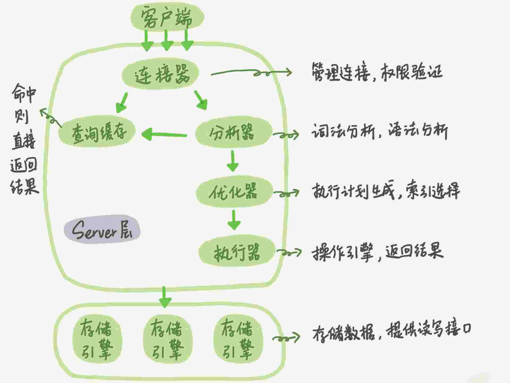

# MySQL 实战 45 讲

[TOC]

## 01 | 基础架构：一条SQL查询语句是如何执行的？
### MySQL 架构图

### Server 层
包括连接器、查询缓存、分析器、优化器、执行器等，涵盖 MySQL 的大多数核心服务功能，以及所有的内置函数（如日期、时间、数学和加密函数等），所有跨存储引擎的功能都在这一层实现，比如存储过程、触发器、视图等。
### 存储引擎层
负责数据的存储和提取。其架构模式是插件式的，支持 InnoDB、MyISAM、Memory 等多个存储引擎。现在最常用的存储引擎是 InnoDB，它从 MySQL 5.5.5 版本开始成为了默认存储引擎。
###  分析 ` mysql> select * from T where ID=10；`
1. 连接器
第一步，你会先连接到这个数据库上，这时候接待你的就是连接器。连接器负责跟客户端建立连接、获取权限、维持和管理连接。连接命令一般是这么写的：`mysql -h$ip -P$port -u$user -p`
连接命令中的 mysql 是客户端工具，用来跟服务端建立连接。在完成经典的 TCP 握手后，连接器就要开始认证你的身份，这个时候用的就是你输入的用户名和密码。
* 如果用户名或密码不对，你就会收到一个"Access denied for user"的错误，然后客户端程序结束执行。
* 如果用户名密码认证通过，连接器会到权限表里面查出你拥有的权限。之后，这个连接里面的权限判断逻辑，都将依赖于此时读到的权限。

这就意味着，一个用户成功建立连接后，即使你用管理员账号对这个用户的权限做了修改，也不会影响已经存在连接的权限。修改完成后，只有再新建的连接才会使用新的权限设置。

2. 查询缓存
MySQL 拿到一个查询请求后，会先到查询缓存看看，之前是不是执行过这条语句。之前执行过的语句及其结果可能会以 key-value 对的形式，被直接缓存在内存中。key 是查询的语句，value 是查询的结果。
如果你的查询能够直接在这个缓存中找到 key，那么这个 value 就会被直接返回给客户端。如果语句不在查询缓存中，就会继续后面的执行阶段。执行完成后，执行结果会被存入查询缓存中。你可以看到，如果查询命中缓存，MySQL 不需要执行后面的复杂操作，就可以直接返回结果，这个效率会很高。
需要注意的是，MySQL 8.0 版本直接将查询缓存的整块功能删掉了，也就是说 8.0 开始彻底没有这个功能了。
3. 分析器
你输入的是由多个字符串和空格组成的一条 SQL 语句，MySQL 需要识别出里面的字符串分别是什么，代表什么。MySQL 从你输入的"select"这个关键字识别出来，这是一个查询语句。它也要把字符串“T”识别成“表名 T”，把字符串“ID”识别成“列 ID”。做完了这些识别以后，就要做“语法分析”。根据词法分析的结果，语法分析器会根据语法规则，判断你输入的这个 SQL 语句是否满足 MySQL 语法。如果你的语句不对，就会收到“You have an error in your SQL syntax”的错误提醒，比如下面这个语句 select 少打了开头的字母“s”。
```mysql

mysql> elect * from t where ID=1;

ERROR 1064 (42000): You have an error in your SQL syntax; check the manual that corresponds to your MySQL server version for the right syntax to use near 'elect * from t where ID=1' at line 1
```
4. 优化器
经过了分析器，MySQL 就知道你要做什么了。
优化器是在表里面有多个索引的时候，决定使用哪个索引；或者在一个语句有多表关联（join）的时候，决定各个表的连接顺序。比如你执行下面这样的语句，这个语句是执行两个表的 join：
```mysql
mysql> select * from t1 join t2 using(ID)  where t1.c=10 and t2.d=20;
```
* 既可以先从表 t1 里面取出 c=10 的记录的 ID 值，再根据 ID 值关联到表 t2，再判断 t2 里面 d 的值是否等于 20。
* 也可以先从表 t2 里面取出 d=20 的记录的 ID 值，再根据 ID 值关联到 t1，再判断 t1 里面 c 的值是否等于 10。

5. 执行器
MySQL 通过分析器知道了你要做什么，通过优化器知道了该怎么做，于是就进入了执行器阶段，开始执行语句。
开始执行的时候，要先判断一下你对这个表 T 有没有执行查询的权限，如果没有，就会返回没有权限的错误，如下所示 (在工程实现上，如果命中查询缓存，会在查询缓存返回结果的时候，做权限验证。查询也会在优化器之前调用 precheck 验证权限)。
```mysql
mysql> select * from T where ID=10;

ERROR 1142 (42000): SELECT command denied to user 'b'@'localhost' for table 'T'
```
比如我们这个例子中的表 T 中，ID 字段没有索引，那么执行器的执行流程是这样的：
1. 调用 InnoDB 引擎接口取这个表的第一行，判断 ID 值是不是 10，如果不是则跳过，如果是则将这行存在结果集中；
2. 调用引擎接口取“下一行”，重复相同的判断逻辑，直到取到这个表的最后一行。
3. 执行器将上述遍历过程中所有满足条件的行组成的记录集作为结果集返回给客户端。

至此，这个语句就执行完成了。

### 问题

如果表 T 中没有字段 k，而你执行了这个语句 ` select * from T where k=1` , 那肯定是会报“不存在这个列”的错误： “Unknown column ‘k’ in ‘where clause’”。你觉得这个错误是在我们上面提到的哪个阶段报出来的呢？

答案：分析器

解释：《高性能mysql》里提到解析器和预处理器。
解析器处理语法和解析查询, 生成一课对应的解析树。
预处理器进一步检查解析树的合法。比如: 数据表和数据列是否存在, 别名是否有歧义等。如果通过则生成新的解析树，再提交给优化器。

