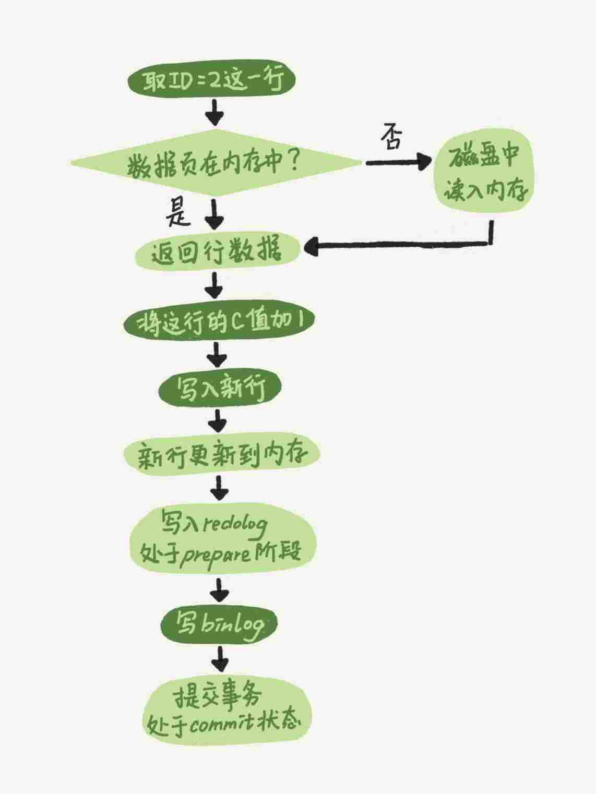

# MySQL 实战 45 讲

[TOC]

## 01 | 基础架构：一条SQL查询语句是如何执行的？
### MySQL 架构图

### Server 层
包括连接器、查询缓存、分析器、优化器、执行器等，涵盖 MySQL 的大多数核心服务功能，以及所有的内置函数（如日期、时间、数学和加密函数等），所有跨存储引擎的功能都在这一层实现，比如存储过程、触发器、视图等。
### 存储引擎层
负责数据的存储和提取。其架构模式是插件式的，支持 InnoDB、MyISAM、Memory 等多个存储引擎。现在最常用的存储引擎是 InnoDB，它从 MySQL 5.5.5 版本开始成为了默认存储引擎。
###  分析 ` mysql> select * from T where ID=10；`
1. 连接器
第一步，你会先连接到这个数据库上，这时候接待你的就是连接器。连接器负责跟客户端建立连接、获取权限、维持和管理连接。连接命令一般是这么写的：`mysql -h$ip -P$port -u$user -p`
连接命令中的 mysql 是客户端工具，用来跟服务端建立连接。在完成经典的 TCP 握手后，连接器就要开始认证你的身份，这个时候用的就是你输入的用户名和密码。
* 如果用户名或密码不对，你就会收到一个"Access denied for user"的错误，然后客户端程序结束执行。
* 如果用户名密码认证通过，连接器会到权限表里面查出你拥有的权限。之后，这个连接里面的权限判断逻辑，都将依赖于此时读到的权限。

这就意味着，一个用户成功建立连接后，即使你用管理员账号对这个用户的权限做了修改，也不会影响已经存在连接的权限。修改完成后，只有再新建的连接才会使用新的权限设置。

2. ~~查询缓存~~

  MySQL 拿到一个查询请求后，会先到查询缓存看看，之前是不是执行过这条语句。之前执行过的语句及其结果可能会以 key-value 对的形式，被直接缓存在内存中。key 是查询的语句，value 是查询的结果。
  如果你的查询能够直接在这个缓存中找到 key，那么这个 value 就会被直接返回给客户端。如果语句不在查询缓存中，就会继续后面的执行阶段。执行完成后，执行结果会被存入查询缓存中。你可以看到，如果查询命中缓存，MySQL 不需要执行后面的复杂操作，就可以直接返回结果，这个效率会很高。

  [^注意]: MySQL 8.0 版本直接将查询缓存的整块功能删掉了，也就是说 8.0 开始彻底没有这个功能了。

3. 分析器
你输入的是由多个字符串和空格组成的一条 SQL 语句，MySQL 需要识别出里面的字符串分别是什么，代表什么。MySQL 从你输入的"select"这个关键字识别出来，这是一个查询语句。它也要把字符串“T”识别成“表名 T”，把字符串“ID”识别成“列 ID”。做完了这些识别以后，就要做“语法分析”。根据词法分析的结果，语法分析器会根据语法规则，判断你输入的这个 SQL 语句是否满足 MySQL 语法。如果你的语句不对，就会收到“You have an error in your SQL syntax”的错误提醒，比如下面这个语句 select 少打了开头的字母“s”。
```mysql
mysql> elect * from t where ID=1;

ERROR 1064 (42000): You have an error in your SQL syntax; check the manual that corresponds to your MySQL server version for the right syntax to use near 'elect * from t where ID=1' at line 1
```
4. 优化器
经过了分析器，MySQL 就知道你要做什么了。
优化器是在表里面有多个索引的时候，决定使用哪个索引；或者在一个语句有多表关联（join）的时候，决定各个表的连接顺序。比如你执行下面这样的语句，这个语句是执行两个表的 join：
```mysql
mysql> select * from t1 join t2 using(ID)  where t1.c=10 and t2.d=20;
```
* 既可以先从表 t1 里面取出 c=10 的记录的 ID 值，再根据 ID 值关联到表 t2，再判断 t2 里面 d 的值是否等于 20。
* 也可以先从表 t2 里面取出 d=20 的记录的 ID 值，再根据 ID 值关联到 t1，再判断 t1 里面 c 的值是否等于 10。

5. 执行器
MySQL 通过分析器知道了你要做什么，通过优化器知道了该怎么做，于是就进入了执行器阶段，开始执行语句。
开始执行的时候，要先判断一下你对这个表 T 有没有执行查询的权限，如果没有，就会返回没有权限的错误，如下所示 (在工程实现上，如果命中查询缓存，会在查询缓存返回结果的时候，做权限验证。查询也会在优化器之前调用 precheck 验证权限)。
```mysql
mysql> select * from T where ID=10;

ERROR 1142 (42000): SELECT command denied to user 'b'@'localhost' for table 'T'
```
比如我们这个例子中的表 T 中，ID 字段没有索引，那么执行器的执行流程是这样的：
1. 调用 InnoDB 引擎接口取这个表的第一行，判断 ID 值是不是 10，如果不是则跳过，如果是则将这行存在结果集中；
2. 调用引擎接口取“下一行”，重复相同的判断逻辑，直到取到这个表的最后一行。
3. 执行器将上述遍历过程中所有满足条件的行组成的记录集作为结果集返回给客户端。

至此，这个语句就执行完成了。
### 问题

如果表 T 中没有字段 k，而你执行了这个语句 ` select * from T where k=1` , 那肯定是会报“不存在这个列”的错误： “Unknown column ‘k’ in ‘where clause’”。你觉得这个错误是在我们上面提到的哪个阶段报出来的呢？

答案：分析器

解释：《高性能mysql》里提到解析器和预处理器。
解析器处理语法和解析查询, 生成一课对应的解析树。
预处理器进一步检查解析树的合法。比如: 数据表和数据列是否存在, 别名是否有歧义等。如果通过则生成新的解析树，再提交给优化器。

## 02 | 日志系统：一条SQL更新语句是如何执行的？
之前你可能经常听 DBA 同事说，MySQL 可以恢复到半个月内任意一秒的状态，惊叹的同时，你是不是心中也会不免会好奇，这是怎样做到的呢？
```mysql
mysql> create table T(ID int primary key, c int);
```
如果要将 ID=2 这一行的值加 1，SQL 语句就会这么写：
```mysql
mysql> update T set c=c+1 where ID=2;
```
首先，可以确定的说，查询语句的那一套流程，更新语句也是同样会走一遍。


1. 你执行语句前要先连接数据库，这是连接器的工作。
前面我们说过，在一个表上有更新的时候，跟这个表有关的查询缓存会失效，所以这条语句就会把表 T 上所有缓存结果都清空。这也就是我们一般不建议使用查询缓存的原因。
2. 接下来，分析器会通过词法和语法解析知道这是一条更新语句。
3. 优化器决定要使用 ID 这个索引。
4. 然后，执行器负责具体执行，找到这一行，然后更新。
与查询流程不一样的是，更新流程还涉及两个重要的日志模块，它们正是我们今天要讨论的主角：`redo log`（重做日志）和 `binlog`（归档日志）。如果接触 `MySQL`，那这两个词肯定是绕不过的，我后面的内容里也会不断地和你强调。不过话说回来，`redo log` 和 `binlog` 在设计上有很多有意思的地方，这些设计思路也可以用到你自己的程序里。
### 重要的日志模块：redo log
比如酒店掌柜有一个***粉板***，专门用来记录客人的赊账记录。如果赊账的人不多，那么他可以把顾客名和账目写在板上。但如果赊账的人多了，粉板总会有记不下的时候，这个时候掌柜一定还有一个专门记录赊账的***账本***。
如果有人要赊账或者还账的话，掌柜一般有两种做法：
* 一种做法是直接把账本翻出来，把这次赊的账加上去或者扣除掉；
* 另一种做法是先在粉板上记下这次的账，等打烊以后再把账本翻出来核算。
在生意红火柜台很忙时，掌柜一定会选择后者，因为前者操作实在是太麻烦了。

同样，在 MySQL 里也有这个问题，如果每一次的更新操作都需要写进磁盘，然后磁盘也要找到对应的那条记录，然后再更新，整个过程 IO 成本、查找成本都很高。为了解决这个问题，MySQL 的设计者就用了类似酒店掌柜粉板的思路来提升更新效率。

而粉板和账本配合的整个过程，其实就是 `MySQL` 里经常说到的 `WAL` 技术，WAL 的全称是 `Write-Ahead Logging`，它的关键点就是先写日志，再写磁盘，也就是先写粉板，等不忙的时候再写账本。

具体来说，当有一条记录需要更新的时候，InnoDB 引擎就会先把记录写到 redo log（粉板）里面，并更新内存，这个时候更新就算完成了。同时，InnoDB 引擎会在适当的时候，将这个操作记录更新到磁盘里面，而这个更新往往是在系统比较空闲的时候做，这就像打烊以后掌柜做的事。

如果今天赊账的不多，掌柜可以等打烊后再整理。但如果某天赊账的特别多，粉板写满了，又怎么办呢？这个时候掌柜只好放下手中的活儿，把粉板中的一部分赊账记录更新到账本中，然后把这些记录从粉板上擦掉，为记新账腾出空间。

与此类似，InnoDB 的 redo log 是固定大小的，比如可以配置为一组 4 个文件，每个文件的大小是 1GB，那么这块“粉板”总共就可以记录 4GB 的操作。从头开始写，写到末尾就又回到开头循环写，如下面这个图所示。


`write pos` 是当前记录的位置，一边写一边后移，写到第 3 号文件末尾后就回到 0 号文件开头。`checkpoint` 是当前要擦除的位置，也是往后推移并且循环的，***擦除记录前要把记录更新到数据文件***。

`write pos` 和 `checkpoint` 之间的是“粉板”上还空着的部分，可以用来记录新的操作。如果 `write pos` 追上 `checkpoint`，表示“粉板”满了，这时候不能再执行新的更新，得停下来先擦掉一些记录，把 `checkpoint` 推进一下。

有了 `redo log`，InnoDB 就可以保证即使数据库发生异常重启，之前提交的记录都不会丢失，这个能力称为 `crash-safe`。

### 重要的日志模块：binlog
前面我们讲过，MySQL 整体来看，其实就有两块：一块是 Server 层，它主要做的是 MySQL 功能层面的事情；还有一块是引擎层，负责存储相关的具体事宜。上面我们聊到的粉板 redo log 是 InnoDB 引擎特有的日志，而 Server 层也有自己的日志，称为 `binlog`（归档日志）。

我想你肯定会问，为什么会有两份日志呢？

因为最开始 MySQL 里并没有 InnoDB 引擎。MySQL 自带的引擎是 MyISAM，但是 MyISAM 没有 crash-safe 的能力，binlog 日志只能用于归档。而 InnoDB 是另一个公司以插件形式引入 MySQL 的，既然只依靠 binlog 是没有 crash-safe 能力的，所以 InnoDB 使用另外一套日志系统——也就是 redo log 来实现 crash-safe 能力。

这两种日志有以下三点不同。

1. redo log 是 InnoDB 引擎特有的；binlog 是 MySQL 的 Server 层实现的，所有引擎都可以使用。

2. redo log 是物理日志，记录的是“在某个数据页上做了什么修改”；binlog 是逻辑日志，记录的是这个语句的原始逻辑，比如“给 ID=2 这一行的 c 字段加 1 ”。

3. redo log 是循环写的，空间固定会用完；binlog 是可以追加写入的。“追加写”是指 ***binlog 文件写到一定大小后会切换到下一个，并不会覆盖以前的日志***。

有了对这两个日志的概念性理解，我们再来看执行器和 InnoDB 引擎在执行这个简单的 update 语句时的内部流程。

1. 执行器先找引擎取 ID=2 这一行。ID 是主键，引擎直接用树搜索找到这一行。如果 ID=2 这一行所在的数据页本来就在内存中，就直接返回给执行器；否则，需要先从磁盘读入内存，然后再返回。

2. 执行器拿到引擎给的行数据，把这个值加上 1，比如原来是 N，现在就是 N+1，得到新的一行数据，再调用引擎接口写入这行新数据。

3. 引擎将这行新数据更新到内存中，同时将这个更新操作记录到 redo log 里面，此时 redo log 处于 prepare 状态。然后告知执行器执行完成了，随时可以提交事务。

4. 执行器生成这个操作的 binlog，并把 binlog 写入磁盘。

5. 执行器调用引擎的提交事务接口，引擎把刚刚写入的 redo log 改成提交（commit）状态，更新完成。

这里我给出这个 update 语句的执行流程图，图中浅色框表示是在 InnoDB 内部执行的，深色框表示是在执行器中执行的。


你可能注意到了，最后三步看上去有点“绕”，将 redo log 的写入拆成了两个步骤：`prepare` 和 `commit`，这就是"两阶段提交"。

### 两阶段提交

为什么必须有“两阶段提交”呢？这是为了让两份日志之间的逻辑一致。

前面我们说过了，binlog 会记录所有的逻辑操作，并且是采用“追加写”的形式。如果你的 DBA 承诺说半个月内可以恢复，那么备份系统中一定会保存最近半个月的所有 binlog，同时系统会定期做整库备份。这里的“定期”取决于系统的重要性，可以是一天一备，也可以是一周一备。

当需要恢复到指定的某一秒时，比如某天下午两点发现中午十二点有一次误删表，需要找回数据，那你可以这么做：

* 首先，找到最近的一次全量备份，如果你运气好，可能就是昨天晚上的一个备份，从这个备份恢复到临时库；
* 然后，从备份的时间点开始，将备份的 binlog 依次取出来，重放到中午误删表之前的那个时刻。

这样你的临时库就跟误删之前的线上库一样了，然后你可以把表数据从临时库取出来，按需要恢复到线上库去。

说完了数据恢复过程，我们回来说说，为什么日志需要“两阶段提交”。这里不妨用反证法来进行解释。

由于 redo log 和 binlog 是两个独立的逻辑，如果不用两阶段提交，要么就是先写完 redo log 再写 binlog，或者采用反过来的顺序。我们看看这两种方式会有什么问题。

仍然用前面的 update 语句来做例子。假设当前 ID=2 的行，字段 c 的值是 0，再假设执行 update 语句过程中在写完第一个日志后，第二个日志还没有写完期间发生了 crash，会出现什么情况呢？

1. 先写 `redo log` 后写 `binlog`。假设在 `redo log` 写完，`binlog` 还没有写完的时候，MySQL 进程异常重启。由于我们前面说过的，`redo log` 写完之后，系统即使崩溃，仍然能够把数据恢复回来，所以恢复后这一行 c 的值是 1。但是由于 `binlog` 没写完就 `crash` 了，这时候 `binlog` 里面就没有记录这个语句。因此，之后备份日志的时候，存起来的 `binlog` 里面就没有这条语句。然后你会发现，如果需要用这个 `binlog` 来恢复临时库的话，由于这个语句的 `binlog` 丢失，这个临时库就会少了这一次更新，恢复出来的这一行 c 的值就是 0，与原库的值不同。
2. 先写 `binlog` 后写 `redo log`。如果在 `binlog` 写完之后 `crash`，由于 `redo log` 还没写，崩溃恢复以后这个事务无效，所以这一行 c 的值是 0。但是 `binlog` 里面已经记录了“把 c 从 0 改成 1”这个日志。所以，在之后用 `binlog` 来恢复的时候就多了一个事务出来，恢复出来的这一行 c 的值就是 1，与原库的值不同。

可以看到，如果不使用“两阶段提交”，那么数据库的状态就有可能和用它的日志恢复出来的库的状态不一致。

你可能会说，这个概率是不是很低，平时也没有什么动不动就需要恢复临时库的场景呀？其实不是的，不只是误操作后需要用这个过程来恢复数据。当你需要***扩容***的时候，也就是需要再多搭建一些***备库***来增加系统的读能力的时候，***现在常见的做法也是用全量备份加上应用 binlog 来实现的***，这个“不一致”就会导致你的线上出现主从数据库不一致的情况。

### 小结

1. MySQL 里面最重要的两个日志，即物理日志 redo log 和逻辑日志 binlog。

   * redo log 用于保证 crash-safe 能力。`innodb_flush_log_at_trx_commit` 这个参数设置成 1 的时候，表示每次事务的 `redo log` 都直接持久化到磁盘。这个参数我建议你设置成 1，这样可以保证 MySQL 异常重启之后数据不丢失。
   * `sync_binlog` 这个参数设置成 1 的时候，表示每次事务的 `binlog` 都持久化到磁盘。这个参数我也建议你设置成 1，这样可以保证 MySQL 异常重启之后 `binlog` 不丢失。

2. MySQL 日志系统密切相关的“两阶段提交”
### 问题
定期全量备份的周期“取决于系统重要性，有的是一天一备，有的是一周一备”。那么在什么场景下，一天一备会比一周一备更有优势呢？或者说，它影响了这个数据库系统的哪个指标？

一天一备好处是“最长恢复时间”更短。在一天一备的模式里，最坏情况下需要应用一天的 binlog。比如，你每天 0 点做一次全量备份，而要恢复出一个到昨天晚上 23 点的备份。一周一备最坏情况就要应用一周的 binlog 了。系统的对应指标就是 ***RTO（恢复目标时间）***。当然这个是有成本的，因为更频繁全量备份需要消耗更多存储空间，所以这个 RTO 是成本换来的，就需要你根据业务重要性来评估了。