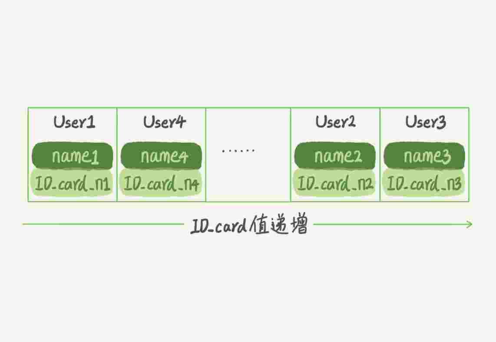

# MySQL 实战 45 讲

[TOC]

## 01 | 基础架构：一条SQL查询语句是如何执行的？
### MySQL 架构图


### Server 层
包括连接器、查询缓存、分析器、优化器、执行器等，涵盖 MySQL 的大多数核心服务功能，以及所有的内置函数（如日期、时间、数学和加密函数等），所有跨存储引擎的功能都在这一层实现，比如存储过程、触发器、视图等。
### 存储引擎层
负责数据的存储和提取。其架构模式是插件式的，支持 InnoDB、MyISAM、Memory 等多个存储引擎。现在最常用的存储引擎是 InnoDB，它从 MySQL 5.5.5 版本开始成为了默认存储引擎。
###  分析 ` mysql> select * from T where ID=10；`
1. 连接器
第一步，你会先连接到这个数据库上，这时候接待你的就是连接器。连接器负责跟客户端建立连接、获取权限、维持和管理连接。连接命令一般是这么写的：`mysql -h$ip -P$port -u$user -p`
连接命令中的 mysql 是客户端工具，用来跟服务端建立连接。在完成经典的 TCP 握手后，连接器就要开始认证你的身份，这个时候用的就是你输入的用户名和密码。
* 如果用户名或密码不对，你就会收到一个"Access denied for user"的错误，然后客户端程序结束执行。
* 如果用户名密码认证通过，连接器会到权限表里面查出你拥有的权限。之后，这个连接里面的权限判断逻辑，都将依赖于此时读到的权限。

这就意味着，一个用户成功建立连接后，即使你用管理员账号对这个用户的权限做了修改，也不会影响已经存在连接的权限。修改完成后，只有再新建的连接才会使用新的权限设置。

2. ~~查询缓存~~

  MySQL 拿到一个查询请求后，会先到查询缓存看看，之前是不是执行过这条语句。之前执行过的语句及其结果可能会以 key-value 对的形式，被直接缓存在内存中。key 是查询的语句，value 是查询的结果。
  如果你的查询能够直接在这个缓存中找到 key，那么这个 value 就会被直接返回给客户端。如果语句不在查询缓存中，就会继续后面的执行阶段。执行完成后，执行结果会被存入查询缓存中。你可以看到，如果查询命中缓存，MySQL 不需要执行后面的复杂操作，就可以直接返回结果，这个效率会很高。

  [^注意]: MySQL 8.0 版本直接将查询缓存的整块功能删掉了，也就是说 8.0 开始彻底没有这个功能了。

3. 分析器
你输入的是由多个字符串和空格组成的一条 SQL 语句，MySQL 需要识别出里面的字符串分别是什么，代表什么。MySQL 从你输入的"select"这个关键字识别出来，这是一个查询语句。它也要把字符串“T”识别成“表名 T”，把字符串“ID”识别成“列 ID”。做完了这些识别以后，就要做“语法分析”。根据词法分析的结果，语法分析器会根据语法规则，判断你输入的这个 SQL 语句是否满足 MySQL 语法。如果你的语句不对，就会收到“You have an error in your SQL syntax”的错误提醒，比如下面这个语句 select 少打了开头的字母“s”。
```mysql
mysql> elect * from t where ID=1;

ERROR 1064 (42000): You have an error in your SQL syntax; check the manual that corresponds to your MySQL server version for the right syntax to use near 'elect * from t where ID=1' at line 1
```
4. 优化器
经过了分析器，MySQL 就知道你要做什么了。
优化器是在表里面有多个索引的时候，决定使用哪个索引；或者在一个语句有多表关联（join）的时候，决定各个表的连接顺序。比如你执行下面这样的语句，这个语句是执行两个表的 join：
```mysql
mysql> select * from t1 join t2 using(ID)  where t1.c=10 and t2.d=20;
```
* 既可以先从表 t1 里面取出 c=10 的记录的 ID 值，再根据 ID 值关联到表 t2，再判断 t2 里面 d 的值是否等于 20。
* 也可以先从表 t2 里面取出 d=20 的记录的 ID 值，再根据 ID 值关联到 t1，再判断 t1 里面 c 的值是否等于 10。

5. 执行器
MySQL 通过分析器知道了你要做什么，通过优化器知道了该怎么做，于是就进入了执行器阶段，开始执行语句。
开始执行的时候，要先判断一下你对这个表 T 有没有执行查询的权限，如果没有，就会返回没有权限的错误，如下所示 (在工程实现上，如果命中查询缓存，会在查询缓存返回结果的时候，做权限验证。查询也会在优化器之前调用 precheck 验证权限)。
```mysql
mysql> select * from T where ID=10;

ERROR 1142 (42000): SELECT command denied to user 'b'@'localhost' for table 'T'
```
比如我们这个例子中的表 T 中，ID 字段没有索引，那么执行器的执行流程是这样的：
1. 调用 InnoDB 引擎接口取这个表的第一行，判断 ID 值是不是 10，如果不是则跳过，如果是则将这行存在结果集中；
2. 调用引擎接口取“下一行”，重复相同的判断逻辑，直到取到这个表的最后一行。
3. 执行器将上述遍历过程中所有满足条件的行组成的记录集作为结果集返回给客户端。

至此，这个语句就执行完成了。
### 问题

如果表 T 中没有字段 k，而你执行了这个语句 ` select * from T where k=1` , 那肯定是会报“不存在这个列”的错误： “Unknown column ‘k’ in ‘where clause’”。你觉得这个错误是在我们上面提到的哪个阶段报出来的呢？

答案：分析器

解释：《高性能mysql》里提到解析器和预处理器。
解析器处理语法和解析查询, 生成一课对应的解析树。
预处理器进一步检查解析树的合法。比如: 数据表和数据列是否存在, 别名是否有歧义等。如果通过则生成新的解析树，再提交给优化器。

## 02 | 日志系统：一条SQL更新语句是如何执行的？
之前你可能经常听 DBA 同事说，MySQL 可以恢复到半个月内任意一秒的状态，惊叹的同时，你是不是心中也会不免会好奇，这是怎样做到的呢？
```mysql
mysql> create table T(ID int primary key, c int);
```
如果要将 ID=2 这一行的值加 1，SQL 语句就会这么写：
```mysql
mysql> update T set c=c+1 where ID=2;
```
首先，可以确定的说，查询语句的那一套流程，更新语句也是同样会走一遍。


1. 你执行语句前要先连接数据库，这是连接器的工作。
前面我们说过，在一个表上有更新的时候，跟这个表有关的查询缓存会失效，所以这条语句就会把表 T 上所有缓存结果都清空。这也就是我们一般不建议使用查询缓存的原因。
2. 接下来，分析器会通过词法和语法解析知道这是一条更新语句。
3. 优化器决定要使用 ID 这个索引。
4. 然后，执行器负责具体执行，找到这一行，然后更新。
与查询流程不一样的是，更新流程还涉及两个重要的日志模块，它们正是我们今天要讨论的主角：`redo log`（重做日志）和 `binlog`（归档日志）。如果接触 `MySQL`，那这两个词肯定是绕不过的，我后面的内容里也会不断地和你强调。不过话说回来，`redo log` 和 `binlog` 在设计上有很多有意思的地方，这些设计思路也可以用到你自己的程序里。
### 重要的日志模块：redo log

redo log记录了对实际数据文件的物理变更(数据文件的什么位置数据做了如何的变更)。

比如酒店掌柜有一个***粉板***，专门用来记录客人的赊账记录。如果赊账的人不多，那么他可以把顾客名和账目写在板上。但如果赊账的人多了，粉板总会有记不下的时候，这个时候掌柜一定还有一个专门记录赊账的***账本***。
如果有人要赊账或者还账的话，掌柜一般有两种做法：

* 一种做法是直接把账本翻出来，把这次赊的账加上去或者扣除掉；
* 另一种做法是先在粉板上记下这次的账，等打烊以后再把账本翻出来核算。
在生意红火柜台很忙时，掌柜一定会选择后者，因为前者操作实在是太麻烦了。

同样，在 MySQL 里也有这个问题，如果每一次的更新操作都需要写进磁盘，然后磁盘也要找到对应的那条记录，然后再更新，整个过程 IO 成本、查找成本都很高。为了解决这个问题，MySQL 的设计者就用了类似酒店掌柜粉板的思路来提升更新效率。

而粉板和账本配合的整个过程，其实就是 `MySQL` 里经常说到的 `WAL` 技术，WAL 的全称是 `Write-Ahead Logging`，它的关键点就是先写日志，再写磁盘，也就是先写粉板，等不忙的时候再写账本，从而来保证事务的持久性。

[^Undo Log]: 日志用来保证事务的原子性和MVCC，所有的undo操作产身的数据文件的变更也会记录到redo日志中。

[^MVCC]: 英文全称为：Multi-Version Concurrency Control，翻译为中文即：多版本并发控制。

具体来说，当有一条记录需要更新的时候，InnoDB 引擎就会先把记录写到 `redo log`（粉板）里面，并更新内存，这个时候更新就算完成了。同时，InnoDB 引擎会在适当的时候，将这个操作记录更新到磁盘里面，而这个更新往往是在系统比较空闲的时候做，这就像打烊以后掌柜做的事。

如果今天赊账的不多，掌柜可以等打烊后再整理。但如果某天赊账的特别多，粉板写满了，又怎么办呢？这个时候掌柜只好放下手中的活儿，把粉板中的一部分赊账记录更新到账本中，然后把这些记录从粉板上擦掉，为记新账腾出空间。

与此类似，InnoDB 的 redo log 是固定大小的，比如可以配置为一组 4 个文件，每个文件的大小是 1GB，那么这块“粉板”总共就可以记录 4GB 的操作。从头开始写，写到末尾就又回到开头循环写，如下面这个图所示。


`write pos` 是当前记录的位置，一边写一边后移，写到第 3 号文件末尾后就回到 0 号文件开头。`checkpoint` 是当前要擦除的位置，也是往后推移并且循环的，***擦除记录前要把记录更新到数据文件***。

`write pos` 和 `checkpoint` 之间的是“粉板”上还空着的部分，可以用来记录新的操作。如果 `write pos` 追上 `checkpoint`，表示“粉板”满了，这时候不能再执行新的更新，得停下来先擦掉一些记录，把 `checkpoint` 推进一下。

有了 `redo log`，InnoDB 就可以保证即使数据库发生异常重启，之前提交的记录都不会丢失，这个能力称为 `crash-safe`。

[redo log 参照讲解](https://blog.51cto.com/wangwei007/2287431 )

### 重要的日志模块：binlog
前面我们讲过，MySQL 整体来看，其实就有两块：一块是 Server 层，它主要做的是 MySQL 功能层面的事情；还有一块是引擎层，负责存储相关的具体事宜。上面我们聊到的粉板 redo log 是 InnoDB 引擎特有的日志，而 Server 层也有自己的日志，称为 `binlog`（归档日志）。

我想你肯定会问，为什么会有两份日志呢？

因为最开始 MySQL 里并没有 InnoDB 引擎。MySQL 自带的引擎是 MyISAM，但是 MyISAM 没有 crash-safe 的能力，binlog 日志只能用于归档。而 InnoDB 是另一个公司以插件形式引入 MySQL 的，既然只依靠 binlog 是没有 crash-safe 能力的，所以 InnoDB 使用另外一套日志系统——也就是 redo log 来实现 crash-safe 能力。

这两种日志有以下三点不同。

1. redo log 是 InnoDB 引擎特有的；binlog 是 MySQL 的 Server 层实现的，所有引擎都可以使用。

2. redo log 是物理日志，记录的是“在某个数据页上做了什么修改”；binlog 是逻辑日志，记录的是这个语句的原始逻辑，比如“给 ID=2 这一行的 c 字段加 1 ”。

3. redo log 是循环写的，空间固定会用完；binlog 是可以追加写入的。“追加写”是指 ***binlog 文件写到一定大小后会切换到下一个，并不会覆盖以前的日志***。

有了对这两个日志的概念性理解，我们再来看执行器和 InnoDB 引擎在执行这个简单的 update 语句时的内部流程。

1. 执行器先找引擎取 ID=2 这一行。ID 是主键，引擎直接用树搜索找到这一行。如果 ID=2 这一行所在的数据页本来就在内存中，就直接返回给执行器；否则，需要先从磁盘读入内存，然后再返回。

2. 执行器拿到引擎给的行数据，把这个值加上 1，比如原来是 N，现在就是 N+1，得到新的一行数据，再调用引擎接口写入这行新数据。

3. 引擎将这行新数据更新到内存中，同时将这个更新操作记录到 redo log 里面，此时 redo log 处于 prepare 状态。然后告知执行器执行完成了，随时可以提交事务。

4. 执行器生成这个操作的 binlog，并把 binlog 写入磁盘。

5. 执行器调用引擎的提交事务接口，引擎把刚刚写入的 redo log 改成提交（commit）状态，更新完成。

这里我给出这个 update 语句的执行流程图，图中浅色框表示是在 InnoDB 内部执行的，深色框表示是在执行器中执行的。


你可能注意到了，最后三步看上去有点“绕”，将 redo log 的写入拆成了两个步骤：`prepare` 和 `commit`，这就是"两阶段提交"。

### 两阶段提交

为什么必须有“两阶段提交”呢？这是为了让两份日志之间的逻辑一致。

前面我们说过了，binlog 会记录所有的逻辑操作，并且是采用“追加写”的形式。如果你的 DBA 承诺说半个月内可以恢复，那么备份系统中一定会保存最近半个月的所有 binlog，同时系统会定期做整库备份。这里的“定期”取决于系统的重要性，可以是一天一备，也可以是一周一备。

当需要恢复到指定的某一秒时，比如某天下午两点发现中午十二点有一次误删表，需要找回数据，那你可以这么做：

* 首先，找到最近的一次全量备份，如果你运气好，可能就是昨天晚上的一个备份，从这个备份恢复到临时库；
* 然后，从备份的时间点开始，将备份的 binlog 依次取出来，重放到中午误删表之前的那个时刻。

这样你的临时库就跟误删之前的线上库一样了，然后你可以把表数据从临时库取出来，按需要恢复到线上库去。

说完了数据恢复过程，我们回来说说，为什么日志需要“两阶段提交”。这里不妨用反证法来进行解释。

由于 redo log 和 binlog 是两个独立的逻辑，如果不用两阶段提交，要么就是先写完 redo log 再写 binlog，或者采用反过来的顺序。我们看看这两种方式会有什么问题。

仍然用前面的 update 语句来做例子。假设当前 ID=2 的行，字段 c 的值是 0，再假设执行 update 语句过程中在写完第一个日志后，第二个日志还没有写完期间发生了 crash，会出现什么情况呢？

1. 先写 `redo log` 后写 `binlog`。假设在 `redo log` 写完，`binlog` 还没有写完的时候，MySQL 进程异常重启。由于我们前面说过的，`redo log` 写完之后，系统即使崩溃，仍然能够把数据恢复回来，所以恢复后这一行 c 的值是 1。但是由于 `binlog` 没写完就 `crash` 了，这时候 `binlog` 里面就没有记录这个语句。因此，之后备份日志的时候，存起来的 `binlog` 里面就没有这条语句。然后你会发现，如果需要用这个 `binlog` 来恢复临时库的话，由于这个语句的 `binlog` 丢失，这个临时库就会少了这一次更新，恢复出来的这一行 c 的值就是 0，与原库的值不同。
2. 先写 `binlog` 后写 `redo log`。如果在 `binlog` 写完之后 `crash`，由于 `redo log` 还没写，崩溃恢复以后这个事务无效，所以这一行 c 的值是 0。但是 `binlog` 里面已经记录了“把 c 从 0 改成 1”这个日志。所以，在之后用 `binlog` 来恢复的时候就多了一个事务出来，恢复出来的这一行 c 的值就是 1，与原库的值不同。

可以看到，如果不使用“两阶段提交”，那么数据库的状态就有可能和用它的日志恢复出来的库的状态不一致。

你可能会说，这个概率是不是很低，平时也没有什么动不动就需要恢复临时库的场景呀？其实不是的，不只是误操作后需要用这个过程来恢复数据。当你需要***扩容***的时候，也就是需要再多搭建一些***备库***来增加系统的读能力的时候，***现在常见的做法也是用全量备份加上应用 binlog 来实现的***，这个“不一致”就会导致你的线上出现主从数据库不一致的情况。

### 小结

1. MySQL 里面最重要的两个日志，即物理日志 redo log 和逻辑日志 binlog。

   * redo log 用于保证 crash-safe 能力。`innodb_flush_log_at_trx_commit` 这个参数设置成 1 的时候，表示每次事务的 `redo log` 都直接持久化到磁盘。这个参数我建议你设置成 1，这样可以保证 MySQL 异常重启之后数据不丢失。
   * `sync_binlog` 这个参数设置成 1 的时候，表示每次事务的 `binlog` 都持久化到磁盘。这个参数我也建议你设置成 1，这样可以保证 MySQL 异常重启之后 `binlog` 不丢失。

2. MySQL 日志系统密切相关的“两阶段提交”
### 问题
定期全量备份的周期“取决于系统重要性，有的是一天一备，有的是一周一备”。那么在什么场景下，一天一备会比一周一备更有优势呢？或者说，它影响了这个数据库系统的哪个指标？

一天一备好处是“最长恢复时间”更短。在一天一备的模式里，最坏情况下需要应用一天的 binlog。比如，你每天 0 点做一次全量备份，而要恢复出一个到昨天晚上 23 点的备份。一周一备最坏情况就要应用一周的 binlog 了。系统的对应指标就是 ***RTO（恢复目标时间）***。当然这个是有成本的，因为更频繁全量备份需要消耗更多存储空间，所以这个 RTO 是成本换来的，就需要你根据业务重要性来评估了。

## 03 | 事务隔离：为什么你改了我还看不见？

事务就是要保证一组数据库操作，要么全部成功，要么全部失败。在 MySQL 中，事务支持是在引擎层实现的。你现在知道，MySQL 是一个支持多引擎的系统，但并不是所有的引擎都支持事务。比如 MySQL 原生的 MyISAM 引擎就不支持事务，这也是 MyISAM 被 InnoDB 取代的重要原因之一。

### 隔离性与隔离级别

ACID（Atomicity、Consistency、Isolation、Durability，即原子性、一致性、隔离性、持久性）

SQL 标准的事务隔离级别包括：读未提交（read uncommitted）、读提交（read committed）、可重复读（repeatable read）和串行化（serializable ）。

* 读未提交是指，一个事务还没提交时，它做的变更就能被别的事务看到。
* 读提交是指，一个事务提交之后，它做的变更才会被其他事务看到。
* 可重复读是指，一个事务执行过程中看到的数据，总是跟这个事务在启动时看到的数据是一致的。当然在可重复读隔离级别下，未提交变更对其他事务也是不可见的。
* 串行化，顾名思义是对于同一行记录，“写”会加“写锁”，“读”会加“读锁”。当出现读写锁冲突的时候，后访问的事务必须等前一个事务执行完成，才能继续执行。

其中“读提交”和“可重复读”比较难理解，所以我用一个例子说明这几种隔离级别。假设数据表 T 中只有一列，其中一行的值为 1，下面是按照时间顺序执行两个事务的行为。
```mysql
mysql> create table T(c int) engine=InnoDB;
insert into T(c) values(1);
```

|   事务A   |  事务B   |
| ---- | ---- |
|   启动事务 查询得到的值1   |   启动事务   |
|      |   查询得到值1   |
|      |   将1改成2   |
|   查询得到值V1   |      |
|      |   提交事务B   |
|  查询得到值V2   |      |
|   提交事务A   |      |
|  查询得到值V3   |      |

我们来看看在不同的隔离级别下，事务 A 会有哪些不同的返回结果，也就是图里面 V1、V2、V3 的返回值分别是什么。

* 若隔离级别是“读未提交”， 则 V1 的值就是 2。这时候事务 B 虽然还没有提交，但是结果已经被 A 看到了。因此，V2、V3 也都是 2。

* 若隔离级别是“读提交”，则 V1 是 1，V2 的值是 2。事务 B 的更新在提交后才能被 A 看到。所以， V3 的值也是 2。

* 若隔离级别是“可重复读”，则 V1、V2 是 1，V3 是 2。之所以 V2 还是 1，遵循的就是这个要求：事务在执行期间看到的数据前后必须是一致的。

* 若隔离级别是“串行化”，则在事务 B 执行“将 1 改成 2”的时候，会被锁住。直到事务 A 提交后，事务 B 才可以继续执行。所以从 A 的角度看， V1、V2 值是 1，V3 的值是 2。

在实现上，数据库里面会创建一个视图，访问的时候以视图的逻辑结果为准。在“可重复读”隔离级别下，这个视图是在事务启动时创建的，整个事务存在期间都用这个视图。在“读提交”隔离级别下，这个视图是在每个 SQL 语句开始执行的时候创建的。这里需要注意的是，“读未提交”隔离级别下直接返回记录上的最新值，没有视图概念；而“串行化”隔离级别下直接用加锁的方式来避免并行访问。

查看事务隔离级别代码

```mysql
mysql> show variables like 'transaction_isolation';
+-----------------------+----------------+
| Variable_name | Value |
+-----------------------+----------------+
| transaction_isolation | READ-COMMITTED |
+-----------------------+----------------+
```

### 事务隔离的实现

在 MySQL 中，实际上每条记录在更新的时候都会同时记录一条回滚操作。记录上的最新值，通过回滚操作，都可以得到前一个状态的值。

假设一个值从 1 被按顺序改成了 2、3、4，在回滚日志里面就会有类似下面的记录。

当前值是 4，但是在查询这条记录的时候，不同时刻启动的事务会有不同的 read-view。如图中看到的，在视图 A、B、C 里面，这一个记录的值分别是 1、2、4，同一条记录在系统中可以存在多个版本，就是数据库的多版本并发控制（MVCC）。对于 read-view A，要得到 1，就必须将当前值依次执行图中所有的回滚操作得到。

同时你会发现，即使现在有另外一个事务正在将 4 改成 5，这个事务跟 read-view A、B、C 对应的事务是不会冲突的。

你一定会问，回滚日志总不能一直保留吧，什么时候删除呢？答案是，在不需要的时候才删除。也就是说，系统会判断，当没有事务再需要用到这些回滚日志时，回滚日志会被删除。什么时候才不需要了呢？就是当系统里没有比这个回滚日志更早的 read-view 的时候。

基于上面的说明，我们来讨论一下为什么建议你***尽量不要使用长事务***。

长事务意味着系统里面会存在很老的事务视图。由于这些事务随时可能访问数据库里面的任何数据，所以这个事务提交之前，数据库里面它可能用到的回滚记录都必须保留，这就会**导致大量占用存储空间**。在 MySQL 5.5 及以前的版本，回滚日志是跟数据字典一起放在 ibdata 文件里的，即使长事务最终提交，回滚段被清理，文件也不会变小。

除了对回滚段的影响，**长事务还占用锁资源**，也可能拖垮整个库，这个我们会在后面讲锁的时候展开。

### 事务的启动方式

MySQL 的事务启动方式有以下几种：

1. 显式启动事务语句， `begin` 或 `start transaction`。配套的提交语句是 `commit`，回滚语句是 `rollback`。
2. `set autocommit=0`，这个命令会将这个线程的自动提交关掉。意味着如果你只执行一个 select 语句，这个事务就启动了，而且并不会自动提交。这个事务持续存在直到你主动执行 `commit` 或 `rollback` 语句，或者断开连接。建议你总是使用 set autocommit=1, 通过显式语句的方式来启动事务。

但是有的开发同学会纠结“多一次交互”的问题。对于一个需要频繁使用事务的业务，第二种方式每个事务在开始时都不需要主动执行一次 “begin”，减少了语句的交互次数。如果你也有这个顾虑，我建议你使用 commit work and chain 语法。

如果执行 commit work and chain，则是提交事务并自动启动下一个事务，这样也省去了再次执行 begin 语句的开销。同时带来的好处是从程序开发的角度明确地知道每个语句是否处于事务中。

你可以在 information_schema 库的 innodb_trx 这个表中查询长事务，比如下面这个语句，用于查找持续时间超过 60s 的事务。

```mysql
select * from information_schema.innodb_trx where TIME_TO_SEC(timediff(now(),trx_started))>60
```

### 问题

你现在知道了系统里面应该避免长事务，如果你是业务开发负责人同时也是数据库负责人，你会有什么方案来避免出现或者处理这种情况呢？

#### 首先，从应用开发端来看：

1. 确认是否使用了 set autocommit=0。这个确认工作可以在测试环境中开展，把 MySQL 的 general_log 开起来，然后随便跑一个业务逻辑，通过 general_log 的日志来确认。一般框架如果会设置这个值，也就会提供参数来控制行为，你的目标就是把它改成 1。
2. 确认是否有不必要的只读事务。有些框架会习惯不管什么语句先用 begin/commit 框起来。我见过有些是业务并没有这个需要，但是也把好几个 select 语句放到了事务中。这种只读事务可以去掉。
3. 业务连接数据库的时候，根据业务本身的预估，通过 `SET MAX_EXECUTION_TIME` 命令，来控制每个语句执行的最长时间，避免单个语句意外执行太长时间。（为什么会意外？在后续的文章中会提到这类案例）

#### 其次，从数据库端来看

1. 监控 information_schema.Innodb_trx 表，设置长事务阈值，超过就报警 / 或者 kill；
2. Percona 的 pt-kill 这个工具不错，推荐使用；
3. 在业务功能测试阶段要求输出所有的 general_log，分析日志行为提前发现问题；
4. 如果使用的是 MySQL 5.6 或者更新版本，把 innodb_undo_tablespaces 设置成 2（或更大的值）。如果真的出现大事务导致回滚段过大，这样设置后清理起来更方便。

## 04 | 深入浅出索引（上）

一句话简单来说，索引的出现其实就是为了提高数据查询的效率，就像书的目录一样。

### 索引的常见模型

哈希表、有序数组和搜索树。

***哈希表***

是一种以键 - 值（key-value）存储数据的结构，我们只要输入待查找的键即 key，就可以找到其对应的值即 Value。哈希的思路很简单，把值放在数组里，用一个哈希函数把 key 换算成一个确定的位置，然后把 value 放在数组的这个位置。不可避免地，多个 key 值经过哈希函数的换算，会出现同一个值的情况。处理这种情况的一种方法是，拉出一个链表。


哈希表这种结构适用于只有等值查询的场景，比如 Memcached 及其他一些 NoSQL 引擎。

***有序数组***

在等值查询和范围查询场景中的性能就都非常优秀。但是，在需要更新数据的时候就麻烦了，你往中间插入一个记录就必须得挪动后面所有的记录，成本太高。


有序数组索引只适用于静态存储引擎，比如你要保存的是 2017 年某个城市的所有人口信息，这类不会再修改的数据。

***二叉搜索树***

二叉搜索树的特点是：每个节点的左儿子小于父节点，父节点又小于右儿子。这样如果你要查 ID_card_n2 的话，按照图中的搜索顺序就是按照 UserA -> UserC -> UserF -> User2 这个路径得到。这个时间复杂度是 O(log(N))。


当然为了维持 O(log(N)) 的查询复杂度，你就需要保持这棵树是平衡二叉树。为了做这个保证，更新的时间复杂度也是 O(log(N))。

二叉树是搜索效率最高的，但是实际上大多数的数据库存储却并不使用二叉树。其原因是，索引不止存在内存中，还要写到磁盘上。

你可以想象一下一棵 100 万节点的平衡二叉树，树高 20。一次查询可能需要访问 20 个数据块。在机械硬盘时代，从磁盘随机读一个数据块需要 10 ms 左右的寻址时间。也就是说，对于一个 100 万行的表，如果使用二叉树来存储，单独访问一个行可能需要 20 个 10 ms 的时间，这个查询可真够慢的。

为了让一个查询尽量少地读磁盘，就必须让查询过程访问尽量少的数据块。那么，我们就不应该使用二叉树，而是要使用“N 叉”树。这里，“N 叉”树中的“N”取决于数据块的大小。以 InnoDB 的一个整数字段索引为例，这个 N 差不多是 1200。这棵树高是 4 的时候，就可以存 1200 的 3 次方个值，这已经 17 亿了。考虑到树根的数据块总是在内存中的，一个 10 亿行的表上一个整数字段的索引，查找一个值最多只需要访问 3 次磁盘。其实，树的第二层也有很大概率在内存中，那么访问磁盘的平均次数就更少了。

N 叉树由于在读写上的性能优点，以及适配磁盘的访问模式，已经被广泛应用在数据库引擎中了。

跳表、LSM（Log Structured Merge Tree） 树等数据结构也被用于引擎设计中。

跳表，是基于链表实现的一种类似“二分”的算法（**链表加多级索引的结构**），可以快速的实现增，删，改，查操作。

LSM 的设计目标是提供比传统的 B+ 树更好的**写性能**。LSM 通过**将磁盘的随机写转化为顺序写来提高写性能 ，而付出的代价就是牺牲部分读性能、写放大（B+树同样有写放大的问题）**。

数据库底层存储的核心就是基于这些数据模型的。每碰到一个新数据库，我们需要先关注它的数据模型，这样才能从理论上分析出这个数据库的适用场景。

### InnoDB 的索引模型

在 InnoDB 中，表都是根据主键顺序以索引的形式存放的，这种存储方式的表称为索引组织表。又因为前面我们提到的，InnoDB 使用了 B+ 树索引模型，所以数据都是存储在 B+ 树中的。每一个索引在 InnoDB 里面对应一棵 B+ 树。

假设，我们有一个主键列为 ID 的表，表中有字段 k，并且在 k 上有索引。这个表的建表语句是：

```mysql
mysql> create table T(
id int primary key, 
k int not null, 
name varchar(16),
index (k)
)engine=InnoDB;
```

表中 R1~R5 的 (ID,k) 值分别为 (100,1)、(200,2)、(300,3)、(500,5) 和 (600,6)，两棵树的示例示意图如下。


从图中不难看出，根据叶子节点的内容，索引类型分为主键索引和非主键索引。

主键索引的叶子节点存的是整行数据。在 InnoDB 里，主键索引也被称为聚簇索引（clustered index）。

非主键索引的叶子节点内容是主键的值。在 InnoDB 里，非主键索引也被称为二级索引（secondary index）。

**基于主键索引和普通索引的查询有什么区别？**

* 如果语句是 select * from T where ID=500，即主键查询方式，则只需要搜索 ID 这棵 B+ 树；
* 如果语句是 select * from T where k=5，即普通索引查询方式，则需要先搜索 k 索引树，得到 ID 的值为 500，再到 ID 索引树搜索一次。这个过程称为***回表***。也就是说，基于非主键索引的查询需要多扫描一棵索引树。因此，我们在应用中应该尽量使用主键查询。

### 索引维护
B+ 树为了维护索引***<font color="red">有序性</font>***，在插入新值的时候需要做必要的维护。

以上面这个图为例，如果插入新的行 ID 值为 700，则只需要在 R5 的记录后面插入一个新记录。如果新插入的 ID 值为 400，就相对麻烦了，需要逻辑上挪动后面的数据，空出位置。而更糟的情况是，如果 R5 所在的数据页已经满了，根据 B+ 树的算法，这时候需要申请一个新的数据页，然后挪动部分数据过去。这个过程称为页分裂。在这种情况下，性能自然会受影响。除了性能外，页分裂操作还影响数据页的利用率。原本放在一个页的数据，现在分到两个页中，整体空间利用率降低大约 50%。

当然有分裂就有合并。当相邻两个页由于删除了数据，利用率很低之后，会将数据页做合并。合并的过程，可以认为是分裂过程的逆过程。

自增主键是指自增列上定义的主键，在建表语句中一般是这么定义的： `NOT NULL PRIMARY KEY AUTO_INCREMENT`。

自增主键的插入数据模式，正符合了我们前面提到的递增插入的场景。每次插入一条新记录，都是追加操作，都不涉及到挪动其他记录，也不会触发叶子节点的分裂。而有业务逻辑的字段做主键，则往往不容易保证有序插入，这样写数据成本相对较高。

除了考虑性能外，我们还可以从存储空间的角度来看。假设你的表中确实有一个唯一字段，比如字符串类型的身份证号，那应该用身份证号做主键，还是用自增字段做主键呢？由于每个非主键索引的叶子节点上都是主键的值。如果用身份证号做主键，那么每个二级索引的叶子节点占用约 20 个字节，而如果用整型做主键，则只要 4 个字节，如果是长整型（bigint）则是 8 个字节。

**显然，主键长度越小，普通索引的叶子节点就越小，普通索引占用的空间也就越小。**

所以，从性能和存储空间方面考量，自增主键往往是更合理的选择。

有没有什么场景适合用业务字段直接做主键的呢？还是有的。比如，有些业务的场景需求是这样的：只有一个索引；该索引必须是唯一索引。你一定看出来了，这就是典型的 KV 场景。

### 小结

这节课分析了数据库引擎可用的数据结构，介绍了 InnoDB 采用的 B+ 树结构，以及为什么 InnoDB 要这么选择。B+ 树能够很好地配合磁盘的读写特性，减少单次查询的磁盘访问次数。

由于 InnoDB 是索引组织表，一般情况下我会建议你创建一个自增主键，这样非主键索引占用的空间最小。

对于上面例子中的 InnoDB 表 T，如果你要重建索引 k，你的两个 SQL 语句可以这么写：

```mysql
alter table T drop index k;
alter table T add index(k);
```

如果你要重建主键索引，也可以这么写：

```mysql
alter table T drop primary key;
alter table T add primary key(id);
```

对于上面这两个重建索引的作法，说出你的理解。如果有不合适的，为什么，更好的方法是什么？

重建索引 k 的做法是合理的，可以达到省空间的目的。但是，重建主键的过程不合理。不论是删除主键还是创建主键，都会将整个表重建。所以连着执行这两个语句的话，第一个语句就白做了。这两个语句，你可以用这个语句代替 ： `alter table T engine=InnoDB`。

文章里面有提到，索引可能因为删除，或者页分裂等原因，导致数据页有空洞，重建索引的过程会创建一个新的索引，把数据按顺序插入，这样页面的利用率最高，也就是索引更紧凑、更省空间。