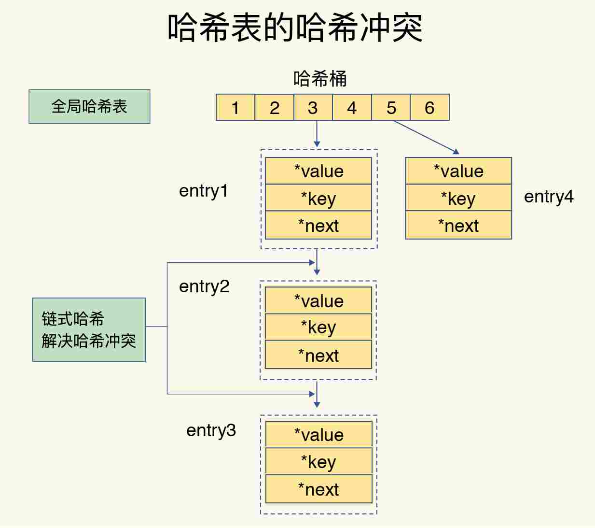
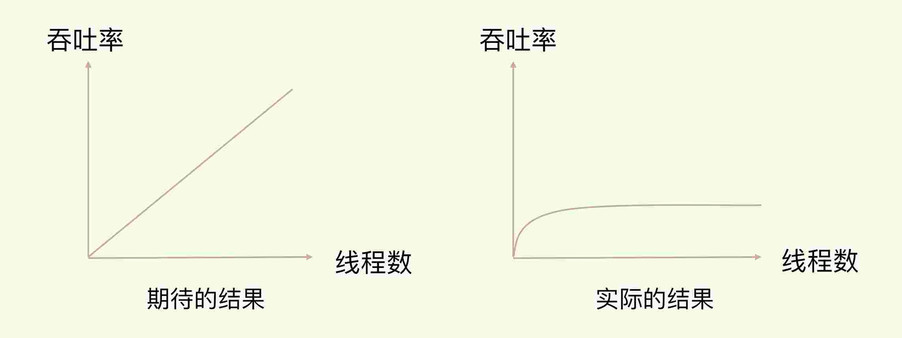
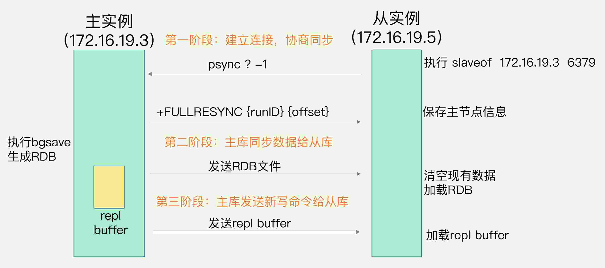

# Redis核心技术与实战

> 作者：蒋德钧，中科院计算所，副研究员

## 开篇词

Redis 的应用非常广泛，如果你是后端工程师，我猜你出去面试，八成都会被问到与它相关的性能问题。为了保证数据的可靠性，Redis 需要在磁盘上读写 AOF 和 RDB，但在高并发场景里，这就会直接带来两个新问题：一个是写 AOF 和 RDB 会造成 Redis 性能抖动，另一个是 Redis 集群数据同步和实例恢复时，读 RDB 比较慢，限制了同步和恢复速度。

> Redis提供两种方式进行持久化，一种是**RDB持久化**（原理是将Reids在内存中的数据库记录定时dump到磁盘上的RDB持久化），另外一种是**AOF持久化**（原理是将Reids的操作日志以追加的方式写入文件）。

<!--有一个可行的解决方案就是使用非易失内存 NVM。它既能保证高速的读写，又能快速持久化数据。-->

对标 Redis，我们团队也研发了高性能键值数据库[HiKV](https://www.usenix.org/conference/atc17/technical-sessions/presentation/xia)等。

### Redis 遇见的“坑”

使用 Redis 遇见的“坑”，总体来说集中在四个方面：

- CPU 使用上的“坑”，例如数据结构的复杂度、跨 CPU 核的访问；
- 内存使用上的“坑”，例如主从同步和 AOF 的内存竞争；
- 存储持久化上的“坑”，例如在 SSD 上做快照的性能抖动；
- 网络通信上的“坑”，例如多实例时的异常网络丢包。

很多技术人都有一个误区，那就是，**只关注零散的技术点，没有建立起一套完整的知识框架，缺乏系统观，但是，系统观其实是至关重要的**。从某种程度上说，在解决问题时，拥有了系统观，就意味着你能有依据、有章法地定位和解决问题。

### Redis 知识全景图

**Redis 知识全景图**都包括什么呢？简单来说，就是“两大维度，三大主线”。


“两大维度”就是指系统维度和应用维度，“三大主线”也就是指高性能、高可靠和高可扩展（可以简称为“三高”）。

首先，从系统维度上说，你需要了解 Redis 的各项关键技术的设计原理，这些能够为你判断和推理问题打下坚实的基础，而且，你还能从中掌握一些优雅的系统设计规范，例如 run-to-complete 模型、epoll 网络模型，这些可以应用到你后续的系统开发实践中。

接下来就要看“三大主线”的魔力了。别看技术点是零碎的，其实你完全可以按照这三大主线，给它们分下类，就像图片中展示的那样，具体如下：

- 高性能主线，包括线程模型、数据结构、持久化、网络框架；
- 高可靠主线，包括主从复制、哨兵机制；
- 高可扩展主线，包括数据分片、负载均衡。

其次，在应用维度上，我建议你按照两种方式学习: “应用场景驱动”和“典型案例驱动”，一个是“面”的梳理，一个是“点”的掌握。

我们知道，缓存和集群是 Redis 的两大广泛的应用场景。在这些场景中，本身就具有一条显式的技术链。比如说，提到缓存场景，你肯定会想到缓存机制、缓存替换、缓存异常等一连串的问题。

不过，并不是所有的东西都适合采用这种方式，比如说 Redis 丰富的数据模型，就导致它有很多零碎的应用场景，很多很杂。而且，还有一些问题隐藏得比较深，只有特定的业务场景下（比如亿级访问压力场景）才会出现，并不是普遍现象，所以，我们也比较难于梳理出结构化的体系。

### Redis 的问题画像图

最后，我还想跟你分享一个非常好用的技巧。我梳理了一下这些年遇到的、看到的 Redis 各大典型问题，同时结合相关的技术点，手绘了一张 Redis 的问题画像图。无论你遇见什么问题，都可以拿出来这张图，这样你就能快速地按照问题来查找对应的 Redis 主线模块了，然后再进一步定位到相应的技术点上。


举个例子，如果你遇到了 Redis 的响应变慢问题，对照着这张图，你就可以发现，这个问题和 Redis 的性能主线相关，而性能主线又和数据结构、异步机制、RDB、AOF 重写相关。找到了影响的因素，解决起来也就很容易了。

### 课程是如何设计的

#### 基础篇：打破技术点之间的壁垒，带你建立网状知识结构。

我会先从构造一个简单的键值数据库入手，带你庖丁解牛。这有点像是建房子，只有顶梁柱确定了，房子有形了，你才能去想“怎么设计更美、更实用”的问题。因此，在“基础篇”，我会具体讲解数据结构、线程模型、持久化等几根“顶梁柱”，让你不仅能抓住重点，还能明白它们在整体框架中的地位和作用，以及它们之间的相互联系。明白了这些，也就打好了基础。

#### 实践篇：场景和案例驱动，取人之长，梳理出一套属于你自己的“武林秘籍”

前面说过，从应用的维度来说，在学习时，我们需要以“场景”和“案例”作为驱动。因此，在“实践篇”，我也会从这两大层面来进行讲解。

在“案例”层面，我会介绍数据结构的合理使用、避免请求阻塞和抖动、避免内存竞争和提升内存使用效率的关键技巧；在“场景”层面，我会重点介绍缓存和集群两大场景。

对于缓存而言，我会重点讲解缓存基本原理及淘汰策略，还有雪崩、穿透、污染等异常情况；对于集群来说，我会围绕集群方案优化、数据一致性、高并发访问等问题，和你聊聊可行的解决方案。

#### 未来篇：具有前瞻性，解锁新特性

Redis 6.0 刚刚推出，增加了万众瞩目的多线程等新特性，因此，我会向你介绍这些新特性，以及当前业界对 Redis 的最新探索，这会让你拥有前瞻性视角，了解 Redis 的发展路线图，为未来的发展提前做好准备。

## 01 | 基本架构：一个键值数据库包含什么

更好的学习方式就是先建立起“**系统观**”。想要深入理解和优化 Redis，就必须要对它的**总体架构**和**关键模块**有一个全局的认知，然后再深入到具体的技术点。

### 构造 SimpleKV

> 简单的键值数据库

#### 可以存哪些数据

对于键值数据库而言，基本的数据模型是 key-value 模型。在 SimpleKV 中，key 是 String 类型，而 value 是基本数据类型，例如 String、整型等。

不同键值数据库支持的 key 类型一般差异不大，而 value 类型则有较大差别。我们在对键值数据库进行选型时，一个*重要的考虑因素是它支持的 value 类型*。例如，Memcached 支持的 value 类型仅为 String 类型，而 **Redis 支持的 value 类型包括了 String、哈希表、列表、集合等**。Redis 能够在实际业务场景中得到广泛的应用，就是得益于支持多样化类型的 value。

#### 可以对数据做什么操作

SimpleKV 是一个简单的键值数据库，因此，基本操作无外乎增删改查。

SimpleKV 需要支持的 3 种基本操作，即 PUT、GET 和 DELETE。

- PUT：新写入或更新一个 key-value 对；
- GET：根据一个 key 读取相应的 value 值；
- DELETE：根据一个 key 删除整个 key-value 对。

需要注意的是，*有些键值数据库的新写 / 更新操作叫 SET*。新写入和更新虽然是用一个操作接口，但在实际执行时，会根据 key 是否存在而执行相应的新写或更新流程。

在实际的业务场景中，我们经常会碰到这种情况：查询一个用户在一段时间内的访问记录。这种操作在键值数据库中属于 *SCAN 操作*，即根据一段 key 的范围返回相应的 value 值。因此，**PUT/GET/DELETE/SCAN 是一个键值数据库的基本操作集合**。

还有例如，在黑白名单应用中，需要判断某个用户是否存在。如果将该用户的 ID 作为 key，那么，可以增加 *EXISTS 操作*接口，用于判断某个 key 是否存在。

#### 键值对保存在内存还是硬盘

保存在内存的好处是读写很快，毕竟内存的访问速度一般都在百 ns 级别。但是，潜在的风险是一旦掉电，所有的数据都会丢失。

保存在硬盘，虽然可以避免数据丢失，但是受限于磁盘的慢速读写（通常在几 ms 级别），键值数据库的整体性能会被拉低。

因此，*如何进行设计选择，我们通常需要考虑键值数据库的主要应用场景*。比如，缓存场景下的数据需要能快速访问但允许丢失，那么，用于此场景的键值数据库通常采用内存保存键值数据。Memcached 和 Redis 都是属于内存键值数据库。对于 Redis 而言，缓存是非常重要的一个应用场景。后面我会重点介绍 Redis 作为缓存使用的关键机制、优势，以及常见的优化方法。

为了和 Redis 保持一致，我们的 *SimpleKV 就采用内存保存键值数据*。

### SimpleKV 的基本组件

一**个键值数据库包括了访问框架、索引模块、操作模块和存储模块四部分**（见下图）。接下来，我们就从这四个部分入手，继续构建我们的 SimpleKV。


#### 采用什么访问模式

访问模式通常有两种：**一种是通过函数库调用的方式供外部应用使用**，比如，上图中的 libsimplekv.so，就是以动态链接库的形式链接到我们自己的程序中，提供键值存储功能；**另一种是通过网络框架以 Socket 通信的形式对外提供键值对操作**，这种形式可以提供广泛的键值存储服务。在上图中，我们可以看到，网络框架中包括 Socket Server 和协议解析。

实际的键值数据库也基本采用上述两种方式，例如，RocksDB 以动态链接库的形式使用，而 Memcached 和 Redis 则是通过网络框架访问。

举个例子，当客户端发送一个如下的命令后，该命令会被封装在网络包中发送给键值数据库：`PUT hello world`。键值数据库网络框架接收到网络包，并按照相应的协议进行解析之后，就可以知道，客户端想写入一个键值对，并开始实际的写入流程。

此时，我们会遇到一个系统设计上的问题，简单来说，就是网络连接的处理、网络请求的解析，以及数据存取的处理，是用一个线程、多个线程，还是多个进程来交互处理呢？该如何进行设计和取舍呢？我们一般把这个问题称为 I/O 模型设计。不同的 I/O 模型对键值数据库的性能和可扩展性会有不同的影响。

举个例子，如果一个线程既要处理网络连接、解析请求，又要完成数据存取，一旦某一步操作发生阻塞，整个线程就会阻塞住，这就降低了系统响应速度。如果我们采用不同线程处理不同操作，那么，某个线程被阻塞时，其他线程还能正常运行。但是，不同线程间如果需要访问共享资源，那又会产生线程竞争，也会影响系统效率，这又该怎么办呢？所以，这的确是个“两难”选择，需要我们进行精心的设计。

#### 如何定位键值对的位置

当 SimpleKV 解析了客户端发来的请求，知道了要进行的键值对操作，此时，SimpleKV 需要查找所要操作的键值对是否存在，这依赖于键值数据库的索引模块。**索引的作用是让键值数据库根据 key 找到相应 value 的存储位置，进而执行操作**。

索引的类型有很多，常见的有*哈希表、B+ 树、字典树*等。*不同的索引结构在性能、空间消耗、并发控制等方面具有不同的特征*。例如，Memcached 和 Redis 采用哈希表作为 key-value 索引，而 RocksDB 则采用跳表作为内存中 key-value 的索引。

一般而言，**内存键值数据库（例如 Redis）采用哈希表作为索引**，很大一部分原因在于，*其键值数据基本都是保存在内存中的，而内存的高性能随机访问特性可以很好地与哈希表 O(1) 的操作复杂度相匹配*。

SimpleKV 的索引根据 key 找到 value 的存储位置即可。但是，和 SimpleKV 不同，对于 Redis 而言，很有意思的一点是，它的 value 支持多种类型，当我们通过索引找到一个 key 所对应的 value 后，仍然需要从 value 的复杂结构（例如集合和列表）中进一步找到我们实际需要的数据，这个操作的效率本身就依赖于它们的实现结构。

Redis 采用一些常见的高效索引结构作为某些 value 类型的底层数据结构，这一技术路线为 Redis 实现高性能访问提供了良好的支撑。

#### 不同操作的具体逻辑是怎样的

SimpleKV 的索引模块负责根据 key 找到相应的 value 的存储位置。对于不同的操作来说，找到存储位置之后，需要进一步执行的操作的具体逻辑会有所差异。SimpleKV 的操作模块就实现了不同操作的具体逻辑：

- 对于 GET/SCAN 操作而言，此时根据 value 的存储位置返回 value 值即可；
- 对于 PUT 一个新的键值对数据而言，SimpleKV 需要为该键值对分配内存空间；
- 对于 DELETE 操作，SimpleKV 需要删除键值对，并释放相应的内存空间，这个过程由分配器完成。

对于 PUT 和 DELETE 两种操作来说，除了新写入和删除键值对，还需要分配和释放内存。这就不得不提 SimpleKV 的存储模块了

#### 如何实现重启后快速提供服务

SimpleKV 采用了常用的**内存分配器 glibc 的 malloc 和 free**，因此，SimpleKV 并不需要特别考虑内存空间的管理问题。但是，键值数据库的键值对通常大小不一，glibc 的分配器在处理随机的大小内存块分配时，表现并不好。一旦保存的键值对数据规模过大，就可能会造成较严重的内存碎片问题。

SimpleKV 虽然依赖于内存保存数据，提供快速访问，但是，我也希望 SimpleKV 重启后能快速重新提供服务，所以，我在 SimpleKV 的存储模块中增加了持久化功能。

不过，鉴于磁盘管理要比内存管理复杂，*SimpleKV 就直接采用了文件形式*，将键值数据通过调用本地文件系统的操作接口保存在磁盘上。此时，SimpleKV 只需要考虑何时将内存中的键值数据保存到文件中，就可以了。

一种方式是，对于每一个键值对，SimpleKV 都对其进行落盘保存，这虽然让 SimpleKV 的数据更加可靠，但是，因为每次都要写盘，SimpleKV 的性能会受到很大影响。

另一种方式是，SimpleKV 只是周期性地把内存中的键值数据保存到文件中，这样可以避免频繁写盘操作的性能影响。但是，一个潜在的代价是 SimpleKV 的数据仍然有丢失的风险。

为了适应不同的业务场景，Redis 为持久化提供了诸多的执行机制和优化改进。


从这张对比图中，我们可以看到，从 SimpleKV 演进到 Redis，有以下几个重要变化：

- Redis 主要通过网络框架进行访问，而不再是动态库了，这也使得 Redis 可以作为一个基础性的网络服务进行访问，扩大了 Redis 的应用范围。
- Redis 数据模型中的 value 类型很丰富，因此也带来了更多的操作接口，例如面向列表的 LPUSH/LPOP，面向集合的 SADD/SREM 等。
- Redis 的持久化模块能支持两种方式：日志（AOF）和快照（RDB），这两种持久化方式具有不同的优劣势，影响到 Redis 的访问性能和可靠性。
- SimpleKV 是个简单的单机键值数据库，但是，Redis 支持高可靠集群和高可扩展集群，因此，Redis 中包含了相应的集群功能支撑模块。

## 02 | 数据结构：快速的Redis有哪些慢操作

Redis 的快，到底是快在哪里呢？实际上，这里有一个重要的表现：它接收到一个键值对操作后，能以微秒级别的速度找到数据，并快速完成操作。

为啥 Redis 能有这么突出的表现呢？一方面，这是因为它是**内存数据库**，所有操作都在内存上完成，内存的访问速度本身就很快。另一方面，这要归功于它的**数据结构**。这是因为，键值对是按一定的数据结构来组织的，操作键值对最终就是对数据结构进行增删改查操作，所以高效的数据结构是 Redis 快速处理数据的基础。这节课，我就来和你聊聊数据结构。

Redis 键值对中值的数据类型， String（字符串）、List（列表）、Hash（哈希）、Set（集合）和 Sorted Set（有序集合）。

简单来说，底层数据结构一共有 6 种，分别是简单动态字符串、双向链表、压缩列表、哈希表、跳表和整数数组。它们和数据类型的对应关系如下图所示：


可以看到，String 类型的底层实现只有一种数据结构，也就是简单动态字符串。而 List、Hash、Set 和 Sorted Set 这四种数据类型，都有两种底层实现结构。通常情况下，我们会把这四种类型称为集合类型，它们的特点是*一个键对应了一个集合的数据*。

### 键和值用什么结构组织

为了实现从键到值的快速访问，**Redis 使用了一个哈希表来保存所有键值对。一个哈希表，其实就是一个数组，数组的每个元素称为一个哈希桶**。所以，我们常说，一个哈希表是由多个哈希桶组成的，每个哈希桶中保存了键值对数据。**哈希桶中的元素保存的并不是值本身，而是指向具体值的指针**。

在下图中，可以看到，哈希桶中的 entry 元素中保存了`*key`和`*value`指针，分别指向了实际的键和值，这样一来，即使值是一个集合，也可以通过`*value`指针被查找到。


因为这个哈希表保存了所有的键值对，所以，我也把它称为**全局哈希表**。哈希表的最大好处很明显，就是让我们可以用 **O(1) 的时间复杂度**来快速查找到键值对——我们只需要计算键的哈希值，就可以知道它所对应的哈希桶位置，然后就可以访问相应的 entry 元素。

这个查找过程主要依赖于哈希计算，和数据量的多少并没有直接关系。也就是说，不管哈希表里有 10 万个键还是 100 万个键，我们只需要一次计算就能找到相应的键。但是，如果你只是了解了哈希表的 O(1) 复杂度和快速查找特性，那么，当你往 Redis 中写入大量数据后，就可能发现操作有时候会突然变慢了。这其实是因为你忽略了一个潜在的风险点，那就是**哈希表的冲突问题和 rehash 可能带来的操作阻塞**。

### 为什么哈希表操作变慢了

当你往哈希表中写入更多数据时，哈希冲突是不可避免的问题。*这里的哈希冲突，也就是指，两个 key 的哈希值和哈希桶计算对应关系时，正好落在了同一个哈希桶中*。

Redis 解决哈希冲突的方式，就是链式哈希。**就是指同一个哈希桶中的多个元素用一个链表来保存，它们之间依次用指针连接**。

如下图所示：entry1、entry2 和 entry3 都需要保存在哈希桶 3 中，导致了哈希冲突。此时，entry1 元素会通过一个`*next`指针指向 entry2，同样，entry2 也会通过`*next`指针指向 entry3。这样一来，即使哈希桶 3 中的元素有 100 个，我们也可以通过 entry 元素中的指针，把它们连起来。这就形成了一个链表，也叫作哈希冲突链。



但是，这里依然存在一个问题，哈希冲突链上的元素只能通过指针逐一查找再操作。如果哈希表里写入的数据越来越多，哈希冲突可能也会越来越多，这就会导致某些哈*希冲突链过长*，进而导致这个链上的*元素查找耗时长，效率降低*。

所以，*Redis 会对哈希表做 rehash 操作*。rehash 也就是增加现有的哈希桶数量，让逐渐增多的 entry 元素能在更多的桶之间分散保存，减少单个桶中的元素数量，从而减少单个桶中的冲突。

为了使 rehash 操作更高效，Redis 默认使用了两个全局哈希表：哈希表 1 和哈希表 2。一开始，当你刚插入数据时，默认使用哈希表 1，此时的哈希表 2 并没有被分配空间。随着数据逐步增多，Redis 开始执行 rehash，这个过程分为三步：

1. 给哈希表 2 分配更大的空间，例如是当前哈希表 1 大小的两倍；
2. 把哈希表 1 中的数据重新映射并拷贝到哈希表 2 中；
3. 释放哈希表 1 的空间。

到此，我们就可以从哈希表 1 切换到哈希表 2，用增大的哈希表 2 保存更多数据，而原来的哈希表 1 留作下一次 rehash 扩容备用。这个过程看似简单，但是第二步涉及大量的数据拷贝，*如果一次性把哈希表 1 中的数据都迁移完，会造成 Redis 线程阻塞，无法服务其他请求*。此时，Redis 就无法快速访问数据了。

为了避免这个问题，Redis 采用了**渐进式 rehash**。

简单来说就是在第二步拷贝数据时，Redis 仍然正常处理客户端请求，每处理一个请求时，从哈希表 1 中的第一个索引位置开始，顺带着将这个索引位置上的所有 entries 拷贝到哈希表 2 中；等处理下一个请求时，再顺带拷贝哈希表 1 中的下一个索引位置的 entries。如下图所示：


这样就巧妙地把一次性大量拷贝的开销，分摊到了多次处理请求的过程中，避免了耗时操作，保证了数据的快速访问。

对于 String 类型来说，找到哈希桶就能直接增删改查了，所以，哈希表的 O(1) 操作复杂度也就是它的复杂度了。但是，对于集合类型来说，即使找到哈希桶了，还要在集合中再进一步操作。

### 集合数据操作效率

集合的操作效率和哪些因素相关呢？

首先，与集合的底层数据结构有关。例如，使用哈希表实现的集合，要比使用链表实现的集合访问效率更高。其次，操作效率和这些操作本身的执行特点有关，比如读写一个元素的操作要比读写所有元素的效率高。

#### 有哪些底层数据结构

集合类型的底层数据结构主要有 5 种：整数数组、双向链表、哈希表、压缩列表和跳表。

哈希表的操作特点我们刚刚已经学过了；整数数组和双向链表也很常见，它们的操作特征都是顺序读写，也就是通过数组下标或者链表的指针逐个元素访问，操作复杂度基本是 O(N)，操作效率比较低；压缩列表和跳表我们平时接触得可能不多，但它们也是 Redis 重要的数据结构。

**压缩列表**实际上类似于一个数组，数组中的每一个元素都对应保存一个数据。和数组不同的是，压缩列表在表头有三个字段 zlbytes、zltail 和 zllen，分别表示列表长度、列表尾的偏移量和列表中的 entry 个数；压缩列表在表尾还有一个 zlend，表示列表结束。


在压缩列表中，如果我们要查找定位第一个元素和最后一个元素，可以通过表头三个字段的长度直接定位，复杂度是 O(1)。而查找其他元素时，就没有这么高效了，只能逐个查找，此时的复杂度就是 O(N) 了。

有序链表只能逐一查找元素，导致操作起来非常缓慢，于是就出现了**跳表**。具体来说，跳表在链表的基础上，增加了多级索引，通过索引位置的几个跳转，实现数据的快速定位，如下图所示：


如果我们要在链表中查找 33 这个元素，只能从头开始遍历链表，查找 6 次，直到找到 33 为止。此时，复杂度是 O(N)，查找效率很低。

为了提高查找速度，我们来增加一级索引：从第一个元素开始，每两个元素选一个出来作为索引。这些索引再通过指针指向原始的链表。例如，从前两个元素中抽取元素 1 作为一级索引，从第三、四个元素中抽取元素 11 作为一级索引。此时，我们只需要 4 次查找就能定位到元素 33 了。

如果我们还想再快，可以再增加二级索引：从一级索引中，再抽取部分元素作为二级索引。例如，从一级索引中抽取 1、27、100 作为二级索引，二级索引指向一级索引。这样，我们只需要 3 次查找，就能定位到元素 33 了。

这个查找过程就是在多级索引上跳来跳去，最后定位到元素。这也正好符合“跳”表的叫法。当数据量很大时，**跳表的查找复杂度就是 O(logN)**。

按照查找的时间复杂度给这些数据结构分类：


### 不同操作的复杂度

集合类型的操作类型很多，有读写单个集合元素的，例如 HGET、HSET，也有操作多个元素的，例如 SADD，还有对整个集合进行遍历操作的，例如 SMEMBERS。这么多操作，它们的复杂度也各不相同。而复杂度的高低又是我们选择集合类型的重要依据。

快速记住集合常见操作的复杂度“四句口诀”：

- 单元素操作是基础；
- 范围操作非常耗时；
- 统计操作通常高效；
- 例外情况只有几个。

**第一，单元素操作，是指每一种集合类型对单个数据实现的增删改查操作**。例如，Hash 类型的 HGET、HSET 和 HDEL，Set 类型的 SADD、SREM、SRANDMEMBER 等。这些操作的复杂度由集合采用的数据结构决定，例如，HGET、HSET 和 HDEL 是对哈希表做操作，所以它们的复杂度都是 O(1)；Set 类型用哈希表作为底层数据结构时，它的 SADD、SREM、SRANDMEMBER 复杂度也是 O(1)。

有个地方你需要注意一下，集合类型支持同时对多个元素进行增删改查，例如 Hash 类型的 HMGET 和 HMSET，Set 类型的 SADD 也支持同时增加多个元素。此时，这些操作的复杂度，就是由单个元素操作复杂度和元素个数决定的。例如，HMSET 增加 M 个元素时，复杂度就从 O(1) 变成 O(M) 了。

**第二，范围操作，是指集合类型中的遍历操作，可以返回集合中的所有数据**，比如 Hash 类型的 HGETALL 和 Set 类型的 SMEMBERS，或者返回一个范围内的部分数据，比如 List 类型的 LRANGE 和 ZSet 类型的 ZRANGE。*这类操作的复杂度一般是 O(N)，比较耗时，我们应该尽量避免*。

Redis 从 2.8 版本开始提供了 SCAN 系列操作（包括 HSCAN，SSCAN 和 ZSCAN），这类操作实现了渐进式遍历，每次只返回有限数量的数据。这样一来，相比于 HGETALL、SMEMBERS 这类操作来说，就避免了一次性返回所有元素而导致的 Redis 阻塞。

**第三，统计操作，是指集合类型对集合中所有元素个数的记录**，例如 LLEN 和 SCARD。这类操作复杂度只有 O(1)，这是因为当集合类型采用压缩列表、双向链表、整数数组这些数据结构时，这些结构中专门记录了元素的个数统计，因此可以高效地完成相关操作。

**第四，例外情况，是指某些数据结构的特殊记录，例如压缩列表和双向链表都会记录表头和表尾的偏移量**。这样一来，对于 List 类型的 LPOP、RPOP、LPUSH、RPUSH 这四个操作来说，它们是在列表的头尾增删元素，这就可以通过偏移量直接定位，所以它们的复杂度也只有 O(1)，可以实现快速操作。

### 小结

Redis 的底层数据结构，全局哈希表结构，支持集合类型实现的双向链表、压缩列表、整数数组、哈希表和跳表这五大底层结构。

Redis 之所以能快速操作键值对，一方面是因为 O(1) 复杂度的哈希表被广泛使用，包括 String、Hash 和 Set，它们的操作复杂度基本由哈希表决定，另一方面，Sorted Set 也采用了 O(logN) 复杂度的跳表。

不过，*集合类型的范围操作*，因为要遍历底层数据结构，复杂度通常是 O(N)。这里，我的建议是：*用其他命令来替代*，例如可以用 SCAN 来代替，避免在 Redis 内部产生费时的全集合遍历操作。

复杂度较高的 List 类型，它的两种底层实现结构：*双向链表和压缩列表的操作复杂度都是 O(N)*。因此，我的建议是：*因地制宜地使用 List 类型*。例如，既然它的 POP/PUSH 效率很高，那么就将它主要用于 FIFO 队列场景，而不是作为一个可以随机读写的集合。

Redis 数据类型丰富，每个类型的操作繁多，我们通常无法一下子记住所有操作的复杂度。所以，最好的办法就是*掌握原理，以不变应万变*。

整数数组和压缩列表在查找时间复杂度方面并没有很大的优势，那为什么 Redis 还会把它们作为底层数据结构呢？

1. 内存利用率，数组和压缩列表都是非常紧凑的数据结构，它比链表占用的内存要更少。Redis是内存数据库，大量数据存到内存中，此时需要做尽可能的优化，提高内存的利用率。
2. 数组对CPU高速缓存支持更友好，所以Redis在设计时，集合数据元素较少情况下，默认采用内存紧凑排列的方式存储，同时利用CPU高速缓存不会降低访问速度。当数据元素超过设定阈值后，避免查询时间复杂度太高，转为哈希和跳表数据结构存储，保证查询效率。

## 03 | 高性能IO模型：为什么单线程Redis能那么快

我们通常说，**Redis 是单线程，主要是指 Redis 的网络 IO 和键值对读写是由一个线程来完成的**，这也是 Redis 对外提供键值存储服务的主要流程。**但 Redis 的其他功能，比如持久化、异步删除、集群数据同步等，其实是由额外的线程执行的**。所以，严格来说，Redis 并不是单线程。

### Redis 为什么用单线程

#### 多线程的开销

使用多线程，可以增加系统吞吐率，或是可以增加系统扩展性。的确，对于一个多线程的系统来说，在有合理的资源分配的情况下，可以增加系统中处理请求操作的资源实体，进而提升系统能够同时处理的请求数，即吞吐率。下面的左图是我们采用多线程时所期待的结果。

但是，请你注意，通常情况下，在我们采用多线程后，如果没有良好的系统设计，实际得到的结果，其实是右图所展示的那样。我们刚开始增加线程数时，系统吞吐率会增加，但是，再进一步增加线程时，系统吞吐率就增长迟缓了，有时甚至还会出现下降的情况。



为什么会出现这种情况呢？一个关键的瓶颈在于，系统中通常会存在被多线程同时访问的共享资源，比如一个共享的数据结构。*当有多个线程要修改这个共享资源时，为了保证共享资源的正确性，就需要有额外的机制进行保证，而这个额外的机制，就会带来额外的开销*。

拿 Redis 来说，在上节课中，我提到过，Redis 有 List 的数据类型，并提供出队（LPOP）和入队（LPUSH）操作。假设 Redis 采用多线程设计，如下图所示，现在有两个线程 A 和 B，线程 A 对一个 List 做 LPUSH 操作，并对队列长度加 1。同时，线程 B 对该 List 执行 LPOP 操作，并对队列长度减 1。为了保证队列长度的正确性，Redis 需要让线程 A 和 B 的 LPUSH 和 LPOP 串行执行，这样一来，Redis 可以无误地记录它们对 List 长度的修改。否则，我们可能就会得到错误的长度结果。这就是**多线程编程模式面临的共享资源的并发访问控制问题**。


**并发访问控制一直是多线程开发中的一个难点问题**，如果没有精细的设计，比如说，只是简单地采用一个粗粒度互斥锁，就会出现不理想的结果：*即使增加了线程，大部分线程也在等待获取访问共享资源的互斥锁，并行变串行，系统吞吐率并没有随着线程的增加而增加*。

而且，*采用多线程开发一般会引入同步原语来保护共享资源的并发访问，这也会降低系统代码的易调试性和可维护性*。为了避免这些问题，Redis 直接采用了单线程模式。

### 单线程 Redis 为什么那么快

一方面，**Redis 的大部分操作在内存上完成，再加上它采用了高效的数据结构**，例如哈希表和跳表，这是它实现高性能的一个重要原因。

另一方面，就是 **Redis 采用了多路复用机制，使其在网络 IO 操作中能并发处理大量的客户端请求，实现高吞吐率**。接下来，我们就重点学习下多路复用机制。

#### 基本 IO 模型与阻塞点

首先，我们要弄明白网络操作的基本 IO 模型和潜在的阻塞点。毕竟，Redis 采用单线程进行 IO，如果线程被阻塞了，就无法进行多路复用了。

以 Get 请求为例，SimpleKV 为了处理一个 Get 请求，需要监听客户端请求（bind/listen），和客户端建立连接（accept），从 socket 中读取请求（recv），解析客户端发送请求（parse），根据请求类型读取键值数据（get），最后给客户端返回结果，即向 socket 中写回数据（send）。

下图显示了这一过程，其中，bind/listen、accept、recv、parse 和 send 属于网络 IO 处理，而 get 属于键值数据操作。既然 Redis 是单线程，那么，最基本的一种实现是在一个线程中依次执行上面说的这些操作。


但是，在这里的**网络 IO 操作中，有潜在的阻塞点，分别是 accept() 和 recv()**。当 Redis 监听到一个客户端有连接请求，但一直未能成功建立起连接时，会阻塞在 accept() 函数这里，导致其他客户端无法和 Redis 建立连接。类似的，当 Redis 通过 recv() 从一个客户端读取数据时，如果数据一直没有到达，Redis 也会一直阻塞在 recv()。

这就导致 Redis 整个线程阻塞，无法处理其他客户端请求，效率很低。不过，幸运的是，socket 网络模型本身支持非阻塞模式。

#### 非阻塞模式

Socket 网络模型的非阻塞模式设置，主要体现在三个关键的函数调用上，如果想要使用 socket 非阻塞模式，就必须要了解这三个函数的调用返回类型和设置模式。

在 socket 模型中，不同操作调用后会返回不同的套接字类型。socket() 方法会返回主动套接字，然后调用 listen() 方法，将主动套接字转化为监听套接字，此时，可以监听来自客户端的连接请求。最后，调用 accept() 方法接收到达的客户端连接，并返回已连接套接字。


针对监听套接字，我们可以设置非阻塞模式：当 Redis 调用 accept() 但一直未有连接请求到达时，Redis 线程可以返回处理其他操作，而不用一直等待。但是，你要注意的是，调用 accept() 时，已经存在监听套接字了。

虽然 Redis 线程可以不用继续等待，但是总得有机制继续在监听套接字上等待后续连接请求，并在有请求时通知 Redis。

类似的，我们也可以针对已连接套接字设置非阻塞模式：Redis 调用 recv() 后，如果已连接套接字上一直没有数据到达，Redis 线程同样可以返回处理其他操作。我们也需要有机制继续监听该已连接套接字，并在有数据达到时通知 Redis。

这样才能保证 Redis 线程，既不会像基本 IO 模型中一直在阻塞点等待，也不会导致 Redis 无法处理实际到达的连接请求或数据。

#### 基于多路复用的高性能 I/O 模型

**Linux 中的 IO 多路复用机制是指一个线程处理多个 IO 流，就是我们经常听到的 select/epoll 机制**。简单来说，在 Redis 只运行单线程的情况下，**该机制允许内核中，同时存在多个监听套接字和已连接套接字**。内核会一直监听这些套接字上的连接请求或数据请求。一旦有请求到达，就会交给 Redis 线程处理，这就实现了一个 Redis 线程处理多个 IO 流的效果。

下图就是基于多路复用的 Redis IO 模型。图中的多个 FD 就是刚才所说的多个套接字。Redis 网络框架调用 epoll 机制，让内核监听这些套接字。此时，Redis 线程不会阻塞在某一个特定的监听或已连接套接字上，也就是说，不会阻塞在某一个特定的客户端请求处理上。正因为此，Redis 可以同时和多个客户端连接并处理请求，从而提升并发性。


为了在请求到达时能通知到 Redis 线程，**select/epoll 提供了基于事件的回调机制**，即针对不同事件的发生，调用相应的处理函数。

回调机制是怎么工作的呢？其实，select/epoll 一旦监测到 FD 上有请求到达时，就会触发相应的事件。

这些事件会被放进一个事件队列，Redis 单线程对该事件队列不断进行处理。这样一来，Redis 无需一直轮询是否有请求实际发生，这就可以避免造成 CPU 资源浪费。同时，Redis 在对事件队列中的事件进行处理时，会调用相应的处理函数，这就实现了基于事件的回调。因为 Redis 一直在对事件队列进行处理，所以能及时响应客户端请求，提升 Redis 的响应性能。

为了方便你理解，我再以连接请求和读数据请求为例，具体解释一下。

这两个请求分别对应 Accept 事件和 Read 事件，Redis 分别对这两个事件注册 accept 和 get 回调函数。当 Linux 内核监听到有连接请求或读数据请求时，就会触发 Accept 事件和 Read 事件，此时，内核就会回调 Redis 相应的 accept 和 get 函数进行处理。

这就像病人去医院瞧病。在医生实际诊断前，每个病人（等同于请求）都需要先分诊、测体温、登记等。如果这些工作都由医生来完成，医生的工作效率就会很低。所以，医院都设置了分诊台，分诊台会一直处理这些诊断前的工作（类似于 Linux 内核监听请求），然后再转交给医生做实际诊断。这样即使一个医生（相当于 Redis 单线程），效率也能提升。

不过，需要注意的是，即使你的应用场景中部署了不同的操作系统，多路复用机制也是适用的。因为这个机制的实现有很多种，既有基于 Linux 系统下的 select 和 epoll 实现，也有基于 FreeBSD 的 kqueue 实现，以及基于 Solaris 的 evport 实现，这样，你可以根据 Redis 实际运行的操作系统，选择相应的多路复用实现。

## 04 | AOF日志：宕机了，Redis如何避免数据丢失

Redis 有一个绝对不能忽略的问题：一旦服务器宕机，内存中的数据将全部丢失。

我们很容易想到的一个解决方案是，从后端数据库恢复这些数据，但这种方式存在两个问题：一是，需要频繁访问数据库，会给数据库带来巨大的压力；二是，这些数据是从慢速数据库中读取出来的，性能肯定比不上从 Redis 中读取，导致使用这些数据的应用程序响应变慢。所以，对 Redis 来说，实现数据的持久化，避免从后端数据库中进行恢复，是至关重要的。

目前，**Redis 的持久化主要有两大机制，即 AOF 日志和 RDB 快照**。

### AOF 日志是如何实现的

说到日志，我们比较熟悉的是数据库的写前日志（Write Ahead Log, WAL），也就是说，在实际写数据前，先把修改的数据记到日志文件中，以便故障时进行恢复。不过，AOF 日志正好相反，它是写后日志，“写后”的意思是 Redis 是先执行命令，把数据写入内存，然后才记录日志，如下图所示：


传统数据库的日志，例如 redo log（重做日志），记录的是修改后的数据，而 AOF 里记录的是 Redis 收到的每一条命令，这些命令是以文本形式保存的。

我们以 Redis 收到“set testkey testvalue”命令后记录的日志为例，看看 AOF 日志的内容。其中，“*3”表示当前命令有三个部分，每部分都是由“`$+数字`”开头，后面紧跟着具体的命令、键或值。这里，“数字”表示这部分中的命令、键或值一共有多少字节。例如，“`$3 set`”表示这部分有 3 个字节，也就是“set”命令。

但是，为了避免额外的检查开销，Redis 在向 AOF 里面记录日志的时候，并不会先去对这些命令进行语法检查。所以，如果先记日志再执行命令的话，日志中就有可能记录了错误的命令，Redis 在使用日志恢复数据时，就可能会出错。

而写后日志这种方式，就是先让系统执行命令，只有命令能执行成功，才会被记录到日志中，否则，系统就会直接向客户端报错。所以，**Redis 使用写后日志这一方式的一大好处是，可以避免出现记录错误命令的情况**。

除此之外，AOF 还有一个好处：**它是在命令执行后才记录日志，所以不会阻塞当前的写操作**。

不过，AOF 也有两个潜在的风险。

首先，*如果刚执行完一个命令，还没有来得及记日志就宕机了，那么这个命令和相应的数据就有丢失的风险*。如果此时 Redis 是用作缓存，还可以从后端数据库重新读入数据进行恢复，但是，如果 Redis 是直接用作数据库的话，此时，因为命令没有记入日志，所以就无法用日志进行恢复了。

其次，AOF 虽然避免了对当前命令的阻塞，但可能会给下一个操作带来阻塞风险。这是因为，AOF 日志也是在主线程中执行的，如果在把日志文件写入磁盘时，磁盘写压力大，就会导致写盘很慢，进而导致后续的操作也无法执行了。

仔细分析的话，你就会发现，*这两个风险都是和 AOF 写回磁盘的时机相关的*。这也就意味着，如果我们能够控制一个写命令执行完后 AOF 日志写回磁盘的时机，这两个风险就解除了。

### 三种写回策略

对于这个问题，AOF 机制给我们提供了三个选择，也就是 AOF 配置项 appendfsync 的三个可选值。

- Always，同步写回：每个写命令执行完，立马同步地将日志写回磁盘；
- Everysec，每秒写回：每个写命令执行完，只是先把日志写到 AOF 文件的内存缓冲区，每隔一秒把缓冲区中的内容写入磁盘；
- No，操作系统控制的写回：每个写命令执行完，只是先把日志写到 AOF 文件的内存缓冲区，由操作系统决定何时将缓冲区内容写回磁盘。

针对避免主线程阻塞和减少数据丢失问题，这三种写回策略都无法做到两全其美。我们来分析下其中的原因。

- “同步写回”可以做到基本不丢数据，但是它在每一个写命令后都有一个慢速的落盘操作，不可避免地会影响主线程性能；
- 虽然“操作系统控制的写回”在写完缓冲区后，就可以继续执行后续的命令，但是落盘的时机已经不在 Redis 手中了，只要 AOF 记录没有写回磁盘，一旦宕机对应的数据就丢失了；
- “每秒写回”采用一秒写回一次的频率，避免了“同步写回”的性能开销，虽然减少了对系统性能的影响，但是如果发生宕机，上一秒内未落盘的命令操作仍然会丢失。所以，这只能算是，在避免影响主线程性能和避免数据丢失两者间取了个折中。

汇总表


总结一下就是：**想要获得高性能，就选择 No 策略；如果想要得到高可靠性保证，就选择 Always 策略；如果允许数据有一点丢失，又希望性能别受太大影响的话，那么就选择 Everysec 策略**。

但是，按照系统的性能需求选定了写回策略，并不是“高枕无忧”了。毕竟，AOF 是以文件的形式在记录接收到的所有写命令。随着接收的写命令越来越多，AOF 文件会越来越大。这也就意味着，我们*一定要小心 AOF 文件过大带来的性能问题*。

这里的“性能问题”，主要在于以下三个方面：

- 文件系统本身对文件大小有限制，无法保存过大的文件；
- 如果文件太大，之后再往里面追加命令记录的话，效率也会变低；
- 如果发生宕机，AOF 中记录的命令要一个个被重新执行，用于故障恢复，如果日志文件太大，整个恢复过程就会非常缓慢，这就会影响到 Redis 的正常使用。

### 日志文件太大了怎么办

简单来说，**AOF 重写机制**就是在重写时，Redis 根据数据库的现状创建一个新的 AOF 文件，也就是说，读取数据库中的所有键值对，然后对每一个键值对用一条命令记录它的写入。比如说，当读取了键值对“testkey”: “testvalue”之后，重写机制会记录 set testkey testvalue 这条命令。这样，当需要恢复时，可以重新执行该命令，实现“testkey”: “testvalue”的写入。

为什么重写机制可以把日志文件变小呢? 实际上，**重写机制具有“多变一”功能**。所谓的“多变一”，也就是说，旧日志文件中的多条命令，在重写后的新日志中变成了一条命令。

AOF 文件是以追加的方式，逐一记录接收到的写命令的。当一个键值对被多条写命令反复修改时，AOF 文件会记录相应的多条命令。但是，在重写的时候，是根据这个键值对当前的最新状态，为它生成对应的写入命令。这样一来，一个键值对在重写日志中只用一条命令就行了，而且，在日志恢复时，只用执行这条命令，就可以直接完成这个键值对的写入了。


当我们对一个列表先后做了 6 次修改操作后，列表的最后状态是[“D”, “C”, “N”]，此时，只用 LPUSH u:list “N”, “C”, "D"这一条命令就能实现该数据的恢复，这就节省了五条命令的空间。对于被修改过成百上千次的键值对来说，重写能节省的空间当然就更大了。

### AOF 重写会阻塞吗

不过，虽然 AOF 重写后，日志文件会缩小，但是，要把整个数据库的最新数据的操作日志都写回磁盘，仍然是一个非常耗时的过程。这时，我们就要继续关注另一个问题了：重写会不会阻塞主线程？

和 AOF 日志由主线程写回不同，**重写过程是由后台线程 bgrewriteaof 来完成的**，这也是为了避免阻塞主线程，导致数据库性能下降。

我把**重写的过程**总结为“**一个拷贝，两处日志**”。

“一个拷贝”就是指，每次执行重写时，主线程 fork 出后台的 bgrewriteaof 子进程。此时，fork 会把主线程的内存拷贝一份给 bgrewriteaof 子进程，这里面就包含了数据库的最新数据。然后，bgrewriteaof 子进程就可以在不影响主线程的情况下，逐一把拷贝的数据写成操作，记入重写日志。

<!--注意，fork子进程时，子进程是会拷贝父进程的页表，即虚实映射关系，而不会拷贝物理内存。子进程复制了父进程页表，也能共享访问父进程的内存数据了，此时，类似于有了父进程的所有内存数据。-->

<!--Huge page对提升TLB命中率比较友好，因为在相同的内存容量下，使用huge page可以减少页表项，TLB就可以缓存更多的页表项，能减少TLB miss的开销。这个机制对于Redis这种喜欢用fork的系统来说，的确不太友好，尤其是在Redis的写入请求比较多的情况下。因为fork后，父进程修改数据采用写时复制，复制的粒度为一个内存页。如果只是修改一个256B的数据，父进程需要读原来的内存页，然后再映射到新的物理地址写入。一读一写会造成读写放大。如果内存页越大（例如2MB的大页），那么读写放大也就越严重，对Redis性能造成影响。Huge page在实际使用Redis时是建议关掉的。-->

“两处日志”。因为主线程未阻塞，仍然可以处理新来的操作。此时，如果有写操作，*第一处日志就是指正在使用的 AOF 日志*，Redis 会把这个操作写到它的缓冲区。这样一来，即使宕机了，这个 AOF 日志的操作仍然是齐全的，可以用于恢复。*第二处日志，就是指新的 AOF 重写日志*。这个操作也会被写到重写日志的缓冲区。这样，重写日志也不会丢失最新的操作。等到拷贝数据的所有操作记录重写完成后，重写日志记录的这些最新操作也会写入新的 AOF 文件，以保证数据库最新状态的记录。此时，我们就可以用新的 AOF 文件替代旧文件了。


### 小结

这节课，介绍了 Redis 用于避免数据丢失的 AOF 方法。这个方法通过逐一记录操作命令，在恢复时再逐一执行命令的方式，保证了数据的可靠性。

这个方法看似“简单”，但也是充分考虑了对 Redis 性能的影响。总结来说，它提供了 AOF 日志的三种写回策略，分别是 Always、Everysec 和 No，这三种策略在可靠性上是从高到低，而在性能上则是从低到高。

此外，为了避免日志文件过大，Redis 还提供了 AOF 重写机制，直接根据数据库里数据的最新状态，生成这些数据的插入命令，作为新日志。这个过程通过后台线程完成，避免了对主线程的阻塞。

其中，三种写回策略体现了系统设计中的一个重要原则 ，即 trade-off，或者称为“取舍”，指的就是在性能和可靠性保证之间做取舍。

落盘时机和重写机制都是在“记日志”这一过程中发挥作用的。

有没有既能避免数据丢失，又能更快地恢复的方法呢？当然有，那就是 RDB 快照了。

## 05 | 内存快照：宕机后，Redis如何实现快速恢复

### 内存快照

所谓内存快照，**就是指内存中的数据在某一个时刻的状态记录**。

对 Redis 来说，把某一时刻的状态以文件的形式写到磁盘上，这就是快照。这样一来，即使宕机，快照文件也不会丢失，数据的可靠性也就得到了保证。这个快照文件就称为 RDB 文件，其中，*RDB 就是 Redis DataBase 的缩写*。

和 AOF 相比，RDB 记录的是某一时刻的数据，并不是操作，所以，在做数据恢复时，我们可以直接把 RDB 文件读入内存，很快地完成恢复。听起来好像很不错，但内存快照也并不是最优选项。

我们还要考虑两个关键问题：

- 对哪些数据做快照？这关系到快照的执行效率问题；
- 做快照时，数据还能被增删改吗？这关系到 Redis 是否被阻塞，能否同时正常处理请求。

### 给哪些内存数据做快照

Redis 的数据都在内存中，为了提供所有数据的可靠性保证，它执行的是全量快照，也就是说，把内存中的所有数据都记录到磁盘中，这就类似于给 100 个人拍合影，把每一个人都拍进照片里。这样做的好处是，一次性记录了所有数据，一个都不少。

当你给一个人拍照时，只用协调一个人就够了，但是，拍 100 人的大合影，却需要协调 100 个人的位置、状态，等等，这当然会更费时费力。同样，给内存的全量数据做快照，把它们全部写入磁盘也会花费很多时间。而且，全量数据越多，RDB 文件就越大，往磁盘上写数据的时间开销就越大。

Redis 提供了两个命令来生成 RDB 文件，分别是 save 和 bgsave。

- save：在主线程中执行，会导致阻塞；
- bgsave：创建一个子进程，专门用于写入 RDB 文件，避免了主线程的阻塞，这也是 Redis RDB 文件生成的默认配置。

### 快照时数据能修改吗

为了快照而暂停写操作，肯定是不能接受的。所以这个时候，Redis 就会借助操作系统提供的写时复制技术（Copy-On-Write, COW），在执行快照的同时，正常处理写操作。

<!--避免阻塞和正常处理写操作并不是一回事-->

简单来说，bgsave 子进程是由主线程 fork 生成的，可以共享主线程的所有内存数据。bgsave 子进程运行后，开始读取主线程的内存数据，并把它们写入 RDB 文件。

此时，如果主线程对这些数据也都是读操作（例如图中的键值对 A），那么，主线程和 bgsave 子进程相互不影响。但是，如果主线程要修改一块数据（例如图中的键值对 C），那么，这块数据就会被复制一份，生成该数据的副本。然后，bgsave 子进程会把这个副本数据写入 RDB 文件，而在这个过程中，主线程仍然可以直接修改原来的数据。


这既保证了快照的完整性，也允许主线程同时对数据进行修改，避免了对正常业务的影响。

**Redis 会使用 bgsave 对当前内存中的所有数据做快照，这个操作是子进程在后台完成的，这就允许主线程同时可以修改数据**。

### 可以每秒做一次快照吗

快照的间隔时间变得很短，即使某一时刻发生宕机了，因为上一时刻快照刚执行，丢失的数据也不会太多。但是，这其中的快照间隔时间就很关键了。

如下图所示，我们先在 T0 时刻做了一次快照，然后又在 T0+t 时刻做了一次快照，在这期间，数据块 5 和 9 被修改了。如果在 t 这段时间内，机器宕机了，那么，只能按照 T0 时刻的快照进行恢复。此时，数据块 5 和 9 的修改值因为没有快照记录，就无法恢复了。


所以，要想尽可能恢复数据，t 值就要尽可能小，t 越小，就越像“连拍”。那么，t 值可以小到什么程度呢，比如说是不是可以每秒做一次快照？毕竟，每次快照都是由 bgsave 子进程在后台执行，也不会阻塞主线程。

这种想法其实是错误的。虽然 bgsave 执行时不阻塞主线程，但是，**如果频繁地执行全量快照，也会带来两方面的开销**。

1. 频繁将全量数据写入磁盘，会给磁盘带来很大压力，多个快照竞争有限的磁盘带宽，前一个快照还没有做完，后一个又开始做了，容易造成恶性循环。
2. bgsave 子进程需要通过 fork 操作从主线程创建出来。虽然，子进程在创建后不会再阻塞主线程，但是，fork 这个创建过程本身会阻塞主线程，而且主线程的内存越大，阻塞时间越长。如果频繁 fork 出 bgsave 子进程，这就会频繁阻塞主线程了。

更好的记录快照的方法是，做**增量快照**，所谓增量快照，就是指，做了一次全量快照后，后续的快照只对修改的数据进行快照记录，这样可以避免每次全量快照的开销。

在第一次做完全量快照后，T1 和 T2 时刻如果再做快照，我们只需要将被修改的数据写入快照文件就行。但是，这么做的前提是，我们需要记住哪些数据被修改了。你可不要小瞧这个“记住”功能，它需要我们使用额外的元数据信息去记录哪些数据被修改了，这会带来额外的空间开销问题。如下图所示：


如果我们对每一个键值对的修改，都做个记录，那么，如果有 1 万个被修改的键值对，我们就需要有 1 万条额外的记录。而且，有的时候，键值对非常小，比如只有 32 字节，而记录它被修改的元数据信息，可能就需要 8 字节，这样的画，为了“记住”修改，引入的额外空间开销比较大。这对于内存资源宝贵的 Redis 来说，有些得不偿失。

你可以发现，虽然跟 AOF 相比，快照的恢复速度快，但是，快照的频率不好把握，如果频率太低，两次快照间一旦宕机，就可能有比较多的数据丢失。如果频率太高，又会产生额外开销，那么，还有什么方法既能利用 RDB 的快速恢复，又能以较小的开销做到尽量少丢数据呢？

Redis 4.0 中提出了一个**混合使用 AOF 日志和内存快照的方法**。简单来说，内存快照以一定的频率执行，在两次快照之间，使用 AOF 日志记录这期间的所有命令操作。

这样一来，快照不用很频繁地执行，这就避免了频繁 fork 对主线程的影响。而且，AOF 日志也只用记录两次快照间的操作，也就是说，不需要记录所有操作了，因此，就不会出现文件过大的情况了，也可以避免重写开销。

如下图所示，T1 和 T2 时刻的修改，用 AOF 日志记录，等到第二次做全量快照时，就可以清空 AOF 日志，因为此时的修改都已经记录到快照中了，恢复时就不再用日志了。


这个方法既能享受到 RDB 文件快速恢复的好处，又能享受到 AOF 只记录操作命令的简单优势，颇有点“鱼和熊掌可以兼得”的感觉。

关于 AOF 和 RDB 的选择问题，三点建议：

- 数据不能丢失时，内存快照和 AOF 的混合使用是一个很好的选择；
- 如果允许分钟级别的数据丢失，可以只使用 RDB；
- 如果只用 AOF，优先使用 everysec 的配置选项，因为它在可靠性和性能之间取了一个平衡。

问题？

我们使用一个 2 核 CPU、4GB 内存、500GB 磁盘的云主机运行 Redis，Redis 数据库的数据量大小差不多是 2GB，我们使用了 RDB 做持久化保证。当时 Redis 的运行负载以修改操作为主，写读比例差不多在 8:2 左右，也就是说，如果有 100 个请求，80 个请求执行的是修改操作。你觉得，在这个场景下，用 RDB 做持久化有什么风险吗？你能帮着一起分析分析吗？

同学回答：

做RDB持久化，产生的风险主要在于 **CPU资源** 和 **内存资源** 这2方面。

内存资源风险：Redis fork子进程做RDB持久化，由于写的比例为80%，那么在持久化过程中，“写实复制”会重新分配整个实例80%的内存副本，大约需要重新分配1.6GB内存空间，这样整个系统的内存使用接近饱和，如果此时父进程又有大量新key写入，很快机器内存就会被吃光，如果机器开启了Swap机制，那么Redis会有一部分数据被换到磁盘上，当Redis访问这部分在磁盘上的数据时，性能会急剧下降，已经达不到高性能的标准（可以理解为武功被废）。如果机器没有开启Swap，会直接触发OOM，父子进程会面临被系统kill掉的风险。

CPU资源风险：虽然子进程在做RDB持久化，但生成RDB快照过程会消耗大量的CPU资源，虽然Redis处理处理请求是单线程的，但Redis Server还有其他线程在后台工作，例如AOF每秒刷盘、异步关闭文件描述符这些操作。由于机器只有2核CPU，这也就意味着父进程占用了超过一半的CPU资源，此时子进程做RDB持久化，可能会产生CPU竞争，导致的结果就是父进程处理请求延迟增大，子进程生成RDB快照的时间也会变长，整个Redis Server性能下降。

另外，可以再延伸一下，老师的问题没有提到Redis进程是否绑定了CPU，如果绑定了CPU，那么子进程会继承父进程的CPU亲和性属性，子进程必然会与父进程争夺同一个CPU资源，整个Redis Server的性能必然会受到影响！所以如果Redis需要开启定时RDB和AOF重写，进程一定不要绑定CPU。

## 06 | 数据同步：主从库如何实现数据一致

我们学习了 AOF 和 RDB，如果 Redis 发生了宕机，它们可以分别通过回放日志和重新读入 RDB 文件的方式恢复数据，从而保证尽量少丢失数据，提升可靠性。

不过，即使用了这两种方法，也依然存在服务不可用的问题。比如说，我们在实际使用时只运行了一个 Redis 实例，那么，如果这个实例宕机了，它在恢复期间，是无法服务新来的数据存取请求的。

那我们总说的 Redis 具有高可靠性，又是什么意思呢？其实，这里有两层含义：**一是数据尽量少丢失，二是服务尽量少中断**。*AOF 和 RDB 保证了前者*，而对于后者，*Redis 的做法就是增加副本冗余量，将一份数据同时保存在多个实例上*。即使有一个实例出现了故障，需要过一段时间才能恢复，其他实例也可以对外提供服务，不会影响业务使用。

**Redis 提供了主从库模式，以保证数据副本的一致，主从库之间采用的是读写分离的方式**。

1. 读操作：主库、从库都可以接收；
2. 写操作：首先到主库执行，然后，主库将写操作同步给从库。


主从库模式一旦采用了读写分离，所有数据的修改只会在主库上进行，不用协调三个实例。主库有了最新的数据后，会同步给从库，这样，主从库的数据就是一致的。

### 主从库间如何进行第一次同步

当我们启动多个 Redis 实例的时候，它们相互之间就可以通过 replicaof（Redis 5.0 之前使用 slaveof）命令形成主库和从库的关系，之后会按照三个阶段完成数据的第一次同步。

例如，现在有实例 1（ip：172.16.19.3）和实例 2（ip：172.16.19.5），我们在实例 2 上执行以下这个命令后，实例 2 就变成了实例 1 的从库，并从实例 1 上复制数据：
```sh
replicaof 172.16.19.3 6379
```

接下来，我们就要学习主从库间数据第一次同步的三个阶段了。你可以先看一下下面这张图，有个整体感知，接下来我再具体介绍。



第一阶段是主从库间建立连接、协商同步的过程，主要是为全量复制做准备。在这一步，**从库和主库建立起连接，并告诉主库即将进行同步，主库确认回复后，主从库间就可以开始同步了**。

具体来说，从库给主库发送 `psync` 命令，表示要进行数据同步，主库根据这个命令的参数来启动复制。`psync` 命令包含了主库的 runID 和复制进度 offset 两个参数。

- runID，是每个 Redis 实例启动时都会自动生成的一个随机 ID，用来唯一标记这个实例。当从库和主库第一次复制时，因为不知道主库的 runID，所以将 runID 设为“？”。
- offset，此时设为 -1，表示第一次复制。

主库收到 `psync` 命令后，会用 `FULLRESYNC` 响应命令带上两个参数：主库 `runID` 和主库目前的复制进度 `offset`，返回给从库。从库收到响应后，会记录下这两个参数。

这里有个地方需要注意，**FULLRESYNC 响应表示第一次复制采用的全量复制，也就是说，主库会把当前所有的数据都复制给从库**。

在第二阶段，**主库将所有数据同步给从库**。**从库收到数据后，在本地完成数据加载**。这个过程依赖于内存快照生成的 RDB 文件。

具体来说，主库执行 bgsave 命令，生成 RDB 文件，接着将文件发给从库。从库接收到 RDB 文件后，会先清空当前数据库，然后加载 RDB 文件。这是因为从库在通过 replicaof 命令开始和主库同步前，可能保存了其他数据。为了避免之前数据的影响，从库需要先把当前数据库清空。

在主库将数据同步给从库的过程中，主库不会被阻塞，仍然可以正常接收请求。否则，Redis 的服务就被中断了。但是，这些请求中的写操作并没有记录到刚刚生成的 RDB 文件中。为了保证主从库的数据一致性，主库会在内存中用专门的 replication buffer，记录 RDB 文件生成后收到的所有写操作。

第三个阶段，**主库会把第二阶段执行过程中新收到的写命令，再发送给从库**。具体的操作是，当主库完成 RDB 文件发送后，就会把此时 replication buffer 中的修改操作发给从库，从库再重新执行这些操作。这样一来，主从库就实现同步了。

### 主从级联模式分担全量复制时的主库压力

通过分析主从库间第一次数据同步的过程，你可以看到，一次全量复制中，对于主库来说，需要完成**两个耗时的操作：生成 RDB 文件和传输 RDB 文件**。

如果从库数量很多，而且都要和主库进行全量复制的话，就会导致主库忙于 fork 子进程生成 RDB 文件，进行数据全量同步。fork 这个操作会阻塞主线程处理正常请求，从而导致主库响应应用程序的请求速度变慢。此外，传输 RDB 文件也会占用主库的网络带宽，同样会给主库的资源使用带来压力。那么，有没有好的解决方法可以分担主库压力呢？

其实是有的，这就是“主 - 从 - 从”模式。我们可以通过“主 - 从 - 从”模式将主库生成 RDB 和传输 RDB 的压力，以级联的方式分散到从库上。

简单来说，我们在部署主从集群的时候，可以手动选择一个从库（比如选择内存资源配置较高的从库），用于级联其他的从库。然后，我们可以再选择一些从库（例如三分之一的从库），在这些从库上执行如下命令，让它们和刚才所选的从库，建立起主从关系。

```sh
replicaof 所选从库的IP 6379
```

这样一来，这些从库就会知道，在进行同步时，不用再和主库进行交互了，只要和级联的从库进行写操作同步就行了，这就可以减轻主库上的压力，如下图所示：


到这里，我们了解了主从库间通过全量复制实现数据同步的过程，以及通过“主 - 从 - 从”模式分担主库压力的方式。那么，一旦主从库完成了全量复制，它们之间就会一直维护一个网络连接，主库会通过这个连接将后续陆续收到的命令操作再同步给从库，这个过程也称为**基于长连接的命令传播**，可以避免频繁建立连接的开销。

听上去好像很简单，但不可忽视的是，这个过程中存在着风险点，最常见的就是网络断连或阻塞。如果网络断连，主从库之间就无法进行命令传播了，从库的数据自然也就没办法和主库保持一致了，客户端就可能从从库读到旧数据。

### 主从库间网络断了怎么办

<!--在 Redis 2.8 之前，如果主从库在命令传播时出现了网络闪断，那么，从库就会和主库重新进行一次全量复制，开销非常大。-->

从 Redis 2.8 开始，网络断了之后，主从库会采用增量复制的方式继续同步。听名字大概就可以猜到它和全量复制的不同：全量复制是同步所有数据，而增量复制只会把主从库网络断连期间主库收到的命令，同步给从库。

增量复制时，主从库之间具体是怎么保持同步的呢？这里的奥妙就在于 `repl_backlog_buffer` 这个缓冲区。我们先来看下它是如何用于增量命令的同步的。

当主从库断连后，主库会把断连期间收到的写操作命令，写入 `replication buffer`，同时也会把这些操作命令也写入 `repl_backlog_buffer` 这个缓冲区。

[^问题]:  断连后 `replication buffer` 不知道是否在存在？

**repl_backlog_buffer 是一个环形缓冲区，主库会记录自己写到的位置，从库则会记录自己已经读到的位置**。

<!--repl_backlog_buffer 是一个环形缓冲区，整个master进程中只会存在一个，所有的slave公用。每个从库会记录自己的slave_repl_offset，每个从库的复制进度也不一定相同。在和主库重连进行恢复时，从库会通过psync命令把自己记录的 slave_repl_offset 发给主库，主库会根据从库各自的复制进度，来决定这个从库可以进行增量复制，还是全量复制。-->

刚开始的时候，主库和从库的写读位置在一起，这算是它们的起始位置。随着主库不断接收新的写操作，它在缓冲区中的写位置会逐步偏离起始位置，我们通常用偏移量来衡量这个偏移距离的大小，*对主库来说，对应的偏移量就是* `master_repl_offset`。主库接收的新写操作越多，这个值就会越大。

同样，从库在复制完写操作命令后，它在缓冲区中的读位置也开始逐步偏移刚才的起始位置，此时，从库已复制的偏移量 `slave_repl_offset` 也在不断增加。正常情况下，这两个偏移量基本相等。


主从库的连接恢复之后，从库首先会给主库发送 psync 命令，并把自己当前的 slave_repl_offset 发给主库，主库会判断自己的 `master_repl_offset` 和 `slave_repl_offset` 之间的差距。

在网络断连阶段，主库可能会收到新的写操作命令，所以，一般来说，`master_repl_offset` 会大于 `slave_repl_offset`。此时，主库只用把 `master_repl_offset` 和 `slave_repl_offset` 之间的命令操作同步给从库就行。

就像刚刚示意图的中间部分，主库和从库之间相差了 `put d e` 和 `put d f` 两个操作，在增量复制时，主库只需要把它们同步给从库，就行了。

回顾下增量复制的流程


有一个地方我要强调一下，因为 `repl_backlog_buffer` 是一个环形缓冲区，所以在缓冲区写满后，主库会继续写入，此时，就会覆盖掉之前写入的操作。**如果从库的读取速度比较慢，就有可能导致从库还未读取的操作被主库新写的操作覆盖了，这会导致主从库间的数据不一致**。

<!--一个从库如果和主库断连时间过长，造成它在主库 repl_backlog_buffer 的 slave_repl_offset 位置上的数据已经被覆盖掉了，此时从库和主库间将进行全量复制。-->

因此，我们要想办法避免这一情况，一般而言，我们可以调整 `repl_backlog_size` 这个参数。这个参数和所需的缓冲空间大小有关。缓冲空间的计算公式是：`缓冲空间大小 = 主库写入命令速度 * 操作大小 - 主从库间网络传输命令速度 * 操作大小`。在实际应用中，考虑到可能存在一些突发的请求压力，我们通常需要把这个缓冲空间扩大一倍，即 `repl_backlog_size = 缓冲空间大小 * 2`，这也就是 repl_backlog_size 的最终值。

举个例子，如果主库每秒写入 2000 个操作，每个操作的大小为 2KB，网络每秒能传输 1000 个操作，那么，有 1000 个操作需要缓冲起来，这就至少需要 2MB 的缓冲空间。否则，新写的命令就会覆盖掉旧操作了。为了应对可能的突发压力，我们最终把 repl_backlog_size 设为 4MB。

这样一来，增量复制时主从库的数据不一致风险就降低了。不过，如果并发请求量非常大，连两倍的缓冲空间都存不下新操作请求的话，此时，主从库数据仍然可能不一致。

针对这种情况，一方面，你可以根据 Redis 所在服务器的内存资源再适当增加 repl_backlog_size 值，比如说设置成缓冲空间大小的 4 倍，另一方面，你可以考虑使用切片集群来分担单个主库的请求压力。


主从全量同步使用RDB而不使用AOF的原因？

同学回答：

1. RDB文件内容是经过压缩的二进制数据（不同数据类型数据做了针对性优化），文件很小。而AOF文件记录的是每一次写操作的命令，写操作越多文件会变得很大，其中还包括很多对同一个key的多次冗余操作。在主从全量数据同步时，传输RDB文件可以尽量降低对主库机器网络带宽的消耗，从库在加载RDB文件时，一是文件小，读取整个文件的速度会很快，二是因为RDB文件存储的都是二进制数据，从库直接按照RDB协议解析还原数据即可，速度会非常快，而AOF需要依次重放每个写命令，这个过程会经历冗长的处理逻辑，恢复速度相比RDB会慢得多，所以使用RDB进行主从全量同步的成本最低。
2. 假设要使用AOF做全量同步，意味着必须打开AOF功能，打开AOF就要选择文件刷盘的策略，选择不当会严重影响Redis性能。而RDB只有在需要定时备份和主从全量同步数据时才会触发生成一次快照。而在很多丢失数据不敏感的业务场景，其实是不需要开启AOF的。


