# Redis核心技术与实战

> 作者：蒋德钧，中科院计算所，副研究员

## 开篇词

Redis 的应用非常广泛，如果你是后端工程师，我猜你出去面试，八成都会被问到与它相关的性能问题。为了保证数据的可靠性，Redis 需要在磁盘上读写 AOF 和 RDB，但在高并发场景里，这就会直接带来两个新问题：一个是写 AOF 和 RDB 会造成 Redis 性能抖动，另一个是 Redis 集群数据同步和实例恢复时，读 RDB 比较慢，限制了同步和恢复速度。

> Redis提供两种方式进行持久化，一种是**RDB持久化**（原理是将Reids在内存中的数据库记录定时dump到磁盘上的RDB持久化），另外一种是**AOF持久化**（原理是将Reids的操作日志以追加的方式写入文件）。

<!--有一个可行的解决方案就是使用非易失内存 NVM。它既能保证高速的读写，又能快速持久化数据。-->

对标 Redis，我们团队也研发了高性能键值数据库[HiKV](https://www.usenix.org/conference/atc17/technical-sessions/presentation/xia)等。

### Redis 遇见的“坑”

使用 Redis 遇见的“坑”，总体来说集中在四个方面：

- CPU 使用上的“坑”，例如数据结构的复杂度、跨 CPU 核的访问；
- 内存使用上的“坑”，例如主从同步和 AOF 的内存竞争；
- 存储持久化上的“坑”，例如在 SSD 上做快照的性能抖动；
- 网络通信上的“坑”，例如多实例时的异常网络丢包。

很多技术人都有一个误区，那就是，**只关注零散的技术点，没有建立起一套完整的知识框架，缺乏系统观，但是，系统观其实是至关重要的**。从某种程度上说，在解决问题时，拥有了系统观，就意味着你能有依据、有章法地定位和解决问题。

### Redis 知识全景图

**Redis 知识全景图**都包括什么呢？简单来说，就是“两大维度，三大主线”。


“两大维度”就是指系统维度和应用维度，“三大主线”也就是指高性能、高可靠和高可扩展（可以简称为“三高”）。

首先，从系统维度上说，你需要了解 Redis 的各项关键技术的设计原理，这些能够为你判断和推理问题打下坚实的基础，而且，你还能从中掌握一些优雅的系统设计规范，例如 run-to-complete 模型、epoll 网络模型，这些可以应用到你后续的系统开发实践中。

接下来就要看“三大主线”的魔力了。别看技术点是零碎的，其实你完全可以按照这三大主线，给它们分下类，就像图片中展示的那样，具体如下：

- 高性能主线，包括线程模型、数据结构、持久化、网络框架；
- 高可靠主线，包括主从复制、哨兵机制；
- 高可扩展主线，包括数据分片、负载均衡。

其次，在应用维度上，我建议你按照两种方式学习: “应用场景驱动”和“典型案例驱动”，一个是“面”的梳理，一个是“点”的掌握。

我们知道，缓存和集群是 Redis 的两大广泛的应用场景。在这些场景中，本身就具有一条显式的技术链。比如说，提到缓存场景，你肯定会想到缓存机制、缓存替换、缓存异常等一连串的问题。

不过，并不是所有的东西都适合采用这种方式，比如说 Redis 丰富的数据模型，就导致它有很多零碎的应用场景，很多很杂。而且，还有一些问题隐藏得比较深，只有特定的业务场景下（比如亿级访问压力场景）才会出现，并不是普遍现象，所以，我们也比较难于梳理出结构化的体系。

### Redis 的问题画像图

最后，我还想跟你分享一个非常好用的技巧。我梳理了一下这些年遇到的、看到的 Redis 各大典型问题，同时结合相关的技术点，手绘了一张 Redis 的问题画像图。无论你遇见什么问题，都可以拿出来这张图，这样你就能快速地按照问题来查找对应的 Redis 主线模块了，然后再进一步定位到相应的技术点上。

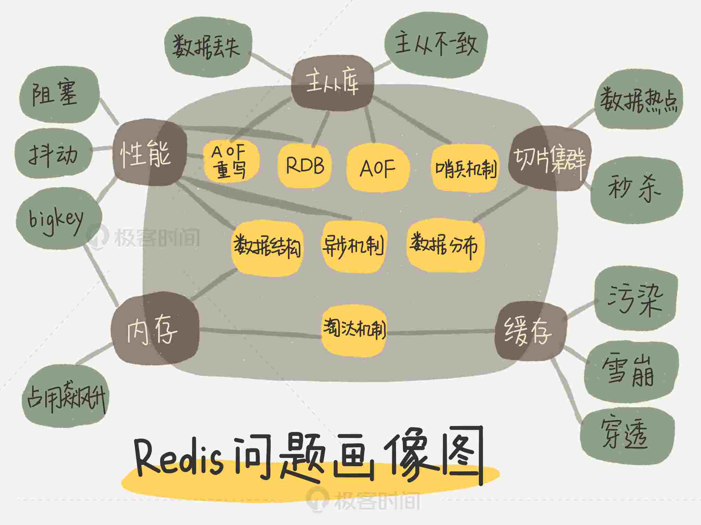

举个例子，如果你遇到了 Redis 的响应变慢问题，对照着这张图，你就可以发现，这个问题和 Redis 的性能主线相关，而性能主线又和数据结构、异步机制、RDB、AOF 重写相关。找到了影响的因素，解决起来也就很容易了。

### 课程是如何设计的

#### 基础篇：打破技术点之间的壁垒，带你建立网状知识结构。

我会先从构造一个简单的键值数据库入手，带你庖丁解牛。这有点像是建房子，只有顶梁柱确定了，房子有形了，你才能去想“怎么设计更美、更实用”的问题。因此，在“基础篇”，我会具体讲解数据结构、线程模型、持久化等几根“顶梁柱”，让你不仅能抓住重点，还能明白它们在整体框架中的地位和作用，以及它们之间的相互联系。明白了这些，也就打好了基础。

#### 实践篇：场景和案例驱动，取人之长，梳理出一套属于你自己的“武林秘籍”

前面说过，从应用的维度来说，在学习时，我们需要以“场景”和“案例”作为驱动。因此，在“实践篇”，我也会从这两大层面来进行讲解。

在“案例”层面，我会介绍数据结构的合理使用、避免请求阻塞和抖动、避免内存竞争和提升内存使用效率的关键技巧；在“场景”层面，我会重点介绍缓存和集群两大场景。

对于缓存而言，我会重点讲解缓存基本原理及淘汰策略，还有雪崩、穿透、污染等异常情况；对于集群来说，我会围绕集群方案优化、数据一致性、高并发访问等问题，和你聊聊可行的解决方案。

#### 未来篇：具有前瞻性，解锁新特性

Redis 6.0 刚刚推出，增加了万众瞩目的多线程等新特性，因此，我会向你介绍这些新特性，以及当前业界对 Redis 的最新探索，这会让你拥有前瞻性视角，了解 Redis 的发展路线图，为未来的发展提前做好准备。

## 01 | 基本架构：一个键值数据库包含什么

更好的学习方式就是先建立起“**系统观**”。想要深入理解和优化 Redis，就必须要对它的**总体架构**和**关键模块**有一个全局的认知，然后再深入到具体的技术点。

### 构造 SimpleKV

> 简单的键值数据库

#### 可以存哪些数据

对于键值数据库而言，基本的数据模型是 key-value 模型。在 SimpleKV 中，key 是 String 类型，而 value 是基本数据类型，例如 String、整型等。

不同键值数据库支持的 key 类型一般差异不大，而 value 类型则有较大差别。我们在对键值数据库进行选型时，一个*重要的考虑因素是它支持的 value 类型*。例如，Memcached 支持的 value 类型仅为 String 类型，而 **Redis 支持的 value 类型包括了 String、哈希表、列表、集合等**。Redis 能够在实际业务场景中得到广泛的应用，就是得益于支持多样化类型的 value。

#### 可以对数据做什么操作

SimpleKV 是一个简单的键值数据库，因此，基本操作无外乎增删改查。

SimpleKV 需要支持的 3 种基本操作，即 PUT、GET 和 DELETE。

- PUT：新写入或更新一个 key-value 对；
- GET：根据一个 key 读取相应的 value 值；
- DELETE：根据一个 key 删除整个 key-value 对。

需要注意的是，*有些键值数据库的新写 / 更新操作叫 SET*。新写入和更新虽然是用一个操作接口，但在实际执行时，会根据 key 是否存在而执行相应的新写或更新流程。

在实际的业务场景中，我们经常会碰到这种情况：查询一个用户在一段时间内的访问记录。这种操作在键值数据库中属于 *SCAN 操作*，即根据一段 key 的范围返回相应的 value 值。因此，**PUT/GET/DELETE/SCAN 是一个键值数据库的基本操作集合**。

还有例如，在黑白名单应用中，需要判断某个用户是否存在。如果将该用户的 ID 作为 key，那么，可以增加 *EXISTS 操作*接口，用于判断某个 key 是否存在。

#### 键值对保存在内存还是硬盘

保存在内存的好处是读写很快，毕竟内存的访问速度一般都在百 ns 级别。但是，潜在的风险是一旦掉电，所有的数据都会丢失。

保存在硬盘，虽然可以避免数据丢失，但是受限于磁盘的慢速读写（通常在几 ms 级别），键值数据库的整体性能会被拉低。

因此，*如何进行设计选择，我们通常需要考虑键值数据库的主要应用场景*。比如，缓存场景下的数据需要能快速访问但允许丢失，那么，用于此场景的键值数据库通常采用内存保存键值数据。Memcached 和 Redis 都是属于内存键值数据库。对于 Redis 而言，缓存是非常重要的一个应用场景。后面我会重点介绍 Redis 作为缓存使用的关键机制、优势，以及常见的优化方法。

为了和 Redis 保持一致，我们的 *SimpleKV 就采用内存保存键值数据*。

### SimpleKV 的基本组件

一**个键值数据库包括了访问框架、索引模块、操作模块和存储模块四部分**（见下图）。接下来，我们就从这四个部分入手，继续构建我们的 SimpleKV。


#### 采用什么访问模式

访问模式通常有两种：**一种是通过函数库调用的方式供外部应用使用**，比如，上图中的 libsimplekv.so，就是以动态链接库的形式链接到我们自己的程序中，提供键值存储功能；**另一种是通过网络框架以 Socket 通信的形式对外提供键值对操作**，这种形式可以提供广泛的键值存储服务。在上图中，我们可以看到，网络框架中包括 Socket Server 和协议解析。

实际的键值数据库也基本采用上述两种方式，例如，RocksDB 以动态链接库的形式使用，而 Memcached 和 Redis 则是通过网络框架访问。

举个例子，当客户端发送一个如下的命令后，该命令会被封装在网络包中发送给键值数据库：`PUT hello world`。键值数据库网络框架接收到网络包，并按照相应的协议进行解析之后，就可以知道，客户端想写入一个键值对，并开始实际的写入流程。

此时，我们会遇到一个系统设计上的问题，简单来说，就是网络连接的处理、网络请求的解析，以及数据存取的处理，是用一个线程、多个线程，还是多个进程来交互处理呢？该如何进行设计和取舍呢？我们一般把这个问题称为 I/O 模型设计。不同的 I/O 模型对键值数据库的性能和可扩展性会有不同的影响。

举个例子，如果一个线程既要处理网络连接、解析请求，又要完成数据存取，一旦某一步操作发生阻塞，整个线程就会阻塞住，这就降低了系统响应速度。如果我们采用不同线程处理不同操作，那么，某个线程被阻塞时，其他线程还能正常运行。但是，不同线程间如果需要访问共享资源，那又会产生线程竞争，也会影响系统效率，这又该怎么办呢？所以，这的确是个“两难”选择，需要我们进行精心的设计。

#### 如何定位键值对的位置

当 SimpleKV 解析了客户端发来的请求，知道了要进行的键值对操作，此时，SimpleKV 需要查找所要操作的键值对是否存在，这依赖于键值数据库的索引模块。**索引的作用是让键值数据库根据 key 找到相应 value 的存储位置，进而执行操作**。

索引的类型有很多，常见的有*哈希表、B+ 树、字典树*等。*不同的索引结构在性能、空间消耗、并发控制等方面具有不同的特征*。例如，Memcached 和 Redis 采用哈希表作为 key-value 索引，而 RocksDB 则采用跳表作为内存中 key-value 的索引。

一般而言，**内存键值数据库（例如 Redis）采用哈希表作为索引**，很大一部分原因在于，*其键值数据基本都是保存在内存中的，而内存的高性能随机访问特性可以很好地与哈希表 O(1) 的操作复杂度相匹配*。

SimpleKV 的索引根据 key 找到 value 的存储位置即可。但是，和 SimpleKV 不同，对于 Redis 而言，很有意思的一点是，它的 value 支持多种类型，当我们通过索引找到一个 key 所对应的 value 后，仍然需要从 value 的复杂结构（例如集合和列表）中进一步找到我们实际需要的数据，这个操作的效率本身就依赖于它们的实现结构。

Redis 采用一些常见的高效索引结构作为某些 value 类型的底层数据结构，这一技术路线为 Redis 实现高性能访问提供了良好的支撑。

#### 不同操作的具体逻辑是怎样的

SimpleKV 的索引模块负责根据 key 找到相应的 value 的存储位置。对于不同的操作来说，找到存储位置之后，需要进一步执行的操作的具体逻辑会有所差异。SimpleKV 的操作模块就实现了不同操作的具体逻辑：

- 对于 GET/SCAN 操作而言，此时根据 value 的存储位置返回 value 值即可；
- 对于 PUT 一个新的键值对数据而言，SimpleKV 需要为该键值对分配内存空间；
- 对于 DELETE 操作，SimpleKV 需要删除键值对，并释放相应的内存空间，这个过程由分配器完成。

对于 PUT 和 DELETE 两种操作来说，除了新写入和删除键值对，还需要分配和释放内存。这就不得不提 SimpleKV 的存储模块了

#### 如何实现重启后快速提供服务

SimpleKV 采用了常用的**内存分配器 glibc 的 malloc 和 free**，因此，SimpleKV 并不需要特别考虑内存空间的管理问题。但是，键值数据库的键值对通常大小不一，glibc 的分配器在处理随机的大小内存块分配时，表现并不好。一旦保存的键值对数据规模过大，就可能会造成较严重的内存碎片问题。

SimpleKV 虽然依赖于内存保存数据，提供快速访问，但是，我也希望 SimpleKV 重启后能快速重新提供服务，所以，我在 SimpleKV 的存储模块中增加了持久化功能。

不过，鉴于磁盘管理要比内存管理复杂，*SimpleKV 就直接采用了文件形式*，将键值数据通过调用本地文件系统的操作接口保存在磁盘上。此时，SimpleKV 只需要考虑何时将内存中的键值数据保存到文件中，就可以了。

一种方式是，对于每一个键值对，SimpleKV 都对其进行落盘保存，这虽然让 SimpleKV 的数据更加可靠，但是，因为每次都要写盘，SimpleKV 的性能会受到很大影响。

另一种方式是，SimpleKV 只是周期性地把内存中的键值数据保存到文件中，这样可以避免频繁写盘操作的性能影响。但是，一个潜在的代价是 SimpleKV 的数据仍然有丢失的风险。

为了适应不同的业务场景，Redis 为持久化提供了诸多的执行机制和优化改进。


从这张对比图中，我们可以看到，从 SimpleKV 演进到 Redis，有以下几个重要变化：

- Redis 主要通过网络框架进行访问，而不再是动态库了，这也使得 Redis 可以作为一个基础性的网络服务进行访问，扩大了 Redis 的应用范围。
- Redis 数据模型中的 value 类型很丰富，因此也带来了更多的操作接口，例如面向列表的 LPUSH/LPOP，面向集合的 SADD/SREM 等。
- Redis 的持久化模块能支持两种方式：日志（AOF）和快照（RDB），这两种持久化方式具有不同的优劣势，影响到 Redis 的访问性能和可靠性。
- SimpleKV 是个简单的单机键值数据库，但是，Redis 支持高可靠集群和高可扩展集群，因此，Redis 中包含了相应的集群功能支撑模块。


### 每课一问

和跟 Redis 相比，SimpleKV 还缺少什么？

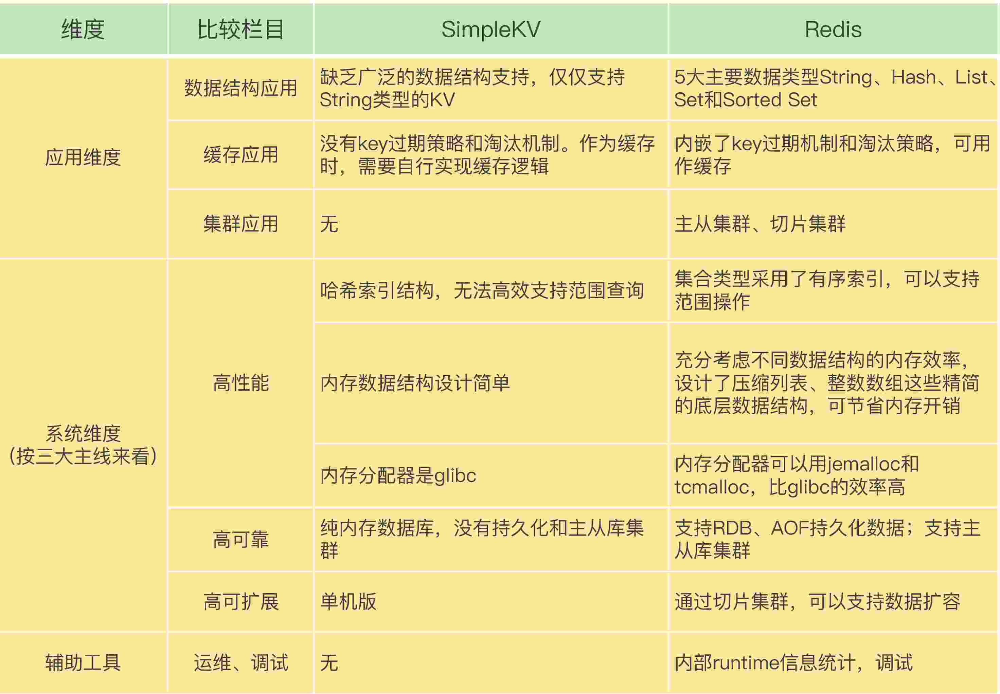

## 02 | 数据结构：快速的Redis有哪些慢操作

Redis 的快，到底是快在哪里呢？实际上，这里有一个重要的表现：它接收到一个键值对操作后，能以微秒级别的速度找到数据，并快速完成操作。

为啥 Redis 能有这么突出的表现呢？一方面，这是因为它是**内存数据库**，所有操作都在内存上完成，内存的访问速度本身就很快。另一方面，这要归功于它的**数据结构**。这是因为，键值对是按一定的数据结构来组织的，操作键值对最终就是对数据结构进行增删改查操作，所以高效的数据结构是 Redis 快速处理数据的基础。这节课，我就来和你聊聊数据结构。

Redis 键值对中值的数据类型， String（字符串）、List（列表）、Hash（哈希）、Set（集合）和 Sorted Set（有序集合）。

简单来说，底层数据结构一共有 6 种，分别是简单动态字符串、双向链表、压缩列表、哈希表、跳表和整数数组。它们和数据类型的对应关系如下图所示：


可以看到，String 类型的底层实现只有一种数据结构，也就是简单动态字符串。而 List、Hash、Set 和 Sorted Set 这四种数据类型，都有两种底层实现结构。通常情况下，我们会把这四种类型称为集合类型，它们的特点是*一个键对应了一个集合的数据*。

### 键和值用什么结构组织

为了实现从键到值的快速访问，**Redis 使用了一个哈希表来保存所有键值对。一个哈希表，其实就是一个数组，数组的每个元素称为一个哈希桶**。所以，我们常说，一个哈希表是由多个哈希桶组成的，每个哈希桶中保存了键值对数据。**哈希桶中的元素保存的并不是值本身，而是指向具体值的指针**。

在下图中，可以看到，哈希桶中的 entry 元素中保存了`*key`和`*value`指针，分别指向了实际的键和值，这样一来，即使值是一个集合，也可以通过`*value`指针被查找到。


因为这个哈希表保存了所有的键值对，所以，我也把它称为**全局哈希表**。哈希表的最大好处很明显，就是让我们可以用 **O(1) 的时间复杂度**来快速查找到键值对——我们只需要计算键的哈希值，就可以知道它所对应的哈希桶位置，然后就可以访问相应的 entry 元素。

这个查找过程主要依赖于哈希计算，和数据量的多少并没有直接关系。也就是说，不管哈希表里有 10 万个键还是 100 万个键，我们只需要一次计算就能找到相应的键。但是，如果你只是了解了哈希表的 O(1) 复杂度和快速查找特性，那么，当你往 Redis 中写入大量数据后，就可能发现操作有时候会突然变慢了。这其实是因为你忽略了一个潜在的风险点，那就是**哈希表的冲突问题和 rehash 可能带来的操作阻塞**。

### 为什么哈希表操作变慢了

当你往哈希表中写入更多数据时，哈希冲突是不可避免的问题。*这里的哈希冲突，也就是指，两个 key 的哈希值和哈希桶计算对应关系时，正好落在了同一个哈希桶中*。

Redis 解决哈希冲突的方式，就是链式哈希。**就是指同一个哈希桶中的多个元素用一个链表来保存，它们之间依次用指针连接**。

如下图所示：entry1、entry2 和 entry3 都需要保存在哈希桶 3 中，导致了哈希冲突。此时，entry1 元素会通过一个`*next`指针指向 entry2，同样，entry2 也会通过`*next`指针指向 entry3。这样一来，即使哈希桶 3 中的元素有 100 个，我们也可以通过 entry 元素中的指针，把它们连起来。这就形成了一个链表，也叫作哈希冲突链。


但是，这里依然存在一个问题，哈希冲突链上的元素只能通过指针逐一查找再操作。如果哈希表里写入的数据越来越多，哈希冲突可能也会越来越多，这就会导致某些哈*希冲突链过长*，进而导致这个链上的*元素查找耗时长，效率降低*。

所以，*Redis 会对哈希表做 rehash 操作*。rehash 也就是增加现有的哈希桶数量，让逐渐增多的 entry 元素能在更多的桶之间分散保存，减少单个桶中的元素数量，从而减少单个桶中的冲突。

为了使 rehash 操作更高效，Redis 默认使用了两个全局哈希表：哈希表 1 和哈希表 2。一开始，当你刚插入数据时，默认使用哈希表 1，此时的哈希表 2 并没有被分配空间。随着数据逐步增多，Redis 开始执行 rehash，这个过程分为三步：

1. 给哈希表 2 分配更大的空间，例如是当前哈希表 1 大小的两倍；
2. 把哈希表 1 中的数据重新映射并拷贝到哈希表 2 中；
3. 释放哈希表 1 的空间。

到此，我们就可以从哈希表 1 切换到哈希表 2，用增大的哈希表 2 保存更多数据，而原来的哈希表 1 留作下一次 rehash 扩容备用。这个过程看似简单，但是第二步涉及大量的数据拷贝，*如果一次性把哈希表 1 中的数据都迁移完，会造成 Redis 线程阻塞，无法服务其他请求*。此时，Redis 就无法快速访问数据了。

为了避免这个问题，Redis 采用了**渐进式 rehash**。

简单来说就是在第二步拷贝数据时，Redis 仍然正常处理客户端请求，每处理一个请求时，从哈希表 1 中的第一个索引位置开始，顺带着将这个索引位置上的所有 entries 拷贝到哈希表 2 中；等处理下一个请求时，再顺带拷贝哈希表 1 中的下一个索引位置的 entries。如下图所示：


这样就巧妙地把一次性大量拷贝的开销，分摊到了多次处理请求的过程中，避免了耗时操作，保证了数据的快速访问。

对于 String 类型来说，找到哈希桶就能直接增删改查了，所以，哈希表的 O(1) 操作复杂度也就是它的复杂度了。但是，对于集合类型来说，即使找到哈希桶了，还要在集合中再进一步操作。

### 集合数据操作效率

集合的操作效率和哪些因素相关呢？

首先，与集合的底层数据结构有关。例如，使用哈希表实现的集合，要比使用链表实现的集合访问效率更高。其次，操作效率和这些操作本身的执行特点有关，比如读写一个元素的操作要比读写所有元素的效率高。

#### 有哪些底层数据结构

集合类型的底层数据结构主要有 5 种：整数数组、双向链表、哈希表、压缩列表和跳表。

哈希表的操作特点我们刚刚已经学过了；整数数组和双向链表也很常见，它们的操作特征都是顺序读写，也就是通过数组下标或者链表的指针逐个元素访问，操作复杂度基本是 O(N)，操作效率比较低；压缩列表和跳表我们平时接触得可能不多，但它们也是 Redis 重要的数据结构。

**压缩列表**实际上类似于一个数组，数组中的每一个元素都对应保存一个数据。和数组不同的是，压缩列表在表头有三个字段 zlbytes、zltail 和 zllen，分别表示列表长度、列表尾的偏移量和列表中的 entry 个数；压缩列表在表尾还有一个 zlend，表示列表结束。


在压缩列表中，如果我们要查找定位第一个元素和最后一个元素，可以通过表头三个字段的长度直接定位，复杂度是 O(1)。而查找其他元素时，就没有这么高效了，只能逐个查找，此时的复杂度就是 O(N) 了。

有序链表只能逐一查找元素，导致操作起来非常缓慢，于是就出现了**跳表**。具体来说，跳表在链表的基础上，增加了多级索引，通过索引位置的几个跳转，实现数据的快速定位，如下图所示：


如果我们要在链表中查找 33 这个元素，只能从头开始遍历链表，查找 6 次，直到找到 33 为止。此时，复杂度是 O(N)，查找效率很低。

为了提高查找速度，我们来增加一级索引：从第一个元素开始，每两个元素选一个出来作为索引。这些索引再通过指针指向原始的链表。例如，从前两个元素中抽取元素 1 作为一级索引，从第三、四个元素中抽取元素 11 作为一级索引。此时，我们只需要 4 次查找就能定位到元素 33 了。

如果我们还想再快，可以再增加二级索引：从一级索引中，再抽取部分元素作为二级索引。例如，从一级索引中抽取 1、27、100 作为二级索引，二级索引指向一级索引。这样，我们只需要 3 次查找，就能定位到元素 33 了。

这个查找过程就是在多级索引上跳来跳去，最后定位到元素。这也正好符合“跳”表的叫法。当数据量很大时，**跳表的查找复杂度就是 O(logN)**。

按照查找的时间复杂度给这些数据结构分类：


### 不同操作的复杂度

集合类型的操作类型很多，有读写单个集合元素的，例如 HGET、HSET，也有操作多个元素的，例如 SADD，还有对整个集合进行遍历操作的，例如 SMEMBERS。这么多操作，它们的复杂度也各不相同。而复杂度的高低又是我们选择集合类型的重要依据。

快速记住集合常见操作的复杂度“四句口诀”：

- 单元素操作是基础；
- 范围操作非常耗时；
- 统计操作通常高效；
- 例外情况只有几个。

**第一，单元素操作，是指每一种集合类型对单个数据实现的增删改查操作**。例如，Hash 类型的 HGET、HSET 和 HDEL，Set 类型的 SADD、SREM、SRANDMEMBER 等。这些操作的复杂度由集合采用的数据结构决定，例如，HGET、HSET 和 HDEL 是对哈希表做操作，所以它们的复杂度都是 O(1)；Set 类型用哈希表作为底层数据结构时，它的 SADD、SREM、SRANDMEMBER 复杂度也是 O(1)。

有个地方你需要注意一下，集合类型支持同时对多个元素进行增删改查，例如 Hash 类型的 HMGET 和 HMSET，Set 类型的 SADD 也支持同时增加多个元素。此时，这些操作的复杂度，就是由单个元素操作复杂度和元素个数决定的。例如，HMSET 增加 M 个元素时，复杂度就从 O(1) 变成 O(M) 了。

**第二，范围操作，是指集合类型中的遍历操作，可以返回集合中的所有数据**，比如 Hash 类型的 HGETALL 和 Set 类型的 SMEMBERS，或者返回一个范围内的部分数据，比如 List 类型的 LRANGE 和 ZSet 类型的 ZRANGE。*这类操作的复杂度一般是 O(N)，比较耗时，我们应该尽量避免*。

Redis 从 2.8 版本开始提供了 SCAN 系列操作（包括 HSCAN，SSCAN 和 ZSCAN），这类操作实现了渐进式遍历，每次只返回有限数量的数据。这样一来，相比于 HGETALL、SMEMBERS 这类操作来说，就避免了一次性返回所有元素而导致的 Redis 阻塞。

**第三，统计操作，是指集合类型对集合中所有元素个数的记录**，例如 LLEN 和 SCARD。这类操作复杂度只有 O(1)，这是因为当集合类型采用压缩列表、双向链表、整数数组这些数据结构时，这些结构中专门记录了元素的个数统计，因此可以高效地完成相关操作。

**第四，例外情况，是指某些数据结构的特殊记录，例如压缩列表和双向链表都会记录表头和表尾的偏移量**。这样一来，对于 List 类型的 LPOP、RPOP、LPUSH、RPUSH 这四个操作来说，它们是在列表的头尾增删元素，这就可以通过偏移量直接定位，所以它们的复杂度也只有 O(1)，可以实现快速操作。

### 小结

Redis 的底层数据结构，全局哈希表结构，支持集合类型实现的双向链表、压缩列表、整数数组、哈希表和跳表这五大底层结构。

Redis 之所以能快速操作键值对，一方面是因为 O(1) 复杂度的哈希表被广泛使用，包括 String、Hash 和 Set，它们的操作复杂度基本由哈希表决定，另一方面，Sorted Set 也采用了 O(logN) 复杂度的跳表。

不过，*集合类型的范围操作*，因为要遍历底层数据结构，复杂度通常是 O(N)。这里，我的建议是：*用其他命令来替代*，例如可以用 SCAN 来代替，避免在 Redis 内部产生费时的全集合遍历操作。

复杂度较高的 List 类型，它的两种底层实现结构：*双向链表和压缩列表的操作复杂度都是 O(N)*。因此，我的建议是：*因地制宜地使用 List 类型*。例如，既然它的 POP/PUSH 效率很高，那么就将它主要用于 FIFO 队列场景，而不是作为一个可以随机读写的集合。

Redis 数据类型丰富，每个类型的操作繁多，我们通常无法一下子记住所有操作的复杂度。所以，最好的办法就是*掌握原理，以不变应万变*。

### 每课一问

整数数组和压缩列表在查找时间复杂度方面并没有很大的优势，那为什么 Redis 还会把它们作为底层数据结构呢？

1. 内存利用率，数组和压缩列表都是非常紧凑的数据结构，**节省内存空间**。因为元素是挨个连续放置的，我们不用再通过额外的指针把元素串接起来，这就避免了额外指针带来的空间开销，**节省空间**。
2. 数组对CPU高速缓存支持更友好，所以Redis在设计时，集合数据元素较少情况下，默认采用内存紧凑排列的方式存储，同时利用CPU高速缓存不会降低访问速度。当数据元素超过设定阈值后，避免查询时间复杂度太高，转为哈希和跳表数据结构存储，保证查询效率。


## 03 | 高性能IO模型：为什么单线程Redis能那么快

我们通常说，**Redis 是单线程，主要是指 Redis 的网络 IO 和键值对读写是由一个线程来完成的**，这也是 Redis 对外提供键值存储服务的主要流程。**但 Redis 的其他功能，比如持久化、异步删除、集群数据同步等，其实是由额外的线程执行的**。所以，严格来说，Redis 并不是单线程。

### Redis 为什么用单线程

#### 多线程的开销

使用多线程，可以增加系统吞吐率，或是可以增加系统扩展性。的确，对于一个多线程的系统来说，在有合理的资源分配的情况下，可以增加系统中处理请求操作的资源实体，进而提升系统能够同时处理的请求数，即吞吐率。下面的左图是我们采用多线程时所期待的结果。

但是，请你注意，通常情况下，在我们采用多线程后，如果没有良好的系统设计，实际得到的结果，其实是右图所展示的那样。我们刚开始增加线程数时，系统吞吐率会增加，但是，再进一步增加线程时，系统吞吐率就增长迟缓了，有时甚至还会出现下降的情况。


为什么会出现这种情况呢？一个关键的瓶颈在于，系统中通常会存在被多线程同时访问的共享资源，比如一个共享的数据结构。*当有多个线程要修改这个共享资源时，为了保证共享资源的正确性，就需要有额外的机制进行保证，而这个额外的机制，就会带来额外的开销*。

拿 Redis 来说，在上节课中，我提到过，Redis 有 List 的数据类型，并提供出队（LPOP）和入队（LPUSH）操作。假设 Redis 采用多线程设计，如下图所示，现在有两个线程 A 和 B，线程 A 对一个 List 做 LPUSH 操作，并对队列长度加 1。同时，线程 B 对该 List 执行 LPOP 操作，并对队列长度减 1。为了保证队列长度的正确性，Redis 需要让线程 A 和 B 的 LPUSH 和 LPOP 串行执行，这样一来，Redis 可以无误地记录它们对 List 长度的修改。否则，我们可能就会得到错误的长度结果。这就是**多线程编程模式面临的共享资源的并发访问控制问题**。


**并发访问控制一直是多线程开发中的一个难点问题**，如果没有精细的设计，比如说，只是简单地采用一个粗粒度互斥锁，就会出现不理想的结果：*即使增加了线程，大部分线程也在等待获取访问共享资源的互斥锁，并行变串行，系统吞吐率并没有随着线程的增加而增加*。

而且，*采用多线程开发一般会引入同步原语来保护共享资源的并发访问，这也会降低系统代码的易调试性和可维护性*。为了避免这些问题，Redis 直接采用了单线程模式。

### 单线程 Redis 为什么那么快

一方面，**Redis 的大部分操作在内存上完成，再加上它采用了高效的数据结构**，例如哈希表和跳表，这是它实现高性能的一个重要原因。

另一方面，就是 **Redis 采用了多路复用机制，使其在网络 IO 操作中能并发处理大量的客户端请求，实现高吞吐率**。接下来，我们就重点学习下多路复用机制。

#### 基本 IO 模型与阻塞点

首先，我们要弄明白网络操作的基本 IO 模型和潜在的阻塞点。毕竟，Redis 采用单线程进行 IO，如果线程被阻塞了，就无法进行多路复用了。

以 Get 请求为例，SimpleKV 为了处理一个 Get 请求，需要监听客户端请求（bind/listen），和客户端建立连接（accept），从 socket 中读取请求（recv），解析客户端发送请求（parse），根据请求类型读取键值数据（get），最后给客户端返回结果，即向 socket 中写回数据（send）。

下图显示了这一过程，其中，bind/listen、accept、recv、parse 和 send 属于网络 IO 处理，而 get 属于键值数据操作。既然 Redis 是单线程，那么，最基本的一种实现是在一个线程中依次执行上面说的这些操作。

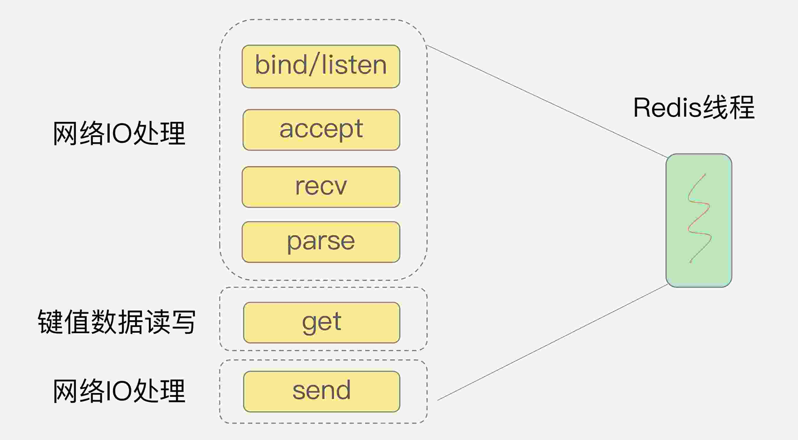

但是，在这里的**网络 IO 操作中，有潜在的阻塞点，分别是 accept() 和 recv()**。当 Redis 监听到一个客户端有连接请求，但一直未能成功建立起连接时，会阻塞在 accept() 函数这里，导致其他客户端无法和 Redis 建立连接。类似的，当 Redis 通过 recv() 从一个客户端读取数据时，如果数据一直没有到达，Redis 也会一直阻塞在 recv()。

这就导致 Redis 整个线程阻塞，无法处理其他客户端请求，效率很低。不过，幸运的是，socket 网络模型本身支持非阻塞模式。

#### 非阻塞模式

Socket 网络模型的非阻塞模式设置，主要体现在三个关键的函数调用上，如果想要使用 socket 非阻塞模式，就必须要了解这三个函数的调用返回类型和设置模式。

在 socket 模型中，不同操作调用后会返回不同的套接字类型。socket() 方法会返回主动套接字，然后调用 listen() 方法，将主动套接字转化为监听套接字，此时，可以监听来自客户端的连接请求。最后，调用 accept() 方法接收到达的客户端连接，并返回已连接套接字。

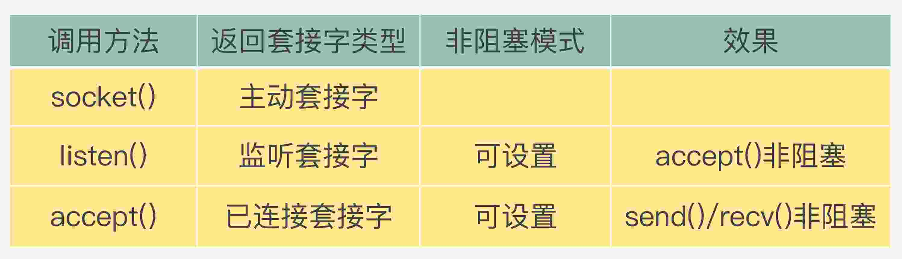

针对监听套接字，我们可以设置非阻塞模式：当 Redis 调用 accept() 但一直未有连接请求到达时，Redis 线程可以返回处理其他操作，而不用一直等待。但是，你要注意的是，调用 accept() 时，已经存在监听套接字了。

虽然 Redis 线程可以不用继续等待，但是总得有机制继续在监听套接字上等待后续连接请求，并在有请求时通知 Redis。

类似的，我们也可以针对已连接套接字设置非阻塞模式：Redis 调用 recv() 后，如果已连接套接字上一直没有数据到达，Redis 线程同样可以返回处理其他操作。我们也需要有机制继续监听该已连接套接字，并在有数据达到时通知 Redis。

这样才能保证 Redis 线程，既不会像基本 IO 模型中一直在阻塞点等待，也不会导致 Redis 无法处理实际到达的连接请求或数据。

#### 基于多路复用的高性能 I/O 模型

**Linux 中的 IO 多路复用机制是指一个线程处理多个 IO 流，就是我们经常听到的 select/epoll 机制**。简单来说，在 Redis 只运行单线程的情况下，**该机制允许内核中，同时存在多个监听套接字和已连接套接字**。内核会一直监听这些套接字上的连接请求或数据请求。一旦有请求到达，就会交给 Redis 线程处理，这就实现了一个 Redis 线程处理多个 IO 流的效果。

下图就是基于多路复用的 Redis IO 模型。图中的多个 FD 就是刚才所说的多个套接字。Redis 网络框架调用 epoll 机制，让内核监听这些套接字。此时，Redis 线程不会阻塞在某一个特定的监听或已连接套接字上，也就是说，不会阻塞在某一个特定的客户端请求处理上。正因为此，Redis 可以同时和多个客户端连接并处理请求，从而提升并发性。


为了在请求到达时能通知到 Redis 线程，**select/epoll 提供了基于事件的回调机制**，即针对不同事件的发生，调用相应的处理函数。

回调机制是怎么工作的呢？其实，select/epoll 一旦监测到 FD 上有请求到达时，就会触发相应的事件。

这些事件会被放进一个事件队列，Redis 单线程对该事件队列不断进行处理。这样一来，Redis 无需一直轮询是否有请求实际发生，这就可以避免造成 CPU 资源浪费。同时，Redis 在对事件队列中的事件进行处理时，会调用相应的处理函数，这就实现了基于事件的回调。因为 Redis 一直在对事件队列进行处理，所以能及时响应客户端请求，提升 Redis 的响应性能。

为了方便你理解，我再以连接请求和读数据请求为例，具体解释一下。

这两个请求分别对应 Accept 事件和 Read 事件，Redis 分别对这两个事件注册 accept 和 get 回调函数。当 Linux 内核监听到有连接请求或读数据请求时，就会触发 Accept 事件和 Read 事件，此时，内核就会回调 Redis 相应的 accept 和 get 函数进行处理。

这就像病人去医院瞧病。在医生实际诊断前，每个病人（等同于请求）都需要先分诊、测体温、登记等。如果这些工作都由医生来完成，医生的工作效率就会很低。所以，医院都设置了分诊台，分诊台会一直处理这些诊断前的工作（类似于 Linux 内核监听请求），然后再转交给医生做实际诊断。这样即使一个医生（相当于 Redis 单线程），效率也能提升。

不过，需要注意的是，即使你的应用场景中部署了不同的操作系统，多路复用机制也是适用的。因为这个机制的实现有很多种，既有基于 Linux 系统下的 select 和 epoll 实现，也有基于 FreeBSD 的 kqueue 实现，以及基于 Solaris 的 evport 实现，这样，你可以根据 Redis 实际运行的操作系统，选择相应的多路复用实现。

## 04 | AOF日志：宕机了，Redis如何避免数据丢失

Redis 有一个绝对不能忽略的问题：一旦服务器宕机，内存中的数据将全部丢失。

我们很容易想到的一个解决方案是，从后端数据库恢复这些数据，但这种方式存在两个问题：一是，需要频繁访问数据库，会给数据库带来巨大的压力；二是，这些数据是从慢速数据库中读取出来的，性能肯定比不上从 Redis 中读取，导致使用这些数据的应用程序响应变慢。所以，对 Redis 来说，实现数据的持久化，避免从后端数据库中进行恢复，是至关重要的。

目前，**Redis 的持久化主要有两大机制，即 AOF 日志和 RDB 快照**。

### AOF 日志是如何实现的

说到日志，我们比较熟悉的是数据库的写前日志（Write Ahead Log, WAL），也就是说，在实际写数据前，先把修改的数据记到日志文件中，以便故障时进行恢复。不过，AOF 日志正好相反，它是写后日志，“写后”的意思是 Redis 是先执行命令，把数据写入内存，然后才记录日志，如下图所示：


传统数据库的日志，例如 redo log（重做日志），记录的是修改后的数据，而 AOF 里记录的是 Redis 收到的每一条命令，这些命令是以文本形式保存的。

我们以 Redis 收到“set testkey testvalue”命令后记录的日志为例，看看 AOF 日志的内容。其中，“*3”表示当前命令有三个部分，每部分都是由“`$+数字`”开头，后面紧跟着具体的命令、键或值。这里，“数字”表示这部分中的命令、键或值一共有多少字节。例如，“`$3 set`”表示这部分有 3 个字节，也就是“set”命令。

但是，为了避免额外的检查开销，Redis 在向 AOF 里面记录日志的时候，并不会先去对这些命令进行语法检查。所以，如果先记日志再执行命令的话，日志中就有可能记录了错误的命令，Redis 在使用日志恢复数据时，就可能会出错。

而写后日志这种方式，就是先让系统执行命令，只有命令能执行成功，才会被记录到日志中，否则，系统就会直接向客户端报错。所以，**Redis 使用写后日志这一方式的一大好处是，可以避免出现记录错误命令的情况**。

除此之外，AOF 还有一个好处：**它是在命令执行后才记录日志，所以不会阻塞当前的写操作**。

不过，AOF 也有两个潜在的风险。

首先，*如果刚执行完一个命令，还没有来得及记日志就宕机了，那么这个命令和相应的数据就有丢失的风险*。如果此时 Redis 是用作缓存，还可以从后端数据库重新读入数据进行恢复，但是，如果 Redis 是直接用作数据库的话，此时，因为命令没有记入日志，所以就无法用日志进行恢复了。

其次，AOF 虽然避免了对当前命令的阻塞，但可能会给下一个操作带来阻塞风险。这是因为，AOF 日志也是在主线程中执行的，如果在把日志文件写入磁盘时，磁盘写压力大，就会导致写盘很慢，进而导致后续的操作也无法执行了。

仔细分析的话，你就会发现，*这两个风险都是和 AOF 写回磁盘的时机相关的*。这也就意味着，如果我们能够控制一个写命令执行完后 AOF 日志写回磁盘的时机，这两个风险就解除了。

### 三种写回策略

对于这个问题，AOF 机制给我们提供了三个选择，也就是 AOF 配置项 appendfsync 的三个可选值。

- Always，同步写回：每个写命令执行完，立马同步地将日志写回磁盘；
- Everysec，每秒写回：每个写命令执行完，只是先把日志写到 AOF 文件的内存缓冲区，每隔一秒把缓冲区中的内容写入磁盘；
- No，操作系统控制的写回：每个写命令执行完，只是先把日志写到 AOF 文件的内存缓冲区，由操作系统决定何时将缓冲区内容写回磁盘。

针对避免主线程阻塞和减少数据丢失问题，这三种写回策略都无法做到两全其美。我们来分析下其中的原因。

- “同步写回”可以做到基本不丢数据，但是它在每一个写命令后都有一个慢速的落盘操作，不可避免地会影响主线程性能；
- 虽然“操作系统控制的写回”在写完缓冲区后，就可以继续执行后续的命令，但是落盘的时机已经不在 Redis 手中了，只要 AOF 记录没有写回磁盘，一旦宕机对应的数据就丢失了；
- “每秒写回”采用一秒写回一次的频率，避免了“同步写回”的性能开销，虽然减少了对系统性能的影响，但是如果发生宕机，上一秒内未落盘的命令操作仍然会丢失。所以，这只能算是，在避免影响主线程性能和避免数据丢失两者间取了个折中。

汇总表


总结一下就是：**想要获得高性能，就选择 No 策略；如果想要得到高可靠性保证，就选择 Always 策略；如果允许数据有一点丢失，又希望性能别受太大影响的话，那么就选择 Everysec 策略**。

但是，按照系统的性能需求选定了写回策略，并不是“高枕无忧”了。毕竟，AOF 是以文件的形式在记录接收到的所有写命令。随着接收的写命令越来越多，AOF 文件会越来越大。这也就意味着，我们*一定要小心 AOF 文件过大带来的性能问题*。

这里的“性能问题”，主要在于以下三个方面：

- 文件系统本身对文件大小有限制，无法保存过大的文件；
- 如果文件太大，之后再往里面追加命令记录的话，效率也会变低；
- 如果发生宕机，AOF 中记录的命令要一个个被重新执行，用于故障恢复，如果日志文件太大，整个恢复过程就会非常缓慢，这就会影响到 Redis 的正常使用。

### 日志文件太大了怎么办

简单来说，**AOF 重写机制**就是在重写时，Redis 根据数据库的现状创建一个新的 AOF 文件，也就是说，读取数据库中的所有键值对，然后对每一个键值对用一条命令记录它的写入。比如说，当读取了键值对“testkey”: “testvalue”之后，重写机制会记录 set testkey testvalue 这条命令。这样，当需要恢复时，可以重新执行该命令，实现“testkey”: “testvalue”的写入。

为什么重写机制可以把日志文件变小呢? 实际上，**重写机制具有“多变一”功能**。所谓的“多变一”，也就是说，旧日志文件中的多条命令，在重写后的新日志中变成了一条命令。

AOF 文件是以追加的方式，逐一记录接收到的写命令的。当一个键值对被多条写命令反复修改时，AOF 文件会记录相应的多条命令。但是，在重写的时候，是根据这个键值对当前的最新状态，为它生成对应的写入命令。这样一来，一个键值对在重写日志中只用一条命令就行了，而且，在日志恢复时，只用执行这条命令，就可以直接完成这个键值对的写入了。


当我们对一个列表先后做了 6 次修改操作后，列表的最后状态是[“D”, “C”, “N”]，此时，只用 LPUSH u:list “N”, “C”, "D"这一条命令就能实现该数据的恢复，这就节省了五条命令的空间。对于被修改过成百上千次的键值对来说，重写能节省的空间当然就更大了。

### AOF 重写会阻塞吗

不过，虽然 AOF 重写后，日志文件会缩小，但是，要把整个数据库的最新数据的操作日志都写回磁盘，仍然是一个非常耗时的过程。这时，我们就要继续关注另一个问题了：重写会不会阻塞主线程？

和 AOF 日志由主线程写回不同，**重写过程是由后台线程 bgrewriteaof 来完成的**，这也是为了避免阻塞主线程，导致数据库性能下降。

我把**重写的过程**总结为“**一个拷贝，两处日志**”。

“一个拷贝”就是指，每次执行重写时，主线程 fork 出后台的 bgrewriteaof 子进程。此时，fork 会把主线程的内存拷贝一份给 bgrewriteaof 子进程，这里面就包含了数据库的最新数据。然后，bgrewriteaof 子进程就可以在不影响主线程的情况下，逐一把拷贝的数据写成操作，记入重写日志。

<!--注意，fork子进程时，子进程是会拷贝父进程的页表，即虚实映射关系，而不会拷贝物理内存。子进程复制了父进程页表，也能共享访问父进程的内存数据了，此时，类似于有了父进程的所有内存数据。-->

<!--Huge page对提升TLB命中率比较友好，因为在相同的内存容量下，使用huge page可以减少页表项，TLB就可以缓存更多的页表项，能减少TLB miss的开销。这个机制对于Redis这种喜欢用fork的系统来说，的确不太友好，尤其是在Redis的写入请求比较多的情况下。因为fork后，父进程修改数据采用写时复制，复制的粒度为一个内存页。如果只是修改一个256B的数据，父进程需要读原来的内存页，然后再映射到新的物理地址写入。一读一写会造成读写放大。如果内存页越大（例如2MB的大页），那么读写放大也就越严重，对Redis性能造成影响。Huge page在实际使用Redis时是建议关掉的。-->

“两处日志”。因为主线程未阻塞，仍然可以处理新来的操作。此时，如果有写操作，*第一处日志就是指正在使用的 AOF 日志*，Redis 会把这个操作写到它的缓冲区。这样一来，即使宕机了，这个 AOF 日志的操作仍然是齐全的，可以用于恢复。*第二处日志，就是指新的 AOF 重写日志*。这个操作也会被写到重写日志的缓冲区。这样，重写日志也不会丢失最新的操作。等到拷贝数据的所有操作记录重写完成后，重写日志记录的这些最新操作也会写入新的 AOF 文件，以保证数据库最新状态的记录。此时，我们就可以用新的 AOF 文件替代旧文件了。


### 小结

这节课，介绍了 Redis 用于避免数据丢失的 AOF 方法。这个方法通过逐一记录操作命令，在恢复时再逐一执行命令的方式，保证了数据的可靠性。

这个方法看似“简单”，但也是充分考虑了对 Redis 性能的影响。总结来说，它提供了 AOF 日志的三种写回策略，分别是 Always、Everysec 和 No，这三种策略在可靠性上是从高到低，而在性能上则是从低到高。

此外，为了避免日志文件过大，Redis 还提供了 AOF 重写机制，直接根据数据库里数据的最新状态，生成这些数据的插入命令，作为新日志。这个过程通过后台线程完成，避免了对主线程的阻塞。

其中，三种写回策略体现了系统设计中的一个重要原则 ，即 trade-off，或者称为“取舍”，指的就是在性能和可靠性保证之间做取舍。

落盘时机和重写机制都是在“记日志”这一过程中发挥作用的。

有没有既能避免数据丢失，又能更快地恢复的方法呢？当然有，那就是 RDB 快照了。

### 每课一问

1. AOF 重写过程中有没有其他潜在的阻塞风险？

    - Redis 主线程 fork 创建 bgrewriteaof 子进程时，内核需要创建用于管理子进程的相关数据结构，这些数据结构在操作系统中通常叫作进程控制块（Process Control Block，简称为 PCB）。内核要把主线程的 PCB 内容拷贝给子进程。这个创建和拷贝过程由内核执行，是会阻塞主线程的。而且，在拷贝过程中，子进程要拷贝父进程的页表，这个过程的耗时和 Redis 实例的内存大小有关。如果 Redis 实例内存大，页表就会大，fork 执行时间就会长，这就会给主线程带来阻塞风险。
    - bgrewriteaof 子进程会和主线程共享内存。当主线程收到新写或修改的操作时，主线程会申请新的内存空间，用来保存新写或修改的数据，如果操作的是 bigkey，也就是数据量大的集合类型数据，那么，主线程会因为申请大空间而面临阻塞风险。因为操作系统在分配内存空间时，有查找和锁的开销，这就会导致阻塞。

2. AOF 重写为什么不共享使用 AOF 本身的日志？

    如果都用 AOF 日志的话，主线程要写，bgrewriteaof 子进程也要写，这两者会竞争文件系统的锁，这就会对 Redis 主线程的性能造成影响。


## 05 | 内存快照：宕机后，Redis如何实现快速恢复

### 内存快照

所谓内存快照，**就是指内存中的数据在某一个时刻的状态记录**。

对 Redis 来说，把某一时刻的状态以文件的形式写到磁盘上，这就是快照。这样一来，即使宕机，快照文件也不会丢失，数据的可靠性也就得到了保证。这个快照文件就称为 RDB 文件，其中，*RDB 就是 Redis DataBase 的缩写*。

和 AOF 相比，RDB 记录的是某一时刻的数据，并不是操作，所以，在做数据恢复时，我们可以直接把 RDB 文件读入内存，很快地完成恢复。听起来好像很不错，但内存快照也并不是最优选项。

我们还要考虑两个关键问题：

- 对哪些数据做快照？这关系到快照的执行效率问题；
- 做快照时，数据还能被增删改吗？这关系到 Redis 是否被阻塞，能否同时正常处理请求。

### 给哪些内存数据做快照

Redis 的数据都在内存中，为了提供所有数据的可靠性保证，它执行的是全量快照，也就是说，把内存中的所有数据都记录到磁盘中，这就类似于给 100 个人拍合影，把每一个人都拍进照片里。这样做的好处是，一次性记录了所有数据，一个都不少。

当你给一个人拍照时，只用协调一个人就够了，但是，拍 100 人的大合影，却需要协调 100 个人的位置、状态，等等，这当然会更费时费力。同样，给内存的全量数据做快照，把它们全部写入磁盘也会花费很多时间。而且，全量数据越多，RDB 文件就越大，往磁盘上写数据的时间开销就越大。

Redis 提供了两个命令来生成 RDB 文件，分别是 save 和 bgsave。

- save：在主线程中执行，会导致阻塞；
- bgsave：创建一个子进程，专门用于写入 RDB 文件，避免了主线程的阻塞，这也是 Redis RDB 文件生成的默认配置。

### 快照时数据能修改吗

为了快照而暂停写操作，肯定是不能接受的。所以这个时候，Redis 就会借助操作系统提供的写时复制技术（Copy-On-Write, COW），在执行快照的同时，正常处理写操作。

<!--避免阻塞和正常处理写操作并不是一回事-->

简单来说，bgsave 子进程是由主线程 fork 生成的，可以共享主线程的所有内存数据。bgsave 子进程运行后，开始读取主线程的内存数据，并把它们写入 RDB 文件。

此时，如果主线程对这些数据也都是读操作（例如图中的键值对 A），那么，主线程和 bgsave 子进程相互不影响。但是，如果主线程要修改一块数据（例如图中的键值对 C），那么，这块数据就会被复制一份，生成该数据的副本。然后，bgsave 子进程会把这个副本数据写入 RDB 文件，而在这个过程中，主线程仍然可以直接修改原来的数据。

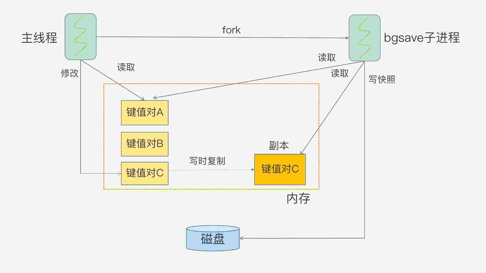

这既保证了快照的完整性，也允许主线程同时对数据进行修改，避免了对正常业务的影响。

**Redis 会使用 bgsave 对当前内存中的所有数据做快照，这个操作是子进程在后台完成的，这就允许主线程同时可以修改数据**。

### 可以每秒做一次快照吗

快照的间隔时间变得很短，即使某一时刻发生宕机了，因为上一时刻快照刚执行，丢失的数据也不会太多。但是，这其中的快照间隔时间就很关键了。

如下图所示，我们先在 T0 时刻做了一次快照，然后又在 T0+t 时刻做了一次快照，在这期间，数据块 5 和 9 被修改了。如果在 t 这段时间内，机器宕机了，那么，只能按照 T0 时刻的快照进行恢复。此时，数据块 5 和 9 的修改值因为没有快照记录，就无法恢复了。

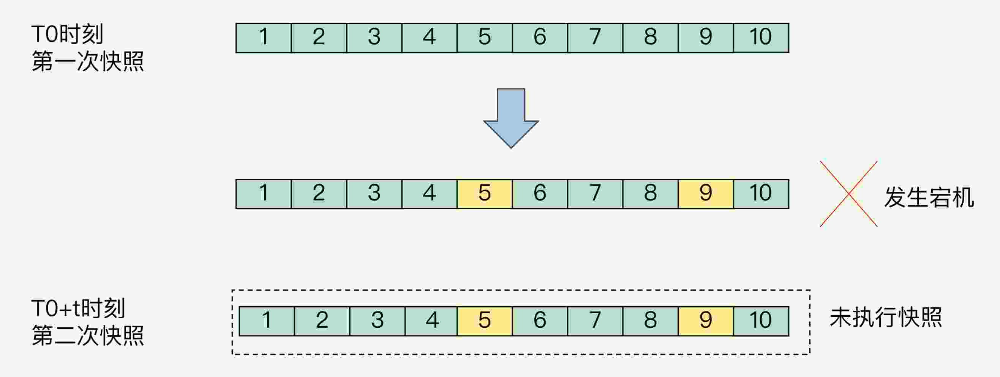

所以，要想尽可能恢复数据，t 值就要尽可能小，t 越小，就越像“连拍”。那么，t 值可以小到什么程度呢，比如说是不是可以每秒做一次快照？毕竟，每次快照都是由 bgsave 子进程在后台执行，也不会阻塞主线程。

这种想法其实是错误的。虽然 bgsave 执行时不阻塞主线程，但是，**如果频繁地执行全量快照，也会带来两方面的开销**。

1. 频繁将全量数据写入磁盘，会给磁盘带来很大压力，多个快照竞争有限的磁盘带宽，前一个快照还没有做完，后一个又开始做了，容易造成恶性循环。
2. bgsave 子进程需要通过 fork 操作从主线程创建出来。虽然，子进程在创建后不会再阻塞主线程，但是，fork 这个创建过程本身会阻塞主线程，而且主线程的内存越大，阻塞时间越长。如果频繁 fork 出 bgsave 子进程，这就会频繁阻塞主线程了。

更好的记录快照的方法是，做**增量快照**，所谓增量快照，就是指，做了一次全量快照后，后续的快照只对修改的数据进行快照记录，这样可以避免每次全量快照的开销。

在第一次做完全量快照后，T1 和 T2 时刻如果再做快照，我们只需要将被修改的数据写入快照文件就行。但是，这么做的前提是，我们需要记住哪些数据被修改了。你可不要小瞧这个“记住”功能，它需要我们使用额外的元数据信息去记录哪些数据被修改了，这会带来额外的空间开销问题。如下图所示：

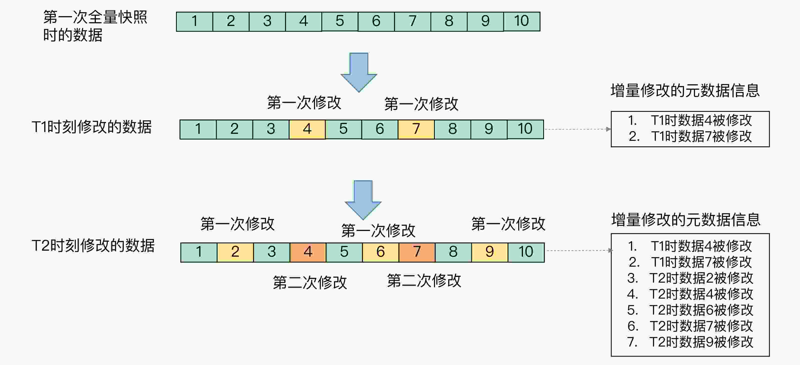

如果我们对每一个键值对的修改，都做个记录，那么，如果有 1 万个被修改的键值对，我们就需要有 1 万条额外的记录。而且，有的时候，键值对非常小，比如只有 32 字节，而记录它被修改的元数据信息，可能就需要 8 字节，这样的画，为了“记住”修改，引入的额外空间开销比较大。这对于内存资源宝贵的 Redis 来说，有些得不偿失。

你可以发现，虽然跟 AOF 相比，快照的恢复速度快，但是，快照的频率不好把握，如果频率太低，两次快照间一旦宕机，就可能有比较多的数据丢失。如果频率太高，又会产生额外开销，那么，还有什么方法既能利用 RDB 的快速恢复，又能以较小的开销做到尽量少丢数据呢？

Redis 4.0 中提出了一个**混合使用 AOF 日志和内存快照的方法**。简单来说，内存快照以一定的频率执行，在两次快照之间，使用 AOF 日志记录这期间的所有命令操作。

这样一来，快照不用很频繁地执行，这就避免了频繁 fork 对主线程的影响。而且，AOF 日志也只用记录两次快照间的操作，也就是说，不需要记录所有操作了，因此，就不会出现文件过大的情况了，也可以避免重写开销。

如下图所示，T1 和 T2 时刻的修改，用 AOF 日志记录，等到第二次做全量快照时，就可以清空 AOF 日志，因为此时的修改都已经记录到快照中了，恢复时就不再用日志了。


这个方法既能享受到 RDB 文件快速恢复的好处，又能享受到 AOF 只记录操作命令的简单优势，颇有点“鱼和熊掌可以兼得”的感觉。

关于 AOF 和 RDB 的选择问题，三点建议：

- 数据不能丢失时，内存快照和 AOF 的混合使用是一个很好的选择；
- 如果允许分钟级别的数据丢失，可以只使用 RDB；
- 如果只用 AOF，优先使用 everysec 的配置选项，因为它在可靠性和性能之间取了一个平衡。

### 每课一问

我们使用一个 2 核 CPU、4GB 内存、500GB 磁盘的云主机运行 Redis，Redis 数据库的数据量大小差不多是 2GB，我们使用了 RDB 做持久化保证。当时 Redis 的运行负载以修改操作为主，写读比例差不多在 8:2 左右，也就是说，如果有 100 个请求，80 个请求执行的是修改操作。你觉得，在这个场景下，用 RDB 做持久化有什么风险吗？你能帮着一起分析分析吗？

做RDB持久化，产生的风险主要在于 **CPU资源** 和 **内存资源** 这2方面。

- **内存资源风险**：Redis fork 一个 bgsave 子进程进行 RDB 写入，如果主线程再接收到写操作，就会采用写时复制。写时复制需要给写操作的数据分配新的内存空间。本问题中写的比例为 80%，那么，在持久化过程中，为了保存 80% 写操作涉及的数据，写时复制机制会在实例内存中，为这些数据再分配新内存空间，分配的内存量相当于整个实例数据量的 80%，大约是 1.6GB，这样一来，整个系统内存的使用量就接近饱和了。此时，如果实例还有大量的新 key 写入或 key 修改，云主机内存很快就会被吃光。如果云主机开启了 Swap 机制，就会有一部分数据被换到磁盘上，当访问磁盘上的这部分数据时，性能会急剧下降。如果云主机没有开启 Swap，会直接触发 OOM，整个 Redis 实例会面临被系统 kill 掉的风险。

- **主线程和子进程竞争使用 CPU 的风险**：虽然子进程在做RDB持久化，但生成RDB快照过程会消耗大量的CPU资源，虽然Redis处理处理请求是单线程的，但Redis Server还有其他线程在后台工作，例如AOF每秒刷盘、异步关闭文件描述符这些操作。由于机器只有2核CPU，这也就意味着父进程占用了超过一半的CPU资源，此时子进程做RDB持久化，可能会产生CPU竞争，导致的结果就是父进程处理请求延迟增大，子进程生成RDB快照的时间也会变长，整个Redis Server性能下降。


## 06 | 数据同步：主从库如何实现数据一致

我们学习了 AOF 和 RDB，如果 Redis 发生了宕机，它们可以分别通过回放日志和重新读入 RDB 文件的方式恢复数据，从而保证尽量少丢失数据，提升可靠性。

不过，即使用了这两种方法，也依然存在服务不可用的问题。比如说，我们在实际使用时只运行了一个 Redis 实例，那么，如果这个实例宕机了，它在恢复期间，是无法服务新来的数据存取请求的。

那我们总说的 Redis 具有高可靠性，又是什么意思呢？其实，这里有两层含义：**一是数据尽量少丢失，二是服务尽量少中断**。*AOF 和 RDB 保证了前者*，而对于后者，*Redis 的做法就是增加副本冗余量，将一份数据同时保存在多个实例上*。即使有一个实例出现了故障，需要过一段时间才能恢复，其他实例也可以对外提供服务，不会影响业务使用。

**Redis 提供了主从库模式，以保证数据副本的一致，主从库之间采用的是读写分离的方式**。

1. 读操作：主库、从库都可以接收；
2. 写操作：首先到主库执行，然后，主库将写操作同步给从库。


主从库模式一旦采用了读写分离，所有数据的修改只会在主库上进行，不用协调三个实例。主库有了最新的数据后，会同步给从库，这样，主从库的数据就是一致的。

### 主从库间如何进行第一次同步

当我们启动多个 Redis 实例的时候，它们相互之间就可以通过 replicaof（Redis 5.0 之前使用 slaveof）命令形成主库和从库的关系，之后会按照三个阶段完成数据的第一次同步。

例如，现在有实例 1（ip：172.16.19.3）和实例 2（ip：172.16.19.5），我们在实例 2 上执行以下这个命令后，实例 2 就变成了实例 1 的从库，并从实例 1 上复制数据：
```sh
replicaof 172.16.19.3 6379
```

接下来，我们就要学习主从库间数据第一次同步的三个阶段了。你可以先看一下下面这张图，有个整体感知，接下来我再具体介绍。


第一阶段是主从库间建立连接、协商同步的过程，主要是为全量复制做准备。在这一步，**从库和主库建立起连接，并告诉主库即将进行同步，主库确认回复后，主从库间就可以开始同步了**。

具体来说，从库给主库发送 `psync` 命令，表示要进行数据同步，主库根据这个命令的参数来启动复制。`psync` 命令包含了主库的 runID 和复制进度 offset 两个参数。

- runID，是每个 Redis 实例启动时都会自动生成的一个随机 ID，用来唯一标记这个实例。当从库和主库第一次复制时，因为不知道主库的 runID，所以将 runID 设为“？”。
- offset，此时设为 -1，表示第一次复制。

主库收到 `psync` 命令后，会用 `FULLRESYNC` 响应命令带上两个参数：主库 `runID` 和主库目前的复制进度 `offset`，返回给从库。从库收到响应后，会记录下这两个参数。

这里有个地方需要注意，**FULLRESYNC 响应表示第一次复制采用的全量复制，也就是说，主库会把当前所有的数据都复制给从库**。

在第二阶段，**主库将所有数据同步给从库**。**从库收到数据后，在本地完成数据加载**。这个过程依赖于内存快照生成的 RDB 文件。

具体来说，主库执行 bgsave 命令，生成 RDB 文件，接着将文件发给从库。从库接收到 RDB 文件后，会先清空当前数据库，然后加载 RDB 文件。这是因为从库在通过 replicaof 命令开始和主库同步前，可能保存了其他数据。为了避免之前数据的影响，从库需要先把当前数据库清空。

在主库将数据同步给从库的过程中，主库不会被阻塞，仍然可以正常接收请求。否则，Redis 的服务就被中断了。但是，这些请求中的写操作并没有记录到刚刚生成的 RDB 文件中。为了保证主从库的数据一致性，主库会在内存中用专门的 replication buffer，记录 RDB 文件生成后收到的所有写操作。

第三个阶段，**主库会把第二阶段执行过程中新收到的写命令，再发送给从库**。具体的操作是，当主库完成 RDB 文件发送后，就会把此时 replication buffer 中的修改操作发给从库，从库再重新执行这些操作。这样一来，主从库就实现同步了。

### 主从级联模式分担全量复制时的主库压力

通过分析主从库间第一次数据同步的过程，你可以看到，一次全量复制中，对于主库来说，需要完成**两个耗时的操作：生成 RDB 文件和传输 RDB 文件**。

如果从库数量很多，而且都要和主库进行全量复制的话，就会导致主库忙于 fork 子进程生成 RDB 文件，进行数据全量同步。fork 这个操作会阻塞主线程处理正常请求，从而导致主库响应应用程序的请求速度变慢。此外，传输 RDB 文件也会占用主库的网络带宽，同样会给主库的资源使用带来压力。那么，有没有好的解决方法可以分担主库压力呢？

其实是有的，这就是“主 - 从 - 从”模式。我们可以通过“主 - 从 - 从”模式将主库生成 RDB 和传输 RDB 的压力，以级联的方式分散到从库上。

简单来说，我们在部署主从集群的时候，可以手动选择一个从库（比如选择内存资源配置较高的从库），用于级联其他的从库。然后，我们可以再选择一些从库（例如三分之一的从库），在这些从库上执行如下命令，让它们和刚才所选的从库，建立起主从关系。

```sh
replicaof 所选从库的IP 6379
```

这样一来，这些从库就会知道，在进行同步时，不用再和主库进行交互了，只要和级联的从库进行写操作同步就行了，这就可以减轻主库上的压力，如下图所示：

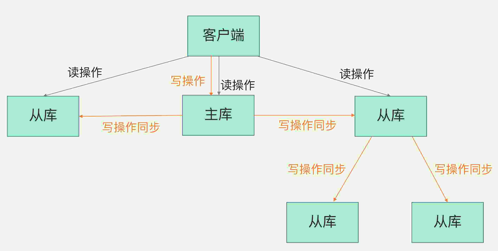

到这里，我们了解了主从库间通过全量复制实现数据同步的过程，以及通过“主 - 从 - 从”模式分担主库压力的方式。那么，一旦主从库完成了全量复制，它们之间就会一直维护一个网络连接，主库会通过这个连接将后续陆续收到的命令操作再同步给从库，这个过程也称为**基于长连接的命令传播**，可以避免频繁建立连接的开销。

听上去好像很简单，但不可忽视的是，这个过程中存在着风险点，最常见的就是网络断连或阻塞。如果网络断连，主从库之间就无法进行命令传播了，从库的数据自然也就没办法和主库保持一致了，客户端就可能从从库读到旧数据。

### 主从库间网络断了怎么办

<!--在 Redis 2.8 之前，如果主从库在命令传播时出现了网络闪断，那么，从库就会和主库重新进行一次全量复制，开销非常大。-->

从 Redis 2.8 开始，网络断了之后，主从库会采用增量复制的方式继续同步。听名字大概就可以猜到它和全量复制的不同：全量复制是同步所有数据，而增量复制只会把主从库网络断连期间主库收到的命令，同步给从库。

增量复制时，主从库之间具体是怎么保持同步的呢？这里的奥妙就在于 `repl_backlog_buffer` 这个缓冲区。我们先来看下它是如何用于增量命令的同步的。

当主从库断连后，主库会把断连期间收到的写操作命令，写入 `replication buffer`，同时也会把这些操作命令也写入 `repl_backlog_buffer` 这个缓冲区。

[^问题]:  断连后 `replication buffer` 不知道是否在存在？

**repl_backlog_buffer 是一个环形缓冲区，主库会记录自己写到的位置，从库则会记录自己已经读到的位置**。

<!--repl_backlog_buffer 是一个环形缓冲区，整个master进程中只会存在一个，所有的slave公用。每个从库会记录自己的slave_repl_offset，每个从库的复制进度也不一定相同。在和主库重连进行恢复时，从库会通过psync命令把自己记录的 slave_repl_offset 发给主库，主库会根据从库各自的复制进度，来决定这个从库可以进行增量复制，还是全量复制。-->

刚开始的时候，主库和从库的写读位置在一起，这算是它们的起始位置。随着主库不断接收新的写操作，它在缓冲区中的写位置会逐步偏离起始位置，我们通常用偏移量来衡量这个偏移距离的大小，*对主库来说，对应的偏移量就是* `master_repl_offset`。主库接收的新写操作越多，这个值就会越大。

同样，从库在复制完写操作命令后，它在缓冲区中的读位置也开始逐步偏移刚才的起始位置，此时，从库已复制的偏移量 `slave_repl_offset` 也在不断增加。正常情况下，这两个偏移量基本相等。

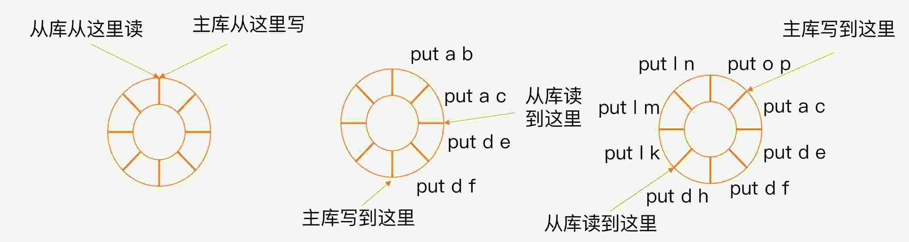

主从库的连接恢复之后，从库首先会给主库发送 psync 命令，并把自己当前的 slave_repl_offset 发给主库，主库会判断自己的 `master_repl_offset` 和 `slave_repl_offset` 之间的差距。

在网络断连阶段，主库可能会收到新的写操作命令，所以，一般来说，`master_repl_offset` 会大于 `slave_repl_offset`。此时，主库只用把 `master_repl_offset` 和 `slave_repl_offset` 之间的命令操作同步给从库就行。

就像刚刚示意图的中间部分，主库和从库之间相差了 `put d e` 和 `put d f` 两个操作，在增量复制时，主库只需要把它们同步给从库，就行了。

回顾下增量复制的流程

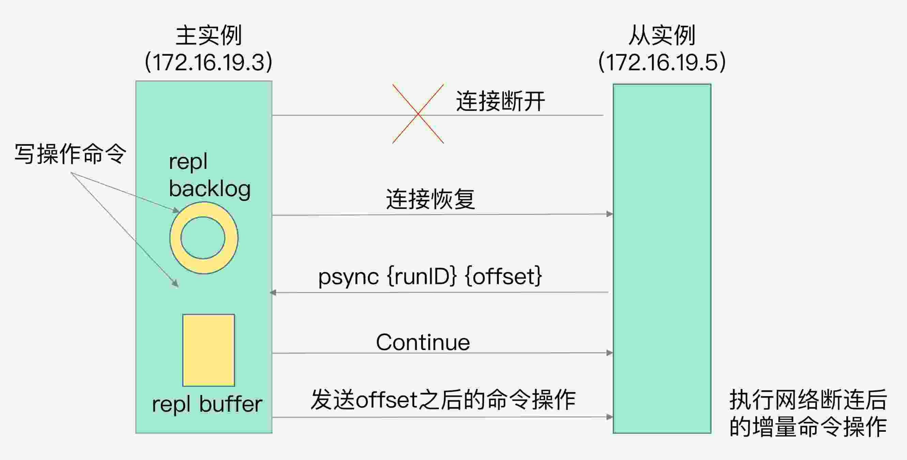

有一个地方我要强调一下，因为 `repl_backlog_buffer` 是一个环形缓冲区，所以在缓冲区写满后，主库会继续写入，此时，就会覆盖掉之前写入的操作。**如果从库的读取速度比较慢，就有可能导致从库还未读取的操作被主库新写的操作覆盖了，这会导致主从库间的数据不一致**。

<!--一个从库如果和主库断连时间过长，造成它在主库 repl_backlog_buffer 的 slave_repl_offset 位置上的数据已经被覆盖掉了，此时从库和主库间将进行全量复制。-->

因此，我们要想办法避免这一情况，一般而言，我们可以调整 `repl_backlog_size` 这个参数。这个参数和所需的缓冲空间大小有关。缓冲空间的计算公式是：`缓冲空间大小 = 主库写入命令速度 * 操作大小 - 主从库间网络传输命令速度 * 操作大小`。在实际应用中，考虑到可能存在一些突发的请求压力，我们通常需要把这个缓冲空间扩大一倍，即 `repl_backlog_size = 缓冲空间大小 * 2`，这也就是 repl_backlog_size 的最终值。

举个例子，如果主库每秒写入 2000 个操作，每个操作的大小为 2KB，网络每秒能传输 1000 个操作，那么，有 1000 个操作需要缓冲起来，这就至少需要 2MB 的缓冲空间。否则，新写的命令就会覆盖掉旧操作了。为了应对可能的突发压力，我们最终把 repl_backlog_size 设为 4MB。

这样一来，增量复制时主从库的数据不一致风险就降低了。不过，如果并发请求量非常大，连两倍的缓冲空间都存不下新操作请求的话，此时，主从库数据仍然可能不一致。

针对这种情况，一方面，你可以根据 Redis 所在服务器的内存资源再适当增加 repl_backlog_size 值，比如说设置成缓冲空间大小的 4 倍，另一方面，你可以考虑使用切片集群来分担单个主库的请求压力。

### 每课一问

主从全量同步使用RDB而不使用AOF的原因？

1. RDB 文件是二进制文件，无论是要把 RDB 写入磁盘，还是要通过网络传输 RDB，IO 效率都比记录和传输 AOF 的高。
2. 在从库端进行恢复时，用 RDB 的恢复效率要高于用 AOF。


## 07 | 哨兵机制：主库挂了，如何不间断服务

如果客户端发送的都是读操作请求，那还可以由从库继续提供服务，这在纯读的业务场景下还能被接受。但是，一旦有写操作请求了，按照主从库模式下的读写分离要求，需要由主库来完成写操作。此时，也没有实例可以来服务客户端的写操作请求了，如下图所示：

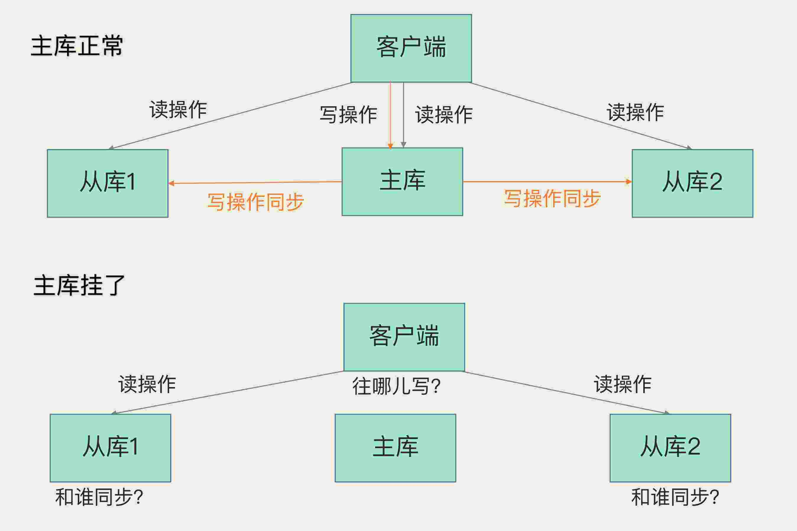

无论是写服务中断，还是从库无法进行数据同步，都是不能接受的。所以，如果主库挂了，我们就需要运行一个新主库，比如说把一个从库切换为主库，把它当成主库。这就涉及到三个问题：

1. 主库真的挂了吗？
2. 该选择哪个从库作为主库？
3. 怎么把新主库的相关信息通知给从库和客户端呢？

这就要提到哨兵机制了。在 Redis 主从集群中，哨兵机制是实现主从库自动切换的关键机制，它有效地解决了主从复制模式下故障转移的这三个问题。

### 哨兵机制的基本流程

**哨兵其实就是一个运行在特殊模式下的 Redis 进程**，主从库实例运行的同时，它也在运行。

哨兵主要负责的就是三个任务：**监控、选主（选择主库）和通知**。

监控是指哨兵进程在运行时，周期性地给所有的主从库发送 PING 命令，检测它们是否仍然在线运行。如果从库没有在规定时间内响应哨兵的 PING 命令，哨兵就会把它标记为“下线状态”；同样，如果主库也没有在规定时间内响应哨兵的 PING 命令，哨兵就会判定主库下线，然后开始自动切换主库的流程。

这个流程首先是执行哨兵的第二个任务，选主。主库挂了以后，哨兵就需要从很多个从库里，按照一定的规则选择一个从库实例，把它作为新的主库。这一步完成后，现在的集群里就有了新主库。

然后，哨兵会执行最后一个任务：通知。在执行通知任务时，哨兵会把新主库的连接信息发给其他从库，让它们执行 replicaof 命令，和新主库建立连接，并进行数据复制。同时，哨兵会把新主库的连接信息通知给客户端，让它们把请求操作发到新主库上。

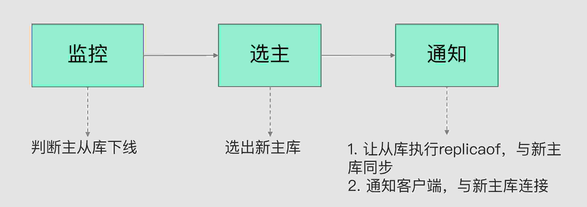

在这三个任务中，通知任务相对来说比较简单，哨兵只需要把新主库信息发给从库和客户端，让它们和新主库建立连接就行，并不涉及决策的逻辑。但是，在监控和选主这两个任务中，哨兵需要做出两个决策：

- 在监控任务中，哨兵需要判断主库是否处于下线状态；
- 在选主任务中，哨兵也要决定选择哪个从库实例作为主库。

哨兵对主库的下线判断有“**主观下线**”和“**客观下线**”两种。

### 主观下线和客观下线

主观下线：**哨兵进程会使用 PING 命令检测它自己和主、从库的网络连接情况，用来判断实例的状态**。如果哨兵发现主库或从库对 PING 命令的响应超时了，那么，哨兵就会先把它标记为“主观下线”。

如果检测的是从库，那么，哨兵简单地把它标记为“主观下线”就行了，因为从库的下线影响一般不太大，集群的对外服务不会间断。

但是，如果检测的是主库，那么，哨兵还不能简单地把它标记为“主观下线”，开启主从切换。因为很有可能存在这么一个情况：那就是哨兵误判了，其实主库并没有故障。可是，一旦启动了主从切换，后续的选主和通知操作都会带来额外的计算和通信开销。

为了避免这些不必要的开销，我们要特别注意误判的情况。

首先，我们要知道啥叫误判。很简单，就是主库实际并没有下线，但是哨兵误以为它下线了。*误判一般会发生在集群网络压力较大、网络拥塞，或者是主库本身压力较大的情况下*。

为减少误判，哨兵**通常会采用多实例组成的集群模式进行部署，这也被称为哨兵集群**。引入多个哨兵实例一起来判断，就可以避免单个哨兵因为自身网络状况不好，而误判主库下线的情况。同时，多个哨兵的网络同时不稳定的概率较小，由它们一起做决策，误判率也能降低。

在判断主库是否下线时，不能由一个哨兵说了算，只有大多数的哨兵实例，都判断主库已经“主观下线”了，主库才会被标记为“客观下线”，这个叫法也是表明主库下线成为一个客观事实了。这个判断原则就是：少数服从多数。同时，这会进一步触发哨兵开始主从切换流程。

如下图所示，Redis 主从集群有一个主库、三个从库，还有三个哨兵实例。在图片的左边，哨兵 2 判断主库为“主观下线”，但哨兵 1 和 3 却判定主库是上线状态，此时，主库仍然被判断为处于上线状态。在图片的右边，哨兵 1 和 2 都判断主库为“主观下线”，此时，即使哨兵 3 仍然判断主库为上线状态，主库也被标记为“客观下线”了。

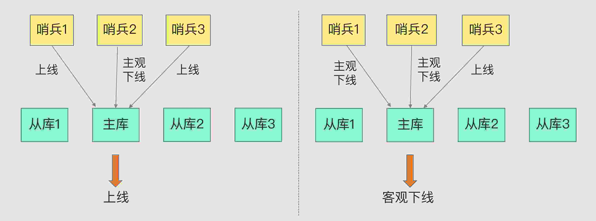

“客观下线”的标准就是，**当有 N 个哨兵实例时，最好要有 N/2 + 1 个实例判断主库为“主观下线”，才能最终判定主库为“客观下线”**。这样一来，就可以减少误判的概率，也能避免误判带来的无谓的主从库切换。（当然，有多少个实例做出“主观下线”的判断才可以，可以由 Redis 管理员自行设定）。

<!--一般来说，我们可以部署三个哨兵，如果有两个哨兵认定主库“主观下线”，就可以开始切换过程。-->

借助于多个哨兵实例的共同判断机制，我们就可以更准确地判断出主库是否处于下线状态。如果主库的确下线了，哨兵就要开始下一个决策过程了，即从许多从库中，选出一个从库来做新主库。

### 如何选定新主库

在多个从库中，先按照**一定的筛选条件**，把不符合条件的从库去掉。然后，我们再按照**一定的规则**，给剩下的从库逐个打分，将得分最高的从库选为新主库，如下图所示：

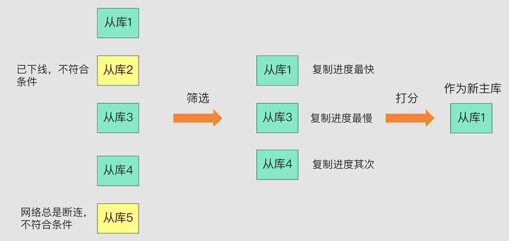

#### 一定的筛选条件

在选主时，**除了要检查从库的当前在线状态，还要判断它之前的网络连接状态**。如果从库总是和主库断连，而且断连次数超出了一定的阈值，我们就有理由相信，这个从库的网络状况并不是太好，就可以把这个从库筛掉了。

具体怎么判断呢？你使用配置项 down-after-milliseconds * 10。其中，down-after-milliseconds 是我们认定主从库断连的最大连接超时时间。如果在 down-after-milliseconds 毫秒内，主从节点都没有通过网络联系上，我们就可以认为主从节点断连了。如果发生断连的次数超过了 10 次，就说明这个从库的网络状况不好，不适合作为新主库。

#### 一定的规则

过滤掉了不适合做主库的从库，完成了筛选工作。接下来就要给剩余的从库打分了。我们可以分别按照三个规则依次进行三轮打分，这三个规则分别是**从库优先级、从库复制进度以及从库 ID 号**。只要在某一轮中，有从库得分最高，那么它就是主库了，选主过程到此结束。如果没有出现得分最高的从库，那么就继续进行下一轮。

##### 优先级最高的从库得分高。

用户可以通过 slave-priority 配置项，给不同的从库设置不同优先级。比如，你有两个从库，它们的内存大小不一样，你可以手动给内存大的实例设置一个高优先级。在选主时，哨兵会给优先级高的从库打高分，如果有一个从库优先级最高，那么它就是新主库了。如果从库的优先级都一样，那么哨兵开始第二轮打分。

##### 和旧主库同步程度最接近的从库得分高。

这个规则的依据是，**如果选择和旧主库同步最接近的那个从库作为主库，那么，这个新主库上就有最新的数据**。

主从库同步时有个命令传播的过程。在这个过程中，主库会用 master_repl_offset 记录当前的最新写操作在 repl_backlog_buffer 中的位置，而从库会用 slave_repl_offset 这个值记录当前的复制进度。

此时，我们想要找的从库，它的 slave_repl_offset 需要最接近 master_repl_offset。如果在所有从库中，有从库的 slave_repl_offset 最接近 master_repl_offset，那么它的得分就最高，可以作为新主库。

就像下图所示，旧主库的 master_repl_offset 是 1000，从库 1、2 和 3 的 slave_repl_offset 分别是 950、990 和 900，那么，从库 2 就应该被选为新主库。

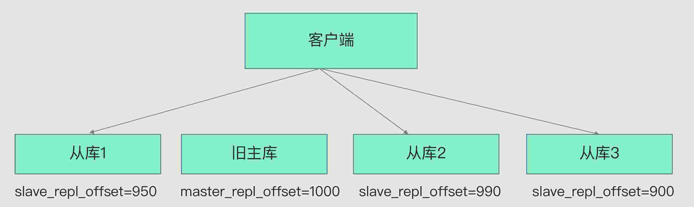

如果有两个从库的 slave_repl_offset 值大小是一样的（例如，从库 1 和从库 2 的 slave_repl_offset 值都是 990），我们就需要给它们进行第三轮打分了。

##### ID 号小的从库得分高。

每个实例都会有一个 ID，这个 ID 就类似于这里的从库的编号。目前，Redis 在选主库时，有一个默认的规定：**在优先级和复制进度都相同的情况下，ID 号最小的从库得分最高，会被选为新主库**。

到这里，新主库就被选出来了，“选主”这个过程就完成了。

回顾下这个流程。首先，哨兵会按照在线状态、网络状态，筛选过滤掉一部分不符合要求的从库，然后，依次按照优先级、复制进度、ID 号大小再对剩余的从库进行打分，只要有得分最高的从库出现，就把它选为新主库。

### 每课一问

1. 在主从切换过程中，客户端能否正常地进行请求操作呢？

    主从集群一般是采用读写分离模式，当主库故障后，客户端仍然可以把读请求发送给从库，让从库服务。但是，对于写请求操作，客户端就无法执行了。


2. 如果想要应用程序不感知服务的中断，还需要哨兵或客户端再做些什么吗？

    一方面，客户端需要能缓存应用发送的写请求。只要不是同步写操作（Redis 应用场景一般也没有同步写），写请求通常不会在应用程序的关键路径上，所以，客户端缓存写请求后，给应用程序返回一个确认就行。

    另一方面，主从切换完成后，客户端要能和新主库重新建立连接，哨兵需要提供订阅频道，让客户端能够订阅到新主库的信息。同时，客户端也需要能主动和哨兵通信，询问新主库的信息。


## 08 | 哨兵集群：哨兵挂了，主从库还能切换吗

实际上，一旦多个实例组成了**哨兵集群**，即使有哨兵实例出现故障挂掉了，其他哨兵还能继续协作完成主从库切换的工作，包括判定主库是不是处于下线状态，选择新主库，以及通知从库和客户端。

如果你部署过哨兵集群的话就会知道，在配置哨兵的信息时，我们只需要用到下面的这个配置项，设置主库的 IP 和端口，并没有配置其他哨兵的连接信息。

```sh
sentinel monitor <master-name> <ip> <redis-port> <quorum> 
```

这些哨兵实例既然都不知道彼此的地址，又是怎么组成集群的呢？要弄明白这个问题，我们就需要学习一下哨兵集群的组成和运行机制了。

### 基于 pub/sub 机制的哨兵集群组成

哨兵实例之间可以相互发现，要归功于 Redis 提供的 pub/sub 机制，也就是**发布 / 订阅机制**。

*哨兵只要和主库建立起了连接，就可以在主库上发布消息了*，比如说发布它自己的连接信息（IP 和端口）。同时，它*也可以从主库上订阅消息，获得其他哨兵发布的连接信息*。当多个哨兵实例都在主库上做了发布和订阅操作后，它们之间就能知道彼此的 IP 地址和端口。

除了哨兵实例，我们自己编写的应用程序也可以通过 Redis 进行消息的发布和订阅。所以，为了区分不同应用的消息，Redis 会以频道的形式，对这些消息进行分门别类的管理。所谓的频道，实际上就是消息的类别。当消息类别相同时，它们就属于同一个频道。反之，就属于不同的频道。**只有订阅了同一个频道的应用，才能通过发布的消息进行信息交换**。

在主从集群中，主库上有一个名为“`__sentinel__:hello`”的频道，不同哨兵就是通过它来相互发现，实现互相通信的。

我来举个例子，具体说明一下。在下图中，哨兵 1 把自己的 IP（172.16.19.3）和端口（26579）发布到“`__sentinel__:hello`”频道上，哨兵 2 和 3 订阅了该频道。那么此时，哨兵 2 和 3 就可以从这个频道直接获取哨兵 1 的 IP 地址和端口号。

哨兵 2、3 可以和哨兵 1 建立网络连接。通过这个方式，哨兵 2 和 3 也可以建立网络连接，这样一来，哨兵集群就形成了。它们相互间可以通过网络连接进行通信，比如说对主库有没有下线这件事儿进行判断和协商。

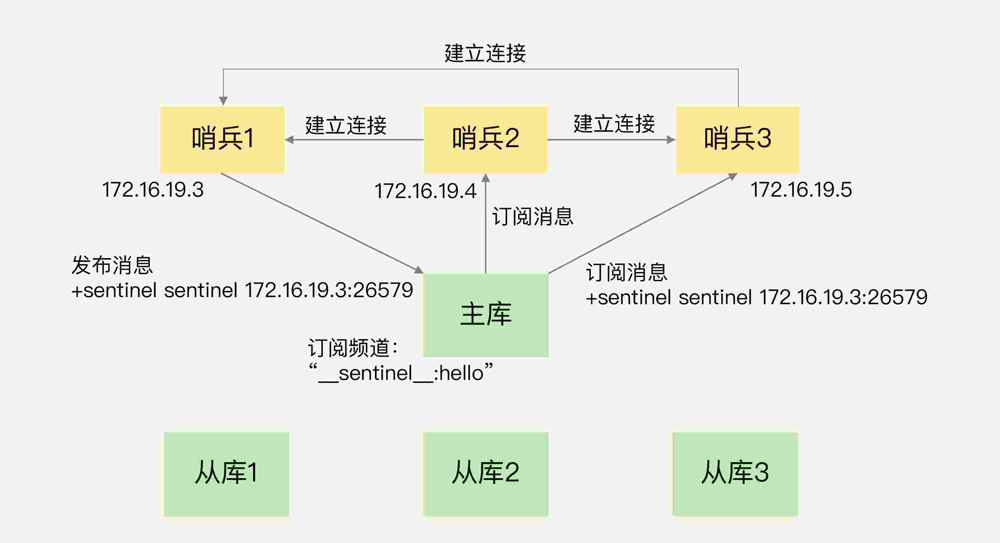

哨兵除了彼此之间建立起连接形成集群外，还需要和从库建立连接。这是因为，在哨兵的监控任务中，它需要对主从库都进行心跳判断，而且在主从库切换完成后，它还需要通知从库，让它们和新主库进行同步。

### 哨兵是如何知道从库的 IP 地址和端口

这是由哨兵向主库发送 INFO 命令来完成的。就像下图所示，哨兵 2 给主库发送 INFO 命令，主库接受到这个命令后，就会把从库列表返回给哨兵。接着，哨兵就可以根据从库列表中的连接信息，和每个从库建立连接，并在这个连接上持续地对从库进行监控。哨兵 1 和 3 可以通过相同的方法和从库建立连接。

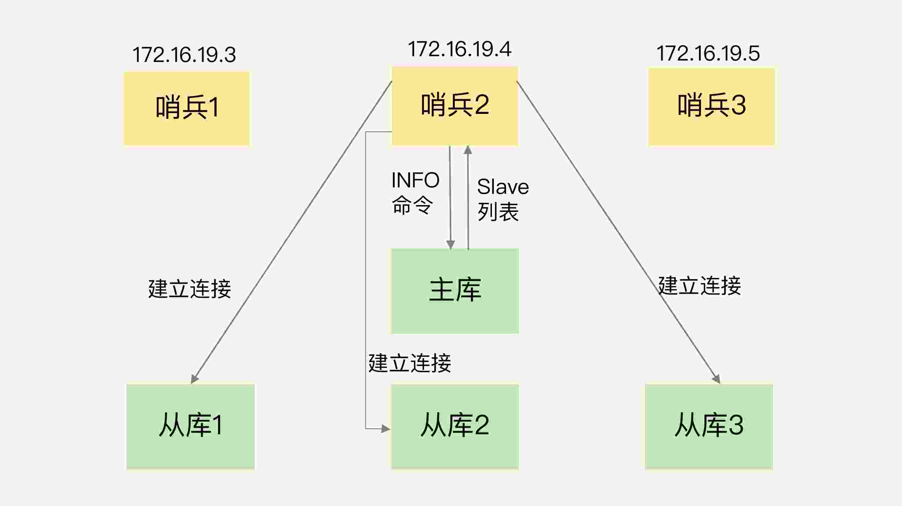

你看，**通过 pub/sub 机制，哨兵之间可以组成集群**，同时，哨兵又**通过 INFO 命令，获得了从库连接信息，也能和从库建立连接，并进行监控了**。

但是，哨兵不能只和主、从库连接。因为，主从库切换后，客户端也需要知道新主库的连接信息，才能向新主库发送请求操作。所以，**哨兵还需要完成把新主库的信息告诉客户端这个任务**。

而且，在实际使用哨兵时，我们有时会遇到这样的问题：如何在客户端通过监控了解哨兵进行主从切换的过程呢？比如说，主从切换进行到哪一步了？这其实就是要求，客户端能够获取到哨兵集群在监控、选主、切换这个过程中发生的各种事件。

此时，我们仍然可以依赖 pub/sub 机制，来帮助我们完成哨兵和客户端间的信息同步。

### 基于 pub/sub 机制的客户端事件通知

从本质上说，*哨兵就是一个运行在特定模式下的 Redis 实例，只不过它并不服务请求操作，只是完成监控、选主和通知的任务*。所以，每个哨兵实例也提供 pub/sub 机制，客户端可以从哨兵订阅消息。哨兵提供的消息订阅频道有很多，不同频道包含了主从库切换过程中的不同关键事件。

下图列出了一些重要的频道：

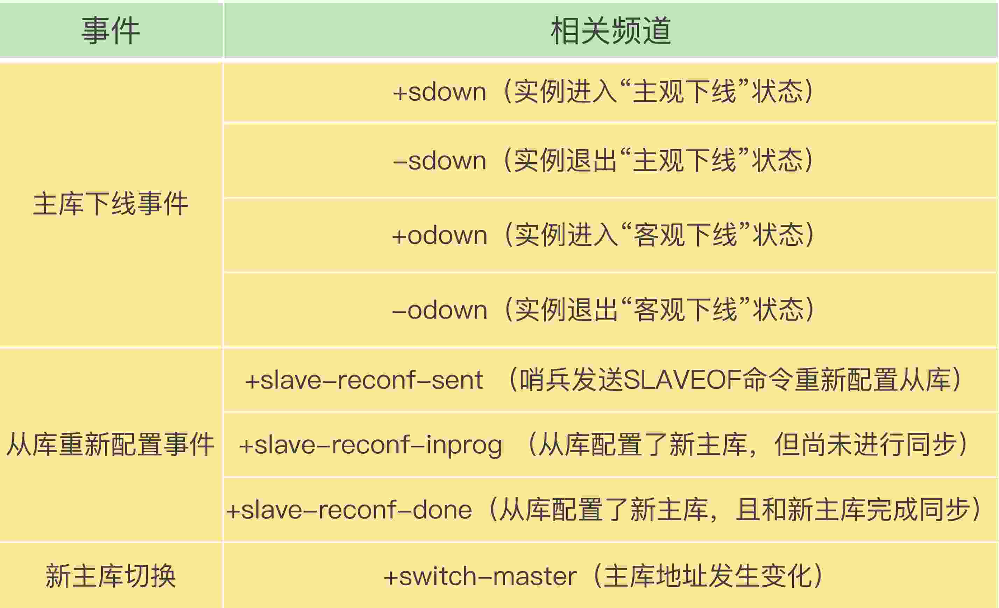

知道了这些频道之后，你就可以**让客户端从哨兵这里订阅消息**了。具体的操作步骤是，客户端读取哨兵的配置文件后，可以获得哨兵的地址和端口，和哨兵建立网络连接。然后，我们可以在客户端执行订阅命令，来获取不同的事件消息。

举个例子，你可以执行如下命令，来订阅“所有实例进入客观下线状态的事件”：

```sh
SUBSCRIBE +odown
```

当然，你也可以执行如下命令，订阅所有的事件：

```sh
PSUBSCRIBE *
```

当哨兵把新主库选择出来后，客户端就会看到下面的 **`switch-master`** 事件。这个事件表示主库已经切换了，新主库的 IP 地址和端口信息已经有了。这个时候，客户端就可以用这里面的新主库地址和端口进行通信了。

有了这些事件通知，客户端不仅可以在主从切换后得到新主库的连接信息，还可以监控到主从库切换过程中发生的各个重要事件。这样，客户端就可以知道主从切换进行到哪一步了，有助于了解切换进度。

有了 pub/sub 机制，哨兵和哨兵之间、哨兵和从库之间、哨兵和客户端之间就都能建立起连接了，再加上我们上节课介绍主库下线判断和选主依据，哨兵集群的监控、选主和通知三个任务就基本可以正常工作了。

主库故障以后，哨兵集群有多个实例，那怎么确定由哪个哨兵来进行实际的主从切换呢？

### 由哪个哨兵执行主从切换

确定由哪个哨兵执行主从切换的过程，和主库“客观下线”的判断过程类似，也是一个“投票仲裁”的过程。

哨兵集群要判定主库“客观下线”，需要有一定数量的实例都认为该主库已经“主观下线”了。

任何一个实例只要自身判断主库“主观下线”后，就会给其他实例发送 **`is-master-down-by-addr`** 命令。接着，其他实例会根据自己和主库的连接情况，做出 Y 或 N 的响应，Y 相当于赞成票，N 相当于反对票。

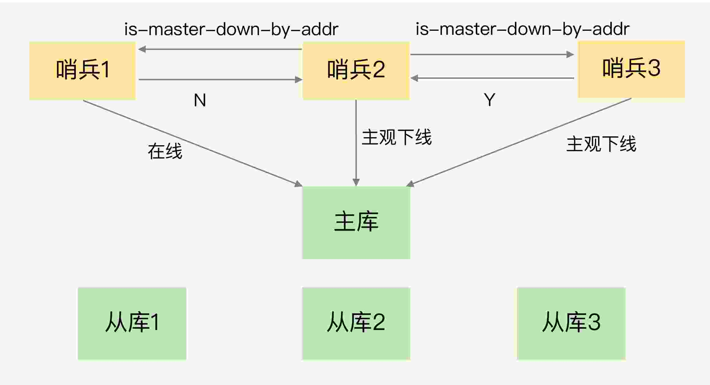

一个哨兵获得了仲裁所需的赞成票数后，就可以标记主库为“客观下线”。这个所需的赞成票数是通过哨兵配置文件中的 `quorum` 配置项设定的。例如，现在有 5 个哨兵，`quorum` 配置的是 3，那么，一个哨兵需要 3 张赞成票，就可以标记主库为“客观下线”了。这 3 张赞成票包括哨兵自己的一张赞成票和另外两个哨兵的赞成票。

此时，这个哨兵就可以再给其他哨兵发送命令，表明希望由自己来执行主从切换，并让所有其他哨兵进行投票。这个投票过程称为“Leader 选举”。因为最终执行主从切换的哨兵称为 Leader，投票过程就是确定 Leader。

在投票过程中，任何一个**想成为 Leader 的哨兵**，要满足两个条件：**第一，拿到半数以上的赞成票；第二，拿到的票数同时还需要大于等于哨兵配置文件中的 quorum 值**。以 3 个哨兵为例，假设此时的 `quorum` 设置为 2，那么，任何一个想成为 Leader 的哨兵只要拿到 2 张赞成票，就可以了。

这么说你可能还不太好理解，我再画一张图片，展示一下 3 个哨兵、quorum 为 2 的选举过程。

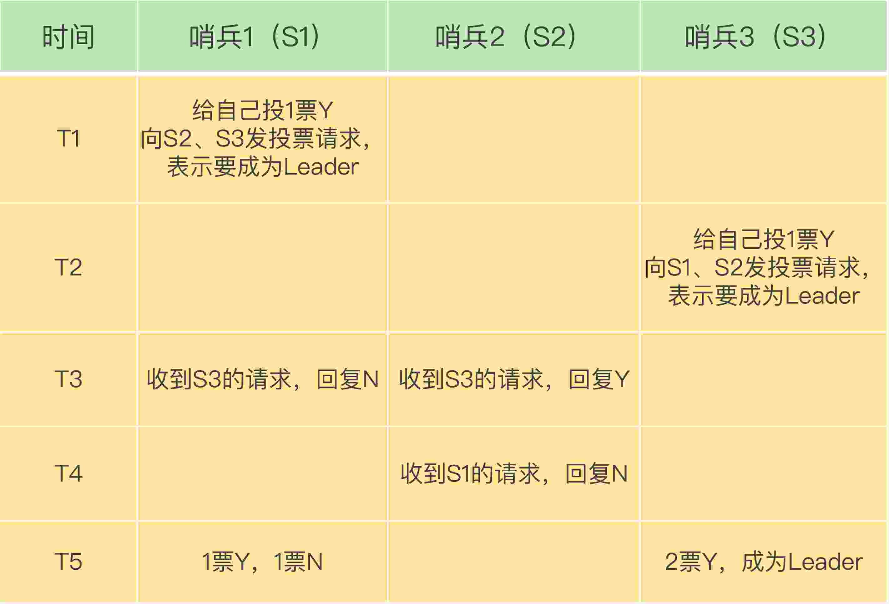

在 T1 时刻，S1 判断主库为“客观下线”，它想成为 Leader，就先给自己投一张赞成票，然后分别向 S2 和 S3 发送命令，表示要成为 Leader。

在 T2 时刻，S3 判断主库为“客观下线”，它也想成为 Leader，所以也先给自己投一张赞成票，再分别向 S1 和 S2 发送命令，表示要成为 Leader。

在 T3 时刻，S1 收到了 S3 的 Leader 投票请求。因为 S1 已经给自己投了一票 Y，所以它不能再给其他哨兵投赞成票了，所以 S1 回复 N 表示不同意。同时，S2 收到了 T2 时 S3 发送的 Leader 投票请求。因为 S2 之前没有投过票，它会给第一个向它发送投票请求的哨兵回复 Y，给后续再发送投票请求的哨兵回复 N，所以，在 T3 时，S2 回复 S3，同意 S3 成为 Leader。

在 T4 时刻，S2 才收到 T1 时 S1 发送的投票命令。因为 S2 已经在 T3 时同意了 S3 的投票请求，此时，S2 给 S1 回复 N，表示不同意 S1 成为 Leader。发生这种情况，是因为 S3 和 S2 之间的网络传输正常，而 S1 和 S2 之间的网络传输可能正好拥塞了，导致投票请求传输慢了。

如果 S3 没有拿到 2 票 Y，那么这轮投票就不会产生 Leader。*哨兵集群会等待一段时间*（也就是**哨兵故障转移超时时间的 2 倍**），*再重新选举*。这是因为，哨兵集群能够进行成功投票，很大程度上依赖于选举命令的正常网络传播。如果网络压力较大或有短时堵塞，就可能导致没有一个哨兵能拿到半数以上的赞成票。所以，等到网络拥塞好转之后，再进行投票选举，成功的概率就会增加。

需要注意的是，如果哨兵集群只有 2 个实例，此时，一个哨兵要想成为 Leader，必须获得 2 票，而不是 1 票。所以，如果有个哨兵挂掉了，那么，此时的集群是无法进行主从库切换的。因此，**通常我们至少会配置 3 个哨兵实例**。这一点很重要，你在实际应用时可不能忽略了。

<!--要发生S1、S2和S3同时同自己投票的情况，这需要这三个哨兵基本同时判定了主库客观下线。但是，不同哨兵的网络连接、系统压力不完全一样，接收到下线协商消息的时间也可能不同，所以，它们同时做出主库客观下线判定的概率较小，一般都有个先后关系。文章中的例子，就是S1、S3先判定，S2一直没有判定。其次，哨兵对主从库进行的在线状态检查等操作，是属于一种时间事件，用一个定时器来完成，一般来说每100ms执行一次这些事件。每个哨兵的定时器执行周期都会加上一个小小的随机时间偏移，目的是让每个哨兵执行上述操作的时间能稍微错开些，也是为了避免它们都同时判定主库下线，同时选举Leader。最后，即使出现了都投给自己一票的情况，导致无法选出Leader，哨兵会停一段时间（一般是故障转移超时时间failover_timeout的2倍），然后再可以进行下一轮投票。-->


最后，我想再给你分享一个经验：**要保证所有哨兵实例的配置是一致的，尤其是主观下线的判断值 down-after-milliseconds**。

### 每课一问

*Redis 1主4从，5个哨兵，哨兵配置quorum为2，如果3个哨兵故障，当主库宕机时，哨兵能否判断主库“客观下线”？能否自动切换？*

1. 哨兵集群可以判定主库“主观下线”。由于quorum=2，所以当一个哨兵判断主库“主观下线”后，询问另外一个哨兵后也会得到同样的结果，2个哨兵都判定“主观下线”，达到了quorum的值，因此，哨兵集群可以判定主库为“客观下线”。
2. 但哨兵不能完成主从切换。哨兵标记主库“客观下线后”，在选举“哨兵领导者”时，一个哨兵必须拿到超过多数的选票(5/2+1=3票)。但目前只有2个哨兵活着，无论怎么投票，一个哨兵最多只能拿到2票，永远无法达到多数选票的结果。

但是投票选举过程的细节并不是大家认为的：每个哨兵各自1票，这个情况是不一定的。下面具体说一下：

场景a：哨兵A先判定主库“主观下线”，然后马上询问哨兵B（注意，此时哨兵B只是被动接受询问，并没有去询问哨兵A，也就是它还没有进入判定“客观下线”的流程），哨兵B回复主库已“主观下线”，达到quorum=2后哨兵A此时可以判定主库“客观下线”。此时，哨兵A马上可以向其他哨兵发起成为“哨兵领导者”的投票，哨兵B收到投票请求后，由于自己还没有询问哨兵A进入判定“客观下线”的流程，所以哨兵B是可以给哨兵A投票确认的，这样哨兵A就已经拿到2票了。等稍后哨兵B也判定“主观下线”后想成为领导者时，因为它已经给别人投过票了，所以这一轮自己就不能再成为领导者了。

场景b：哨兵A和哨兵B同时判定主库“主观下线”，然后同时询问对方后都得到可以“客观下线”的结论，此时它们各自给自己投上1票后，然后向其他哨兵发起投票请求，但是因为各自都给自己投过票了，因此各自都拒绝了对方的投票请求，这样2个哨兵各自持有1票。

场景a是1个哨兵拿到2票，场景b是2个哨兵各自有1票，这2种情况都不满足大多数选票(3票)的结果，因此无法完成主从切换。

经过测试发现，场景b发生的概率非常小，只有2个哨兵同时进入判定“主观下线”的流程时才可以发生。我测试几次后发现，都是复现的场景a。

*哨兵实例是不是越多越好呢？如果同时调大 down-after-milliseconds 值，对减少误判是不是也有好处？*

调大 down-after-milliseconds 后，可能会导致这样的情况：主库实际已经发生故障了，但是哨兵过了很长时间才判断出来，这就会影响到 Redis 对业务的可用性。，我们也看到了，哨兵在判定“主观下线”和选举“哨兵领导者”时，都需要和其他节点进行通信，交换信息，哨兵实例越多，通信的次数也就越多，而且部署多个哨兵时，会分布在不同机器上，节点越多带来的机器故障风险也会越大，这些问题都会影响到哨兵的通信和选举，出问题时也就意味着选举时间会变长，切换主从的时间变久。

调大down-after-milliseconds值是有好处的，适当调大down-after-milliseconds值，当哨兵与主库之间网络存在短时波动时，可以降低误判的概率。但是调大down-after-milliseconds值也意味着主从切换的时间会变长，对业务的影响时间越久，我们需要根据实际场景进行权衡，设置合理的阈值。

## 09 | 切片集群：数据增多是该加内存还是加实例

有这么一个需求：要用 Redis 保存 5000 万个键值对，每个键值对大约是 512B，为了能快速部署并对外提供服务，我们采用云主机来运行 Redis 实例，那么，该如何选择云主机的内存容量呢？

我粗略地计算了一下，这些键值对所占的内存空间大约是 25GB（5000 万 *512B）。所以，当时，我想到的第一个方案就是：选择一台 32GB 内存的云主机来部署 Redis。因为 32GB 的内存能保存所有数据，而且还留有 7GB，可以保证系统的正常运行。同时，我还采用 RDB 对数据做持久化，以确保 Redis 实例故障后，还能从 RDB 恢复数据。

但是，在使用的过程中，我发现，Redis 的响应有时会非常慢。后来，我们使用 INFO 命令查看 Redis 的 latest_fork_usec 指标值（表示最近一次 fork 的耗时），结果显示这个指标值特别高，快到秒级别了。

这跟 Redis 的持久化机制有关系。在使用 RDB 进行持久化时，Redis 会 fork 子进程来完成，fork 操作的用时和 Redis 的数据量是正相关的，而 fork 在执行时会阻塞主线程。数据量越大，fork 操作造成的主线程阻塞的时间越长。所以，在使用 RDB 对 25GB 的数据进行持久化时，数据量较大，后台运行的子进程在 fork 创建时阻塞了主线程，于是就导致 Redis 响应变慢了。

这个时候，我们注意到了 Redis 的切片集群。虽然组建切片集群比较麻烦，但是它可以保存大量数据，而且对 Redis 主线程的阻塞影响较小。

**切片集群**，也叫分片集群，**就是指启动多个 Redis 实例组成一个集群，然后按照一定的规则，把收到的数据划分成多份，每一份用一个实例来保存**。回到我们刚刚的场景中，如果把 25GB 的数据平均分成 5 份（当然，也可以不做均分），使用 5 个实例来保存，每个实例只需要保存 5GB 数据。如下图所示：

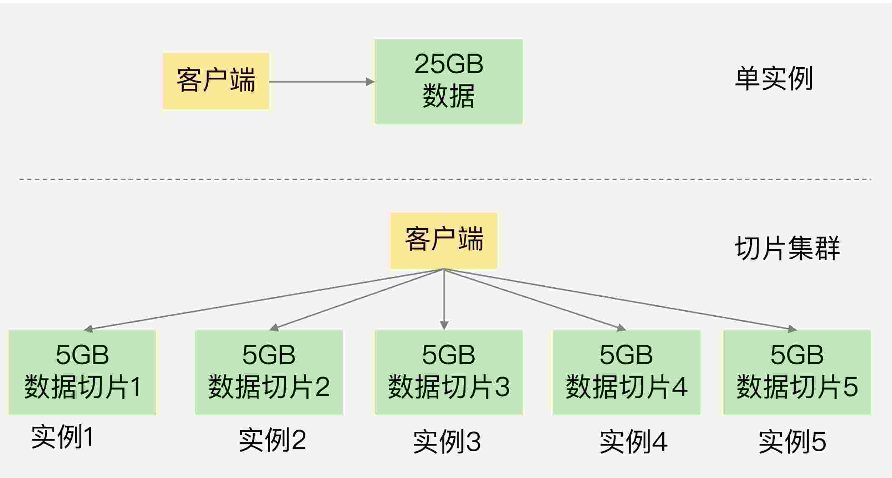

那么，在切片集群中，实例在为 5GB 数据生成 RDB 时，数据量就小了很多，fork 子进程一般不会给主线程带来较长时间的阻塞。采用多个实例保存数据切片后，我们既能保存 25GB 数据，又避免了 fork 子进程阻塞主线程而导致的响应突然变慢。

在实际应用 Redis 时，随着用户或业务规模的扩展，保存大量数据的情况通常是无法避免的。而切片集群，就是一个非常好的解决方案。

### 如何保存更多数据

为了保存大量数据，我们使用了大内存云主机和切片集群两种方法。实际上，这两种方法分别对应着 Redis 应对数据量增多的两种方案：**纵向扩展**（scale up）和**横向扩展**（scale out）。

- 纵向扩展：升级单个 Redis 实例的资源配置，包括增加内存容量、增加磁盘容量、使用更高配置的 CPU。就像下图中，原来的实例内存是 8GB，硬盘是 50GB，纵向扩展后，内存增加到 24GB，磁盘增加到 150GB。
- 横向扩展：横向增加当前 Redis 实例的个数，就像下图中，原来使用 1 个 8GB 内存、50GB 磁盘的实例，现在使用三个相同配置的实例。

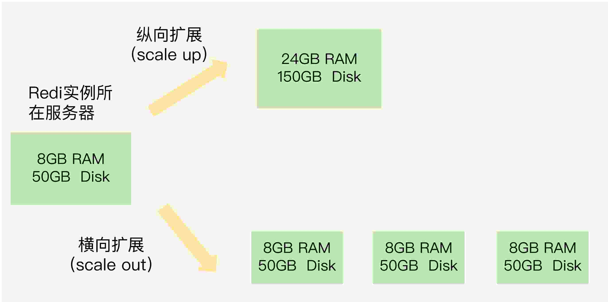

#### 纵向扩展

优点：**实施起来简单、直接**。

缺点：

- 当使用 RDB 对数据进行持久化时，如果数据量增加，需要的内存也会增加，主线程 fork 子进程时就可能会阻塞（比如刚刚的例子中的情况）。不过，如果你不要求持久化保存 Redis 数据，那么，纵向扩展会是一个不错的选择。
- **纵向扩展会受到硬件和成本的限制**。

#### 横向扩展

优点：**扩展性更好**。想保存更多的数据，采用这种方案的话，只用增加 Redis 的实例个数就行了，不用担心单个实例的硬件和成本限制。**在面向百万、千万级别的用户规模时，横向扩展的 Redis 切片集群会是一个非常好的选择**。

缺点：

- 数据切片后，在多个实例之间如何分布？
- 客户端怎么确定想要访问的数据在哪个实例上？

### 数据切片和实例的对应分布关系

切片集群和 Redis Cluster 的联系与区别

切片集群是一种保存大量数据的通用机制，这个机制可以有不同的实现方案。在 Redis 3.0 之前，官方并没有针对切片集群提供具体的方案。从 **3.0 开始**，官方提供了一个名为 Redis Cluster 的方案，用于实现切片集群。Redis Cluster 方案中就规定了数据和实例的对应规则。

具体来说，Redis Cluster 方案采用**哈希槽**（Hash Slot，接下来我会直接称之为 Slot），来处理数据和实例之间的映射关系。在 Redis Cluster 方案中，一个切片集群共有 [16384](https://www.jianshu.com/p/de268f62f99b) 个哈希槽，这些哈希槽类似于数据分区，每个键值对都会根据它的 key，被映射到一个哈希槽中。

具体的映射过程分为两大步：首先根据键值对的 key，按照[CRC16 算法](https://en.wikipedia.org/wiki/Cyclic_redundancy_check)计算一个 16 bit 的值；然后，再用这个 16bit 值对 16384 取模，得到 0~16383 范围内的模数，每个模数代表一个相应编号的哈希槽。

我们在部署 Redis Cluster 方案时，可以使用 `cluster create` 命令创建集群，此时，Redis 会自动把这些槽平均分布在集群实例上。例如，如果集群中有 N 个实例，那么，每个实例上的槽个数为 16384/N 个。

当然， 我们也可以使用 `cluster meet` 命令手动建立实例间的连接，形成集群，再使用 `cluster addslots` 命令，指定每个实例上的哈希槽个数。

数据、哈希槽、实例这三者的映射分布情况。

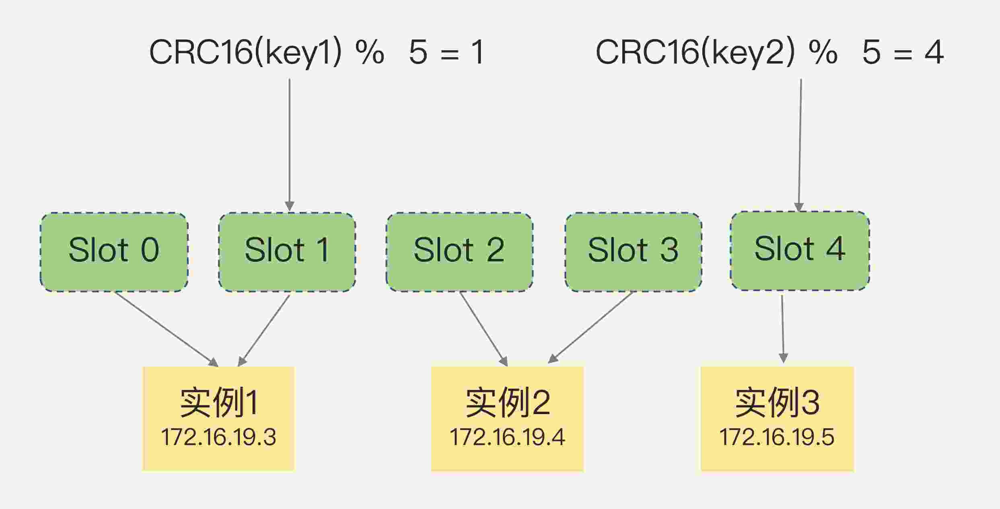

示意图中的切片集群一共有 3 个实例，同时假设有 5 个哈希槽，我们首先可以通过下面的命令手动分配哈希槽：实例 1 保存哈希槽 0 和 1，实例 2 保存哈希槽 2 和 3，实例 3 保存哈希槽 4。

```sh
redis-cli -h 172.16.19.3 –p 6379 cluster addslots 0,1
redis-cli -h 172.16.19.4 –p 6379 cluster addslots 2,3
redis-cli -h 172.16.19.5 –p 6379 cluster addslots 4
```

在集群运行的过程中，key1 和 key2 计算完 CRC16 值后，对哈希槽总个数 5 取模，再根据各自的模数结果，就可以被映射到对应的实例 1 和实例 3 上了。

**在手动分配哈希槽时，需要把 16384 个槽都分配完，否则 Redis 集群无法正常工作**。

### 客户端如何定位数据

一般来说，*客户端和集群实例建立连接后，实例就会把哈希槽的分配信息发给客户端*。但是，在集群刚刚创建的时候，每个实例只知道自己被分配了哪些哈希槽，是不知道其他实例拥有的哈希槽信息的。

那么，客户端为什么可以在访问任何一个实例时，都能获得所有的哈希槽信息呢？这是因为，*Redis 实例会把自己的哈希槽信息发给和它相连接的其它实例，来完成哈希槽分配信息的扩散*。当实例之间相互连接后，每个实例就有所有哈希槽的映射关系了。

客户端收到哈希槽信息后，会把哈希槽信息缓存在本地。当客户端请求键值对时，会先计算键所对应的哈希槽，然后就可以给相应的实例发送请求了。

在集群中，实例和哈希槽的对应关系并不是一成不变的，最常见的变化有两个：

- 在集群中，实例有新增或删除，Redis 需要重新分配哈希槽；
- 为了负载均衡，Redis 需要把哈希槽在所有实例上重新分布一遍。

此时，实例之间还可以通过相互传递消息，获得最新的哈希槽分配信息，但是，客户端是无法主动感知这些变化的。这就会导致，它缓存的分配信息和最新的分配信息就不一致了，那该怎么办呢？

Redis Cluster 方案提供了一种**重定向机制**，所谓的“重定向”，就是指，客户端给一个实例发送数据读写操作时，这个实例上并没有相应的数据，客户端要再给一个新实例发送操作命令。

那客户端又是怎么知道重定向时的新实例的访问地址呢？当客户端把一个键值对的操作请求发给一个实例时，如果这个实例上并没有这个键值对映射的哈希槽，那么，这个实例就会给客户端返回下面的 MOVED 命令响应结果，这个结果中就包含了新实例的访问地址。

```sh
GET hello:key
(error) MOVED 13320 172.16.19.5:6379
```

其中，*MOVED 命令*表示，客户端请求的键值对所在的哈希槽 13320，实际是在 172.16.19.5 这个实例上。通过返回的 MOVED 命令，就相当于把哈希槽所在的新实例的信息告诉给客户端了。这样一来，客户端就可以直接和 172.16.19.5 连接，并发送操作请求了。

用一张图来说明一下，MOVED 重定向命令的使用方法。可以看到，由于负载均衡，Slot 2 中的数据已经从实例 2 迁移到了实例 3，但是，客户端缓存仍然记录着“Slot 2 在实例 2”的信息，所以会给实例 2 发送命令。实例 2 给客户端返回一条 MOVED 命令，把 Slot 2 的最新位置（也就是在实例 3 上），返回给客户端，客户端就会再次向实例 3 发送请求，同时还会更新本地缓存，把 Slot 2 与实例的对应关系更新过来。

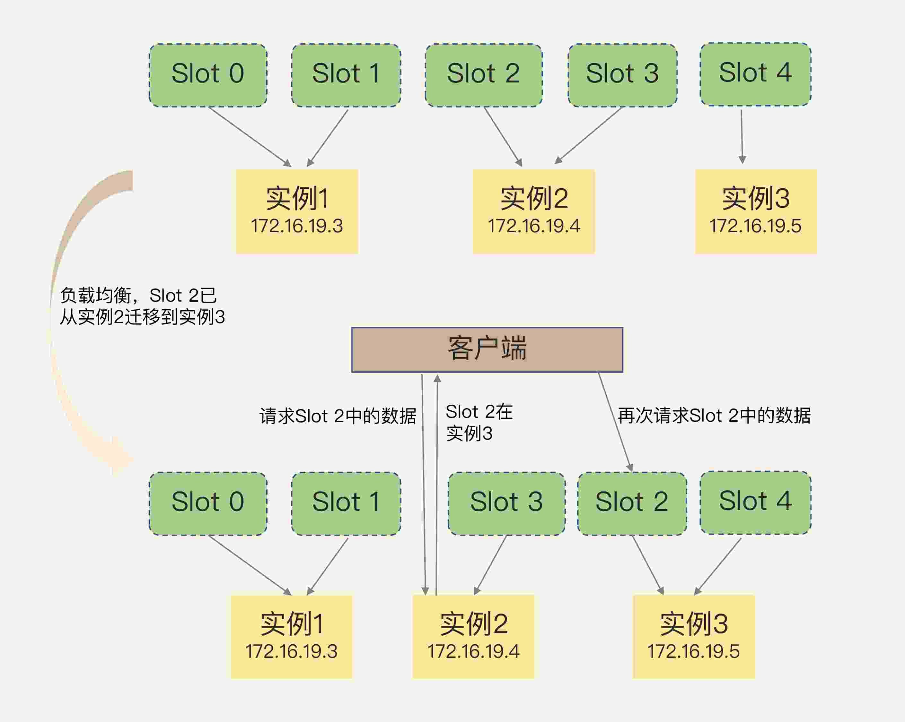

需要注意的是，在上图中，当客户端给实例 2 发送命令时，*Slot 2 中的数据已经全部迁移到了实例 3*。在实际应用时，如果 Slot 2 中的数据比较多，就可能会出现一种情况：客户端向实例 2 发送请求，但此时，Slot 2 中的数据只有一部分迁移到了实例 3，还有部分数据没有迁移。在这种迁移部分完成的情况下，客户端就会收到一条 ASK 报错信息，如下所示：

```sh
GET hello:key
(error) ASK 13320 172.16.19.5:6379
```

这个结果中的 *ASK 命令*就表示，客户端请求的键值对所在的哈希槽 13320，在 172.16.19.5 这个实例上，但是这个哈希槽正在迁移。此时，客户端需要先给 172.16.19.5 这个实例发送一个 ASKING 命令。这个命令的意思是，让这个实例允许执行客户端接下来发送的命令。然后，客户端再向这个实例发送 GET 命令，以读取数据。

再借助图片来解释一下。

在下图中，Slot 2 正在从实例 2 往实例 3 迁移，key1 和 key2 已经迁移过去，key3 和 key4 还在实例 2。客户端向实例 2 请求 key2 后，就会收到实例 2 返回的 ASK 命令。

ASK 命令表示两层含义：

- 表明 Slot 数据还在迁移中；
- ASK 命令把客户端所请求数据的最新实例地址返回给客户端，此时，客户端需要给实例 3 发送 ASKING 命令，然后再发送操作命令。

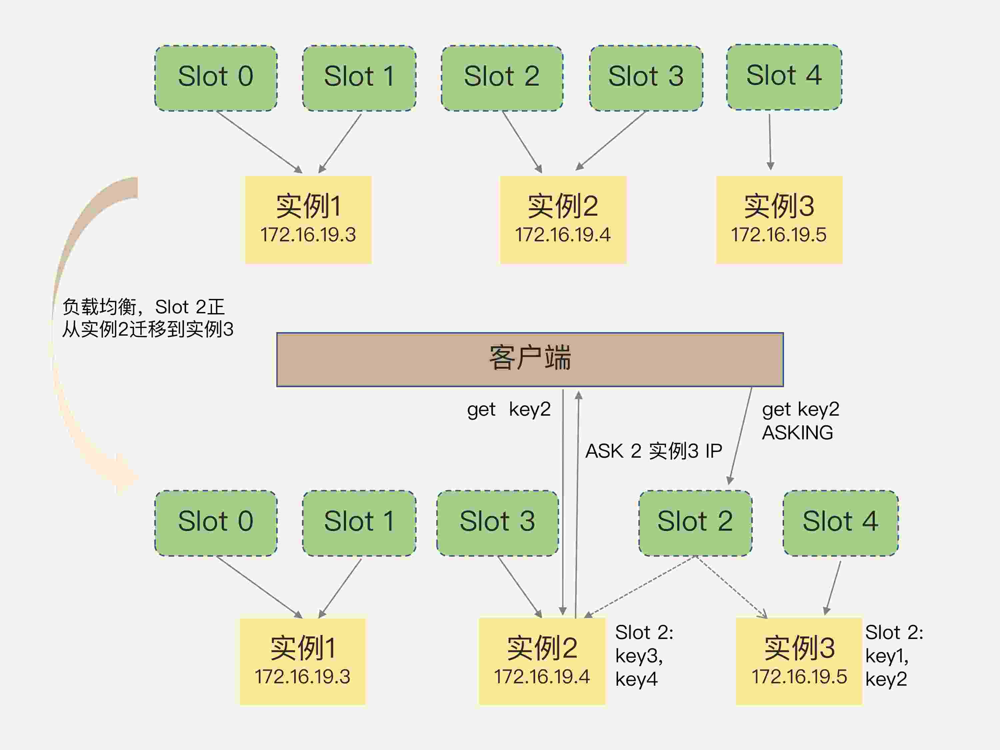

和 MOVED 命令不同，**ASK 命令并不会更新客户端缓存的哈希槽分配信息**。所以，在上图中，如果客户端再次请求 Slot 2 中的数据，它还是会给实例 2 发送请求。这也就是说，ASK 命令的作用只是让客户端能给新实例发送一次请求，而不像 MOVED 命令那样，会更改本地缓存，让后续所有命令都发往新实例。


### 每课一问

Redis Cluster 方案通过哈希槽的方式把键值对分配到不同的实例上，这个过程需要对键值对的 key 做 CRC 计算，然后再和哈希槽做映射，这样做有什么好处吗？如果用一个表直接把键值对和实例的对应关系记录下来（例如键值对 1 在实例 2 上，键值对 2 在实例 1 上），这样就不用计算 key 和哈希槽的对应关系了，只用查表就行了，Redis 为什么不这么做呢？

同学回答：

Redis Cluster不采用把key直接映射到实例的方式，而采用哈希槽的方式原因：

1. 如果使用表记录键值对和实例的对应关系，一旦键值对和实例的对应关系发生了变化（例如实例有增减或者数据重新分布），就要修改表。如果是单线程操作表，那么所有操作都要串行执行，性能慢；如果是多线程操作表，就涉及到加锁开销。此外，如果数据量非常大，使用表记录键值对和实例的对应关系，需要的额外存储空间也会增加。
2. 基于哈希槽计算时，虽然也要记录哈希槽和实例的对应关系，但是哈希槽的个数要比键值对的个数少很多，无论是修改哈希槽和实例的对应关系，还是使用额外空间存储哈希槽和实例的对应关系，都比直接记录键值对和实例的关系的开销小得多。


## 10 | 答疑

### 问题一：rehash 的触发时机和渐进式执行机制

#### Redis 什么时候做 rehash？

Redis 会使用装载因子（load factor）来判断是否需要做 rehash。装载因子的计算方式是，哈希表中所有 entry 的个数除以哈希表的哈希桶个数。Redis 会根据装载因子的两种情况，来触发 rehash 操作：

- 装载因子≥1，同时，哈希表被允许进行 rehash；
- 装载因子≥5。

在第一种情况下，如果装载因子等于 1，同时我们假设，所有键值对是平均分布在哈希表的各个桶中的，那么，此时，哈希表可以不用链式哈希，因为一个哈希桶正好保存了一个键值对。

但是，如果此时再有新的数据写入，哈希表就要使用链式哈希了，这会对查询性能产生影响。在进行 RDB 生成和 AOF 重写时，哈希表的 rehash 是被禁止的，这是为了避免对 RDB 和 AOF 重写造成影响。如果此时，Redis 没有在生成 RDB 和重写 AOF，那么，就可以进行 rehash。否则的话，再有数据写入时，哈希表就要开始使用查询较慢的链式哈希了。

在第二种情况下，也就是装载因子大于等于 5 时，就表明当前保存的数据量已经远远大于哈希桶的个数，哈希桶里会有大量的链式哈希存在，性能会受到严重影响，此时，就立马开始做 rehash。

刚刚说的是触发 rehash 的情况，如果装载因子小于 1，或者装载因子大于 1 但是小于 5，同时哈希表暂时不被允许进行 rehash（例如，实例正在生成 RDB 或者重写 AOF），此时，哈希表是不会进行 rehash 操作的。


#### 采用渐进式 hash 时，如果实例暂时没有收到新请求，是不是就不做 rehash 了？

其实不是的。Redis 会执行定时任务，定时任务中就包含了 rehash 操作。所谓的定时任务，就是按照一定频率（例如每 100ms/ 次）执行的任务。

在 rehash 被触发后，即使没有收到新请求，Redis 也会定时执行一次 rehash 操作，而且，每次执行时长不会超过 1ms，以免对其他任务造成影响。


### 问题 2：主线程、子进程和后台线程的联系与区别

首先，我来解释一下进程和线程的区别。

从操作系统的角度来看，进程一般是指资源分配单元，例如一个进程拥有自己的堆、栈、虚存空间（页表）、文件描述符等；而线程一般是指 CPU 进行调度和执行的实体。

如果一个进程启动后，没有再创建额外的线程，那么，这样的进程一般称为主进程或主线程。

举个例子，下面是我写的一个 C 程序片段，main 函数会直接调用一个 worker 函数，函数 worker 就是执行一个 for 循环计算。下面这个程序运行后，它自己就是一个主进程，同时也是个主线程。

```java
int counter = 0;
void *worker() {  
   for (int i=0;i<10;i++) {
      counter++;
   }  
   return NULL;
}

int main(int argc, char *argv[]) {
   worker();
}
```

和这段代码类似，Redis 启动以后，本身就是一个进程，它会接收客户端发送的请求，并处理读写操作请求。而且，接收请求和处理请求操作是 Redis 的主要工作，Redis 没有再依赖于其他线程，所以，我一般把完成这个主要工作的 Redis 进程，称为主进程或主线程。

在主线程中，我们还可以使用 fork 创建子进程，或是使用 pthread_create 创建线程。下面我先介绍下 Redis 中用 fork 创建的子进程有哪些。

- 创建 RDB 的后台子进程，同时由它负责在主从同步时传输 RDB 给从库；
- 通过无盘复制方式传输 RDB 的子进程；
- bgrewriteaof 子进程。

然后，我们再看下 Redis 使用的线程。从 4.0 版本开始，Redis 也开始使用 pthread_create 创建线程，这些线程在创建后，一般会自行执行一些任务，例如执行异步删除任务。相对于完成主要工作的主线程来说，我们一般可以称这些线程为后台线程。

为了帮助你更好地理解，我画了一张图，展示了它们的区

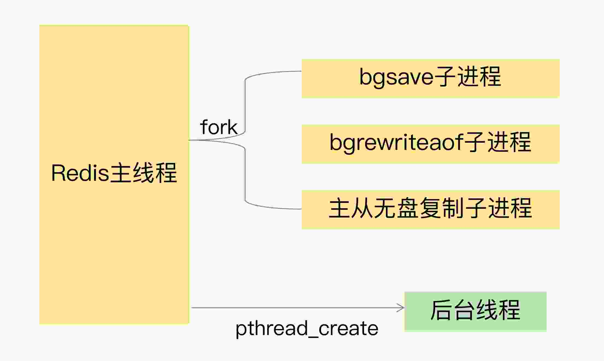


### 问题 3：写时复制的底层实现机制

对 Redis 来说，主线程 fork 出 bgsave 子进程后，bgsave 子进程实际是复制了主线程的页表。这些页表中，就保存了在执行 bgsave 命令时，主线程的所有数据块在内存中的物理地址。这样一来，bgsave 子进程生成 RDB 时，就可以根据页表读取这些数据，再写入磁盘中。如果此时，主线程接收到了新写或修改操作，那么，主线程会使用写时复制机制。具体来说，写时复制就是指，主线程在有写操作时，才会把这个新写或修改后的数据写入到一个新的物理地址中，并修改自己的页表映射。

借助下图中的例子，具体展示一下写时复制的底层机制

bgsave 子进程复制主线程的页表以后，假如主线程需要修改虚页 7 里的数据，那么，主线程就需要新分配一个物理页（假设是物理页 53），然后把修改后的虚页 7 里的数据写到物理页 53 上，而虚页 7 里原来的数据仍然保存在物理页 33 上。这个时候，虚页 7 到物理页 33 的映射关系，仍然保留在 bgsave 子进程中。所以，bgsave 子进程可以无误地把虚页 7 的原始数据写入 RDB 文件。

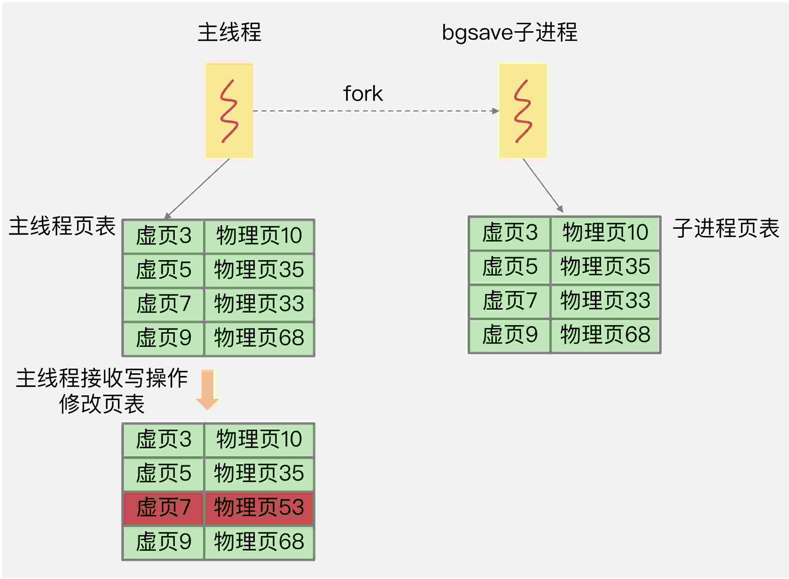


### 问题 4：`replication buffer` 和 `repl_backlog_buffer` 的区别

总的来说，*replication buffer* **是主从库在进行全量复制时，主库上用于和从库连接的客户端的 buffer**，而 *repl_backlog_buffer* **是为了支持从库增量复制，主库上用于持续保存写操作的一块专用 buffer**。

Redis 主从库在进行复制时，当主库要把全量复制期间的写操作命令发给从库时，主库会先创建一个客户端，用来连接从库，然后通过这个客户端，把写操作命令发给从库。在内存中，主库上的客户端就会对应一个 buffer，这个 buffer 就被称为 replication buffer。Redis 通过 client_buffer 配置项来控制这个 buffer 的大小。主库会给每个从库建立一个客户端，所以 replication buffer 不是共享的，而是每个从库都有一个对应的客户端。

repl_backlog_buffer 是一块专用 buffer，在 Redis 服务器启动后，开始一直接收写操作命令，这是所有从库共享的。主库和从库会各自记录自己的复制进度，所以，不同的从库在进行恢复时，会把自己的复制进度（slave_repl_offset）发给主库，主库就可以和它独立同步。

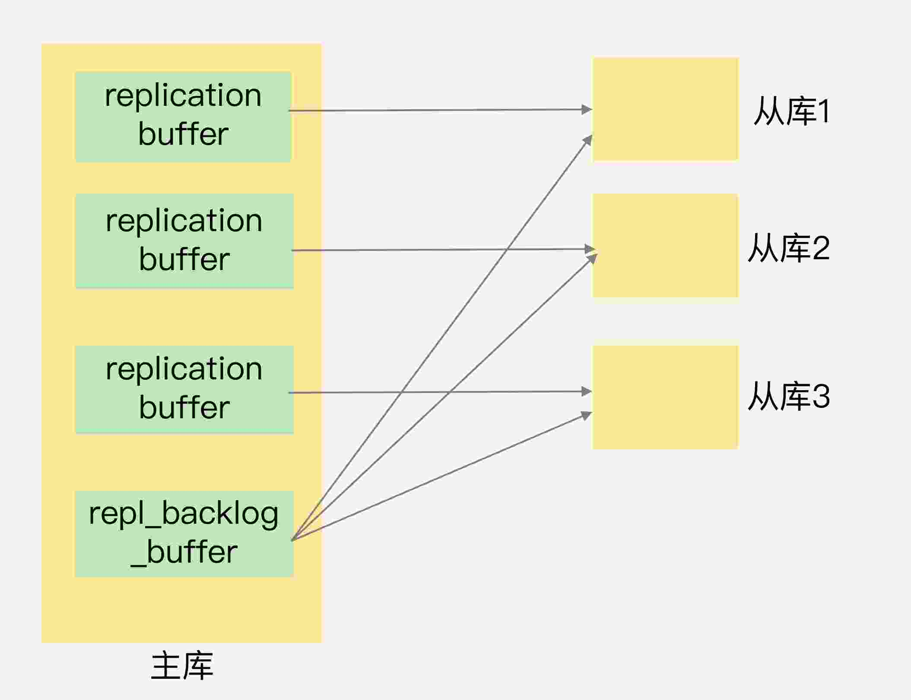

## 11 | “万金油”的String，为什么不好用了

### String 类型的内存空间消耗问题

当时，我们要开发一个图片存储系统，要求这个系统能快速地记录图片 ID 和图片在存储系统中保存时的 ID（可以直接叫作图片存储对象 ID）。同时，还要能够根据图片 ID 快速查找到图片存储对象 ID。

因为图片数量巨大，所以我们就用 10 位数来表示图片 ID 和图片存储对象 ID，例如，图片 ID 为 1101000051，它在存储系统中对应的 ID 号是 3301000051。

```json
photo_id: 1101000051
photo_obj_id: 3301000051
```

可以看到，图片 ID 和图片存储对象 ID 正好一一对应，是典型的“键 - 单值”模式。所谓的“单值”，就是指键值对中的值就是一个值，而不是一个集合，这和 String 类型提供的“一个键对应一个值的数据”的保存形式刚好契合。

而且，String 类型可以保存二进制字节流，就像“万金油”一样，只要把数据转成二进制字节数组，就可以保存了。

所以，我们的第一个方案就是用 String 保存数据。我们把图片 ID 和图片存储对象 ID 分别作为键值对的 key 和 value 来保存，其中，图片存储对象 ID 用了 String 类型。

刚开始，我们保存了 1 亿张图片，大约用了 6.4GB 的内存。但是，随着图片数据量的不断增加，我们的 Redis 内存使用量也在增加，结果就遇到了大内存 Redis 实例因为生成 RDB 而响应变慢的问题。很显然，String 类型并不是一种好的选择，我们还需要进一步寻找能节省内存开销的数据类型方案。

在这个过程中，我深入地研究了 **String 类型的底层结构**，找到了它内存开销大的原因，对“万金油”的 String 类型有了全新的认知：String 类型并不是适用于所有场合的，它有一个明显的短板，就是**它保存数据时所消耗的内存空间较多**。

**集合类型有非常节省内存空间的底层实现结构**，但是，集合类型保存的数据模式，是一个键对应一系列值，并不适合直接保存单值的键值对。所以，我们就使用二级编码的方法，实现了用集合类型保存单值键值对，Redis 实例的内存空间消耗明显下降了。

### 为什么 String 类型内存开销大

在刚才的案例中，我们保存了 1 亿张图片的信息，用了约 6.4GB 的内存，一个图片 ID 和图片存储对象 ID 的记录平均用了 64 字节。

但问题是，一组图片 ID 及其存储对象 ID 的记录，实际只需要 16 字节就可以了。

我们来分析一下。图片 ID 和图片存储对象 ID 都是 10 位数，我们可以用两个 8 字节的 Long 类型表示这两个 ID。因为 8 字节的 Long 类型最大可以表示 2 的 64 次方的数值，所以肯定可以表示 10 位数。但是，为什么 String 类型却用了 64 字节呢？

*除了记录实际数据，String 类型还需要额外的内存空间记录数据长度、空间使用等信息*，这些信息也叫作**元数据**。当实际保存的数据较小时，元数据的空间开销就显得比较大了，有点“喧宾夺主”的意思。

当你保存 64 位有符号整数时，String 类型会把它保存为一个 8 字节的 Long 类型整数，这种保存方式通常也叫作 int 编码方式。

但是，当你保存的数据中包含字符时，String 类型就会用**简单动态字符串**（Simple Dynamic String，SDS）结构体来保存，如下图所示：

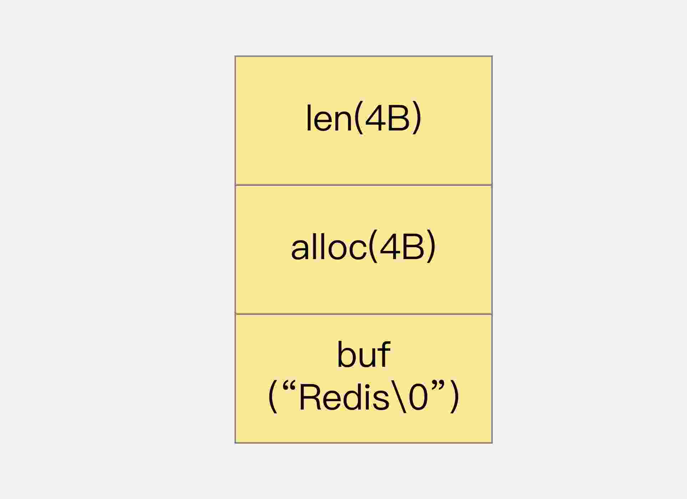

- buf：字节数组，保存实际数据。为了表示字节数组的结束，Redis 会自动在数组最后加一个“\0”，这就会额外占用 1 个字节的开销。
- len：占 4 个字节，表示 buf 的已用长度。
- alloc：也占个 4 字节，表示 buf 的实际分配长度，一般大于 len。

可以看到，在 SDS 中，*buf 保存实际数据，而 len 和 alloc 本身其实是 SDS 结构体的额外开销*。

另外，对于 String 类型来说，除了 SDS 的额外开销，还有一个来自于 RedisObject 结构体的开销。

因为 Redis 的数据类型有很多，而且，不同数据类型都有些相同的元数据要记录（比如最后一次访问的时间、被引用的次数等），所以，*Redis 会用一个 RedisObject 结构体来统一记录这些元数据，同时指向实际数据*。

一个 RedisObject 包含了 8 字节的元数据和一个 8 字节指针，这个指针再进一步指向具体数据类型的实际数据所在，例如指向 String 类型的 SDS 结构所在的内存地址，可以看一下下面的示意图。关于 RedisObject 的具体结构细节，我会在后面的课程中详细介绍，现在你只要了解它的基本结构和元数据开销就行了。

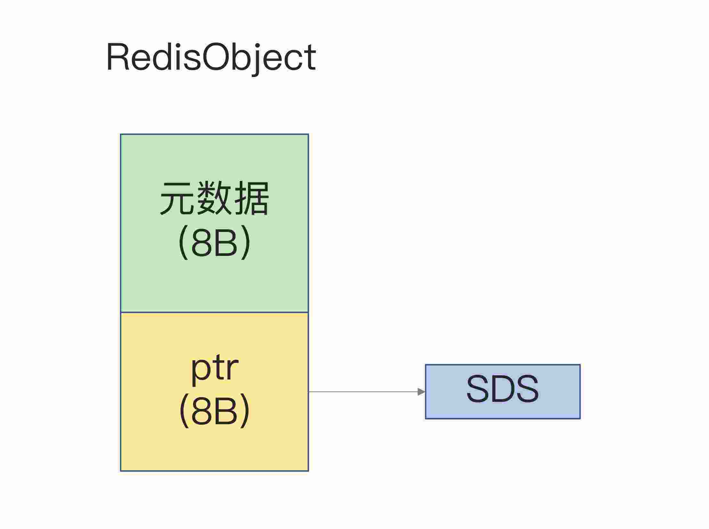

为了节省内存空间，Redis 还对 Long 类型整数和 SDS 的内存布局做了专门的设计。

一方面，当保存的是 Long 类型整数时，RedisObject 中的指针就直接赋值为整数数据了，这样就不用额外的指针再指向整数了，节省了指针的空间开销。

另一方面，当保存的是字符串数据，并且字符串小于等于 44 字节时，RedisObject 中的元数据、指针和 SDS 是一块连续的内存区域，这样就可以避免内存碎片。这种布局方式也被称为 `embstr` 编码方式。

当然，当字符串大于 44 字节时，SDS 的数据量就开始变多了，Redis 就不再把 SDS 和 RedisObject 布局在一起了，而是会给 SDS 分配独立的空间，并用指针指向 SDS 结构。这种布局方式被称为 `raw` 编码模式。

int、embstr 和 raw 这三种编码模式，如下所示：

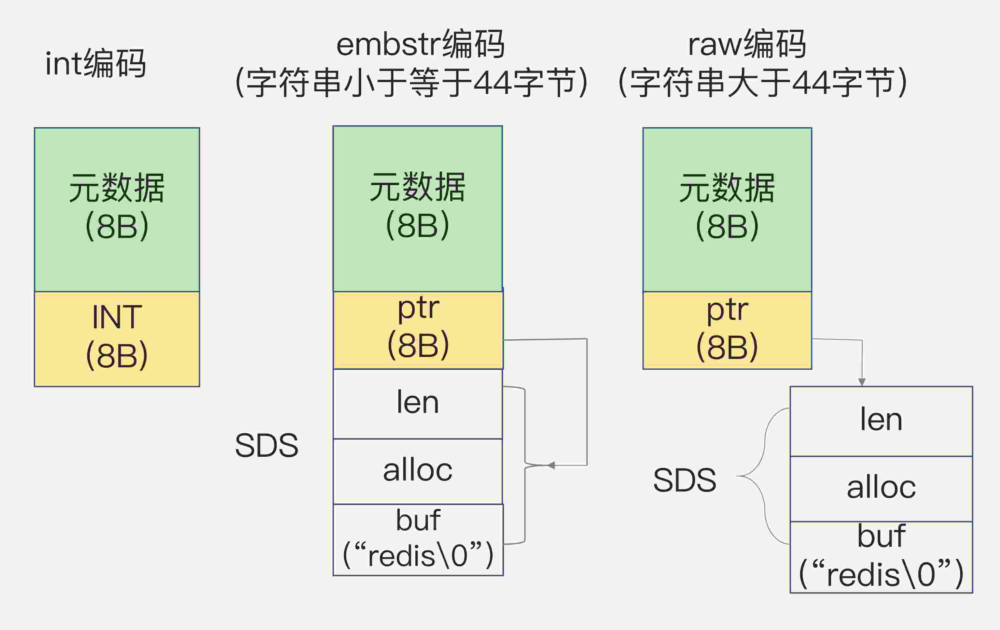

现在，我们就可以计算 String 类型的内存使用量了。

因为 10 位数的图片 ID 和图片存储对象 ID 是 Long 类型整数，所以可以直接用 int 编码的 RedisObject 保存。每个 int 编码的 RedisObject 元数据部分占 8 字节，指针部分被直接赋值为 8 字节的整数了。此时，每个 ID 会使用 16 字节，加起来一共是 32 字节。但是，另外的 32 字节去哪儿了呢？

Redis 会使用一个全局哈希表保存所有键值对，哈希表的每一项是一个 dictEntry 的结构体，用来指向一个键值对。dictEntry 结构中有三个 8 字节的指针，分别指向 key、value 以及下一个 dictEntry，三个指针共 24 字节，如下图所示：

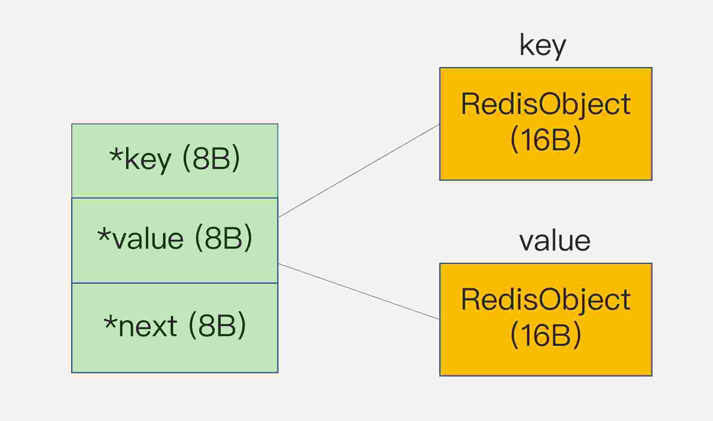

但是，这三个指针只有 24 字节，为什么会占用了 32 字节呢？这就要提到 Redis 使用的内存分配库 `jemalloc` 了。

jemalloc 在分配内存时，会根据我们申请的字节数 N，找一个比 N 大，但是最接近  **$2^{n}$数**作为分配的空间，这样可以减少频繁分配的次数。举个例子。如果你申请 6 字节空间，jemalloc 实际会分配 8 字节空间；如果你申请 24 字节空间，jemalloc 则会分配 32 字节。所以，在我们刚刚说的场景里，dictEntry 结构就占用了 32 字节。

到这儿，你应该就能理解，为什么用 String 类型保存图片 ID 和图片存储对象 ID 时需要用 64 个字节了。

明明有效信息只有 16 字节，使用 String 类型保存时，却需要 64 字节的内存空间，有 48 字节都没有用于保存实际的数据。我们来换算下，如果要保存的图片有 1 亿张，那么 1 亿条的图片 ID 记录就需要 6.4GB 内存空间，其中有 4.8GB 的内存空间都用来保存元数据了，额外的内存空间开销很大。那么，有没有更加节省内存的方法呢？

### 用什么数据结构可以节省内存

Redis 有一种底层数据结构，叫**压缩列表**（ziplist），这是一种非常节省内存的结构。表头有三个字段 zlbytes、zltail 和 zllen，分别表示列表长度、列表尾的偏移量，以及列表中的 entry 个数。压缩列表尾还有一个 zlend，表示列表结束。

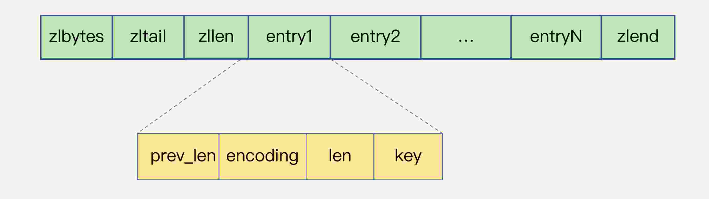

压缩列表之所以能节省内存，就在于它是用一系列连续的 entry 保存数据。每个 entry 的元数据包括下面几部分。

- prev_len，表示前一个 entry 的长度。prev_len 有两种取值情况：1 字节或 5 字节。取值 1 字节时，表示上一个 entry 的长度小于 254 字节。虽然 1 字节的值能表示的数值范围是 0 到 255，但是压缩列表中 zlend 的取值默认是 255，因此，就默认用 255 表示整个压缩列表的结束，其他表示长度的地方就不能再用 255 这个值了。所以，当上一个 entry 长度小于 254 字节时，prev_len 取值为 1 字节，否则，就取值为 5 字节。
- len：表示自身长度，4 字节；
- encoding：表示编码方式，1 字节；
- content：保存实际数据。

这些 entry 会挨个儿放置在内存中，不需要再用额外的指针进行连接，这样就可以节省指针所占用的空间。

我们以保存图片存储对象 ID 为例，来分析一下压缩列表是如何节省内存空间的。

每个 entry 保存一个图片存储对象 ID（8 字节），此时，每个 entry 的 prev_len 只需要 1 个字节就行，因为每个 entry 的前一个 entry 长度都只有 8 字节，小于 254 字节。这样一来，一个图片的存储对象 ID 所占用的内存大小是 14 字节（1+4+1+8=14），实际分配 16 字节。

Redis 基于压缩列表实现了 List、Hash 和 Sorted Set 这样的集合类型，这样做的最大好处就是节省了 dictEntry 的开销。当你用 String 类型时，一个键值对就有一个 dictEntry，要用 32 字节空间。但采用集合类型时，一个 key 就对应一个集合的数据，能保存的数据多了很多，但也只用了一个 dictEntry，这样就节省了内存。

但还存在一个问题：在用集合类型保存键值对时，一个键对应了一个集合的数据，但是在我们的场景中，一个图片 ID 只对应一个图片的存储对象 ID，我们该怎么用集合类型呢？换句话说，在一个键对应一个值（也就是单值键值对）的情况下，我们该怎么用集合类型来保存这种单值键值对呢？

### 如何用集合类型保存单值的键值对

在保存单值的键值对时，可以采用基于 Hash 类型的二级编码方法。这里说的二级编码，就是把一个单值的数据拆分成两部分，前一部分作为 Hash 集合的 key，后一部分作为 Hash 集合的 value，这样一来，我们就可以把单值数据保存到 Hash 集合中了。

以图片 ID 1101000060 和图片存储对象 ID 3302000080 为例，我们可以把图片 ID 的前 7 位（1101000）作为 Hash 类型的键，把图片 ID 的最后 3 位（060）和图片存储对象 ID 分别作为 Hash 类型值中的 key 和 value。

按照这种设计方法，我在 Redis 中插入了一组图片 ID 及其存储对象 ID 的记录，并且用 info 命令查看了内存开销，我发现，增加一条记录后，内存占用只增加了 16 字节，如下所示：

```sh
127.0.0.1:6379> info memory
# Memory
used_memory:1039120
127.0.0.1:6379> hset 1101000 060 3302000080
(integer) 1
127.0.0.1:6379> info memory
# Memory
used_memory:1039136
```

在使用 String 类型时，每个记录需要消耗 64 字节，这种方式却只用了 16 字节，所使用的内存空间是原来的 1/4，满足了我们节省内存空间的需求。

不过，你可能也会有疑惑：“二级编码一定要把图片 ID 的前 7 位作为 Hash 类型的键，把最后 3 位作为 Hash 类型值中的 key 吗？”其实，二级编码方法中采用的 ID 长度是有讲究的。

Hash 类型底层结构什么时候使用压缩列表，什么时候使用哈希表呢？其实，Hash 类型设置了用压缩列表保存数据时的两个阈值，一旦超过了阈值，Hash 类型就会用哈希表来保存数据了。

这两个阈值分别对应以下两个配置项：

1. hash-max-ziplist-entries：表示用压缩列表保存时哈希集合中的最大元素个数。默认512。
2. hash-max-ziplist-value：表示用压缩列表保存时哈希集合中单个元素的最大长度。默认64。

<!--哈希对象可以同时满足以下两个条件时， 哈希对象使用 ziplist 编码：
\1. 哈希对象保存的键值对数量小于 512 个；
\2. 哈希对象保存的所有键值对的键和值的字符串长度都小于 64 字节；-->

如果我们往 Hash 集合中写入的元素个数超过了 hash-max-ziplist-entries，或者写入的单个元素大小超过了 hash-max-ziplist-value，Redis 就会自动把 *Hash 类型的实现结构由压缩列表转为哈希表*。

一旦从压缩列表转为了哈希表，Hash 类型就会一直用哈希表进行保存，而不会再转回压缩列表了。在节省内存空间方面，哈希表就没有压缩列表那么高效了。

**为了能充分使用压缩列表的精简内存布局，我们一般要控制保存在 Hash 集合中的元素个数**。所以，在刚才的二级编码中，我们只用图片 ID 最后 3 位作为 Hash 集合的 key，也就保证了 Hash 集合的元素个数不超过 1000，同时，我们把 hash-max-ziplist-entries 设置为 1000，这样一来，Hash 集合就可以一直使用压缩列表来节省内存空间了。

小方法：如果你想知道键值对采用不同类型保存时的内存开销，可以在[这个网址](http://www.redis.cn/redis_memory/)里输入你的键值对长度和使用的数据类型，这样就能知道实际消耗的内存大小了。建议你把这个小工具用起来，它可以帮助你充分地节省内存。

### 每课一问

除了 String 类型和 Hash 类型，你觉得，还有其他合适的类型可以应用在这节课所说的保存图片的例子吗？

答案：除了 String 和 Hash，我们还可以使用 Sorted Set 类型进行保存。Sorted Set 的元素有 member 值和 score 值，可以像 Hash 那样，使用二级编码进行保存。具体做法是，把图片 ID 的前 7 位作为 Sorted Set 的 key，把图片 ID 的后 3 位作为 member 值，图片存储对象 ID 作为 score 值。

Sorted Set 中元素较少时，Redis 会使用压缩列表进行存储，可以节省内存空间。不过，和 Hash 不一样，Sorted Set 插入数据时，需要按 score 值的大小排序。当底层结构是压缩列表时，Sorted Set 的插入性能就比不上 Hash。所以，在我们这节课描述的场景中，Sorted Set 类型虽然可以用来保存，但并不是最优选项。


## 12 | 有一亿个keys要统计，应该用哪种集合

当面临的用户数量以及访问量都是百万、千万、甚至亿级的时候，我们必须要选择能够非常高效地统计大量数据（例如亿级）的集合类型。

**要想选择合适的集合，我们就得了解常用的集合统计模式**。集合类型常见的四种统计模式，包括**聚合统计、排序统计、二值状态统计和基数统计**。

### 聚合统计

所谓的聚合统计，就是指**统计多个集合元素的聚合结果**，包括：统计多个集合的共有元素（*交集统计*）；把两个集合相比，统计其中一个集合独有的元素（*差集统计*）；统计多个集合的所有元素（*并集统计*）。

统计手机 App 每天的新增用户数和第二天的留存用户数，正好对应了聚合统计。

要完成这个统计任务，我们可以用一个集合记录所有登录过 App 的用户 ID，同时，用另一个集合记录每一天登录过 App 的用户 ID。然后，再对这两个集合做聚合统计。我们来看下具体的操作。

记录所有登录过 App 的用户 ID 还是比较简单的，我们可以直接使用 Set 类型，把 key 设置为 user:id，表示记录的是用户 ID，value 就是一个 Set 集合，里面是所有登录过 App 的用户 ID，我们可以把这个 Set 叫作累计用户 Set，如下图所示：

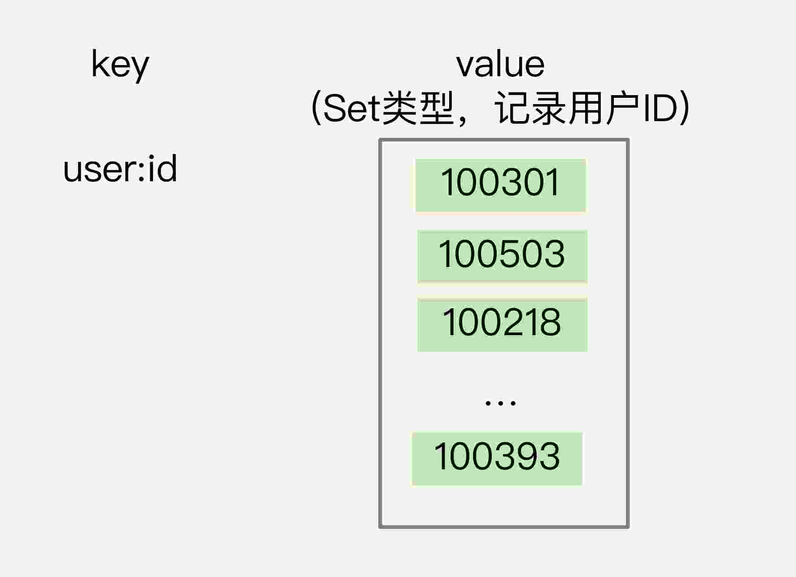

需要注意的是，累计用户 Set 中没有日期信息，我们是不能直接统计每天的新增用户的。所以，我们还需要把每一天登录的用户 ID，记录到一个新集合中，我们把这个集合叫作每日用户 Set，它有两个特点：

1. key 是 user:id 以及当天日期，例如 `user:id:20200803`；
2. value 是 Set 集合，记录当天登录的用户 ID。

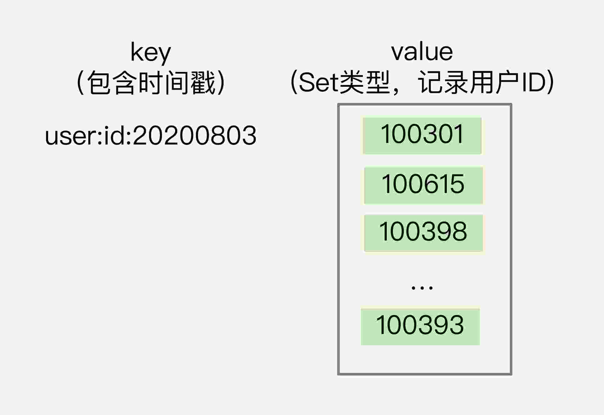

在统计每天的新增用户时，我们只用计算每日用户 Set 和累计用户 Set 的差集就行。

假设我们的手机 App 在 2020 年 8 月 3 日上线，那么，8 月 3 日前是没有用户的。此时，累计用户 Set 是空集，当天登录的用户 ID 会被记录到 key 为 `user:id:20200803` 的 Set 中。所以，`user:id:20200803` 这个 Set 中的用户就是当天的新增用户。

然后，我们计算累计用户 Set 和 `user:id:20200803` Set 的并集结果，结果保存在 user:id 这个累计用户 Set 中，如下所示：

```sh
SUNIONSTORE  user:id  user:id  user:id:20200803 
```

此时，`user:id` 这个累计用户 Set 中就有了 8 月 3 日的用户 ID。等到 8 月 4 日再统计时，我们把 8 月 4 日登录的用户 ID 记录到 `user:id:20200804` 的 Set 中。接下来，我们执行 SDIFFSTORE 命令计算累计用户 Set 和 `user:id:20200804` Set 的差集，结果保存在 key 为 `user:new` 的 Set 中，如下所示：

```sh
SDIFFSTORE  user:new  user:id:20200804 user:id  
```

可以看到，这个*差集*中的用户 ID 在 `user:id:20200804` 的 Set 中存在，但是不在累计用户 Set 中。所以，`user:new` 这个 Set 中记录的就是 8 月 4 日的新增用户。

当要计算 8 月 4 日的留存用户时，我们只需要再计算 `user:id:20200803` 和 `user:id:20200804` 两个 Set 的*交集*，就可以得到同时在这两个集合中的用户 ID 了，这些就是在 8 月 3 日登录，并且在 8 月 4 日留存的用户。执行的命令如下：

```sh
SINTERSTORE user:id:rem user:id:20200803 user:id:20200804
```


当你需要对多个集合进行**聚合计算**时，**Set 类型**会是一个非常不错的选择。不过，我要提醒你一下，这里有一个潜在的风险。

Set 的差集、并集和交集的计算复杂度较高，在数据量较大的情况下，如果直接执行这些计算，会导致 Redis 实例阻塞。所以，我给你分享一个小建议：**你可以从主从集群中选择一个从库，让它专门负责聚合计算，或者是把数据读取到客户端，在客户端来完成聚合统计**，这样就可以规避阻塞主库实例和其他从库实例的风险了。

### 排序统计

以在电商网站上提供最新评论列表的场景为例，进行讲解。

最新评论列表包含了所有评论中的最新留言，这就**要求集合类型能对元素保序**，也就是说，集合中的元素可以按序排列，这种对元素保序的集合类型叫作**有序集合**。

在 Redis 常用的 4 个集合类型中（List、Hash、Set、Sorted Set），**List 和 Sorted Set 就属于有序集合**。

**List 是按照元素进入 List 的顺序进行排序的，而 Sorted Set 可以根据元素的权重来排序**，我们可以自己来决定每个元素的权重值。比如说，我们可以根据元素插入 Sorted Set 的时间确定权重值，先插入的元素权重小，后插入的元素权重大。

我先说说用 List 的情况。每个商品对应一个 List，这个 List 包含了对这个商品的所有评论，而且会按照评论时间保存这些评论，每来一个新评论，就用 LPUSH 命令把它插入 List 的队头。

在只有一页评论的时候，我们可以很清晰地看到最新的评论，但是，在实际应用中，网站一般会分页显示最新的评论列表，*一旦涉及到分页操作，List 就可能会出现问题了*。

假设当前的评论 List 是{A, B, C, D, E, F}（其中，A 是最新的评论，以此类推，F 是最早的评论），在展示第一页的 3 个评论时，我们可以用下面的命令，得到最新的三条评论 A、B、C：

```sh
LRANGE product1 0 2
1) "A"
2) "B"
3) "C"
```

然后，再用下面的命令获取第二页的 3 个评论，也就是 D、E、F。

```sh
LRANGE product1 3 5
1) "D"
2) "E"
3) "F"
```

但是，如果在展示第二页前，又产生了一个新评论 G，评论 G 就会被 LPUSH 命令插入到评论 List 的队头，评论 List 就变成了{G, A, B, C, D, E, F}。此时，再用刚才的命令获取第二页评论时，就会发现，评论 C 又被展示出来了，也就是 C、D、E。

```sh
LRANGE product1 3 5
1) "C"
2) "D"
3) "E"
```

之所以会这样，关键原因就在于，List 是通过元素在 List 中的位置来排序的，当有一个新元素插入时，原先的元素在 List 中的位置都后移了一位，比如说原来在第 1 位的元素现在排在了第 2 位。所以，对比新元素插入前后，List 相同位置上的元素就会发生变化，用 LRANGE 读取时，就会读到旧元素。

和 List 相比，*Sorted Set 就不存在这个问题*，因为*它是根据元素的实际权重来排序和获取数据的*。

我们可以按评论时间的先后给每条评论设置一个权重值，然后再把评论保存到 Sorted Set 中。Sorted Set 的 ZRANGEBYSCORE 命令就可以按权重排序后返回元素。这样的话，即使集合中的元素频繁更新，Sorted Set 也能通过 ZRANGEBYSCORE 命令准确地获取到按序排列的数据。

假设越新的评论权重越大，目前最新评论的权重是 N，我们执行下面的命令时，就可以获得最新的 10 条评论：

```sh
ZRANGEBYSCORE comments N-9 N
```

所以，在*面对需要展示最新列表、排行榜等场景时，如果数据更新频繁或者需要分页显示，建议你优先考虑使用 Sorted Set*。

### 二值状态统计

这里的二值状态就是指*集合元素的取值就只有 0 和 1 两种*。在签到打卡的场景中，我们只用记录签到（1）或未签到（0），所以它就是非常典型的二值状态。

在签到统计时，每个用户一天的签到用 1 个 bit 位就能表示，一个月（假设是 31 天）的签到情况用 31 个 bit 位就可以，而一年的签到也只需要用 365 个 bit 位，根本不用太复杂的集合类型。这个时候，我们就可以选择 *Bitmap*。这是 Redis 提供的扩展数据类型。我来给你解释一下它的实现原理。

`Bitmap` 本身是**用 String 类型作为底层数据结构实现的一种统计二值状态的数据类型**。String 类型是会保存为二进制的字节数组，所以，Redis 就把字节数组的每个 bit 位利用起来，用来表示一个元素的二值状态。你可以把 Bitmap 看作是一个 bit 数组。

Bitmap 提供了 `GETBIT/SETBIT` 操作，使用一个偏移值 offset 对 bit 数组的某一个 bit 位进行读和写。不过，需要注意的是，Bitmap 的偏移量是从 0 开始算的，也就是说 offset 的最小值是 0。当使用 SETBIT 对一个 bit 位进行写操作时，这个 bit 位会被设置为 1。Bitmap 还提供了 BITCOUNT 操作，用来统计这个 bit 数组中所有“1”的个数。

那么，具体该怎么用 Bitmap 进行签到统计呢？我还是借助一个具体的例子来说明。

假设我们要统计 ID 3000 的用户在 2020 年 8 月份的签到情况，就可以按照下面的步骤进行操作。

第一步，执行下面的命令，记录该用户 8 月 3 号已签到。

```sh
SETBIT uid:sign:3000:202008 2 1 
```

第二步，检查该用户 8 月 3 日是否签到。

```sh
GETBIT uid:sign:3000:202008 2 
```

第三步，统计该用户在 8 月份的签到次数。

```sh
BITCOUNT uid:sign:3000:202008
```

这样，我们就知道该用户在 8 月份的签到情况了，是不是很简单呢？接下来，你可以再思考一个问题：如果记录了 1 亿个用户 10 天的签到情况，你有办法统计出这 10 天连续签到的用户总数吗？

在介绍具体的方法之前，我们要先知道，Bitmap 支持用 BITOP 命令对多个 Bitmap 按位做“与”“或”“异或”的操作，操作的结果会保存到一个新的 Bitmap 中。

我以按位“与”操作为例来具体解释一下。从下图中，可以看到，三个 Bitmap bm1、bm2 和 bm3，对应 bit 位做“与”操作，结果保存到了一个新的 Bitmap 中（示例中，这个结果 Bitmap 的 key 被设为“resmap”）。

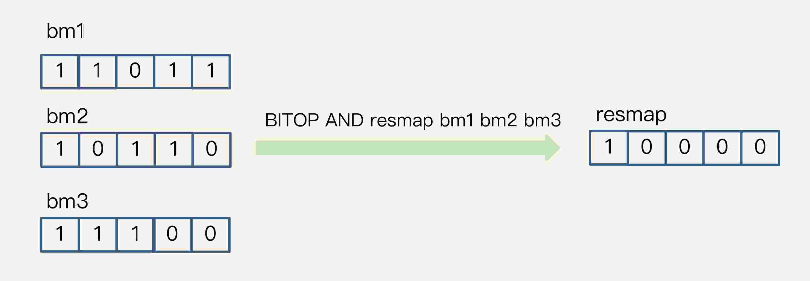

回到刚刚的问题，在统计 1 亿个用户连续 10 天的签到情况时，你可以把每天的日期作为 key，每个 key 对应一个 1 亿位的 Bitmap，每一个 bit 对应一个用户当天的签到情况。

接下来，我们对 10 个 Bitmap 做“与”操作，得到的结果也是一个 Bitmap。在这个 Bitmap 中，只有 10 天都签到的用户对应的 bit 位上的值才会是 1。最后，我们可以用 BITCOUNT 统计下 Bitmap 中的 1 的个数，这就是连续签到 10 天的用户总数了。

现在，我们可以计算一下记录了 10 天签到情况后的内存开销。每天使用 1 个 1 亿位的 Bitmap，大约占 12MB 的内存（10^8/8/1024/1024），10 天的 Bitmap 的内存开销约为 120MB，内存压力不算太大。不过，在实际应用时，最好对 Bitmap 设置过期时间，让 Redis 自动删除不再需要的签到记录，以节省内存开销。

所以，如果只需要统计数据的二值状态，例如商品有没有、用户在不在等，就可以使用 Bitmap，因为它只用一个 bit 位就能表示 0 或 1。在记录海量数据时，Bitmap 能够有效地节省内存空间。

### 基数统计

**基数统计就是指统计一个集合中不重复的元素个数**。对应到我们刚才介绍的场景中，就是统计网页的 UV。

网页 UV 的统计有个独特的地方，就是需要去重，一个用户一天内的多次访问只能算作一次。在 Redis 的集合类型中，Set 类型默认支持去重，所以看到有去重需求时，我们可能第一时间就会想到用 Set 类型。

我们来结合一个例子看一看用 Set 的情况。

有一个用户 user1 访问 page1 时，你把这个信息加到 Set 中：

```sh
SADD page1:uv user1
```

用户 1 再来访问时，Set 的去重功能就保证了不会重复记录用户 1 的访问次数，这样，用户 1 就算是一个独立访客。当你需要统计 UV 时，可以直接用 `SCARD` 命令，这个命令会返回一个集合中的元素个数。

但是，如果 page1 非常火爆，UV 达到了千万，这个时候，一个 Set 就要记录千万个用户 ID。对于一个搞大促的电商网站而言，这样的页面可能有成千上万个，如果每个页面都用这样的一个 Set，就会消耗很大的内存空间。

当然，你也可以用 Hash 类型记录 UV。

例如，你可以把用户 ID 作为 Hash 集合的 key，当用户访问页面时，就用 HSET 命令（用于设置 Hash 集合元素的值），对这个用户 ID 记录一个值“1”，表示一个独立访客，用户 1 访问 page1 后，我们就记录为 1 个独立访客，如下所示：

```sh
HSET page1:uv user1 1
```

即使用户 1 多次访问页面，重复执行这个 HSET 命令，也只会把 user1 的值设置为 1，仍然只记为 1 个独立访客。当要统计 UV 时，我们可以用 HLEN 命令统计 Hash 集合中的所有元素个数。

但是，和 Set 类型相似，当页面很多时，Hash 类型也会消耗很大的内存空间。那么，有什么办法既能完成统计，还能节省内存吗？

这时候，就要用到 Redis 提供的 HyperLogLog 了。

**HyperLogLog 是一种用于统计基数的数据集合类型**，它的最大优势就在于，**当集合元素数量非常多时，它计算基数所需的空间总是固定的，而且还很小**。

在 Redis 中，每个 HyperLogLog 只需要花费 12 KB 内存，就可以计算接近 2^64 个元素的基数。你看，和元素越多就越耗费内存的 Set 和 Hash 类型相比，HyperLogLog 就非常节省空间。

在统计 UV 时，你可以用 PFADD 命令（用于向 HyperLogLog 中添加新元素）把访问页面的每个用户都添加到 HyperLogLog 中。

```sh
PFADD page1:uv user1 user2 user3 user4 user5
```

接下来，就可以用 PFCOUNT 命令直接获得 page1 的 UV 值了，这个命令的作用就是返回 HyperLogLog 的统计结果。

```sh
PFCOUNT page1:uv
```

关于 HyperLogLog 的具体实现原理，你不需要重点掌握，不会影响到你的日常使用，我就不多讲了。如果你想了解一下，课下可以看看[这条链接](https://en.wikipedia.org/wiki/HyperLogLog)。

不过，有一点需要你注意一下，**HyperLogLog 的统计规则是基于概率完成的，所以它给出的统计结果是有一定误差的，标准误算率是 0.81%**。这也就意味着，你使用 HyperLogLog 统计的 UV 是 100 万，但实际的 UV 可能是 101 万。虽然误差率不算大，但是，如果你需要精确统计结果的话，最好还是继续用 Set 或 Hash 类型。

### 小结

Set、Sorted Set、Hash、List、Bitmap、HyperLogLog 的支持情况和优缺点汇总：

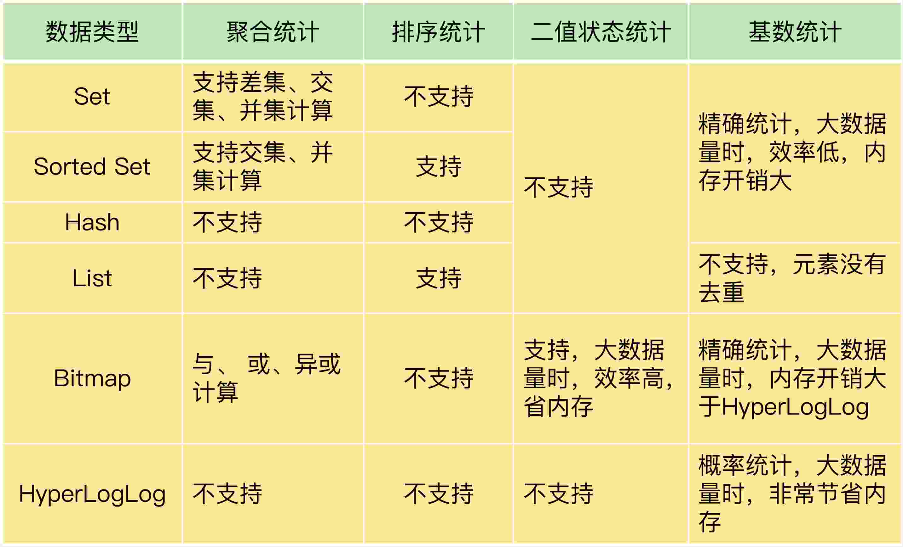

可以看到，Set 和 Sorted Set 都支持多种聚合统计，不过，对于差集计算来说，只有 Set 支持。Bitmap 也能做多个 Bitmap 间的聚合计算，包括与、或和异或操作。

当需要进行排序统计时，List 中的元素虽然有序，但是一旦有新元素插入，原来的元素在 List 中的位置就会移动，那么，按位置读取的排序结果可能就不准确了。而 Sorted Set 本身是按照集合元素的权重排序，可以准确地按序获取结果，所以建议你优先使用它。

如果我们记录的数据只有 0 和 1 两个值的状态，Bitmap 会是一个很好的选择，这主要归功于 Bitmap 对于一个数据只用 1 个 bit 记录，可以节省内存。

对于基数统计来说，如果集合元素量达到亿级别而且不需要精确统计时，我建议你使用 HyperLogLog。

### 每课一问

聊一聊，你还遇到过其他的统计场景吗？用的是怎样的集合类型呢？

答案：@海拉鲁同学在留言中提供了一种场景：他们曾使用 List+Lua 统计最近 200 个客户的触达率。具体做法是，每个 List 元素表示一个客户，元素值为 0，代表触达；元素值为 1，就代表未触达。在进行统计时，应用程序会把代表客户的元素写入队列中。当需要统计触达率时，就使用 LRANGE key 0 -1 取出全部元素，计算 0 的比例，这个比例就是触达率。

这个例子需要获取全部元素，不过数据量只有 200 个，不算大，所以，使用 List，在实际应用中也是可以接受的。但是，如果数据量很大，又有其他查询需求的话（例如查询单个元素的触达情况），List 的操作复杂度较高，就不合适了，可以考虑使用 Hash 类型。


## 13 | GEO是什么？还可以定义新的数据类型吗

Redis 的 5 大基本数据类型：*String、List、Hash、Set 和 Sorted Set*，它们可以满足大多数的数据存储需求，但是在面对海量数据统计时，它们的内存开销很大，而且对于一些特殊的场景，它们是无法支持的。所以，Redis 还提供了 3 种扩展数据类型，分别是 *Bitmap、HyperLogLog 和 GEO*。

### 面向 LBS 应用的 GEO 数据类型

在日常生活中，我们越来越依赖搜索“附近的餐馆”、在打车软件上叫车，这些都离不开**基于位置信息服务**（Location-Based Service，LBS）的应用。LBS 应用访问的数据是和人或物关联的一组经纬度信息，而且要能查询相邻的经纬度范围，GEO 就非常适合应用在 LBS 服务的场景中，我们来看一下它的底层结构。

#### GEO 的底层结构

**一般来说，在设计一个数据类型的底层结构时，我们首先需要知道，要处理的数据有什么访问特点**。所以，我们需要先搞清楚位置信息到底是怎么被存取的。

我以叫车服务为例，来分析下 LBS 应用中经纬度的存取特点。

- 每一辆网约车都有一个编号（例如 33），网约车需要将自己的经度信息（例如 116.034579）和纬度信息（例如 39.000452 ）发给叫车应用。
- 用户在叫车的时候，叫车应用会根据用户的经纬度位置（例如经度 116.054579，纬度 39.030452），查找用户的附近车辆，并进行匹配。
- 等把位置相近的用户和车辆匹配上以后，叫车应用就会根据车辆的编号，获取车辆的信息，并返回给用户。

可以看到，一辆车（或一个用户）对应一组经纬度，并且随着车（或用户）的位置移动，相应的经纬度也会变化。

这种数据记录模式属于一个 key（例如车 ID）对应一个 value（一组经纬度）。当有很多车辆信息要保存时，就需要有一个集合来保存一系列的 key 和 value。Hash 集合类型可以快速存取一系列的 key 和 value，正好可以用来记录一系列车辆 ID 和经纬度的对应关系，所以，我们可以把不同车辆的 ID 和它们对应的经纬度信息存在 Hash 集合中，如下图所示：

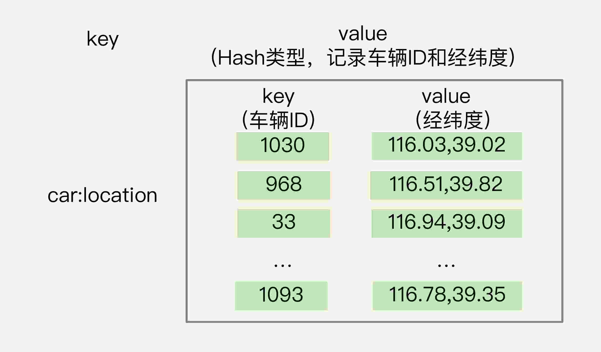

同时，Hash 类型的 HSET 操作命令，会根据 key 来设置相应的 value 值，所以，我们可以用它来快速地更新车辆变化的经纬度信息。

到这里，Hash 类型看起来是一个不错的选择。但问题是，对于一个 LBS 应用来说，除了记录经纬度信息，还需要根据用户的经纬度信息在车辆的 *Hash 集合中进行范围查询*。一旦涉及到范围查询，就意味着集合中的元素需要有序，但 Hash 类型的元素是无序的，显然不能满足我们的要求。

再来看看使用 Sorted Set 类型是不是合适。

Sorted Set 类型也支持一个 key 对应一个 value 的记录模式，其中，key 就是 Sorted Set 中的元素，而 value 则是元素的权重分数。更重要的是，Sorted Set 可以根据元素的权重分数排序，支持范围查询。这就能满足 LBS 服务中查找相邻位置的需求了。

**GEO 类型的底层数据结构就是用 Sorted Set 来实现的**。咱们还是借着叫车应用的例子来加深下理解。

用 Sorted Set 来保存车辆的经纬度信息时，Sorted Set 的元素是车辆 ID，元素的权重分数是经纬度信息，如下图所示：

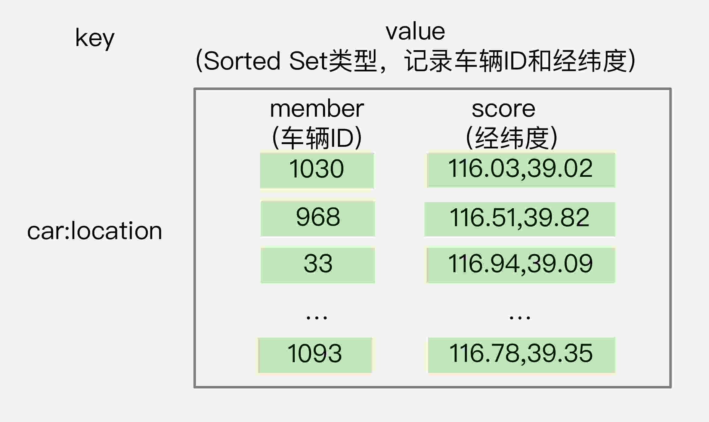

这时问题来了，Sorted Set 元素的权重分数是一个浮点数（float 类型），而一组经纬度包含的是经度和纬度两个值，是没法直接保存为一个浮点数的，那具体该怎么进行保存呢？

#### GeoHash 的编码方法

为了能高效地对经纬度进行比较，Redis 采用了业界广泛使用的 **GeoHash 编码方法**，这个方法的基本原理就是“**二分区间，区间编码**”。

当我们要对一组经纬度进行 GeoHash 编码时，我们要先对经度和纬度分别编码，然后再把经纬度各自的编码组合成一个最终编码。

对于一个地理位置信息来说，它的经度范围是[-180,180]。GeoHash 编码会把一个经度值编码成一个 N 位的二进制值，我们来对经度范围[-180,180]做 N 次的二分区操作，其中 N 可以自定义。

在进行第一次二分区时，经度范围[-180,180]会被分成两个子区间：[-180,0) 和[0,180]（我称之为左、右分区）。此时，我们可以查看一下要编码的经度值落在了左分区还是右分区。如果是落在*左分区，我们就用 0 表示；如果落在右分区，就用 1 表示*。这样一来，每做完一次二分区，我们就可以得到 1 位编码值。

然后，我们再对经度值所属的分区再做一次二分区，同时再次查看经度值落在了二分区后的左分区还是右分区，按照刚才的规则再做 1 位编码。当做完 N 次的二分区后，经度值就可以用一个 N bit 的数来表示了。

举个例子，假设我们要编码的经度值是 116.37，我们用 5 位编码值（也就是 N=5，做 5 次分区）。

我们先做第一次二分区操作，把经度区间[-180,180]分成了左分区[-180,0) 和右分区[0,180]，此时，经度值 116.37 是属于右分区[0,180]，所以，我们用 1 表示第一次二分区后的编码值。

接下来，我们做第二次二分区：把经度值 116.37 所属的[0,180]区间，分成[0,90) 和[90, 180]。此时，经度值 116.37 还是属于右分区[90,180]，所以，第二次分区后的编码值仍然为 1。等到第三次对[90,180]进行二分区，经度值 116.37 落在了分区后的左分区[90, 135) 中，所以，第三次分区后的编码值就是 0。

按照这种方法，做完 5 次分区后，我们把经度值 116.37 定位在[112.5, 123.75]这个区间，并且得到了经度值的 5 位编码值，即 11010。这个编码过程如下表所示：

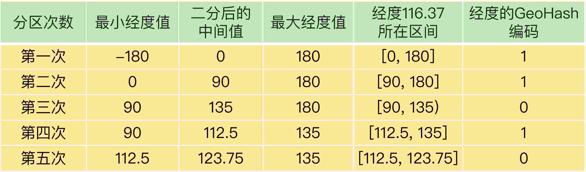

对纬度的编码方式，和对经度的一样，只是纬度的范围是[-90，90]，下面这张表显示了对纬度值 39.86 的编码过程。

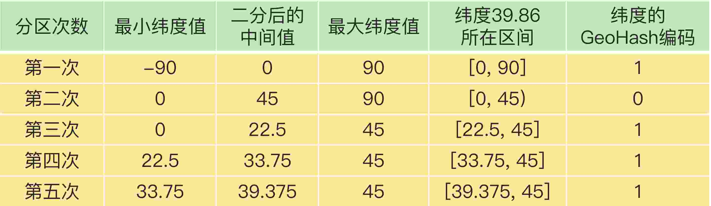

当一组经纬度值都编完码后，我们再把它们的各自编码值组合在一起，组合的规则是：最终编码值的偶数位上依次是经度的编码值，奇数位上依次是纬度的编码值，其中，偶数位从 0 开始，奇数位从 1 开始。

我们刚刚计算的*经纬度（116.37，39.86）*的各自*编码值是 11010 和 10111*，组合之后，第 0 位是经度的第 0 位 1，第 1 位是纬度的第 0 位 1，第 2 位是经度的第 1 位 1，第 3 位是纬度的第 1 位 0，以此类推，就能得到最终编码值 1110011101，如下图所示：

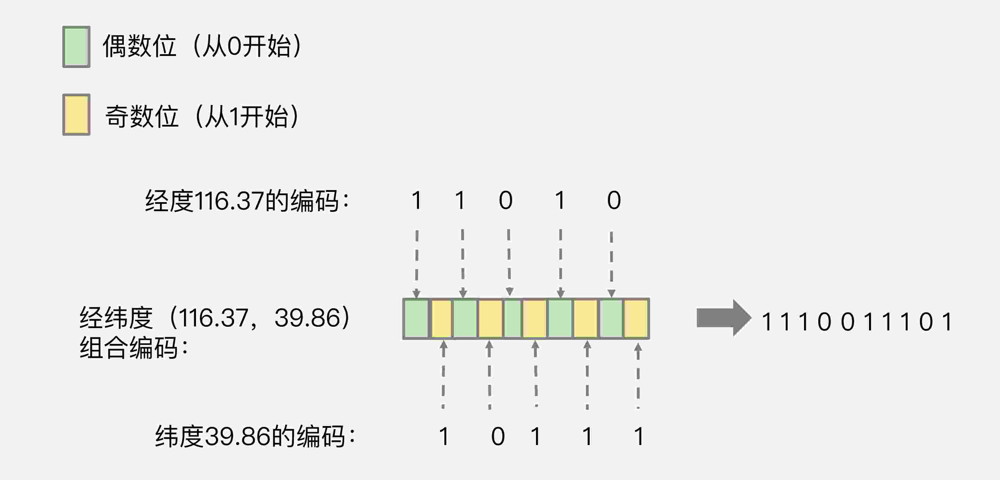

用了 GeoHash 编码后，原来无法用一个权重分数表示的一组经纬度（116.37，39.86）就可以用 1110011101 这一个值来表示，就可以保存为 Sorted Set 的权重分数了。

当然，使用 GeoHash 编码后，我们相当于把整个地理空间划分成了一个个方格，每个方格对应了 GeoHash 中的一个分区。

举个例子。我们把经度区间[-180,180]做一次二分区，把纬度区间[-90,90]做一次二分区，就会得到 4 个分区。我们来看下它们的经度和纬度范围以及对应的 GeoHash 组合编码。

- 分区一：[-180,0) 和[-90,0)，编码 00；
- 分区二：[-180,0) 和[0,90]，编码 01；
- 分区三：[0,180]和[-90,0)，编码 10；
- 分区四：[0,180]和[0,90]，编码 11。

这 4 个分区对应了 4 个方格，每个方格覆盖了一定范围内的经纬度值，分区越多，每个方格能覆盖到的地理空间就越小，也就越精准。我们把所有方格的编码值映射到一维空间时，相邻方格的 GeoHash 编码值基本也是接近的，如下图所示：

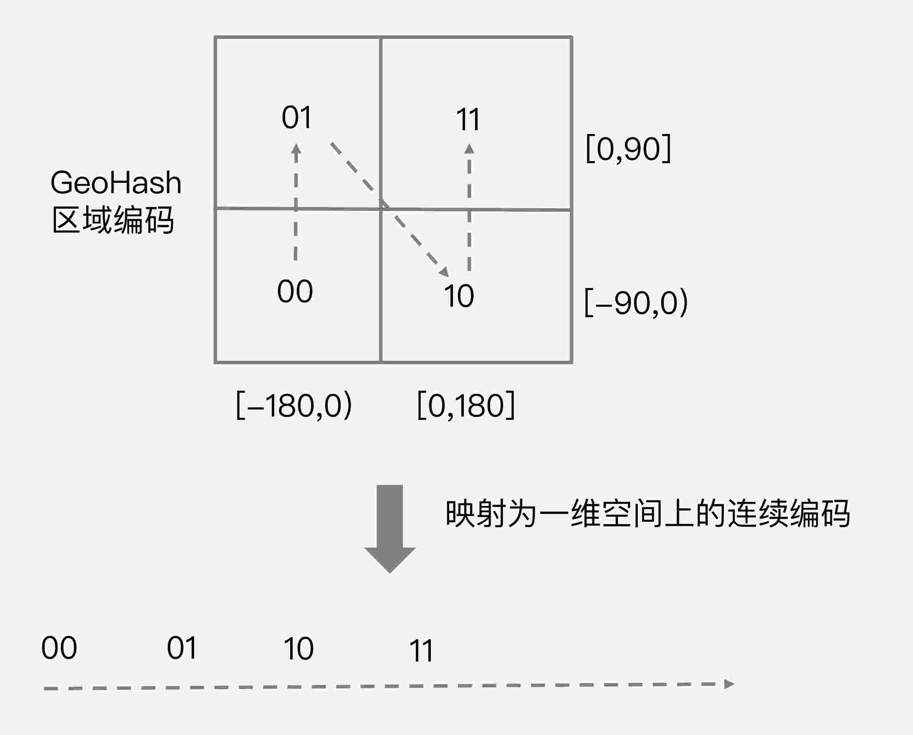

所以，我们使用 Sorted Set 范围查询得到的相近编码值，在实际的地理空间上，也是相邻的方格，这就可以实现 LBS 应用“搜索附近的人或物”的功能了。

不过，我要提醒你一句，有的编码值虽然在大小上接近，但实际对应的方格却距离比较远。例如，我们用 4 位来做 GeoHash 编码，把经度区间[-180,180]和纬度区间[-90,90]各分成了 4 个分区，一共 16 个分区，对应了 16 个方格。编码值为 0111 和 1000 的两个方格就离得比较远，如下图所示：

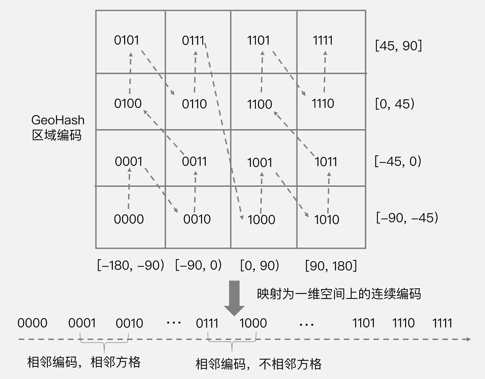

所以，为了避免查询不准确问题，我们可以同时查询给定经纬度所在的方格周围的 4 个或 8 个方格。

好了，到这里，我们就知道了，GEO 类型是把经纬度所在的区间编码作为 Sorted Set 中元素的权重分数，把和经纬度相关的车辆 ID 作为 Sorted Set 中元素本身的值保存下来，这样相邻经纬度的查询就可以通过编码值的大小范围查询来实现了。接下来，我们再来聊聊具体如何操作 GEO 类型。

#### 如何操作 GEO 类型

在使用 GEO 类型时，我们经常会用到两个命令，分别是 `GEOADD` 和 `GEORADIUS`。

- GEOADD 命令：用于把一组经纬度信息和相对应的一个 ID 记录到 GEO 类型集合中；
- GEORADIUS 命令：会根据输入的经纬度位置，查找以这个经纬度为中心的一定范围内的其他元素。当然，我们可以自己定义这个范围。

我还是以叫车应用的车辆匹配场景为例，介绍下具体如何使用这两个命令。

假设车辆 ID 是 33，经纬度位置是（116.034579，39.030452），我们可以用一个 GEO 集合保存所有车辆的经纬度，集合 key 是 cars:locations。执行下面的这个命令，就可以把 ID 号为 33 的车辆的当前经纬度位置存入 GEO 集合中：

```sh
GEOADD cars:locations 116.034579 39.030452 33
```

当用户想要寻找自己附近的网约车时，LBS 应用就可以使用 GEORADIUS 命令。

例如，LBS 应用执行下面的命令时，Redis 会根据输入的用户的经纬度信息（116.054579，39.030452 ），查找以这个经纬度为中心的 5 公里内的车辆信息，并返回给 LBS 应用。当然， 你可以修改“5”这个参数，来返回更大或更小范围内的车辆信息。

```sh
GEORADIUS cars:locations 116.054579 39.030452 5 km ASC COUNT 10
```

另外，我们还可以进一步限定返回的车辆信息。

比如，我们可以使用 ASC 选项，让返回的车辆信息按照距离这个中心位置从近到远的方式来排序，以方便选择最近的车辆；还可以使用 COUNT 选项，指定返回的车辆信息的数量。毕竟，5 公里范围内的车辆可能有很多，如果返回全部信息，会占用比较多的数据带宽，这个选项可以帮助控制返回的数据量，节省带宽。

可以看到，使用 GEO 数据类型可以非常轻松地操作经纬度这种信息。

虽然我们有了 5 种基本类型和 3 种扩展数据类型，但是有些场景下，我们对数据类型会有特殊需求，例如，我们需要一个数据类型既能像 Hash 那样支持快速的单键查询，又能像 Sorted Set 那样支持范围查询，此时，我们之前学习的这些数据类型就无法满足需求了。

Redis 扩展数据类型的终极版——**自定义的数据类型**。

### 自定义的数据类型

#### 如何自定义数据类型

为了实现自定义数据类型，首先，我们需要了解 Redis 的**基本对象结构 RedisObject**，因为 Redis 键值对中的每一个值都是用 RedisObject 保存的。RedisObject 包括元数据和指针。其中，元数据的一个功能就是用来区分不同的数据类型，指针用来指向具体的数据类型的值。所以，要想开发新数据类型，我们就先来了解下 RedisObject 的元数据和指针。

#### Redis 的基本对象结构

RedisObject 的内部组成包括了 type,、encoding,、lru 和 refcount 4 个元数据，以及 1 个*ptr指针。

1. type：表示值的类型，涵盖了我们前面学习的五大基本类型；
2. encoding：是值的编码方式，用来表示 Redis 中实现各个基本类型的底层数据结构，例如 SDS、压缩列表、哈希表、跳表等；
3. lru：记录了这个对象最后一次被访问的时间，用于淘汰过期的键值对；
4. refcount：记录了对象的引用计数；
5. `*ptr`：是指向数据的指针。

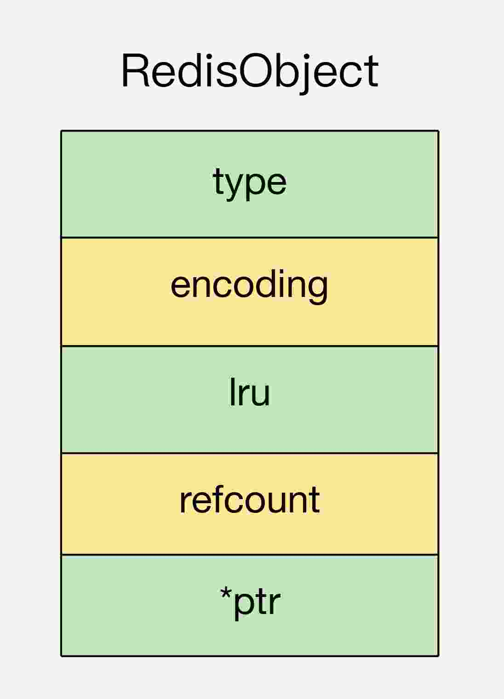

RedisObject 结构借助`*ptr`指针，就可以指向不同的数据类型，例如，`*ptr`指向一个 SDS 或一个跳表，就表示键值对中的值是 String 类型或 Sorted Set 类型。所以，我们在定义了新的数据类型后，也只要在 RedisObject 中设置好新类型的 type 和 encoding，再用`*ptr`指向新类型的实现，就行了。

#### 开发一个新的数据类型

我们需要为新数据类型定义好它的底层结构、type 和 encoding 属性值，然后再实现新数据类型的创建、释放函数和基本命令。

接下来，我以开发一个名字叫作 NewTypeObject 的新数据类型为例，来解释下具体的 4 个操作步骤。


##### 定义新数据类型的底层结构

我们用 newtype.h 文件来保存这个新类型的定义，具体定义的代码如下所示：

```c++
struct NewTypeObject {
    struct NewTypeNode *head; 
    size_t len; 
}NewTypeObject;
```

其中，NewTypeNode 结构就是我们自定义的新类型的底层结构。我们为底层结构设计两个成员变量：一个是 Long 类型的 value 值，用来保存实际数据；一个是*next指针，指向下一个 NewTypeNode 结构。

```c++
struct NewTypeNode {
    long value;
    struct NewTypeNode *next;
};
```

从代码中可以看到，NewTypeObject 类型的底层结构其实就是一个 Long 类型的单向链表。当然，你还可以根据自己的需求，把 NewTypeObject 的底层结构定义为其他类型。例如，如果我们想要 NewTypeObject 的查询效率比链表高，就可以把它的底层结构设计成一颗 B+ 树。

##### 在 RedisObject 的 type 属性中，增加这个新类型的定义

这个定义是在 Redis 的 `server.h` 文件中。比如，我们增加一个叫作 `OBJ_NEWTYPE` 的宏定义，用来在代码中指代 `NewTypeObject` 这个新类型。

```sh
#define OBJ_STRING 0    /* String object. */
#define OBJ_LIST 1      /* List object. */
#define OBJ_SET 2       /* Set object. */
#define OBJ_ZSET 3      /* Sorted set object. */
…
#define OBJ_NEWTYPE 7
```

##### 开发新类型的创建和释放函数

Redis 把数据类型的创建和释放函数都定义在了 `object.c` 文件中。所以，我们可以在这个文件中增加 `NewTypeObject` 的创建函数 `createNewTypeObject`，如下所示：

```c++
robj *createNewTypeObject(void){
   NewTypeObject *h = newtypeNew(); 
   robj *o = createObject(OBJ_NEWTYPE,h);
   return o;
}
```

`createNewTypeObject` 分别调用了 `newtypeNew` 和 `createObject` 两个函数，我分别来介绍下。

先说 `newtypeNew` 函数。它是用来为新数据类型初始化内存结构的。这个初始化过程主要是用 **zmalloc** 做底层结构分配空间，以便写入数据。

```c++
NewTypeObject *newtypeNew(void){
    NewTypeObject *n = zmalloc(sizeof(*n));
    n->head = NULL;
    n->len = 0;
    return n;
}
```

`newtypeNew` 函数涉及到新数据类型的具体创建，而 *Redis 默认会为每个数据类型定义一个单独文件，实现这个类型的创建和命令操作*，例如，`t_string.c` 和 `t_list.c` 分别对应 String 和 List 类型。按照 Redis 的惯例，我们就把 `newtypeNew` 函数定义在名为 `t_newtype.c` 的文件中。

createObject 是 Redis 本身提供的 RedisObject 创建函数，它的参数是数据类型的 type 和指向数据类型实现的指针`*ptr`。

我们给 createObject 函数中传入了两个参数，分别是新类型的 type 值 OBJ_NEWTYPE，以及指向一个初始化过的 NewTypeObjec 的指针。这样一来，创建的 RedisObject 就能指向我们自定义的新数据类型了。

```c++
robj *createObject(int type, void *ptr) {
    robj *o = zmalloc(sizeof(*o));
    o->type = type;
    o->ptr = ptr;
    ...
    return o;
}
```

对于释放函数来说，它是创建函数的反过程，是用 **zfree** 命令把新结构的内存空间释放掉。

##### 开发新类型的命令操作

增加相应的命令操作的过程可以分成三小步：

1. 在 `t_newtype.c` 文件中增加命令操作的实现。比如说，我们定义 ntinsertCommand 函数，由它实现对 NewTypeObject 单向链表的插入操作：

    ```c++
    void ntinsertCommand(client *c){
      //基于客户端传递的参数，实现在NewTypeObject链表头插入元素
    }
    ```

2. 在 server.h 文件中，声明我们已经实现的命令，以便在 `server.c` 文件引用这个命令，例如：

    ```c++
    void ntinsertCommand(client *c)
    ```

3. 在 `server.c` 文件中的 redisCommandTable 里面，把新增命令和实现函数关联起来。例如，新增的 ntinsert 命令由 ntinsertCommand 函数实现，我们就可以用 ntinsert 命令给 NewTypeObject 数据类型插入元素了。

    ```c++
    struct redisCommand redisCommandTable[] = { 
    ...
    {"ntinsert",ntinsertCommand,2,"m",...}
    }
    ```

此时，我们就完成了一个自定义的 NewTypeObject 数据类型，可以实现基本的命令操作了。当然，如果你还希望新的数据类型能被持久化保存，我们还需要在 Redis 的 RDB 和 AOF 模块中增加对新数据类型进行持久化保存的代码，我会在后面的加餐中再和你分享。

### 每课一问

到今天为止，我们已经学习 Redis 的 5 大基本数据类型和 3 个扩展数据类型，我想请你来聊一聊，你在日常的实践过程中，还用过 Redis 的其他数据类型吗？

答案：除了我们课程上介绍的 5 大基本数据类型，以及 HyperLogLog、Bitmap、GEO，Redis 还有一种数据类型，叫作布隆过滤器。它的查询效率很高，经常会用在缓存场景中，可以用来判断数据是否存在缓存中。我会在后面（第 25 讲）具体地介绍一下它。


## 14 | 如何在Redis中保存时间序列数据

有个需求：需要周期性地统计近万台设备的实时状态，包括设备 ID、压力、温度、湿度，以及对应的时间戳：`DeviceID, Pressure, Temperature, Humidity, TimeStamp`。

些与发生时间相关的一组数据，就是时间序列数据。这些数据的特点是没有严格的关系模型，记录的信息可以表示成键和值的关系（例如，一个设备 ID 对应一条记录），所以，并不需要专门用关系型数据库（例如 MySQL）来保存。

而 Redis 的键值数据模型，正好可以满足这里的数据存取需求。Redis 基于自身数据结构以及扩展模块，提供了两种解决方案。

### 时间序列数据的读写特点

在实际应用中，**时间序列数据通常是持续高并发写入的**，例如，需要连续记录数万个设备的实时状态值。同时，时间序列数据的写入主要就是插入新数据，而不是更新一个已存在的数据，也就是说，一个时间序列数据被记录后通常就不会变了，因为它就代表了一个设备在某个时刻的状态值（例如，一个设备在某个时刻的温度测量值，一旦记录下来，这个值本身就不会再变了）。

所以，**这种数据的写入特点很简单，就是插入数据快，这就要求我们选择的数据类型，在进行数据插入时，复杂度要低，尽量不要阻塞**。看到这儿，你可能第一时间会想到用 Redis 的 String、Hash 类型来保存，因为它们的插入复杂度都是 O(1)，是个不错的选择。但是 String 类型在记录小数据时（例如刚才例子中的设备温度值），元数据的内存开销比较大，不太适合保存大量数据。

看看，时间序列数据的“读”操作有什么特点。

我们在查询时间序列数据时，既有对**单条记录的查询**（例如查询某个设备在某一个时刻的运行状态信息，对应的就是这个设备的一条记录），也有对某个**时间范围内的数据的查询**（例如每天早上 8 点到 10 点的所有设备的状态信息）。

除此之外，还有一些更复杂的查询，比如对某个**时间范围内的数据做聚合计算**。这里的聚合计算，就是对符合查询条件的所有数据做计算，包括计算均值、最大 / 最小值、求和等。例如，我们要计算某个时间段内的设备压力的最大值，来判断是否有故障发生。

针对时间序列数据的“写要快”，Redis 的高性能写特性直接就可以满足了；而针对“查询模式多”，也就是要支持单点查询、范围查询和聚合计算，Redis 提供了保存时间序列数据的两种方案，分别可以基于 *Hash 和 Sorted Set* 实现，以及基于 *RedisTimeSeries* 模块实现。

### 基于 Hash 和 Sorted Set 保存时间序列数据

Hash 和 Sorted Set 组合的方式有一个明显的好处：它们是 Redis 内在的数据类型，代码成熟和性能稳定。所以，基于这两个数据类型保存时间序列数据，系统稳定性是可以预期的。

*为什么保存时间序列数据，要同时使用这两种类型？*

关于 Hash 类型，我们都知道，它有一个特点是，可以实现对单键的快速查询。这就满足了时间序列数据的单键查询需求。我们可以把时间戳作为 Hash 集合的 key，把记录的设备状态值作为 Hash 集合的 value。可以看下用 Hash 集合记录设备的温度值的示意图：

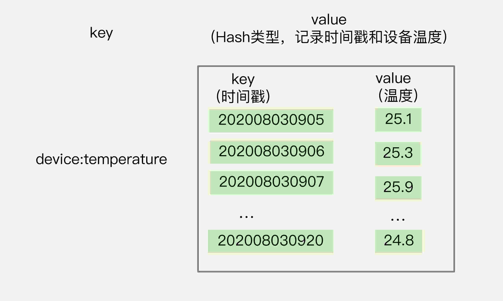

当我们想要查询某个时间点或者是多个时间点上的温度数据时，直接使用 HGET 命令或者 HMGET 命令，就可以分别获得 Hash 集合中的一个 key 和多个 key 的 value 值了。

举个例子。我们用 HGET 命令查询 202008030905 这个时刻的温度值，使用 HMGET 查询 202008030905、202008030907、202008030908 这三个时刻的温度值，如下所示：

```sh
HGET device:temperature 202008030905
"25.1"

HMGET device:temperature 202008030905 202008030907 202008030908
1) "25.1"
2) "25.9"
3) "24.9"
```

用 Hash 类型来实现单键的查询很简单。但是，Hash 类型有个**短板**：**它并不支持对数据进行范围查询**。

虽然时间序列数据是按时间递增顺序插入 Hash 集合中的，但 Hash 类型的底层结构是哈希表，并没有对数据进行有序索引。所以，如果要对 Hash 类型进行范围查询的话，就需要扫描 Hash 集合中的所有数据，再把这些数据取回到客户端进行排序，然后，才能在客户端得到所查询范围内的数据。显然，查询效率很低。

为了能同时支持按时间戳范围的查询，可以用 **Sorted Set** 来保存时间序列数据，因为它能够**根据元素的权重分数来排序**。我们可以把时间戳作为 Sorted Set 集合的元素分数，把时间点上记录的数据作为元素本身。

我还是以保存设备温度的时间序列数据为例，进行解释。下图显示了用 Sorted Set 集合保存的结果。

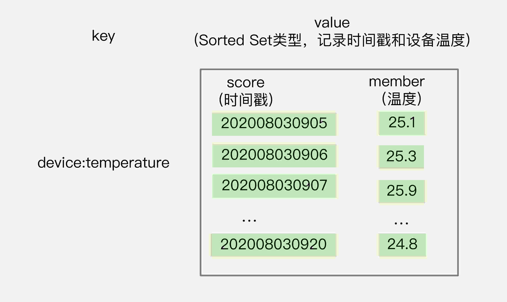

使用 Sorted Set 保存数据后，我们就可以使用 ZRANGEBYSCORE 命令，按照输入的最大时间戳和最小时间戳来查询这个时间范围内的温度值了。如下所示，我们来查询一下在 2020 年 8 月 3 日 9 点 7 分到 9 点 10 分间的所有温度值：

```sh
ZRANGEBYSCORE device:temperature 202008030907 202008030910
1) "25.9"
2) "24.9"
3) "25.3"
4) "25.2"
```

同时使用 Hash 和 Sorted Set，可以满足单个时间点和一个时间范围内的数据查询需求了。

*如何保证写入 Hash 和 Sorted Set 是一个原子性的操作呢？*

这里就涉及到了 Redis 用来实现简单的事务的 **MULTI 和 EXEC 命令**。

- MULTI 命令：表示一系列原子性操作的开始。收到这个命令后，Redis 就知道，接下来再收到的命令需要放到一个内部队列中，后续一起执行，保证原子性。
- EXEC 命令：表示一系列原子性操作的结束。一旦 Redis 收到了这个命令，就表示所有要保证原子性的命令操作都已经发送完成了。此时，Redis 开始执行刚才放到内部队列中的所有命令操作。

你可以看下下面这张示意图，命令 1 到命令 N 是在 MULTI 命令后、EXEC 命令前发送的，它们会被一起执行，保证原子性。

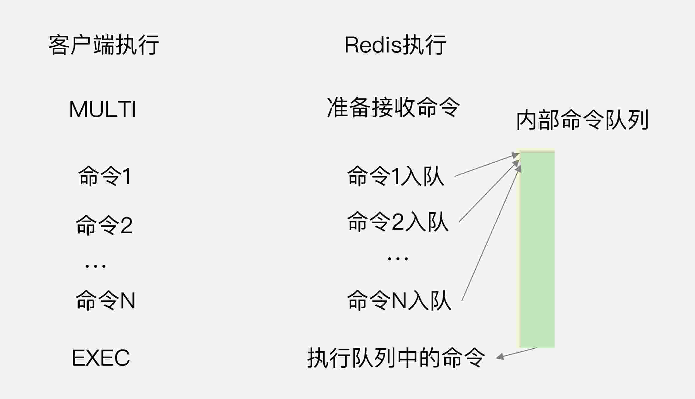

以保存设备状态信息的需求为例，我们执行下面的代码，把设备在 2020 年 8 月 3 日 9 时 5 分的温度，分别用 HSET 命令和 ZADD 命令写入 Hash 集合和 Sorted Set 集合。

```sh
127.0.0.1:6379> MULTI
OK

127.0.0.1:6379> HSET device:temperature 202008030911 26.8
QUEUED

127.0.0.1:6379> ZADD device:temperature 202008030911 26.8
QUEUED

127.0.0.1:6379> EXEC
1) (integer) 1
2) (integer) 1
```

首先，Redis 收到了客户端执行的 MULTI 命令。然后，客户端再执行 HSET 和 ZADD 命令后，Redis 返回的结果为“QUEUED”，表示这两个命令暂时入队，先不执行；执行了 EXEC 命令后，HSET 命令和 ZADD 命令才真正执行，并返回成功结果（结果值为 1）。

<!--在使用MULTI和EXEC命令时，建议客户端使用pipeline，当使用pipeline时，客户端会把命令一次性批量发送给服务端，然后让服务端执行，这样可以减少客户端和服务端的来回网络IO次数，提升访问性能。-->

*如何对时间序列数据进行聚合计算？*

聚合计算一般被用来周期性地统计时间窗口内的数据汇总状态，在实时监控与预警等场景下会频繁执行。

因为 *Sorted Set 只支持范围查询，无法直接进行聚合计算*，所以，我们只能先把时间范围内的数据取回到客户端，然后在客户端自行完成聚合计算。这个方法虽然能完成聚合计算，但是会带来一定的潜在风险，也就是**大量数据在 Redis 实例和客户端间频繁传输，这会和其他操作命令竞争网络资源，导致其他操作变慢**。

在我们这个物联网项目中，就需要每 3 分钟统计一下各个设备的温度状态，一旦设备温度超出了设定的阈值，就要进行报警。这是一个典型的聚合计算场景，我们可以来看看这个过程中的数据体量。

假设我们需要每 3 分钟计算一次的所有设备各指标的最大值，每个设备每 15 秒记录一个指标值，1 分钟就会记录 4 个值，3 分钟就会有 12 个值。我们要统计的设备指标数量有 33 个，所以，单个设备每 3 分钟记录的指标数据有将近 400 个（33 * 12 = 396），而设备总数量有 1 万台，这样一来，每 3 分钟就有将近 400 万条（396 * 1 万 = 396 万）数据需要在客户端和 Redis 实例间进行传输。

为了避免客户端和 Redis 实例间频繁的大量数据传输，我们可以使用 RedisTimeSeries 来保存时间序列数据。

### 基于 RedisTimeSeries 模块保存时间序列数据

RedisTimeSeries 支持直接在 Redis 实例上进行聚合计算。还是以刚才每 3 分钟算一次最大值为例。在 Redis 实例上直接聚合计算，那么，对于单个设备的一个指标值来说，每 3 分钟记录的 12 条数据可以聚合计算成一个值，单个设备每 3 分钟也就只有 33 个聚合值需要传输，1 万台设备也只有 33 万条数据。数据量大约是在客户端做聚合计算的十分之一，很显然，可以减少大量数据传输对 Redis 实例网络的性能影响。

如果我们只需要进行单个时间点查询或是对某个时间范围查询的话，适合使用 Hash 和 Sorted Set 的组合，它们都是 Redis 的内在数据结构，性能好，稳定性高。但是，如果我们需要进行大量的聚合计算，同时网络带宽条件不是太好时，Hash 和 Sorted Set 的组合就不太适合了。

**`RedisTimeSeries`** 是 Redis 的一个**扩展模块**。**它专门面向时间序列数据提供了数据类型和访问接口，并且支持在 Redis 实例上直接对数据进行按时间范围的聚合计算**。

因为 RedisTimeSeries 不属于 Redis 的内建功能模块，在使用时，我们需要先把它的源码单独编译成动态链接库 redistimeseries.so，再使用 loadmodule 命令进行加载，如下所示：`loadmodule redistimeseries.so`

当用于时间序列数据存取时，RedisTimeSeries 的操作主要有 5 个：

1. 用 TS.CREATE 命令创建时间序列数据集合；
2. 用 TS.ADD 命令插入数据；
3. 用 TS.GET 命令读取最新数据；
4. 用 TS.MGET 命令按标签过滤查询数据集合；
5. 用 TS.RANGE 支持聚合计算的范围查询。

#### 用 TS.CREATE 命令创建一个时间序列数据集合

在 TS.CREATE 命令中，我们需要设置时间序列数据集合的 key 和数据的过期时间（以毫秒为单位）。此外，我们还可以为数据集合设置标签，来表示数据集合的属性。

例如，我们执行下面的命令，创建一个 key 为 device:temperature、数据有效期为 600s 的时间序列数据集合。也就是说，这个集合中的数据创建了 600s 后，就会被自动删除。最后，我们给这个集合设置了一个标签属性{device_id:1}，表明这个数据集合中记录的是属于设备 ID 号为 1 的数据。

```sh
TS.CREATE device:temperature RETENTION 600000 LABELS device_id 1
OK
```

#### 用 TS.ADD 命令插入数据，用 TS.GET 命令读取最新数据

我们可以用 TS.ADD 命令往时间序列集合中插入数据，包括时间戳和具体的数值，并使用 TS.GET 命令读取数据集合中的最新一条数据。

例如，我们执行下列 TS.ADD 命令时，就往 device:temperature 集合中插入了一条数据，记录的是设备在 2020 年 8 月 3 日 9 时 5 分的设备温度；再执行 TS.GET 命令时，就会把刚刚插入的最新数据读取出来。

```sh
TS.ADD device:temperature 1596416700 25.1
1596416700

TS.GET device:temperature 
25.1
```

#### 用 TS.MGET 命令按标签过滤查询数据集合

在保存多个设备的时间序列数据时，我们通常会把不同设备的数据保存到不同集合中。此时，我们就可以使用 TS.MGET 命令，按照标签查询部分集合中的最新数据。在使用 TS.CREATE 创建数据集合时，我们可以给集合设置标签属性。当我们进行查询时，就可以在查询条件中对集合标签属性进行匹配，最后的查询结果里只返回匹配上的集合中的最新数据。

举个例子。假设我们一共用 4 个集合为 4 个设备保存时间序列数据，设备的 ID 号是 1、2、3、4，我们在创建数据集合时，把 device_id 设置为每个集合的标签。此时，我们就可以使用下列 TS.MGET 命令，以及 FILTER 设置（这个配置项用来设置集合标签的过滤条件），查询 device_id 不等于 2 的所有其他设备的数据集合，并返回各自集合中的最新的一条数据。

```sh
TS.MGET FILTER device_id!=2 
1) 1) "device:temperature:1"
   2) (empty list or set)
   3) 1) (integer) 1596417000
      2) "25.3"
2) 1) "device:temperature:3"
   2) (empty list or set)
   3) 1) (integer) 1596417000
      2) "29.5"
3) 1) "device:temperature:4"
   2) (empty list or set)
   3) 1) (integer) 1596417000
      2) "30.1"
```

#### 用 TS.RANGE 支持需要聚合计算的范围查询

最后，在对时间序列数据进行聚合计算时，我们可以使用 TS.RANGE 命令指定要查询的数据的时间范围，同时用 AGGREGATION 参数指定要执行的聚合计算类型。RedisTimeSeries 支持的聚合计算类型很丰富，包括求均值（avg）、求最大 / 最小值（max/min），求和（sum）等。

例如，在执行下列命令时，我们就可以按照每 180s 的时间窗口，对 2020 年 8 月 3 日 9 时 5 分和 2020 年 8 月 3 日 9 时 12 分这段时间内的数据进行均值计算了。

```sh
TS.RANGE device:temperature 1596416700 1596417120 AGGREGATION avg 180000
1) 1) (integer) 1596416700
   2) "25.6"
2) 1) (integer) 1596416880
   2) "25.8"
3) 1) (integer) 1596417060
   2) "26.1"
```

与使用 Hash 和 Sorted Set 来保存时间序列数据相比，*RedisTimeSeries 是专门为时间序列数据访问设计的扩展模块，能支持在 Redis 实例上直接进行聚合计算，以及按标签属性过滤查询数据集合，*当我们需要频繁进行聚合计算，以及从大量集合中筛选出特定设备或用户的数据集合时，RedisTimeSeries 就可以发挥优势了。


### 每课一问

在这节课上，我提到，我们可以使用 Sorted Set 保存时间序列数据，把时间戳作为 score，把实际的数据作为 member，你觉得这样保存数据有没有潜在的风险？另外，如果你是 Redis 的开发维护者，你会把聚合计算也设计为 Sorted Set 的一个内在功能吗？

答案：Sorted Set 和 Set 一样，都会对集合中的元素进行去重，也就是说，如果我们往集合中插入的 member 值，和之前已经存在的 member 值一样，那么，原来 member 的 score 就会被新写入的 member 的 score 覆盖。相同 member 的值，在 Sorted Set 中只会保留一个。

对于时间序列数据来说，这种去重的特性是会带来数据丢失风险的。毕竟，某一时间段内的多个时间序列数据的值可能是相同的。如果我们往 Sorted Set 中写入的数据是在不同时刻产生的，但是写入的时刻不同，Sorted Set 中只会保存一份最近时刻的数据。这样一来，其他时刻的数据就都没有保存下来。

举个例子，在记录物联网设备的温度时，一个设备一个上午的温度值可能都是 26。在 Sorted Set 中，我们把温度值作为 member，把时间戳作为 score。我们用 ZADD 命令把上午不同时刻的温度值写入 Sorted Set。由于 member 值一样，所以只会把 score 更新为最新时间戳，最后只有一个最新时间戳（例如上午 12 点）下的温度值。这肯定是无法满足保存多个时刻数据的需求的。

关于是否把聚合计算作为 Sorted Set 的内在功能，考虑到 Redis 的读写功能是由单线程执行，在进行数据读写时，本身就会消耗较多的 CPU 资源，如果再在 Sorted Set 中实现聚合计算，就会进一步增加 CPU 的资源消耗，影响到 Redis 的正常数据读取。所以，如果我是 Redis 的开发维护者，除非对 Redis 的线程模型做修改，比如说在 Redis 中使用额外的线程池做聚合计算，否则，我不会把聚合计算作为 Redis 的内在功能实现的。


## 15 | 消息队列的考验：Redis有哪些解决方案

**消息队列要能支持组件通信消息的快速读写**，而 Redis 本身支持数据的高速访问，正好可以满足消息队列的读写性能需求。不过，除了性能，消息队列还有其他的要求，所以，很多人都很关心一个问题：“Redis 适合做消息队列吗？”

其实，这个问题的背后，隐含着两方面的核心问题：

- 消息队列的消息存取需求是什么？
- Redis 如何实现消息队列的需求？

### 消息队列的消息存取需求

先介绍一下消息队列存取消息的过程。在分布式系统中，当两个组件要基于消息队列进行通信时，一个组件会把要处理的数据以消息的形式传递给消息队列，然后，这个组件就可以继续执行其他操作了；远端的另一个组件从消息队列中把消息读取出来，再在本地进行处理。

假设组件 1 需要对采集到的数据进行求和计算，并写入数据库，但是，消息到达的速度很快，组件 1 没有办法及时地既做采集，又做计算，并且写入数据库。所以，我们可以使用基于消息队列的通信，让组件 1 把数据 x 和 y 保存为 JSON 格式的消息，再发到消息队列，这样它就可以继续接收新的数据了。组件 2 则异步地从消息队列中把数据读取出来，在服务器 2 上进行求和计算后，再写入数据库。这个过程如下图所示：

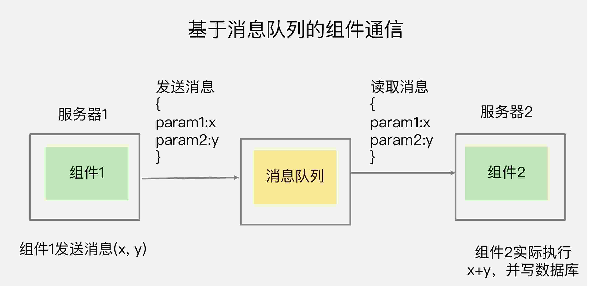

一般把消息队列中发送消息的组件称为生产者（例子中的组件 1），把接收消息的组件称为消费者（例子中的组件 2），下图展示了一个通用的消息队列的架构模型：

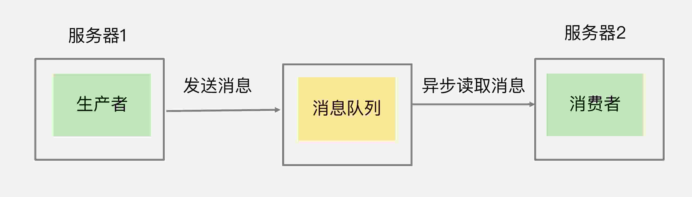

在使用消息队列时，消费者可以异步读取生产者消息，然后再进行处理。这样一来，即使生产者发送消息的速度远远超过了消费者处理消息的速度，生产者已经发送的消息也可以缓存在消息队列中，避免阻塞生产者，这是消息队列作为分布式组件通信的一大优势。

**不过，消息队列在存取消息时，必须要满足三个需求，分别是消息保序、处理重复的消息和保证消息可靠性**。

#### 消息保序

虽然消费者是异步处理消息，但是，消费者仍然需要按照生产者发送消息的顺序来处理消息，避免后发送的消息被先处理了。对于要求消息保序的场景来说，一旦出现这种消息被乱序处理的情况，就可能会导致业务逻辑被错误执行，从而给业务方造成损失。

#### 重复消息处理

消费者从消息队列读取消息时，有时会因为网络堵塞而出现消息重传的情况。此时，消费者可能会收到多条重复的消息。对于重复的消息，消费者如果多次处理的话，就可能造成一个业务逻辑被多次执行，如果业务逻辑正好是要修改数据，那就会出现数据被多次修改的问题了。

#### 消息可靠性保证

消费者在处理消息的时候，还可能出现因为故障或宕机导致消息没有处理完成的情况。此时，消息队列需要能提供消息可靠性的保证，也就是说，当消费者重启后，可以重新读取消息再次进行处理，否则，就会出现消息漏处理的问题了。

**Redis 的 List 和 Streams 两种数据类型，就可以满足消息队列的这三个需求**。我们先来了解下基于 List 的消息队列实现方法。

### 基于 List 的消息队列解决方案

#### List 类型是如何保证消息顺序的

List 本身就是按先进先出的顺序对数据进行存取的，所以，如果使用 List 作为消息队列保存消息的话，就已经能满足消息保序的需求了。

具体来说，生产者可以使用 LPUSH 命令把要发送的消息依次写入 List，而消费者则可以使用 RPOP 命令，从 List 的另一端按照消息的写入顺序，依次读取消息并进行处理。

如下图所示，生产者先用 LPUSH 写入了两条库存消息，分别是 5 和 3，表示要把库存更新为 5 和 3；消费者则用 RPOP 把两条消息依次读出，然后进行相应的处理。

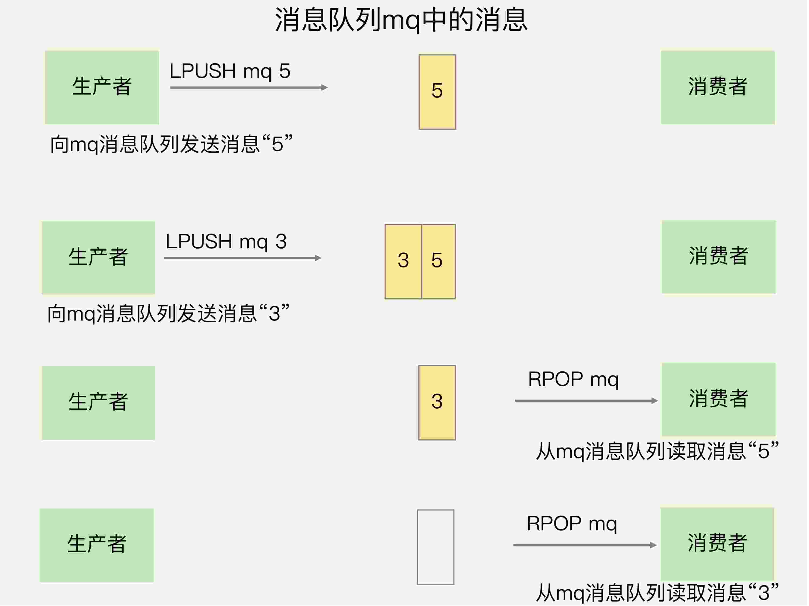

不过，在消费者读取数据时，有一个潜在的性能风险点。在生产者往 List 中**写入数据时**，List **并不会主动地通知消费者有新消息写入**，如果消费者想要及时处理消息，就需要在程序中不停地调用 RPOP 命令（比如使用一个 while(1) 循环）。如果有新消息写入，RPOP 命令就会返回结果，否则，RPOP 命令返回空值，再继续循环。

Redis 提供了 BRPOP 命令。**BRPOP 命令也称为阻塞式读取**，客户端在没有读到队列数据时，自动阻塞，直到有新的数据写入队列，再开始读取新数据。和消费者程序自己不停地调用 RPOP 命令相比，这种方式能节省 CPU 开销。

消息保序的问题解决了，接下来，我们还需要考虑解决重复消息处理的问题，这里其实有一个要求：**消费者程序本身能对重复消息进行判断**。

#### List 类型是如何保证消息不被重复消费的

一方面，消息队列要能给每一个消息提供全局唯一的 ID 号；另一方面，消费者程序要把已经处理过的消息的 ID 号记录下来。

当收到一条消息后，消费者程序就可以对比收到的消息 ID 和记录的已处理过的消息 ID，来判断当前收到的消息有没有经过处理。如果已经处理过，那么，消费者程序就不再进行处理了。这种处理特性也称为幂等性，幂等性就是指，对于同一条消息，消费者收到一次的处理结果和收到多次的处理结果是一致的。

不过，List 本身是不会为每个消息生成 ID 号的，所以，消息的全局唯一 ID 号就需要生产者程序在发送消息前自行生成。生成之后，我们在用 LPUSH 命令把消息插入 List 时，需要在消息中包含这个全局唯一 ID。

例如，我们执行以下命令，就把一条全局 ID 为 101030001、库存量为 5 的消息插入了消息队列：

```sh
LPUSH mq "101030001:stock:5"
(integer) 1
```

#### List 类型是如何保证消息可靠性的

当消费者程序从 List 中读取一条消息后，List 就不会再留存这条消息了。所以，如果消费者程序在处理消息的过程出现了故障或宕机，就会导致消息没有处理完成，那么，消费者程序再次启动后，就没法再次从 List 中读取消息了。

为了留存消息，List 类型提供了 **BRPOPLPUSH 命令**，这个命令的作用是**让消费者程序从一个 List 中读取消息，同时，Redis 会把这个消息再插入到另一个 List（可以叫作备份 List）留存**。这样一来，如果消费者程序读了消息但没能正常处理，等它重启后，就可以从备份 List 中重新读取消息并进行处理了。

使用 BRPOPLPUSH 命令留存消息，以及消费者再次读取消息的过程：

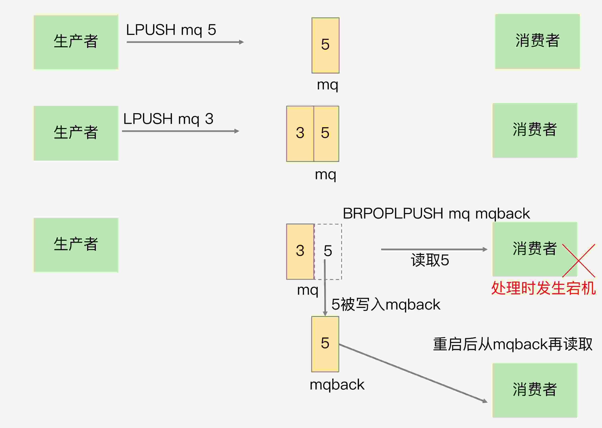

生产者先用 LPUSH 把消息“5”“3”插入到消息队列 mq 中。消费者程序使用 BRPOPLPUSH 命令读取消息“5”，同时，消息“5”还会被 Redis 插入到 mqback 队列中。如果消费者程序处理消息“5”时宕机了，等它重启后，可以从 mqback 中再次读取消息“5”，继续处理。

基于 List 类型，我们可以满足分布式组件对消息队列的三大需求。但是，在用 List 做消息队列时，我们还可能遇到过一个问题：**生产者消息发送很快，而消费者处理消息的速度比较慢，这就导致 List 中的消息越积越多，给 Redis 的内存带来很大压力**。

这个时候，我们希望启动多个消费者程序组成一个消费组，一起分担处理 List 中的消息。但是，**List 类型并不支持消费组的实现**。

和 List 相比，Streams 同样能够满足消息队列的三大需求。而且，它还支持消费组形式的消息读取。接下来，我们就来了解下 Streams 的使用方法。

### 基于 Streams 的消息队列解决方案

Streams 是 Redis 专门为消息队列设计的数据类型，它提供了丰富的消息队列操作命令。

- XADD：插入消息，保证有序，可以自动生成全局唯一 ID；
- XREAD：用于读取消息，可以按 ID 读取数据；
- XREADGROUP：按消费组形式读取消息；
- XPENDING 和 XACK：XPENDING 命令可以用来查询每个消费组内所有消费者已读取但尚未确认的消息，而 XACK 命令用于向消息队列确认消息处理已完成。

#### XADD 与 XREAD

**XADD** 命令可以往消息队列中插入新消息，消息的格式是键 - 值对形式。对于插入的每一条消息，Streams 可以自动为其生成一个全局唯一的 ID。

比如说，我们执行下面的命令，就可以往名称为 mqstream 的消息队列中插入一条消息，消息的键是 repo，值是 5。其中，消息队列名称后面的`*`，表示让 Redis 为插入的数据自动生成一个全局唯一的 ID，例如“1599203861727-0”。当然，我们也可以不用`*`，直接在消息队列名称后自行设定一个 ID 号，只要保证这个 ID 号是全局唯一的就行。不过，相比自行设定 ID 号，使用`*`会更加方便高效。

```sh
XADD mqstream * repo 5
"1599203861727-0"
```

可以看到，消息的全局唯一 ID 由两部分组成，第一部分“1599203861727”是数据插入时，以毫秒为单位计算的当前服务器时间，第二部分表示插入消息在当前毫秒内的消息序号，这是从 0 开始编号的。例如，“1599203861727-0”就表示在“1599203861727”毫秒内的第 1 条消息。

当消费者需要读取消息时，可以直接使用 **XREAD** 命令从消息队列中读取。XREAD 在读取消息时，可以指定一个消息 ID，并从这个消息 ID 的下一条消息开始进行读取。

例如，我们可以执行下面的命令，从 ID 号为 1599203861727-0 的消息开始，读取后续的所有消息（示例中一共 3 条）。

```sh
XREAD BLOCK 100 STREAMS  mqstream 1599203861727-0
1) 1) "mqstream"
   2) 1) 1) "1599274912765-0"
         2) 1) "repo"
            2) "3"
      2) 1) "1599274925823-0"
         2) 1) "repo"
            2) "2"
      3) 1) "1599274927910-0"
         2) 1) "repo"
            2) "1"
```

另外，消费者也可以在调用 XRAED 时设定 block 配置项，实现类似于 BRPOP 的阻塞读取操作。当消息队列中没有消息时，一旦设置了 block 配置项，XREAD 就会阻塞，阻塞的时长可以在 block 配置项进行设置。

举个例子，我们来看一下下面的命令，其中，命令最后的“`$`”符号表示读取最新的消息，同时，我们设置了 block 10000 的配置项，10000 的单位是毫秒，表明 XREAD 在读取最新消息时，如果没有消息到来，XREAD 将阻塞 10000 毫秒（即 10 秒），然后再返回。下面命令中的 XREAD 执行后，消息队列 mqstream 中一直没有消息，所以，XREAD 在 10 秒后返回空值（nil）。

```sh
XREAD block 10000 streams mqstream $
(nil)
(10.00s)
```

####  XGROUP

Streams 本身可以使用 XGROUP 创建消费组，创建消费组之后，Streams 可以使用 XREADGROUP 命令让消费组内的消费者读取消息，

例如，我们执行下面的命令，创建一个名为 group1 的消费组，这个消费组消费的消息队列是 mqstream。

```sh
XGROUP create mqstream group1 0
OK
```

然后，我们再执行一段命令，让 group1 消费组里的消费者 consumer1 从 mqstream 中读取所有消息，其中，命令最后的参数“>”，表示从第一条尚未被消费的消息开始读取。因为在 consumer1 读取消息前，group1 中没有其他消费者读取过消息，所以，consumer1 就得到 mqstream 消息队列中的所有消息了（一共 4 条）。

```sh
XREADGROUP group group1 consumer1 streams mqstream >
1) 1) "mqstream"
   2) 1) 1) "1599203861727-0"
         2) 1) "repo"
            2) "5"
      2) 1) "1599274912765-0"
         2) 1) "repo"
            2) "3"
      3) 1) "1599274925823-0"
         2) 1) "repo"
            2) "2"
      4) 1) "1599274927910-0"
         2) 1) "repo"
            2) "1"
```

需要注意的是，消息队列中的消息一旦被消费组里的一个消费者读取了，就不能再被该消费组内的其他消费者读取了。比如说，我们执行完刚才的 XREADGROUP 命令后，再执行下面的命令，让 group1 内的 consumer2 读取消息时，consumer2 读到的就是空值，因为消息已经被 consumer1 读取完了，如下所示：

```sh
XREADGROUP group group1 consumer2  streams mqstream 0
1) 1) "mqstream"
   2) (empty list or set)
```

使用消费组的目的是让组内的多个消费者共同分担读取消息，所以，我们通常会让每个消费者读取部分消息，从而实现消息读取负载在多个消费者间是均衡分布的。例如，我们执行下列命令，让 group2 中的 consumer1、2、3 各自读取一条消息。

```sh
XREADGROUP group group2 consumer1 count 1 streams mqstream >
1) 1) "mqstream"
   2) 1) 1) "1599203861727-0"
         2) 1) "repo"
            2) "5"

XREADGROUP group group2 consumer2 count 1 streams mqstream >
1) 1) "mqstream"
   2) 1) 1) "1599274912765-0"
         2) 1) "repo"
            2) "3"

XREADGROUP group group2 consumer3 count 1 streams mqstream >
1) 1) "mqstream"
   2) 1) 1) "1599274925823-0"
         2) 1) "repo"
            2) "2"
```

为了保证消费者在发生故障或宕机再次重启后，仍然可以读取未处理完的消息，Streams 会自动使用内部队列（也称为 PENDING List）留存消费组里每个消费者读取的消息，直到消费者使用 XACK 命令通知 Streams“消息已经处理完成”。如果消费者没有成功处理消息，它就不会给 Streams 发送 XACK 命令，消息仍然会留存。此时，消费者可以在重启后，用 XPENDING 命令查看已读取、但尚未确认处理完成的消息。

例如，我们来查看一下 group2 中各个消费者已读取、但尚未确认的消息个数。其中，XPENDING 返回结果的第二、三行分别表示 group2 中所有消费者读取的消息最小 ID 和最大 ID。

```sh
XPENDING mqstream group2
1) (integer) 3
2) "1599203861727-0"
3) "1599274925823-0"
4) 1) 1) "consumer1"
      2) "1"
   2) 1) "consumer2"
      2) "1"
   3) 1) "consumer3"
      2) "1"
```

如果我们还需要进一步查看某个消费者具体读取了哪些数据，可以执行下面的命令：

```sh
XPENDING mqstream group2 - + 10 consumer2
1) 1) "1599274912765-0"
   2) "consumer2"
   3) (integer) 513336
   4) (integer) 1
```

可以看到，consumer2 已读取的消息的 ID 是 1599274912765-0。

一旦消息 1599274912765-0 被 consumer2 处理了，consumer2 就可以使用 XACK 命令通知 Streams，然后这条消息就会被删除。当我们再使用 XPENDING 命令查看时，就可以看到，consumer2 已经没有已读取、但尚未确认处理的消息了。

```sh
$ XACK mqstream group2 1599274912765-0
(integer) 1
$ XPENDING mqstream group2 - + 10 consumer2
(empty list or set)
```

现在，我们就知道了用 Streams 实现消息队列的方法，我还想再强调下，**Streams** 是 **Redis 5.0** 专门针对消息队列场景设计的数据类型，如果你的 Redis 是 5.0 及 5.0 以后的版本，就可以考虑把 Streams 用作消息队列了。

### 小结

我画了一张表格，汇总了用 List 和 Streams 实现消息队列的特点和区别。当然，在实践的过程中，你也可以根据新的积累，进一步补充和完善这张表。

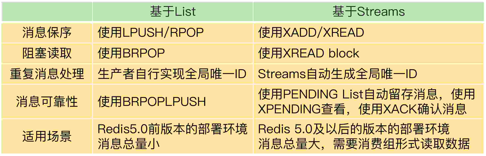

其实，关于 Redis 是否适合做消息队列，业界一直是有争论的。很多人认为，要使用消息队列，就应该采用 Kafka、RabbitMQ 这些专门面向消息队列场景的软件，而 Redis 更加适合做缓存。

根据这些年做 Redis 研发工作的经验，我的看法是：Redis 是一个非常轻量级的键值数据库，部署一个 Redis 实例就是启动一个进程，部署 Redis 集群，也就是部署多个 Redis 实例。而 Kafka、RabbitMQ 部署时，涉及额外的组件，例如 Kafka 的运行就需要再部署 ZooKeeper。相比 Redis 来说，Kafka 和 RabbitMQ 一般被认为是重量级的消息队列。


### 每课一问

如果一个生产者发送给消息队列的消息，需要被多个消费者进行读取和处理（例如，一个消息是一条从业务系统采集的数据，既要被消费者 1 读取进行实时计算，也要被消费者 2 读取并留存到分布式文件系统 HDFS 中，以便后续进行历史查询），你会使用 Redis 的什么数据类型来解决这个问题呢？

答案：有同学提到，可以使用 Streams 数据类型的消费组，同时消费生产者的数据，这是可以的。但是，有个地方需要注意，如果只是使用一个消费组的话，消费组内的多个消费者在消费消息时是互斥的，换句话说，在一个消费组内，一个消息只能被一个消费者消费。我们希望消息既要被消费者 1 读取，也要被消费者 2 读取，是一个多消费者的需求。所以，如果使用消费组模式，需要让消费者 1 和消费者 2 属于不同的消费组，这样它们就能同时消费了。

另外，Redis 基于字典和链表数据结构，实现了发布和订阅功能，这个功能可以实现一个消息被多个消费者消费使用，可以满足问题中的场景需求。


## 16 | 异步机制：如何避免单线程模型的阻塞

影响 Redis 性能的 5 大方面的潜在因素：

- Redis 内部的阻塞式操作；
- CPU 核和 NUMA 架构的影响；
- Redis 关键系统配置；
- Redis 内存碎片；
- Redis 缓冲区。

之前学习过，Redis 的网络 IO 和键值对读写是由主线程完成的。那么，如果在主线程上执行的操作消耗的时间太长，就会引起主线程阻塞。

### Redis 实例有哪些阻塞点

和 Redis 实例交互的对象，以及交互时会发生的操作：

- 客户端：网络 IO，键值对增删改查操作，数据库操作；
- 磁盘：生成 RDB 快照，记录 AOF 日志，AOF 日志重写；
- 主从节点：主库生成、传输 RDB 文件，从库接收 RDB 文件、清空数据库、加载 RDB 文件；
- 切片集群实例：向其他实例传输哈希槽信息，数据迁移。

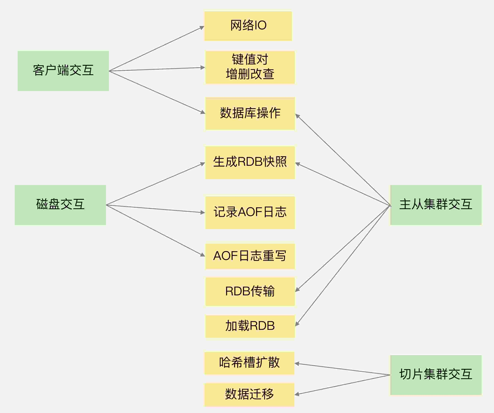

#### 和客户端交互时的阻塞点

网络 IO 有时候会比较慢，但是 Redis 使用了 IO 多路复用机制，避免了主线程一直处在等待网络连接或请求到来的状态，所以，**网络 IO 不是导致 Redis 阻塞的因素**。

键值对的增删改查操作是 Redis 和客户端交互的主要部分，也是 Redis 主线程执行的主要任务。所以，**复杂度高的增删改查操作肯定会阻塞 Redis**。

怎么判断操作复杂度是不是高呢？这里有一个最基本的标准，就是看操作的复杂度是否为 O(N)。

Redis 中涉及集合的操作复杂度通常为 O(N)，我们要在使用时重视起来。例如集合元素全量查询操作 HGETALL、SMEMBERS，以及集合的聚合统计操作，例如求交、并和差集。这些操作可以作为 Redis 的**第一个阻塞点：集合全量查询和聚合操作**。

集合自身的*删除操作同样也有潜在的阻塞风险*。你可能会认为，删除操作很简单，直接把数据删除就好了，为什么还会阻塞主线程呢？

其实，删除操作的本质是要释放键值对占用的内存空间。你可不要小瞧内存的释放过程。释放内存只是第一步，为了更加高效地管理内存空间，在应用程序释放内存时，操作系统需要把释放掉的内存块插入一个空闲内存块的链表，以便后续进行管理和再分配。这个过程本身需要一定时间，而且会阻塞当前释放内存的应用程序，所以，如果一下子释放了大量内存，空闲内存块链表操作时间就会增加，相应地就会造成 Redis 主线程的阻塞。

什么时候会释放大量内存呢？其实就是在删除大量键值对数据的时候，最典型的就是删除包含了大量元素的集合，也称为 bigkey 删除。为了让你对 bigkey 的删除性能有一个直观的印象，我测试了不同元素数量的集合在进行删除操作时所消耗的时间，如下表所示：

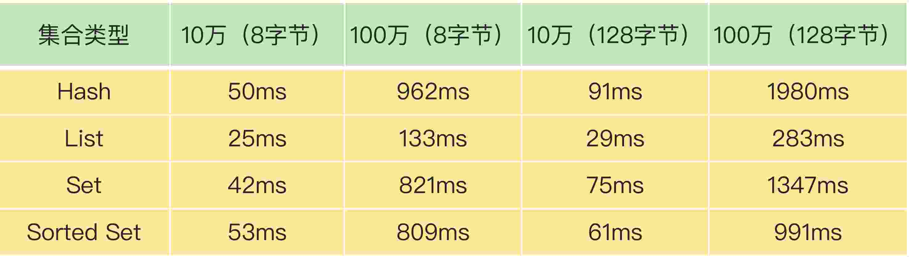

从这张表里，我们可以得出三个结论：

1. 当元素数量从 10 万增加到 100 万时，4 大集合类型的删除时间的增长幅度从 5 倍上升到了近 20 倍；
2. 集合元素越大，删除所花费的时间就越长；
3. 当删除有 100 万个元素的集合时，最大的删除时间绝对值已经达到了 1.98s（Hash 类型）。Redis 的响应时间一般在微秒级别，所以，一个操作达到了近 2s，不可避免地会阻塞主线程。

经过刚刚的分析，很显然，**bigkey 删除操作就是 Redis 的第二个阻塞点**。删除操作对 Redis 实例性能的负面影响很大，而且在实际业务开发时容易被忽略，所以一定要重视它。

既然频繁删除键值对都是潜在的阻塞点了，那么，在 Redis 的数据库级别操作中，清空数据库（例如 FLUSHDB 和 FLUSHALL 操作）必然也是一个潜在的阻塞风险，因为它涉及到删除和释放所有的键值对。所以，这就是 **Redis 的第三个阻塞点：清空数据库**。

#### 和磁盘交互时的阻塞点

之所以把 Redis 与磁盘的交互单独列为一类，主要是因为磁盘 IO 一般都是比较费时费力的，需要重点关注。

幸运的是，Redis 开发者早已认识到磁盘 IO 会带来阻塞，所以就把 Redis 进一步设计为采用子进程的方式生成 RDB 快照文件，以及执行 AOF 日志重写操作。这样一来，这两个操作由子进程负责执行，**慢速的磁盘 IO 就不会阻塞主线程了**。

但是，Redis 直接记录 AOF 日志时，会根据不同的写回策略对数据做落盘保存。一个同步写磁盘的操作的耗时大约是 1～2ms，如果有大量的写操作需要记录在 AOF 日志中，并同步写回的话，就会阻塞主线程了。这就得到了 **Redis 的第四个阻塞点了：AOF 日志同步写**。

#### 主从节点交互时的阻塞点

在主从集群中，主库需要生成 RDB 文件，并传输给从库。主库在复制的过程中，创建和传输 RDB 文件都是由子进程来完成的，不会阻塞主线程。但是，对于从库来说，它在接收了 RDB 文件后，需要使用 FLUSHDB 命令清空当前数据库，这就正好撞上了刚才我们分析的*第三个阻塞点*。

此外，从库在清空当前数据库后，还需要把 RDB 文件加载到内存，这个过程的快慢和 RDB 文件的大小密切相关，RDB 文件越大，加载过程越慢，所以，**加载 RDB 文件就成为了 Redis 的第五个阻塞点**。

#### 切片集群实例交互时的阻塞点

最后，当我们部署 Redis 切片集群时，每个 Redis 实例上分配的哈希槽信息需要在不同实例间进行传递，同时，当需要进行负载均衡或者有实例增删时，数据会在不同的实例间进行迁移。不过，哈希槽的信息量不大，而数据迁移是渐进式执行的，所以，一般来说，这两类操作对 Redis 主线程的阻塞风险不大。

不过，如果你使用了 Redis Cluster 方案，而且同时正好迁移的是 bigkey 的话，就会造成主线程的阻塞，因为 Redis Cluster 使用了同步迁移。当没有 bigkey 时，切片集群的各实例在进行交互时不会阻塞主线程的。

#### 总结

五个阻塞点：

- 集合全量查询和聚合操作；
- bigkey 删除；
- 清空数据库；
- AOF 日志同步写；
- 从库加载 RDB 文件。

如果在主线程中执行这些操作，必然会导致主线程长时间无法服务其他请求。为了避免阻塞式操作，Redis 提供了异步线程机制。所谓的异步线程机制，就是指，Redis 会启动一些子线程，然后把一些任务交给这些子线程，让它们在后台完成，而不再由主线程来执行这些任务。使用异步线程机制执行操作，可以避免阻塞主线程。


### 哪些阻塞点可以异步执行

如果一个操作能被异步执行，就意味着，它并不是 Redis 主线程的关键路径上的操作。我再解释下关键路径上的操作是啥。这就是说，客户端把请求发送给 Redis 后，等着 Redis 返回数据结果的操作。

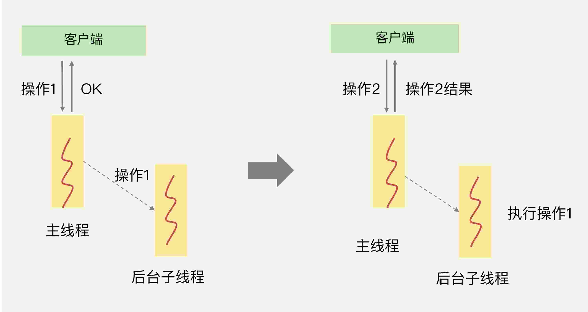

主线程接收到操作 1 后，因为操作 1 并不用给客户端返回具体的数据，所以，主线程可以把它交给后台子线程来完成，同时只要给客户端返回一个“OK”结果就行。在子线程执行操作 1 的时候，客户端又向 Redis 实例发送了操作 2，而此时，客户端是需要使用操作 2 返回的数据结果的，如果操作 2 不返回结果，那么，客户端将一直处于等待状态。

在这个例子中，*操作 1 就不算关键路径上的操作*，因为它不用给客户端返回具体数据，所以可以由后台子线程异步执行。而*操作 2 需要把结果返回给客户端，它就是关键路径上的操作*，所以主线程必须立即把这个操作执行完。

对于 Redis 来说，**读操作是典型的关键路径操作**，因为客户端发送了读操作之后，就会等待读取的数据返回，以便进行后续的数据处理。而 Redis 的第一个阻塞点“集合全量查询和聚合操作”都涉及到了读操作，所以，它们是不能进行异步操作了。

我们再来看看删除操作。删除操作并不需要给客户端返回具体的数据结果，所以不算是关键路径操作。而我们刚才总结的**第二个阻塞点“bigkey 删除”，和第三个阻塞点“清空数据库”，都是对数据做删除，并不在关键路径上**。因此，我们**可以使用后台子线程来异步执行删除操作**。

对于第四个阻塞点“AOF 日志同步写”来说，为了保证数据可靠性，**Redis 实例需要保证 AOF 日志中的操作记录已经落盘，这个操作虽然需要实例等待，但它并不会返回具体的数据结果给实例**。所以，我们*也可以启动一个子线程来执行 AOF 日志的同步写*，而不用让主线程等待 AOF 日志的写完成。

最后，我们再来看下“**从库加载 RDB 文件**”这个阻塞点。从库要想对客户端提供数据存取服务，就必须把 RDB 文件加载完成。所以，这个操作**也属于关键路径上的操作**，我们必须让从库的主线程来执行。

对于 Redis 的五大阻塞点来说，除了“集合全量查询和聚合操作”和“从库加载 RDB 文件”，其他三个阻塞点涉及的操作都不在关键路径上，所以，我们可以使用 Redis 的异步子线程机制来实现 bigkey 删除，清空数据库，以及 AOF 日志同步写。

### 异步的子线程机制

Redis 主线程启动后，会使用操作系统提供的 pthread_create 函数创建 3 个子线程，分别由它们负责 AOF 日志写操作、键值对删除以及文件关闭的异步执行。

主线程通过一个链表形式的任务队列和子线程进行交互。当收到键值对删除和清空数据库的操作时，主线程会把这个操作封装成一个任务，放入到任务队列中，然后给客户端返回一个完成信息，表明删除已经完成。

但实际上，这个时候删除还没有执行，等到后台子线程从任务队列中读取任务后，才开始实际删除键值对，并释放相应的内存空间。因此，我们把这种异步删除也称为**惰性删除**（lazy free）。此时，删除或清空操作不会阻塞主线程，这就避免了对主线程的性能影响。

<!--1、lazy-free是4.0新增的功能，但是默认是关闭的，需要手动开启。
\2、手动开启lazy-free时，有4个选项可以控制，分别对应不同场景下，要不要开启异步释放内存机制：
\a) lazyfree-lazy-expire：key在过期删除时尝试异步释放内存
\b) lazyfree-lazy-eviction：内存达到maxmemory并设置了淘汰策略时尝试异步释放内存
\c) lazyfree-lazy-server-del：执行RENAME/MOVE等命令或需要覆盖一个key时，删除旧key尝试异步释放内存
\d) replica-lazy-flush：主从全量同步，从库清空数据库时异步释放内存
\3、即使开启了lazy-free，如果直接使用DEL命令还是会同步删除key，只有使用UNLINK命令才会可能异步删除key。
\4、这也是最关键的一点，上面提到开启lazy-free的场景，除了replica-lazy-flush之外，其他情况都只是*可能*去异步释放key的内存，并不是每次必定异步释放内存的。
\开启lazy-free后，Redis在释放一个key的内存时，首先会评估代价，如果释放内存的代价很小，那么就直接在主线程中操作了，没必要放到异步线程中执行（不同线程传递数据也会有性能消耗）。-->

和惰性删除类似，当 AOF 日志配置成 everysec 选项后，主线程会把 AOF 写日志操作封装成一个任务，也放到任务队列中。后台子线程读取任务后，开始自行写入 AOF 日志，这样主线程就不用一直等待 AOF 日志写完了。

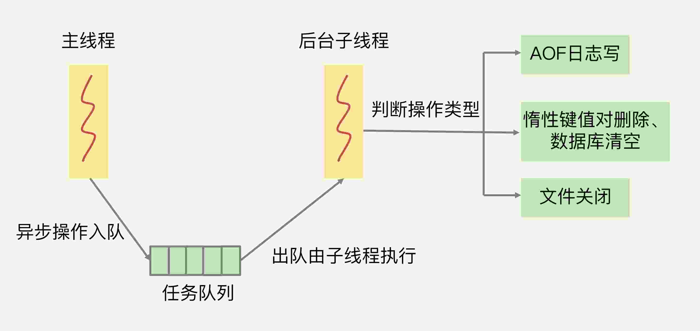

这里有个地方需要你注意一下，**异步的键值对删除和数据库清空操作**是 **Redis 4.0** 后提供的功能，Redis 也提供了新的命令来执行这两个操作。

- 键值对删除：当你的集合类型中有大量元素（例如有百万级别或千万级别元素）需要删除时，我建议你使用 UNLINK 命令。
- 清空数据库：可以在 FLUSHDB 和 FLUSHALL 命令后加上 ASYNC 选项，这样就可以让后台子线程异步地清空数据库，如下所示：

```sh
$ FLUSHDB ASYNC
$ FLUSHALL AYSNC
```


集合全量查询和聚合操作、从库加载 RDB 文件是在关键路径上，无法使用异步操作来完成。对于这两个阻塞点，我也给你两个小建议。

- 集合全量查询和聚合操作：可以使用 SCAN 命令，分批读取数据，再在客户端进行聚合计算；
- 从库加载 RDB 文件：把主库的数据量大小控制在 2~4GB 左右，以保证 RDB 文件能以较快的速度加载。


### 每课一问

Redis 的写操作（例如 SET、HSET、SADD 等）是在关键路径上吗？

答案：Redis 本身是内存数据库，所以，写操作都需要在内存上完成执行后才能返回，这就意味着，如果这些写操作处理的是大数据集，例如 1 万个数据，那么，主线程需要等这 1 万个数据都写完，才能继续执行后面的命令。所以说，Redis 的写操作也是在关键路径上的。

这个问题是希望你把面向内存和面向磁盘的写操作区分开。当一个写操作需要把数据写到磁盘时，一般来说，写操作只要把数据写到操作系统的内核缓冲区就行。不过，如果我们执行了同步写操作，那就必须要等到数据写回磁盘。所以，面向磁盘的写操作一般不会在关键路径上。

我看到有同学说，根据写操作命令的返回值来决定是否在关键路径上，如果返回值是 OK，或者客户端不关心是否写成功，那么，此时的写操作就不算在关键路径上。

这个思路不错，不过，需要注意的是，客户端经常会阻塞等待发送的命令返回结果，在上一个命令还没有返回结果前，客户端会一直等待，直到返回结果后，才会发送下一个命令。此时，即使我们不关心返回结果，客户端也要等到写操作执行完成才行。所以，在不关心写操作返回结果的场景下，可以对 Redis 客户端做异步改造。具体点说，就是使用异步线程发送这些不关心返回结果的命令，而不是在 Redis 客户端中等待这些命令的结果。


## 17 | 为什么CPU结构也会影响Redis的性能

CPU 的多核架构以及多 CPU 架构，也会影响到 Redis 的性能。如果不了解 CPU 对 Redis 的影响，在对 Redis 的性能进行调优时，就可能会遗漏一些调优方法，不能把 Redis 的性能发挥到极限。

### 主流的 CPU 架构

*一个 CPU 处理器中一般有多个运行核心，我们把一个运行核心称为一个物理核，每个物理核都可以运行应用程序*。*每个物理核都拥有私有的一级缓存（Level 1 cache，简称 L1 cache），包括一级指令缓存和一级数据缓存，以及私有的二级缓存（Level 2 cache，简称 L2 cache）*。

物理核的私有缓存空间只能被当前的这个物理核使用，其他的物理核无法对这个核的缓存空间进行数据存取。

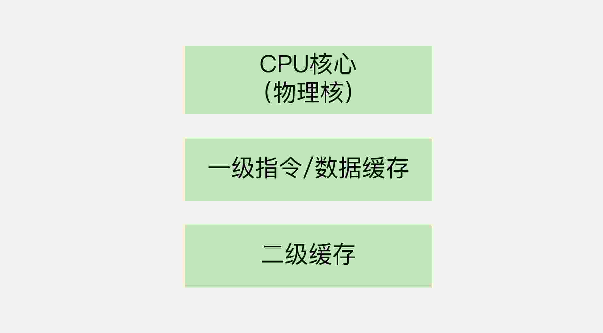

因为 L1 和 L2 缓存是每个物理核私有的，所以，当数据或指令保存在 L1、L2 缓存时，物理核访问它们的延迟不超过 10 纳秒，速度非常快。那么，如果 Redis 把要运行的指令或存取的数据保存在 L1 和 L2 缓存的话，就能高速地访问这些指令和数据。

但是，这些 **L1 和 L2 缓存**的大小受限于处理器的制造技术，一般只有 **KB 级别**，存不下太多的数据。如果 L1、L2 缓存中没有所需的数据，应用程序就需要访问**内存**来获取数据。而应用程序的访存延迟一般在百**纳秒级别**，是访问 L1、L2 缓存的延迟的近 10 倍，不可避免地会对性能造成影响。

所以，不同的物理核还会**共享一个共同的三级缓存**（Level 3 cache，简称为 L3 cache）。L3 缓存能够使用的存储资源比较多，所以一般比较大，能达到几 **MB 到几十 MB**，这就能让应用程序缓存更多的数据。当 L1、L2 缓存中没有数据缓存时，可以访问 L3，尽可能避免访问内存。

另外，现在主流的 CPU 处理器中，*每个物理核通常都会运行两个超线程，也叫作逻辑核。同一个物理核的逻辑核会共享使用 L1、L2 缓存*。

物理核和逻辑核，以及一级、二级缓存的关系

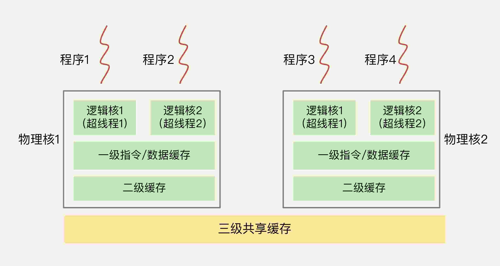

在主流的服务器上，一个 CPU 处理器会有 10 到 20 多个物理核。同时，为了提升服务器的处理能力，服务器上通常还会有多个 CPU 处理器（也称为多 CPU Socket），每个处理器有自己的物理核（包括 L1、L2 缓存），L3 缓存，以及连接的内存，同时，不同处理器间通过总线连接。

下图显示的就是多 CPU Socket 的架构，图中有两个 Socket，每个 Socket 有两个物理核。

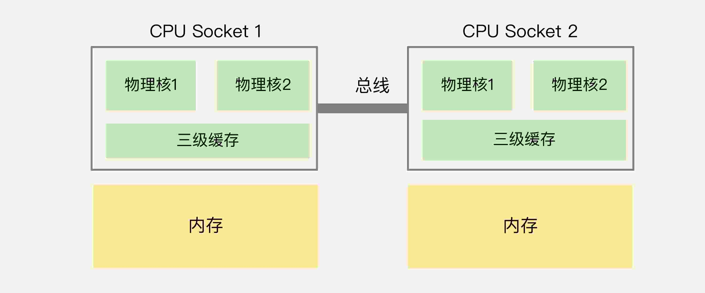

**在多 CPU 架构上，应用程序可以在不同的处理器上运行**。在刚才的图中，Redis 可以先在 Socket 1 上运行一段时间，然后再被调度到 Socket 2 上运行。

但是，有个地方需要你注意一下：如果应用程序先在一个 Socket 上运行，并且把数据保存到了内存，然后被调度到另一个 Socket 上运行，此时，应用程序再进行内存访问时，就需要访问之前 Socket 上连接的内存，这种访问属于**远端内存访问**。**和访问 Socket 直接连接的内存相比，远端内存访问会增加应用程序的延迟**。

在多 CPU 架构下，一个应用程序访问所在 Socket 的本地内存和访问远端内存的延迟并不一致，所以，我们也把这个架构称为**非统一内存访问架构**（Non-Uniform Memory Access，NUMA 架构）。

到这里，我们就知道了主流的 CPU 多核架构和多 CPU 架构，我们来简单总结下 CPU 架构对应用程序运行的影响。

- L1、L2 缓存中的指令和数据的访问速度很快，所以，充分利用 L1、L2 缓存，可以有效缩短应用程序的执行时间；
- 在 NUMA 架构下，如果应用程序从一个 Socket 上调度到另一个 Socket 上，就可能会出现远端内存访问的情况，这会直接增加应用程序的执行时间。

### CPU 多核对 Redis 性能的影响

在一个 CPU 核上运行时，应用程序需要记录自身使用的*软硬件资源信息（例如栈指针、CPU 核的寄存器值等）*，我们把这些信息称为**运行时信息**。同时，应用程序访问最频繁的指令和数据还会被缓存到 L1、L2 缓存上，以便提升执行速度。

但是，在多核 CPU 的场景下，一旦应用程序需要在一个新的 CPU 核上运行，那么，运行时信息就需要重新加载到新的 CPU 核上。而且，新的 CPU 核的 L1、L2 缓存也需要重新加载数据和指令，这会导致程序的运行时间增加。

如果在 CPU 多核场景下，Redis 实例被频繁调度到不同 CPU 核上运行的话，那么，对 Redis 实例的请求处理时间影响就更大了。**每调度一次，一些请求就会受到运行时信息、指令和数据重新加载过程的影响，这就会导致某些请求的延迟明显高于其他请求**。

所以，我们要避免 Redis 总是在不同 CPU 核上来回调度执行。于是，我们尝试着把 Redis 实例和 CPU 核绑定了，让一个 Redis 实例固定运行在一个 CPU 核上。我们可以使用 taskset 命令把一个程序绑定在一个核上运行。

比如说，我们执行下面的命令，就把 Redis 实例绑在了 0 号核上，其中，“-c”选项用于设置要绑定的核编号。

```sh
$ taskset -c 0 ./redis-server
```

绑定以后，我们进行了测试。我们发现，Redis 实例的 GET 和 PUT 的 99% 尾延迟一下子就分别降到了 260 微秒和 482 微秒，达到了我们期望的目标。


可以看到，在 CPU 多核的环境下，通过绑定 Redis 实例和 CPU 核，可以有效降低 Redis 的尾延迟。当然，绑核不仅对降低尾延迟有好处，同样也能降低平均延迟、提升吞吐率，进而提升 Redis 性能。

> 99% 尾延迟：我们把所有请求的处理延迟从小到大排个序，99% 的请求延迟小于的值就是 99% 尾延迟。比如说，我们有 1000 个请求，假设按请求延迟从小到大排序后，第 991 个请求的延迟实测值是 1ms，而前 990 个请求的延迟都小于 1ms，所以，这里的 99% 尾延迟就是 1ms。

> context switch 是指线程的上下文切换，这里的上下文就是线程的运行时信息。在 CPU 多核的环境中，一个线程先在一个 CPU 核上运行，之后又切换到另一个 CPU 核上运行，这时就会发生 context switch。

### CPU 的 NUMA 架构对 Redis 性能的影响

在实际应用 Redis 时，我经常看到一种做法，为了提升 Redis 的网络性能，把操作系统的网络中断处理程序和 CPU 核绑定。这个做法可以避免网络中断处理程序在不同核上来回调度执行，的确能有效提升 Redis 的网络处理性能。

但是，网络中断程序是要和 Redis 实例进行网络数据交互的，一旦把网络中断程序绑核后，我们就需要注意 Redis 实例是绑在哪个核上了，这会关系到 Redis 访问网络数据的效率高低。

我们先来看下 Redis 实例和网络中断程序的数据交互：网络中断处理程序从网卡硬件中读取数据，并把数据写入到操作系统内核维护的一块内存缓冲区。内核会通过 epoll 机制触发事件，通知 Redis 实例，Redis 实例再把数据从内核的内存缓冲区拷贝到自己的内存空间，如下图所示：

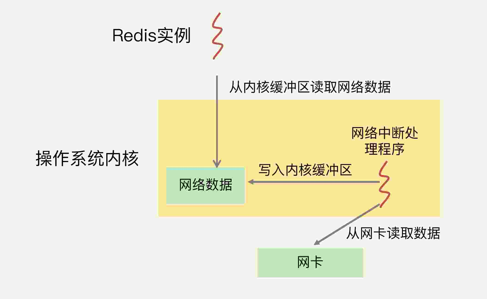

那么，在 CPU 的 NUMA 架构下，当网络中断处理程序、Redis 实例分别和 CPU 核绑定后，就会有一个潜在的风险：**如果网络中断处理程序和 Redis 实例各自所绑的 CPU 核不在同一个 CPU Socket 上，那么，Redis 实例读取网络数据时，就需要跨 CPU Socket 访问内存，这个过程会花费较多时间**。


图中的网络中断处理程序被绑在了 CPU Socket 1 的某个核上，而 Redis 实例则被绑在了 CPU Socket 2 上。此时，网络中断处理程序读取到的网络数据，被保存在 CPU Socket 1 的本地内存中，当 Redis 实例要访问网络数据时，就需要 Socket 2 通过总线把内存访问命令发送到 Socket 1 上，进行远程访问，时间开销比较大。

我们曾经做过测试，和访问 CPU Socket 本地内存相比，跨 CPU Socket 的内存访问延迟增加了 18%，这自然会导致 Redis 处理请求的延迟增加。

所以，为了避免 Redis 跨 CPU Socket 访问网络数据，我们最好把网络中断程序和 Redis 实例绑在同一个 CPU Socket 上，这样一来，Redis 实例就可以直接从本地内存读取网络数据了，如下图所示：

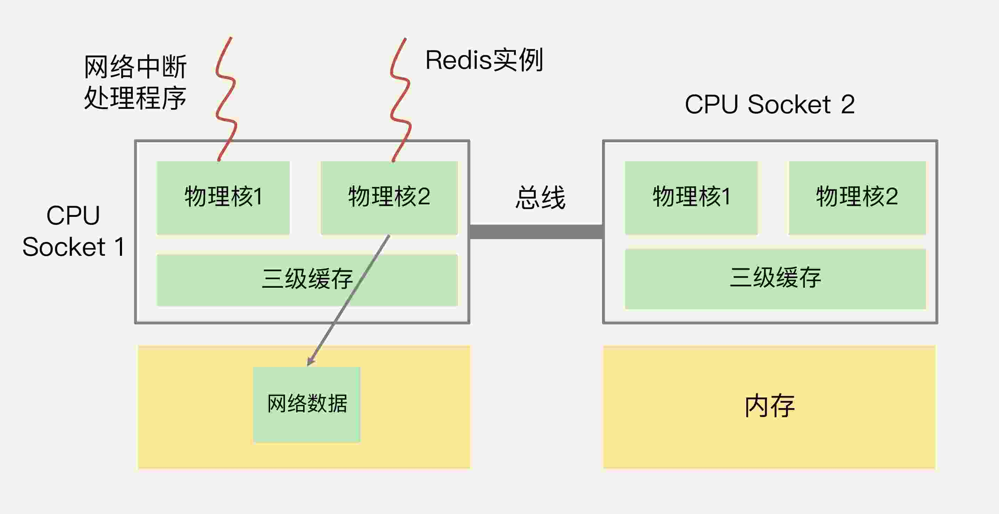

不过，需要注意的是，**在 CPU 的 NUMA 架构下，对 CPU 核的编号规则，并不是先把一个 CPU Socket 中的所有逻辑核编完，再对下一个 CPU Socket 中的逻辑核编码，而是先给每个 CPU Socket 中每个物理核的第一个逻辑核依次编号，再给每个 CPU Socket 中的物理核的第二个逻辑核依次编号**。

我给你举个例子。假设有 2 个 CPU Socket，每个 Socket 上有 6 个物理核，每个物理核又有 2 个逻辑核，总共 24 个逻辑核。我们可以执行 lscpu 命令，查看到这些核的编号：

```sh
$ lscpu

Architecture: x86_64
...
NUMA node0 CPU(s): 0-5,12-17
NUMA node1 CPU(s): 6-11,18-23
...
```

可以看到，NUMA node0 的 CPU 核编号是 0 到 5、12 到 17。其中，0 到 5 是 node0 上的 6 个物理核中的第一个逻辑核的编号，12 到 17 是相应物理核中的第二个逻辑核编号。NUMA node1 的 CPU 核编号规则和 node0 一样。

所以，在绑核时，我们一定要注意，不能想当然地认为第一个 Socket 上的 12 个逻辑核的编号就是 0 到 11。否则，网络中断程序和 Redis 实例就可能绑在了不同的 CPU Socket 上。

比如说，如果我们把网络中断程序和 Redis 实例分别绑到编号为 1 和 7 的 CPU 核上，此时，它们仍然是在 2 个 CPU Socket 上，Redis 实例仍然需要跨 Socket 读取网络数据。

**所以，你一定要注意 NUMA 架构下 CPU 核的编号方法，这样才不会绑错核**。

### 绑核的风险和解决方案

Redis 除了主线程以外，还有用于 RDB 生成和 AOF 重写的子进程，以及其他后台线程。

当我们把 Redis 实例绑到一个 CPU 逻辑核上时，就会导致子进程、后台线程和 Redis 主线程竞争 CPU 资源，一旦子进程或后台线程占用 CPU 时，主线程就会被阻塞，导致 Redis 请求延迟增加。

针对这种情况，我来给你介绍两种解决方案，分别是**一个 Redis 实例对应绑一个物理核**和**优化 Redis 源码**。

#### 一个 Redis 实例对应绑一个物理核

在给 Redis 实例绑核时，我们不要把一个实例和一个逻辑核绑定，而要和一个物理核绑定，也就是说，把一个物理核的 2 个逻辑核都用上。

我们还是以刚才的 NUMA 架构为例，NUMA node0 的 CPU 核编号是 0 到 5、12 到 17。其中，编号 0 和 12、1 和 13、2 和 14 等都是表示一个物理核的 2 个逻辑核。所以，在绑核时，我们使用属于同一个物理核的 2 个逻辑核进行绑核操作。例如，我们执行下面的命令，就把 Redis 实例绑定到了逻辑核 0 和 12 上，而这两个核正好都属于物理核 1。

```sh
$ taskset -c 0,12 ./redis-server
```

和只绑一个逻辑核相比，把 Redis 实例和物理核绑定，可以让主线程、子进程、后台线程共享使用 2 个逻辑核，可以在一定程度上缓解 CPU 资源竞争。但是，因为只用了 2 个逻辑核，它们相互之间的 CPU 竞争仍然还会存在。如果你还想进一步减少 CPU 竞争，我再给你介绍一种方案。

#### 优化 Redis 源码

这个方案就是通过修改 Redis 源码，把子进程和后台线程绑到不同的 CPU 核上。如果你对 Redis 的源码不太熟悉，也没关系，因为这是通过编程实现绑核的一个通用做法。学会了这个方案，你可以在熟悉了源码之后把它用上，也可以应用在其他需要绑核的场景中。

接下来，我先介绍一下通用的做法，然后，再具体说说可以把这个做法对应到 Redis 的哪部分源码中。

通过编程实现绑核时，要用到操作系统提供的 1 个数据结构 cpu_set_t 和 3 个函数 CPU_ZERO、CPU_SET 和 sched_setaffinity，我先来解释下它们。

- cpu_set_t 数据结构：是一个位图，每一位用来表示服务器上的一个 CPU 逻辑核。
- CPU_ZERO 函数：以 cpu_set_t 结构的位图为输入参数，把位图中所有的位设置为 0。
- CPU_SET 函数：以 CPU 逻辑核编号和 cpu_set_t 位图为参数，把位图中和输入的逻辑核编号对应的位设置为 1。
- sched_setaffinity 函数：以进程 / 线程 ID 号和 cpu_set_t 为参数，检查 cpu_set_t 中哪一位为 1，就把输入的 ID 号所代表的进程 / 线程绑在对应的逻辑核上。

那么，怎么在编程时把这三个函数结合起来实现绑核呢？很简单，我们分四步走就行。

- 第一步：创建一个 cpu_set_t 结构的位图变量；
- 第二步：使用 CPU_ZERO 函数，把 cpu_set_t 结构的位图所有的位都设置为 0；
- 第三步：根据要绑定的逻辑核编号，使用 CPU_SET 函数，把 cpu_set_t 结构的位图相应位设置为 1；
- 第四步：使用 sched_setaffinity 函数，把程序绑定在 cpu_set_t 结构位图中为 1 的逻辑核上。

下面，我就具体介绍下，分别把后台线程、子进程绑到不同的核上的做法。

先说后台线程。为了让你更好地理解编程实现绑核，你可以看下这段示例代码，它实现了为线程绑核的操作：

```c++
//线程函数
void worker(int bind_cpu){
    cpu_set_t cpuset;  //创建位图变量
    CPU_ZERO(&cpu_set); //位图变量所有位设置0
    CPU_SET(bind_cpu, &cpuset); //根据输入的bind_cpu编号，把位图对应为设置为1
    sched_setaffinity(0, sizeof(cpuset), &cpuset); //把程序绑定在cpu_set_t结构位图中为1的逻辑核

    //实际线程函数工作
}

int main(){
    pthread_t pthread1
    //把创建的pthread1绑在编号为3的逻辑核上
    pthread_create(&pthread1, NULL, (void *)worker, 3);
}
```

对于 Redis 来说，它是在 `bio.c` 文件中的 `bioProcessBackgroundJobs` 函数中创建了后台线程。`bioProcessBackgroundJobs` 函数类似于刚刚的例子中的 `worker` 函数，在这个函数中实现绑核四步操作，就可以把后台线程绑到和主线程不同的核上了。

和给线程绑核类似，当我们使用 `fork` 创建子进程时，也可以把刚刚说的四步操作实现在 `fork` 后的子进程代码中，示例代码如下：

```c++
int main(){
   //用fork创建一个子进程
   pid_t p = fork();
   if(p < 0){
      printf(" fork error\n");
   }
   //子进程代码部分
   else if(!p){
      cpu_set_t cpuset;  //创建位图变量
      CPU_ZERO(&cpu_set); //位图变量所有位设置0
      CPU_SET(3, &cpuset); //把位图的第3位设置为1
      sched_setaffinity(0, sizeof(cpuset), &cpuset);  //把程序绑定在3号逻辑核
      //实际子进程工作
      exit(0);
   }
   ...
}
```

对于 Redis 来说，生成 RDB 和 AOF 日志重写的子进程分别是下面两个文件的函数中实现的。

- rdb.c 文件：rdbSaveBackground 函数；
- aof.c 文件：rewriteAppendOnlyFileBackground 函数。

这两个函数中都调用了 fork 创建子进程，所以，我们可以在子进程代码部分加上绑核的四步操作。

使用源码优化方案，我们既可以实现 Redis 实例绑核，避免切换核带来的性能影响，还可以让子进程、后台线程和主线程不在同一个核上运行，避免了它们之间的 CPU 资源竞争。相比使用 taskset 绑核来说，这个方案可以进一步降低绑核的风险。


### 每课一问

在一台有 2 个 CPU Socket（每个 Socket 8 个物理核）的服务器上，我们部署了有 8 个实例的 Redis 切片集群（8 个实例都为主节点，没有主备关系），现在有两个方案：

1. 在同一个 CPU Socket 上运行 8 个实例，并和 8 个 CPU 核绑定；
2. 在 2 个 CPU Socket 上各运行 4 个实例，并和相应 Socket 上的核绑定。

如果不考虑网络数据读取的影响，你会选择哪个方案呢？

答案：建议使用第二个方案，主要有两方面的原因。

1. 同一个 CPU Socket 上的进程，会共享 L3 缓存。如果把 8 个实例都部署在同一个 Socket 上，它们会竞争 L3 缓存，这就会导致它们的 L3 缓存命中率降低，影响访问性能。
2. 同一个 CPU Socket 上的进程，会使用同一个 Socket 上的内存空间。8 个实例共享同一个 Socket 上的内存空间，肯定会竞争内存资源。如果有实例保存的数据量大，其他实例能用到的内存空间可能就不够了，此时，其他实例就会跨 Socket 申请内存，进而造成跨 Socket 访问内存，造成实例的性能降低。

另外，在切片集群中，不同实例间通过网络进行消息通信和数据迁移，并不会使用共享内存空间进行跨实例的数据访问。所以，即使把不同的实例部署到不同的 Socket 上，它们之间也不会发生跨 Socket 内存的访问，不会受跨 Socket 内存访问的负面影响。


## 18,19 | 波动的响应延迟：如何应对变慢的Redis

在 Redis 的实际部署应用中，有一个非常严重的问题，那就是 Redis 突然变慢了。一旦出现这个问题，不仅会直接影响用户的使用体验，还可能会影响到“旁人”，也就是和 Redis 在同一个业务系统中的其他系统，比如说数据库。

应用服务器（App Server）要完成一个事务性操作，包括在 MySQL 上执行一个写事务，在 Redis 上插入一个标记位，并通过一个第三方服务给用户发送一条完成消息。

这三个操作都需要保证事务原子性，所以，如果此时 Redis 的延迟增加，就会拖累 App Server 端整个事务的执行。这个事务一直完成不了，又会导致 MySQL 上写事务占用的资源无法释放，进而导致访问 MySQL 的其他请求被阻塞。很明显，Redis 变慢会带来严重的连锁反应。

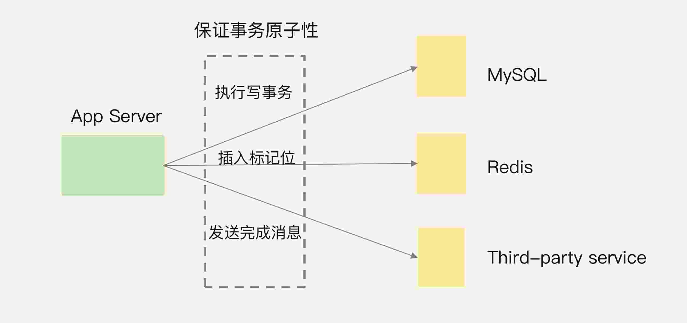

接下来的两节课，我再向你介绍一下如何系统性地应对 Redis 变慢这个问题。我会从问题认定、系统性排查和应对方案这 3 个方面给你具体讲解。

### Redis 真的变慢了吗

在实际解决问题之前，我们首先要弄清楚，如何判断 Redis 是不是真的变慢了。一个最直接的方法，就是**查看 Redis 的响应延迟**。

大部分时候，Redis 延迟很低，但是在某些时刻，有些 Redis 实例会出现很高的响应延迟，甚至能达到几秒到十几秒，不过持续时间不长，这也叫延迟“**毛刺**”。当你发现 **Redis 命令的执行时间突然就增长到了几秒，基本就可以认定 Redis 变慢了**。这种方法是看 Redis 延迟的绝对值，但是，在不同的软硬件环境下，Redis 本身的绝对性能并不相同。比如，在我的环境中，当延迟为 1ms 时，我判定 Redis 变慢了，但是你的硬件配置高，那么，在你的运行环境下，可能延迟是 0.2ms 的时候，你就可以认定 Redis 变慢了。

所以，这里我就要说第二个方法了，也就是**基于当前环境下的 Redis 基线性能做判断**。所谓的基线性能呢，也就是一个系统在低压力、无干扰下的基本性能，这个性能只由当前的软硬件配置决定。

从 2.8.7 版本开始，`redis-cli` 命令提供了`–intrinsic-latency` 选项，可以用来**监测和统计测试期间内的最大延迟**，这个延迟可以作为 **Redis 的基线性能**。其中，测试时长可以用 `–intrinsic-latency` 选项的参数来指定。

举个例子，比如说，我们运行下面的命令，该命令会打印 120 秒内监测到的最大延迟。可以看到，这里的最大延迟是 119 微秒，也就是基线性能为 119 微秒。一般情况下，运行 120 秒就足够监测到最大延迟了，所以，我们可以把参数设置为 120。

```sh
$ ./redis-cli --intrinsic-latency 120
Max latency so far: 17 microseconds.
Max latency so far: 44 microseconds.
Max latency so far: 94 microseconds.
Max latency so far: 110 microseconds.
Max latency so far: 119 microseconds.

36481658 total runs (avg latency: 3.2893 microseconds / 3289.32 nanoseconds per run).
Worst run took 36x longer than the average latency.
```

需要注意的是，基线性能和当前的操作系统、硬件配置相关。因此，我们可以把它和 Redis 运行时的延迟结合起来，再进一步判断 Redis 性能是否变慢了。

一般来说，你要把运行时延迟和基线性能进行对比，如果你观察到的 **Redis 运行时延迟是其基线性能的 2 倍及以上**，就可以**认定 Redis 变慢**了。

判断基线性能这一点，对于在虚拟化环境下运行的 Redis 来说，非常重要。这是因为，在虚拟化环境（例如虚拟机或容器）中，由于增加了虚拟化软件层，与物理机相比，虚拟机或容器本身就会引入一定的性能开销，所以基线性能会高一些。下面的测试结果，显示的就是某一个虚拟机上运行 Redis 时测的基线性能。

```sh
$ ./redis-cli --intrinsic-latency 120
Max latency so far: 692 microseconds.
Max latency so far: 915 microseconds.
Max latency so far: 2193 microseconds.
Max latency so far: 9343 microseconds.
Max latency so far: 9871 microseconds.
```

可以看到，由于虚拟化软件本身的开销，此时的基线性能已经达到了 9.871ms。如果该 Redis 实例的运行时延迟为 10ms，这并不能算作性能变慢，因为此时，运行时延迟只比基线性能增加了 1.3%。如果你不了解基线性能，一看到较高的运行时延迟，就很有可能误判 Redis 变慢了。

不过，我们通常是通过客户端和网络访问 Redis 服务，**为了避免网络对基线性能的影响**，刚刚说的这个命令需要在服务器端直接运行，这也就是说，我们**只考虑服务器端软硬件环境的影响**。

如果你想了解网络对 Redis 性能的影响，一个简单的方法是用 `iPerf` 这样的工具，*测量从 Redis 客户端到服务器端的网络延迟*。如果这个延迟有几十毫秒甚至是几百毫秒，就说明，Redis 运行的网络环境中很可能有大流量的其他应用程序在运行，导致网络拥塞了。这个时候，你就需要协调网络运维，调整网络的流量分配了。

### 如何应对 Redis 变慢

Redis 的性能诊断也有章可依，这就是影响 Redis 的关键因素。你可以重点关注下我在图上新增的红色模块，也就是 Redis 自身的操作特性、文件系统和操作系统，它们是影响 Redis 性能的三大要素。

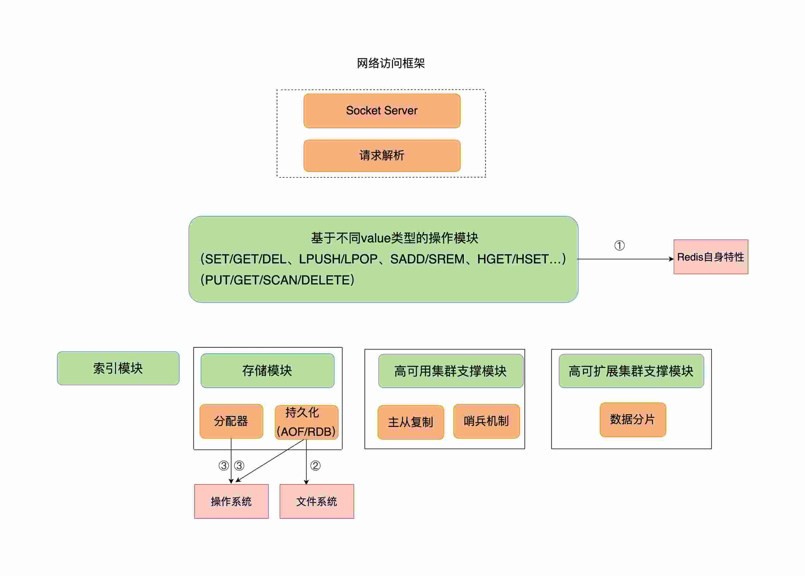

接下来，我将从这三大要素入手，结合实际的应用场景，依次给你介绍从不同要素出发排查和解决问题的实践经验。

### Redis 自身操作特性的影响

首先，我们来学习下 Redis 提供的键值对命令操作对延迟性能的影响。我重点介绍两类关键操作：**慢查询命令**和**过期 key 操作**。

#### 慢查询命令

慢查询命令，就是指**在 Redis 中执行速度慢的命令，这会导致 Redis 延迟增加**。Redis 提供的命令操作很多，并不是所有命令都慢，这和命令操作的复杂度有关。所以，我们必须要知道 Redis 的不同命令的复杂度。

比如说，Value 类型为 String 时，GET/SET 操作主要就是操作 Redis 的哈希表索引。这个操作复杂度基本是固定的，即 O(1)。但是，当 Value 类型为 Set 时，SORT、SUNION/SMEMBERS 操作复杂度分别为 O(N+M*log(M)) 和 O(N)。其中，N 为 Set 中的元素个数，M 为 SORT 操作返回的元素个数。这个复杂度就增加了很多。[Redis 官方文档](https://redis.io/commands/)中对每个命令的复杂度都有介绍，当你需要了解某个命令的复杂度时，可以直接查询。

当你发现 Redis 性能变慢时，可以通过 **Redis 日志**，或者是 **latency monitor 工具**，查询变慢的请求，根据请求对应的具体命令以及官方文档，确认下是否采用了复杂度高的慢查询命令。


如果的确有大量的慢查询命令，有两种处理方式：

1. **用其他高效命令代替**。比如说，如果你需要返回一个 SET 中的所有成员时，不要使用 SMEMBERS 命令，而是要使用 SSCAN 多次迭代返回，避免一次返回大量数据，造成线程阻塞。
2. **当你需要执行排序、交集、并集操作时，可以在客户端完成，而不要用 SORT、SUNION、SINTER 这些命令，以免拖慢 Redis 实例**。

当然，如果业务逻辑就是要求使用慢查询命令，那你得考虑采用性能更好的 CPU，更快地完成查询命令，避免慢查询的影响。

还有一个比较*容易忽略的慢查询命令*，就是 **KEYS**。它用于返回和输入模式匹配的所有 key，例如，以下命令返回所有包含“name”字符串的 keys。

```sh
redis> KEYS *name*
1) "lastname"
2) "firstname"
```

**因为 KEYS 命令需要遍历存储的键值对**，所以操作延时高。如果你不了解它的实现而使用了它，就会导致 Redis 性能变慢。所以，**KEYS 命令一般不被建议用于生产环境中**。

#### 过期 key 操作

接下来，我们来看过期 key 的自动删除机制。**它是 Redis 用来回收内存空间的常用机制**，应用广泛，**本身就会引起 Redis 操作阻塞，导致性能变慢**，所以，你必须要知道该机制对性能的影响。

Redis 键值对的 key 可以设置过期时间。默认情况下，Redis 每 100 毫秒会删除一些过期 key，具体的算法如下：

1. 采样 ACTIVE_EXPIRE_CYCLE_LOOKUPS_PER_LOOP 个数的 key，并将其中过期的 key 全部删除；
2. 如果超过 25% 的 key 过期了，则重复删除的过程，直到过期 key 的比例降至 25% 以下。

`ACTIVE_EXPIRE_CYCLE_LOOKUPS_PER_LOOP` 是 Redis 的一个参数，默认是 20，那么，一秒内基本有 200 个过期 key 会被删除。这一策略对清除过期 key、释放内存空间很有帮助。如果每秒钟删除 200 个过期 key，并不会对 Redis 造成太大影响。

但是，如果触发了上面这个算法的第二条，Redis 就会一直删除以释放内存空间。注意，**删除操作是阻塞的**（**Redis 4.0** *后可以用异步线程机制来减少阻塞影响*）。所以，一旦该条件触发，Redis 的线程就会一直执行删除，这样一来，就没办法正常服务其他的键值操作了，就会进一步引起其他键值操作的延迟增加，Redis 就会变慢。

那么，算法的第二条是怎么被触发的呢？其中一个重要来源，就是**频繁使用带有相同时间参数的 EXPIREAT 命令设置过期 key**，这就会导致，在同一秒内有大量的 key 同时过期。


现在，我就要给出第二条排查建议和解决方法了。

你要*检查业务代码在使用 EXPIREAT 命令设置 key 过期时间时*，**是否使用了相同的 UNIX 时间戳**，**有没有使用 EXPIRE 命令给批量的 key 设置相同的过期秒数**。因为，这都会造成大量 key 在同一时间过期，导致性能变慢。

遇到这种情况时，千万不要嫌麻烦，你首先要根据实际业务的使用需求，决定 EXPIREAT 和 EXPIRE 的过期时间参数。其次，如果一批 key 的确是同时过期，你还可以在 EXPIREAT 和 EXPIRE 的过期时间参数上，加上一个一定大小范围内的随机数，这样，既保证了 key 在一个邻近时间范围内被删除，又避免了同时过期造成的压力。


### 文件系统：AOF 模式

为了保证数据可靠性，Redis 会采用 AOF 日志或 RDB 快照。其中，AOF 日志提供了三种日志写回策略：**no、everysec、always**。这三种写回策略依赖文件系统的两个系统调用完成，也就是 **write** 和 **fsync**。

*write 只要把日志记录写到内核缓冲区，就可以返回了，并不需要等待日志实际写回到磁盘；而 fsync 需要把日志记录写回到磁盘后才能返回，时间较长*。

下面这张表展示了三种写回策略所执行的系统调用。

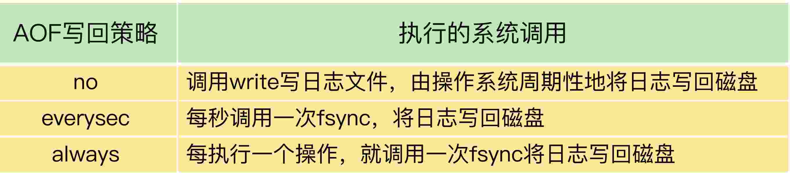

当写回策略配置为 `everysec` 和 `always` 时，Redis 需要调用 `fsync` 把日志写回磁盘。但是，这两种写回策略的具体执行情况还不太一样。

在使用 `everysec` 时，Redis 允许丢失一秒的操作记录，所以，Redis 主线程并不需要确保每个操作记录日志都写回磁盘。而且，`fsync` 的执行时间很长，如果是在 Redis 主线程中执行 `fsync`，就容易阻塞主线程。所以，**当写回策略配置为 `everysec` 时**，**Redis 会使用后台的子线程异步完成 `fsync` 的操作**。

而对于 `always` 策略来说，Redis 需要确保每个操作记录日志都写回磁盘，如果用后台子线程异步完成，主线程就无法及时地知道每个操作是否已经完成了，这就不符合 `always` 策略的要求了。所以，**`always` 策略并不使用后台子线程来执行**。

另外，在使用 AOF 日志时，为了避免日志文件不断增大，Redis 会执行 AOF 重写，生成体量缩小的新的 AOF 日志文件。AOF 重写本身需要的时间很长，也容易阻塞 Redis 主线程，所以，**Redis 使用子进程来进行 AOF 重写**。

但是，这里有一个潜在的风险点：AOF 重写会对磁盘进行大量 IO 操作，同时，`fsync` 又需要等到数据写到磁盘后才能返回，所以，当 AOF 重写的压力比较大时，就会导致 `fsync` 被阻塞。虽然 `fsync` 是由后台子线程负责执行的，但是，主线程会监控 `fsync` 的执行进度。

当主线程使用后台子线程执行了一次 fsync，需要再次把新接收的操作记录写回磁盘时，*如果主线程发现上一次的 fsync 还没有执行完，那么它就会阻塞*。所以，*如果后台子线程执行的 fsync 频繁阻塞的话（比如 AOF 重写占用了大量的磁盘 IO 带宽），主线程也会阻塞，导致 Redis 性能变慢*。

为了帮助你理解，我再画一张图来展示下在磁盘压力小和压力大的时候，fsync 后台子线程和主线程受到的影响。

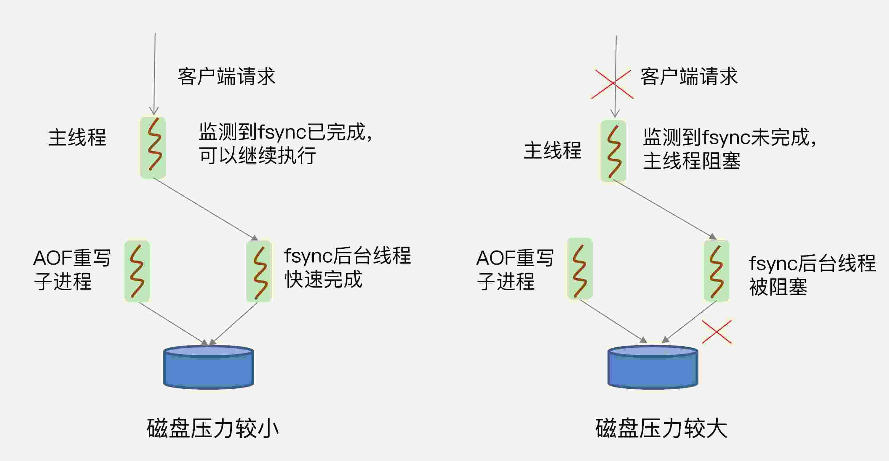

说到这里，你已经了解了，由于 `fsync` 后台子线程和 AOF 重写子进程的存在，主 IO 线程一般不会被阻塞。但是，如果在重写日志时，AOF 重写子进程的写入量比较大，`fsync` 线程也会被阻塞，进而阻塞主线程，导致延迟增加。

排查和解决建议

首先，你可以检查下 Redis 配置文件中的 `appendfsync` 配置项，该配置项的取值表明了 Redis 实例使用的是哪种 AOF 日志写回策略，如下所示：

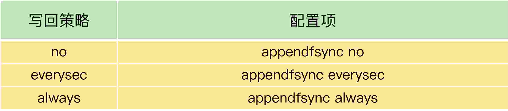

如果 AOF 写回策略使用了 `everysec` 或 `always` 配置，请先确认下业务方对数据可靠性的要求，明确是否需要每一秒或每一个操作都记日志。有的业务方不了解 Redis AOF 机制，很可能就直接使用数据可靠性最高等级的 `always` 配置了。其实，在有些场景中（例如 Redis 用于缓存），数据丢了还可以从后端数据库中获取，并不需要很高的数据可靠性。

如果业务应用对延迟非常敏感，但同时允许一定量的数据丢失，那么，可以把配置项 `no-appendfsync-on-rewrite` 设置为 yes，如下所示：

```sh
$ no-appendfsync-on-rewrite yes
```

这个配置项设置为 yes 时，表示在 AOF 重写时，不进行 fsync 操作。也就是说，Redis 实例把写命令写到内存后，不调用后台线程进行 fsync 操作，就可以直接返回了。当然，如果此时实例发生宕机，就会导致数据丢失。反之，如果这个配置项设置为 no（也是默认配置），在 AOF 重写时，Redis 实例仍然会调用后台线程进行 fsync 操作，这就会给实例带来阻塞。

如果*的确需要高性能，同时也需要高可靠数据保证*，我建议你考虑**采用高速的固态硬盘作为 AOF 日志的写入设备**。

高速固态盘的带宽和并发度比传统的机械硬盘的要高出 10 倍及以上。在 AOF 重写和 fsync 后台线程同时执行时，固态硬盘可以提供较为充足的磁盘 IO 资源，让 AOF 重写和 `fsync` 后台线程的磁盘 IO 资源竞争减少，从而降低对 Redis 的性能影响。

### 操作系统：swap

> 内存 swap 是操作系统里将内存数据在内存和磁盘间来回换入和换出的机制，涉及到磁盘的读写。

一旦触发 swap，无论是被换入数据的进程，还是被换出数据的进程，其性能都会受到慢速磁盘读写的影响。

Redis 是内存数据库，内存使用量大，如果没有控制好内存的使用量，或者和其他内存需求大的应用一起运行了，就可能受到 swap 的影响，而导致性能变慢。

这一点对于 Redis 内存数据库而言，显得更为重要：正常情况下，Redis 的操作是直接通过访问内存就能完成，一旦 swap 被触发了，Redis 的请求操作需要等到磁盘数据读写完成才行。而且，和我刚才说的 AOF 日志文件读写使用 `fsync` 线程不同，**swap 触发后影响的是 Redis 主 IO 线程**，这会极大地增加 Redis 的响应时间。

那么，什么时候会触发 swap 呢？

通常，触发 swap 的原因主要是物理机器内存不足，对于 Redis 而言，有两种常见的情况：

1. Redis 实例自身使用了大量的内存，导致物理机器的可用内存不足；
2. 和 Redis 实例在同一台机器上运行的其他进程，在进行大量的文件读写操作。文件读写本身会占用系统内存，这会导致分配给 Redis 实例的内存量变少，进而触发 Redis 发生 swap。

针对这个问题，我也给你提供一个解决思路：**增加机器的内存**或者**使用 Redis 集群**。

操作系统本身会在后台记录每个进程的 swap 使用情况，即有多少数据量发生了 swap。你可以先通过下面的命令查看 Redis 的进程号，这里是 5332。

```sh
$ redis-cli info | grep process_id
process_id: 5332
```

然后，进入 Redis 所在机器的 /proc 目录下的该进程目录中：

```sh
$ cd /proc/5332
```

最后，运行下面的命令，查看该 Redis 进程的使用情况。在这儿，我只截取了部分结果：

```sh
$ cat smaps | egrep '^(Swap|Size)'
Size: 584 kB
Swap: 0 kB
Size: 4 kB
Swap: 4 kB
Size: 4 kB
Swap: 0 kB
Size: 462044 kB
Swap: 462008 kB
Size: 21392 kB
Swap: 0 kB
```

每一行 Size 表示的是 Redis 实例所用的一块内存大小，而 **Size** 下方的 **Swap** 和它相对应，表示这块 Size 大小的内存区域有多少已经被换出到磁盘上了。**如果这两个值相等，就表示这块内存区域已经完全被换出到磁盘了**。

作为内存数据库，Redis 本身会使用很多大小不一的内存块，所以，你可以看到有很多 Size 行，有的很小，就是 4KB，而有的很大，例如 462044KB。不同内存块被换出到磁盘上的大小也不一样，例如刚刚的结果中的第一个 4KB 内存块，它下方的 Swap 也是 4KB，这表示这个内存块已经被换出了；另外，462044KB 这个内存块也被换出了 462008KB，差不多有 462MB。

这里有个重要的地方，我得提醒你一下，当出现百 MB，甚至 GB 级别的 swap 大小时，就表明，此时，Redis 实例的内存压力很大，很有可能会变慢。所以，swap 的大小是排查 Redis 性能变慢是否由 swap 引起的重要指标。

**一旦发生内存 swap**，最直接的解决方法就是**增加机器内存**。如果该实例在一个 Redis 切片集群中，可以增加 Redis 集群的实例个数，来分摊每个实例服务的数据量，进而减少每个实例所需的内存量。

当然，如果 Redis 实例和其他操作大量文件的程序（例如数据分析程序）共享机器，你可以将 Redis 实例迁移到单独的机器上运行，以满足它的内存需求量。如果该实例正好是 Redis 主从集群中的主库，而从库的内存很大，也可以考虑进行主从切换，把大内存的从库变成主库，由它来处理客户端请求。

### 操作系统：内存大页

除了内存 swap，还有一个和内存相关的因素，即**内存大页机制**（Transparent Huge Page, THP），也会影响 Redis 性能。

Linux 内核从 2.6.38 开始支持内存大页机制，该机制支持 2MB 大小的内存页分配，而常规的内存页分配是按 4KB 的粒度来执行的。

很多人都觉得：“Redis 是内存数据库，内存大页不正好可以满足 Redis 的需求吗？而且在分配相同的内存量时，内存大页还能减少分配次数，不也是对 Redis 友好吗？”

其实，系统的设计通常是一个**取舍过程**，我们称之为 trade-off。很多机制通常都是优势和劣势并存的。Redis 使用内存大页就是一个典型的例子。

虽然内存大页可以给 Redis 带来内存分配方面的收益，但是，不要忘了，Redis 为了提供数据可靠性保证，需要将数据做持久化保存。这个写入过程由额外的线程执行，所以，此时，Redis 主线程仍然可以接收客户端写请求。客户端的写请求可能会修改正在进行持久化的数据。在这一过程中，Redis 就会采用写时复制机制，也就是说，一旦有数据要被修改，Redis 并不会直接修改内存中的数据，而是将这些数据拷贝一份，然后再进行修改。

如果采用了内存大页，那么，即使客户端请求只修改 100B 的数据，Redis 也需要拷贝 2MB 的大页。相反，如果是常规内存页机制，只用拷贝 4KB。两者相比，你可以看到，当客户端请求修改或新写入数据较多时，内存大页机制将导致大量的拷贝，这就会影响 Redis 正常的访存操作，最终导致性能变慢。

那该怎么办呢？很简单，关闭内存大页，就行了。

首先，我们要先排查下内存大页。方法是：在 Redis 实例运行的机器上执行如下命令:

```sh
$ cat /sys/kernel/mm/transparent_hugepage/enabled
```

如果执行结果是 always，就表明内存大页机制被启动了；如果是 never，就表示，内存大页机制被禁止。

在实际生产环境中部署时，我建议你不要使用内存大页机制，操作也很简单，只需要执行下面的命令就可以了：

```sh
$ echo never /sys/kernel/mm/transparent_hugepage/enabled
```


### 小结

为了方便你应用，我给你梳理了一个包含 9 个检查点的 Checklist，希望你在遇到 Redis 性能变慢时，按照这些步骤逐一检查，高效地解决问题。

1. 获取 Redis 实例在当前环境下的**基线性能**。
2. **是否用了慢查询命令？**如果是的话，就*使用其他命令替代慢查询命令，或者把聚合计算命令放在客户端做*。
3. **是否对过期 key 设置了相同的过期时间？**对于批量删除的 key，*可以在每个 key 的过期时间上加一个随机数，避免同时删除*。
4. **是否存在 bigkey？** 对于 bigkey 的删除操作，如果你的 *Redis 是 4.0 及以上的版本，可以直接利用异步线程机制减少主线程阻塞*；如果是 *Redis 4.0 以前的版本，可以使用 SCAN 命令迭代删除*；对于 bigkey 的集合查询和聚合操作，可以使用 SCAN 命令在客户端完成。
5. **Redis AOF 配置级别是什么？业务层面是否的确需要这一可靠性级别？**如果我们需要高性能，同时也允许数据丢失，可以*将配置项 `no-appendfsync-on-rewrite` 设置为 yes，避免 AOF 重写和 fsync 竞争磁盘 IO 资源，导致 Redis 延迟增加*。当然， 如果既需要高性能又需要高可靠性，最好*使用高速固态盘作为 AOF 日志的写入盘*。
6. **Redis 实例的内存使用是否过大？发生 swap 了吗？**如果是的话，就*增加机器内存*，*或者是使用 Redis 集群*，分摊单机 Redis 的键值对数量和内存压力。同时，要避免出现 Redis 和其他内存需求大的应用共享机器的情况。
7. **在 Redis 实例的运行环境中，是否启用了透明大页机制？**如果是的话，直接*关闭内存大页机制*就行了。
8. **是否运行了 Redis 主从集群？**如果是的话，*把主库实例的数据量大小控制在 2~4GB*，以免主从复制时，从库因加载大的 RDB 文件而阻塞。
9. **是否使用了多核 CPU 或 NUMA 架构的机器运行 Redis 实例？**使用*多核 CPU 时，可以给 Redis 实例绑定物理核*；*使用 NUMA 架构时，注意把 Redis 实例和网络中断处理程序运行在同一个 CPU Socket 上*。

如果你遇到了一些特殊情况，也不要慌，我再给你分享一个小技巧：仔细检查下有没有恼人的“邻居”，具体点说，就是 Redis 所在的机器上有没有一些其他占内存、磁盘 IO 和网络 IO 的程序，比如说数据库程序或者数据采集程序。如果有的话，我建议你将这些程序迁移到其他机器上运行。

为了保证 Redis 高性能，我们需要给 Redis 充足的计算、内存和 IO 资源，给它提供一个“安静”的环境。


### 每课一问

这节课，我提到了 KEYS 命令，因为它的复杂度很高，容易引起 Redis 线程操作阻塞，不适用于生产环境。但是，KEYS 命令本身提供的功能是上层业务应用经常需要的，即返回与输入模式匹配的 keys。

请思考一下，在 Redis 中，还有哪些其他命令可以代替 KEYS 命令，实现同样的功能呢？这些命令的复杂度会导致 Redis 变慢吗？

答案：Redis 提供的 SCAN 命令，以及针对集合类型数据提供的 SSCAN、HSCAN 等，可以根据执行时设定的数量参数，返回指定数量的数据，这就可以避免像 KEYS 命令一样同时返回所有匹配的数据，不会导致 Redis 变慢。以 HSCAN 为例，我们可以执行下面的命令，从 user 这个 Hash 集合中返回 key 前缀以 103 开头的 100 个键值对。

```sh
$ HSCAN user 0  match "103*" 100
```


我想请你聊一聊，你遇到过 Redis 变慢的情况吗？如果有的话，你是怎么解决的呢？

答案：@Kaito 同学在留言区分享了他排查 Redis 变慢问题的 Checklist，而且还提供了解决方案，非常好，我把 Kaito 同学给出的导致 Redis 变慢的原因汇总并完善一下，分享给你：

1. 使用复杂度过高的命令或一次查询全量数据；
2. 操作 bigkey；
3. 大量 key 集中过期；
4. 内存达到 maxmemory；
5. 客户端使用短连接和 Redis 相连；
6. 当 Redis 实例的数据量大时，无论是生成 RDB，还是 AOF 重写，都会导致 fork 耗时严重；
7. AOF 的写回策略为 always，导致每个操作都要同步刷回磁盘；
8. Redis 实例运行机器的内存不足，导致 swap 发生，Redis 需要到 swap 分区读取数据；
9. 进程绑定 CPU 不合理；
10. Redis 实例运行机器上开启了透明内存大页机制；
11. 网卡压力过大。


## 20 | 删除数据后，为什么内存占用率还是很高

在使用 Redis 时，我们经常会遇到这样一个问题：明明做了数据删除，数据量已经不大了，为什么使用 top 命令查看时，还会发现 Redis 占用了很多内存呢？

实际上，这是因为，当数据删除后，**Redis 释放的内存空间会由内存分配器管理**，*并不会立即返回给操作系统*。所以，操作系统仍然会记录着给 Redis 分配了大量内存。

但是，这往往会伴随一个潜在的风险点：*Redis 释放的内存空间可能并不是连续的，那么，这些不连续的内存空间很有可能处于一种闲置的状态*。这就会导致一个问题：**虽然有空闲空间，Redis 却无法用来保存数据**，不仅会减少 Redis 能够实际保存的数据量，还会降低 Redis 运行机器的成本回报率。

### 什么是内存碎片

通常情况下，内存空间闲置，往往是因为操作系统发生了较为严重的内存碎片。

假设一个车厢的座位总共有 60 个，现在已经卖了 57 张票，你和 2 个小伙伴要乘坐高铁出门旅行，刚好需要三张票。不过，你们想要坐在一起，这样可以在路上聊天。但是，在选座位时，你们却发现，已经买不到连续的座位了。于是，你们只好换了一趟车。这样一来，你们需要改变出行时间，而且这趟车就空置了三个座位。

其实，这趟车的空座位是和你们的人数相匹配的，只是这些空座位是分散的，如下图所示：

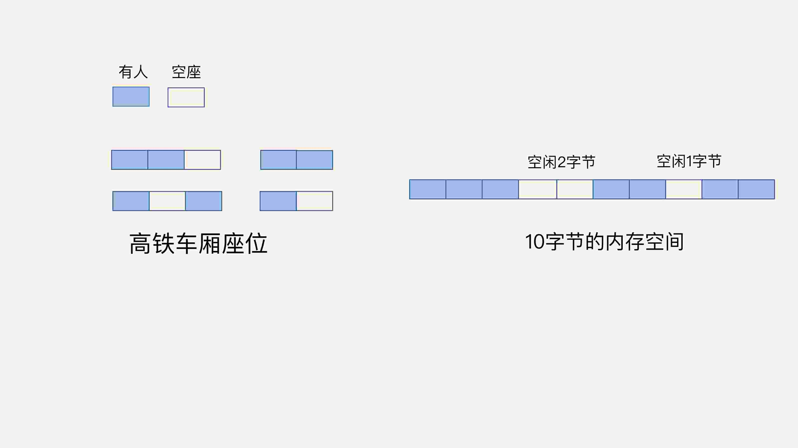

我们可以把这些分散的空座位叫作“车厢座位碎片”，知道了这一点，操作系统的内存碎片就很容易理解了。

虽然操作系统的剩余内存空间总量足够，但是，应用申请的是一块连续地址空间的 N 字节，但在剩余的内存空间中，没有大小为 N 字节的连续空间了，那么，这些剩余空间就是内存碎片（比如上图中的“空闲 2 字节”和“空闲 1 字节”，就是这样的碎片）。

### 内存碎片是如何形成的

其实，内存碎片的形成有内因和外因两个层面的原因。简单来说，**内因是操作系统的内存分配机制**，**外因是 Redis 的负载特征**。

#### 内因：内存分配器的分配策略

内存分配器的分配策略就决定了操作系统无法做到“按需分配”。这是因为，**内存分配器一般是按固定大小来分配内存，而不是完全按照应用程序申请的内存空间大小给程序分配**。

Redis 可以使用 **`libc、jemalloc、tcmalloc`** 多种内存分配器来分配内存，默认使用 **`jemalloc`**。接下来，我就以 `jemalloc` 为例，来具体解释一下。其他分配器也存在类似的问题。

`jemalloc` 的分配策略之一，是**按照一系列固定的大小划分内存空间**，例如 8 字节、16 字节、32 字节、48 字节，…, 2KB、4KB、8KB 等。当程序申请的内存最接近某个固定值时，jemalloc 会给它分配相应大小的空间。

这样的分配方式本身是**为了减少分配次数**。例如，Redis 申请一个 20 字节的空间保存数据，jemalloc 就会分配 32 字节，此时，如果应用还要写入 10 字节的数据，Redis 就不用再向操作系统申请空间了，因为刚才分配的 32 字节已经够用了，这就避免了一次分配操作。

但是，如果 Redis 每次向分配器申请的内存空间大小不一样，这种分配方式就会有形成碎片的风险，而这正好来源于 Redis 的外因了。

#### 外因：键值对大小不一样和删改操作

Redis 通常作为共用的缓存系统或键值数据库对外提供服务，所以，不同业务应用的数据都可能保存在 Redis 中，这就会带来不同大小的键值对。这样一来，**Redis 申请内存空间分配时，本身就会有大小不一的空间需求**。这是第一个外因。

内存分配器只能按固定大小分配内存，所以，分配的内存空间一般都会比申请的空间大一些，不会完全一致，这本身就会造成一定的碎片，降低内存空间存储效率。

比如说，应用 A 保存 6 字节数据，jemalloc 按分配策略分配 8 字节。如果应用 A 不再保存新数据，那么，这里多出来的 2 字节空间就是内存碎片了，如下图所示：

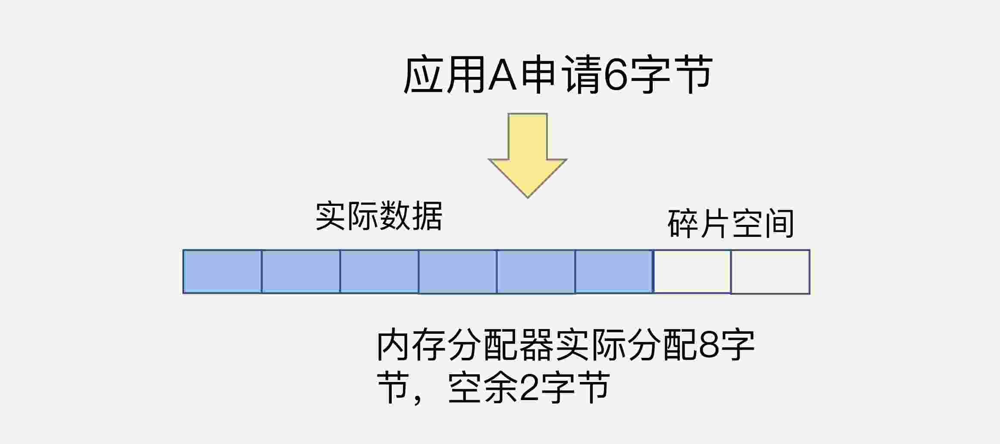

第二个外因是，**这些键值对会被修改和删除，这会导致空间的扩容和释放**。具体来说，一方面，如果修改后的键值对变大或变小了，就需要占用额外的空间或者释放不用的空间。另一方面，删除的键值对就不再需要内存空间了，此时，就会把空间释放出来，形成空闲空间。

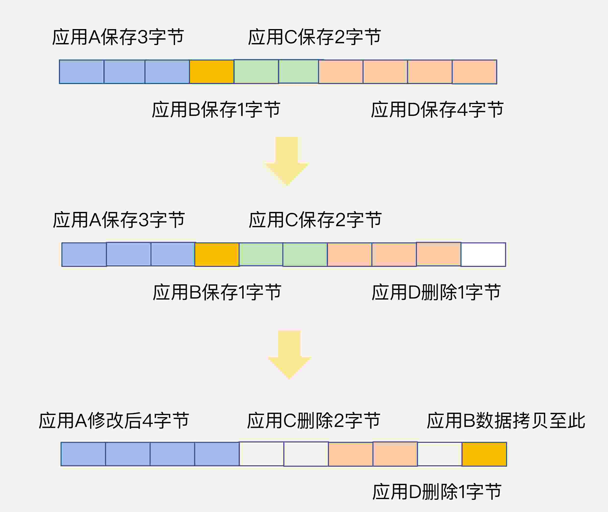

一开始，应用 A、B、C、D 分别保存了 3、1、2、4 字节的数据，并占据了相应的内存空间。然后，应用 D 删除了 1 个字节，这个 1 字节的内存空间就空出来了。紧接着，应用 A 修改了数据，从 3 字节变成了 4 字节。为了保持 A 数据的空间连续性，操作系统就需要把 B 的数据拷贝到别的空间，比如拷贝到 D 刚刚释放的空间中。此时，应用 C 和 D 也分别删除了 2 字节和 1 字节的数据，整个内存空间上就分别出现了 2 字节和 1 字节的空闲碎片。如果应用 E 想要一个 3 字节的连续空间，显然是不能得到满足的。因为，虽然空间总量够，但却是碎片空间，并不是连续的。

好了，到这里，我们就知道了造成内存碎片的内外因素，其中，*内存分配器策略是内因*，而 *Redis 的负载属于外因，包括了大小不一的键值对和键值对修改删除带来的内存空间变化*。

大量内存碎片的存在，会造成 Redis 的内存实际利用率变低，接下来，我们就要来解决这个问题了。不过，在解决问题前，我们要先判断 Redis 运行过程中是否存在内存碎片。

### 如何判断是否有内存碎片

Redis 是内存数据库，内存利用率的高低直接关系到 Redis 运行效率的高低。为了让用户能监控到实时的内存使用情况，Redis 自身提供了 INFO 命令，可以用来查询内存使用的详细信息，命令如下：

```sh
INFO memory
# Memory
used_memory:1073741736
used_memory_human:1024.00M
used_memory_rss:1997159792
used_memory_rss_human:1.86G
…
mem_fragmentation_ratio:1.86
```

这里有一个 `mem_fragmentation_ratio` 的指标，它表示的就是 Redis 当前的内存碎片率。那么，这个碎片率是怎么计算的呢？其实，就是上面的命令中的两个指标 `used_memory_rss` 和 `used_memory` 相除的结果。

`used_memory_rss` 是*操作系统实际分配给 Redis 的物理内存空间，里面就包含了碎片*；而 `used_memory` 是 *Redis 为了保存数据实际申请使用的空间*。

我简单举个例子。例如，Redis 申请使用了 100 字节（`used_memory`），操作系统实际分配了 128 字节（`used_memory_rss`），此时，`mem_fragmentation_ratio` 就是 1.28。

那么，知道了这个指标，我们该如何使用呢？在这儿，我提供一些经验阈值：

- mem_fragmentation_ratio 大于 1 但小于 1.5。这种情况是合理的。这是因为，刚才我介绍的那些因素是难以避免的。毕竟，内因的内存分配器是一定要使用的，分配策略都是通用的，不会轻易修改；而外因由 Redis 负载决定，也无法限制。所以，存在内存碎片也是正常的。
- mem_fragmentation_ratio 大于 1.5 。这表明内存碎片率已经超过了 50%。一般情况下，这个时候，我们就需要采取一些措施来降低内存碎片率了。

### 如何清理内存碎片

当 Redis 发生内存碎片后，一个“简单粗暴”的方法就是重启 Redis 实例。当然，这并不是一个“优雅”的方法，毕竟，重启 Redis 会带来两个后果：

- 如果 Redis 中的数据没有持久化，那么，数据就会丢失；
- 即使 Redis 数据持久化了，我们还需要通过 AOF 或 RDB 进行恢复，恢复时长取决于 AOF 或 RDB 的大小，如果只有一个 Redis 实例，恢复阶段无法提供服务。

幸运的是，从 **4.0-RC3** 版本以后，**Redis 自身提供了一种内存碎片自动清理的方法**，我们先来看这个方法的基本机制。

当有数据把一块连续的内存空间分割成好几块不连续的空间时，操作系统就会把数据拷贝到别处。此时，数据拷贝需要能把这些数据原来占用的空间都空出来，把原本不连续的内存空间变成连续的空间。否则，如果数据拷贝后，并没有形成连续的内存空间，这就不能算是清理了。

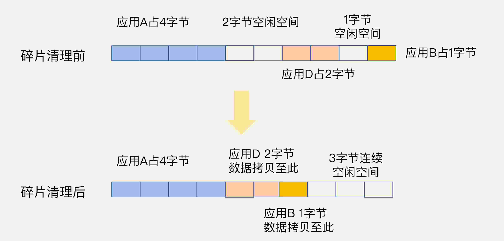

在进行碎片清理前，这段 10 字节的空间中分别有 1 个 2 字节和 1 个 1 字节的空闲空间，只是这两个空间并不连续。操作系统在清理碎片时，会先把应用 D 的数据拷贝到 2 字节的空闲空间中，并释放 D 原先所占的空间。然后，再把 B 的数据拷贝到 D 原来的空间中。这样一来，这段 10 字节空间的最后三个字节就是一块连续空间了。到这里，碎片清理结束。

不过，需要注意的是：**碎片清理是有代价的**，操作系统需要把多份数据拷贝到新位置，把原有空间释放出来，这会带来**时间开销**。因为 Redis 是单线程，在数据拷贝时，Redis 只能等着，这就导致 Redis 无法及时处理请求，性能就会降低。而且，有的时候，数据拷贝还需要注意顺序，就像刚刚说的清理内存碎片的例子，操作系统需要先拷贝 D，并释放 D 的空间后，才能拷贝 B。这种对顺序性的要求，会进一步增加 Redis 的等待时间，导致性能降低。

*Redis 专门为自动内存碎片清理功机制设置的参数了*。我们可以通过设置参数，来*控制碎片清理的开始和结束时机，以及占用的 CPU 比例*，从而减少碎片清理对 Redis 本身请求处理的性能影响。

首先，Redis 需要启用自动内存碎片清理，可以把 activedefrag 配置项设置为 yes，命令如下：

```sh
config set activedefrag yes
```

这个命令只是启用了自动清理功能，但是，具体什么时候清理，会受到下面这两个参数的控制。这两个参数分别设置了触发内存清理的一个条件，如果同时满足这两个条件，就开始清理。在清理的过程中，只要有一个条件不满足了，就停止自动清理。

- `active-defrag-ignore-bytes` 100mb：表示内存碎片的字节数达到 100MB 时，开始清理；
- `active-defrag-threshold-lower` 10：表示内存碎片空间占操作系统分配给 Redis 的总空间比例达到 10% 时，开始清理。

为了尽可能减少碎片清理对 Redis 正常请求处理的影响，自动内存碎片清理功能在执行时，还会监控清理操作占用的 CPU 时间，而且还设置了两个参数，分别用于控制清理操作占用的 CPU 时间比例的上、下限，既保证清理工作能正常进行，又避免了降低 Redis 性能。这两个参数具体如下：

- `active-defrag-cycle-min` 25： 表示自动清理过程所用 CPU 时间的比例不低于 25%，保证清理能正常开展；
- `active-defrag-cycle-max` 75：表示自动清理过程所用 CPU 时间的比例不高于 75%，一旦超过，就停止清理，从而避免在清理时，大量的内存拷贝阻塞 Redis，导致响应延迟升高。

自动内存碎片清理机制在控制碎片清理启停的时机上，既考虑了碎片的空间占比、对 Redis 内存使用效率的影响，还考虑了清理机制本身的 CPU 时间占比、对 Redis 性能的影响。而且，清理机制还提供了 4 个参数，让我们可以根据实际应用中的数据量需求和性能要求灵活使用，建议你在实践中好好地把这个机制用起来。

### 每课一问

如果 `mem_fragmentation_ratio` 小于 1 了，Redis 的内存使用是什么情况呢？会对 Redis 的性能和内存空间利用率造成什么影响呢？

答案：如果 `mem_fragmentation_ratio` 小于 1，就表明，操作系统分配给 Redis 的内存空间已经小于 Redis 所申请的空间大小了，此时，运行 Redis 实例的服务器上的内存已经不够用了，可能已经发生 swap 了。这样一来，Redis 的读写性能也会受到影响，因为 Redis 实例需要在磁盘上的 swap 分区中读写数据，速度较慢。


## 21 | 缓冲区：一个可能引发“惨案”的地方

缓冲区的功能其实很简单，主要就是用一块内存空间来**暂时存放命令数据**，以免出现因为数据和命令的处理速度慢于发送速度而导致的数据丢失和性能问题。但因为缓冲区的内存空间有限，如果往里面写入数据的速度持续地大于从里面读取数据的速度，就会导致缓冲区需要越来越多的内存来暂存数据。当缓冲区占用的内存超出了设定的上限阈值时，就会出现缓冲区溢出。

如果发生了溢出，就会丢数据了。那是不是不给缓冲区的大小设置上限，就可以了呢？显然不是，随着累积的数据越来越多，缓冲区占用内存空间越来越大，一旦耗尽了 Redis 实例所在机器的可用内存，就会导致 Redis 实例崩溃。

所以毫不夸张地说，**缓冲区是用来避免请求或数据丢失的惨案的**，但也只有用对了，才能真正起到“避免”的作用。

我们知道，Redis 是典型的 client-server 架构，所有的操作命令都需要通过客户端发送给服务器端。所以，缓冲区在 Redis 中的一个主要应用场景，就是在*客户端和服务器端之间进行通信时，用来暂存客户端发送的命令数据，或者是服务器端返回给客户端的数据结果*。此外，缓冲区的另一个主要应用场景，是*在主从节点间进行数据同步时，用来暂存主节点接收的写命令和数据*。

### 客户端输入和输出缓冲区

为了避免客户端和服务器端的请求发送和处理速度不匹配，服务器端给每个连接的客户端都设置了一个输入缓冲区和输出缓冲区，我们称之为客户端输入缓冲区和输出缓冲区。

输入缓冲区会先把客户端发送过来的命令暂存起来，Redis 主线程再从输入缓冲区中读取命令，进行处理。当 Redis 主线程处理完数据后，会把结果写入到输出缓冲区，再通过输出缓冲区返回给客户端，如下图所示：

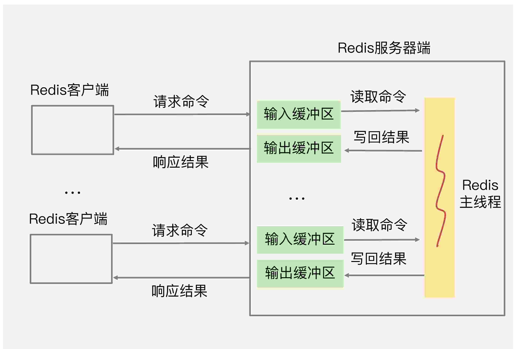

#### 如何应对输入缓冲区溢出

输入缓冲区就是用来暂存客户端发送的请求命令的，所以可能导致溢出的情况主要是下面两种：

1. 写入了 bigkey，比如一下子写入了多个百万级别的集合类型数据；
2. 服务器端处理请求的速度过慢，例如，Redis 主线程出现了间歇性阻塞，无法及时处理正常发送的请求，导致客户端发送的请求在缓冲区越积越多。

如何查看输入缓冲区的内存使用情况，以及如何避免溢出？

要查看和服务器端相连的每个客户端对输入缓冲区的使用情况，我们可以使用 CLIENT LIST 命令：

```sh
$ CLIENT LIST
id=5 addr=127.0.0.1:50487 fd=9 name= age=4 idle=0 flags=N db=0 sub=0 psub=0 multi=-1 qbuf=26 qbuf-free=32742 obl=0 oll=0 omem=0 events=r cmd=client
```

CLIENT 命令返回的信息虽然很多，但我们只需要重点关注两类信息就可以了。

一类是与服务器端连接的客户端的信息。这个案例展示的是一个客户端的输入缓冲区情况，如果有多个客户端，输出结果中的 addr 会显示不同客户端的 IP 和端口号。

另一类是与输入缓冲区相关的三个参数：

1. `cmd`，表示客户端最新执行的命令。这个例子中执行的是 CLIENT 命令。
2. `qbuf`，表示输入缓冲区已经使用的大小。这个例子中的 CLIENT 命令已使用了 26 字节大小的缓冲区。
3. `qbuf-free`，表示输入缓冲区尚未使用的大小。这个例子中的 CLIENT 命令还可以使用 32742 字节的缓冲区。`qbuf` 和 `qbuf-free` 的总和就是，Redis 服务器端当前为已连接的这个客户端分配的缓冲区总大小。这个例子中总共分配了 26 + 32742 = 32768 字节，也就是 32KB 的缓冲区。

有了 CLIENT LIST 命令，我们就可以通过输出结果来判断客户端输入缓冲区的内存占用情况了。*如果 `qbuf` 很大，而同时 `qbuf-free` 很小，就要引起注意了，因为这时候输入缓冲区已经占用了很多内存，而且没有什么空闲空间了*。此时，客户端再写入大量命令的话，就会引起客户端输入缓冲区溢出，Redis 的处理办法就是把客户端连接关闭，结果就是业务程序无法进行数据存取了。

通常情况下，Redis 服务器端不止服务一个客户端，*当多个客户端连接占用的内存总量，超过了 Redis 的 `maxmemory` 配置项时（例如 4GB），就会触发 Redis 进行数据淘汰*。一旦数据被淘汰出 Redis，再要访问这部分数据，就需要去后端数据库读取，这就**降低了业务应用的访问性能**。此外，更糟糕的是，如果使用多个客户端，导致 Redis 内存占用过大，也会导致**内存溢出**（out-of-memory）问题，进而会引起 Redis 崩溃，给业务应用造成严重影响。

我们可以从两个角度去考虑如何避免，一是**把缓冲区调大**，二是**从数据命令的发送和处理速度入手**。

**Redis 的客户端输入缓冲区大小的上限阈值，在代码中就设定为了 1GB**。也就是说，Redis 服务器端允许为每个客户端最多暂存 1GB 的命令和数据。1GB 的大小，对于一般的生产环境已经是比较合适的了。一方面，这个大小对于处理绝大部分客户端的请求已经够用了；另一方面，如果再大的话，Redis 就有可能因为客户端占用了过多的内存资源而崩溃。

所以，Redis 并没有提供参数让我们调节客户端输入缓冲区的大小。如果要避免输入缓冲区溢出，那我们就只能从数据命令的发送和处理速度入手，也就是前面提到的**避免客户端写入 bigkey**，以及**避免 Redis 主线程阻塞**。

#### 如何应对输出缓冲区溢出

Redis 的输出缓冲区暂存的是 Redis 主线程要返回给客户端的数据。一般来说，主线程返回给客户端的数据，既有简单且大小固定的 OK 响应（例如，执行 SET 命令）或报错信息，也有大小不固定的、包含具体数据的执行结果（例如，执行 HGET 命令）。

因此，Redis 为每个客户端设置的输出缓冲区也包括两部分：*一部分，是一个大小为 16KB 的固定缓冲空间，用来暂存 OK 响应和出错信息；另一部分，是一个可以动态增加的缓冲空间，用来暂存大小可变的响应结果*。

那什么情况下会发生输出缓冲区溢出呢？

1. 服务器端返回 bigkey 的大量结果；
2. 执行了 MONITOR 命令；
3. 缓冲区大小设置得不合理。

其中，bigkey 原本就会占用大量的内存空间，所以服务器端返回的结果包含 bigkey，必然会影响输出缓冲区。接下来，我们就重点看下，执行 MONITOR 命令和设置缓冲区大小这两种情况吧。

MONITOR 命令是用来监测 Redis 执行的。执行这个命令之后，就会持续输出监测到的各个命令操作，如下所示：

```sh
$ MONITOR
OK
1600617456.437129 [0 127.0.0.1:50487] "COMMAND"
1600617477.289667 [0 127.0.0.1:50487] "info" "memory"
```

到这里，你有没有看出什么问题呢？**MONITOR 的输出结果会持续占用输出缓冲区，并越占越多，最后的结果就是发生溢出**。

我要给你一个小建议：**MONITOR 命令主要用在调试环境中，不要在线上生产环境中持续使用 MONITOR**。当然，如果在线上环境中偶尔使用 MONITOR 检查 Redis 的命令执行情况，是没问题的。

接下来，我们看下**输出缓冲区大小设置**的问题。和输入缓冲区不同，我们可以通过 **`client-output-buffer-limit`** 配置项，来设置缓冲区的大小。具体设置的内容包括两方面：

1. 设置缓冲区大小的上限阈值；
2. 设置输出缓冲区持续写入数据的数量上限阈值，和持续写入数据的时间的上限阈值。

在具体使用 client-output-buffer-limit 来设置缓冲区大小的时候，我们需要先区分下客户端的类型。

对于和 Redis 实例进行交互的应用程序来说，主要使用两类客户端和 Redis 服务器端交互，分别是常规和 Redis 服务器端进行读写命令交互的*普通客户端*，以及订阅了 Redis 频道的*订阅客户端*。此外，在 Redis 主从集群中，主节点上也有一类客户端（从*节点客户端*）用来和从节点进行数据同步，我会在介绍主从集群中的缓冲区时，向你具体介绍。

当我们给普通客户端设置缓冲区大小时，通常可以在 Redis 配置文件中进行这样的设置：

```sh
$ client-output-buffer-limit normal 0 0 0
```

其中，normal 表示当前设置的是普通客户端，第 1 个 0 设置的是缓冲区大小限制，第 2 个 0 和第 3 个 0 分别表示缓冲区持续写入量限制和持续写入时间限制。

对于普通客户端来说，它每发送完一个请求，会等到请求结果返回后，再发送下一个请求，这种发送方式称为阻塞式发送。在这种情况下，如果不是读取体量特别大的 bigkey，服务器端的输出缓冲区一般不会被阻塞的。

所以，我们通常把普通客户端的缓冲区大小限制，以及持续写入量限制、持续写入时间限制都设置为 0，也就是不做限制。

对于订阅客户端来说，一旦订阅的 Redis 频道有消息了，服务器端都会通过输出缓冲区把消息发给客户端。所以，订阅客户端和服务器间的消息发送方式，不属于阻塞式发送。不过，如果频道消息较多的话，也会占用较多的输出缓冲区空间。

因此，我们会给订阅客户端设置缓冲区大小限制、缓冲区持续写入量限制，以及持续写入时间限制，可以在 Redis 配置文件中这样设置：

```sh
$ client-output-buffer-limit pubsub 8mb 2mb 60
```

其中，pubsub 参数表示当前是对订阅客户端进行设置；8mb 表示输出缓冲区的大小上限为 8MB，一旦实际占用的缓冲区大小要超过 8MB，服务器端就会直接关闭客户端的连接；2mb 和 60 表示，如果连续 60 秒内对输出缓冲区的写入量超过 2MB 的话，服务器端也会关闭客户端连接。

总结下如何应对输出缓冲区溢出：

- 避免 bigkey 操作返回大量数据结果；
- 避免在线上环境中持续使用 MONITOR 命令。
- 使用 client-output-buffer-limit 设置合理的缓冲区大小上限，或是缓冲区连续写入时间和写入量上限。

### 主从集群中的缓冲区

主从集群间的数据复制包括**全量复制**和**增量复制**两种。全量复制是同步所有数据，而增量复制只会把主从库网络断连期间主库收到的命令，同步给从库。无论在哪种形式的复制中，为了保证主从节点的数据一致，都会用到缓冲区。但是，这两种复制场景下的缓冲区，在溢出影响和大小设置方面并不一样。

#### 复制缓冲区的溢出问题

在**全量复制过程**中，主节点在向从节点传输 RDB 文件的同时，会继续接收客户端发送的写命令请求。这些写命令就会先保存在复制缓冲区中，等 RDB 文件传输完成后，再发送给从节点去执行。主节点上会为每个从节点都维护一个复制缓冲区，来保证主从节点间的数据同步。

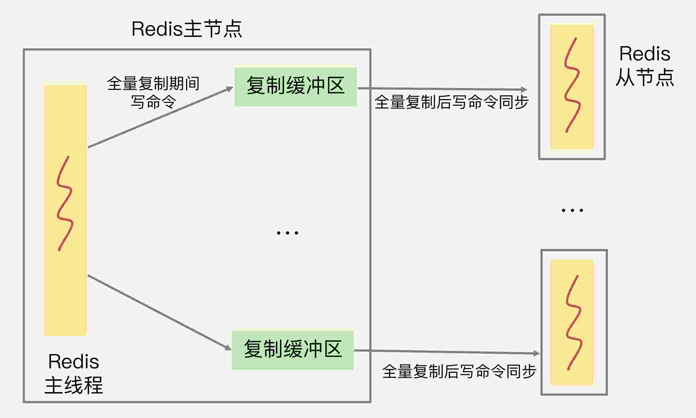

所以，如果在全量复制时，从节点接收和加载 RDB 较慢，同时主节点接收到了大量的写命令，写命令在复制缓冲区中就会越积越多，最终导致溢出。

其实，主节点上的复制缓冲区，本质上也是一个用于和从节点连接的客户端（我们称之为从节点客户端），使用的输出缓冲区。复制缓冲区一旦发生溢出，主节点也会直接关闭和从节点进行复制操作的连接，导致全量复制失败。那如何避免复制缓冲区发生溢出呢？

一方面，我们可以控制主节点保存的数据量大小。按通常的使用经验，我们会把主节点的数据量控制在 2~4GB，这样可以让全量同步执行得更快些，避免复制缓冲区累积过多命令。

另一方面，我们可以使用 client-output-buffer-limit 配置项，来设置合理的复制缓冲区大小。设置的依据，就是主节点的数据量大小、主节点的写负载压力和主节点本身的内存大小。

我们通过一个具体的例子，来学习下具体怎么设置。在主节点执行如下命令：

```sh
$ config set client-output-buffer-limit slave 512mb 128mb 60
```

其中，slave 参数表明该配置项是针对复制缓冲区的。512mb 代表将缓冲区大小的上限设置为 512MB；128mb 和 60 代表的设置是，如果连续 60 秒内的写入量超过 128MB 的话，也会触发缓冲区溢出。

我们再继续看看这个设置对我们有啥用。假设一条写命令数据是 1KB，那么，复制缓冲区可以累积 512K 条（512MB/1KB = 512K）写命令。同时，主节点在全量复制期间，可以承受的写命令速率上限是 2000 条 /s（128MB/1KB/60 约等于 2000）。

这样一来，我们就得到了一种方法：在实际应用中设置复制缓冲区的大小时，可以根据写命令数据的大小和应用的实际负载情况（也就是写命令速率），来粗略估计缓冲区中会累积的写命令数据量；然后，再和所设置的复制缓冲区大小进行比较，判断设置的缓冲区大小是否足够支撑累积的写命令数据量。

关于复制缓冲区，我们还会遇到一个问题。**主节点上复制缓冲区的内存开销，会是每个从节点客户端输出缓冲区占用内存的总和**。如果集群中的从节点数非常多的话，主节点的内存开销就会非常大。所以，我们还必须得控制和主节点连接的从节点个数，不要使用大规模的主从集群。

好了，我们先总结一下这部分的内容。为了避免复制缓冲区累积过多命令造成溢出，引发全量复制失败，我们可以控制主节点保存的数据量大小，并设置合理的复制缓冲区大小。同时，我们需要控制从节点的数量，来避免主节点中复制缓冲区占用过多内存的问题。

#### 复制积压缓冲区的溢出问题

接下来，我们再来看下**增量复制**时使用的缓冲区，这个缓冲区称为复制积压缓冲区。

主节点在把接收到的写命令同步给从节点时，同时会把这些写命令写入复制积压缓冲区。一旦从节点发生网络闪断，再次和主节点恢复连接后，从节点就会从复制积压缓冲区中，读取断连期间主节点接收到的写命令，进而进行增量同步，如下图所示：

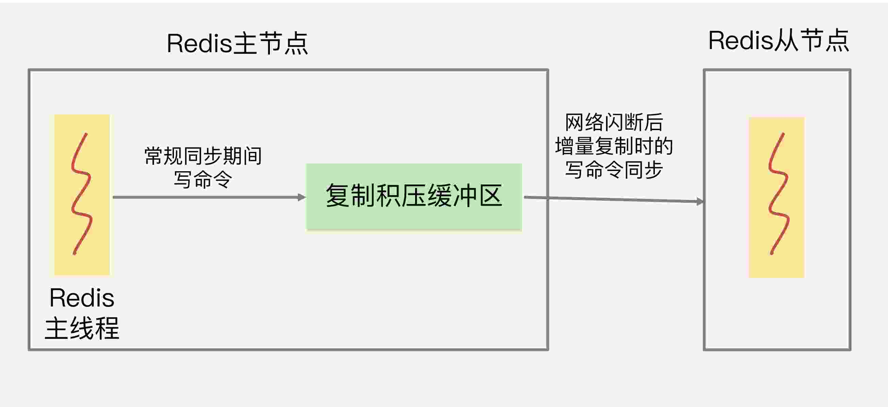

在第 6 讲时已经学过复制积压缓冲区了，只不过我当时告诉你的是它的英文名字 `repl_backlog_buffer`。所以这一讲，我们从缓冲区溢出的角度再来回顾下两个重点：*复制积压缓冲区溢出的影响*，以及*如何应对复制积压缓冲区的溢出问题*。

首先，**复制积压缓冲区是一个大小有限的环形缓冲区**。当主节点把复制积压缓冲区写满后，会覆盖缓冲区中的旧命令数据。如果从节点还没有同步这些旧命令数据，就会**造成主从节点间重新开始执行全量复制**。

其次，为了应对复制积压缓冲区的溢出问题，我们可以调整复制积压缓冲区的大小，也就是设置 `repl_backlog_size` 这个参数的值。具体的调整依据，你可以再看下第 6 讲中提供的 `repl_backlog_size` 大小的计算依据。

### 小结

使用缓冲区以后，当命令数据的接收方处理速度跟不上发送方的发送速度时，缓冲区可以避免命令数据的丢失。

按照缓冲区的用途，例如是用于客户端通信还是用于主从节点复制，我把缓冲区分成了客户端的输入和输出缓冲区，以及主从集群中主节点上的复制缓冲区和复制积压缓冲区。这样学习的好处是，你可以很清楚 Redis 中到底有哪些地方使用了缓冲区，那么在排查问题的时候，就可以快速找到方向——从客户端和服务器端的通信过程以及主从节点的复制过程中分析原因。

现在，从缓冲区溢出对 Redis 的影响的角度，我再把这四个缓冲区分成两类做个总结。

- **缓冲区溢出导致网络连接关闭**：普通客户端、订阅客户端，以及从节点客户端，它们使用的缓冲区，本质上都是 Redis 客户端和服务器端之间，或是主从节点之间为了传输命令数据而维护的。这些缓冲区一旦发生溢出，处理机制都是直接把客户端和服务器端的连接，或是主从节点间的连接关闭。网络连接关闭造成的直接影响，就是业务程序无法读写 Redis，或者是主从节点全量同步失败，需要重新执行。
- **缓冲区溢出导致命令数据丢失**：主节点上的复制积压缓冲区属于环形缓冲区，一旦发生溢出，新写入的命令数据就会覆盖旧的命令数据，导致旧命令数据的丢失，进而导致主从节点重新进行全量复制。

从本质上看，*缓冲区溢出，无非就是三个原因*：**命令数据发送过快过大；命令数据处理较慢；缓冲区空间过小**。明白了这个，我们就可以有针对性地拿出应对策略了。

- 针对命令数据发送过快过大的问题，对于普通客户端来说可以避免 bigkey，而对于复制缓冲区来说，就是避免过大的 RDB 文件。
- 针对命令数据处理较慢的问题，解决方案就是减少 Redis 主线程上的阻塞操作，例如使用异步的删除操作。
- 针对缓冲区空间过小的问题，解决方案就是使用 `client-output-buffer-limit` 配置项设置合理的输出缓冲区、复制缓冲区和复制积压缓冲区大小。当然，我们不要忘了，*输入缓冲区的大小默认是固定的*，我们无法通过配置来修改它，除非直接去修改 Redis 源码。

### 每课一问

我们提到 Redis 采用了 client-server 架构，服务器端会为每个客户端维护输入、输出缓冲区。那么，应用程序和 Redis 实例交互时，应用程序中使用的客户端需要使用缓冲区吗？如果使用的话，对 Redis 的性能和内存使用会有影响吗？

答案：应用程序中使用的 Redis 客户端，需要把要发送的请求暂存在缓冲区。这有两方面的好处。

一方面，可以在客户端控制发送速率，避免把过多的请求一下子全部发到 Redis 实例，导致实例因压力过大而性能下降。不过，客户端缓冲区不会太大，所以，对 Redis 实例的内存使用没有什么影响。

另一方面，在应用 Redis 主从集群时，主从节点进行故障切换是需要一定时间的，此时，主节点无法服务外来请求。如果客户端有缓冲区暂存请求，那么，客户端仍然可以正常接收业务应用的请求，这就可以避免直接给应用返回无法服务的错误。


## 22 | 第11～21讲课后思考题答案及常见问题答疑

### 如何使用慢查询日志和 `latency monitor` 排查执行慢的操作

在第 18 讲中，我提到，可以使用 Redis 日志（慢查询日志）和 latency monitor 来排查执行较慢的命令操作，那么，我们该如何使用慢查询日志和 latency monitor 呢？

Redis 的慢查询日志记录了执行时间超过一定阈值的命令操作。当我们发现 Redis 响应变慢、请求延迟增加时，就可以在慢查询日志中进行查找，确定究竟是哪些命令执行时间很长。

在使用慢查询日志前，我们需要设置两个参数。

- `slowlog-log-slower-than`：这个参数表示，慢查询日志对执行时间大于多少微秒的命令进行记录。
- `slowlog-max-len`：这个参数表示，慢查询日志最多能记录多少条命令记录。慢查询日志的底层实现是一个具有预定大小的先进先出队列，一旦记录的命令数量超过了队列长度，最先记录的命令操作就会被删除。这个值默认是 128。但是，如果慢查询命令较多的话，日志里就存不下了；如果这个值太大了，又会占用一定的内存空间。所以，一般建议设置为 1000 左右，这样既可以多记录些慢查询命令，方便排查，也可以避免内存开销。

设置好参数后，慢查询日志就会把执行时间超过 `slowlog-log-slower-than` 阈值的命令操作记录在日志中。

我们可以使用 SLOWLOG GET 命令，来查看慢查询日志中记录的命令操作，例如，我们执行如下命令，可以查看最近的一条慢查询的日志信息。

```sh
$ SLOWLOG GET 1
1) 1) (integer) 33           //每条日志的唯一ID编号
   2) (integer) 1600990583   //命令执行时的时间戳
   3) (integer) 20906        //命令执行的时长，单位是微秒
   4) 1) "keys"               //具体的执行命令和参数
      2) "abc*"
   5) "127.0.0.1:54793"      //客户端的IP和端口号
   6) ""                     //客户端的名称，此处为空
```

可以看到，KEYS "abc*"这条命令的执行时间是 20906 微秒，大约 20 毫秒，的确是一条执行较慢的命令操作。如果我们想查看更多的慢日志，只要把 SLOWLOG GET 后面的数字参数改为想查看的日志条数，就可以了。

好了，有了慢查询日志后，我们就可以快速确认，究竟是哪些命令的执行时间比较长，然后可以反馈给业务部门，让业务开发人员避免在应用 Redis 的过程中使用这些命令，或是减少操作的数据量，从而降低命令的执行复杂度。

除了慢查询日志以外，Redis 从 **2.8.13** 版本开始，还提供了 `latency monitor` 监控工具，这个工具可以用来监控 Redis 运行过程中的峰值延迟情况。

和慢查询日志的设置相类似，要使用 `latency monitor`，首先要设置命令执行时长的阈值。当一个命令的实际执行时长超过该阈值时，就会被 `latency monitor` 监控到。比如，我们可以把 `latency monitor` 监控的命令执行时长阈值设为 1000 微秒，如下所示：

```sh
$ config set latency-monitor-threshold 1000
```

设置好了 `latency monitor` 的参数后，我们可以使用 `latency latest` 命令，查看最新和最大的超过阈值的延迟情况，如下所示：

```sh
$ latency latest
1) 1) "command"
   2) (integer) 1600991500    //命令执行的时间戳
   3) (integer) 2500           //最近的超过阈值的延迟
   4) (integer) 10100          //最大的超过阈值的延迟
```


### 如何排查 Redis 的 bigkey

在应用 Redis 时，我们要尽量避免 bigkey 的使用，这是因为，Redis 主线程在操作 bigkey 时，会被阻塞。那么，一旦业务应用中使用了 bigkey，我们该如何进行排查呢？

Redis 可以在执行 redis-cli 命令时带上–bigkeys 选项，进而对整个数据库中的键值对大小情况进行统计分析，比如说，统计每种数据类型的键值对个数以及平均大小。此外，这个命令执行后，会输出每种数据类型中最大的 bigkey 的信息，对于 String 类型来说，会输出最大 bigkey 的字节长度，对于集合类型来说，会输出最大 bigkey 的元素个数，如下所示：

```sh
$ ./redis-cli  --bigkeys

-------- summary -------
Sampled 32 keys in the keyspace!
Total key length in bytes is 184 (avg len 5.75)

//统计每种数据类型中元素个数最多的bigkey
Biggest   list found 'product1' has 8 items
Biggest   hash found 'dtemp' has 5 fields
Biggest string found 'page2' has 28 bytes
Biggest stream found 'mqstream' has 4 entries
Biggest    set found 'userid' has 5 members
Biggest   zset found 'device:temperature' has 6 members

//统计每种数据类型的总键值个数，占所有键值个数的比例，以及平均大小
4 lists with 15 items (12.50% of keys, avg size 3.75)
5 hashs with 14 fields (15.62% of keys, avg size 2.80)
10 strings with 68 bytes (31.25% of keys, avg size 6.80)
1 streams with 4 entries (03.12% of keys, avg size 4.00)
7 sets with 19 members (21.88% of keys, avg size 2.71)
5 zsets with 17 members (15.62% of keys, avg size 3.40)
```

不过，在使用–bigkeys 选项时，有一个地方需要注意一下。这个工具是通过扫描数据库来查找 bigkey 的，所以，在执行的过程中，会对 Redis 实例的性能产生影响。如果你在使用主从集群，我建议你在从节点上执行该命令。因为主节点上执行时，会阻塞主节点。如果没有从节点，那么，我给你两个小建议：第一个建议是，在 Redis 实例业务压力的低峰阶段进行扫描查询，以免影响到实例的正常运行；第二个建议是，可以使用 -i 参数控制扫描间隔，避免长时间扫描降低 Redis 实例的性能。例如，我们执行如下命令时，redis-cli 会每扫描 100 次暂停 100 毫秒（0.1 秒）。

```sh
$ ./redis-cli  --bigkeys -i 0.1
```

当然，使用 Redis 自带的–bigkeys 选项排查 bigkey，有两个不足的地方：

1. 这个方法只能返回每种类型中最大的那个 bigkey，无法得到大小排在前 N 位的 bigkey；
2. 对于集合类型来说，这个方法只统计集合元素个数的多少，而不是实际占用的内存量。但是，一个集合中的元素个数多，并不一定占用的内存就多。因为，有可能每个元素占用的内存很小，这样的话，即使元素个数有很多，总内存开销也不大。

所以，如果我们想统计每个数据类型中占用内存最多的前 N 个 bigkey，可以自己开发一个程序，来进行统计。

我给你提供一个基本的开发思路：使用 SCAN 命令对数据库扫描，然后用 TYPE 命令获取返回的每一个 key 的类型。接下来，对于 String 类型，可以直接使用 STRLEN 命令获取字符串的长度，也就是占用的内存空间字节数。

对于集合类型来说，有两种方法可以获得它占用的内存大小。

如果你能够预先从业务层知道集合元素的平均大小，那么，可以使用下面的命令获取集合元素的个数，然后乘以集合元素的平均大小，这样就能获得集合占用的内存大小了。

1. List 类型：LLEN 命令；
2. Hash 类型：HLEN 命令；
3. Set 类型：SCARD 命令；
4. Sorted Set 类型：ZCARD 命令；

如果你不能提前知道写入集合的元素大小，可以使用 MEMORY USAGE 命令（需要 **Redis 4.0** 及以上版本），查询一个键值对占用的内存空间。例如，执行以下命令，可以获得 key 为 user:info 这个集合类型占用的内存空间大小。

```sh
$ MEMORY USAGE user:info
(integer) 315663239
```

这样一来，你就可以在开发的程序中，把每一种数据类型中的占用内存空间大小排在前 N 位的 key 统计出来，这也就是每个数据类型中的前 N 个 bigkey。


## 23 | 旁路缓存：Redis是如何工作的

正因为 Redis 用作缓存的普遍性以及它在业务应用中的重要作用，所以，我们需要系统地掌握缓存的一系列内容，包括工作原理、替换策略、异常处理和扩展机制。具体来说，我们需要解决四个关键问题：

- Redis 缓存具体是怎么工作的？
- Redis 缓存如果满了，该怎么办？
- 为什么会有缓存一致性、缓存穿透、缓存雪崩、缓存击穿等异常，该如何应对？
- Redis 的内存毕竟有限，如果用快速的固态硬盘来保存数据，可以增加缓存的数据量，那么，Redis 缓存可以使用快速固态硬盘吗？

### 缓存的特征

首先，你要知道，一个系统中的不同层之间的访问速度不一样，所以我们才需要缓存，这样就可以把一些需要频繁访问的数据放在缓存中，以加快它们的访问速度。

下图是计算机系统中的三层存储结构，以及它们各自的常用容量和访问性能。最上面是处理器，中间是内存，最下面是磁盘。

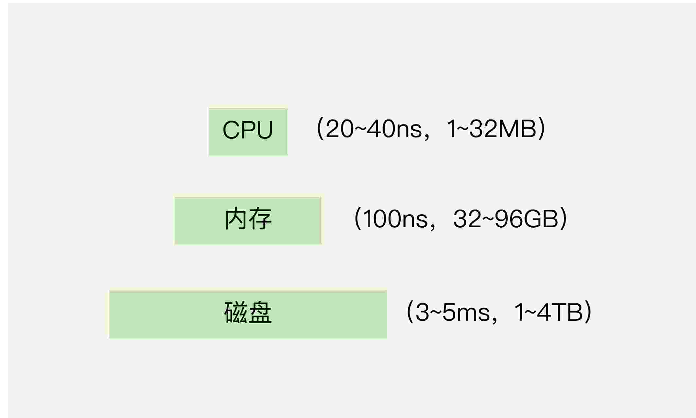

从图上可以看到，CPU、内存和磁盘这三层的访问速度从几十 ns 到 100ns，再到几 ms，性能的差异很大。

想象一下，如果每次 CPU 处理数据时，都要从 ms 级别的慢速磁盘中读取数据，然后再进行处理，那么，CPU 只能等磁盘的数据传输完成。这样一来，高速的 CPU 就被慢速的磁盘拖累了，整个计算机系统的运行速度会变得非常慢。

所以，计算机系统中，默认有两种缓存：

1. CPU 里面的末级缓存，即 LLC，用来缓存内存中的数据，避免每次从内存中存取数据；
2. 内存中的高速页缓存，即 page cache，用来缓存磁盘中的数据，避免每次从磁盘中存取数据。

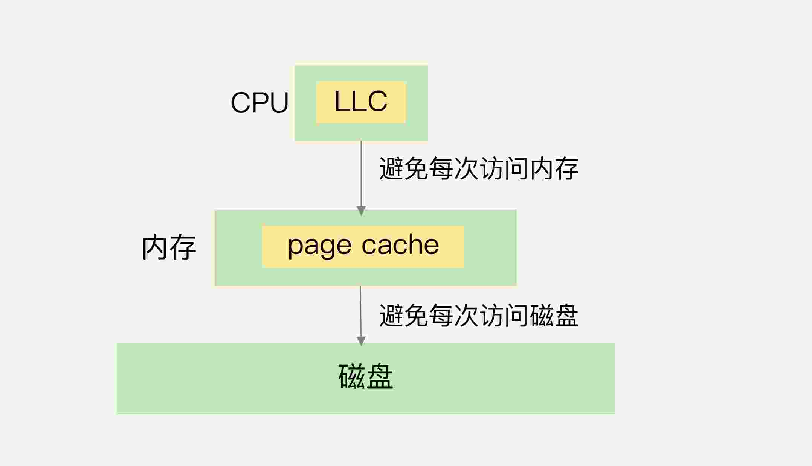

跟内存相比，LLC 的访问速度更快，而跟磁盘相比，内存的访问是更快的。所以，我们可以看出来缓存的**第一个特征**：*在一个层次化的系统中，缓存一定是一个快速子系统，数据存在缓存中时，能避免每次从慢速子系统中存取数据*。对应到互联网应用来说，Redis 就是快速子系统，而数据库就是慢速子系统了。

LLC 的大小是 MB 级别，page cache 的大小是 GB 级别，而磁盘的大小是 TB 级别。这其实包含了缓存的**第二个特征**：*缓存系统的容量大小总是小于后端慢速系统的，我们不可能把所有数据都放在缓存系统中*。

它表明，缓存的容量终究是有限的，缓存中的数据量也是有限的，肯定是没法时刻都满足访问需求的。所以，缓存和后端慢速系统之间，必然存在数据写回和再读取的交互过程。简单来说，缓存中的数据需要按一定规则淘汰出去，写回后端系统，而新的数据又要从后端系统中读取进来，写入缓存。

Redis 本身是支持按一定规则淘汰数据的，相当于实现了缓存的数据淘汰，其实，这也是 Redis 适合用作缓存的一个重要原因。

### Redis 缓存处理请求的两种情况

把 Redis 用作缓存时，我们会把 Redis 部署在数据库的前端，业务应用在访问数据时，会先查询 Redis 中是否保存了相应的数据。此时，根据数据是否存在缓存中，会有两种情况。

- **缓存命中**：Redis 中有相应数据，就直接读取 Redis，性能非常快。
- **缓存缺失**：Redis 中没有保存相应数据，就从后端数据库中读取数据，性能就会变慢。而且，一旦发生缓存缺失，为了让后续请求能从缓存中读取到数据，我们需要把缺失的数据写入 Redis，这个过程叫作缓存更新。缓存更新操作会涉及到保证缓存和数据库之间的数据一致性问题，关于这一点，我会在第 25 讲中再具体介绍。

下面这张图，清晰地展示了发生缓存命中或缺失时，应用读取数据的情况

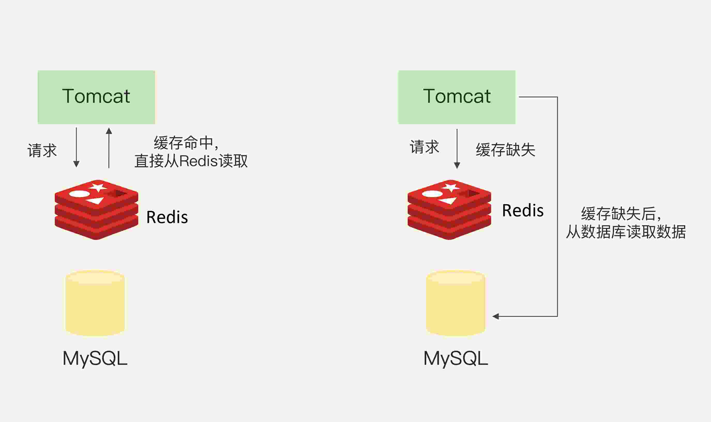

假设我们在一个 Web 应用中，使用 Redis 作为缓存。用户请求发送给 Tomcat，Tomcat 负责处理业务逻辑。如果要访问数据，就需要从 MySQL 中读写数据。那么，我们可以把 Redis 部署在 MySQL 前端。如果访问的数据在 Redis 中，此时缓存命中，Tomcat 可以直接从 Redis 中读取数据，加速应用的访问。否则，Tomcat 就需要从慢速的数据库中读取数据了。

使用 Redis 缓存时，我们基本有三个操作：

- 应用读取数据时，需要先读取 Redis；
- 发生缓存缺失时，需要从数据库读取数据；
- 发生缓存缺失时，还需要更新缓存。

### Redis 作为旁路缓存的使用操作

Redis 是一个独立的系统软件，和业务应用程序是两个软件，当我们部署了 Redis 实例后，它只会被动地等待客户端发送请求，然后再进行处理。所以，如果应用程序想要使用 Redis 缓存，我们就要在程序中增加相应的缓存操作代码。所以，我们也把 **Redis 称为旁路缓存**，也就是说，读取缓存、读取数据库和更新缓存的操作都需要在应用程序中来完成。

这和我刚才讲的计算机系统中的 LLC 和 page cache 不一样。你可以回想下，平时在开发程序时，我们是没有专门在代码中显式地创建 LLC 或 page cache 的实例的，也没有显式调用过它们的 GET 接口。这是因为，我们在构建计算机硬件系统时，已经把 LLC 和 page cache 放在了应用程序的数据访问路径上，应用程序访问数据时直接就能用上缓存。

使用 Redis 缓存时，具体来说，我们需要在应用程序中增加三方面的代码：

- 当应用程序需要读取数据时，我们需要在代码中显式调用 Redis 的 GET 操作接口，进行查询；
- 如果缓存缺失了，应用程序需要再和数据库连接，从数据库中读取数据；
- 当缓存中的数据需要更新时，我们也需要在应用程序中显式地调用 SET 操作接口，把更新的数据写入缓存。

在 Web 应用中使用 Redis 缓存的伪代码示例：

```java
String cacheKey = “productid_11010003”;
String cacheValue = redisCache.get(cacheKey)；
//缓存命中
if ( cacheValue != NULL)
   return cacheValue;
//缓存缺失
else
   cacheValue = getProductFromDB();
   redisCache.put(cacheValue)  //缓存更新
```

可以看到，为了使用缓存，Web 应用程序需要有一个表示缓存系统的实例对象 redisCache，还需要主动调用 Redis 的 GET 接口，并且要处理缓存命中和缓存缺失时的逻辑，例如在缓存缺失时，需要更新缓存。

了解了这一点，我们在使用 Redis 缓存时，有一个地方就需要注意了：因为需要新增程序代码来使用缓存，所以，Redis 并不适用于那些无法获得源码的应用，例如一些很早之前开发的应用程序，它们的源码已经没有再维护了，或者是第三方供应商开发的应用，没有提供源码，所以，我们就没有办法在这些应用中进行缓存操作。

Redis 缓存的两种类型：只读缓存和读写缓存。只读缓存能加速读请求，而读写缓存可以同时加速读写请求。而且，读写缓存又有两种数据写回策略，可以让我们根据业务需求，在保证性能和保证数据可靠性之间进行选择。

### 缓存的类型

按照 Redis 缓存是否接受写请求，我们可以把它分成只读缓存和读写缓存。

#### 只读缓存

当 Redis 用作只读缓存时，应用要读取数据的话，会先调用 Redis GET 接口，查询数据是否存在。而所有的数据写请求，会直接发往后端的数据库，在数据库中增删改。对于删改的数据来说，如果 Redis 已经缓存了相应的数据，应用需要把这些缓存的数据删除，Redis 中就没有这些数据了。

当应用再次读取这些数据时，会发生缓存缺失，应用会把这些数据从数据库中读出来，并写到缓存中。这样一来，这些数据后续再被读取时，就可以直接从缓存中获取了，能起到加速访问的效果。

举个例子。假设业务应用要修改数据 A，此时，数据 A 在 Redis 中也缓存了，那么，应用会先直接在数据库里修改 A，并把 Redis 中的 A 删除。等到应用需要读取数据 A 时，会发生缓存缺失，此时，应用从数据库中读取 A，并写入 Redis，以便后续请求从缓存中直接读取，如下图所示：

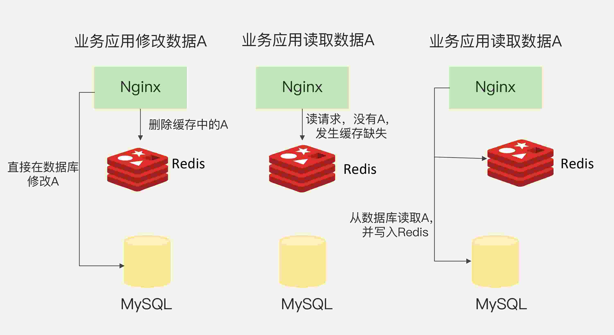

只读缓存直接在数据库中更新数据的好处是，所有最新的数据都在数据库中，而数据库是提供数据可靠性保障的，这些数据不会有丢失的风险。当我们需要缓存图片、短视频这些用户只读的数据时，就可以使用只读缓存这个类型了。

#### 读写缓存

对于读写缓存来说，除了读请求会发送到缓存进行处理（直接在缓存中查询数据是否存在)，所有的写请求也会发送到缓存，在缓存中直接对数据进行增删改操作。此时，得益于 Redis 的高性能访问特性，数据的增删改操作可以在缓存中快速完成，处理结果也会快速返回给业务应用，这就可以提升业务应用的响应速度。

但是，和只读缓存不一样的是，在使用读写缓存时，最新的数据是在 Redis 中，而 Redis 是内存数据库，一旦出现掉电或宕机，内存中的数据就会丢失。这也就是说，应用的最新数据可能会丢失，给应用业务带来风险。

所以，根据业务应用对数据可靠性和缓存性能的不同要求，我们会有**同步直写**和**异步写回**两种策略。其中，*同步直写策略优先保证数据可靠性，而异步写回策略优先提供快速响应*。学习了解这两种策略，可以帮助我们根据业务需求，做出正确的设计选择。

同步直写是指，写请求发给缓存的同时，也会发给后端数据库进行处理，等到缓存和数据库都写完数据，才给客户端返回。这样，即使缓存宕机或发生故障，最新的数据仍然保存在数据库中，这就提供了数据可靠性保证。

不过，同步直写会降低缓存的访问性能。这是因为缓存中处理写请求的速度是很快的，而数据库处理写请求的速度较慢。即使缓存很快地处理了写请求，也需要等待数据库处理完所有的写请求，才能给应用返回结果，这就增加了缓存的响应延迟。

而异步写回策略，则是优先考虑了响应延迟。此时，所有写请求都先在缓存中处理。等到这些增改的数据要被从缓存中淘汰出来时，缓存将它们写回后端数据库。这样一来，处理这些数据的操作是在缓存中进行的，很快就能完成。只不过，如果发生了掉电，而它们还没有被写回数据库，就会有丢失的风险了。

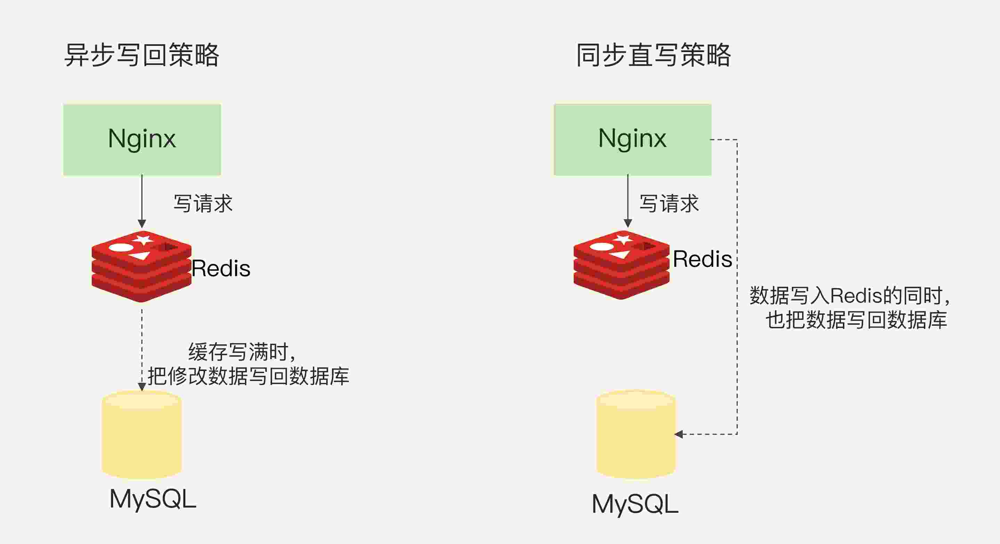

关于是选择只读缓存，还是读写缓存，主要看我们对写请求是否有加速的需求。

- 如果需要对写请求进行加速，我们选择读写缓存；
- 如果写请求很少，或者是只需要提升读请求的响应速度的话，我们选择只读缓存。


### 每课一问

Redis 只读缓存和使用直写策略的读写缓存，这两种缓存都会把数据同步写到后端数据库中，你觉得，它们有什么区别吗？


## 24 | 替换策略：缓存满了怎么办

Redis 缓存使用内存来保存数据，避免业务应用从后端数据库中读取数据，可以提升应用的响应速度。那么，如果我们把所有要访问的数据都放入缓存，是不是一个很好的设计选择呢？其实，这样做的性价比反而不高。

为了保证较高的性价比，缓存的空间容量必然要小于后端数据库的数据总量。不过，内存大小毕竟有限，随着要缓存的数据量越来越大，有限的缓存空间不可避免地会被写满。此时，该怎么办呢？

解决这个问题就涉及到缓存系统的一个重要机制，即**缓存数据的淘汰机制**。

简单来说，数据淘汰机制包括两步：

- 第一，根据一定的策略，筛选出对应用访问来说“不重要”的数据；
- 第二，将这些数据从缓存中删除，为新来的数据腾出空间；

### 设置多大的缓存容量合适

缓存容量设置得是否合理，会直接影响到使用缓存的性价比。我们通常希望以最小的代价去获得最大的收益，所以，把昂贵的内存资源用在关键地方就非常重要了。

就像我刚才说的，实际应用中的数据访问是具有局部性的。下面有一张图，图里有红、蓝两条线，显示了不同比例数据贡献的访问量情况。蓝线代表了“八二原理”表示的数据局部性，而红线则表示在当前应用负载下，数据局部性的变化。

我们先看看蓝线。它表示的就是“八二原理”，有 20% 的数据贡献了 80% 的访问了，而剩余的数据虽然体量很大，但只贡献了 20% 的访问量。这 80% 的数据在访问量上就形成了一条长长的尾巴，我们也称为“长尾效应”。

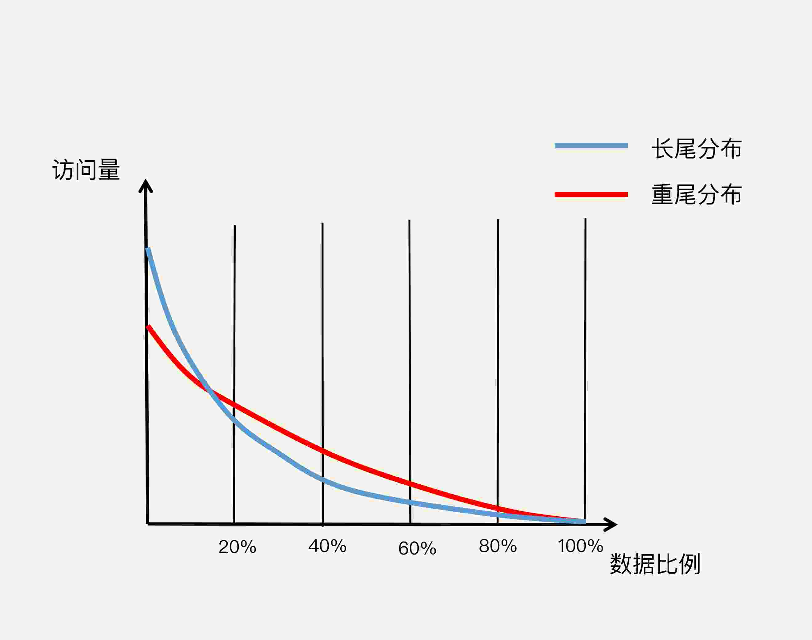

所以，如果按照“八二原理”来设置缓存空间容量，也就是把缓存空间容量设置为总数据量的 20% 的话，就有可能拦截到 80% 的访问。

正是因为 20% 的数据不一定能贡献 80% 的访问量，我们不能简单地按照“总数据量的 20%”来设置缓存最大空间容量。在实践过程中，我看到过的缓存容量占总数据量的比例，从 5% 到 40% 的都有。这个容量规划不能一概而论，是需要结合应用数据实际访问特征和成本开销来综合考虑的。

这其实也是我一直在和你分享的经验，系统的设计选择是一个权衡的过程：大容量缓存是能带来性能加速的收益，但是成本也会更高，而小容量缓存不一定就起不到加速访问的效果。一般来说，我会建议**把缓存容量设置为总数据量的 15% 到 30%，兼顾访问性能和内存空间开销**。

对于 Redis 来说，一旦确定了缓存最大容量，比如 4GB，你就可以使用下面这个命令来设定缓存的大小了：

```sh
$ CONFIG SET maxmemory 4gb
```

不过，**缓存被写满是不可避免的**。即使你精挑细选，确定了缓存容量，还是要面对缓存写满时的替换操作。

缓存替换需要解决两个问题：*决定淘汰哪些数据*，*如何处理那些被淘汰的数据*。

### Redis 缓存有哪些淘汰策略

**Redis 4.0 之前**一共实现了 6 种内存淘汰策略，在 **4.0 之后**，又增加了 2 种策略。

我们可以按照是否会进行数据淘汰把它们分成两类：

- 不进行数据淘汰的策略，只有 noeviction 这一种。
- 会进行淘汰的 7 种其他策略。

会进行淘汰的 7 种策略，我们可以再进一步根据淘汰候选数据集的范围把它们分成两类：

- 在设置了过期时间的数据中进行淘汰，包括 volatile-random、volatile-ttl、volatile-lru、volatile-lfu（Redis 4.0 后新增）四种。
- 在所有数据范围内进行淘汰，包括 allkeys-lru、allkeys-random、allkeys-lfu（Redis 4.0 后新增）三种。

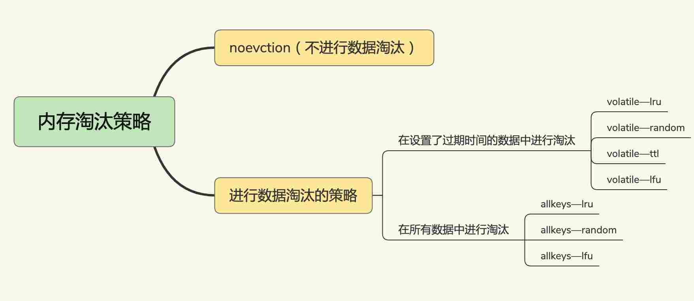

默认情况下，Redis 在使用的内存空间超过 `maxmemory` 值时，并不会淘汰数据，也就是设定的 `noeviction` 策略。对应到 Redis 缓存，也就是指，一旦缓存被写满了，再有写请求来时，Redis 不再提供服务，而是直*接返回错误*。Redis 用作缓存时，实际的数据集通常都是大于缓存容量的，总会有新的数据要写入缓存，这个策略本身不淘汰数据，也就不会腾出新的缓存空间，我们不把它用在 Redis 缓存中。

我们再分析下 volatile-random、volatile-ttl、volatile-lru 和 volatile-lfu 这四种淘汰策略。它们筛选的候选数据范围，被限制在已经设置了过期时间的键值对上。也正因为此，即使缓存没有写满，这些数据如果过期了，也会被删除。

例如，我们使用 EXPIRE 命令对一批键值对设置了过期时间后，无论是这些键值对的过期时间是快到了，还是 Redis 的内存使用量达到了 maxmemory 阈值，Redis 都会进一步按照 volatile-ttl、volatile-random、volatile-lru、volatile-lfu 这四种策略的具体筛选规则进行淘汰。

- volatile-ttl 在筛选时，会针对设置了过期时间的键值对，根据过期时间的先后进行删除，越早过期的越先被删除。
- volatile-random 就像它的名称一样，在设置了过期时间的键值对中，进行随机删除。
- volatile-lru 会使用 LRU 算法筛选设置了过期时间的键值对。
- volatile-lfu 会使用 LFU 算法选择设置了过期时间的键值对。

可以看到，volatile-ttl 和 volatile-random 筛选规则比较简单，而 volatile-lru 因为涉及了 LRU 算法，所以我会在分析 allkeys-lru 策略时再详细解释。volatile-lfu 使用了 LFU 算法，我会在第 26 讲中具体解释，现在你只需要知道，它是在 LRU 算法的基础上，同时考虑了数据的访问时效性和数据的访问次数，可以看作是对淘汰策略的优化。

相对于 volatile-ttl、volatile-random、volatile-lru、volatile-lfu 这四种策略淘汰的是设置了过期时间的数据，allkeys-lru、allkeys-random、allkeys-lfu 这三种淘汰策略的备选淘汰数据范围，就扩大到了所有键值对，无论这些键值对是否设置了过期时间。它们筛选数据进行淘汰的规则是：

- allkeys-random 策略，从所有键值对中随机选择并删除数据；
- allkeys-lru 策略，使用 LRU 算法在所有数据中进行筛选。
- allkeys-lfu 策略，使用 LFU 算法在所有数据中进行筛选。

这也就是说，如果一个键值对被删除策略选中了，即使它的过期时间还没到，也需要被删除。当然，如果它的过期时间到了但未被策略选中，同样也会被删除。

**LRU 算法**的全称是 Least Recently Used，从名字上就可以看出，这是**按照最近最少使用的原则来筛选数据**，最不常用的数据会被筛选出来，而最近频繁使用的数据会留在缓存中。

那具体是怎么筛选的呢？LRU 会把所有的数据组织成一个链表，链表的头和尾分别表示 MRU 端和 LRU 端，分别代表最近最常使用的数据和最近最不常用的数据。我们看一个例子。

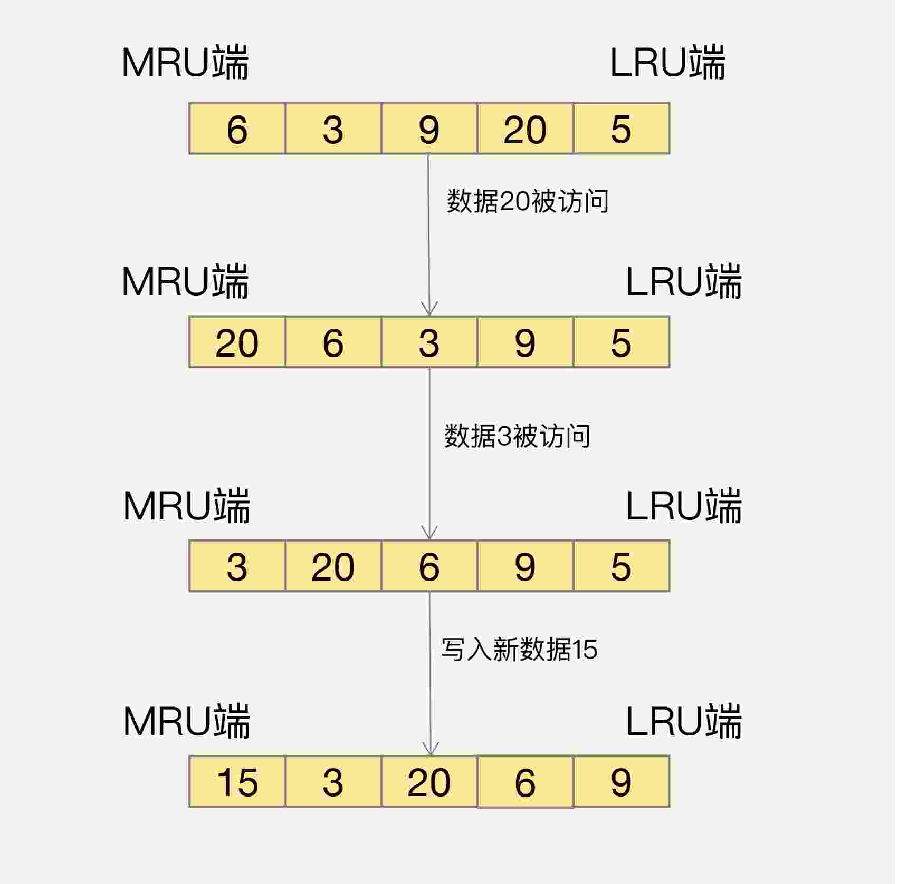

我们现在有数据 6、3、9、20、5。如果数据 20 和 3 被先后访问，它们都会从现有的链表位置移到 MRU 端，而链表中在它们之前的数据则相应地往后移一位。因为，LRU 算法选择删除数据时，都是从 LRU 端开始，所以把刚刚被访问的数据移到 MRU 端，就可以让它们尽可能地留在缓存中。

如果有一个新数据 15 要被写入缓存，但此时已经没有缓存空间了，也就是链表没有空余位置了，那么，LRU 算法做两件事：

- 数据 15 是刚被访问的，所以它会被放到 MRU 端；
- 算法把 LRU 端的数据 5 从缓存中删除，相应的链表中就没有数据 5 的记录了。

其实，LRU 算法背后的想法非常朴素：它认为刚刚被访问的数据，肯定还会被再次访问，所以就把它放在 MRU 端；长久不访问的数据，肯定就不会再被访问了，所以就让它逐渐后移到 LRU 端，在缓存满时，就优先删除它。

不过，LRU 算法在实际实现时，需要用链表管理所有的缓存数据，这会带来额外的空间开销。而且，当有数据被访问时，需要在链表上把该数据移动到 MRU 端，如果有大量数据被访问，就会带来很多链表移动操作，会很耗时，进而会降低 Redis 缓存性能。

所以，在 Redis 中，LRU 算法被做了简化，以减轻数据淘汰对缓存性能的影响。具体来说，Redis 默认会记录每个数据的最近一次访问的时间戳（由键值对数据结构 RedisObject 中的 lru 字段记录）。然后，Redis 在决定淘汰的数据时，第一次会随机选出 N 个数据，把它们作为一个候选集合。接下来，Redis 会比较这 N 个数据的 lru 字段，把 lru 字段值最小的数据从缓存中淘汰出去。

Redis 提供了一个配置参数 `maxmemory-samples`，这个参数就是 Redis 选出的数据个数 N。例如，我们执行如下命令，可以让 Redis 选出 100 个数据作为候选数据集：

```sh
$ CONFIG SET maxmemory-samples 100
```

当需要再次淘汰数据时，Redis 需要挑选数据进入第一次淘汰时创建的候选集合。这儿的挑选标准是：**能进入候选集合的数据的 lru 字段值必须小于候选集合中最小的 lru 值**。当有新数据进入候选数据集后，如果候选数据集中的数据个数达到了 `maxmemory-samples`，Redis 就把候选数据集中 lru 字段值最小的数据淘汰出去。

这样一来，Redis 缓存不用为所有的数据维护一个大链表，也不用在每次数据访问时都移动链表项，提升了缓存的性能。

好了，到这里，我们就学完了除了使用 LFU 算法以外的 5 种缓存淘汰策略，我再给你三个使用建议。

- **优先使用 allkeys-lru 策略**。这样，可以充分利用 LRU 这一经典缓存算法的优势，把最近最常访问的数据留在缓存中，提升应用的访问性能。如果你的业务数据中有明显的冷热数据区分，我建议你使用 allkeys-lru 策略。
- 如果业务应用中的数据访问频率相差不大，没有明显的冷热数据区分，建议使用 allkeys-random 策略，随机选择淘汰的数据就行。
- **如果你的业务中有置顶的需求**，比如置顶新闻、置顶视频，那么，可以使用 volatile-lru 策略，同时不给这些置顶数据设置过期时间。这样一来，这些需要置顶的数据一直不会被删除，而其他数据会在过期时根据 LRU 规则进行筛选。

### 如何处理被淘汰的数据

一般来说，一旦被淘汰的数据选定后，如果这个数据是干净数据，那么我们就直接删除；如果这个数据是脏数据，我们需要把它写回数据库，如下图所示：

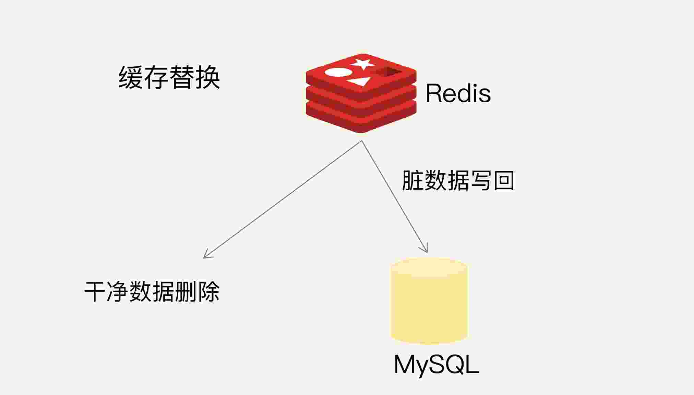

干净数据和脏数据的区别就在于，和最初从后端数据库里读取时的值相比，有没有被修改过。干净数据一直没有被修改，所以后端数据库里的数据也是最新值。在替换时，它可以被直接删除。

这么一来，缓存替换既腾出了缓存空间，用来缓存新的数据，同时，将脏数据写回数据库，也保证了最新数据不会丢失。

不过，对于 Redis 来说，它决定了被淘汰的数据后，会把它们删除。即使淘汰的数据是脏数据，Redis 也不会把它们写回数据库。所以，我们在使用 Redis 缓存时，如果数据被修改了，需要在数据修改时就将它写回数据库。否则，这个脏数据被淘汰时，会被 Redis 删除，而数据库里也没有最新的数据了。

### 每课一问

Redis 缓存在应对脏数据时，需要在数据修改的同时，也把它写回数据库，针对我们上节课介绍的缓存读写模式：只读缓存，以及读写缓存中的两种写回策略，请你思考下，Redis 缓存对应哪一种或哪几种模式？


## 25 | 缓存异常：如何解决缓存和数据库的数据不一致问题


